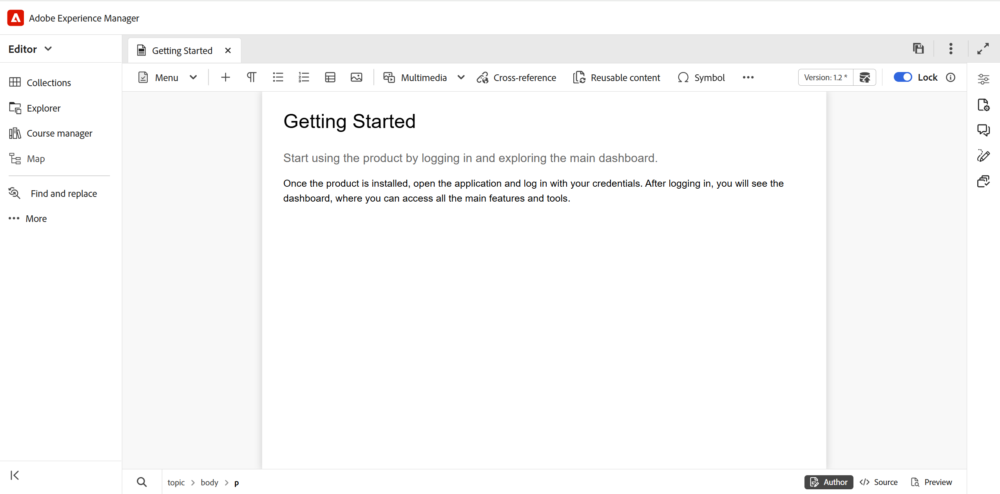
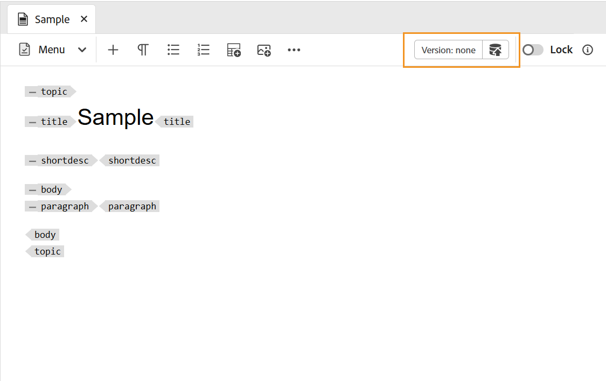

# トピックの作成 {#id2056AL00O5Z}

Adobe Experience Manager Guidesでは、トピック、タスク、コンセプト、参照、用語集、DITAVAL、Markdownなど、DITA トピックを作成できます。 すぐに使えるテンプレートを利用してトピックを作成するだけでなく、独自のテンプレートを定義することも可能です。 テンプレート選択ブループリントとエディターに表示するには、これらのテンプレートをフォルダープロファイルに追加する必要があります。

>[!NOTE]
>
> グローバルおよびフォルダープロファイル設定は、フォルダーレベルの管理ユーザーのみが使用できます。 グローバルレベルおよびフォルダーレベルのプロファイルの設定について詳しくは、「*オーサリングテンプレートの設定*」の「インストールと設定」を参照してください。

Experience Manager Guidesでトピックを作成するには、次の2つの方法があります。

- [エディターからのトピックの作成](#create-topics-from-the-editor)
- [Assets UIからのトピックの作成](#create-topics-from-the-assets-ui)

## エディターからのトピックの作成

エディターからトピックを作成するには、次の手順を実行します。

1. リポジトリパネルで、**新規ファイル** アイコンを選択し、ドロップダウンメニューから&#x200B;**トピック**&#x200B;を選択します。

   {width="500"}

   このオプションには、[Experience Manager Guidesのホームページ &#x200B;](./intro-home-page.md)と、リポジトリビューのフォルダーのオプションメニューからアクセスすることもできます。

2. **新しいトピック** ダイアログボックスが表示されます。

3. **新しいトピック** ダイアログボックスで、次の詳細を入力します。
   - トピックのタイトル。
   - \（Optional\）* トピックのファイル名。 ファイル名は、トピックタイトルに基づいて自動的に提案されます。 管理者がUUID設定に基づいて自動ファイル名を有効にしている場合、「名前」フィールドは表示されません。
   - トピックのベースとなるテンプレート。 例えば、標準の設定では、「空白」、「概念」、「DITAVAL」、「参照」、「タスク」、「トピック」、「マークダウン」、「用語集」、「トラブルシューティング」の各テンプレートから選択できます。 フォルダーにフォルダープロファイルが設定されている場合は、フォルダープロファイルで設定されているトピックテンプレートのみが表示されます。
   - トピックファイルを保存するパス。 デフォルトでは、リポジトリで現在選択されているフォルダーのパスが「パス」フィールドに表示されます。

4. 「**作成**」を選択します。

   {width="300"}

トピックは、指定したパスで作成されます。 また、トピックは編集のためにエディターで開かれます。

## Assets UIからのトピックの作成

Assets UIからトピックを作成するには、次の手順を実行します。

1. Assets UIで、トピックを作成する場所に移動します。

1. 新しいトピックを作成するには、**作成** \> **DITA トピック**&#x200B;を選択します。

1. ブループリントページで、作成するDITA ドキュメントのタイプを選択し、**次へ**&#x200B;を選択します。

   

   デフォルトでは、Experience Manager Guidesは最も一般的に使用されるDITA トピックテンプレートを提供します。 組織の要件に応じて、さらにトピックテンプレートを設定できます。詳しくは、「*オーサリングテンプレートの設定*」を参照してください。Adobe Experience Manager Guidesをインストールして設定します。

   >[!NOTE]
   >
   > Assets UIのリストビューでは、DITA トピックタイプは、トピック、タスク、コンセプト、参照、Glossentry、Markdown、またはDITAVALとしてType列に表示されます。 DITA マップはマップとして表示されます。

1. プロパティ ページで、文書&#x200B;**タイトル**&#x200B;を指定します。

1. \（Optional\） ファイル **Name**&#x200B;を指定します。

   管理者がUUID設定に基づいて自動ファイル名を設定している場合、ファイル名を指定するオプションは表示されません。 UUID ベースのファイル名が自動的にファイルに割り当てられます。

   ファイルの命名オプションが使用可能な場合は、ドキュメントの&#x200B;**タイトル**&#x200B;に基づいて名前も自動的に提案されます。 文書名を手動で指定する場合は、**Name**&#x200B;にスペース、アポストロフィ、または中括弧が含まれておらず、.xmlまたは.ditaで終わっていることを確認してください。 デフォルトでは、Experience Manager Guidesはすべての特殊文字をハイフンに置き換えます。 DITA ファイルの命名に関するベストプラクティスについては、ベストプラクティスガイドの「ファイル名」セクションを参照してください。

1. 「**作成**」を選択します。 トピック作成メッセージが表示されます。

   エディターで編集するトピックを開くか、Adobe Experience Manager リポジトリにトピックファイルを保存するかを選択できます。

**追加情報**

1. Assets UI **Create** \> **DITA トピック**&#x200B;またはEditorから作成したすべての新しいトピックには、一意のトピック IDが割り当てられます。 このIDの値は、ファイル名そのものです。 また、新しいドキュメントは、DAMでトピックの最新の作業コピーとして保存されます。 新しく作成したトピックのリビジョンを保存するまで、バージョン履歴にバージョン番号は表示されません。 編集のためにトピックを開くと、バージョン情報がツールバーの右上隅に表示されます。

   {width="550"}

2. 新しく作成されたトピックのバージョン情報は&#x200B;*none*&#x200B;として表示されます。 新しいバージョンを保存すると、バージョン番号が1.0として割り当てられます。

3. 管理者が編集前にファイルをロックするようにエディターを設定している場合、ファイルをロックするまで編集できません。 同様に、設定されている場合は、ロックされたファイルを閉じる前にロック解除するように求められます。

4. DITA トピックを作成したら、作業コピーへの変更を保存し続け、トピックの更新が完了したら新しいバージョンを作成します。

**親トピック：**&#x200B;[&#x200B; トピックの作成とプレビュー](create-preview-topics.md)
