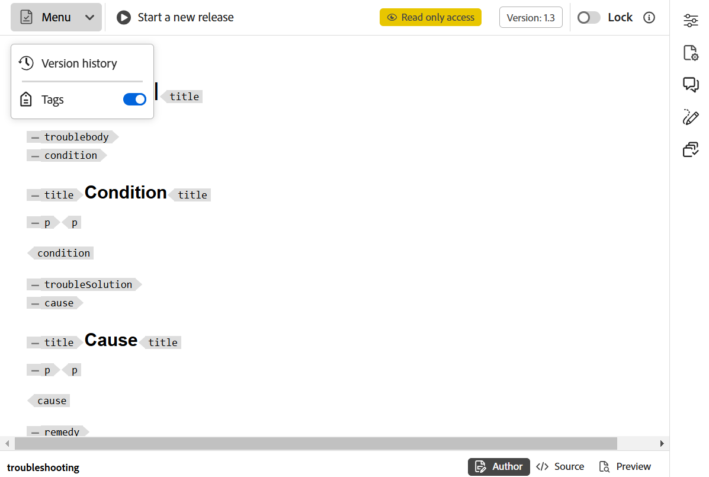

# ドキュメントの状態 {#id1821HC00URO}

ドキュメントの準備状況を管理するために、Adobe Experience Manager Guidesにはドキュメントの現在のステータスを示すドキュメントステートプロパティが用意されています。 ドキュメントの状態は、ドキュメントが新規状態、レビュー中状態、またはレビュー完了状態かどうかを素早く確認するのに役立ちます。

## ドキュメント状態のタイプ

ドキュメントには、**ドキュメントの状態** プロファイルで定義された任意のドキュメントの状態を含めることができます。 例えば、ドキュメントには次のいずれかのドキュメント状態があります。

- ドラフト – ドキュメントが作成され、新しい変更と共に保存されることを示します。
- レビュー中 – ドキュメントのレビューワークフローが開始されたことを示します。
- レビュー済み – ドキュメントが対象ユーザーによってレビューされたことを示します。

これらの状態は、ドキュメントの状態プロファイルの設定に従って、手動または自動で設定されます。 例えば、ドキュメント状態プロファイルが開始状態がドラフトとして設定されていて、レビュー中のドキュメントに対してレビュー中状態が定義されている場合です。 ドキュメントを作成すると、ドキュメントの状態は *ドラフト* に設定されます。 レビュータスクを開始すると、ドキュメントの状態はレビュー中に変更されます。

また、1 つまたは複数のドキュメントのドキュメントの状態を手動で変更することもできます。 ただし、複数のドキュメントのドキュメントの状態を変更する場合は、選択したドキュメントで許可される共通の状態によって、許可される状態が決まります。 例えば、ドキュメントの状態をドラフト、レビュー中、レビュー済み、公開準備完了と同じ順序で定義したとします。 文書 1.dita では状態が *ドラフト* に設定され、文書 2.dita では状態がレビュー済みに設定されます。 one.dita と two.dita の両方を選択した場合、許可された文書状態は *公開準備完了* になります。 two.dita は *Reviewed* 状態であるため、次に考えられる two.dita の状態は *Ready to Publish* のみになります。これは、両方の文書を選択したときに表示されます。

>[!NOTE]
>
> ドキュメントは一度に 1 つの状態にしか存在できません。

## エディターからのドキュメントの状態の変更

ドキュメントの状態を変更するには、次の手順を実行します。

1. エディターでドキュメントを開き、右側のパネルから「ファイルのプロパティ」を選択します。
1. ファイルのプロパティパネルで、「ドキュメントの状態 **ドロップダウンから新しい状態** を選択します。 選択できるのは、ドキュメントの状態プロファイルの「状態のトランジション」セクションで許可されているドキュメントの状態のみです。

   >[!NOTE]
   >
   >管理者は、すべてのドキュメントの状態を表示し、ドキュメントを可能な任意の状態に変更できます。

1. 確認プロンプトで **保存** を選択します。

## Assets UI からのドキュメントステートの変更

1. Assetsの UI で、文書のステータスを変更する 1 つ以上の文書を選択します。
1. メインツールバーで、「**プロパティ**」を選択します。
1. **ドキュメントの状態** ドロップダウンから新しい状態を選択します。 選択できるのは、ドキュメントの状態プロファイルの「状態のトランジション」セクションで許可されているドキュメントの状態のみです。

   >[!NOTE]
   >
   >管理者は、すべてのドキュメントの状態を表示し、ドキュメントを可能な任意の状態に変更できます。

1. 「**保存して閉じる**」を選択します。

### ドキュメントの状態の表示

Assets UI のカードビューには、現在のステートと、それぞれの DITA トピックまたは DITA マップの作成日とサイズが表示されます。

{align="left"}

## DDLC でのドキュメント状態の使用

ドキュメント状態は、DDLC でのドキュメントのライフサイクルを管理する上で重要な役割を果たします。 組織が DDLC を厳密に遵守している場合、ドキュメントの状態に基づいて編集を制御するメカニズムの使用は不可欠な機能になります。 例えば、ドキュメントが *ドラフト* 状態または *レビュー中* 状態の場合に編集を許可することができます。 ただし、ドキュメントがレビューされて公開の準備が整ったら、ドキュメントがそれ以上変更されないようにする方法が必要です。

Experience Manager Guidesには、ドキュメント開発プロセスのライフサイクルを制御するのに役立つドキュメント承認ワークフローが用意されています。 ドキュメントの公開準備が整ったり、ドキュメントが最後から 2 番目の状態に達したりしたら、そのドキュメントを承認済みとしてマークできます。 ドキュメントが承認されると、Experience Manager Guidesは新しいバージョンのドキュメントを作成し、読み取り専用にします。 その後、公開用にドキュメントを移動したり、さらに処理するためのベースラインを作成したりできます。

承認済みとしてマークされたドキュメントから新しいリリースを開始するには、作成者は新しいリリースを開始する必要があります。 新しいリリースを開始すると、ドキュメントの状態が再び *ドラフト* に変更されます。 ドキュメントの状態を *ドラフト* に変更すると、ドキュメントが再び編集可能になり、次のリリースで作業を続行できます。

ドキュメント承認機能を使用するには、次の手順を実行します。

>[!NOTE]
>
> 承認ワークフロー機能は、管理者が有効にする必要があります。 詳しくは、「Adobe Experience Manager Guides as a Cloud Serviceのインストールと設定 *の「承認ワークフローを有効にする* 節を参照してください。

1. エディターで、承認用にマークするドキュメントを開きます。

1. **承認済みとしてマーク** アイコンを選択します。

1. ドキュメントが承認済みとしてマークされる状態の場合、次のダイアログが表示されます。

   {width="300" align="left"}

   ドキュメントを承認済みとしてマークできない場合は、次のメッセージが表示されます。

   {width="300" align="left"}

1. ドキュメントを「承認済み」としてマークする準備が整ったら、ドロップダウンリストからラベルを選択し、「**承認**」を選択します。

   >[!NOTE]
   >
   > 管理者がラベルの定義済みリストを設定していない場合は、ラベルを入力するための自由形式のテキストフィールドが表示されます。

1. ドキュメントが承認済みとして正常にマークされると、ドキュメントの **プレビュー** が読み取り専用モードで表示されます。 オーサー、Source、プレビューの 3 つのモードすべてから、編集オプションがすべて削除されます。 ただし、**バージョン履歴** および **タグ** オプションを備えた **メニュー** ドロップダウンには引き続きアクセスできます。

   {width="650" align="left"}

   >[!NOTE]
   >
   > プレビューモードで、「バージョン履歴」オプションと「タグ」オプションを表示する「メニュー」ドロップダウンがツールバーから削除されます。

ドキュメントが承認済みとしてマークされると、編集できなくなります。 次回のリリースでドキュメントを使用する場合は、ドキュメントを *ドラフト* 状態に戻す必要があります。 承認済みドキュメントのドキュメント状態を *ドラフト* モードに戻すには、次の手順を実行します。

1. 承認済みのドキュメントで、「**新しいリリースを開始**」アイコン  タンを選択します。

   新しいリリースを開始メッセージが表示されます。

1. 「**確認**」を選択します。

   ドキュメントの状態がドラフトに変更され、ドキュメントが編集モードでエディターで開かれます。

**親トピック：**[ エディターの概要 ](web-editor.md)
