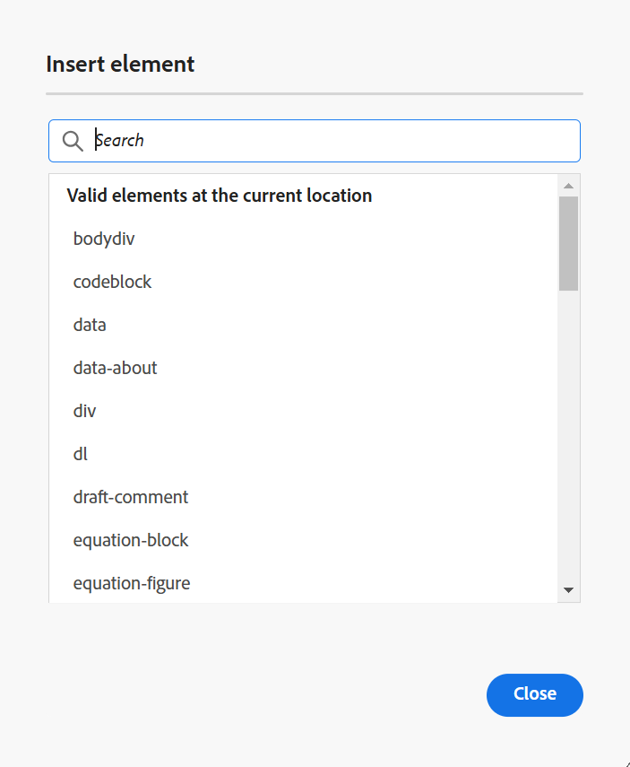

# エディターでのトピックの編集 {#id2056B040VUI}

>[!INFO]
>
>このトピックは、新しいエディターと古いエディターの両方に適用されます。 コア機能は一貫していますが、ユーザーインターフェイス、用語、インタラクションの違いは、該当する場合はタブとコールアウトを使用してコンテンツ内に示されます。

エディターには、トピックファイルを簡単に作成または変更できる様々な編集機能が用意されています。 一般的には、次の手順を実行して、エディターでトピックを編集します。

>[!IMPORTANT]
>
> エディターの作業中にアプリケーションエラーが発生した場合は、ページを更新して作業を続行します。

>[!BEGINTABS]

>[!TAB 新しいエディター]

1. トピック内のエレメントを編集または挿入するには、必要なエレメントのテキスト境界内をクリックして変更するか、新しいエレメントを追加するエレメントの末尾にカーソルを置き、ツールバーから必要なエレメントを選択します（またはAlt+1を押してエレメントを挿入ポップアップを開きます）。これにより、トピック内のその場所の有効なエレメントのみがインテリジェント一覧表示および挿入されます。

1. さらに、クイック挿入メニューを使用して、カーソル位置に許可された要素を簡単に挿入できます。 Windowsの場合は&#x200B;**Control + /**、Macの場合は&#x200B;**Command + /**&#x200B;を選択して、エレメントにアクセスします。

   {width="650"}

   クイック挿入メニューを使用して新しいエレメントを検索するか、お気に入りからエレメントを選択し、現在のカーソル位置に挿入します。 お気に入りには、最も頻繁に使用される要素が含まれ、現在のカーソルの場所に有効な要素のみが表示されます。 この機能を有効または無効にし、[ エディター設定](./config-editor-settings.md)で利用できるクイック挿入メニューを使用して、挿入するお気に入りの要素を設定できます。

>[!TAB 古いエディター]

1. トピックを変更するには、必要な要素のテキスト境界内をクリックし、編集を開始します。

1. 特定のエレメントを挿入するには、新しいエレメントを挿入するエレメントの末尾にカーソルを移動し、ツールバーで必要なエレメントアイコンを選択します。 キーボードショートカット `Alt+1`を使用して、**エレメントを挿入** ポップアップを呼び出すこともできます。

   トピックで使用できる要素のリストが表示されます。 Experience Manager Guidesは、トピック内の有効な場所に従って、エレメントをインテリジェントに配置します。

   >[!NOTE]
   >
   > ツールバーに表示するアイコンを選択するには、- `/etc/designs/fmdita/clientlibs/xmleditor/`にある`ui_config.json` ファイルを設定します。 機能のカスタマイズについて詳しくは、システム管理者にお問い合わせください。

1. ドキュメントの編集が完了したら、**すべて保存**&#x200B;を選択します。

   >[!NOTE]
   >
   > Adobe Experience Manager リポジトリに変更を確定しない場合は、**閉じる**&#x200B;を選択し、保存せずに&#x200B;**閉じる**&#x200B;を保存ダイアログで選択します。

>[!ENDTABS]

## 要素をまたいだコンテンツの部分的な選択

Experience Manager Guidesでは、複数の要素からコンテンツを選択することもできます。 コンテンツを選択したら、次の操作を実行できます。

- 書式設定：選択したコンテンツの書式設定は、以下に示すように、エディター1.0と比較して新しいエディターで大幅に簡単です。

>[!BEGINTABS]

>[!TAB 新しいエディター]

コンテキストツールバーを使用して、選択したコンテンツを太字、斜体、または下線として書式設定できます。 コンテンツを選択し、表示されるメニューで適切な書式設定アイコンをクリックします。 選択したコンテンツを太字、斜体、または下線にします。 有効なオープンタグのコンテンツが結合され、1つの要素の下に表示されます。

{width="650"}

>[!TAB 古いエディター]

選択したコンテンツを太字、斜体、選択したコンテンツに下線を引きます。 有効なオープンタグのコンテンツが結合され、1つの要素の下に表示されます。 例えば、段落内のコンテンツを選択し、選択範囲を別の段落に拡張できます。 次に、選択したコンテンツを太字にすると、開いているタグのすべての太字コンテンツが結合され、1つの段落エレメントの下に表示されます。

>[!ENDTABS]

- 削除：選択したコンテンツを削除すると、開いているタグの削除後の残りのコンテンツが結合されます。

- コンテンツを有効な要素で囲む：次の手順を実行して、コンテンツを有効な要素でラップします。

   - エレメント内のコンテンツを選択します。
   - 上部のツールバーから アイコンを選択して、**要素を挿入** ダイアログボックスを表示します。 ダイアログボックスには、選択したコンテンツの有効な要素が一覧表示されます。

     >[!NOTE]
     >
     > 選択したコンテンツのコンテキストメニューを選択して、エレメントを挿入ダイアログボックスを表示することもできます。

   - ダイアログボックスからエレメントを選択します。 選択したコンテンツはその要素の下にラップされます。 例えば、段落内のコンテンツを選択し、**エレメントを挿入** ダイアログボックスから`<note>` エレメントを選択すると、選択したコンテンツがメモの下に表示されます。

      {width="300"}

## ファイルの編集中にブラウザーを更新する

Experience Manager Guidesでは、エディターでコンテンツを編集する際にブラウザーを更新するサポートが提供されています。 この機能は、作業中にアプリケーションエラーが発生した場合に備えて、コンテンツの編集を続行するのに役立ちます。 未保存の変更を含む1つ以上のファイルを編集用に開いている間にブラウザーの更新を押すと、未保存の変更が失われる可能性があると警告されます。 更新操作をキャンセルし、ファイルを保存して変更を保持するオプションが表示されます。

ブラウザーを更新しても、左パネルと右パネルのビューはエディターに保持されます。 Experience Manager Guidesは、ブラウザーを更新したときにエディターで開いたファイルの最後に保存されたステートを復元します。 例えば、リポジトリパネルで開いたファイルが再度開かれます。 マップパネルは、以前に開いたマップと一緒に保持されます。

アクティブなトピックまたはDITA マップがコンテンツ編集領域で再度開きます。

右側のパネルも再び開かれ、更新前と同じビューが表示されます。

## 作業用コピーインジケーター

Experience Manager Guidesには、ファイルの現在の\（作業コピー\）が保存済みバージョンと同期しているかどうかを示す作業コピーインジケーターが表示されます。 現在のコピーに変更を加え、ファイルを保存していない場合は、トピックの「ファイル」タブにタイトルと共に「*」マークが表示されます。 このインジケーターは、変更を保存するためのリマインダーとして機能し、ファイルを保存すると消えます。

>[!BEGINTABS]

>[!TAB 新しいエディター]

このビューでは、新しいエディターでのコンテンツのレンダリング方法が表示されます。

{width="550"}

>[!TAB 古いエディター]

このビューでは、古いエディターでのコンテンツのレンダリング方法が表示されます。

{width="550"}

>[!ENDTABS]

Experience Manager Guidesは、ファイルの最後に保存された\（working\）コピーが保存済みのバージョンと同期しているかどうかも示します。 作業コピーと最後に保存されたバージョンの間に保存されていない変更がある場合は、「\*」マークが表示され、トピックの「ファイル」タブの右上隅に表示されるバージョン情報が表示されます。 このインジケーターは、ファイルの現在の\（working\）コピーからバージョンを保存して作成するためのリマインダーとして機能します。

>[!NOTE]
>
> [ ファイルプロパティ ](./web-editor-right-panel.md#file-properties)で使用可能なメタデータフィールドへの変更、またはバックエンドで適用されたメタデータフィールドへの変更は、ドキュメントバージョンのアスタリスク `(*)`もトリガーします。  システム生成のメタデータ更新がこのインジケーターに影響を与えるのを防ぐために、管理者はメタデータプロパティの無視リストを設定できます。 メタデータプロパティの設定方法について詳しくは、[ メタデータプロパティの無視リストの設定](../install-conf-guide/conf-metadata-prop.md)を参照してください。

>[!BEGINTABS]

>[!TAB 新しいエディター]

{width="650"}

>[!TAB 古いエディター]

{width="650"}

>[!ENDTABS]

## 作成者モードとSource モードでロックされたファイルにアクセス

DITAまたはMarkdown ファイルが他のユーザーによってロックまたはチェックアウトされている場合、コンテンツの編集または変更はできません。 ただし、**Preview** モードに加えて、**Author**&#x200B;と&#x200B;**Source** モードの両方で、読み取り専用フォーマットでファイルを表示できます。

読み取り専用モードでは、**作成者**&#x200B;または&#x200B;**Source** モード内のコンテンツ、タグ、属性を表示できます。 ファイルのプロパティを変更することもできます。

>[!NOTE]
>
> 管理者は、他のユーザーによってロックされているファイルをロック解除できる&#x200B;**強制的にロック解除**&#x200B;機能にアクセスできます。

<!-- This is no more available -->
<!--
The toolbar displays the following icons for read-only access:

- Toggle Tags view
- Version History
- Version Label

Experience Manager Guides also displays a **Read only access** indicator near the version number.
 

You can access the **Layout** view for read-only DITA maps. This view lets you see the DITA map and its properties but prevents edits.

>[!NOTE]
>
> Your folder-level administrative users must update *ui_config.json* so that you can harmoniously access the read-only files in the  Author, Source, and Layout modes.

 -->

## エクスプローラーで開いているファイルを見つける

エディターでファイルを開くと、Experience Manager Guidesには、エクスプローラーでファイルを検索する機能が用意されています。 例えば、編集中に現在のトピックが検索されます。

この機能をオフにすると、**ユーザー設定**&#x200B;の「**アピアランス**」タブから「**常にエクスプローラー**」オプションでファイルを検索できます。

>[!NOTE]
>
>2025.11.0 リリースから、設定&#x200B;**常にリポジトリ内のファイルを検索**&#x200B;は、**常にエクスプローラー内のファイルを検索**&#x200B;という名前に変更されました。 オンプレミス設定の場合は、Experience Manager Guidesの5.1 リリースまで、「常にリポジトリ内のファイルを探す」として引き続き使用できます。

**親トピック：**[&#x200B;編集者との共同作業](web-editor.md)
