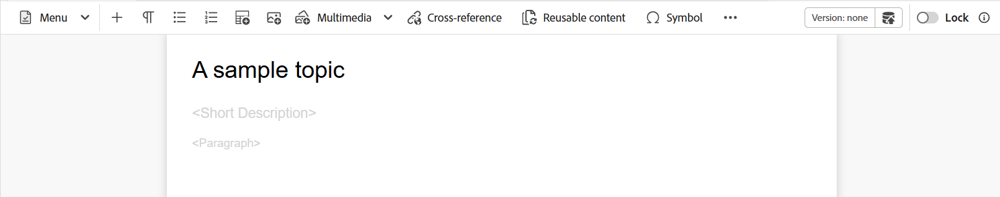
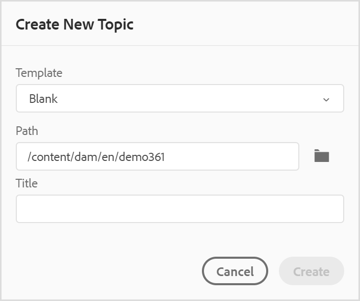

# Web エディターの機能の理解 {#id176NC500V5Z}

この節では、web エディターで使用できる様々な機能について説明します。 Web エディターは、次のセクションまたは領域に分割できます。

- [メインツールバー](#id2051EA0G05Z)
- [セカンダリツールバー](#id2051EA0J0Y4)
- [左パネル](#id2051EA0M0HS)
- [コンテンツ編集領域](#id2051EB000UI)
- [右側のパネル](#id2051EB003YK)

次のサブセクションでは、Web エディターの様々なセクションについて詳しく説明します。

## メインツールバー {#id2051EA0G05Z}

メインツールバーは Web エディターのインターフェイスの上部にあり、Web エディターで使用できるファイルレベルの機能と様々なオーサリングモードを提供します。 上部のツールバーで使用できる機能は次のように説明されています。

**すべて保存** - 

開いているすべてのトピックへの変更を保存します。 Web エディタで複数のトピックを開いている場合は、 **すべて保存** または使用 **Crtl**+**S** ショートカット キーを使用すると、すべてのドキュメントをワンクリックで保存できます。 各ドキュメントを個別に保存する必要はありません。

>[!NOTE]
>
> 保存操作では、トピックの新しいバージョンは作成されません。 新しいバージョンを作成するには、「新しいバージョンとして保存」を選択します。

**新しいバージョンとして保存** - 

トピックに加えた変更を保存し、トピックの新しいバージョンを作成します。 新しく作成したトピックに取り組んでいる場合、バージョン情報はと表示されます **なし**.

{width="800" align="left"}

トピックまたはマップ ファイルに対して新しいバージョンが作成されるたびに、バージョン番号が変わります。

を使用してトピックまたはマップを保存するとき **新しいバージョンとして保存**&#x200B;すると、次のダイアログが表示されます。

{width="300" align="left"}

コメントとバージョン ラベルを入力して変更を識別し、 **保存** でファイルの新しいバージョンを作成します。

を選択した場合 *新しいバージョンとして保存*&#x200B;の場合、トピックの最初のバージョンが DAM に作成され、これもトピックの現在アクティブなバージョンになります。 その後、トピックを古いバージョンに戻すと、そのバージョンが現在のアクティブなバージョンになります。

管理者が事前設定済みのバージョンラベルを持っている場合は、それらのラベルがドロップダウンリストに表示されます。 使用可能なラベルのリストからラベルを選択し、ドキュメントを保存できます。

{width="300" align="left"}

トピックの保存時に、トピックに加えた変更を指定するコメントを追加できます。 このコメントは、トピックのバージョン履歴に表示されます。

トピックがレビュー中の場合は、レビュー担当者に、新しいバージョンのトピックが使用可能であることを示す通知が表示されます。 ドキュメントの最新バージョンに簡単にアクセスでき、トピックの最新バージョンを引き続き確認できます。

トピックのタイトルの上にポインタを合わせると、ファイルパスとバージョン番号が表示されます。

{width="800" align="left"}

>[!NOTE]
>
> トピックのバージョンが使用可能になったら、トピックにラベルを追加することもできます。 これらのラベルを使用して、ドキュメントの特定のバージョンを公開するためのベースラインを作成できます。 トピックでラベルを使用する方法については、を参照してください。 [ラベルを使用](web-editor-use-label.md#).

**取り消しとやり直し** -  / 

最後の操作を取り消しまたはやり直します。

**要素を削除** - 

現在選択されている要素またはカーソルが置かれている要素を削除します。

**検索と置換** - 

検索と置換機能は、オーサービューモードとソースビューモードで使用できます。 検索と置換のテキスト バーが、トピック編集領域の下部に表示されます。 ショートカットキーを使用できます **CTRL**+**金** をクリックして、「検索と置換」バーを呼び出します。

{width="800" align="left"}

設定アイコン\（\）を選択します **大文字と小文字を区別しない** および **単語全体のみ** 検索オプション。 大文字と小文字を区別しない検索を実行するには、\（または select\）をオンにします。 **大文字と小文字を区別しない** オプション。 大文字と小文字を区別して検索する場合は、\（または選択解除\）をオフにします。 **大文字と小文字を区別しない** オプション。 単語全体を検索することもできます。

検索は即時に行われます。つまり、 **検索** フィールドに設定した場合、検索語句は即座に検索され、トピック内で選択されます。 同様に、トピック内のテキストを置換する場合は、検索語句とその置換を各フィールドに入力し、をクリックします **置換** または **すべて置換** ボタン。

「ソース」ビューの「検索と置換」は、特定の要素または属性を検索する場合に非常に便利です。 例えば、の値 `@product` 属性の場合は、ソース ビューから簡単に実行できます。 オーサービューでは、属性または要素に基づいて検索することはできません。 ただし、を使用する際は注意が必要です **すべて置換** XML コードを上書きする可能性があるなどの機能です。

**エディター設定** - 

エディター設定は、管理者ユーザーのみが使用できます。 管理者は、環境設定を使用して次の設定を行うことができます。

>[!NOTE]
>
> デフォルトの設定を更新する場合は、変更を有効にするためにドキュメントを再度開く必要があります。

- **一般**：一般設定を使用すると、web エディターで使用する辞書を設定できます。 このタブには、次の 3 つのセクションがあります。 **スペルチェック**, **条件**、および **オーサリング**.

  {width="650" align="left"}

   - **スペルチェック**:2 つのオプションがあります。 **AEM スペルチェック** および **ブラウザースペルチェック**. デフォルトでは、エディターはブラウザースペルチェック機能を使用し、スペルチェックはブラウザーの組み込み辞書を使用して実行されます。 AEM スペルチェックに切り替えて、AEM辞書を使用することができます。また、これをカスタマイズして、カスタムの単語リストを追加することもできます。 AEM ディクショナリのカスタマイズについて詳しくは、 *AEMのデフォルトディクショナリのカスタマイズ* Adobe Experience Manager Guidesas a Cloud Service版のインストールと設定の節です。


   - **条件**

      - **オーサービューで条件付きテキストをハイライト表示**：オーサービューで条件テキストをハイライト表示するには、これを選択します。 条件付きコンテンツは、条件用に定義されたカラーを使用してハイライト表示されます。

      - **条件属性を使用して検証**：属性に対して定義された値の検証を許可する場合に選択します。 これにより、誤った値を追加するのを防ぐことができます。

      - **件名スキーム パネルにタイトル付きのキーを表示する**：件名スキームでタイトルと共にキーを表示するには、これを選択します。 このオプションを選択しない場合は、タイトルのみが表示されます。 例えば、ここでは「os」、「audience」、「other」のキーもタイトルと共に表示されます。

        {width="550" align="left"}

      - **条件パネルに件名スキームを表示する**：条件パネルに件名スキームを表示するには、これを選択します。 選択を解除すると、定義された条件が条件パネルに表示されます。

   - **オーサリング**

      - **すべて置換を有効にする**：検索と置換パネルで「すべて置換」アイコンを表示するには、これを選択します。


   - **引用**
引用のスタイルを変更します。 プロジェクトで使用する引用スタイルをドロップダウンから選択します。 詳しくは、次を参照してください [引用スタイルの変更](./web-editor-apply-citations.md#change-citation-style).


**パネル**：この設定は、エディターの左側のパネルに表示されるパネルを制御します。 スイッチを切り替えて、目的のパネルの表示と非表示を切り替えることができます。

{width="650" align="left"}

>[!NOTE]
>
> カスタムパネルが設定されている場合は、パネルのリストにも表示されます。 スイッチを切り替えて、カスタムパネルの表示と非表示を切り替えることができます。 設定について詳しくは、 *左側のパネルでのカスタムパネルの設定* Adobe Experience Manager Guidesas a Cloud Service版のインストールと設定の節です。

- **要素リスト**：管理者は、を使用して、作成者が挿入できる要素のリストを制御できます [要素を挿入](#id204SG30105Z) ポップアップで、要素の表示名も定義します。 「エレメントリスト」設定では、DITA 仕様に従ってエレメントの名前を指定し、DITA 定義のエレメント名の代わりに使用するラベルを指定できます。

  {width="650" align="left"}

上のスクリーンショットでは、 `b` 要素には太字のラベルが付けられています。 `codeblock` には、他の要素と共にコードブロックのラベルが付けられます。 を選択した場合、 **上記の要素のみを使用** を選択すると、このリストの有効な要素\（現在の挿入ポイント\）のみが要素を挿入ポップアップに表示されます。

次のスクリーンショットでは、前のスクリーンショットで設定された 4 つの要素のうち、現在のコンテキストで 3 つの要素のみが表示されます。

{width="300" align="left"}

- **属性リスト**：要素リストと同様に、要素の属性リストに表示する属性とその表示名のリストを制御できます。 次のスクリーンショットでは、要素の属性リストに表示されるように設定されている属性は 3 つだけです。

  {width="650" align="left"}

  この設定では、要素に属性を追加しようとすると、リストで設定された属性のリストのみが表示されます。

  {width="300" align="left"}

- **プロファイルを公開**：このには、を公開するために使用できる公開プロファイルが含まれています **ナレッジベース** 出力。 ターゲットのナレッジベース用に新しいプロファイルを作成できます。 例えば、Salesforce や ServiceNow です。

   - **Salesforce 公開プロファイルの作成**

     **前提条件**

      - Salesforce 用の接続アプリケーションを作成します。 詳しくは、こちらを参照してください。 [API 統合用に OAuth 設定を有効にする](https://help.salesforce.com/s/articleView?id=sf.connected_app_create_api_integration.htm&amp;type=5).

      - 接続アプリケーションを設定する際は、次の点を確認します。

         - コールバックを指定します。

           `URL: http://<server name>:<port>/bin/dxml/thirdparty/callback/salesforce`

         - 次の OAuth 範囲を選択します。
            - フルアクセス （フル）
            - 「API を使用してユーザーデータを管理」を選択します（api）

  アプリを設定すると、Salesforce が以下を提供します。 **消費者キー** および **消費者秘密鍵**.

  これらを使用して、Salesforce パブリッシュプロファイルを作成できます。


   - Salesforce 公開プロファイルを作成するには、 **Salesforce** からのナレッジベース **サーバータイプ** ドロップダウン。 プロファイル名を入力します。 が含まれる **サイト URL**&#x200B;を開き、出力の公開に使用する消費者サイトを入力して、 **消費者キー** および **消費者秘密鍵** salesforce 消費者サイトによって提供されます。 その後、 **Validate** および **保存** 新しく作成されたプロファイル。
     {width="550" align="left"}

     >[!NOTE]
     >
     >Experience Managerガイドで Salesforce のプロキシを設定するには、AEMで Apache HTTP Components Proxy Configuration を使用します。 方法を学ぶ [AEM リンクチェッカーのプロキシの設定](https://helpx.adobe.com/experience-manager/kb/How-to-configure-proxy-for-the-AEM-Link-Checker-AEM.html).


   - **ServiceNow 公開プロファイルの作成**

     **前提条件**

     アセットをアップロードするように ServiceNow サーバーを設定します。
      - をに接続します **ServiceNow** サーバー。
      - に移動します。 **システムプロパティ** > **セキュリティ**.
      - 次のオプションのチェックを外します。

        **このプロパティは、アップロード（すべてのバージョンの Eureka 以降）の MIME タイプチェックを有効にするように設定する必要があります。 添付ファイルの MIME タイプ検証を有効（true）または無効（false）にします。 glide.attachment.extensions で設定されたファイル拡張子は、アップロード中に MIME タイプがチェックされます。**

      - 「**保存**」をクリックします。

     アプリを設定したら、以下を作成します。 **ServiceNow** プロファイルを公開。
   - パブリッシュプロファイルを作成するには、ServiceNow ナレッジベースを次から選択します。 **サーバータイプ** ドロップダウン。 プロファイルを入力 **名前**. が含まれる **ServiceNow URL**&#x200B;を開き、出力の公開に使用する消費者サイトを入力して、 **ユーザー名** および **パスワード** serviceNow 消費者サイトによって提供されます。 その後、 **Validate** および **保存** 新しく作成されたプロファイル。

     {width="550" align="left"}

  検証後、DITA Map の出力プリセットでパブリッシュプロファイルを選択し、それを使用して出力を生成できます  **Salesforce** または **ServiceNow** 選択したサーバー。

  の詳細情報 [ナレッジベース](../user-guide/generate-output-knowledge-base.md) 出力プリセット。


- **検証**：このタブには、Web エディターでスキーマ検証を設定するためのオプションが含まれています。 次の機能を有効にできます。

   - **ファイルを保存する前に検証チェックを実行**：保存操作の前に選択したスキーマトロンファイルを使用してスキーマトロン検証を実行する場合は、これを選択します。 + アイコンをクリックして、スキーマトロンファイルを追加できます。 選択したスキーマトロンファイルが一覧表示されます。

     >[!NOTE]
     >選択したスキーマトロンファイルは、選択したフォルダープロファイルに対して保持されます。

     {width="550" align="left"}
これにより、ユーザーは、選択されたスキーマトロンファイルで定義されたルールを破るファイルを保存できなくなります。 これを選択しない場合、ファイルは変更を保存する前に検証されません。

   - **すべてのユーザーが検証パネルにスキーマトロンファイルを追加できるようにする**：ユーザーが web エディターの検証パネルにスキーマトロンファイルを追加できるようにするには、これを選択します。 これにより、ユーザーは Schematron ファイルを追加し、トピックを Schematron ファイルに対して検証できます。 この項目を選択しない場合、 **Schematron ファイルを追加** のユーザーは、ボタンを使用できません **検証パネル** （Web エディター）。


- **表示属性**：属性リストと同様に、要素の属性リストに表示する属性のリストを制御できます。 デフォルトでは、4 **表示属性** — オーディエンス、プラットフォーム、製品および prop は、要素の属性リストに表示されるように設定されています。 を使用して表示属性を追加することもできます **追加** 上部のアイコン。 を使用して表示属性を削除することもできます。 **削除** アイコン。

  要素に定義されている属性は、レイアウトビューとアウトラインビューに表示されます。

  {width="550" align="left"}

- **翻訳**：このタブには、言語グループの作成、ソースラベルのターゲットバージョンへの反映、翻訳プロジェクトのクリーンアップを行うためのオプションが含まれています。
  {width="550" align="left"}

   - **言語グループ**：管理者は、言語のグループを作成し、それらをセットとして使用してコンテンツを翻訳できます。\
     新しい言語グループを作成するには、次の手順を実行します。
      1. 「追加」を選択します  アイコン。
      1. 言語グループ名を入力します。 各言語には、一意の名前を付ける必要があります。 名前フィールドが空の場合や、名前が一意でない場合は、エラーを表示できます。
      1. ドロップダウンから言語を選択します。 複数の言語を選択できます。

     言語の最初の数文字または言語コードを入力して、目的の言語をフィルタリングします。 例えば、名前またはコードの先頭に「en」が含まれるすべての言語をフィルタリングする場合は、「en」と入力します。
      1. を選択 **完了** 選択した言語をグループに追加します。 言語が表示されます。 3 つ以上の言語を追加すると、 **さらに表示** が表示されます。 以下を選択できます。 **さらに表示** グループに存在するすべての言語を表示します。
         >[!TIP]
         >
         > 切り替え **さらに表示** 対象： **表示件数を減らす** 少数の言語のみを表示します。

      1. 編集するグループの言語にポインタを合わせる  または削除  言語グループ。
      1. を保存します **エディター設定**.

         >[!NOTE]
         >
         >ユーザーは、フォルダープロファイルに設定されている言語グループを表示できます。

   - **ソースバージョンラベルのターゲットバージョンへの伝播**：ソースファイルのバージョンのラベルを翻訳済みのファイルに渡す場合は、このオプションを選択します。 デフォルトでは無効になっています。
   - **翻訳プロジェクトの完了後のクリーンアップ**：翻訳後に翻訳プロジェクトを自動的に無効または削除するように設定する場合は、このオプションを選択します。 デフォルトでは **なし** を選択した場合、翻訳後にプロジェクトが存在します。

     翻訳プロジェクトは、後で使用する場合に無効にすることができます。 プロジェクトを削除すると、プロジェクト内のすべてのファイルとフォルダが完全に削除されます。


- **メタデータ**：に表示されるトピックのバージョンメタデータとその値を制御できます **バージョン履歴** ダイアログが表示されます。  メタデータパスで、メタデータを選択するノードの場所を指定します。 また、メタデータのカスタム名をラベルとして定義することもできます。 デフォルトのプロパティは、タイトル、ドキュメントの状態、タグです。

  メタデータは、以下の任意のプロパティから選択できます `/jcr:content` アセットのノード（プロパティのパスをメタデータパスとして追加できます）。


  メタデータパスが空白の場合は、エラーが表示されます。 ラベルを空白のままにすると、最後の要素がラベルとして選択されます。


  {width="550" align="left"}

  *のメタデータの設定&#x200B;**バージョン履歴**ダイアログが表示されます。*


  また、これらのメタデータタグの表示順序を定義することもできます。 これらのタグのデフォルトの順序を変更するには、点線のバーを選択して、目的の場所にタグをドラッグ&amp;ドロップします。
メタデータラベルは、に同じ順序で表示されます。 **バージョン履歴** （Web エディター）。


**ユーザー環境設定** - 

ユーザーの環境設定は、すべての作成者が使用できます。 作成者は、環境設定を使用して次の設定を行うことができます。


- **一般**:「一般」タブでは、次の設定を指定できます。

  {width="550" align="left"}

   - **フォルダープロファイル**：フォルダープロファイルは、条件属性、オーサリングテンプレート、出力プリセット、web エディター設定に関連する様々な設定を制御します。 グローバルプロファイルがデフォルトで表示されます。 さらに、管理者がシステムでフォルダープロファイルを設定している場合、それらのフォルダープロファイルもフォルダープロファイルリストに表示されます。

     管理者がフォルダープロファイルに定義できる Web エディターの設定には、ツールバーアイコン、Web エディターのレイアウト、スニペット、ルートマップなどのユーザーインターフェイスのカスタマイズが含まれます。 詳しくは、 *グローバルプロファイルまたはフォルダーレベルのプロファイルの設定* Adobe Experience Manager ガイドのインストールと設定as a Cloud Serviceで確認できます。

     >[!NOTE]
     >
     > 現在のフォルダープロファイルの名前は、メインツールバーのユーザー環境設定アイコンのラベルとして表示されます。

   - **ベースパス**：デフォルトでは、web エディターからAEM リポジトリにアクセスすると、/content/dam の場所からアセットが表示されます。 作業フォルダーは、/content/dam/ フォルダー内のいくつかのフォルダーである可能性が高いでしょう。 作業フォルダーに到達するには、毎回数回クリックする必要があります。 ベースパスを作業フォルダーに設定すると、リポジトリビューにその場所のコンテンツが事前に表示されます。 これにより、作業フォルダーへのアクセスに要する時間が短縮されます。 また、トピックに参照ファイルまたはメディア ファイルを挿入すると、ファイルの参照場所は、ベース パスに設定されたフォルダから始まります。

   - **ルートマップを選択**:DITA マップファイルを選択して、キー参照または用語集エントリを解決します。 キー参照を解決する場合、選択したルートマップが最も優先されます。 詳しくは、 [主要な参照の解決](map-editor-other-features.md#id176GD01H05Z).

     >[!NOTE]
     >    
     > ルートマップを使用しない場合は、次のことを確認します。 **ルートマップを選択** フィールドが空白です。

- **外観**:Web エディターアプリケーションのテーマと、コンテンツ編集領域のソースビューを選択します。

  {width="550" align="left"}

   - **ファイルの表示基準**:Web エディターでファイルを表示するデフォルトの方法を選択します。 ファイルのリストは、タイトル別または内の様々なパネルのファイル名で表示できます **作成者** 表示。
     >[!NOTE]
     >
     > デフォルトでは、ファイルは Web エディターにタイトルで表示されます。

   - **アプリケーションテーマ**：から選択できます **軽い** または **暗い** アプリケーションのテーマ。 の場合 **軽い** テーマ、ツールバーおよびパネルは、薄いグレーの背景を使用します。 の場合 **暗い** テーマ、ツールバーおよびパネルは黒色の背景を使用します。 を選択 **デバイステーマの使用** Experience Managerガイドがデバイスのテーマに基づいて明るいテーマと暗いテーマを選択できるようにします。  すべてのテーマで、コンテンツ編集領域が白の背景で次のように表示されます **作成者** 表示。

   - **ソースビューテーマ**: – 次から選択できます **軽い** または **暗い** ソースビューのコンテンツ編集領域のテーマ。 の場合 **軽い** コンテンツ編集領域のテーマでは、ソースビューには明るいグレーの背景が使用されますが、の場合は使用されません **暗い** テーマの場合、黒の背景を使用します。 を選択 **デバイステーマの使用** Experience Managerガイドがデバイスのテーマに基づいて明るいテーマと暗いテーマを選択できるようにします。

   - **常にリポジトリ内のファイルを探す**:Web エディターで編集する際にリポジトリ内のファイルの場所を表示する場合は、このオプションを選択します。

   - **オーサーモードで改行なしスペースインジケーターを表示**:Web エディターで編集する際に非改行スペースのインジケーターを表示する場合は、このオプションを選択します。 このフォルダーはデフォルトで有効になっています。

**オーサー、ソース、プレビューモード**

オーサリング モードとドキュメント表示モードの詳細については、を参照してください。 [Web エディタービュー](web-editor-views.md#).

## セカンダリツールバー {#id2051EA0J0Y4}

セカンダリ ツールバーは、Web エディタで編集するトピックを開いたときに表示されます。 セカンダリツールバーで使用できる機能は次のように説明されています。

**要素を挿入** - 

現在または次の有効な場所に有効な要素を挿入します。 キーボードショートカットを使用することもできます ***代替***+***Enter*** をクリックして、要素を挿入ポップアップを開きます。 例えば、段落を編集する場合は、次のように編集します。 **要素を挿入** 段落に挿入できる要素のリストがポップアップで表示されます。 挿入する要素を選択します。 キーボードを使用して要素のリストをスクロールし、を押すことができます ***Enter*** 必要な要素を挿入します。

次の 2 種類の有効な要素を表示できます。

- **現在の場所での有効な要素**：現在のカーソル位置に挿入できる要素がリストに表示されます。

- **現在の場所以外の有効な要素**：リストには、要素階層内の現在の要素の親の後に挿入できる要素が表示されます。


例えば、インライン内にいる場合 `<b>` 要素の場合、次のような要素を挿入できます `<u>`, `<xref>`, `<i>` 現在の場所。 これに対し、次のような要素を挿入できます `<table>` および `<topic>` 現在の場所以外。

検索ボックスに文字または文字列を入力して、で始まる要素を検索することもできます。


{width="300" align="left"}

*「t」と入力すると、「t」で始まるすべての有効な要素が検索されます。*

のようなブロック要素内で作業する場合 `note`を選択してから、「要素を挿入」アイコンを使用して、の後に新しい要素を挿入します `note` 要素。 次のスクリーンショットでは、注記要素が p \（paragraph\）要素内に挿入されています。

{width="800" align="left"}

注記要素で [Enter] を押すと、注記要素自体の中に新しい段落が作成されます。 注記外に新しい要素を挿入するには、要素パンくずリストの p 要素\（スクリーンショットでハイライト表示）をクリックし、「要素を挿入」アイコンをクリックするか、を押します ***代替***+***Enter*** をクリックして、要素を挿入ポップアップを開きます。 次に、目的の要素を選択し、[Enter] を押して、選択した要素を注記要素の後に挿入します。

点滅するブロックカーソルが表示されたときに、2 つの要素の間に要素を追加することもできます。

{width="300" align="left"}

たとえば、DITA トピックで作業していて、ブロックカーソルが短い説明と本文の間で点滅している場合は、 `prolog` を要素にして、著作権、作成者、その他の詳細を追加します。

新しい要素を入力するもう 1 つの方法は、コンテキストメニューを使用することです。 ドキュメント内の任意の場所で右クリックして、コンテキストメニューを呼び出します。 このメニューから **要素を挿入** を表示するには **要素を挿入** ダイアログボックスを開き、挿入する要素を選択します。

{width="300" align="left"}

**段落を挿入** - 

現在または次の有効な場所に段落要素を挿入します。

**番号付きリストの挿入/削除** - 

現在または次の有効な位置に番号付きリストを作成します。 番号付きリストの場合、このアイコンをクリックすると、項目は通常の段落に変換されます。

**箇条書きの挿入/削除** - 

現在または次の有効な場所に箇条書きリストを作成します。 箇条書きリストを使用している場合にこのアイコンをクリックすると、項目は通常の段落に変換されます。

>[!NOTE]
>
>を選択することもできます **リストを分割** リスト項目のコンテキストメニューのオプション。現在のリストを分割し、同じレベルで新しいリストを開始します。

**テーブルの挿入** - 

現在または次の有効な位置にテーブルを挿入します。 「テーブルの挿入」アイコンをクリックして、テーブルの挿入ダイアログを開きます。

{width="550" align="left"}

テーブルに必要な行数と列数を指定できます。 最初の行をテーブルヘッダーのままにする場合は、「最初の行をヘッダーとして設定」オプションを選択します。 テーブルにタイトルを追加するには、タイトル フィールドにそのタイトルを入力します。

テーブルを挿入したら、コンテキストメニューを使用してテーブルを修正できます。

{width="550" align="left"}

テーブルのコンテキストメニューを使用して、次の操作を実行できます。

- セル、行、または列の挿入

- セルを右方向と下方向に結合する

- セルを水平または垂直に分割する

- セル、行、列の削除

- テーブルからスニペットを作成

- ID を生成


また、複数のセル、行全体、テーブルの列に対して属性を定義することもできます。 例えば、テーブルのセルを揃えるには、必要なセルをドラッグして選択します。 コンテンツのプロパティパネル（右側）で、プロパティ **タイプ** 変更先 **複数エントリ**.

1. が含まれる **属性** セクションで、をクリック **+追加**.
1. 「」を選択します `@valign` からの属性 **属性** ドロップダウンリスト。
1. 値ドロップダウンリストから、選択したテーブルのセルに適用するテキストの整列を選択します。
1. クリック **追加。**

{width="800" align="left"}

**画像の挿入** - 

現在または次の有効な場所に画像を挿入します。 画像を挿入アイコンをクリックして画像を挿入ダイアログを開き、挿入する画像を検索して選択します。

>[!NOTE]
>
> また、画像をローカルシステムから記事にドラッグ&amp;ドロップして追加することもできます。 この場合、画像ファイルは **アセットのアップロード** ワークフロー。  詳しくは、 **アセットのアップロード** のワークフロー [左パネル](web-editor-features.md#id2051EA0M0HS) セクション。


{width="650" align="left"}

[ イメージを挿入 ] ダイアログで、イメージのイメージ/図形のタイトルと代替テキストを追加できます。

上部の検索バーにファイル名を入力して、必要な画像ファイルを検索できます。また、検索結果をパス \（to search in\）、コレクション、ファイルタイプ、タグでフィルタリングすることもできます。 必要な画像ファイルが見つかったら、ファイルを選択し、「選択」をクリックして、画像をドキュメントに挿入します。 次のような様々な形式の画像ファイルを挿入できます `.png`, `.svg`, `.gif`, `.jpg`, `.eps`, `.ai`, `.psd`、など。

画像を挿入したら、コンテンツのプロパティパネルで高さ、幅、配置および属性を変更できます。 画像ファイルをクリックし、右側のパネルのコンテンツのプロパティ パネルで変更を加えます。

{width="800" align="left"}

「ソース」フィールドには、挿入した画像ファイルの UUID が表示されます。 挿入された画像ファイルの完全なパスを見つけるには、「ソース」フィールドの上にマウスポインターを置きます。 パスがツールチップに表示されます。

画像のサイズを変更するには、画像ファイルの高さまたは幅の値を指定します。 画像の縦横比は自動的に維持されます。 必要に応じて、画像ファイルの縦横比を維持しないように選択することもできます。それには、縦横比を維持アイコンをクリックし、高さと幅の値を指定します。

画像の配置設定をインラインまたはブレークとして指定することもできます。 「分割」プレースメントオプションを使用する場合は、画像を揃える場所（左、中央または右）を選択できます。

で必要なプロパティを選択して、画像ファイルに他のプロパティを追加することもできます。 **属性** フィールド。

>[!NOTE]
>
>また、画像のクリック可能領域\（image map\）を定義することもできます。 詳しくは、 **画像マップを挿入/編集** での機能の説明 [左パネル](web-editor-features.md#id2051EA0M0HS) セクション。

**イメージ ファイルまたはメディア ファイルのコンテキスト メニュー**

また、コンテキストメニューを使用して、画像ファイルやメディアファイルに対して一般的な操作を実行することもできます。 画像上の任意の場所で右クリックして、コンテキストメニューを呼び出します。

コンテキストメニューには、画像やメディアの切り取り、コピー、貼り付けを行うためのオプションが用意されています。 選択した要素の前後に要素を挿入できます。 要素の名前を変更したり、要素の展開を行ったりするオプションもあります。 選択した画像やメディアをリポジトリで検索したり、Assets UI でファイルのプレビューを表示したりできます。

コンテキストメニューの他のオプションを使用すると、パスのコピー、画像マップの編集、スニペットの作成、選択した要素の ID の生成をおこなうことができます。

**マルチメディアの挿入** - 

さまざまな種類のマルチメディア ファイルを挿入します。 マルチメディアの挿入アイコンをクリックし、挿入するファイルのタイプを選択します。 サポートされるマルチメディア形式は次の通りです。

- 音声ファイル
- ビデオファイル
- YouTube
- Vimeo

「オーディオまたはビデオファイル」オプションを選択すると、目的のファイルを参照して選択するためのリポジトリ表示が表示されます。 YouTubeまたは Vimeo を選択すると、マルチメディアを挿入ダイアログが表示されます。 ビデオファイルのリンクを「Web リンク」フィールドに貼り付け、「挿入」をクリックして、ドキュメントの現在または次の有効な場所にビデオを追加します。

>[!NOTE]
>
> YouTube ビデオリンクを追加する際は、文字列を `watch?v=` （を使用） `embed` を URL 内に挿入します。 例えば、YouTubeのビデオリンクを追加するには、次のようにします。 `https://www.youtube.com/**watch?v**=WlIKQOrmZcs`として追加する必要があります。 `https://www.youtube.com/**embed/**WlIKQOrmZcs`. この変更により、ビデオがAEM サイトおよびPDF出力に埋め込まれるようになります。

マルチメディアの挿入ダイアログからオーディオまたはビデオファイルを追加することもできます。 「オーディオ / ビデオファイル」オプションを選択し、参照アイコンをクリックしてリポジトリ表示を起動します。 リポジトリからオーディオまたはビデオファイルを選択し、「選択」をクリックして、「オーディオ/ビデオファイル」フィールドにファイルのリンクを追加します。 ビデオファイルを選択した場合、ファイルのプレビューもプレビュー領域に表示されます。 ビデオファイルを再生してプレビューを確認できます。

{width="650" align="left"}

**相互参照の挿入** - 

タイプの参照の挿入 – コンテンツ参照、コンテンツキー参照、キー参照、ファイル参照、Web リンク、メールリンク。

「」をクリックします **ファイルを選択** アイコン \（コンテンツ参照およびファイル参照の場合\）または **マップを選択** アイコン\（コンテンツキー参照およびキー参照の場合\）をクリックし、リンク先のファイルまたはコンテンツを選択します。

{width="650" align="left"}

選択した参照のリンクがドキュメントに追加されます。 リンクのコンテキストメニューには、次のオプションが表示されます。

- **要素を挿入**：指定されたコンテキストで挿入できる有効な要素のリストが表示されます。
- **UUID をコピー**：挿入した参照の UUID をコピーします。
- **パスをコピー**：挿入した参照の完全パスをコピーします。
- **スニペットを作成**：挿入された参照から再利用可能なスニペットを作成します。
- **ID を生成**：挿入された参照の一意の ID を生成します。

また、参照するファイルの UUID を使用して検索することもできます。 コンテンツとキーの参照リンクの場合は、リンク先のファイルの UUID を入力すると、そのファイルが自動的に検索され、[ プレビュー ] セクションに表示されます。 ファイルの UUID を指定する場合、.xml ファイルのファイル拡張子を明示的に指定する必要はありません。 .xml 拡張子が UUID に自動的に追加されます。

{width="650" align="left"}

管理者がで UUID オプションを有効にしている場合 *XMLEditorConfig*&#x200B;を選択すると、参照されているコンテンツの UUID がに表示されます。 **リンク** プロパティ。

{width="800" align="left"}

>[!NOTE]
>
> 次の場合 **UUID を有効にする** オプションが有効になっていない場合は、参照されるコンテンツの相対パスが表示されます。

>[!IMPORTANT]
>
> には参照されるコンテンツの相対パスが表示されますが、 **リンク** プロパティ。内部的には、参照されるコンテンツの UUID を使用してリンクが作成されます。

>[!TIP]
>
> コンテンツの参照に関するベストプラクティスについては、ベストプラクティスガイドの参照の節を参照してください。

**フィルター検索**

AEM リポジトリの選択されたパスにあるファイルからテキストを検索できます。 例えば、以下のスクリーンショットでは、「general」が検索されます。 また、拡張フィルターを使用して検索を絞り込むこともできます。 選択したパスに存在する DITA トピックや DITA マップなどのすべての DITA ファイルを検索できます。

選択したパス内の画像ファイル、マルチメディア、文書などの非 DITA ファイルを検索できます。 また、DITA エレメントの属性で特定の値を検索することもできます。 また、指定したユーザーがチェックアウトしているファイルを検索することもできます。

{width="650" align="left"}

>[!NOTE]
>
> また、システム管理者は、テキストフィルターを設定したり、他のフィルターの表示と非表示を切り替えたりすることもできます。 詳しくは、Adobe Experience Manager Guidesas a Cloud Service版のインストールと設定の「テキストフィルターの設定」セクションを参照してください。

検索したテキストを含む、フィルターされたファイルのリストが表示されます。 例えば、上のスクリーンショットでは、「一般」というテキストを含んだファイルが一覧表示されます。 ファイルのコンテンツをプレビューすることもできます。

**再利用可能なコンテンツを挿入** - 

プロジェクト内の他のドキュメントに存在するコンテンツを再利用します。 コンテンツを挿入するには、ファイル内のコンテンツに直接リンクするか、キー参照を使用します。詳しくは、を参照してください [主要な参照の解決](map-editor-other-features.md#id176GD01H05Z). 「再利用可能なコンテンツを挿入」アイコンをクリックすると、コンテンツを再利用ダイアログが表示されます。

{width="650" align="left"}

[ コンテンツを再利用 ] ダイアログで、ファイル参照用の DITA ファイルまたはキー参照を含む DITA マップファイルを選択します。 選択すると、トピックまたはキー参照がダイアログに表示されます。 挿入するトピックの ID/キーを選択し、「完了」をクリックして、トピック内にコンテンツを挿入できます。

コンテンツ参照を挿入する場合は、ファイルの UUID を入力することもできます。そのファイルの再利用可能なコンテンツが [ プレビュー ] セクションに一覧表示されます。

リンクを挿入する設定に応じて、挿入されたコンテンツの UUID や、相対パスをプロパティパネルまたはソースコードビューで確認できます。 リンクは常に、参照されるコンテンツの UUID を使用して作成されます。 as a Cloud ServiceのAdobe Experience Manager ガイドのインストールと設定の UUID ベースのリンクの設定を参照してください。

>[!NOTE]
>
> 参照コンテンツの前後にコンテンツを追加するには、を使用します *代替*+*Left* 矢印または Alt+*右* 矢印キーを使用して、目的の場所にカーソルを移動します。

参照コンテンツを右クリックして選択することで、参照コンテンツをトピック内に埋め込むこともできます **参照をコンテンツに置換** コンテキストメニューから。

**特殊文字の挿入** -  

トピックに特殊文字を挿入します。 特殊文字を挿入アイコンをクリックして、特殊文字を挿入ダイアログを開きます。

>[!NOTE]
>
> AEM ガイドには、移動可能でサイズ変更可能なダイアログボックスが用意されています。 右下隅に 2 本の十字線があるダイアログは、サイズ変更できます。 特殊文字ダイアログのクロスラインは以下のとおりです。

{width="550" align="left"}

特殊文字を挿入ダイアログで、名前を使用して特殊文字を検索できます。 すべての特殊文字は、様々なカテゴリに分類されて格納されます。 「カテゴリを選択」ドロップダウンリストを使用して、カテゴリを選択します。 選択したカテゴリで使用可能な特殊文字が表示されます。 矢印キーを使用して特殊文字のリストを移動するか、挿入したい目的の文字をクリックできます。 選択した特殊文字の名前と 16 進数コードがリストの下に表示されます。 「挿入」をクリックして、選択した文字をドキュメントに挿入します。

**キーワードの挿入** - 

DITA マップで定義されたキーワードを挿入します。 [ キーワードを挿入 ] アイコンをクリックして、[ キー参照 ] ダイアログ ボックスを開きます。

{width="550" align="left"}

キーワードはアルファベット順に表示されます。「検索」（Search） ボックスに検索文字列を入力してキーワードを検索することもできます。 検索結果には、ID または値に文字列を含むキーワードが返されます。 このダイアログには、DITA マップで定義したキーワードが一覧表示されます。 挿入するキーワードを選択し、 **挿入**.

挿入したキーワードの属性を変更するには、キーワードを右クリックして「属性」オプションを選択します。 キーワードの属性ダイアログが開きます。

{width="550" align="left"}

キーワードの属性を変更したり、キーワードに新しい属性を追加したりできます。

**スニペットを挿入** - 

現在の場所または次の有効な場所にスニペットを挿入します。 この機能を使用するには、システムでスニペットを定義しておく必要があります。 スニペットの追加について詳しくは、 **スニペット** での機能の説明 [左パネル](web-editor-features.md#id2051EA0M0HS) セクション。

「スニペットを挿入」アイコンをクリックすると、「スニペットを挿入」カタログが表示されます。 カタログはコンテキストに依存し、現在の場所で許可されている場合にのみスニペットが表示されます。

次の例は、ドキュメントの現在の場所に挿入できる警告とエラーという 2 つの事前設定済みスニペットを示しています。

{width="300" align="left"}

リストからスニペットを選択すると、ドキュメント内の現在の位置または次の有効な位置にスニペットが挿入されます。 次のスクリーンショットは、ドキュメントに挿入されたエラースニペットを示しています。

{width="400" align="left"}

**画像マップを挿入/編集** - 

選択したイメージにイメージ マップを挿入します。 トピックや web ページにリンクする、クリック可能な領域を持つ画像は、画像マップと呼ばれます。

現在のトピックでイメージを選択し、[ イメージ マップを挿入/編集 ] アイコンをクリックして、[ イメージ マップを挿入 ] ダイアログ ボックスを開きます。

{width="650" align="left"}

適切な形状を選択します。長方形 ，円 、またはポリゴン  画像の上にリンクとして使用する領域を定義します。 領域を定義すると、参照ダイアログが表示され、内部または外部のコンテンツへのリンクを指定する必要があります。

{width="650" align="left"}

領域が重なっている場合は、ツールバーの各アイコンをクリックして、図形を前に移動したり、後ろに移動したりできます。 領域を選択して削除アイコンをクリックして、領域を削除することもできます。 領域をダブルクリックすると、「参照」ダイアログが開き、リンク先を変更できます。 画像上の必要な領域をマークしたら、「完了」をクリックして変更を保存します。

**チェックアウト/チェックイン** - / 

現在のファイルをチェックアウトまたはチェックインします。 ファイルをチェックアウトすると、ユーザーはそのファイルへの排他的な書き込みアクセス権を取得できます。 ファイルがチェックインされると、変更内容は現在のバージョンのファイルに保存されます。

マップ ビューを開き、親マップを展開すると、1 回クリックするだけでマップ内のすべてのファイルをチェックアウトできます。 親マップ ファイルを展開して親ファイルを選択するだけで、マップ内のすべてのファイルが選択されます。 次に、以下を選択できます **チェックアウト**   をクリックして、マップ内のすべてのファイルに対するロックを取得します。

>[!NOTE]
>
> 未保存の変更があるファイルをチェックインすると、変更を保存するように求められます。 変更を保存しない場合は、ファイルがチェックインされるだけです。

チェックイン/チェックアウトのツールヒントは、の title プロパティで決まります。 `ui_config.json` ファイル。

詳しくは、次を参照してください [「チェックイン」アイコンと「チェックアウト」アイコンのタイトルの設定](../install-guide/conf-checkin-checkout-title.md) （オンプレミスのインストールおよび設定ガイド）を参照してください。


**タグ表示を切り替え** - 

タグは、要素の境界を示す視覚的なキューです。 要素境界は、要素の開始と終了を示します。 その後、これらの境界を視覚的なキューとして使用して、挿入ポイントを配置したり、境界内のテキストを選択したりできます。 文書内のエレメントの前後に別のエレメントを挿入する場合は、エレメントの開始または終了境界の前または後に挿入ポイントを配置できます。

次のスクリーンショットは、タグ表示がオンのドキュメントを示しています。

{width="650" align="left"}

タグ表示がオンのドキュメントでは、次の操作を実行できます。

- **要素を選択**：要素の開始タグまたは終了タグをクリックして、そのコンテンツを選択します。

- **タグを展開または折りたたむ**：タグを展開または折りたたむには、そのタグの「+」または「–」記号をクリックします。

- **コンテキストメニューの使用**：コンテキストメニューには、選択した要素の切り取り、コピー、貼り付けを行うためのオプションが用意されています。 選択した要素の前後に要素を挿入することもできます。 その他のオプションを使用すると、ID を生成したり、選択した要素のプロパティパネルを開いたりできます。

- **要素のドラッグ&amp;ドロップ**：要素のタグを選択して、ドキュメント上に簡単にドラッグ&amp;ドロップできます。 ドロップ位置が要素が許可されている有効な位置である場合、要素はドロップ位置に配置されます。


>[!NOTE]
>
> ユーザーが web エディターからタグビューを有効にした場合、セッション間でも有効のままになります。 つまり、後でタグビューにアクセスするためにタグビューを再度有効にする必要はありません。新しいユーザーのセッションのタグビューのデフォルト値は、ui\_config.json ファイルの tagsView プロパティによって決まります。 詳しくは、 *タグビューのデフォルト値の設定* Adobe Experience Manager Guides のインストールと設定の節をas a Cloud Serviceで使用できます。

**変更の追跡を有効/無効にします** 

「変更を追跡」モードを有効にすると、ドキュメントに対して行われたすべての更新を追跡できます。 トラックの変更を有効にすると、すべての挿入と削除がドキュメントに取り込まれます。 削除されたすべてのコンテンツは取り消し線でハイライト表示され、すべての挿入は緑色のテキストでハイライト表示されます。 また、トピック ページの端に変更バーも表示されます。 ここでも、削除されたコンテンツには赤いバーが表示され、追加されたコンテンツには緑のバーが表示されます。 同じ行に追加と削除がある場合は、緑と赤の両方のバーが表示されます。

次のスクリーンショットは、削除および挿入されたコンテンツと変更バーを示しています。

{width="650" align="left"}

ドキュメント内の変更をトラッキングする一般的なユースケースは、ピアレビューを行う場合です。 変更の追跡を有効にし、レビュー用にドキュメントを共有すると、レビュー担当者は変更の追跡をオンにして変更を加えることができます。 ドキュメントを受け取ったら、提案された更新を表示するメカニズムと、変更を承認または却下する便利な方法が必要です。

AEM ガイドには、ドキュメントに加えられた更新に関する情報を含む、変更履歴の保存機能が用意されています。 トラッキングされる変更機能には、どのような更新が行われ、誰が変更を行い、何時に変更が行われたかに関する情報が表示されます。 変更履歴の記録機能を使用すると、文書内の変更候補を簡単に反映または反映しないようにすることもできます。

この機能にアクセスするには、右側のパネルにある「変更履歴」アイコンをクリックします。

{width="300" align="left"}

変更をクリックすると、ドキュメント内の変更されたコンテンツが選択されます。 「変更を許可」アイコンを選択して変更を許可するか、「変更を拒否」を選択して変更を拒否できます。

1 回のクリックですべての変更を承認または拒否する場合は、 **すべて承認** または **すべて拒否**.

>[!NOTE]
>
> プレビューモードでは、変更されたコンテンツのマークアップの有無に関わらず、ドキュメントを表示できます。 詳しくは、 [プレビュー](web-editor-views.md#preview-mode-id19AAGL00163) モード。

**結合** - 

マルチオーサー環境で作業すると、トピックまたはマップ内で他の作成者が行った変更を追跡するのが難しくなります。 結合機能を使用すると、変更の表示だけでなく、ドキュメントの最新バージョンに保持される変更をより詳細に制御できます。

**トピックファイルの結合**

トピックの変更を結合するには、次の手順を実行します。

1. Web エディターでトピックを開きます。

1. 「**統合**」をクリックします。

   結合ダイアログが表示されます。

   {width="550" align="left"}

1. *\（オプション\）* また、リポジトリ内の他の場所から新しいファイルを参照して選択することもできます。

1. ファイルの現在のバージョンと比較するファイルのバージョンを選択します。

1. オプションから、次のオプションを選択します。

   - **選択したバージョンからの変更の追跡**：このオプションは、すべてのコンテンツの更新を変更追跡の形式で表示します。 その後、ドキュメント内の変更を 1 つずつ承認または却下することも、まとめて承認または却下することもできます。

   - **選択したバージョンに戻す**：このオプションを選択すると、ドキュメントの現在のバージョンが選択したバージョンに戻ります。 このオプションでは、承認または却下されるコンテンツを制御することはできません。

1. 「**完了**」をクリックします。

1. を選択した場合 **トラックは選択したバージョンから変更されました** を選択すると、選択したバージョンのすべての変更が、右側のパネルの変更履歴に表示されます。

   変更履歴パネルからすべてのコメントを許可または拒否することも、個々のコメントを許可または拒否することもできます。


**マップ ファイルを結合する**

マップファイルの変更をマージするには、次の手順を実行します。

1. Web エディターでマップを開きます。

1. 「**統合**」をクリックします。

   結合ダイアログが表示されます。

   {width="550" align="left"}

1. *\（オプション\）* また、リポジトリ内の他の場所から新しいファイルを参照して選択することもできます。

1. ファイルの現在のバージョンと比較するファイルのバージョンを選択します。

1. オプションから、次のオプションを選択します。

   - **選択したバージョンからの変更の追跡**：このオプションは、すべてのコンテンツの更新を変更追跡の形式で表示します。 その後、ドキュメント内の変更を 1 つずつ承認または却下することも、まとめて承認または却下することもできます。

   - **選択したバージョンに戻す**：このオプションを選択すると、ドキュメントの現在のバージョンが選択したバージョンに戻ります。 このオプションでは、承認または却下されるコンテンツを制御することはできません。

1. 「**完了**」をクリックします。

   1. を選択した場合 **トラックは選択したバージョンから変更されました** を選択すると、選択したバージョンのすべての変更が追跡対象の変更パネル \（右側）に表示されます。

      [ 変更履歴 ] パネルからすべての変更を反映するか、マップ ファイル内の個々の変更を反映するか、反映しないかを選択できます。


**バージョン履歴** - 


この **バージョン履歴** web エディタの機能を使用すると、DITA ファイルの使用可能なバージョンをチェックして比較し、エディタ自体から任意のバージョンに戻すことができます。

バージョン履歴では、現在のバージョン（作業用コピーの場合もあります）のコンテンツとメタデータを、同じファイルの以前のバージョンと比較できます。 また、比較したバージョンのラベルとコメントを表示することもできます。

バージョン履歴にアクセスしてトピックの特定のバージョンに戻すには、次の手順を実行します。

1. Web エディターでトピックを開きます。

1. クリック **バージョン履歴**.

   この **バージョン履歴** ダイアログボックスが表示されます。

   {width="550" align="left"}
   *トピックの異なるバージョンでの変更をプレビューします。*

1. で比較または元に戻すトピックのバージョンを選択します **比較対象：** ドロップダウンリスト。

   >[!NOTE]
   >
   > バージョンにラベルが適用されている場合は、バージョン番号と共に\（括弧で囲まれて\）も表示されます。


1. Enable （有効） **ラベルとコメントの表示** 現在のバージョンと比較されたバージョンに適用されたラベルとコメントを表示するオプション。

1. また、で次の情報を確認することもできます **バージョン履歴** ダイアログボックス：

   **プレビュー** タブ：新しく追加されたコンテンツは緑のフォントで、削除されたコンテンツは赤のフォントで表示されます。

   **メタデータ** タブ：新しく追加されたメタデータは緑のフォントで、削除されたメタデータは赤のフォントで表示されます。
   {width="550" align="left"}
   *バージョン履歴で様々なバージョンのメタデータを比較します。*

   >[!NOTE]
   >
   > システム管理者は、エディター設定の「メタデータ」タブから、表示するメタデータを変更できます。

   また、現在のバージョンと比較したバージョンのユーザーおよび時間の詳細を表示することもできます。


1. ドロップダウンリストからバージョンを選択すると、 **「選択したバージョンに戻る」オプション** が利用可能になりました。 プレビューウィンドウには、トピックの現在のバージョンと選択したバージョンの違いが表示されます。


1. クリック **選択したバージョンに戻す** をクリックして、選択したバージョンのトピックを使用して作業コピーを元に戻します。

   バージョンを元に戻すダイアログが表示されます。

   {width="550" align="left"}

1. \（*オプション*\）以前のバージョンに戻す理由を指定します。 トピックの現在アクティブな作業コピーの新しいバージョンを作成することもできます。

1. クリック **確認して。**

   ファイルの作業コピーは、選択したバージョンに戻ります。 現在アクティブな作業コピーの新しいバージョンを作成する場合は、すべての作業変更を含む新しいバージョンのファイルも作成されます。


以前のバージョンに戻すと、現在作業中のバージョンが最新バージョンでないことを示す視覚的なキューが表示されます。

{width="800" align="left"}

**バージョンラベル管理** -  

ラベルは、DDLC \（ドキュメント開発ライフサイクル\）に特定のトピックがあるステージを識別するのに役立ちます。 例えば、トピックに取り組んでいる場合、ラベルを「承認済み」に設定できます。 トピックが公開され、顧客が使用できるようになったら、そのトピックに「リリース済み」ラベルを割り当てることができます。

AEM ガイドでは、自由形式のテキスト形式でラベルを指定したり、事前定義済みの一連のラベルを使用したりできます。 カスタムラベルを使用すると、システム内の任意の作成者が選択したラベルを指定できます。 これにより柔軟性が生まれますが、システム内でラベルの一貫性が失われます。 この問題を解決するために、管理者は、事前定義済みのラベルのセットを設定できます。 定義済みラベルの設定の詳細については、を参照してください *XML Web エディターの設定とカスタマイズ* Adobe Experience Manager ガイドのインストールと設定as a Cloud Serviceで確認できます。

これらのラベルは、作成者がラベルを指定する必要がある場合に、ドロップダウンリスト形式で表示されます。 これにより、事前定義された一貫性のあるラベルのみがシステムで使用されるようになります。

トピックにラベルを適用する方法は異なります。 [バージョン履歴](web-editor-use-label.md) assets UI のパネル、 [ベースライン](/help/product-guide/user-guide/generate-output-use-baseline-for-publishing.md) UI および Web エディター。 Web エディターのバージョンラベル機能を使用すると、作成者はトピックにラベルをすばやく簡単に割り当てることができます。

Web エディターからトピックにラベルを追加するには、次の手順を実行します。

1. Web エディターでトピックを開きます。

1. クリック **バージョンラベル**.

   バージョンラベル管理ダイアログが表示されます。

   {width="650" align="left"}

   バージョン ラベル管理ダイアログは 2 つの部分に分かれています。左側のパネルには、トピックで使用可能なバージョンのリストとラベル ドロップダウン リスト \（またはラベルを入力するためのテキスト ボックス\）が表示され、右側のパネルにはトピックのプレビューが表示されます。

1. ラベルを適用するバージョンを選択します。

   「バージョン」リストからトピックの別のバージョンを選択すると、現在のバージョンと選択したトピックのバージョンの間の変更内容がプレビューパネルに表示されます

   >[!NOTE]
   >
   > ラベルが既にバージョンに適用されている場合は、ドロップダウンリストのバージョン番号の横にある「バージョンを選択」リストの下に表示されます。 \（**x**\） アイコンをラベルの隣に表示します。

1. 管理者がラベルのリストを定義した場合は、適用するラベルを選択できるラベルのドロップダウンリストが表示されます。 ドロップダウンリストから複数のラベルを選択できます。

   それ以外の場合は、トピックに追加するラベルを入力できるテキストボックスが表示されます。

   >[!NOTE]
   >
   > トピックの複数のバージョンに同じラベルを適用することはできません。 既存のラベルを関連付けようとすると、既存のバージョンから削除して、選択したバージョンのトピックに適用するオプションが表示されます。

1. クリック **ラベルを追加**.

1. ラベルを適用の確認メッセージで、 **ラベルを移動** 既存のバージョンから選択したバージョンにラベルを移動するオプション。 このオプションを選択しない場合、トピックの別のバージョンに割り当てられているラベルがあっても、選択したトピックのバージョンには移動されません。 このようなラベルは、ラベル適用プロセスでは無視されます。


**レビュータスクを作成** -  

Web エディタから直接、現在のトピックまたはマップ ファイルのレビュータスクを作成できます。 レビュータスクを作成するファイルを開き、「レビュータスクを作成」をクリックしてレビュー作成プロセスを開始します。

>[!NOTE]
>
> また、レビュータスクをレビューパネルから作成することもできます\（右側の\）。

に記載されている手順に従います [トピックまたはマップのレビュー](review.md#) を参照してください。

## 左パネル {#id2051EA0M0HS}

左側のパネルは永続的なパネルです。 サイドバーを展開アイコン \（）をクリックして展開または折りたたむことができます\）に設定します。 展開されたビューには、折りたたまれたビューにツールチップとして表示されるアイコンの名前が表示されます。

>[!NOTE]
>
> 左側のパネルはサイズ変更可能です。 パネルのサイズを変更するには、パネルの境界上にカーソルを置きます。カーソルが双方向矢印に変わり、クリックしてドラッグすると、パネルの幅のサイズが変更されます。

左側のパネルでは、次の機能にアクセスできます。

**お気に入り** -  

一連のファイルまたはフォルダーで作業する場合は、それらをお気に入りのリストに追加すると、すばやくアクセスできます。 お気に入りリストには、追加したドキュメントのリストと、他のユーザーから公開されている、お気に入りのドキュメントのリストが表示されます。
デフォルトでは、タイトル別にファイルを表示できます。 ファイルの上にマウスポインターを置くと、ファイルのタイトルとファイルパスがツールチップとして表示されます。
>[!NOTE]
>
> 管理者は、Web エディターでファイル名ごとにファイルのリストを表示することもできます。 「」を選択します **ファイル名** オプション **ファイルの表示基準** のセクション **ユーザー環境設定** .

お気に入りのリストまたはコレクションを作成するには、「お気に入り」パネルの横にある+ アイコンをクリックして、新しいコレクションのメディアログを表示します。

{width="300" align="left"}

作成するお気に入りのコレクションのタイトルと説明を入力します。 を選択する場合 **パブリック**&#x200B;すると、このお気に入りが他のユーザーにも表示されます。

お気に入りのコレクションにファイルを追加するには、次のいずれかの方法を使用します。

- リポジトリ表示で、必要なファイルまたはフォルダーに移動し、 *オプション* アイコンをクリックしてコンテキストメニューを開き、 **お気に入りに追加**. [ お気に入りに追加 ] ダイアログで、既存のお気に入りにファイル/フォルダを追加するか、新しいお気に入りを作成するかを選択できます。

  {width="300" align="left"}

- エディターでファイルのタブを右クリックして、コンテキストメニューを開きます。 を選択 **追加先** > **お気に入り** ファイルをお気に入りリストに追加します。

  {width="400" align="left"}

>[!NOTE]
>
> - お気に入りリストから項目を削除するには、「お気に入り」コレクションの項目の横にあるオプションアイコンを選択し、 **お気に入りから削除**.
> - ファイルを開かずにプレビューするには、ファイルを選択してから選択します **プレビュー** オプション メニューから選択します。


**お気に入りコレクションのオプションメニュー**\
また、[ お気に入り ] コレクションで使用できる [ オプション ] メニューを使用して、多くの操作を実行することもできます。

{width="400" align="left"}
- **名前を変更**：選択したコレクションの名前を変更します。
- **削除**：選択したコレクションを削除します。
- **更新**：リポジトリからファイルとフォルダーの新しいリストを取得します。
- **Assets UI で表示**:Assets UI でファイルまたはフォルダーのコンテンツを表示します。

>[!NOTE]
>
> 上部の「更新」アイコンを使用してリストを更新することもできます。


**リポジトリ表示** - 

リポジトリ表示アイコンをクリックすると、DAM で使用可能なファイルとフォルダーのリストが表示されます。 デフォルトでは、タイトル別にファイルを表示できます。 ファイルの上にマウスポインターを置くと、ファイルのタイトルとファイル名がツールチップとして表示されます。

>[!NOTE]
>
> 管理者は、Web エディターでファイル名ごとにファイルのリストを表示することもできます。 「」を選択します **ファイル名** オプション **ファイルの表示基準** のセクション **ユーザー環境設定** .


一度に 75 個のファイルが読み込まれます。 クリックするたびに **さらに読み込む**... 75 個のファイルがロードされ、すべてのファイルがリストされるとボタンが表示されなくなります。 このバッチ読み込みは効率的で、フォルダー内に存在するすべてのファイルを読み込む場合に比べて、より迅速にファイルにアクセスできます。

DAM 内で必要なファイルに簡単に移動し、web エディターで開くことができます。 ファイルを編集するために必要なアクセス権がある場合は、そのアクセス権を持ちます。

また、Web エディターでオーディオまたはビデオファイルをクリックして再生することもできます。 ビデオのボリュームまたはビューを変更できます。 ショートカット メニューには、ダウンロード、再生速度の変更、または画像内の画像の表示を行うためのオプションもあります。


マップを選択し、[Enter] を押すか、ダブルクリックしてで開く **マップ ビュー**. 詳しくは、 **マップ ビュー** での機能の説明 [左パネル](web-editor-features.md#id2051EA0M0HS) セクション。 トピックを選択し、Enter キーを押すか、ダブルクリックしてで開きます [コンテンツ編集領域](#id2051EB000UI). Web エディターから直接ファイルを移動して開くことができるので、時間が節約され、生産性が向上します。

**フィルター検索**

Web エディターには、テキスト検索用の拡張フィルターが用意されています。 Adobe Experience Manager リポジトリの選択されたパスにあるファイル内のテキストを検索およびフィルタリングできます。 ファイル内のタイトル、ファイル名およびコンテンツを検索します。


{width="300" align="left"}

*フィルターを適用して、テキストを含むファイルを検索します`general purpose.`*

「」を選択します **フィルター検索** \（\）アイコンをクリックしてフィルター条件ポップアップを開きます。

>[!NOTE]
>
> 任意のテキストを検索したりファイルをフィルタリングしたりすると、に青いドットが表示されます **フィルター検索**  \（\）アイコンをクリックして、検索パネルが表示され、一部のフィルターが適用されたことを示します。


ファイルをフィルタリングしたり、Adobe Experience Manager リポジトリで検索を絞り込んだりするには、次のオプションがあります。

- **DITA ファイル**：すべてを探すことができます **DITA トピック** および **DITA マップ** 選択したパス上に存在する。 これらはデフォルトで選択されています。
- **非 DITA ファイル**：検索できます **Ditaval ファイル**,  **画像ファイル**, **マルチメディア**, **ドキュメント**、および **Json** を選択しました。

 {width="300" align="left"}

*クイックフィルターを使用して、DITA ファイルと非 DITA ファイルを検索します。*

**詳細フィルター**

「」を選択します **詳細フィルター** アイコンをクリックして、 **詳細フィルター** ダイアログが表示されます。

以下のオプションはで確認できます。 **一般** および **詳細** タブ。

 {width="800" align="left"}


**一般**

- **検索結果は以下のようになります**:Adobe Experience Manager リポジトリの選択されたパスにあるファイルからテキストを検索します。 テキストは、ファイルのタイトル、ファイル名およびコンテンツで検索されます。

これは、リポジトリーウィンドウの検索ボックスと同期しています。 例えば、と入力した場合 `general purpose` リポジトリーパネルの検索ボックスにも表示されます。 **詳細フィルター** ダイアログボックス（およびその逆）。

- **検索場所**:Adobe Experience Manager リポジトリ内のファイルを検索するパスを選択します。

- **チェックアウト実行者**：指定したユーザーがチェックアウトしているファイルを探すことができます。
- **最終変更日**：選択した日付以降、選択した日付より前に最終変更されたファイルを探すことができます。
- **変更前**：選択した日付より前に最終変更されたファイルを探すことができます。
- **時間枠**：過去 2 時間、先週、先月、昨年に最終変更されたファイルを検索することもできます。
- **タグ**：特定のタグが適用されているファイルを探すことができます。 タグを入力するか、ドロップダウンリストから選択します。

**詳細**

- **DITA エレメント**：指定した DITA エレメントの属性で特定の値を検索することもできます。
   - を選択 **要素を追加**  をクリックして、要素、属性、値を追加します。
   - 選択したフィルターを適用します。

- を選択 **すべてクリア** を選択して、適用したすべてのフィルターをクリアします。


- 「」を選択します **フィルターを閉じる**  アイコンをクリックしてフィルターを閉じ、リポジトリのツリー表示に戻ります。
  >[!NOTE]
  >
  >また、システム管理者は、テキストフィルターを設定したり、他のフィルターの表示と非表示を切り替えたりすることもできます。 詳しくは、次を参照してください *テキストフィルターの設定* Adobe Experience Manager Guidesas a Cloud Service版のインストールと設定の節です。

  検索したテキストを含む、フィルターされたファイルのリストが表示されます。 例えば、テキストを含むファイルなどです。 `general purpose` は前のスクリーンショットにリストされています。 フィルタリングされたリストから複数のファイルを選択して、編集用に開いたマップにドラッグ&amp;ドロップできます。


**オプションメニュー**

左側のパネルからファイルを開く以外にも、リポジトリ表示で使用できるオプションメニューを使用して多くのアクションを実行できます。 フォルダ、トピック ファイル、またはメディア ファイルを選択するかどうかに応じて、異なるオプションが表示されます。

**フォルダーのオプション**

で使用可能なオプションメニューを使用して、次のアクションを実行できます。 *フォルダー* リポジトリ表示で、次の操作を行います。

{width="550" align="left"}


- **作成**：新しい DITA トピック、DITA マップ、またはフォルダを作成します。 詳しくは、  **リポジトリビューからのトピックの作成** における手順 [左パネル](web-editor-features.md#id2051EA0M0HS) セクション。


- **アセットのアップロード**：ローカルシステムから、Adobe Experience Manager リポジトリで選択したフォルダーにファイルをアップロードします。 ローカルシステムから現在の作業トピックにファイルをドラッグ&amp;ドロップすることもできます。 これは、ローカルシステムからトピックに画像を挿入する場合に非常に便利です。

  {width="550" align="left"}

  ファイルをアップロードするフォルダーを選択すると、画像のプレビューも表示されます。 ファイル名を変更する場合は、「ファイル名」テキストボックスで変更できます。 「アップロード」をクリックして、ファイルのアップロードプロセスを完了します。 画像ファイルをトピックにドラッグ&amp;ドロップした場合は、画像ファイルが記事に追加され、アップロードされます。

  管理者がで UUID オプションを有効にしている場合 *XMLEditorConfig*&#x200B;にアップロードされた画像の UUID が表示されます。 **ソース** プロパティ。

  {width="800" align="left"}

- **フォルダー内のファイルを検索**：検索語句を入力できるリポジトリ検索にフォーカスを移動します。 検索は、リポジトリで選択したフォルダーに対して実行されます。 フィルタを適用して、DITA ファイル、イメージファイル、またはその両方を返すこともできます。

  {width="400" align="left"}

  また、ファイルの UUID を使用して検索することもできます。 この場合、検索結果には DITA/XML ファイルのタイトルが表示され、ファイルが画像ファイルの場合は、ファイルの UUID が表示されます。 次の検索例では、画像ファイルの UUID が検索され、元の画像ファイルの UUID と、その画像が参照されているファイルのトピックタイトルが検索結果に表示されます。

  {width="300" align="left"}

- **すべて折りたたむ**：リポジトリで開いているすべてのフォルダーを折りたたみ、ルートレベルのフォルダーのみを表示します。

  >[!NOTE]
  >
  > の使用 **\>** アイコンをフォルダーの横に表示して展開します。

- **お気に入りに追加**：選択したフォルダーをお気に入りに追加します。 既存のお気に入りコレクションまたは新しいお気に入りコレクションに追加するように選択できます。

- **更新**：リポジトリからファイルとフォルダーの新しいリストを取得します。
- **Assets UI で表示**:Assets UI でフォルダーのコンテンツを表示します。

**ファイルのオプション**

メディアファイルと DITA ファイルのどちらを選択するかによって、オプションメニューに異なるオプションが表示されます。 メディアと DITA ファイルの両方で使用できる一般的なオプションは次のとおりです。

- 複製
- チェックアウト/チェックイン
- プレビュー
- 移動先
- 名前を変更
- 削除
- コピー
- すべて折りたたむ
- お気に入りに追加
- プロパティ
- Assets UI で表示

{width="550" align="left"}

オプションメニューの様々なオプションについては、以下で説明します。

- **編集**：ファイルを編集用に開きます。 .ditamap/.bookmap ファイルの場合は、で開きます。 [高度なマップエディター](map-editor-advanced-map-editor.md#) （編集の場合）。

- **複製**：選択したファイルの複製またはコピーを作成するには、このオプションを使用します。 また、重複したファイルの名前を変更するオプションは、重複したアセットのプロンプトにあります。 デフォルトでは、ファイルは接尾辞\（filename\_1.extension\など）で作成されます。 ファイルのタイトルはソースファイルと同じで、新しいファイルはバージョン 1.0 から始まります。すべての参照、タグ、メタデータがコピーされますが、ベースラインは複製ファイルにはコピーされません。
- **チェックアウト**：選択したファイルを編集用にロックします。 ロックされたファイルの場合、このオプションはに変わります。 **チェックイン**.

  >[!NOTE]
  >
  > - ユーザーがファイルをロックまたはチェックアウトした場合、ロックアイコンの上にマウスポインターを置くと、ファイルをロックしたユーザー\（name\）が表示されます。
  > - 未保存の変更があるファイルをチェックインすると、変更を保存するように求められます。 変更を保存しない場合は、ファイルがチェックインされるだけです。

- **プレビュー**：ファイル（.dita、.xml、audio、video、または image）を開かずに、クイックプレビューを取得します。 プレビューウィンドウのサイズを変更できます。 コンテンツに次のいずれかが含まれている場合： `<xref>` または `<conref>`を選択すると、新しいタブで開くことができます。 ウィンドウにファイルのタイトルが表示されます。 タイトルが存在しない場合は、ファイル名が表示されます。 を閉じるには **プレビュー** ウィンドウでは、閉じるアイコンを選択するか、ウィンドウの外側の任意の場所をクリックできます。

  {width="800" align="left"}

- **名前を変更**：選択したファイルの名前を変更するには、このオプションを使用します。 に新しいファイルの名前を入力 **アセット名の変更** ダイアログ。
   - 任意のタイプのファイル名を変更できます。
   - ファイルの拡張子は変更できません。
   - 2 つのファイルに同じ名前を付けることはできません。 そのため、ファイル名を既存の名前に変更することはできません。 エラーが表示されます。

- **を次へ移動**：選択したファイルを別のフォルダーに移動するには、このオプションを使用します。
   - 宛先フォルダーの名前を入力するか、次のいずれかを選択します **パスを選択** をクリックして保存先フォルダーを選択します。
   - コンテンツフォルダー内の任意の宛先に、任意のタイプのファイルを移動できます。
   - 2 つのファイルに同じ名前を付けることはできません。 したがって、同じ名前のファイルが既に存在するフォルダーにファイルを移動することはできません。

  同じ名前で別のタイトルのファイルが存在するフォルダにファイルを移動しようとすると、[ ファイル名の変更と移動 ] ダイアログ ボックスが表示され、ファイルを移動する前に名前を変更する必要があります。 移動先のフォルダーにある移動されたファイルには、新しいファイル名が付けられます。

  {width="550" align="left"}

  >[!NOTE]
  > また、ファイルを別の宛先フォルダーにドラッグ&amp;ドロップすることもできます。

  **除外シナリオ**

  AEM Guides では、次のシナリオでは、ファイルの名前を変更したり移動したりすることはできません。

   - レビューワークフローまたは翻訳ワークフローの一部である場合、ファイルを移動または名前変更することはできません。

   - 他のユーザーがファイルをチェックアウトした場合、ファイルの名前を変更したりファイルを移動したりすることはできず、そのファイルの「名前を変更」または「移動先」オプションは表示されません。

  >[!NOTE]
  > 管理者からフォルダーに対する権限を付与されている場合は、の **名前を変更** または **を次へ移動** オプションが表示されます。

  <details>
    <summary> Cloud Services </summary>

  ファイル名を変更したりファイルを移動しても、すべてのファイルには一意の UUID が割り当てられるので、ファイル間の既存の参照は壊れません。
  </details>


- **削除**：選択したファイルを削除するには、このオプションを使用します。 ファイルを削除する前に確認プロンプトが表示されます。

   - ファイルを削除する前に確認プロンプトが表示されます。
   - ファイルが他のファイルから参照されていない場合、ファイルは削除され、成功メッセージが表示されます。
   - ファイルがチェックアウトされている場合は、ファイルを削除できず、エラーメッセージが表示されます。

     >[!NOTE]
     >
     > チェックアウトしたファイルを管理者が削除できない場合にのみ、エラーメッセージが表示されます。 詳しくは、 *チェックアウトしたファイルの削除を禁止する* Adobe Experience Manager Guidesas a Cloud Service版のインストールと設定の節です。

   - ファイルがお気に入りコレクションに追加されている場合、 **強制削除** ダイアログが表示され、強制的に削除できます。
   - ファイルが他のファイルから参照されている場合は、 **強制削除** 確認メッセージを含むダイアログが表示され、ファイルを強制的に削除できます。

     {width="550" align="left"}

     >[!NOTE]
     >
     > 管理者がファイルの削除権限を付与している場合は、 **強制削除** が有効になっています。 そうでなければ、 **強制削除** が無効になり、参照ファイルを削除する権限がないことを示すメッセージが表示されます。 詳しくは、 *参照ファイルの削除を防ぐ* Adobe Experience Manager Guidesas a Cloud Service版のインストールと設定の節です。

   - 参照されているトピックを削除し、編集する参照を含むファイルを開いた場合、参照されているファイルの壊れたリンクが表示されます。

  >[!NOTE]
  >
  > キーボードの Delete キーを使用して、選択したファイルを同様に削除することもできます。

- **コピー**：次のいずれかのオプションを選択できます。

   - **UUID をコピー**：選択したファイルの UUID をクリップボードにコピーします。

   - **パスをコピー**：選択したファイルの完全パスをクリップボードにコピーします。

- **すべて折りたたむ**：リポジトリ内のすべてのファイルを折りたたみます。 リポジトリの最上位フォルダーのみが表示されます。
- **追加先**：次のいずれかのオプションを選択できます。
   - **お気に入り**：選択したファイルをお気に入りに追加します。 既存のお気に入りコレクションまたは新しいお気に入りコレクションに追加するように選択できます。

   - **再利用可能なコンテンツ**：選択したファイルを左パネルの再利用可能なコンテンツ リストに追加します。

- **プロパティ**：選択したファイルのプロパティページを開くには、これを使用します。 このプロパティページには、Assets UI からファイルを選択し、ツールバーのプロパティアイコンをクリックしてアクセスすることもできます。

- **マップダッシュボードを開く**：選択したファイルが DITA マップの場合、このオプションを選択するとマップダッシュボードが開きます。

- **酸素内で編集**：酸素コネクタプラグインで選択したファイルを編集するには、このオプションを選択します。 ファイルが編集用に開かれます。

  >[!NOTE]
  >
  >環境内でこの機能を有効にするには、カスタマーサクセスチームにお問い合わせください。 これは、標準のサポートの一部として有効になっていません。 詳しくは、 [Oxygen で編集するオプションを設定します](../cs-install-guide/conf-edit-in-oxygen.md) の節（インストールおよび設定ガイド）を参照してください。


- **Assets UI で表示**:Assets UI で.dita/.xml ファイルのプレビューを表示する場合に使用します。 .ditamap/.bookmap ファイルの場合、マップ内のすべてのトピックファイルがページごとに統合された単一のビューで表示されます。

- **PDFとしてダウンロード**:PDF出力を生成してダウンロードするためのオプションを使用します。

- **次として公開**：トピックまたはトピック内の要素をコンテンツフラグメントに公開するには、このオプションを使用します。

- **クイック生成**：選択したファイルの出力を生成します。 出力は、出力プリセットの一部であるファイルに対してのみ生成できます。 詳しくは、 [Web エディターからの記事ベースの公開](web-editor-article-publishing.md#id218CK0U019I).


**リポジトリビューからのトピックの作成**

リポジトリパネルの横の+ アイコンまたはリポジトリビューのフォルダーのコンテキストメニューから、新しいトピック、マップまたはフォルダーを作成することを選択できます。

***トピックの作成***

次の目的で使用する *新しいトピックの作成* メニューから、次のダイアログが表示されます。

{width="300" align="left"}

が含まれる **新しいトピックの作成** ダイアログで、次の詳細を入力します。

- トピックの基になるテンプレート。 例えば、標準の設定の場合は、「空白」、「概念」、「DITAVAL」、「参照」、「タスク」、「トピック」、「トラブルシューティング」の各テンプレートから選択できます。

  フォルダーにフォルダープロファイルが設定されている場合は、フォルダープロファイルで設定されているトピックテンプレートのみが表示されます。

- トピック ファイルを保存するパス。 デフォルトでは、リポジトリで現在選択されているフォルダーのパスが「パス」フィールドに表示されます。
- トピックのタイトル。

- *\（オプション\）* トピックのファイル名。 ファイル名は、トピックのタイトルに基づいて自動的に提示されます。

  管理者が UUID 設定に基づく自動ファイル名を有効にしている場合、次のスクリーンショットに示すように、「名前」フィールドは表示されません。

  {width="300" align="left"}


クリックした場合 **作成**&#x200B;を選択すると、指定したパスにトピックが作成されます。 また、トピックは Web エディターで開いて編集できます。

***DITA マップの作成***

次の目的で使用する *新規 DITA マップの作成*&#x200B;には、次のダイアログが表示されます。

{width="300" align="left"}

が含まれる **新しいマップを作成** ダイアログで、次の詳細を入力します。

- マップのベースとなるテンプレート。 たとえば、既製の設定の場合は、ブックマップまたは DITA マップのテンプレートから選択できます。

- マップ ファイルを保存するパス。 デフォルトでは、リポジトリで現在選択されているフォルダーのパスが「パス」フィールドに表示されます。
- A **タイトル** をマップに使用します。

- *\（オプション\）* マップのファイル名。 ファイル名は、マップのタイトルに基づいて自動的に提案されます。

  管理者が UUID 設定に基づく自動ファイル名を有効にしている場合、「名前」フィールドは表示されません。


クリックした場合 **作成**&#x200B;を選択すると、マップが作成され、「パス」フィールドで指定したフォルダー内に追加されます。 また、マップはマップ ビューで開きます。 マップ エディタでマップ ファイルを開き、トピックを追加できます。 マップ ファイルにトピックを追加する方法については、を参照してください。 [マップの作成](map-editor-create-map.md#).

***フォルダーの作成***

次の目的で使用する *新しいフォルダーを作成*&#x200B;は表示されます **新規フォルダーを作成** ダイアログ：

{width="300" align="left"}

を入力 **タイトル** フォルダーが、フォルダー名に自動変換されます。 パスは、マップ ファイルを保存する場所です。 デフォルトでは、リポジトリで現在選択されているフォルダーのパスが「パス」フィールドに表示されます。 クリックした場合 **作成**&#x200B;フォルダーが作成され、「フォルダーを作成」オプションを実行したフォルダー内に追加されます。

**マップ ビュー** -  

マップ ビューアイコンをクリックすると、マップ ファイル内のトピックのリストが表示されます。 マップ ファイルを開いていない場合、マップ ビューは空白で表示されます。 任意のマップ ファイルをダブルクリックすると、このビューにマップ ファイルが開きます。 マップ内の任意のファイルをダブルクリックすると、そのファイルを Web エディタで開くことができます。

デフォルトでは、タイトル別にファイルを表示できます。 ファイルの上にマウスポインターを置くと、ファイルのタイトルとファイルパスがツールチップとして表示されます。
>[!NOTE]
>
>管理者は、現在マップ ビューで開いている親マップのファイル名を表示することもできます。 「」を選択します **ファイル名** オプション **ファイルの表示基準** のセクション **ユーザー環境設定** .


マップ ビューでマップを開くと、現在のマップのタイトルがメイン ツールバーの中央に表示されます。 タイトルが長すぎる場合は、省略記号が表示され、タイトルの上にマウスポインターを置いて、ツールヒントに完全なタイトルを表示することもできます。

トピックまたはマップ参照のキー属性を定義すると、左のパネルにタイトル、対応するアイコン、キーが表示されます。 キーの表示内容 `keys=<key-name>`.

{width="300" align="left"}

マップファイルに対する編集権限がある場合は、そのファイルも編集できます。 DITA マップを使用してトピックを開いたり編集したりする方法については、を参照してください。 [DITA マップによるトピックの編集](map-editor-advanced-map-editor.md#id17ACJ0F0FHS).


マップファイルの「オプション」 メニューを使用して、次のアクションを実行できます。

{width="550" align="left"}

- **編集**：編集するマップファイルを拡張マップエディタで開きます。

- **すべて選択**：マップ内のすべてのファイルを選択します。

- **選択をクリア**：マップ内で選択したファイルの選択を解除します。

- **チェックアウトとロック**：チェックアウトして、マップ内の選択したファイルをロックします。

- **チェックアウトのキャンセルとロックの解除**：マップファイルのロックを解除し、編集できるようにします。 以前のバージョンへの変更は元に戻されません。

- **新しいバージョンとして保存してロックを解除**：新しいバージョンを作成し、マップ内の選択したファイルのロックを解除します。

- **プレビュー**：マップファイルのプレビューを開きます。 このビューでは、マップ内のすべてのトピック ファイルが、ページごとに統合された単一のビューで表示されます。

- **コピー**：次のいずれかのオプションを選択できます。
   - **UUID をコピー**：マップファイルの UUID をクリップボードにコピーします。
   - **パスをコピー**：マップファイルの完全パスをクリップボードにコピーします。

- **リポジトリ内を見つけます。**：リポジトリ\（または DAM\）内のマップファイルの場所を表示します。

- **追加先**：次のいずれかのオプションを選択できます。
   - **お気に入り**：マップファイルをお気に入りに追加します。 既存のお気に入りコレクションまたは新しいお気に入りコレクションに追加するように選択できます。

   - **再利用可能なコンテンツ**：マップファイルを左パネルの再利用可能なコンテンツのリストに追加します。

- **プロパティ**：マップファイルのプロパティページを開くには、これを使用します。 このプロパティページには、Assets UI からファイルを選択し、ツールバーのプロパティアイコンをクリックしてアクセスすることもできます。

- **マップダッシュボードを開く**：マップダッシュボードを開きます。

- **Assets UI で表示**:Assets UI でマップファイルのプレビューを表示する場合に使用します。 このビューでは、マップ内のすべてのトピック ファイルが、ページごとに統合された単一のビューで表示されます。
- **マップのダウンロード**：このオプションを選択して、 **マップのダウンロード** ダイアログが表示されます。
が含まれる **マップのダウンロード** ダイアログボックスでは、次のオプションを選択できます。
   - **ベースラインの使用**：このオプションを選択して、DITA マップ用に作成されたベースラインのリストを取得します。 特定のベースラインに基づいてマップ・ファイルとそのコンテンツをダウンロードする場合は、ドロップダウン・リストから「ベースライン」を選択します。 ベースラインの操作の詳細については、 [ベースラインの操作](./generate-output-use-baseline-for-publishing.md).
   - **ファイル階層の統合**：参照されるすべてのトピックおよびメディアファイルを 1 つのフォルダーに保存する場合は、このオプションを選択します。

  オプションを選択せずにマップ ファイルをダウンロードすることもできます。 その場合、参照されるトピックおよびメディア ファイルの最後の永続バージョンがダウンロードされます。


  をクリックした後 **Download** ボタンをクリックすると、マップのエクスポートパッケージ要求がキューに入れられます。 この **成功** パッケージが正常に作成されると、ダイアログボックスが表示されます。  「」をクリックすると、 **Download** ボタンをクリックします **成功** ダイアログが表示されます。

  マップをダウンロードする準備ができている場合は、マップのダウンロード準備完了の通知が届きます。 ダウンロードに失敗した場合は、マップのダウンロードが失敗したという通知が届きます。

  ダウンロードリンクには、AEM通知インボックスからアクセスできます。 生成されたマップ通知をインボックスで選択し、.zip 形式でマップをダウンロードします。

  >[!NOTE]
  >
  >  デフォルトでは、ダウンロードされたマップはAEM通知インボックスに 5 日間残ります。

- **出力を生成**：選択したマップファイルの出力を生成します。 出力は、出力プリセットの一部であるファイルに対してのみ生成できます。 詳しくは、 [Web エディターからの記事ベースの公開](web-editor-article-publishing.md#id218CK0U019I).
- **閉じる**：マップファイルを閉じます。


次のスクリーンショットは、DITA マップビューのファイルの「オプション」メニューを示しています。

{width="550" align="left"}

オプションメニューを使用して、次のアクションを実行できます。

- **編集**：ファイルを編集用に開きます。 .ditamap/.bookmap ファイルの場合は、で開きます。 [高度なマップエディター](map-editor-advanced-map-editor.md#) （編集の場合）。

- **チェックアウト**：選択したファイルをチェックアウトします。 チェックアウトしたファイルの場合、このオプションはに変わります。 **チェックイン**.


  >[!NOTE]
  >
  > - ユーザーがファイルをロックまたはチェックアウトした場合、ロックアイコンの上にマウスポインターを置くと、ファイルをロックしたユーザー\（name\）が表示されます。
  > - ファイルをチェックインすると、変更を保存するように求められます。 変更を保存しない場合は、ファイルがチェックインされるだけです。

- **プレビュー**：ファイル（.dita、.xml、audio、video、または image）を開かずに、クイックプレビューを取得します。 プレビューウィンドウのサイズを変更できます。 コンテンツに次のいずれかが含まれている場合： `<xref>` または `<conref>`を選択すると、新しいタブで開くことができます。  ウィンドウにファイルのタイトルが表示されます。 タイトルが存在しない場合は、ファイル名が表示されます。 を閉じるには **プレビュー** ウィンドウでは、閉じるアイコンを選択するか、ウィンドウの外側の任意の場所をクリックできます。
- **コピー**：次のいずれかのオプションを選択できます。
   - **UUID をコピー**：選択したファイルの UUID をクリップボードにコピーします。
   - **パスをコピー**：選択したファイルの完全パスをクリップボードにコピーします。


- **リポジトリ内を見つけます。**：リポジトリー\（または DAM\）内の選択したファイルの場所が表示されます。
- **すべて展開**：マップファイル内のすべてのトピックを展開します。

- **すべて折りたたむ**：現在のマップ ファイルに含まれているすべてのトピックを折りたたみます。

- **追加先**：次のいずれかのオプションを選択できます。
   - **お気に入り**：選択したファイルをお気に入りに追加します。 既存のお気に入りコレクションまたは新しいお気に入りコレクションに追加するように選択できます。

   - **再利用可能なコンテンツ**：選択したファイルを左パネルの再利用可能なコンテンツ リストに追加します。

- **プロパティ**：選択したファイルのプロパティページを開くには、これを使用します。 このプロパティページには、Assets UI からファイルを選択し、ツールバーのプロパティアイコンをクリックしてアクセスすることもできます。

- **Assets UI で表示**:Assets UI で.dita/.xml ファイルのプレビューを表示する場合に使用します。 .ditamap/.bookmap ファイルの場合、マップ内のすべてのトピックファイルがページごとに統合された単一のビューで表示されます。

- **クイック生成**：選択したファイルの出力を生成します。 出力は、出力プリセットの一部であるファイルに対してのみ生成できます。 詳しくは、 [Web エディターからの記事ベースの公開](web-editor-article-publishing.md#id218CK0U019I).

>[!NOTE]
>
> DITA マップ内の選択したトピックのプロパティを開いて編集することもできます **その他のオプション** マップ ビューの下部にあるメニュー。

**アウトライン表示** -  

アウトラインビューアイコンをクリックすると、ドキュメントで使用されているエレメントの階層ビューが表示されます。

{width="300" align="left"}

アウトライン表示には、次の機能があります。

- ドキュメントで使用されているすべての要素のツリービュー。

- 要素に ID、属性およびテキストが含まれている場合は、要素と共にそれらが表示されます。

- オーサービューとソースビューの両方でアウトラインビューにアクセスします。

- 「フィルター」ドロップダウンリストを使用して、すべての要素または壊れた参照のみを表示します。

- アウトラインビューで要素をクリックすると、オーサービューまたはソースビューでその要素のコンテンツが選択されます。アウトラインビューは、オーサービューおよびソースビューと同期したままになります。 どのビューでも変更を加えると、その変更はアウトライン ビューで確認できます。 例えば、作成者ビューで段落を追加したり要素を更新したりすると、その段落はアウトラインビューに表示されます。

  {width="650" align="left"}

- 要素をドラッグ&amp;ドロップします。 別の要素をドロップすることで、要素を簡単に置き換えることができます。 要素を別の要素の上にドラッグ&amp;ドロップしたときに、要素の周囲に四角形のボックスが表示された場合は、要素が置き換えられることを示しています。 要素がドロップされた要素を置き換えます。

  {width="300" align="left"}

  要素をドラッグ アンド ドロップすると、要素が現在の位置に配置できることを示す破線の長方形が表示されます。 ドラッグ&amp;ドロップが無効な場合は、操作が許可されていないことを示すエラーメッセージが表示されます。

  {width="300" align="left"}

- この **オプション** のメニュー *アウトライン表示* を使用すると、カット、コピー、削除、ID の生成、現在の要素の前後の要素の挿入、要素の名前変更または置換、要素の折り返し、要素の展開、選択した要素からのスニペットの作成などの一般的な操作を実行できます。

>[!NOTE]
>
>「ID を生成」、「現在の要素の前または後に要素を挿入」、「要素を展開」について詳しくは、以下を参照してください。 [Web エディターのその他の機能](web-editor-other-features.md#).

**アウトライン表示パネルの表示オプション**

表示オプション ドロップダウンを使用して、要素に以下が含まれている場合は、それらを表示するように選択できます。

- **ID を表示**：要素の ID を表示します。
- **属性を表示**：属性とその値を表示します。
- **テキストを表示**：テキストを表示します。 テキストが 20 文字を超える場合は、省略記号が表示されます。

ブロック要素に独自のテキストがある場合は、そのブロック要素とともに表示されます。 独自のテキストがない場合、最初の子要素のテキストがそのブロック要素と共に表示されます。

{width="550" align="left"}

管理者が属性用のプロファイルを作成している場合は、これらの属性と設定済みの値が取得されます。 管理者が設定した表示属性を **表示属性** エディター設定の「」タブ。 要素に定義されている属性は、レイアウトビューとアウトラインビューに表示されます。


詳しくは、 *表示属性* 内 *エディター設定* での機能の説明 [左パネル](web-editor-features.md#id2051EA0M0HS) セクション。

**検索機能**
検索機能を使用して、名前、ID、テキスト、属性値で要素を検索できます。

検索では大文字と小文字が区別されず、文字列と完全に一致します。 検索結果は、ドキュメント内の要素の位置に基づいて並べ替えられます。

アウトライン・ビュー・パネルに表示されている場合は、要素内の文字列を検索できます。 例えば、文字列「element」がAdobeのテキスト内に存在し、（選択したとおりに） アウトラインビューパネルに表示されるとします **テキストを表示** 表示オプション ドロップダウンから）を選択すると、その要素がフィルタリングされます。 ただし、テキストがアウトラインビューパネルに表示されない場合（選択していない場合） **テキストを表示** 表示オプション ドロップダウンから）を選択した場合、その要素がフィルタリングされません。 同様に、ID や属性を選択している場合、それらの文字列が見つかります。


**再利用可能なコンテンツ** -  

DITA の主な機能の 1 つは、コンテンツを再利用する機能です。 再利用可能なコンテンツ パネルには、再利用可能なコンテンツを通常挿入する DITA ファイルを格納できます。 追加した DITA ファイルは、セッション間で再利用可能なコンテンツ パネルに残ります。 つまり、後でアクセスするために DITA ファイルを再度追加する必要はありません。

再利用可能なコンテンツをパネルから現在のトピックに簡単にドラッグ&amp;ドロップするだけで、簡単かつ迅速に挿入できます。 ドキュメントに挿入する前にコンテンツのプレビューを取得することもできます。

デフォルトでは、タイトル別にファイルを表示できます。 ファイルの上にマウスポインターを置くと、ファイルのタイトルとファイルパスがツールチップとして表示されます。
>[!NOTE]
>
> 管理者は、Web エディターでファイル名ごとにファイルのリストを表示することもできます。 「」を選択します **ファイル名** オプション **ファイルの表示基準** のセクション **ユーザー環境設定** .

再利用可能なコンテンツ パネルに DITA ファイルを追加するには、次のいずれかの方法を使用します。

- 「再利用可能なコンテンツ」の横にある「+」アイコンをクリックして、ファイルを参照ダイアログを開きます。 追加するファイルを選択し、 **追加** をクリックしてプロセスを完了します。

  {width="650" align="left"}

- リポジトリ表示で、目的のファイルの「オプション」アイコンをクリックし、以下を選択します。 **再利用可能なコンテンツに追加** コンテキストメニューから。

- エディターでファイルのタブを右クリックし、コンテキストメニューを開いて以下を選択します **再利用可能なコンテンツに追加**.


ファイルが追加されると、再利用可能なコンテンツ パネルでファイルのすべての再利用可能なコンテンツ要素を表示できます。 再利用可能なコンテンツは、ID と要素名と共に表示されます。

再利用可能なコンテンツ リストにファイルを追加すると、ファイルの UUID ではなくファイルのタイトルが表示されます。 ファイルの UUID を確認するには、ファイルのタイトルの上にマウスポインターを置くと、ツールチップにファイルの UUID が表示されます。

{width="300" align="left"}

>[!NOTE]
>
> 再利用可能なコンテンツリストに複数のファイルを追加できます。 次に、再利用可能なコンテンツ パネルから目的のコンテンツをドキュメントに挿入できます。

**更新**：再利用可能なすべてのコンテンツを再チェックし、再利用可能なコンテンツの新しいリストを表示します。

再利用可能なコンテンツ パネルからコンテンツを挿入するには、次のいずれかの方法を使用します。

- 挿入する要素の上にマウスポインターを置き、「オプション」アイコンをクリックして、次を選択します。 **再利用可能なコンテンツを挿入**.

  {width="400" align="left"}

  >[!NOTE]
  >
  > ファイルを選択してから、 **プレビュー** から **オプション** メニューをクリックして、ファイルを開かずにプレビューします。 トピック内に存在する参照をプレビューすることもできます。 参照 ID がウィンドウに表示されます。
  >
  > この **プレビュー** オプションは、 **オプション** 挿入する前に要素のクイックプレビューを提供する、要素のメニュー。

- 再利用可能なコンテンツ項目をパネルからドキュメントの目的の場所にドラッグ&amp;ドロップします。


**用語集** -  

AEM ガイドを使用すると、用語集タイプのドキュメントを簡単に作成および使用できます。 用語集トピック ファイルを作成し、それらを共通の用語集マップに含めることができます。 このマップをルート マップとして追加すると、用語集エントリが [ 用語集 ] パネルに表示されます。

{width="650" align="left"}

用語集から用語を挿入するには、エントリをパネルからトピックの目的の場所にドラッグ&amp;ドロップするだけです。 用語集の用語のオプションメニューを使用すると、すばやく操作できます **プレビュー** 語の開始期日 **パスをコピー** を入力します。または、リポジトリ内のエントリ用語ファイルを見つけます。

次の手順を実行してテキスト用語を検索し、用語集の略語に置き換えます。

1. テキストまたは用語を検索して変換する DITA トピックまたはマップを開きます。
1. 用語集パネルを選択して、ルートマップに存在する用語集の用語を表示します。 これらの用語をドラッグ&amp;ドロップして、開いているトピックに追加できます。
1. 「」を選択します **ホットスポット** ツール \（ \）を使用して特定のテキスト用語を検索し、リンクされた用語集の略語に変換します。 また、逆に、用語集の略語を検索したり、テキスト用語に変換したりすることもできます。

{width="300" align="left"}

ホットスポットツールの以下の設定を行うことができます。

{width="300" align="left"}

- **用語集キー**：選択したトピック内の検索に使用する DITA マップから用語集キーを選択します。 選択したキーが下に表示されます。 選択したキーを削除するには、 **削除** アイコン。

- **トピック**：のいずれかを選択します **現在のトピック** web エディターで開く（すべて） **開かれたトピック** 現在のマップ、または **カレント マップ** 用語を検索するためにマップ エディタで編集しています。
- **ステータスでトピックをフィルター**：選択したドキュメントステータスを持つトピックのみを検索するように選択できます。 トピックのステータスは、ドラフト、編集、レビュー中、承認済み、レビュー済み、完了のいずれか、または組織が設定したいずれかの状態になります。
- **アクション**：用語集キーの検索を選択できます **各トピックに対して手動** または **すべてのトピックに自動的に適用**. 次を選択した場合： **各トピックに対して手動**&#x200B;を選択すると、すべてのトピックで各用語を変換する前に確認を求めるプロンプトが表示されます。 次を選択した場合： **すべてのトピックに自動的に適用**&#x200B;を選択すると、すべてのトピックのすべての用語が自動的に変換されます。
- **変換**：検索したを変換できます **用語集の用語のテキスト** または **用語集の用語をテキストに。**
- **オプション**：次のいずれかのオプションを選択できます。
   - **大文字と小文字を区別した一致**：語句を検索して、大文字と小文字が同じ一致を見つけます。 例えば、「USB」は「usb」と一致しません。
   - **最初のインスタンスのみを変換**：検索された用語のインスタンスがトピック内に複数存在する場合、最初のインスタンスのみが変換されます。
   - **変換前にファイルをチェックアウト**：検索されたファイルは、用語が変換される前にチェックアウトされます。
   - **変換後に新しいバージョンを作成**：用語のコンバージョンが完了すると、トピックの新しいバージョンが作成されます。
- **次** を選択すると、ボタンが表示されます。 **各トピックに手動で** オプション。 クリック **次** 選択した設定に基づいて各トピックの用語を変換します。 各トピック内の用語の変換を求め、次のファイルに移動します。 用語を変換するか、スキップして次の用語に移動するかを選択できます。

  {width="300" align="left"}

- **変換** を選択すると、ボタンが表示されます。 **すべてのトピックに自動的に適用** オプション。 を選択 **変換** ドキュメント内のすべての用語をリンクされた用語集の略語に変換する

のリスト **更新されたトピック** 変換された用語と **エラーのあるトピック** が表示されます。 \（ \）エラーの詳細を表示するには、エラーのあるトピックの近くにあるアイコンをクリックします。

{width="300" align="left"}

>[!NOTE]
>
> トピックを更新して、変換された用語を表示します。

**条件** -  

条件パネルには、管理者がグローバルプロファイルまたはフォルダーレベルのプロファイルで定義した条件属性が表示されます。 コンテンツに条件を追加するには、目的の条件をコンテンツにドラッグ&amp;ドロップするだけです。 条件付きコンテンツは、条件に定義された色を使用してハイライト表示され、識別が容易になります。

また、要素に複数の条件をドラッグ&amp;ドロップして、要素に複数の条件を適用することもできます。 1 つの要素に複数の条件を適用すると、プロパティパネルに適用された条件がコンマで区切られて表示されます。

{width="800" align="left"}

ただし、コードビューでは、条件はスペース区切り文字を使用して区切られます。 コードビューで条件を追加または編集する場合は、複数の条件がスペースで区切られていることを確認してください。

>[!IMPORTANT]
>
> 次のスクリーンショットは、管理者権限を持つユーザーを示しています。 管理者権限を持つユーザーは、条件を追加、編集および削除できます。 それ以外の場合は、通常の作成者として、条件を適用するオプションのみが表示されます。

{width="800" align="left"}

条件を追加または定義するには、条件パネルの横にある+ アイコンをクリックすると、条件を定義ダイアログが表示されます。

{width="400" align="left"}

属性リストから、定義する条件属性を選択し、条件の値を入力して、条件パネルに表示されるラベルを指定します。 また、条件の色を定義することもできます。 この色は、条件が適用されるコンテンツの背景色として設定されます

条件を編集するには、次を選択します **編集** オプション メニューから選択します。 条件を編集ダイアログが表示されます。

{width="400" align="left"}

新しい条件を定義する際に設定したのと同じ方法で詳細を指定します。

**件名スキーム** -  

サブジェクトスキーママップは、分類対象と制御値を定義するために使用される特殊な形式の DITA マップです。 必要に応じて、サブジェクト スキーム マップを作成し、ルート マップ ファイル内で参照できます。 AEM Guides を使用すると、件名スキーム内の件名定義のネストされたレベルの階層を定義できます。

件名スキーム マップでは、件名スキームを簡単に作成して使用できます。 このマップをルート マップとして追加すると、サブジェクト スキームが [ サブジェクト スキーム ] パネルに表示されます。 [ サブジェクト スキーム ] パネルには、使用可能なサブジェクト スキームがネストまたは階層的に表示されます。

AEM Guides は、ネスト レベルのサブジェクト スキーム マップもサポートしており、ルート サブジェクト スキーム マップの下に複数のサブジェクト スキームを定義できます。

次の例は、AEM Guides で件名スキームを使用する方法を示しています。

1. 選択したツールでサブジェクト スキーム ファイルを作成します。 次の XML コードは、の値をバインドする件名スキームを作成します `platform` 属性。

   ```XML
   <?xml version="1.0" encoding="UTF-8"?>
   <!DOCTYPE subjectScheme PUBLIC "-//OASIS//DTD DITA Subject Scheme Map//EN" "subjectScheme.dtd">
   <subjectScheme id="GUID-4f942f63-9a20-4355-999f-eab7c6273270">
       <title>rw</title>
       <!-- Define new OS values that are merged with those in the unixOS scheme -->
       <subjectdef keys="os">
           <subjectdef keys="linux">    </subjectdef>
           <subjectdef keys="mswin">    </subjectdef>
           <subjectdef keys="zos">    </subjectdef>
       </subjectdef>
       <!-- Define application values -->
       <subjectdef keys="app" navtitle="Applications">
           <subjectdef keys="apacheserv">    </subjectdef>
           <subjectdef keys="mysql">    </subjectdef>
       </subjectdef>
       <!-- Define an enumeration of the platform attribute, equal to       each value in the OS subject. This makes the following values       valid for the platform attribute: linux, mswin, zos -->
       <enumerationdef>
           <attributedef name="platform">    </attributedef>
           <subjectdef keyref="os">    </subjectdef>
       </enumerationdef>
       <!-- Define an enumeration of the otherprops attribute, equal to       each value in the application subjects.       This makes the following values valid for the otherprops attribute:       apacheserv, mysql -->
       <enumerationdef>
           <attributedef name="otherprops">    </attributedef>
           <subjectdef keyref="app">    </subjectdef>
       </enumerationdef>
   </subjectScheme>
   ```

   {width="300" align="left"}

1. ファイルを.ditamap 拡張子で保存して、DAM の任意のフォルダーにアップロードします。

   >[!NOTE]
   >
   > 親 DITA マップにサブジェクトスキーマファイルへの参照を追加できます。

   {width="550" align="left"}

1. 親マップをルート マップとして設定するには **ユーザー環境設定**. このマップをルート マップとして追加すると、サブジェクト スキームが [ サブジェクト スキーム ] パネルに表示されます。

   {width="400" align="left"}

1. Web エディタで、サブジェクト スキーム定義を使用するファイルを開きます。
1. 目的の件名スキームをコンテンツにドラッグ&amp;ドロップするだけで、件名スキームをコンテンツに適用できます。 次に、定義されたカラーでコンテンツがハイライト表示されます。

   {width="650" align="left"}

**サブジェクト定義および列挙の階層定義の処理**

同じマップに存在する定義済みリストとサブジェクト定義を処理する以外に、AEM ガイドには、2 つの異なるマップで定義済みリストとサブジェクト定義を定義する機能も用意されています。 マップ内に 1 つ以上のサブジェクト定義を定義し、別のマップ内に定義済みリスト定義を定義してから、マップ参照を追加できます。 例えば、次の XML コードは、サブジェクト定義と列挙定義を 2 つの異なるマップに作成します。

件名の定義は、次の場所で定義されています `subject_scheme_map_1.ditamap`


```XML
  <?xml version="1.0" encoding="UTF-8"?> 
    <!DOCTYPE subjectScheme PUBLIC "-//OASIS//DTD DITA Subject Scheme Map//EN" "../dtd/libs/fmdita/dita_resources/DITA-1.3/dtd/subjectScheme/dtd/subjectScheme.dtd"> 
    <subjectScheme id="subject-scheme.ditamap_f0bfda58-377b-446f-bf49-e31bc87792b3"> 

    <title>subject_scheme_map_1</title> 
    
    <subjectdef keys="os" navtitle="Operating system">
        <subjectdef keys="linux" navtitle="Linux">
        <subjectdef keys="redhat" navtitle="RedHat Linux">
        </subjectdef>
        <subjectdef keys="suse" navtitle="SuSE Linux">
        </subjectdef>
        </subjectdef>
        <subjectdef keys="windows" navtitle="Windows">
        </subjectdef>
        <subjectdef keys="zos" navtitle="z/OS">
        </subjectdef>
        </subjectdef>
        <subjectdef keys="deliveryTargetValues">
        <subjectdef keys="print">
        </subjectdef>
        <subjectdef keys="online">
        </subjectdef>
    </subjectdef>
    <subjectdef keys="mobile" navtitle="Mobile">
        <subjectdef keys="android" navtitle="Android">
        </subjectdef>
        <subjectdef keys="ios" navtitle="iOS">
    </subjectdef>
    </subjectdef>
    <subjectdef keys="cloud" navtitle="Cloud">
        <subjectdef keys="aws" navtitle="Amazon Web Services">
        </subjectdef>
        <subjectdef keys="azure" navtitle="Microsoft Azure">
        </subjectdef>
        <subjectdef keys="gcp" navtitle="Google Cloud Platform">
        </subjectdef>
    </subjectdef>
    </subjectScheme>
```

定義済みリストの定義は、subject_scheme_map_2.ditamap にあります。

```XML
    ?xml version="1.0" encoding="UTF-8"?> 
        <!DOCTYPE subjectScheme PUBLIC "-//OASIS//DTD DITA Subject Scheme Map//EN" "../dtd/libs/fmdita/dita_resources/DITA-1.3/dtd/subjectScheme/dtd/subjectScheme.dtd"> 
        <subjectScheme id="subject-scheme.ditamap_17c433d9-0558-44d4-826e-3a3373a4c5ae"> 
        <title>subject_scheme_map_2</title> 
        <mapref format="ditamap" href="subject_scheme_map_1.ditamap" type="subjectScheme"> 
        </mapref> 
        <enumerationdef>
        <attributedef name="platform">
        </attributedef>
        <subjectdef keyref="mobile">
        </subjectdef>
        <subjectdef keyref="cloud">
        </subjectdef>
        </enumerationdef>
        </subjectScheme>
```

ここでは、件名の定義を次の場所で定義します `subject_scheme_map_1.ditamap`  定義済みリスト定義がに存在する場合 `subject_scheme_map_2.ditamap`. への参照 `subject_scheme_map_1.ditamap` はにも追加されています `subject_scheme_map_2.ditamap`.

>[!NOTE]
>
> として `subject_scheme_map_1.ditamap` および `subject_scheme_map_2.ditamap` は相互に参照されるので、サブジェクト設定は解決中です。

件名 – 定義済みリストの参照は、次の優先順位で解決されます。

1. 同じマップ
1. 参照マップ


同じマップと参照先のマップで列挙が見つからない場合、参照は解決されません。


**値を特定の要素に制限する**

また、トピック内の一部の要素に条件を制限することもできます。 の使用 `<elementdef>` 要素およびタグを定義するタグ `<attributedef>` タグを付けて、要素に適用できる条件を定義します。  を追加しない場合 `<elementdef>` タグを使用すると、すべての要素に条件を適用できます。
例えば、次の列挙を使用して、 `@platform` の属性 `<shortdesc>` 要素。  その他の条件は、すべての要素に対して表示されます。

```XML
<enumerationdef>
    <elementdef name="shortdesc">
    </elementdef>
    <attributedef name="platform">
    </attributedef>
    <subjectdef keyref="deliveryTargetValues">
    </subjectdef>
    <subjectdef keyref="os">
    </subjectdef>
  </enumerationdef>
```

</details>


**属性** ドロップダウン

サブジェクト設定の値を変更するには、 **属性** からのドロップダウン **コンテンツのプロパティ** のパネル **作成者** 表示。
{width="200" align="left"}
値を変更するには、次の手順を実行します。

1. から属性を選択 **属性** ドロップダウン。
1. を選択 **編集** .
1. から必要な値を選択します **値** ドロップダウン。
1. 「**更新**」をクリックします。


また、ドロップダウンから複数の値を選択して、属性の値を適用することもできます。

**ソースビュー**

ソースビューの属性のドロップダウンから値を変更することもできます。 また、ソースビューでは、誤った値を追加するのを防ぐことができます。

{width="550" align="left"}

**条件パネルからの件名スキームの表示と適用**

また、条件パネルから件名スキームを表示して適用することもできます。

条件パネルから件名スキームを表示するには、システム管理者がオプションを選択する必要があります **条件パネルに件名のパターンを表示する** エディター設定の「条件」タブで、次の操作を行います。 詳しくは、 [「条件」タブ](#id21BMNE0602V).

条件パネルには、サブジェクト設定内のサブジェクト定義のフラットな垂直構造が表示されます。

{width="300" align="left"}

コンテンツに条件を追加するには、目的の条件をコンテンツにドラッグ&amp;ドロップします。 条件付きコンテンツは、条件用に定義されたカラーを使用してハイライト表示されます。

**スニペット** -  

スニペットは、ドキュメントプロジェクトの様々なトピックで再利用できる小さなコンテンツフラグメントです。 スニペットパネルには、作成したコンテンツスニペットのコレクションが表示されます。 スニペットを挿入するには、スニペットをパネルからトピック内の目的の場所にドラッグ&amp;ドロップします。 スニペットパネルでは、スニペットを追加、編集、削除、プレビューおよび挿入できます。

>[!IMPORTANT]
>
> 次のスクリーンショットは、管理者権限を持つユーザーを示しています。 管理者権限を持つユーザーは、スニペットを追加、編集および削除できます。 それ以外の場合は、通常の作成者には、スニペットをプレビューして挿入するオプションのみが表示されます。

{width="400" align="left"}

スニペットを追加するには、次のいずれかの方法を使用します。

- スニペットの横にある「+」アイコンをクリックして、新しいスニペット ダイアログを開きます。

  {width="550" align="left"}

  新規スニペットダイアログで、スニペットパネルに表示されるタイトル、説明、および作成するスニペットコンテンツの XML コードを指定します。 クリック **作成** をクリックしてスニペットを保存および作成します。

- コンテンツ編集領域で、スニペットとして使用する要素のパンくずリストを右クリックし、 **スニペットを作成** コンテキストメニューから。 新しいスニペット ダイアログが表示され、選択した要素の XML コードが **コンテンツ** フィールド。 を入力 **タイトル** および **説明** をスニペット用にクリックして、 **作成** をクリックしてスニペットを保存します。

- コンテンツ編集領域で、スニペットとして使用するコンテンツ上の任意の場所を右クリックし、 **スニペットを作成** コンテキストメニューから。 新しいスニペット ダイアログが表示され、選択した要素の XML コードが **コンテンツ** フィールド。 を入力 **タイトル** および **説明** をスニペット用にクリックして、 **作成** をクリックしてスニペットを保存します。

  次のスクリーンショットは、コンテキストメニューを呼び出すことができるパンくずリストとコンテンツ領域をハイライト表示しています。

  {width="350" align="left"}


スニペットを挿入するには、次のいずれかの方法を使用します。

- スニペットパネルからスニペットを選択して、トピック内の目的の場所でドラッグ&amp;ドロップします。

- スニペットを挿入する位置に挿入ポイントを置き、必要なスニペットの「オプション」メニューから「スニペットを挿入」を選択します。


>[!NOTE]
>
> スニペットエントリのコンテキストメニューから、スニペットの「編集」、「削除」、「プレビューを取得」、「挿入」のいずれかを選択することもできます。

**テンプレート** -  

テンプレートパネルは、管理者のみが使用できます。 このパネルを使用すると、管理者は、作成者が使用できるテンプレートを簡単に作成および管理できます。 デフォルトでは、テンプレートは次のように分類されます *マップ* および *トピック* テンプレートを入力します。

{width="550" align="left"}

デフォルトでは、タイトル別にファイルを表示できます。 テンプレートの上にマウスポインターを置くと、ファイルのタイトルとファイル名がツールチップとして表示されます。

>[!NOTE]
>
> 管理者は、Web エディターでファイルのリストを表示することもできます。 「」を選択します **ファイル名** オプション **ファイルの表示基準** のセクション **ユーザー環境設定** .

テンプレートを作成するには、「テンプレート」の横の+ アイコンをクリックし、作成するテンプレートを選択します。 を選択する場合 **トピック テンプレート**&#x200B;新規トピックテンプレートを作成ダイアログが表示されます。

{width="400" align="left"}

から作成するテンプレートのタイプを選択します **Template** ドロップダウンリスト。 を指定します **タイトル**&#x200B;を選択します。選択したテンプレートが、テンプレートパネルに表示されます。 この **名前** テンプレートのは、タイトルに基づいて自動的に提案されますが、別のファイル名を指定することもできます。

>[!NOTE]
>
> 管理者が UUID 設定に基づく自動ファイル名を有効にしている場合、「名前」フィールドは表示されません。

テンプレートを作成したら、グローバルプロファイルまたはフォルダーレベルのプロファイルに追加する必要があります。 テンプレートを追加すると、作成者には、トピック/マップの作成プロセスで新しいテンプレートが表示されます。

既存のテンプレートのオプションメニューを使用して、次のいずれかを選択できます **編集** または **複製** それ。 複製の場合、テンプレートの構造とタイプ \（ドキュメントの\）は保持され、それを再利用して別のテンプレートを作成できます。

**レビュー** -  

AEM ガイドには、プロジェクト内のすべてのレビュータスクを表示する機能があります。 に属しているすべてのレビュープロジェクトと、レビュープロジェクト内のアクティブなレビュータスクを表示できます。 **レビュー** パネル。  その後、レビュータスクを開いて、様々なレビュー担当者のコメントを表示できます。
レビューパネルには、レビュータスクが表示されます。 デフォルトでは、タイトル別にファイルを表示できます。 ファイルの上にマウスポインターを置くと、ファイルのタイトルとファイルパスがツールチップとして表示されます。
>[!NOTE]
>
> 管理者は、Web エディターでファイル名ごとにファイルのリストを表示することもできます。 「」を選択します **ファイル名** オプション **ファイルの表示基準** のセクション **ユーザー環境設定** .

作成者は、Web エディターを使用して、トピック内のコメントに対処できます。


プロジェクトに存在するアクティブなレビュータスクのレビューコメントを表示するには、次の手順を実行します。

1. レビューを選択    左パネルで。 この **レビュー** パネルが開きます。  すべてのレビュープロジェクトと、自分が属しているレビュープロジェクト内のアクティブなレビュータスクが表示されます。

   {width="300" align="left"}
1. レビュープロジェクトを選択し、リストからレビュータスクを選択して開きます。
1. 次の方法でプロジェクトをフィルタリングすることもできます。

   - プロジェクトのタイトルで検索する検索語句またはテキストを入力します。 次に、Enter キーを押して検索を実行します。 例えば、タイトルに「space」という単語を含むすべてのプロジェクトを検索できます。

   - を選択   を開きます **フィルター** ダイアログ。 すべてのプロジェクトを選択することも、特定のプロジェクトのみを選択することもできます。 選択したプロジェクトが「」に表示されます **レビュー** パネル。
     {width="300" align="left"}

     この **自分が開始したタスク** オプションはデフォルトで有効になっています。 開始したタスクのみを表示できます。

1. デフォルトでは、レビュープロジェクトには、コメントが関連付けられているトピックのフラットリストが表示されます。 左側のパネルから必要なフィルターを適用し、そこに含まれるレビューコメントに基づいてトピックをフィルタリングします。

   - **すべてのトピックを表示**：プロジェクトに存在するすべてのトピックのリストです。
   - **コメント付きのトピックの表示**：レビューコメントが含まれているトピックのみをリストします。
1. 検索する検索語句やテキストをトピックのタイトルまたはファイルパスに入力することもできます。 タイトルまたはファイルパスに語句を含むトピックが一覧表示されます。
1. 任意のトピックをダブルクリックして、オーサービューで開きます。 のコメントを確認できます **コメント** パネル。
   {width="800" align="left"}


   >[!NOTE]
   > 
   > この **レビュー** パネルと **コメント** パネルは常に同期されています。 コメントパネルでは、レビュー画面にロードされたレビュータスクに基づいてコメントがロードされます。
   > コメントへの対処方法の詳細については、 [住所レビューのコメント](review-address-review-comments.md#).

**検索と置換** -  

「検索と置換」アイコンは、左側のパネルの下部にあります。 「検索と置換」パネルを使用すると、リポジトリ内のマップまたはフォルダー内のファイル全体でテキストを検索して置換できます。 マップのすべてのトピックと、マップ内のサブマップに存在するトピックを検索および置換できます。

{width="800" align="left"}

デフォルトでは、タイトル別にファイルを表示できます。 ファイルの上にマウスポインターを置くと、ファイルのタイトルとファイルパスがツールチップとして表示されます。
>[!NOTE]
>
> 管理者は、Web エディターでファイル名のリストを表示することもできます。 「」を選択します **ファイル名** オプション **ファイルの表示基準** のセクション **ユーザー環境設定** .

グローバル検索と置換を実行するには、次の手順に従います。

1. グローバルな **検索と置換** パネル。
1. 「」をクリックします **詳しく見る** ドロップダウン検索を実行するには、次のいずれかのオプションを選択します。
   - **カレント マップ**：現在開いているマップを検索します

     >[!NOTE]
     >
     > このオプションは、編集用にマップを開いている場合に表示されます。

   - **パス**：選択したパスを検索します
   - **マップを選択**：選択したマップを検索します

1. 「」をクリックすると、 **オプション** ドロップダウンで、次のいずれかのオプションを選択します。

   - **置き換える前にファイルをチェックアウト**：検索語句を置換する前にファイルを自動的にチェックアウトする場合は、このオプションを選択します。 この設定は、管理者が編集前にファイルをチェックアウトするための設定を有効にしている場合に、より関連性が高くなります。 バックエンド設定を有効にした場合、このオプションを選択する必要があります。 これにより、ファイルのチェックアウトダイアログで、変更を加える前にすべてのファイルをチェックアウトするように求められなくなります。 このオプションを選択しない場合、ファイルを編集用に開く前にプロンプトが表示されます。
   - **単語全体のみ**：検索文字列全体を検索する場合は、このオプションを選択します。 例えば、検索文字列に「over」と入力すると、over や overview などの単語を含んだすべてのファイルが検索結果に返されます。 入力したとおりの語句を返すように検索を制限する場合は、このオプションを選択します。
   - **置換後に新しいバージョンを作成**：テキストを置き換えることを選択したトピックの新しいバージョンを作成する場合は、このオプションを選択します。 また、更新された各ファイルに追加されるバージョンコメントを指定することもできます。

     このオプションを選択しない場合、変更内容はトピックの現在のバージョンに保存され、新しいバージョンは作成されません。

   - **間接参照を含める**:DITA マップ内でも間接参照の文字列を検索する場合は、このオプションを選択します。 デフォルトでは、これは無効になっているので、直接参照に対してのみ検索が実行されます。

1. 検索する検索語句またはテキストを入力します。
1. 検索語を置き換えるテキストを入力します。
1. Enter キーを押すか選択 **検索** アイコン \（ \）を指定して検索を実行します。
1. 検索結果リストからファイルを選択します。 コンテンツ編集領域にファイルが開き、検索された語句がコンテンツ内でハイライト表示されます。
1. グローバルな **検索と置換** パネル。
1. 「」をクリックします **詳しく見る** ドロップダウン検索を実行するには、次のいずれかのオプションを選択します。

   - **カレント マップ**：現在開いているマップを検索します

     >[!NOTE]
     >
     > このオプションは、編集用にマップを開いている場合に表示されます。

   - **パス**：選択したパスを検索します
   - **マップを選択**：選択したマップを検索します

1. 「」をクリックすると、 **オプション** ドロップダウンで、次のいずれかのオプションを選択します。

   - **置き換える前にファイルをチェックアウト**：検索語句を置換する前にファイルを自動的にチェックアウトする場合は、このオプションを選択します。 この設定は、管理者が編集前にファイルをチェックアウトするための設定を有効にしている場合に、より関連性が高くなります。 バックエンド設定を有効にした場合、このオプションを選択する必要があります。 これにより、ファイルのチェックアウトダイアログで、変更を加える前にすべてのファイルをチェックアウトするように求められなくなります。 このオプションを選択しない場合、ファイルを編集用に開く前にプロンプトが表示されます。

   - **単語全体のみ**：検索文字列全体を検索する場合は、このオプションを選択します。 例えば、検索文字列に「over」と入力すると、over や overview などの単語を含んだすべてのファイルが検索結果に返されます。 入力したとおりの語句を返すように検索を制限する場合は、このオプションを選択します。

   - **置換後に新しいバージョンを作成**：テキストを置き換えることを選択したトピックの新しいバージョンを作成する場合は、このオプションを選択します。 また、更新された各ファイルに追加されるバージョンコメントを指定することもできます。

     このオプションを選択しない場合、変更内容はトピックの現在のバージョンに保存され、新しいバージョンは作成されません。

   - **間接参照を含める**:DITA マップ内でも間接参照の文字列を検索する場合は、このオプションを選択します。 デフォルトでは、これは無効になっているので、直接参照に対してのみ検索が実行されます。

1. 検索する検索語句またはテキストを入力します。

1. 検索語を置き換えるテキストを入力します。

1. Enter キーを押すか選択 **検索** アイコン \（ \）を指定して検索を実行します。
1. 検索結果リストからファイルを選択します。 コンテンツ編集領域にファイルが開き、検索された語句がコンテンツ内でハイライト表示されます。

1. クリック **単一のオカレンスを置換** \（ \）を指定してトピック内で現在ハイライトされている検索語を置き換えるか、[ 次に一致 ] をクリックします。  または  前に一致：テキストの次のオカレンスまたは前のオカレンスに移動します。

1. クリック **ファイル内のすべてを置換** \（ \）を指定すると、1 つのファイル内で検索された語句がすべて、1 回のクリックで置換されます。 選択したファイル内のすべてのオカレンスを置き換えると、通知が表示されます。

   >[!NOTE]
   >
   > 検索結果リストのファイルの上にマウスポインターを置くと、その右側に「ファイル内のすべてを置換」アイコンが表示されます。 また、「ファイルを無視」アイコンをクリックして、検索結果からファイルを削除します。 無視したファイルはリストから削除され、検索された語句は置き換えられません。

1. クリック **すべて置換** \（ \）を使用すると、すべてのファイルで検索された語句をすべて、1 回のクリックで置換語句に置き換えることができます。

   >[!NOTE]
   >
   > を有効にするには **すべて置換** アイコンが表示された場合は、システム管理者がオプションを選択する必要があります **すべて置換を有効にする** の下 **一般** タブ **エディター設定**.


システム全体で一度に実行できるのは「すべてを置換」操作 1 つのみです。操作が実行されるまで、「すべてを置換中」ステータスが表示されます。 また、の間にすべてを置換の操作を中止したり、ログレポートを表示したりすることもできます。 操作を中止すると、その操作に関する通知がインボックスに届きます。 選択したファイル内のすべてのオカレンスを置き換えると、成功通知が表示されます。

{width="400" align="left"}

を使用することもできます **マップ内を検索** からのオプション **オプション** マップ内のテキストを検索および置換するマップのメニュー。 このオプションは、リポジトリパネルまたはマップビューで開かれたマップに対して表示されます。

{width="550" align="left"}

## コンテンツ編集領域 {#id2051EB000UI}

コンテンツ編集領域には、トピックまたはマップのコンテンツが表示されます。 この領域のすべてのコンテンツ編集を行います。 編集中のコンテンツの WYSIWYG 表示が提供されます。 複数のトピックを同時に開いて、それぞれのタブに表示することができます。

デフォルトでは、タブにファイルのタイトルが表示されます。 ファイルの上にマウスポインターを置くと、ファイルのタイトルとファイルパスがツールチップとして表示されます。
>[!NOTE]
>
> 管理者は、タブでファイル名ごとにファイルのリストを表示することもできます。 「」を選択します **ファイル名** オプション **ファイルの表示基準** のセクション **ユーザー環境設定** .

ファイルのタブの下には、現在のカーソルの場所に要素のパンくずリストがあります。 コンテンツ編集領域の右上隅に、現在のトピックのバージョン番号が表示されます。

{width="650" align="left"}

## 右側のパネル {#id2051EB003YK}

右側のパネルは永続的なパネルであり、現在選択されているドキュメントに関する情報が含まれます。

>[!NOTE]
>
> 右側のパネルはサイズ変更可能です。 パネルのサイズを変更するには、パネルの境界上にカーソルを置きます。カーソルが双方向矢印に変わり、クリックしてドラッグすると、パネルの幅のサイズが変更されます。

右側のパネルでは、次の機能にアクセスできます。

**コンテンツのプロパティ** -  

にアクセスできます **コンテンツのプロパティ** を選択して機能する **コンテンツのプロパティ** アイコンを右パネルに表示します。 この **コンテンツのプロパティ** パネルには、ドキュメントで現在選択されている要素のタイプとその属性に関する情報が含まれています。

**タイプ**：ドロップダウンから、現在のタグに関する階層全体のタグを表示して選択できます。

**属性**：です **属性** ドロップダウンパネルは、レイアウト、オーサー、ソースの各ビューで使用できます。 属性の追加、編集、削除を簡単に行うことができます。

1. クリック **+追加**.

   {width="300" align="left"}

1. が含まれる **属性** ドロップダウンパネルで、ドロップダウンリストから属性を選択し、属性の値を指定します。  次に、 **追加**.

   {width="300" align="left"}

1. 属性を編集するには、その上にマウスポインターを置いて、以下を選択します **編集** .
   {width="300" align="left"}

1. 属性を削除するには、その上にマウスポインターを置いて、以下を選択します **削除** .


>[!NOTE]
>
> トピックに参照コンテンツが含まれている場合でも、プロパティパネルを使用してトピックに属性を追加できます。

管理者が属性用のプロファイルを作成している場合は、これらの属性と、設定された値が取得されます。 コンテンツのプロパティパネルを使用して、これらの属性を選択し、トピック内の関連するコンテンツに割り当てることができます。 この方法で、条件付きコンテンツを作成して、条件付き出力の作成に使用することもできます。 条件付きプリセットを使用した出力の生成について詳しくは、を参照してください。 [条件プリセットの使用](generate-output-use-condition-presets.md#).


**ファイルのプロパティ** -  

選択したファイルのプロパティを表示するには、[ ファイルのプロパティ ] をクリックします  アイコンを右パネルに表示します。 ファイルプロパティ機能は、レイアウト、オーサー、ソース、プレビューの 4 つのモードまたはビューすべてで使用できます。

ファイルのプロパティには、次の 2 つのセクションがあります。

**一般**

「一般」セクションでは、次の機能にアクセスできます。

{width="300" align="left"}

- **名前**：選択したトピックのファイル名が表示されます。 ファイル名は、選択したファイルのプロパティページにハイパーリンクされます。
- **ID**：選択したトピックの ID が表示されます。
- **タグ**：トピックのメタデータタグです。 これらは、プロパティ ページのタグ フィールドから設定します。 ドロップダウンから入力または選択できます。  タグがドロップダウンの下に表示されます。 タグを削除するには、タグの横にある十字アイコンを選択します。
- **プロパティをさらに編集**：その他のプロパティは、ファイルのプロパティページから編集できます。
- **言語**：トピックの言語が表示されます。 プロパティページの「言語」フィールドから設定されます。
- **作成日時**：トピックが作成された日時を表示します。
- **チェックアウト実行者**：トピックをチェックアウトしたユーザーを表示します。
- **ドキュメントの状態**：現在開いているトピックのドキュメント状態を選択および更新できます。 詳しくは、を参照してください [ドキュメントの状態&#x200B;](web-editor-document-states.md#)*.*

**注意：** ファイルプロパティのさまざまなフィールドの属性値をクリップボードにコピーできます。

**参照**

「参照」セクションでは、次の機能にアクセスできます。

{width="300" align="left"}

- **使用されている場所**：参照内で使用されているは、現在のファイルが参照または使用されているドキュメントのリストです。
- **送信リンク：** 送信リンクには、現在のドキュメントで参照されているドキュメントが一覧表示されます。

デフォルトでは、タイトル別にファイルを表示できます。 ファイルの上にマウスポインターを置くと、ファイルのタイトルとファイルパスがツールチップとして表示されます。
>[!NOTE]
>
> 管理者は、Web エディターでファイル名ごとにファイルのリストを表示することもできます。 「」を選択します **ファイル名** オプション **ファイルの表示基準** のセクション **ユーザー環境設定** .

**注意：** すべての Used In 参照および Outgoing 参照は、ドキュメントにハイパーリンクされます。 リンクされたドキュメントを簡単に開いて編集できます。

ファイルを開くほかに、を使用して多くの操作を実行することもできます。 **オプション** 「参照」セクションのメニュー 実行できるアクションには、「編集」、「プレビュー」、「UUID をコピー」、「パスをコピー」、「お気に入りに追加」、「プロパティ」、「マップを開く」ダッシュボードがあります。

**レビュー** -  

レビューアイコンをクリックすると、レビューパネルが開き、現在開いているドキュメントのレビュータスクを作成できます。

{width="300" align="left"}

複数のレビュープロジェクトを作成した場合は、ドロップダウンから 1 つ選択して、レビューコメントにアクセスできます。

レビューパネルを使用すると、トピックに付けられたコメントを表示して返信を投稿できます。 コメントは 1 つずつ承認または却下できます。

詳しくは、を参照してください [住所レビューのコメント](review-address-review-comments.md#).

**追跡対象の変更** -  

右側のパネルのトラッキングされた変更機能を使用すると、ドキュメント内で行われたすべての更新の情報を表示できます。 また、ドキュメントに加えられた特定の更新を検索することもできます。

>[!NOTE]
>
> 変更履歴の記録機能は、メイン ツールバーの [ 変更履歴の記録の有効化/無効化 ] 機能を使用して記録されたすべての更新を表示します。 詳しくは、 [変更の追跡を有効/無効にします](#id205DF0203Y4).

**親トピック：**[ Web エディターの操作](web-editor.md)

