# エディター機能について {#id176NC500V5Z}

この節では、エディターで使用できるさまざまな機能について説明します。 エディターは、次のセクションまたは領域に分割できます。

- [ヘッダーバー](#header-bar)
- [タブバー](#tab-bar)
- [ツールバー](#toolbar)
- [左パネル](#left-panel)
- [コンテンツ編集エリア](#content-editing-area)
- [右側のパネル](#right-panel)

次の節では、エディターの様々なセクションについて詳しく説明します。

## ヘッダーバー

ヘッダーバーは、エディターの上部バーで、Adobe Experience Manager ロゴ（または統合シェルをExperience Manager Guides UIとして使用している場合は統合シェル）が表示されます。 ロゴを選択すると、Experience Manager ナビゲーションページに移動します。


ツールバーの&#x200B;**展開** アイコンを使用して、ヘッダーバーを非表示にし、コンテンツ領域を最大化します。 標準ビューを復元するには、**拡張ビューを終了**&#x200B;を選択します。


## タブバー

タブバーはエディターのインターフェイスの上部にあり、次の機能にアクセスできます。

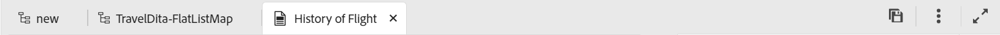

**タブ**

エディターで現在開いているトピックをファイルタブとして表示します。 複数のトピックを同時に開くことができ、これらはタブバーのそれぞれのタブに表示されます。 デフォルトでは、タブでファイルタイトルを表示できます。 ファイルにカーソルを合わせると、ファイルタイトルとファイルパスがツールチップとして表示されます。

>[!NOTE]
>
> 管理者は、タブ内のファイル名でファイルのリストを表示することもできます。 [&#x200B; ユーザー設定](./intro-home-page.md#user-preferences)の「**エディターファイル表示設定**」セクションの「**ファイル名**」オプションを選択します。

「ファイル」タブを選択すると、「新しいバージョンとして保存」、「コピー」、「検索」、「追加先」、「プロパティ」、「分割」、「PDFとしてダウンロード」、「閉じる」オプションを備えたコンテキストメニューが開きます。

**すべて保存**

開いているすべてのトピックで行った変更を保存します。 エディターで複数のトピックを開いている場合、**すべて保存**&#x200B;を選択するか、**Ctrl**+**S** ショートカットキーを使用すると、すべてのドキュメントをワンクリックで保存できます。 各ドキュメントを個別に保存する必要はありません。

>[!NOTE]
>
> **すべて保存**&#x200B;操作では、トピックの新しいバージョンは作成されません。 新しいバージョンを作成するには、**新しいバージョンとして保存** オプションを使用します。

**AI アシスタント**

AIを活用したパワフルなツールは、スマートなヘルプとオーサリング機能によって生産性を向上させるように設計されています。 **オーサリング**&#x200B;と&#x200B;**ヘルプ**&#x200B;の2つの堅牢なAI機能をExperience Manager Guides インターフェイスに統合し、コンテンツのオーサリングとExperience Manager Guides ドキュメントからの情報へのアクセスをより迅速かつ効率的におこなうことができます。

>[!NOTE]
>
>現在、Adobe Experience Manager Guides as a Cloud ServiceではAI アシスタント機能を利用できます。

**ビューを展開**: **展開** アイコンを使用してページビューを展開できます。 このビューでは、Adobe Experience Manager ロゴを含むヘッダーバーは非表示になっています。 これにより、編集のためのコンテンツスペースが最大化されます。 標準ビューに戻るには、**拡張ビュー**&#x200B;を終了アイコンを使用します。

**その他のアクション**: **Assets**&#x200B;および&#x200B;**Settings**&#x200B;に移動できます。

**Assets** オプションを使用すると、設定に基づいて宛先に移動できます。

- **Cloud Services**: Cloud Servicesを使用している場合、**Assets** オプションを選択すると、AEM ナビゲーション ページに移動します。

- **オンプレミスソフトウェア**: Adobe Experience Manager Guides（4.2.1以降）を使用している場合、**Assets** オプションを選択すると、Assets UIの現在のファイルパスに移動します。


**設定** オプションは、管理者およびフォルダープロファイル管理者のみが使用でき、次の設定を設定できます。

>[!NOTE]
>
> デフォルト設定を更新する場合は、変更を有効にするためにドキュメントを再度開く必要があります。

- **General**：一般設定では、エディターで使用する辞書を設定できます。 このタブには、**スペルチェック**、**条件**、**オーサリング**、**引用**&#x200B;の4つのセクションがあります。

  {width="650"}

   - **スペルチェック**: **AEM スペルチェック**&#x200B;と&#x200B;**ブラウザーのスペルチェック**&#x200B;の2つのオプションがあります。 デフォルトでは、エディターはブラウザーのスペルチェック機能を使用します。スペルチェックは、ブラウザーの組み込み辞書を使用して実行されます。 AEM スペルチェックに切り替えて、Adobe Experience Managerの辞書を使用できます。また、カスタム単語リストを追加するようにカスタマイズすることもできます。 AEM ディクショナリのカスタマイズについて詳しくは、「AEM as a Cloud Serviceのインストールと設定」の「[Adobe Experience Manager Guidesのデフォルトディクショナリをカスタマイズ &#x200B;](../cs-install-guide/customize-aem-custom-dictionary.md)」セクションを参照してください。

   - **条件**

      - **作成者ビューでコンディショナルテキストを強調表示**：作成者ビューでコンディショナルテキストを強調表示するには、これを選択します。 条件コンテンツは、条件に定義された色を使用してハイライト表示されます。

      - **条件属性で検証**：属性に対して定義された値の検証を許可するには、これを選択します。 これにより、誤った値を追加しないようにします。

      - **件名パネルでタイトル付きのキーを表示**：これを選択すると、件名スキームのタイトルと共にキーが表示されます。 このオプションを選択しない場合は、タイトルのみが表示されます。 例えば、ここではキー「os」、「audience」、「other」もタイトルと共に表示されます。

        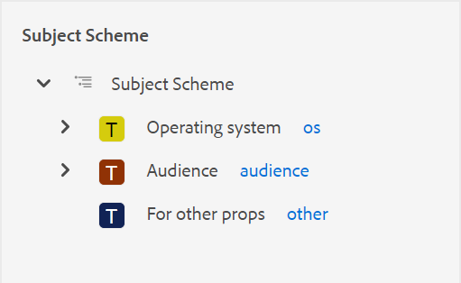{width="550"}

      - **条件パネルで件名スキームを表示**：条件パネルで件名スキームを表示するには、これを選択します。 これを選択解除すると、定義された条件が条件パネルに表示されます。

   - **オーサリング**

      - **すべてを置換を有効にする**：これを選択すると、**検索と置換** パネルに&#x200B;**すべてを置換** アイコンが表示されます。

   - **引用**
引用のスタイルを変更します。 プロジェクトで使用するドロップダウンから引用スタイルを選択します。 詳細については、[引用スタイルの変更](./web-editor-apply-citations.md#change-citation-style)を参照してください。

   - **AI アシスタント**
これを選択して、Experience Manager Guidesの[AI アシスタント &#x200B;](./ai-assistant.md)機能を有効にします。 この機能を無効にするには、選択を解除します。

**パネル**：この設定は、エディターおよびマップコンソールの左右のパネルに表示されるパネルを制御します。 ボタンを切り替えて、目的のパネルを表示または非表示にすることができます。

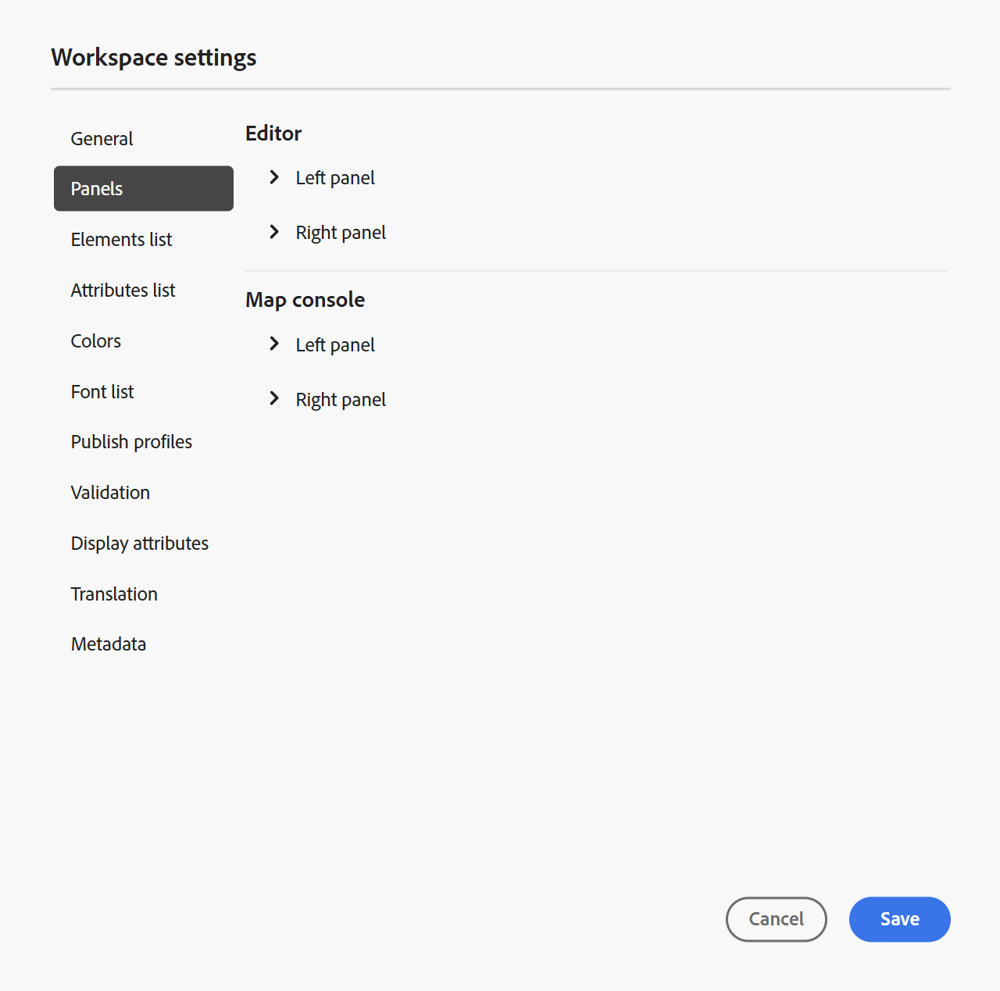{width="650"}

パネルに表示されるフィーチャの表示順序を定義することもできます。 パネルで使用可能な機能のデフォルトの順序を変更するには、点線の棒を選択して、機能タブを目的の場所にドラッグ&amp;ドロップします。 機能は、**More** セクションからパネルのメインセクションに移動したり、その逆も必要に応じて移動したりできます。 並べ替えると、機能は左右のパネルに同じ順序で表示されます。

{width="650"}


一度に最大8つのパネルを表示できます。 パネル設定に加えられた変更は、すぐに適用されます。


>[!NOTE]
>
> カスタムパネルが設定されている場合、パネルのリストにも表示されます。 カスタムパネルの表示と非表示を切り替えることができます。

- **要素リスト**：作成者がファイルに挿入できる要素のリストを管理者が制御でき、要素の表示名も定義できます。 エレメントのリスト設定では、DITAの仕様に従ってエレメントの名前を指定し、DITAで定義されたエレメント名の代わりに使用するラベルを指定できます。

  {width="650"}

上のスクリーンショットでは、`p`要素に段落のラベルが付けられ、`codeblock`には他の要素と共にコードブロックのラベルが付けられています。**上記のエレメントのみを使用** オプションを選択すると、このリストの有効なエレメント \（現在の挿入ポイント\）のみが&#x200B;**エレメントを挿入** ダイアログボックスに表示されます。

次のスクリーンショットでは、前のスクリーンショットで設定した4つの要素のうち、現在のコンテキストに表示されているのは3つだけです。

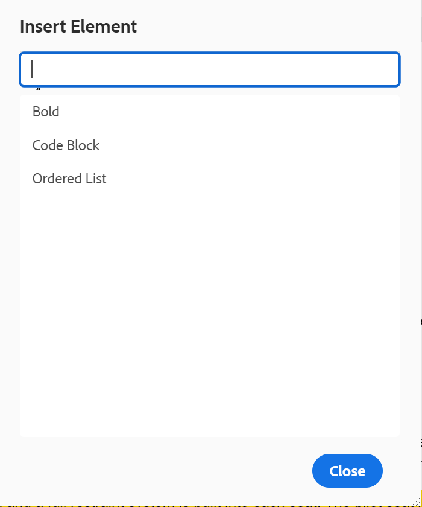{width="300"}

- **属性リスト**：要素リストと同様に、要素の属性リストに表示する属性とその表示名のリストを制御できます。 次のスクリーンショットでは、要素の属性リストに表示するように設定されている属性は3つだけです。

  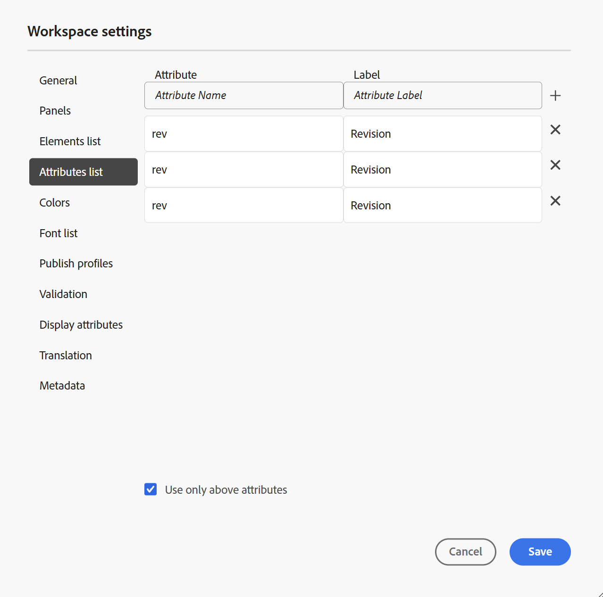{width="650"}

  この設定では、要素に属性を追加しようとすると、リストに設定された属性のリストのみが表示されます。

  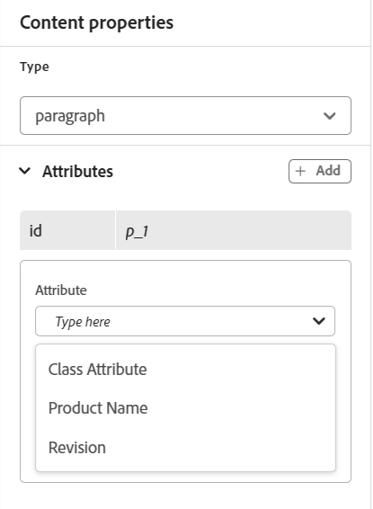{width="300"}

- **色**: **条件**&#x200B;の事前設定済みの背景色のリストを表示します。 ユーザーは、トピックに条件を適用する際に背景色を選択できます。 管理者は、リストにカスタム背景色を作成して追加することもできます。 新しいカラーを追加するには、**カラー名** フィールドに目的の名前を入力し、カスタムカラーを選択して、**+** アイコンを選択します。 カスタムカラーは、カラーリストの最後に表示されます。

- **プロファイルの公開**：これには、**ナレッジベース**&#x200B;出力の公開に使用できるプロファイルが含まれます。 ターゲット ナレッジベース用の新しいプロファイルを作成できます。 例えば、SalesforceやServiceNowなどです。

   - **Salesforce プロファイルの作成**

     **前提条件**

      - Salesforce用に接続アプリを作成します。 詳しくは、[API統合のOAuth設定を有効にする](https://help.salesforce.com/s/articleView?id=sf.connected_app_create_api_integration.htm&type=5)を参照してください。

      - 接続されたアプリを設定する際は、次のことを確認します。

         - コールバックを指定します。

           `URL: http://<server name>:<port>/bin/dxml/thirdparty/callback/salesforce`

         - 次のOAuth スコープを選択します。
            - フルアクセス （フル）
            - 「APIを介してユーザーデータを管理」（API）を選択します

     アプリが設定されると、Salesforceは&#x200B;**Consumer Key**&#x200B;と&#x200B;**Consumer Secret**&#x200B;を提供します。 これらは、Salesforce プロファイルの作成に使用できます。


   - Salesforce プロファイルを作成するには、**Server type** ドロップダウンから&#x200B;**Salesforce** Knowledge Baseを選択します。 プロファイル名を入力します。 **サイト URL**&#x200B;に、出力の公開に使用するコンシューマーサイトを入力し、Salesforce コンシューマーサイトから提供された&#x200B;**Consumer Key**&#x200B;および&#x200B;**Consumer Secret**&#x200B;を追加します。 次に、**新しく作成したプロファイルを**&#x200B;検証し、**保存**&#x200B;します。

     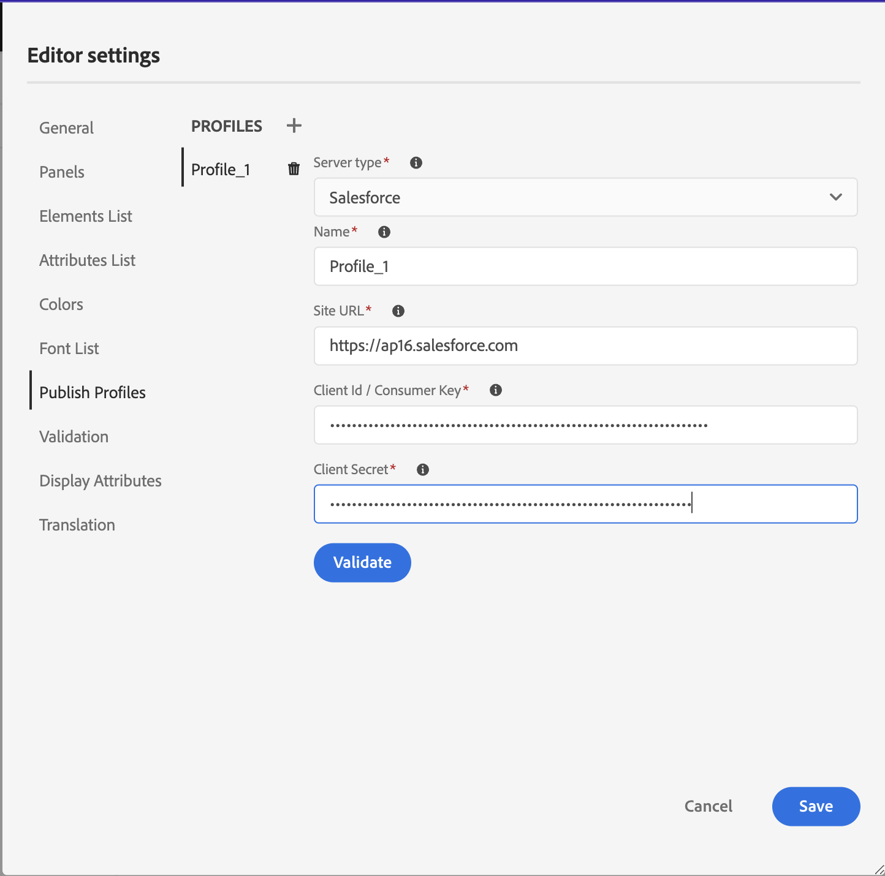{width="550"}

     >[!NOTE]
     >
     >AEMでSalesforceのプロキシを設定するには、Experience Manager GuidesでApache HTTP Components Proxy Configurationを使用します。 AEM Link Checker[&#128279;](https://helpx.adobe.com/experience-manager/kb/How-to-configure-proxy-for-the-AEM-Link-Checker-AEM.html)のプロキシを設定する方法について説明します。


   - **ServiceNow プロファイルの作成**

     **前提条件**

     アセットをアップロードするようにServiceNow サーバーを設定します。
      - **ServiceNow** サーバーに接続します。
      - **システムのプロパティ** > **セキュリティ**&#x200B;に移動します。
      - 次のオプションのチェックを外します。

        **このプロパティは、アップロードのMIME タイプのチェックをアクティブ化するように設定する必要があります（すべてのバージョン Eureka以降）。 添付ファイルのMIME タイプ検証を有効（true）または無効（false）にします。 glide.attachment.extensionsで設定されたファイル拡張子は、アップロード時にMIME タイプがチェックされます。**

      - 「**保存**」を選択します。

     アプリを設定したら、**ServiceNow** プロファイルを作成します。

   - プロファイルを作成するには、**Server type** ドロップダウンからServiceNow Knowledge Baseを選択します。 プロファイル **名前**&#x200B;を入力します。 **ServiceNow URL**&#x200B;に、出力の公開に使用するコンシューマーサイトを入力し、ServiceNow コンシューマーサイトから提供される&#x200B;**ユーザー名**&#x200B;と&#x200B;**パスワード**&#x200B;を追加します。 次に、**新しく作成したプロファイルを**&#x200B;検証し、**保存**&#x200B;します。

     {width="550"}

  検証後、DITA マップの出力プリセットで公開プロファイルを選択し、それを使用して、選択した&#x200B;**Salesforce**&#x200B;または&#x200B;**ServiceNow** サーバーに出力を生成できます。

  [&#x200B; ナレッジベース &#x200B;](../user-guide/generate-output-knowledge-base.md)出力プリセットについて詳しく説明します。


- **検証**：このタブには、エディターでSchematron検証を設定するオプションが含まれています。 次の機能を有効にできます。

   - **ファイルを保存する前に検証チェックを実行する**：選択したSchematron ファイルを使用してSchematron検証を実行するには、保存操作の前に、これを選択します。 「+」アイコンを選択して、Schematron ファイルを追加できます。 選択したSchematron ファイルが一覧表示されます。

     >[!NOTE]
     >
     >選択したSchematron ファイルは、選択したフォルダープロファイルに対して保持されます。

     {width="550"}

     これにより、選択したSchematron ファイルで定義されたルールを破るファイルをユーザーが保存できなくなります。 これが選択されていない場合、変更を保存する前にファイルが検証されません。

   - **すべてのユーザーが検証パネルにスキーマトロンファイルを追加することを許可する**：これを選択すると、ユーザーはエディターの検証パネルにスキーマトロンファイルを追加できます。 これにより、ユーザーはSchematron ファイルを追加し、Schematron ファイルに対してトピックを検証できます。 これを選択しない場合、エディターの&#x200B;**検証パネル**&#x200B;のユーザーは、スキーマトロンファイル **スキーマトロンファイル**&#x200B;を追加するオプションを利用できません。


- **表示属性**：属性リストと同様に、要素の属性リストに表示する属性のリストを制御できます。 デフォルトでは、4つの&#x200B;**表示属性** — オーディエンス、プラットフォーム、製品、およびpropが、要素の属性リストに表示されるように設定されています。 上部の&#x200B;**追加** アイコンを使用して、表示属性を追加することもできます。 **削除** アイコンを使用して、表示属性のいずれかを削除することもできます。

  エレメントに対して定義された属性は、レイアウトおよびアウトライン表示に表示されます。

  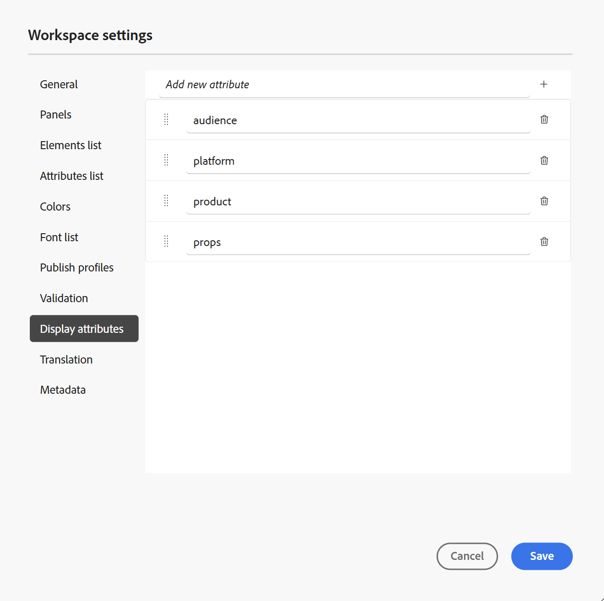{width="550"}

- **翻訳**：このタブには、言語グループの作成、ソースラベルのターゲットバージョンへの反映、翻訳プロジェクトのクリーンアップを行うためのオプションが含まれています。

  {width="550"}

   - **言語グループ**：管理者は、言語のグループを作成し、それらをセットとして使用してコンテンツを翻訳できます。

     新しい言語グループを作成するには、次の手順を実行します。

      1. 「**追加**」を選択します。
      1. 言語グループ名を入力します。 各言語には一意の名前を付ける必要があります。 名前フィールドが空の場合、または名前が一意でない場合は、エラーを表示できます。
      1. ドロップダウンから言語を選択します。 複数の言語を選択できます。

         言語の最初の数文字、または言語コードを入力して、目的の言語をフィルタリングします。 例えば、名前またはコードの先頭に「en」が含まれているすべての言語をフィルタリングするには、「en」と入力します。

      1. 「完了」アイコンを選択して、選択した言語をグループに追加します。 言語が表示されます。 3つ以上の言語を追加すると、「**さらに表示**」オプションが表示されます。 **詳細を表示**&#x200B;を選択して、グループに存在するすべての言語を表示できます。

         >[!TIP]
         >
         >**表示の切り替え**&#x200B;から&#x200B;**表示の切り替え**&#x200B;の切り替え。一部の言語のみを表示します。

      1. グループ内の言語にカーソルを合わせてを編集するか、言語グループをします。
      1. **設定**&#x200B;を保存します。

         >[!NOTE]
         >
         >ユーザーは、フォルダープロファイルに設定された言語グループを表示できます。

   - **ソースバージョンラベルをターゲットバージョンに反映**：このオプションを選択すると、ソースファイルバージョンのラベルが翻訳ファイルに渡されます。 デフォルトでは、これは無効になっています。
   - **完了後の翻訳プロジェクトのクリーンアップ**：翻訳後に翻訳プロジェクトを自動的に無効または削除するように設定するには、このオプションを選択します。 デフォルトでは、**なし**&#x200B;が選択されているため、翻訳後にプロジェクトが存在します。

     翻訳プロジェクトを後で使用する場合は、翻訳プロジェクトを無効にできます。 プロジェクトを削除すると、プロジェクトに存在するすべてのファイルとフォルダーが完全に削除されます。


- **メタデータ**: **バージョン履歴** ダイアログボックスに表示するトピックのバージョンのメタデータとその値を制御できます。  メタデータパスで、メタデータを選択するノードの場所を指定します。 メタデータのカスタム名をラベルとして定義することもできます。 デフォルトのプロパティは、タイトル、ドキュメント状態、タグです。

  メタデータは、アセットの`/jcr:content` ノードの下にある任意のプロパティから選択できるため、プロパティのパスをメタデータパスとして追加できます。


  メタデータパスが空白の場合は、エラーが表示されます。 ラベルを空白のままにすると、最後の要素がラベルとして選択されます。


  {width="550"}

  *バージョン履歴&#x200B;**ダイアログボックスのメタデータを設定します。***


  これらのメタデータタグを表示する順序を定義することもできます。 これらのタグのデフォルトの順序を変更するには、点線バーを選択して、タグを目的の場所にドラッグ&amp;ドロップします。
メタデータラベルは、エディターの&#x200B;**バージョン履歴** ダイアログボックスに同じ順序で表示されます。

## ツールバー

ツールバーは、エディターで編集用のトピックまたはマップを開いたときに表示されます。 ツールバーで使用できる機能は次のとおりです。

- [メニュードロップダウン](#menu-dropdown)
- [コンテンツ挿入オプション](#content-insertion-options)
- [バージョン情報と「新しいバージョンとして保存」ボタン](#save-as-new-version)
- [ロック/ロック解除](#lockunlock)

>[!NOTE]
>
> 上記の機能は、トピックファイルにのみ適用されます。 マップファイルを操作する場合、現在のマップエディタービューに基づいて、ツールバーに異なるオプションが表示されます。 [&#x200B; マップエディター機能](./map-editor-advanced-map-editor.md) ドキュメントのマップエディターツールバーオプションについて説明します。

### メニュードロップダウン

メニュードロップダウンでは、編集アクション、検索と置換、バージョン履歴、バージョンラベル、結合、レビュータスクの作成、変更の追跡、タグ機能にアクセスできます。

これらの機能の詳細な説明は次のとおりです。

**アクションの編集**

エディターでトピックを編集する際に、**カット**&#x200B;または&#x200B;***Ctrl***+***X***、**コピー**&#x200B;または&#x200B;***Ctrl***+***C***、**取り消し**&#x200B;または&#x200B;***Ctrl***+***Z***、**やり直し**&#x200B;または&#x200B;***Ctrl***&#x200B;および&#x200B;**メニュードロップダウンにある**&#x200B;を削除します。**&#x200B;**&#x200B;**


**検索と置換**

**検索と置換**&#x200B;機能は、作成者モードとSource ビューモードで使用できます。 有効にすると、トピック編集領域の下部に「検索と置換」テキストバーが表示されます。 ショートカットキー&#x200B;**CTRL**+**F**&#x200B;を使用して、検索と置換バーを呼び出すことができます。


設定アイコン \（\）を使用すると、**大文字と小文字を区別**&#x200B;および&#x200B;**単語全体のみ**&#x200B;検索オプションを切り替えることができます。 大文字と小文字を区別しない検索を実行するには、**大文字と小文字を区別しない** オプションをオンまたは選択します。 大文字と小文字を区別して検索する場合は、**大文字と小文字を区別しない** オプションをオフにするか、選択解除します。 また、単語全体を検索することもできます。

検索は瞬時に行われます。つまり、**検索** フィールドに検索語句または単語を入力すると、その語句は直ちに検索され、トピック内で選択されます。 同様に、トピック内のテキストを置き換えるには、検索キーワードとそれぞれのフィールドに置き換えを入力し、「**置換**」または「**すべて置換**」ボタンを選択します。

Source ビューでは、**検索と置換**&#x200B;機能は、特定の要素または属性を検索するのに非常に便利です。 例えば、`@product`属性の値を置き換える場合は、Source ビューから簡単に行えます。 作成者ビューでは、属性または要素に基づいて検索することはできません。 ただし、XML コードが上書きされる可能性があるため、**すべて置換**&#x200B;機能の使用中は注意が必要です。

**バージョン履歴**

エディターの&#x200B;**バージョン履歴**&#x200B;機能を使用すると、利用可能なDITA ファイルのバージョンを確認し、それらを比較して、エディター自体から任意のバージョンに戻すことができます。 現在のバージョンのコンテンツとメタデータ（作業コピーにもできます）を、同じファイルの以前のバージョンと比較できます。 比較したバージョンのラベルとコメントを表示することもできます。

>[!NOTE]
>
> バージョン履歴オプションは、トピックまたはマップの最初のバージョンに変更が加えられた場合にのみ表示されます。

バージョン履歴にアクセスし、トピックの特定のバージョンに戻すには、次の手順を実行します。

1. エディターでトピックを開きます。
1. 「**メニュー**」ドロップダウンから「**バージョン履歴**」を選択します。

   **バージョン履歴** ダイアログボックスが表示されます。

   {width="550"}

   *トピックの様々なバージョンの変更をプレビューします。*

1. **比較または元に戻すトピックのバージョンを**&#x200B;と比較ドロップダウンリストで選択します。

   >[!NOTE]
   >
   > バージョンにラベルが適用されている場合は、バージョン番号と共に\（括弧で囲んだ\）も表示されます。

1. 「**ラベルとコメントを表示**」オプションを有効にして、現在のバージョンと比較されたバージョンに適用されたラベルとコメントを表示します。
1. **バージョン履歴** ダイアログボックスでは、次の情報も表示できます。

   **プレビュー** タブ：新しく追加されたコンテンツは緑色のフォントで、削除されたコンテンツは赤色のフォントです。

   **メタデータ** タブ：新しく追加されたメタデータは緑色のフォントで、削除されたメタデータは赤色のフォントです。

   バージョン {width="550"}の メタデータの違い

   *バージョン履歴の異なるバージョンのメタデータを比較します。*

   >[!NOTE]
   >
   > システム管理者は、**設定**&#x200B;の「メタデータ」タブから表示するメタデータを変更できます。 詳しくは、[&#x200B; タブバー](#tab-bar)の&#x200B;**その他のアクション** セクションを参照してください。

   また、現在のバージョンと比較されたバージョンのユーザーと時間の詳細を表示することもできます。

   ドロップダウンリストからバージョンを選択すると、「**選択したバージョンに戻す**」オプションが使用可能になります。 プレビューウィンドウには、現在のバージョンと選択したバージョンのトピックの違いが表示されます。

1. 「**選択したバージョンに戻す**」を選択して、選択したバージョンのトピックで作業コピーを元に戻します。

   バージョンを元に戻すダイアログボックスが表示されます。

   {width="550"}

1. \（*オプション*\）以前のバージョンに戻す理由を指定します。 トピックの現在アクティブな作業コピーの新しいバージョンを作成することもできます。

1. 「**確認」を選択します。**

   ファイルの作業コピーが選択したバージョンに戻されます。 現在アクティブな作業コピーの新しいバージョンを作成する場合は、すべての作業の変更を含む新しいバージョンのファイルも作成されます。

   以前のバージョンに戻すと、現在作業中のバージョンが最新バージョンでないことを示す視覚的なキューが表示されます。

   

**バージョンラベル**

ラベルは、特定のトピックがDDLC （文書開発ライフサイクル）のどの段階にあるかを特定するのに役立ちます。 例えば、トピックに取り組んでいる場合、ラベルを「承認済み」に設定できます。 トピックが公開され、顧客が利用できるようになったら、そのトピックに「リリース済み」ラベルを割り当てることができます。

Experience Manager Guidesでは、自由形式のテキストフォーマットでラベルを指定したり、定義済みのラベルのセットを使用したりできます。 カスタムラベルを使用すると、システム内の任意の作成者が、選択に従ってラベルを指定できます。 これにより柔軟性が得られますが、システム内に一貫性のないラベルが導入されます。 この問題を解決するために、管理者は定義済みのラベルのセットを設定できます。 定義済みラベルの設定について詳しくは、「Adobe Experience Manager Guides as a Cloud Serviceのインストールと設定」の「*XML Web Editorの設定とカスタマイズ」を参照してください。*

これらのラベルは、作成者がラベルを指定する必要がある場所に、ドロップダウンリストの形式で表示されます。 これにより、システムで事前定義された一貫性のあるラベルのみが使用されます。

Assets UIの[&#x200B; バージョン履歴](web-editor-use-label.md) パネル、[&#x200B; ベースライン &#x200B;](/help/product-guide/user-guide/generate-output-use-baseline-for-publishing.md) UIおよびエディターなど、トピックにラベルを適用する方法は様々です。 エディターのバージョンラベル機能を使用すると、トピックにラベルを素早く簡単に割り当てることができます。

エディターからトピックにラベルを追加するには、次の手順を実行します。

1. エディターでトピックを開きます。

1. メニュードロップダウンから「**バージョンラベル**」を選択します。

   バージョンラベル管理ダイアログボックスが表示されます。

   {width="650"}

   バージョンラベル管理ダイアログボックスは2つの部分に分かれています。左側のパネルには、トピックで使用可能なバージョンのリストと、ラベルドロップダウンリスト \（またはラベルを入力するためのテキストボックス\）と、トピックのプレビューが表示された右側のパネルがあります。

1. ラベルを適用するバージョンを選択します。

   バージョンリストから別のバージョンのトピックを選択すると、プレビューパネルに、現在のバージョンと選択したバージョンのトピックの間の変更点が表示されます

   >[!NOTE]
   >
   > ラベルが既にバージョンに適用されている場合は、ドロップダウンリストのバージョン番号の横と「バージョンを選択」リストの下に表示されます。 ラベルの横にある\（**x**\） アイコンを選択して、既存のラベルを削除できます。

1. 管理者がラベルのリストを定義している場合、適用するラベルを選択できるラベルのドロップダウンリストが表示されます。 ドロップダウンリストから複数のラベルを選択できます。

   または、テキストボックスが表示され、トピックに追加するラベルを入力できます。

   >[!NOTE]
   >
   > トピックの複数のバージョンに同じラベルを適用することはできません。 既存のラベルを関連付けようとした場合は、既存のバージョンからラベルを削除し、選択したバージョンのトピックに適用するオプションが表示されます。

1. 「**ラベルを追加**」を選択します。

1. ラベルの適用の確認メッセージで、「**ラベルを移動（別のバージョンで使用する場合）**」オプションを選択して、ラベルを既存のバージョンから選択したバージョンに移動します。 このオプションを選択せず、トピックの別のバージョンに割り当てられているラベルがある場合は、選択したトピックのバージョンに移動されません。 このようなラベルは、ラベル適用プロセスでは無視されます。

**結合**

マルチオーサー環境で作業する場合、トピックやマップ内で他のオーサーが行った変更を追跡するのは困難になります。 結合機能を使用すると、変更を表示するだけでなく、最新バージョンの文書に保持されている変更を制御できます。

- **トピックファイルを結合**

  トピックの変更を結合するには、次の手順を実行します。

   1. エディターでトピックを開きます。

   1. 「**結合**」を選択します。

      結合ダイアログが表示されます。

      {width="550"}

   1. *\（Optional\）* リポジトリ内の別の場所から新しいファイルを参照して選択することもできます。

   1. ファイルの現在のバージョンを比較するファイルのバージョンを選択します。

   1. 「オプション」で、次を選択します。

      - **選択したバージョンからの変更履歴**：このオプションには、すべてのコンテンツ更新が変更履歴の形式で表示されます。 その後、文書内の変更を1回または1回で承認または却下できます。

      - **選択したバージョンに戻す**：このオプションは、ドキュメントの現在のバージョンを選択したバージョンに戻します。 このオプションでは、どのようなコンテンツが受け入れられるか、または拒否されるかを制御することはできません。

   1. 「**完了**」を選択します。

   1. 選択したバージョンから&#x200B;**変更履歴** オプションを選択した場合、選択したバージョンからのすべての変更が、右側のパネルの「変更履歴」機能に表示されます。

      変更履歴パネルからすべてのコメントを承認または却下するか、個別のコメントを承認または却下するかを選択できます。


- **マップファイルを結合**

  マップファイル内の変更を結合するには、次の手順を実行します。

   1. エディターでマップを開きます。

   1. 「**結合**」を選択します。

      結合ダイアログボックスが表示されます。

      {width="550"}

   1. *\（Optional\）* リポジトリ内の別の場所から新しいファイルを参照して選択することもできます。

   1. ファイルの現在のバージョンを比較するファイルのバージョンを選択します。

   1. 「オプション」で、次を選択します。

      - **選択したバージョンからの変更を追跡**：このオプションには、すべてのコンテンツの更新が変更履歴の形式で表示されます。 その後、文書内の変更を1回または1回で承認または却下できます。

      - **選択したバージョンに戻す**：このオプションは、ドキュメントの現在のバージョンを選択したバージョンに戻します。 このオプションでは、どのようなコンテンツが受け入れられるか、または拒否されるかを制御することはできません。

   1. 「**完了**」を選択します。

   1. 選択したバージョン **から変更を追跡オプションを選択した場合、選択したバージョンからのすべての変更が、変更履歴パネル \（右側\）に表示されます。**

      変更履歴パネルからのすべての変更を承認または却下するか、マップファイル内の個別の変更を承認または却下するかを選択できます。


**レビュータスクの作成**

現在のトピックまたはマップファイルの[&#x200B; レビュータスク &#x200B;](./review-send-topics-for-review.md)をエディターから直接作成できます。 レビュータスクを作成するファイルを開き、メニューのドロップダウンから「**レビュータスクを作成**」を選択して、レビュー作成プロセスを開始します。

**変更を追跡**

変更をトラック モードを有効にすると、ドキュメントで行われたすべての更新を追跡できます。 変更履歴を有効にすると、すべての挿入と削除がドキュメントに取り込まれます。 削除されたすべてのコンテンツは取り消し線を使用して強調表示され、すべての挿入は緑色のテキストで強調表示されます。 さらに、トピックページの端にある改訂バーも表示されます。 繰り返しますが、削除されたコンテンツには赤いバーが表示され、追加されたコンテンツには緑のバーが表示されます。 同じ行に追加と削除がある場合は、緑と赤のバーの両方が表示されます。

次のスクリーンショットは、削除および挿入されたコンテンツと改訂バーを強調表示しています。

{width="650"}

ドキュメント内の変更を追跡する一般的な使用例は、ピアレビューを行う場合です。 変更履歴を有効にしてレビュー用にドキュメントを共有すると、変更履歴をオンにしてレビュアーが変更を加えます。 ドキュメントを受け取ったら、変更を承認または却下する便利な方法とともに、提案された更新を表示するメカニズムが必要です。

Experience Manager Guidesには、ドキュメントで行われた更新に関する情報を含む変更履歴の機能が用意されています。 変更履歴は、どの更新が行われ、誰がその更新を行い、いつ更新されたかについての情報を提供します。 「変更履歴」機能を使用すると、ドキュメント内の提案された更新を簡単に承認または拒否できます。

機能にアクセスするには、右側のパネルで「**変更を追跡**」アイコンを選択します。

{width="300"}

変更履歴を選択すると、文書内の変更されたコンテンツが選択されます。 変更を受け入れるには、「変更を受け入れる」アイコンを選択するか、「変更を却下」を選択して変更を却下します。

ワンクリックですべての変更を承認または拒否する場合は、「**すべての変更を承認**」または「**すべての変更を拒否**」を選択します。

>[!NOTE]
>
> プレビューモードでは、変更されたコンテンツのマークアップの有無にかかわらず、ドキュメントを表示できます。 詳細については、[&#x200B; プレビュー](web-editor-views.md#preview-mode-id19AAGL00163) モードを参照してください。

**タグ**

エディターの&#x200B;**タグ**&#x200B;機能は、DITA要素の表示を制御するトグルボタンです。 有効にすると、コンテンツ内に構造タグが表示され、基礎となるDITA要素をより効果的に表示および管理できます。 無効にすると、エディターはこれらのタグを非表示にし、よりクリーンで集中的なオーサリング環境を提供します。

次のスクリーンショットは、タグビューが有効になっているドキュメントを示しています。

{width="650"}

タグ付きのドキュメントでは、次の操作を実行できます。

- **要素を選択**：要素の開始タグまたは終了タグを選択して、そのコンテンツを選択します。

- **タグを展開または折りたたむ**: タグを展開または折りたたむには、「+」または「 – 」記号を選択します。

- **コンテキストメニューを使用**：コンテキストメニューには、選択した要素をカット、コピー、またはペーストするオプションが表示されます。 選択したエレメントの前または後にエレメントを挿入することもできます。 その他のオプションを使用すると、IDを生成したり、選択した要素のプロパティパネルを開いたりできます。

- **エレメントのドラッグ&amp;ドロップ**：エレメントのタグを選択し、ドキュメントに簡単にドラッグ&amp;ドロップできます。 ドロップ場所がエレメントが許可される有効な場所である場合、エレメントはドロップ場所に配置されます。


>[!NOTE]
>
> ユーザーがエディターからタグビューを有効にした場合、セッション全体でも有効のままになります。 これは、後でタグビューにアクセスするために、もう一度タグビューを有効にする必要がないことを意味します。 新しいユーザーのセッションのタグビューのデフォルト値は、`ui\_config.json` ファイルの`tagsView` プロパティによって決まります。 詳しくは、「Adobe Experience Manager Guides as a Cloud Serviceのインストールと設定」の「[&#x200B; タグビューのデフォルト値の設定](../cs-install-guide/configure-default-value-tags-view.md)」セクションを参照してください。

### コンテンツ挿入オプション

**要素** - 

現在または次の有効な場所に有効な要素を挿入します。 キーボードショートカット ***Alt***+***Enter***&#x200B;を使用して、エレメントダイアログボックスを開くこともできます。 例えば、段落を編集している場合、**要素** ダイアログボックスに、段落に挿入できる要素のリストが表示されます。 挿入するエレメントを選択します。 キーボードを使用してエレメントのリストをスクロールし、***Enter***&#x200B;を押して必要なエレメントを挿入できます。

有効なエレメントは、次の2種類があります。

- **現在の場所の有効な要素**：現在のカーソルの場所に挿入できる要素がリストに表示されます。

- **現在の場所の外部にある有効な要素**：このリストには、エレメント階層内の現在の要素に対する親のいずれかの後に挿入できる要素が表示されます。

例えば、インライン `<b>`要素内にいる場合は、現在の場所に`<u>`、`<xref>`、`<i>`などの要素を挿入できます。 対照的に、`<table>`や`<topic>`などの要素を現在の場所の外に挿入することもできます。

検索ボックスに文字または文字列を入力して、その文字で始まる要素を検索することもできます。

{width="300"}

*tと入力して、&#39;t&#39;で始まるすべての有効な要素を検索します。*

`note`などのブロック要素の内部で作業している場合は、要素を挿入アイコンを使用して、`note`要素の後に新しい要素を挿入します。 次のスクリーンショットでは、p \（paragraph\）要素の中にメモ要素が挿入されています。


ノート要素でEnter キーを押すと、ノート要素自体に新しい段落が作成されます。 ノートの外側に新しいエレメントを挿入するには、エレメントのパンくずリストでp エレメント \（スクリーンショットで強調表示\）を選択し、エレメントアイコンを選択するか、***Alt***+***Enter***&#x200B;を押してエレメントを挿入ダイアログボックスを開きます。 次に、目的のエレメントを選択し、Enter キーを押して、選択したエレメントをノートエレメントの後に挿入します。

点滅するブロックカーソルが表示されたときに、2つのエレメント間にエレメントを追加することもできます。


{width="300"}

例えば、DITA トピックを扱っていて、ブロックカーソルが短い説明と本文の間で点滅している場合、`prolog`要素を追加してから、著作権、作成者、その他の詳細を追加できます。

新しいエレメントを入力するもうひとつの方法は、コンテキストメニューを使用することです。 文書内の任意の場所を右クリックして、コンテキストメニューを呼び出します。 このメニューから「**エレメントを挿入**」を選択して、**エレメントを挿入** ダイアログボックスを表示し、挿入するエレメントを選択します。

{width="300"}

**段落** - 

現在または次の有効な場所に段落エレメントを挿入します。

**箇条書きリスト** - 

現在または次の有効な場所に箇条書きリストを作成します。 箇条書きリストを使用してこのアイコンを選択すると、その項目は通常の段落に変換されます。

**番号付きリスト** - 

現在または次の有効な場所に番号付きリストを作成します。 番号付きリストを使用してこのアイコンを選択すると、その項目は通常の段落に変換されます。

>[!NOTE]
>
>リスト項目のコンテキストメニューから「**リストを分割**」オプションを選択して、現在のリストを分割し、同じレベルで新しいリストを開始することもできます。

**表** - 

現在または次の有効な場所にテーブルを挿入します。 表アイコンを選択して、単純な表を挿入ダイアログボックスを開きます。

{width="550"}

>[!NOTE]
>
> Microsoft WordまたはExcelから表をコピーして、Experience Manager Guides トピックファイルに貼り付けることもできます。 コピーしたテーブルは、XML エディター設定で設定された設定に応じて`<simpletable>`または`<tgroup>`として貼り付けられます。 詳細については、[貼り付けられたテーブルの表示を設定](../cs-install-guide/conf-pasted-tables.md)を参照してください。

テーブルに必要な行と列の数を指定できます。 最初の行をテーブルヘッダーとして保持する場合は、「**最初の行をヘッダーとして設定**」オプションを選択します。 表にタイトルを追加するには、「タイトル」フィールドにタイトルを入力します。

表を挿入したら、コンテキストメニューを使用して表を変更できます。

{width="550"}


テーブルのコンテキストメニューを使用すると、次のことが可能になります。

- セル、行または列の挿入

- セルを右方向と下方向に結合

- セルを水平方向または垂直方向に分割

- セル、行または列の削除

- IDの生成


また、複数のセル、行全体、またはテーブルの列に対して属性を定義することもできます。 例えば、表のセルを整列させるには、目的のセルをドラッグして選択します。 コンテンツのプロパティパネル（右側）で、プロパティ **Type**&#x200B;が&#x200B;**entry**&#x200B;に変わります。

1. **属性** セクションで、**+追加**&#x200B;を選択します。
1. **属性** ドロップダウンリストから`@valign`属性を選択します。
1. 値ドロップダウンリストから、選択した表セルに適用するテキストの整列を選択します。
1. **追加を選択してください。**


**画像** - 

現在または次の有効な場所に画像を挿入します。 画像アイコンを選択して画像を挿入ダイアログボックスを開き、挿入する画像を検索して選択します。

>[!NOTE]
>
> ローカルシステムから記事に画像をドラッグ&amp;ドロップして、画像を追加することもできます。 この場合、画像ファイルは&#x200B;**Assetsをアップロード** ワークフローを使用して追加されます。  詳しくは、[左パネル &#x200B;](#left-panel) セクションの「**Assets**&#x200B;をアップロード」ワークフローを参照してください。


{width="650"}

画像を挿入ダイアログボックスで、画像/図のタイトルと代替テキストを画像に追加できます。

>[!NOTE]
>
> 画像を挿入し、その代替テキストを指定すると、最新のDITA規格に従って`<alt>`要素内に追加されます。 代替テキストに`@alt`属性を使用することは推奨されませんが、以前のDITA バージョンでは引き続きサポートされています。

「**ファイルを選択**」オプションを使用すると、必要な画像ファイルをファイル名で検索できます。 検索の結果は、パス \（検索する\）、コレクション、ファイルタイプ、タグでフィルタリングすることもできます。 必要な画像ファイルが見つかったら、ファイルを選択し、**選択**&#x200B;を選択して文書に画像を挿入します。 `.png`、`.svg`、`.gif`、`.jpg`、`.eps`、`.ai`、`.psd`など、様々な形式の画像ファイルを挿入できます。

画像を挿入したら、コンテンツプロパティパネルから高さ、幅、配置、属性を変更できます。 画像ファイルを選択し、右側のパネルのコンテンツプロパティパネルで変更を行います。


Source フィールドには、挿入された画像ファイルのUUIDが表示されます。 Source フィールドの上にマウスポインターを置くと、挿入された画像ファイルのパス全体を確認できます。 パスがツールチップに表示されます。

画像ファイルに「高さ」または「幅」の値を指定することで、画像のサイズを変更できます。 画像の縦横比は自動的に維持されます。 必要に応じて、ロックアイコン\（縦横比を維持\）を選択し、「高さ」と「幅」の値を指定して、画像ファイルの縦横比を維持しないように選択することもできます。

画像の配置設定をインラインまたはブレークとして指定することもできます。 「配置を分割」オプションを使用する場合は、画像を整列させる場所（左、中央、または右）を選択できます。

**属性** フィールドで必要なプロパティを選択して、画像ファイルの他のプロパティを追加することもできます。

>[!NOTE]
>
>画像内のクリック可能な領域\（画像マップ\）を定義することもできます。 詳しくは、[左パネル &#x200B;](web-editor-features.md#left-panel) セクションの&#x200B;**画像マップの挿入/編集**&#x200B;機能の説明を参照してください。

**画像またはメディアファイルのコンテキストメニュー**

また、コンテキストメニューを使用して、画像やメディアファイルに対して一般的な操作を実行することもできます。 画像上の任意の場所を右クリックして、コンテキストメニューを呼び出します。

コンテキストメニューには、画像またはメディアをカット、コピー、またはペーストするオプションが用意されています。 選択したエレメントの前または後にエレメントを挿入できます。 また、エレメントの名前を変更したり、ラップを解除したりするオプションもあります。 選択した画像またはメディアをリポジトリ内で見つけるか、Assets UIでファイルのプレビューを表示できます。

コンテキストメニューの他のオプションでは、パスのコピー、画像マップの編集、エレメントの名前の変更、スニペットの作成、選択したエレメントのIDの生成を行うことができます。

**画像マップの挿入/編集**

選択した画像上に画像マップを挿入します。 トピックやweb ページにリンクするクリック可能な領域を持つ画像は、画像マップと呼ばれます。

現在のトピックで画像を選択し、挿入/画像マップを編集アイコンを選択して、画像マップを挿入ダイアログボックスを開きます。

{width="650"}

リンクとして使用する画像の上の領域を定義するには、目的のシェイプ長方形、円、または多角形を選択します。 領域を定義すると、参照ダイアログが表示され、内部コンテンツまたは外部コンテンツへのリンクを指定する必要があります。

{width="650"}

領域が重なっている場合は、ツールバーのそれぞれのアイコンをクリックして、シェイプを前面に移動したり、背面に移動したりできます。 領域を選択して「削除」アイコンをクリックすると、領域を削除することもできます。 領域をダブルクリックすると、参照ダイアログが開き、宛先リンクを変更できます。 画像上の必要な領域をマークしたら、**完了**&#x200B;を選択して変更を保存します。


**マルチメディア**

様々なタイプのマルチメディアファイルを挿入します。 マルチメディアドロップダウンアイコンを選択し、挿入するファイルのタイプを選択します。 サポートされているマルチメディア形式は次のとおりです。

- オーディオファイル
- ビデオファイル
- YouTube
- ヴィメオ

「オーディオ」または「ビデオファイル」オプションを選択すると、目的のファイルを参照して選択するためのリポジトリビューが表示されます。 YouTubeまたはVimeoを選択すると、挿入マルチメディア ダイアログが表示されます。 「Web リンク」フィールドにビデオファイルのリンクを貼り付け、「挿入」を選択して、ドキュメントの現在または次の有効な場所にビデオを追加します。

>[!NOTE]
>
> YouTube ビデオリンクの追加中に、URLの文字列`watch?v=`を`embed`に置き換える必要があります。 例えば、次のYouTube ビデオリンクを追加するには、次のように追加する必要があります：`https://www.youtube.com/**embed/**WlIKQOrmZcs`。 `https://www.youtube.com/**watch?v**=WlIKQOrmZcs`この変更により、ビデオがAEM サイトとPDF出力に確実に埋め込まれます。

マルチメディアを挿入ダイアログからオーディオまたはビデオファイルを追加することもできます。 「オーディオ/ビデオファイル」オプションを選択し、参照アイコンを選択してリポジトリビューを起動します。 リポジトリからオーディオまたはビデオファイルを選択し、**選択**&#x200B;を選択して、オーディオ/ビデオファイル フィールドにファイルのリンクを追加します。 ビデオファイルを選択した場合、ファイルのプレビューもプレビュー領域に表示されます。 プレビューを表示するには、ビデオファイルを再生します。

{width="650"}

**相互参照**

タイプの参照（コンテンツ参照、コンテンツキー参照、キー参照、ファイル参照、Web リンク、メールリンク）を挿入します。

**ファイルを選択** アイコン \（コンテンツ参照とファイル参照\）または&#x200B;**ルートマップ** アイコン \（コンテンツキー参照とキー参照\）を選択し、リンク先のファイルまたはコンテンツを選択します。

{width="650"}

選択した参照のリンクが文書に追加されます。 リンクのコンテキストメニューでは、次のオプションを使用できます。

- **エレメントを挿入**：指定されたコンテキストで挿入できる有効なエレメントのリストを表示します。
- **UUIDをコピー**：挿入された参照のUUIDをコピーします。
- **パスをコピー**：挿入された参照の完全なパスをコピーします。
- **Generate ID**：挿入された参照の一意のIDを生成します。

参照するファイルのUUIDを使用して検索することもできます。 コンテンツとキー参照リンクの場合は、リンク先のファイルのUUIDを入力すると、ファイルが自動的に検索され、「プレビュー」セクションに表示されます。 ファイルのUUIDを指定する場合、.xml ファイルのファイル拡張子を明示的に指定する必要はありません。 .xml拡張子は、UUIDに自動的に追加されます。

{width="650"}

管理者が&#x200B;*XMLEditorConfig*&#x200B;でUUID オプションを有効にしている場合、**Link** プロパティで参照コンテンツのUUIDを表示します。


>[!NOTE]
>
> **UUIDs**&#x200B;を有効にするオプションが有効になっていない場合は、参照されているコンテンツの相対パスが表示されます。

>[!IMPORTANT]
>
> 参照されたコンテンツの相対パスが&#x200B;**Link** プロパティに表示されますが、内部的には、参照されたコンテンツのUUIDを使用してリンクが作成されます。

>[!TIP]
>
> コンテンツの参照に関するベストプラクティスについては、ベストプラクティスガイドの「参照」セクションを参照してください。

**フィルター検索**

AEM リポジトリの選択したパスにあるファイル内のテキストを検索できます。 例えば、以下のスクリーンショットで「general」が検索されます。 強化されたフィルターを使用して検索を絞り込むこともできます。 選択したパスに存在するDITA トピックやDITA マップなど、すべてのDITA ファイルを検索できます。

選択したパス内の画像ファイル、マルチメディア、ドキュメントなど、DITA以外のファイルを検索できます。 DITA エレメントの属性で特定の値を検索することもできます。 指定したユーザーがチェックアウトしたファイルを探すこともできます。

{width="650"}

>[!NOTE]
>
> システム管理者は、テキストフィルターを設定したり、他のフィルターを表示または非表示にしたりすることもできます。 詳しくは、「Adobe Experience Manager Guides as a Cloud Serviceのインストールと設定」の「*テキストフィルターの設定*」セクションを参照してください。

検索したテキストを含むフィルター処理されたファイルのリストが表示されます。 例えば、上記のスクリーンショットでは、「一般」というテキストを含むファイルが一覧表示されます。 ファイルの内容をプレビューすることもできます。


**再利用可能なコンテンツ** - 

プロジェクト内の他のドキュメント内に存在するコンテンツを再利用します。 コンテンツを挿入するには、ファイル内のコンテンツに直接リンクするか、キー参照を使用して、[&#x200B; キー参照を解決](map-editor-other-features.md#id176GD01H05Z)します。 コンテンツを再利用アイコンを選択すると、コンテンツを再利用ダイアログボックスが表示されます。

{width="650"}

コンテンツを再利用ダイアログボックスで、ファイル参照用のDITA ファイルまたはキー参照を含むDITA マップファイルを選択します。 選択すると、トピックまたはキー参照がダイアログに表示されます。 挿入するトピックのID/キーを選択し、**完了**&#x200B;を選択してトピック内にコンテンツを挿入できます。

コンテンツ参照を挿入する場合は、ファイルのUUIDを入力することもできます。そのファイルの再利用可能なコンテンツは、「プレビュー」セクションに一覧表示されます。

リンクを挿入する設定に基づいて、挿入されたコンテンツのUUIDまたはプロパティパネルまたはSource コードビューの相対パスを表示できます。 リンクは常に、参照されたコンテンツのUUIDを使用して作成されます。 *UUID ベースのリンクの設定*&#x200B;を「Adobe Experience Manager Guides as a Cloud Serviceのインストールと設定」で表示します。

>[!NOTE]
>
> 参照されたコンテンツの前後にコンテンツを追加するには、*Alt*+*Left*&#x200B;矢印キーまたはAlt+*Right*&#x200B;矢印キーを使用して、カーソルを目的の場所に移動します。

また、参照されたコンテンツを右クリックし、コンテキストメニューから「**参照をコンテンツに置き換え**」を選択することで、トピック内に参照されたコンテンツを埋め込むこともできます。

**シンボル** - 

トピックに特殊文字を挿入します。 シンボルアイコンを選択して、特殊文字を挿入ダイアログボックスを開きます。

>[!NOTE]
>
> Experience Manager Guidesには、移動可能でサイズ変更可能なダイアログボックスが用意されています。 右下隅に2本の十字線があるダイアログのサイズを変更できます。 特殊文字ダイアログのクロスラインを以下に示します。

{width="550"}

特殊文字を挿入ダイアログボックスでは、特殊文字の名前を使用して特殊文字を検索できます。 すべての特殊文字は、様々なカテゴリに格納されます。 「カテゴリを選択」ドロップダウンリストを使用して、カテゴリを選択します。 選択したカテゴリ内で使用可能な特殊文字が表示されます。 矢印キーを使用して特殊文字のリストを移動したり、挿入する目的の文字を選択したりできます。 選択した特殊文字の名前と16進コードがリストの下に表示されます。 **挿入**&#x200B;を選択して、選択した文字を文書に挿入します。

**キーワード** - 

DITA マップで定義されたキーワードを挿入します。 キーワードオプションを選択して、キー参照ダイアログボックスを開きます。

{width="550"}

キーワードはアルファベット順にリストされ、検索ボックスに検索文字列を入力してキーワード\（s\）を検索することもできます。 検索結果は、IDまたは値の文字列を含むキーワードを返します。 DITA マップで定義されたキーワードがこのダイアログに表示されます。 挿入するキーワードを選択し、**挿入**&#x200B;を選択します。

また、キーワードを右クリックして「属性」オプションを選択すると、挿入したキーワードの属性を変更できます。 ** キーワードの属性ダイアログボックスが開きます。

{width="550"}

キーワードの属性を変更したり、キーワードに新しい属性を追加したりできます。

**スニペット** - 

現在または次に有効な場所にスニペットを挿入します。 この機能が機能するには、システムでスニペットを定義する必要があります。 スニペットの追加について詳しくは、[左パネル &#x200B;](web-editor-features.md#left-panel) セクションの&#x200B;**スニペット**&#x200B;機能の説明を参照してください。

「スニペット」オプションを選択すると、「スニペットを挿入」カタログが表示されます。 カタログはコンテキストに依存するため、現在の場所で許可されている場合にのみスニペットが表示されることを示します。

次の例は、文書内の現在の場所に挿入できる2つの事前設定済みのスニペットである「警告」と「エラー」を示しています。

{width="300"}

リストからスニペットを選択すると、ドキュメント内の現在または次の有効な場所に挿入されます。 次のスクリーンショットは、ドキュメントに挿入されたエラースニペットを示しています。

{width="400"}

**引用** - 

引用を作成し、コンテンツに追加します。 コンテンツ [&#128279;](./web-editor-apply-citations.md)の引用を追加および管理する方法について説明します。

**データのクエリ** - 

データソースに接続し、データを利用してコンテンツを作成します。 [データソースからデータを使用](./web-editor-content-snippet.md)する方法を参照してください。

### バージョン情報と新しいバージョンとして保存

**バージョン情報と新しいバージョンとして保存**&#x200B;機能は、バージョンの追跡とコンテンツの保存を単一の機能に統合します。

- バージョン情報には、トピックまたはマップの現在のバージョンが表示されます。 バージョン番号の横にアスタリスク（*）が表示され、保存されていない変更が示されます。

  バージョン番号は、トピックファイルまたはマップファイル用に作成された新しいバージョンごとに変更されます。 新しく作成したドキュメントを操作している場合、バージョン情報は&#x200B;**none**&#x200B;と表示されます。

  


- **新しいバージョンとして保存**&#x200B;は、トピックで行った変更を保存し、トピックの新しいバージョンも作成するボタンです。

  


**新しいバージョンとして保存**&#x200B;を使用してトピックまたはマップを保存することを選択すると、次のダイアログボックスが表示されます。

{width="300"}

コメントとバージョンラベルを入力して変更を特定し、**保存**&#x200B;を選択して、ファイルの新しいバージョンを作成します。

「**新しいバージョンとして保存**」オプションを選択すると、トピックの最初のバージョンがDAMで作成され、これはトピックの現在アクティブなバージョンにもなります。 後で、古いバージョンのトピックに戻すと、それが現在アクティブなバージョンのトピックになります。

管理者がバージョンのラベルを事前に設定している場合は、そのラベルをドロップダウンリストで表示します。 使用可能なラベルのリストからラベルを選択し、ドキュメントを保存できます。

{width="300"}

トピックの保存時に、トピックで行った変更を指定してコメントを追加できます。 このコメントは、トピックのバージョン履歴に表示されます。

トピックがレビュー中の場合、レビュー担当者には、新しいバージョンのトピックが利用可能であることを知らせる通知が届きます。 ドキュメントの最新リビジョンに簡単にアクセスして、トピックの最新バージョンを引き続き確認できます。

トピックのタイトルにポインターを合わせると、ファイルタイトル、ファイルパス、バージョン番号が表示されます。


>[!NOTE]
>
> トピックのバージョンが利用可能になると、トピックにラベルを追加することもできます。 これらのラベルを使用して、ドキュメントの特定のバージョンを公開するためのベースラインを作成できます。 トピックでのラベルの使用について詳しくは、[&#x200B; ラベルの使用](web-editor-use-label.md#)を参照してください。

### ロック/ロック解除

現在のファイルをロックまたはロック解除します。 ファイルをロックすると、ファイルへの排他的な書き込みアクセス権が付与されます。 これにより、他のユーザーによるファイルの編集が制限されます。 他のユーザーに編集アクセス権を付与する場合は、ファイルのロックを解除します。 ファイルのロックが解除されると、変更内容は現在のバージョンのファイルに保存されます。


マップビューで親マップを展開している場合は、1回クリックするだけでマップ内のすべてのファイルをロックできます。 親マップファイルを展開して親ファイルを選択するだけで、マップ内のすべてのファイルが選択されます。 次に、**ロック** を選択して、マップ内のすべてのファイルのロックを取得できます。

リポジトリーパネルには、ロックされたファイルがロックアイコンで表示されます。 このロックアイコンの上にマウスポインターを置くと、「自分でロック済み/ユーザー名」がツールチップとして表示されます。

{width="350"}

ファイルが別のユーザーによってロックされている場合、リポジトリのロックアイコンにカーソルを合わせると、そのファイルをロックしたユーザーの名前が表示されます。 この場合、ファイルは読み取り専用モードで開き、バージョン情報の横に&#x200B;**読み取り専用アクセス**&#x200B;が表示されます。

管理者は、他のユーザーがロックしたファイルのロックを解除できる&#x200B;**強制ロック解除**&#x200B;機能にもアクセスできます。 この機能を使用すると、他のユーザーがロックしているファイルの編集権限にアクセスできます。

{width="350"}

## 左パネル

左側のパネルでは、コレクション、リポジトリビュー、マップビューなどの機能にすばやくアクセスできます。 パネルを展開するには、インターフェイスの左下隅にある「**展開**」アイコンを選択します。 展開したら、**折りたたみ** アイコンを使用してパネルを折りたたみます。 展開ビューでは、折りたたまれたビューでツールヒントとして表示されるアイコンの名前が表示されます。

>[!NOTE]
>
> 左側のパネルはサイズ変更可能です。 パネルのサイズを変更するには、パネルの境界にカーソルを置き、カーソルを双方向矢印に変え、選択してドラッグしてパネルの幅のサイズを変更します。

左側のパネルでは、次の機能にアクセスできます。

- [コレクション](#collections)
- [リポジトリ](#repository)
- [Map](#map)
- [コンテンツの再利用](#reusable-content)
- [アウトライン](#outline)

左側のパネルの一部の機能は、**詳細** セクションで利用できます。 詳細アイコン を選択して、以下の機能にアクセスします。

- [用語集](#glossary)
- [条件](#conditions)
- [件名](#subject-scheme)
- [スニペット](#snippets)
- [テンプレート](#templates)
- [引用](#citations)
- [言語変数](#language-variables)
- [変数](#variables)
- [検索と置換](#find-and-replace)
- [PDF テンプレート](#pdf-templates)
- [レビュー](#review)


Adobe Workfrontが設定されている場合、**Workfront**&#x200B;とラベル付けされた追加オプションも左側のパネルに表示されます。

詳しくは、[Workfrontとの連携](./workfront-integration.md)を参照してください。

>[!NOTE]
>
> 左側のパネルで使用できる機能は管理者が管理し、左側のパネルにある個々の機能を有効または無効にすることができます。 左側のパネルには、有効な機能のみが表示されます。 詳細については、[&#x200B; タブバー](#tab-bar)の&#x200B;**パネル** セクションを参照してください。

左パネルの機能の詳細な説明は次のとおりです。

### コレクション

一連のファイルやフォルダーを使用している場合は、お気に入りのリストに追加して、すばやくアクセスできます。 **コレクション**&#x200B;には、追加したドキュメントのリストと、他のユーザーから公開されているドキュメントのリストが表示されます。

デフォルトでは、タイトルでファイルを表示できます。 ファイルにカーソルを合わせると、ファイルタイトルとファイルパスがツールチップとして表示されます。

>[!NOTE]
>
> 管理者は、エディターでファイル名でファイルのリストを表示することもできます。 **ユーザー設定**&#x200B;の「**エディターファイル表示設定**」セクションの「**ファイル名**」オプションを選択します。

新しいコレクションを作成するには、コレクションパネルの横にある「+」アイコンを選択して、**新しいコレクション** ダイアログボックスを表示します。

{width="300"}

作成するコレクションのタイトルと説明を入力します。 「**パブリック**」を選択すると、このユーザーは他のユーザーにも表示されます。

>[!NOTE]
>
> Experience Manager Guidesのホームページからコレクションを作成することもできます。 ホームページを開き、[概要セクション &#x200B;](./intro-home-page.md#overview)の&#x200B;**コレクション** ウィジェットに移動し、**新しいコレクション**&#x200B;を選択します。

コレクションにファイルを追加するには、次のいずれかの方法を使用します。

- リポジトリビューで必要なファイルまたはフォルダーに移動し、*オプション* アイコンを選択してコンテキストメニューを開き、**に追加** > **コレクション**&#x200B;を選択します。 **コレクションに追加** ダイアログボックスで、ファイル/フォルダーを既存のお気に入りに追加するか、新しいお気に入りを作成するかを選択できます。

  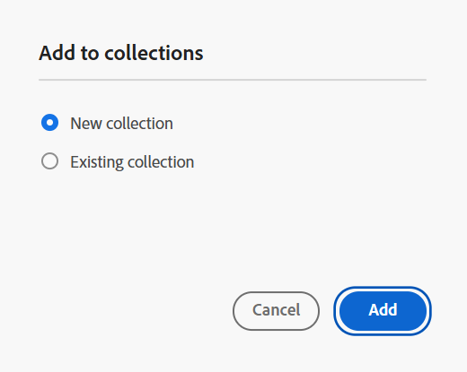{width="300"}

- エディターでファイルのタブを右クリックして、コンテキストメニューを開きます。 **お気に入りリストにファイルを追加するには、**&#x200B;に追加/**コレクション**&#x200B;を選択します。

  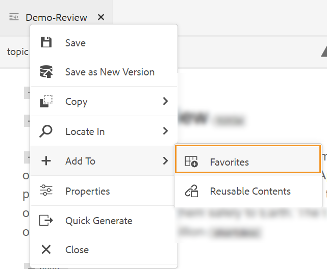


>[!NOTE]
>
> - お気に入りリストから項目を削除するには、お気に入りコレクションの項目の横にあるオプションアイコンを選択し、**コレクションから削除**&#x200B;を選択します。
> - ファイルを開かずにプレビューするには、ファイルを選択し、オプションメニューから「**プレビュー**」を選択します。

コレクションの&#x200B;**オプションメニュー**

コレクションで使用できるオプションメニューを使用して、多くのアクションを実行することもできます。

{width="650"}

- **名前を変更**：選択したコレクションの名前を変更します。
- **削除**：選択したコレクションを削除します。
- **更新**: リポジトリからファイルとフォルダーの新しいリストを取得します。
- **Assets UI**&#x200B;で表示：Assets UIでファイルまたはフォルダーの内容を表示します。

>[!NOTE]
>
> 上部の更新アイコンを使用して、リストを更新することもできます。


### リポジトリ

リポジトリアイコンを選択すると、DAMで使用可能なファイルとフォルダーのリストが表示されます。 デフォルトでは、タイトルでファイルを表示できます。 ファイルにカーソルを合わせると、ファイルのタイトルとファイル名がツールチップとして表示されます。

>[!NOTE]
>
> 管理者は、エディターでファイル名でファイルのリストを表示することもできます。 **ユーザー設定**&#x200B;の「**エディターファイル表示設定**」セクションの「**ファイル名**」オプションを選択します。

一度に75個のファイルが読み込まれます。 「**さらに読み込む**...」を選択するたびに75個のファイルが読み込まれ、すべてのファイルが一覧表示されたときにボタンが表示されなくなります。 このバッチ読み込みは効率的で、フォルダー内に存在するすべてのファイルを読み込むよりも、ファイルに迅速にアクセスできます。

DAM内で必要なファイルに簡単に移動し、エディターで開くことができます。 ファイルを編集するために必要なアクセス権がある場合は、編集できます。

エディターでオーディオまたはビデオファイルを選択して再生することもできます。 ボリュームを変更したり
ビデオのビュー。 ショートカットメニューには、ダウンロード、再生の変更のオプションもあります
表示速度を向上したり、ピクチャインピクチャを表示したりできます。

マップを選択し、Enter キーを押すかダブルクリックして、**マップビュー**&#x200B;で開きます。 詳細については、[左パネル &#x200B;](#left-panel) セクションの&#x200B;**マップビュー**&#x200B;機能の説明を参照してください。 トピックを選択し、Enter キーを押すかダブルクリックして、[&#x200B; コンテンツ編集エリア &#x200B;](#content-editing-area)で開きます。 エディターから直接ファイルをナビゲートして開くことができるため、時間を節約し、生産性を向上できます。

**リポジトリ内のフィルター検索**

エディターには、テキストを検索するための拡張フィルターが用意されています。 Adobe Experience Manager リポジトリの選択したパスに存在するファイル内のテキストを検索してフィルタリングできます。 ファイル内のタイトル、ファイル名、コンテンツを検索します。


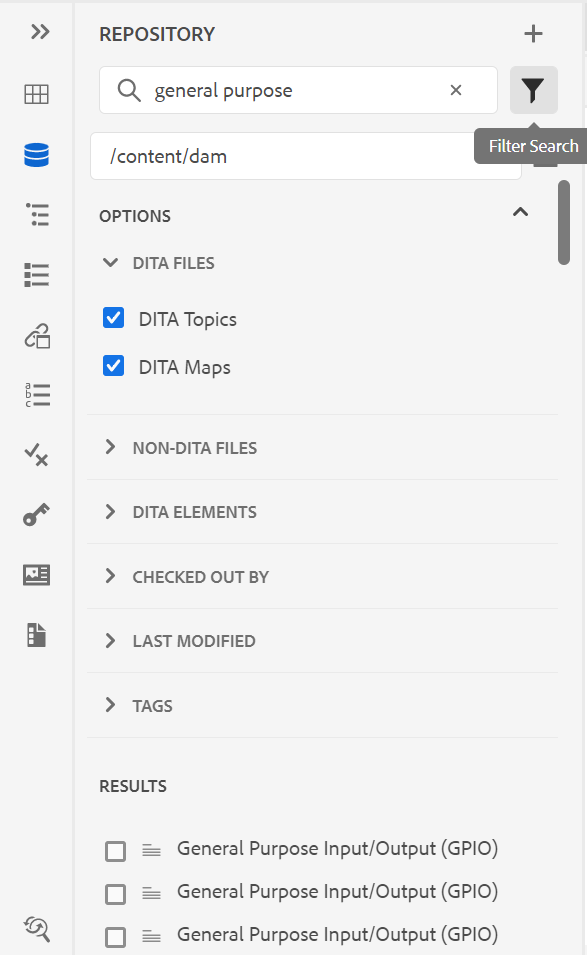{width="300"}

*フィルターを適用して、テキスト`personal spaceship.`*&#x200B;を含むファイルを検索します

**フィルター検索** \（\）アイコンを選択して、フィルターポップアップを開きます。

>[!NOTE]
>
> テキストを検索したり、ファイルをフィルタリングしたりすると、**フィルター検索** \（\）アイコンに青いドットが表示され、検索パネルに表示され、一部のフィルターが適用されていることを示します。


ファイルをフィルタリングし、Adobe Experience Manager リポジトリで検索を絞り込むには、次のオプションがあります。

- **DITA ファイル**：選択したパスに存在するすべての&#x200B;**DITA トピック**&#x200B;および&#x200B;**DITA マップ**&#x200B;を検索できます。 これらはデフォルトで選択されています。
- **DITA以外のファイル**：選択したパスで&#x200B;**Ditaval Files**、**画像ファイル**、**マルチメディア**、**ドキュメント**&#x200B;および&#x200B;**JSON**&#x200B;を検索できます。

   {width="300"}

  *クイックフィルターを使用して、DITA ファイルと非 DITA ファイルを検索します。*

**高度なフィルタリング**

**詳細フィルター**  アイコンを選択して、**詳細フィルター** ダイアログボックスを表示します。

「**一般**」タブと「**詳細**」タブでは、次のオプションを表示できます。

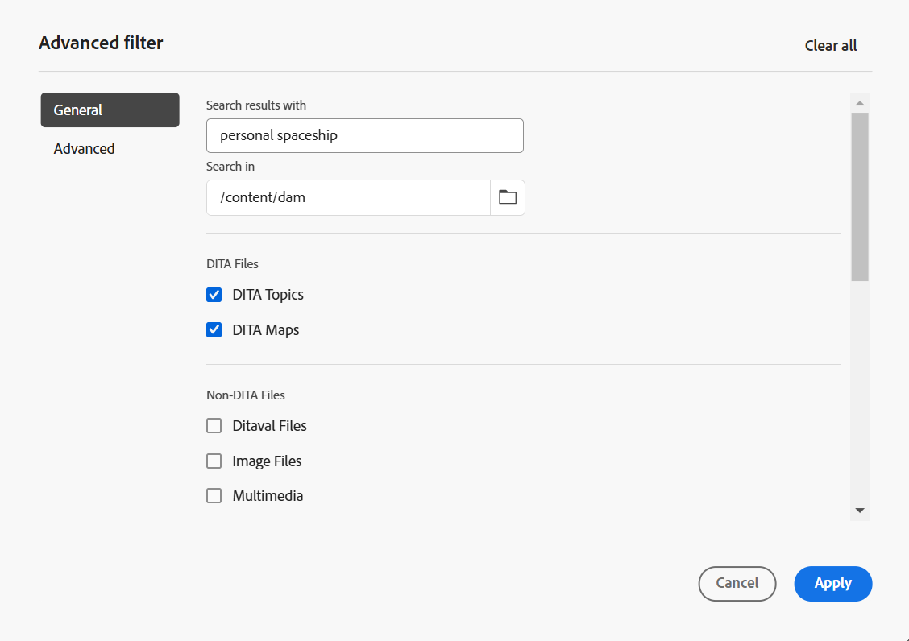 {width="650"}


**一般**

- **次を使用して結果を検索する**: Adobe Experience Manager リポジトリの選択したパスに存在するファイル内のテキストを検索します。 テキストは、ファイル内のタイトル、ファイル名、コンテンツで検索されます。

これは、リポジトリウィンドウの検索ボックスと同期しています。 例えば、リポジトリパネルの検索ボックスに「`general purpose`」と入力すると、**詳細フィルター** ダイアログボックスにも表示されます。その逆も同様です。

- **内の検索**: Adobe Experience Manager リポジトリ内にあるファイルを検索するパスを選択します。

**詳細**

- **DITA要素**：指定したDITA要素の属性で特定の値を検索することもできます。
   - 要素、属性、値を追加するには、**要素を追加**&#x200B;を選択します。
   - 選択したフィルターを適用します。

- 適用されたすべてのフィルターをクリアするには、**すべてをクリア**&#x200B;を選択します。


- **フィルターを閉じる**  アイコンを選択して、フィルターを閉じ、リポジトリのツリービューに戻ります。

  >[!NOTE]
  >
  >システム管理者は、テキストフィルターを設定したり、他のフィルターを表示または非表示にしたりすることもできます。 詳しくは、「Adobe Experience Manager Guides as a Cloud Serviceのインストールと設定」の「*テキストフィルターの設定*」セクションを参照してください。
  >
  >検索したテキストを含むフィルター処理されたファイルのリストが表示されます。 例えば、テキスト `personal spaceship`を含むファイルは、前のスクリーンショットに一覧表示されます。 フィルター処理されたリストから複数のファイルを選択して、編集用に開いたマップにドラッグ&amp;ドロップできます。

**オプションメニュー**

左側のパネルからファイルを開くだけでなく、リポジトリビューで使用可能なオプションメニューを使用して、多くのアクションを実行することもできます。 フォルダー、トピックファイル、メディアファイルのどちらを選択したかによって、異なるオプションが表示されます。

**フォルダーのオプション**

リポジトリビューの&#x200B;*フォルダー*&#x200B;で使用できるオプションメニューを使用して、次のアクションを実行できます。

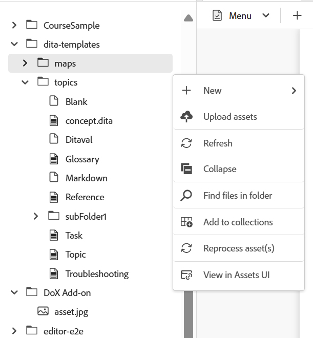{width="550"}


- **新規**：新しいDITA トピック、DITA マップ、またはフォルダーを作成します。

  新しいトピックを作成する手順：
   1. **新規** > **トピック**&#x200B;を選択します。
   2. **新しいトピック** ダイアログボックスが表示されます。

      {width="300"}

   3. **新しいトピック** ダイアログボックスで、次の詳細を入力します。
      - トピックのタイトル。
      - \（Optional\）* トピックのファイル名。 ファイル名は、トピックタイトルに基づいて自動的に提案されます。 管理者がUUID設定に基づいて自動ファイル名を有効にしている場合、「名前」フィールドは表示されません。
      - トピックのベースとなるテンプレート。 例えば、標準の設定では、「空白」、「概念」、「DITAVAL」、「参照」、「タスク」、「トピック」、「マークダウン」、「用語集」、「トラブルシューティング」の各テンプレートから選択できます。 フォルダーにフォルダープロファイルが設定されている場合は、フォルダープロファイルで設定されているトピックテンプレートのみが表示されます。

      - トピックファイルを保存するパス。 デフォルトでは、リポジトリで現在選択されているフォルダーのパスが「パス」フィールドに表示されます。

   4. 「**作成**」を選択します。 トピックは、指定したパスで作成されます。 また、トピックは編集のためにエディターで開かれます。

  新しいDITA マップの作成手順：

   1. **新規** > **DITA マップ**&#x200B;を選択します。
   2. **新しいマップ** ダイアログボックスが表示されます。

      {width="300"}

   3. **新しいマップ** ダイアログボックスで、次の詳細を入力します。
      - マップのタイトル。
      - *\（Optional\）* マップのファイル名。 ファイル名は、マップタイトルに基づいて自動的に提案されます。 管理者がUUID設定に基づいて自動ファイル名を有効にしている場合、「名前」フィールドは表示されません。
      - マップのベースとなるテンプレート。 例えば、標準の設定では、ブックマップまたはDITA マップテンプレートから選択できます。
      - マップファイルを保存するパス。 デフォルトでは、リポジトリで現在選択されているフォルダーのパスが「パス」フィールドに表示されます。
   4. 「**作成**」を選択します。 マップが作成され、「パス」フィールドで指定したフォルダー内に追加されます。 また、マップはマップビューで開きます。 マップエディターでマップファイルを開き、トピックを追加できます。 マップファイルへのトピックの追加について詳しくは、[&#x200B; マップの作成](map-editor-create-map.md#)を参照してください。 または、**マップ コンソールで開く**&#x200B;を選択して、マップ コンソールでマップを開きます。

  新しいフォルダーを作成する手順：

   1. **新規** / **フォルダー**&#x200B;を選択します。
   2. **新規フォルダー** ダイアログボックスが表示されます。

      {width="300"}

   3. **新規フォルダー** ダイアログボックスで、次の詳細を入力します。
      - フォルダーのタイトル。フォルダー名に自動的に変換されます。
      - フォルダーを保存するパス。 デフォルトでは、リポジトリで現在選択されているフォルダーのパスが「パス」フィールドに表示されます。
   4. 「**作成**」を選択します。 フォルダーが作成され、「フォルダーを作成」オプションが実行されたフォルダー内に追加されます。

- **Assetsをアップロード**: ローカルシステムからAdobe Experience Manager リポジトリの選択したフォルダーにファイルをアップロードします。 ローカルシステムから現在の作業トピックにファイルをドラッグ&amp;ドロップすることもできます。 これは、ローカルシステムの画像をトピックに挿入する場合に非常に便利です。

  {width="300"}

  ファイルをアップロードするフォルダーを選択すると、画像のプレビューも表示されます。 ファイル名を変更する場合は、「ファイル名」テキストボックスで変更できます。 「**アップロード**」を選択して、ファイルのアップロードプロセスを完了します。 トピックに画像ファイルをドラッグ&amp;ドロップした場合、画像ファイルが記事に追加され、アップロードされます。

  管理者が&#x200B;*XMLEditorConfig*&#x200B;でUUID オプションを有効にしている場合、**Source** プロパティにアップロードされた画像のUUIDが表示されます。

  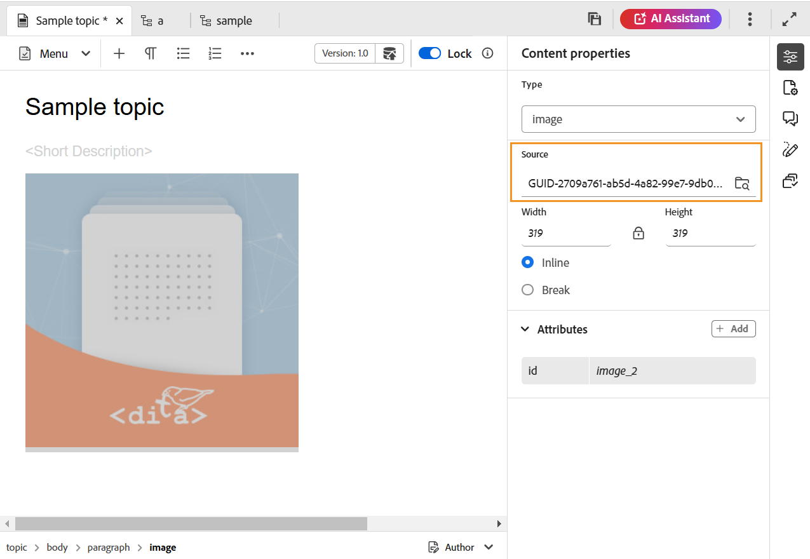

- **フォルダー内のファイルを検索**：検索語句を入力できるリポジトリー検索にフォーカスを移動します。 検索は、リポジトリ内の選択したフォルダーの下で実行されます。 フィルターを適用して、DITA ファイル、画像ファイル、またはその両方を返すこともできます。

  {width="300"}

  ファイルのUUIDを使用して検索することもできます。 その場合、検索結果にはDITA/XML ファイルのタイトルが表示され、ファイルが画像ファイルの場合は、ファイルのUUIDが表示されます。 次の検索例では、画像ファイルのUUIDが検索され、検索結果には、元の画像ファイルのUUIDと、その画像が参照されているファイルのトピックタイトルが表示されます。

  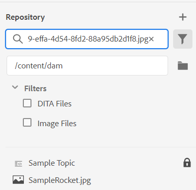{width="300"}

- **折りたたむ**: リポジトリ内の選択したフォルダーを折りたたみます。

  >[!NOTE]
  >
  > フォルダーの横にある&#x200B;**\>** アイコンを使用して展開します。

- **コレクションに追加**：選択したフォルダーをお気に入りに追加します。 既存または新規のコレクションに追加できます。

- **更新**: リポジトリからファイルとフォルダーの新しいリストを取得します。
- **Assets UIで表示**: Assets UIでフォルダーの内容を表示します。

**ファイルのオプション**

メディアファイルとDITA ファイルのどちらを選択したかに応じて、オプションメニューの様々なオプションにアクセスできます。 メディアファイルとDITA ファイルの両方で使用できる一般的なオプションには、次のようなものがあります。

- 編集
- FrameMakerで開く
- 複製
- ロック/ロック解除
- プレビュー
- 移動先
- 名前を変更
- 削除
- 生成
- PDFとしてダウンロード
- 追加
- コピー
- Assets UIでの表示
- プロパティ


リポジトリビューでのファイルの{width="550"}

オプションメニューの様々なオプションについて説明します。

- **編集**：編集するファイルを開きます。 .ditamap/.bookmap ファイルの場合は、[&#x200B; マップエディター](map-editor-advanced-map-editor.md#)で開いて編集します。

- **重複**：このオプションを使用して、選択したファイルの重複またはコピーを作成します。 また、アセットを複製プロンプトで複製ファイルの名前を変更するオプションもあります。 デフォルトでは、ファイルは接尾辞\（例えばfilename\_1.extension\）を付けて作成されます。 ファイルのタイトルはソースファイルと同じままであり、新しいファイルはバージョン 1.0で始まります。 ベースラインが重複ファイルにコピーされない間、すべての参照、タグ、メタデータがコピーされます。
- **ロック**：選択したファイルを編集するためにロックします。 ファイルがロックされている場合、ロックアイコンの上にマウスポインターを置くと、ロックした場合は&#x200B;**自分がロックしている**、別のユーザーがロックしている場合は&#x200B;**自分がロックしている[ ユーザー名]**&#x200B;と表示されます。

- **プレビュー**: ファイル （.dita、.xml、オーディオ、ビデオ、または画像）を開かずに簡単にプレビューできます。 プレビューペインのサイズを変更できます。 コンテンツに`<xref>`または`<conref>`が含まれている場合は、コンテンツを選択して新しいタブで開くことができます。 ファイルのタイトルがウィンドウに表示されます。 タイトルがない場合は、ファイル名が表示されます。 **プレビュー** パネルを閉じるには、閉じるアイコンを選択するか、パネルの外側の任意の場所を選択します。

  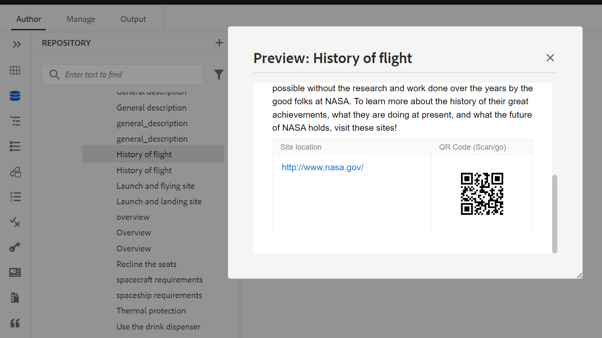

- **名前を変更**：このオプションを使用して、選択したファイルの名前を変更します。 「**アセット名を変更**」ダイアログに新しいファイルの名前を入力します。
   - 任意のタイプのファイル名を変更できます。
   - ファイルの拡張子は変更できません。
   - 2つのファイルに同じ名前を付けることはできません。 そのため、既に存在する名前にファイルの名前を変更することはできません。 エラーが表示されます。

- **移動先**：選択したファイルを別のフォルダーに移動するには、このオプションを使用します。
   - 宛先フォルダーの名前を入力するか、**パスを選択**&#x200B;して宛先フォルダーを選択します。
   - 任意のタイプのファイルをコンテンツフォルダー内の任意の宛先に移動できます。
   - 2つのファイルに同じ名前を付けることはできません。 そのため、同じ名前のファイルが既に存在するフォルダーにファイルを移動することはできません。

  同じ名前で別のタイトルのファイルが存在するフォルダーにファイルを移動しようとすると、「ファイル名を変更して移動」ダイアログが表示され、ファイルを移動する前にファイル名を変更する必要があります。 移動先フォルダー内の移動されたファイルには、新しいファイル名が付きます。

  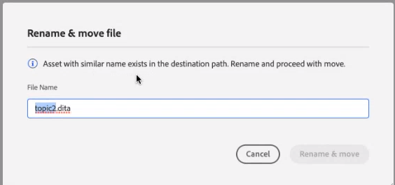{width="550"}

  >[!NOTE]
  >
  > ファイルを別の宛先フォルダーにドラッグ&amp;ドロップすることもできます。

  **除外シナリオ**

  Experience Manager Guidesでは、次の場合、ファイルの名前を変更したり、ファイルを移動したりすることはできません。

   - ファイルがレビューまたは翻訳ワークフローの一部である場合、ファイルの移動や名前の変更はできません。

   - 他のユーザーがファイルをロックしている場合、ファイルの名前を変更したり移動したりできない場合は、ファイルの「名前を変更」または「ファイルに移動」オプションは表示されません。

  >[!NOTE]
  >
  > 管理者がフォルダーに対する権限を与えた場合は、**名前の変更**&#x200B;または&#x200B;**移動先**&#x200B;のオプションのみが表示されます。

  <details>
    <summary> クラウドサービス </summary>

  ファイルの名前を変更したり移動したりしても、各ファイルには一意のUUIDがあるため、ファイルとの既存の参照が壊れることはありません。
  </details>

- **削除**：このオプションを使用して、選択したファイルを削除します。 ファイルを削除する前に、確認プロンプトが表示されます。

   - ファイルを削除する前に、確認プロンプトが表示されます。
   - 他のファイルから参照されていないファイルは削除され、成功メッセージが表示されます。
   - ファイルがロックされている場合は削除できず、エラーメッセージが表示されます。

     >[!NOTE]
     >
     > 管理者がロックされたファイルの削除を禁止している場合は、エラーメッセージのみが表示されます。 詳しくは、「Adobe Experience Manager Guides as a Cloud Serviceのインストールと設定」の「*チェックアウト済みファイルの削除を防止する*」セクションを参照してください。

   - ファイルがコレクションに追加されると、**強制削除** ダイアログボックスが表示され、強制的に削除できます。
   - ファイルが他のファイルから参照されている場合、確認メッセージを含む&#x200B;**強制削除** ダイアログが表示され、ファイルを強制的に削除できます。

     {width="300"}

     >[!NOTE]
     >
     > 管理者がファイルの削除権限を付与している場合、**強制削除**&#x200B;が有効になっています。 そうでない場合、**強制的な削除**&#x200B;は無効になり、参照ファイルを削除する権限がないことを示すメッセージが表示されます。 詳しくは、「Adobe Experience Manager Guides as a Cloud Serviceのインストールと設定」の「*参照ファイルの削除を禁止する*」セクションを参照してください。

   - 参照トピックを削除し、編集用の参照を含むファイルを開いた場合、参照ファイルの壊れたリンクが表示されます。

  >[!NOTE]
  >
  > キーボードのDelete キーを使用して、選択したファイルを同様に削除することもできます。

- **コピー**：次のオプションから選択できます。

   - **UUIDをコピー**：選択したファイルのUUIDをクリップボードにコピーします。

   - **パスをコピー**：選択したファイルの完全パスをクリップボードにコピーします。

- **追加先**：次のオプションから選択できます：
   - **コレクション**：選択したファイルをコレクションに追加します。 既存または新規のコレクションに追加できます。

   - **再利用可能なコンテンツ**：選択したファイルを左側のパネルの「再利用可能なコンテンツ」リストに追加します。

- **プロパティ**：これを使用して、選択したファイルのプロパティ ページを開きます。 このプロパティページには、Assets UIからファイルを選択し、ツールバーの「プロパティ」アイコンを選択してアクセスすることもできます。

- **マップダッシュボードで開く**：選択したファイルがDITA マップの場合、このオプションを選択するとマップダッシュボードが開きます。

- **マップコンソールで開く**：選択したファイルがDITA マップである場合、このオプションを選択するとマップコンソールが開きます。

- **Oxygenで編集**:Oxygen コネクタプラグインで選択したファイルを編集するには、このオプションを選択します。 ファイルが編集用に開かれます。

  >[!NOTE]
  >
  >この機能を環境で有効にするには、カスタマーサクセス チームにお問い合わせください。 これは、すぐに使えるサポートの一部として有効になっていません。 詳細については、『インストールおよび設定ガイド』の「[Oxygen](../cs-install-guide/conf-edit-in-oxygen.md)」セクションで編集するオプションを設定する」を参照してください。


- **Assets UI**&#x200B;で表示：これを使用すると、Assets UI で.dita/.xml ファイルのプレビューを表示できます。 .ditamap/.bookmap ファイルの場合、マップ内のすべてのトピックファイルは、単一の統一されたページごとのビューに表示されます。

- **PDFとしてダウンロード**：このオプションを使用して、PDF出力を生成し、ダウンロードします。

- **生成**：このオプションを使用すると、マップ内のマップまたはトピックをサイトページ、コンテンツフラグメント、またはエクスペリエンスフラグメントに公開できます。

### Map

マップビューアイコンを選択すると、マップファイル内のトピックのリストが表示される場所にマップビューが表示されます。 マップファイルを開いていない場合は、マップビューが空白で表示されます。 任意のマップファイルをダブルクリックすると、このビューでマップファイルが開きます。 マップ内の任意のファイルをダブルクリックして、エディターで開くことができます。

デフォルトでは、タイトルでファイルを表示できます。 ファイルにカーソルを合わせると、ファイルタイトルとファイルパスがツールチップとして表示されます。

>[!NOTE]
>
>管理者は、マップビューで現在開いている親マップのファイル名を表示することもできます。 **ユーザー設定**&#x200B;の「**エディターファイル表示設定**」セクションの「**ファイル名**」オプションを選択します。


マップビューでマップを開くと、現在のマップのタイトルがタブバーの中央に表示されます。 タイトルが長すぎる場合は、省略記号が表示され、タイトルにカーソルを合わせると、ツールヒントにタイトル全体が表示されます。

トピックまたはマップ参照のキー属性を定義すると、タイトル、対応するアイコン、および左側のパネルのキーを表示できます。 キーは`keys=<key-name>`として表示されます。

マップビューのキー{width="300"}

マップファイルの編集権限がある場合は、ファイルも編集できます。 DITA マップを使用したトピックの開きと編集について詳しくは、[DITA マップを使用したトピックの編集](map-editor-advanced-map-editor.md#id17ACJ0F0FHS)を参照してください。

マップビューでは、マップファイルに対して次のオプションを使用できます。

- **マップコンソールで開く**: マップコンソールでマップファイルを開きます。
- **編集**：編集するマップファイルを開きます。
- **オプション**：選択したマップファイルのコンテキストメニューを開きます。

マップファイルのオプションメニューを使用して、次のアクションを実行できます。

マップビューの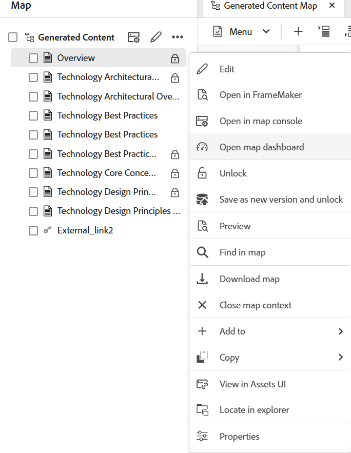

- **編集**: マップエディターで編集するマップファイルを開きます。

- **すべてを選択**: マップ内のすべてのファイルを選択します。

- **選択範囲をクリア**: マップ内の選択したファイルの選択を解除します。

- **ロック**：マップ内の選択したファイルに対するロックを取得します。

- **ロック解除**: マップファイルのロックを解除し、編集可能にします。 変更を以前のバージョンに戻すことはありません。

- **新しいバージョンとして保存してロックを解除**：新しいバージョンを作成し、マップ内の選択したファイルのロックを解除します。

- **プレビュー**: マップファイルのプレビューを開きます。 このビューでは、マップ内のすべてのトピックファイルが、単一の統一されたページ単位のビューで表示されます。

- **コピー**：次のオプションから選択できます。
   - **UUIDをコピー**: マップファイルのUUIDをクリップボードにコピーします。
   - **パスをコピー**: マップファイルの完全パスをクリップボードにコピーします。

- **リポジトリ内の場所**: リポジトリ \（またはDAM\）内のマップファイルの場所を表示します。

- **追加先**：次のオプションから選択できます：
   - **コレクション**: マップファイルをコレクションに追加します。 既存または新規のコレクションに追加できます。

   - **再利用可能なコンテンツ**：左パネルの再利用可能なコンテンツリストにマップファイルを追加します。

- **プロパティ**：これを使用して、マップファイルのプロパティページを開きます。 このプロパティページには、Assets UIからファイルを選択し、ツールバーのプロパティアイコンを選択してアクセスすることもできます。

- **マップ ダッシュボードを開く**: マップ ダッシュボードを開きます。

- **Assets UI**&#x200B;で表示：これを使用すると、Assets UIでマップファイルのプレビューを表示できます。 このビューでは、マップ内のすべてのトピックファイルが、単一の統一されたページ単位のビューで表示されます。
- **マップをダウンロード**：このオプションを選択すると、**マップをダウンロード** ダイアログボックスが開きます。

  **マップをダウンロード** ダイアログボックスで、次のオプションを選択できます。

  **ベースラインを使用**: DITA マップ用に作成されたベースラインのリストを取得するには、このオプションを選択します。 特定のベースラインに基づいてマップファイルとその内容をダウンロードする場合は、ドロップダウンリストから「ベースライン」を選択します。 ベースラインの操作について詳しくは、[&#x200B; ベースラインの操作](./generate-output-use-baseline-for-publishing.md)を参照してください。

  **ファイル階層を統合**：参照されているすべてのトピックとメディアファイルを1つのフォルダーに保存するには、このオプションを選択します。

  オプションを選択せずにマップファイルをダウンロードすることもできます。 この場合、参照されたトピックとメディアファイルの最後の永続バージョンがダウンロードされます。

  「**ダウンロード**」ボタンを選択すると、マップ書き出しパッケージリクエストがキューに入れられます。 パッケージが正常に作成されると、**成功** ダイアログボックスが表示されます。  「**成功**」ダイアログボックスから「**ダウンロード**」ボタンを選択できます。

  マップをダウンロードする準備ができたら、マップのダウンロード準備通知を受け取ります。 ダウンロードに失敗した場合、マップのダウンロードに失敗したという通知が表示されます。

  ダウンロードリンクには、Adobe Experience Managerの通知インボックスからアクセスできます。 インボックスで生成されたマップ通知を選択して、マップを.zip形式でダウンロードします。

  >[!NOTE]
  >
  >  デフォルトでは、ダウンロードされたマップはAdobe Experience Manager通知インボックスに5日間残ります。

- **マップコンテキストを閉じる**: マップファイルを閉じます。

次のスクリーンショットは、マップビューのファイルのオプションメニューを示しています。


オプションメニューを使用して、次のアクションを実行できます。

- **編集**：編集するファイルを開きます。 .ditamap/.bookmap ファイルの場合は、[&#x200B; マップエディター](map-editor-advanced-map-editor.md#)で開いて編集します。

- **ロック**：選択したファイルをロックします。 ロックされたファイルの場合、このオプションは&#x200B;**ロック解除**&#x200B;に変更されます。


  >[!NOTE]
  >
  > - ファイルがユーザーによってロックされている場合、ロックアイコンの上にマウスポインターを置くと、ファイルをロックしたユーザー\（name\）が表示されます。
  > - ファイルをチェックインすると、変更内容の保存を求めるメッセージが表示されます。 変更を保存しない場合は、ファイル内でのみチェックされます。

- **プレビュー**: ファイル （.dita、.xml、オーディオ、ビデオ、または画像）を開かずに簡単にプレビューできます。 プレビューペインのサイズを変更できます。 コンテンツに`<xref>`または`<conref>`が含まれている場合は、コンテンツを選択して新しいタブで開くことができます。  ファイルのタイトルがウィンドウに表示されます。 タイトルがない場合は、ファイル名が表示されます。 **プレビュー** ペインを閉じるには、閉じるアイコンを選択するか、ペインの外側の任意の場所を選択します。
- **コピー**：次のオプションから選択できます。
   - **UUIDをコピー**：選択したファイルのUUIDをクリップボードにコピーします。
   - **パスをコピー**：選択したファイルの完全パスをクリップボードにコピーします。


- **リポジトリ内の場所**：選択したファイルのリポジトリ \（またはDAM\）内の場所を表示します。
- **すべてを展開**: マップファイル内のすべてのトピックを展開します。

- **すべてを折りたたむ**：現在のマップファイルの一部であるすべてのトピックを折りたたみます。

- **追加先**：次のオプションから選択できます：
   - **コレクション**：選択したファイルをコレクションに追加します。 既存または新規のコレクションに追加できます。

   - **再利用可能なコンテンツ**：選択したファイルを左側のパネルの「再利用可能なコンテンツ」リストに追加します。

- **プロパティ**：これを使用して、選択したファイルのプロパティ ページを開きます。 このプロパティページには、Assets UIからファイルを選択し、ツールバーのプロパティアイコンを選択してアクセスすることもできます。

- **Assets UI**&#x200B;で表示：これを使用すると、Assets UI で.dita/.xml ファイルのプレビューを表示できます。 .ditamap/.bookmap ファイルの場合、マップ内のすべてのトピックファイルは、単一の統一されたページごとのビューに表示されます。

- **生成**：選択したファイルの出力をサイトページ、コンテンツフラグメント、またはエクスペリエンスフラグメントで生成します。

>[!NOTE]
>
> DITA マップで選択したトピックのプロパティを開いて、参照の下の&#x200B;**詳細オプション** メニューから編集することもできます。

### コンテンツの再利用

DITAの主な機能の1つは、コンテンツを再利用できることです。 **再利用可能なコンテンツ** パネルには、再利用可能なコンテンツを挿入する一般的な場所からDITA ファイルを保存できます。 追加すると、DITA ファイルはセッション間で再利用可能なコンテンツパネルに残ります。 つまり、後でアクセスするためにDITA ファイルを再度追加する必要はありません。

再利用可能なコンテンツをパネルから現在のトピックにドラッグ&amp;ドロップするだけで、簡単かつ迅速に挿入できます。 ドキュメントに挿入する前に、コンテンツのプレビューを表示することもできます。

デフォルトでは、タイトルでファイルを表示できます。 ファイルにカーソルを合わせると、ファイルタイトルとファイルパスがツールチップとして表示されます。

>[!NOTE]
>
> 管理者は、エディターでファイル名でファイルのリストを表示することもできます。 **ユーザー設定**&#x200B;の「**エディターファイル表示設定**」セクションの「**ファイル名**」オプションを選択します。

再利用可能なコンテンツパネルにDITA ファイルを追加するには、次のいずれかの方法を使用します。

- 再利用可能なコンテンツの横にある&#x200B;**+** アイコンを選択して、ファイルを参照ダイアログボックスを開きます。 追加するファイルを選択し、**追加**&#x200B;を選択してプロセスを完了します。

- リポジトリビューで、目的のファイルの&#x200B;**オプション** アイコンを選択し、コンテキストメニューから&#x200B;**追加** > **再利用可能なコンテンツ**&#x200B;を選択します。

- エディターのファイルのタブを右クリックしてコンテキストメニューを開き、**追加先**/**再利用可能なコンテンツ**&#x200B;を選択します。


ファイルを追加したら、再利用可能コンテンツパネルで、ファイルからすべての再利用可能なコンテンツ要素を表示できます。 再利用可能なコンテンツが、IDと要素名で表示されます。

再利用可能なコンテンツリストにファイルを追加すると、ファイルのUUIDの代わりにファイルのタイトルが表示されます。 ファイルのUUIDを確認するには、ファイルのタイトルにマウスポインターを置くと、ファイルのUUIDがツールチップに表示されます。

{width="400"}

>[!NOTE]
>
> 再利用可能なコンテンツリストに複数のファイルを追加できます。 次に、再利用可能なコンテンツパネルから目的のコンテンツをドキュメントに挿入できます。

**更新**：再利用可能なすべてのコンテンツを再確認し、再利用可能なコンテンツの新しいリストを表示します。

再利用可能なコンテンツパネルからコンテンツを挿入するには、次のいずれかの方法を使用します。

- 挿入する要素の上にマウスポインターを置き、**オプション** アイコンを選択し、ドロップダウンから&#x200B;**再利用可能なコンテンツを挿入**&#x200B;を選択します。

  {width="400"}

  >[!NOTE]
  >
  > ファイルを選択し、**オプション** メニューから&#x200B;**プレビュー**&#x200B;を選択して、ファイルを開かずにプレビューします。 トピックに存在する参照をプレビューすることもできます。 参照IDがウィンドウに表示されます。
  >
  > **Preview** オプションは、エレメントの&#x200B;**Options** メニューでも使用できます。これにより、エレメントを挿入する前に、そのエレメントをすばやくプレビューできます。

- 再利用可能なコンテンツ項目を、ドキュメント内の目的の場所のパネルからドラッグ&amp;ドロップします。

### アウトライン

**アウトライン** アイコンを選択すると、ドキュメントで使用されている要素の階層的なビューが表示されます。

{width="300"}

アウトラインビューには、次の機能があります。

- ドキュメントで使用されているすべての要素のツリービュー。

- エレメントにID、属性およびテキストがある場合は、エレメントと共にそれらを表示できます。

- 作成者ビューとSource ビューの両方でアウトライン ビューにアクセスします。

- フィルタードロップダウンリストを使用して、すべての要素を表示するか、壊れた参照のみを表示します。

- アウトラインビューでエレメントを選択すると、オーサービューまたはSource ビューでエレメントの内容が選択されます。 アウトラインビューは、オーサービューとSource ビューと同期したままになります。 任意のビューで変更を加えた場合は、アウトライン表示で変更を確認できます。 例えば、作成者ビューで段落を追加したりエレメントを更新したりすると、アウトライン表示に表示されます。

  {width="650"}

- エレメントをドラッグ&amp;ドロップします。 エレメントに別のエレメントをドロップすることで、エレメントを簡単に置き換えることができます。 エレメントを別のエレメントの上にドラッグ&amp;ドロップし、そのエレメントの周囲に破線で囲まれた長方形のボックスを表示すると、そのエレメントが置き換えられることを示します。 要素がドロップされる要素が置き換えられます。

  

  エレメントをドラッグ&amp;ドロップすると、破線の長方形は、エレメントを現在の位置に配置できることを示します。 ドラッグ&amp;ドロップが無効な場合、操作が許可されていないことを示すエラーメッセージが表示されます。

  

- *アウトライン* ビューの&#x200B;**オプション** メニューでは、カット、コピー、削除、ID生成、現在の要素の前後に要素を挿入、要素の名前変更または置換、要素のラップ解除、選択した要素からのスニペットの作成などの汎用操作を実行できます。

>[!NOTE]
>
>IDの生成、現在の要素の前後に要素を挿入、要素のラップ解除について詳しくは、[&#x200B; エディター内のその他の機能](web-editor-other-features.md#)を参照してください。

**設定の表示**

「**設定を表示**」オプションを使用すると、次の表示を選択できます。

- **Show ID**：要素のIDを表示します。
- **属性を表示**：属性とその値を表示します。
- **テキストを表示**: テキストを表示します。 テキストが20文字を超える場合、省略記号が表示されます。

ブロック要素に独自のテキストがある場合は、そのブロック要素と共に表示されます。 独自のテキストがない場合は、最初の子要素のテキストがブロック要素と共に表示されます。

{width="550"}

管理者が属性のプロファイルを作成している場合は、これらの属性と設定値を取得します。 **設定**&#x200B;の「**表示属性**」タブで、管理者が設定した表示属性を割り当てることもできます。 エレメントに対して定義された属性は、レイアウトおよびアウトライン表示に表示されます。


詳細については、[左パネル &#x200B;](#left-panel) セクションの&#x200B;*設定*&#x200B;機能の説明にある&#x200B;*表示属性*&#x200B;を参照してください。

**検索機能**

検索機能を使用すると、名前、ID、テキストまたは属性値でエレメントを検索できます。

検索では大文字と小文字が区別されず、文字列と完全に一致します。 検索結果は、文書内の要素の位置に基づいてソートされます。

要素内の文字列が&#x200B;**アウトライン** ビューに表示されている場合は、その文字列を検索できます。 例えば、「Adobe」という文字列がエレメントのテキストに存在し、アウトライン表示パネルに表示されている場合（表示オプション ドロップダウンから「**テキストを表示**」を選択したように）、含まれるエレメントがフィルタリングされます。 ただし、アウトライン表示パネルにテキストが表示されない場合（表示オプション ドロップダウンから「**テキストを表示**」を選択していないため）、含まれる要素はフィルタリングされません。 同様に、IDまたは属性で文字列を選択した場合は、文字列が見つかります。

### 用語集

Experience Manager Guidesを使用すると、用語集タイプのドキュメントを簡単に作成して使用できます。 用語集トピックファイルを作成し、共通の用語集マップに含めることができます。 このマップがルートマップとして追加されると、用語集エントリが用語集パネルに表示されます。

{width="650"}

用語集から用語を挿入するには、パネルからトピック内の目的の場所にエントリをドラッグ&amp;ドロップするだけです。 用語集の「オプション」メニューを使用すると、入力用語の簡単な&#x200B;**プレビュー**、入力用語ファイルの&#x200B;**コピーパス**、またはリポジトリ内の入力用語ファイルを見つけることができます。

次の手順を実行して、テキスト用語を検索し、用語集の略語に置き換えます。

1. テキストまたは用語を検索して変換するDITA トピックまたはマップを開きます。
1. 用語集パネルを選択して、ルートマップに存在する用語集の用語を表示します。 これらの用語をドラッグ&amp;ドロップして、開いているトピックに追加することができます。
1. 用語集パネルで&#x200B;**ホットスポット** ツール \（\）を選択して、特定のテキスト用語を検索し、リンクされた用語集の略語に変換します。 また、逆に、用語集の略語を検索してテキスト用語に変換する場合にも使用できます。


ホットスポットツールの次の設定を行うことができます。

{width="300"}


- **用語集キー**：選択したトピックの検索に使用するDITA マップから用語集キーを選択します。 選択したキーが下に表示されます。 選択したキーを削除するには、**削除** アイコンを選択します。

- **トピック**: エディターで開いた&#x200B;**現在のトピック**、現在のマップで開いたすべての&#x200B;**現在のトピック**、またはマップエディターで編集されている&#x200B;**現在のマップ**&#x200B;のいずれかを選択して、用語を検索します。
- **ステータス別にトピックをフィルタリング**：選択したドキュメントのステータスを持つトピックに検索を制限するように選択できます。 トピックは、ドラフト、編集、レビュー中、承認済み、レビュー済み、完了ステータス、または組織が設定した状態のいずれかになります。
- **アクション**：各トピックの用語集キー&#x200B;**手動**&#x200B;または&#x200B;**すべてのトピックを自動的**&#x200B;で検索できます。 各トピック **に対して**&#x200B;手動を選択すると、各トピックの各用語を変換する前に、確認を求めるメッセージが表示されます。 すべてのトピックに対して&#x200B;**自動的に**&#x200B;を選択すると、すべてのトピックのすべての用語が自動的に変換されます。
- **変換**：検索した&#x200B;**テキストを用語集**&#x200B;に、または&#x200B;**用語集をテキストに変換できます。**
- **オプション**：次のオプションから選択できます。
   - **大文字と小文字を区別する一致**：同じ大文字と小文字が区別される一致を検索します。 例えば、「USB」は「usb」と一致しません。
   - **最初のインスタンスのみを変換**：検索された用語の複数のインスタンスがトピックに存在する場合、最初のインスタンスのみが変換されます。
   - **変換前にファイルをロック**：検索したファイルは、条件が変換される前にロックされます。
   - **変換後に新しいバージョンを作成**：用語の変換が完了した後に、トピックの新しいバージョンが作成されます。
- 「**各トピックに対して手動で**」オプションを選択すると、**次へ** ボタンが表示されます。 選択した設定に基づいて各トピックの条件を変換するには、**次へ**&#x200B;を選択します。 各トピックの用語の変換を求め、次のファイルに移動します。 用語を変換するか、それをスキップして次の用語に移動するかを選択できます。

  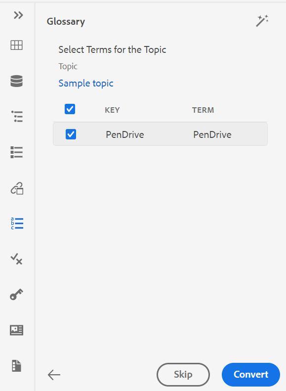{width="300"}

- すべてのトピック **オプションに「**&#x200B;自動的に」を選択すると、**変換** ボタンが表示されます。 「**変換**」を選択して、ドキュメント内のすべての用語をリンクされた用語集の略語に変換します。

変換された用語を含む&#x200B;**更新済み** トピックと、エラー&#x200B;**を含む** トピックのリストが表示されます。 エラーのあるトピックの近くにある情報アイコンにカーソルを合わせると、エラーの詳細が表示されます。

>[!NOTE]
>
> 変換された用語を表示するには、トピックを更新します。

### 条件

条件パネルには、管理者がグローバルレベルまたはフォルダーレベルのプロファイルで定義した条件付き属性が表示されます。 目的の条件をコンテンツにドラッグアンドドロップするだけで、コンテンツに条件を追加できます。 条件コンテンツは、簡単に識別できるように条件に定義された色を使用してハイライト表示されます。

エレメントに複数の条件をドラッグ&amp;ドロップして、エレメントに複数の条件を適用することもできます。 エレメントに複数の条件を適用すると、適用された条件がコンマで区切られてプロパティパネルに表示されます。


ただし、コードビューでは、条件はスペース区切り文字を使用して区切られます。 コードビューで条件を追加または編集する場合は、複数の条件がスペースで区切られていることを確認します。

>[!IMPORTANT]
>
> 次のスクリーンショットは、管理者権限を持つユーザーのものです。 管理者権限を持つユーザーは、条件を追加、編集、削除できます。 それ以外の場合は、通常の作成者として、条件を適用するオプションのみが表示されます。

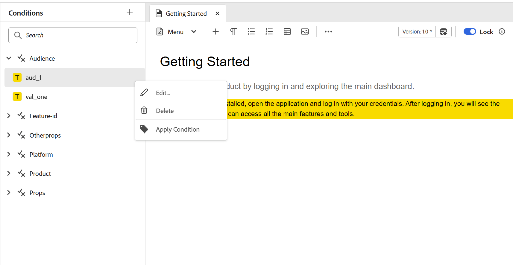

条件を追加または定義するには、条件パネルの横にある「+」アイコンを選択して、条件を定義ダイアログボックスを表示します。

{width="400"}

属性リストから、定義する条件付き属性を選択し、条件の値を入力してから、条件パネルに表示されるラベルを指定します。 条件のグループを定義します。 グループに複数の条件を追加できます。 条件のカラーを定義することもできます。 この色は、条件が適用されるコンテンツの背景色として設定されます。

条件をグループ化し、ネストされたフォルダーに構造化できます。 グループは、複数レベルで条件を作成し、コンテンツでの使用に適して整理するのに役立ちます。

例えば、*AEM Guides*&#x200B;や&#x200B;*Acrobat*&#x200B;などの商品の条件グループを作成できます。 両方のグループの条件付き属性を選択できます。 各グループでは、*User*、*Admin*、*Reviewer*、*Author*&#x200B;など、特定の値を指定できます。

>[!NOTE]
>
> を入力して新しいグループを作成するか、特定の属性に既存のグループを選択します。

`/`を使用して、`AEM Guides/Cloud Service`のようなサブグループを定義できます。


ネストされた階層で整理された{width="300"}


条件を編集するには、オプションメニューから&#x200B;**編集**&#x200B;を選択します。 条件を編集ダイアログボックスが表示されます。

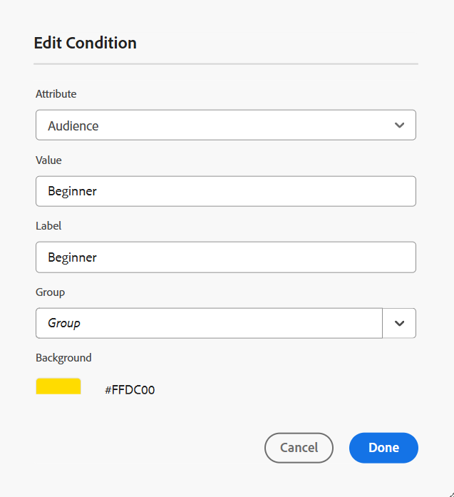{width="400"}

新しい条件を定義する際に設定するのと同じ方法で、詳細を指定します。

### 件名

件名スキームマップは、分類の対象と制御値を定義するために使用されるDITA マップの特殊な形式です。 必要に応じて、件名スキームマップを作成し、ルートマップファイル内で参照できます。 Experience Manager Guidesを使用すると、件名スキームの件名定義のネスト レベル階層を定義できます。

件名スキームマップでは、件名スキーマを簡単に作成して使用できます。 このマップをルートマップとして追加すると、件名スキームが件名スキームパネルに表示されます。 件名スキーム パネルには、使用可能な件名スキームがネストまたは階層的に表示されます。

Experience Manager Guidesでは、ネストされたレベルのサブジェクトスキームのマップもサポートしており、ルートのサブジェクトスキームのマップの下で複数のサブジェクトスキームを定義できます。

次の例は、Experience Manager Guidesで件名スキームを使用する方法を示しています。

1. 選択したツールで件名スキーム ファイルを作成します。 次のXML コードは、`platform`属性の値をバインドする件名スキームを作成します。

```XML
<?xml version="1.0" encoding="UTF-8"?>
    <!DOCTYPE subjectScheme PUBLIC "-//OASIS//DTD DITA Subject Scheme Map//EN" "subjectScheme.dtd">
    <subjectScheme id="GUID-4f942f63-9a20-4355-999f-eab7c6273270">
        <title>rw</title>
        <!-- Define new OS values that are merged with those in the unixOS scheme -->
        <subjectdef keys="os">
            <subjectdef keys="linux">    </subjectdef>
            <subjectdef keys="mswin">    </subjectdef>
            <subjectdef keys="zos">    </subjectdef>
        </subjectdef>
        <!-- Define application values -->
        <subjectdef keys="app" navtitle="Applications">
            <subjectdef keys="apacheserv">    </subjectdef>
            <subjectdef keys="mysql">    </subjectdef>
        </subjectdef>
        <!-- Define an enumeration of the platform attribute, equal to       each value in the OS subject. This makes the following values       valid for the platform attribute: linux, mswin, zos -->
        <enumerationdef>
            <attributedef name="platform">    </attributedef>
            <subjectdef keyref="os">    </subjectdef>
        </enumerationdef>
        <!-- Define an enumeration of the otherprops attribute, equal to       each value in the application subjects.       This makes the following values valid for the otherprops attribute:       apacheserv, mysql -->
        <enumerationdef>
            <attributedef name="otherprops">    </attributedef>
            <subjectdef keyref="app">    </subjectdef>
        </enumerationdef>
    </subjectScheme>
```

{width="300"}

1. .ditamap拡張子を付けてファイルを保存し、DAMの任意のフォルダーにアップロードします。

   >[!NOTE]
   >
   > 親DITA マップ内の件名スキームファイルへの参照を追加できます。

   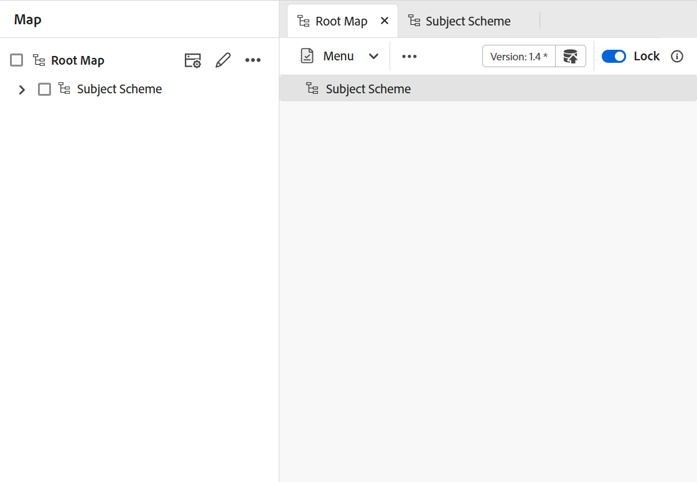{width="550"}

1. 親マップを&#x200B;**ユーザー設定**&#x200B;のルートマップとして設定します。 このマップをルートマップとして追加すると、件名スキームが件名スキーム パネルに表示されます。

   {width="650"}


1. エディターで、件名スキーム定義を使用するファイルを開きます。
1. 目的の件名スキームをコンテンツにドラッグ&amp;ドロップするだけで、件名スキームをコンテンツに適用できます。 その後、コンテンツは定義された色でハイライト表示されます。


**件名の定義と列挙の階層定義の処理**

Experience Manager Guidesでは、同じマップに存在する列挙と件名を処理するだけでなく、2つの個別のマップで列挙と件名を定義する機能も提供しています。 マップ内で1つ以上の件名の定義を定義し、別のマップ内で列挙定義を定義してから、マップ参照を追加できます。 例えば、次のXML コードは、2つの個別のマップで件名の定義と列挙定義を作成します。

件名の定義は`subject_scheme_map_1.ditamap`で定義されています


```XML
<?xml version="1.0" encoding="UTF-8"?> 
    <!DOCTYPE subjectScheme PUBLIC "-//OASIS//DTD DITA Subject Scheme Map//EN" "../dtd/libs/fmdita/dita_resources/DITA-1.3/dtd/subjectScheme/dtd/subjectScheme.dtd"> 
    <subjectScheme id="subject-scheme.ditamap_f0bfda58-377b-446f-bf49-e31bc87792b3"> 

    <title>subject_scheme_map_1</title> 
    
    <subjectdef keys="os" navtitle="Operating system">
        <subjectdef keys="linux" navtitle="Linux">
        <subjectdef keys="redhat" navtitle="RedHat Linux">
        </subjectdef>
        <subjectdef keys="suse" navtitle="SuSE Linux">
        </subjectdef>
        </subjectdef>
        <subjectdef keys="windows" navtitle="Windows">
        </subjectdef>
        <subjectdef keys="zos" navtitle="z/OS">
        </subjectdef>
        </subjectdef>
        <subjectdef keys="deliveryTargetValues">
        <subjectdef keys="print">
        </subjectdef>
        <subjectdef keys="online">
        </subjectdef>
    </subjectdef>
    <subjectdef keys="mobile" navtitle="Mobile">
        <subjectdef keys="android" navtitle="Android">
        </subjectdef>
        <subjectdef keys="ios" navtitle="iOS">
    </subjectdef>
    </subjectdef>
    <subjectdef keys="cloud" navtitle="Cloud">
        <subjectdef keys="aws" navtitle="Amazon Web Services">
        </subjectdef>
        <subjectdef keys="azure" navtitle="Microsoft Azure">
        </subjectdef>
        <subjectdef keys="gcp" navtitle="Google Cloud Platform">
        </subjectdef>
    </subjectdef>
    </subjectScheme>
```

列挙定義はsubject_scheme_map_2.ditamapに存在します。

```XML
<?xml version="1.0" encoding="UTF-8"?> 
        <!DOCTYPE subjectScheme PUBLIC "-//OASIS//DTD DITA Subject Scheme Map//EN" "../dtd/libs/fmdita/dita_resources/DITA-1.3/dtd/subjectScheme/dtd/subjectScheme.dtd"> 
        <subjectScheme id="subject-scheme.ditamap_17c433d9-0558-44d4-826e-3a3373a4c5ae"> 
        <title>subject_scheme_map_2</title> 
        <mapref format="ditamap" href="subject_scheme_map_1.ditamap" type="subjectScheme"> 
        </mapref> 
        <enumerationdef>
        <attributedef name="platform">
        </attributedef>
        <subjectdef keyref="mobile">
        </subjectdef>
        <subjectdef keyref="cloud">
        </subjectdef>
        </enumerationdef>
        </subjectScheme>
```

ここでは、列挙定義が`subject_scheme_map_2.ditamap`に存在する間、`subject_scheme_map_1.ditamap`で件名の定義が定義されます。 `subject_scheme_map_1.ditamap`への参照も`subject_scheme_map_2.ditamap`に追加されています。

>[!NOTE]
>
> `subject_scheme_map_1.ditamap`と`subject_scheme_map_2.ditamap`が互いに参照されているため、件名スキームが解決されています。

サブジェクト列挙の参照は、次の優先順位で解決されます。

1. 同一マップ
1. 参照マップ


列挙が同じマップと参照マップに見つからない場合、参照は解決されません。

**値を特定の要素に制限**

また、トピック内の一部の要素に条件を制限することもできます。 `<elementdef>` タグを使用して要素を定義し、`<attributedef>` タグを使用して要素に適用できる条件を定義します。  `<elementdef>` タグを追加しない場合は、すべての要素に条件を適用できます。
例えば、次の列挙を使用して、`@platform`属性を`<shortdesc>`要素に制限します。  その他の条件は、すべての要素に対して表示されます。

```XML
<enumerationdef>
    <elementdef name="shortdesc">
    </elementdef>
    <attributedef name="platform">
    </attributedef>
    <subjectdef keyref="deliveryTargetValues">
    </subjectdef>
    <subjectdef keyref="os">
    </subjectdef>
  </enumerationdef>
```


**属性** ドロップダウン

**作成者** ビューの&#x200B;**コンテンツ属性** パネルの&#x200B;**属性** ドロップダウンを使用して、件名スキームの値を変更することもできます。

値を変更するには、次の手順を実行します。

1. **属性** ドロップダウンから属性を選択します。
1. 「**編集**」を選択します。
1. **値** ドロップダウンから必要な値を選択します。
1. 「**更新**」を選択します。

ドロップダウンから複数の値を選択して、属性に値を適用することもできます。

**Source ビュー**

Source ビューの属性のドロップダウンから値を変更することもできます。 Source ビューでは、誤った値を追加することもできません。

{width="550"}

**条件パネルから件名スキームを表示して適用する**

また、条件パネルから件名スキームを表示して適用することもできます。

条件パネルから件名スキームを表示するには、システム管理者が設定の「一般」タブの「条件パネル **」オプションで「**&#x200B;件名スキームを表示」を選択する必要があります。 詳細については、[&#x200B; タブバー](#tab-bar)の&#x200B;**設定** セクションを参照してください。

条件パネルには、件名スキーム内の件名定義のフラットな垂直構造が表示されます。

目的の条件をコンテンツにドラッグアンドドロップすることで、コンテンツに条件を追加できます。 条件コンテンツは、条件に定義された色を使用してハイライト表示されます。

### スニペット

スニペットは、ドキュメントプロジェクトの様々なトピックで再利用できる小さなコンテンツフラグメントです。 スニペットパネルには、作成したコンテンツスニペットのコレクションが表示されます。 スニペットを挿入するには、スニペットをパネルからトピック内の目的の場所にドラッグ&amp;ドロップします。 スニペットパネルでは、スニペットを追加、編集、削除、プレビュー、挿入できます。

>[!IMPORTANT]
>
> 次のスクリーンショットは、管理者権限を持つユーザーのものです。 管理者権限を持つユーザーは、スニペットを追加、編集、削除できます。 それ以外の場合は、通常の作成者として、スニペットをプレビューして挿入するオプションのみが表示されます。


スニペットを追加するには、次のいずれかの方法を使用します。

- スニペットの横にある&#x200B;**+** アイコンを選択して、**新しいスニペット** ダイアログボックスを開きます。

  {width="300"}

  新規スニペットダイアログボックスで、作成するスニペットコンテンツのスニペットパネルに表示されるタイトル、説明、XML コードを入力します。 スニペットを保存して作成するには、**作成**&#x200B;を選択します。

- コンテンツ編集領域で、スニペットとして使用するエレメントのパンくずリストを右クリックし、コンテキストメニューから「**スニペットを作成**」を選択します。 新規スニペット ダイアログが表示され、選択した要素のXML コードが&#x200B;**コンテンツ** フィールドに入力されます。 スニペットの&#x200B;**タイトル**&#x200B;と&#x200B;**説明**&#x200B;を入力し、**作成**&#x200B;を選択してスニペットを保存します。

- コンテンツ編集領域で、スニペットとして使用するコンテンツの任意の場所を右クリックし、コンテキストメニューから「**スニペットを作成**」を選択します。 新規スニペット ダイアログボックスが表示され、選択した要素のXML コードが&#x200B;**コンテンツ** フィールドに入力されます。 スニペットの&#x200B;**タイトル**&#x200B;と&#x200B;**説明**&#x200B;を入力し、**作成**&#x200B;を選択してスニペットを保存します。

  次のスクリーンショットは、コンテキストメニューを呼び出すことができるパンくずリストとコンテンツ領域を強調表示しています。

  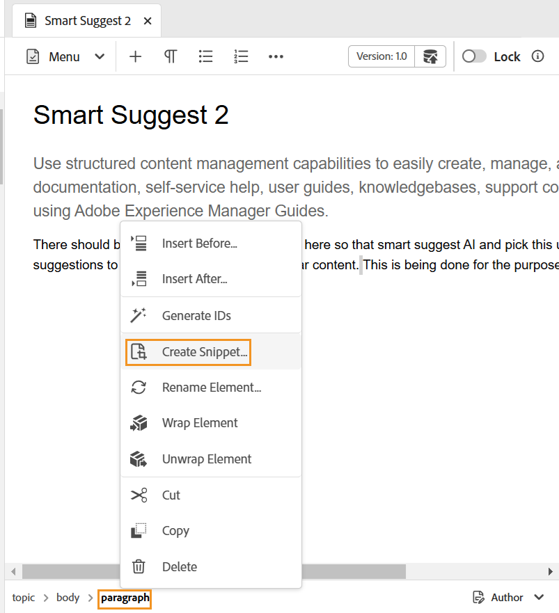{width="350"}


スニペットを挿入するには、次のいずれかの方法を使用します。

- スニペット パネルからスニペットを選択し、トピック内の目的の場所にドラッグ&amp;ドロップします。

- スニペットを挿入する位置に挿入ポイントを置き、必要なスニペットのオプションメニューから「スニペットを挿入」を選択します。


>[!NOTE]
>
> スニペットエントリのコンテキストメニューから、「編集」、「削除」、「プレビューを取得」、「スニペットを挿入」のいずれかを選択することもできます。

### テンプレート

テンプレートパネルは、管理者のみが使用できます。 管理者は、このパネルを使用して、作成者が使用できるテンプレートを簡単に作成および管理できます。 デフォルトでは、テンプレートは&#x200B;*map*&#x200B;および&#x200B;*topic* タイプのテンプレートに分類されます。

{width="300"}

デフォルトでは、タイトルでファイルを表示できます。 テンプレートにカーソルを合わせると、ファイルのタイトルとファイル名がツールチップとして表示されます。

>[!NOTE]
>
> 管理者は、エディターでファイルのリストを表示することもできます。 **ユーザー設定**&#x200B;の「**エディターファイル表示設定**」セクションの「**ファイル名**」オプションを選択します。

カスタムテンプレートの作成方法については、[&#x200B; カスタマイズされたテンプレートに基づくマップの作成](./create-maps-customized-templates.md)を参照してください。

### 引用

Experience Manager Guidesでは、引用を追加および読み込み、コンテンツに適用できます。 ブック、web サイト、ジャーナルの任意のソースからこれらの引用を追加できます。

詳細については、[&#x200B; コンテンツ内の引用を追加および管理する](./web-editor-apply-citations.md)を参照してください。

### 言語変数

Experience Manager Guidesでは、ネイティブ PDF出力で言語変数を使用する機能が提供されています。 言語変数を使用して、PDF出力でローカライズされた文字列を定義したり、出力テンプレートの静的テキストをローカライズしたりできます。 CSS スタイルを使用すると、CSSから取得した文字列をローカライズできます。

詳しくは、[言語変数のサポート &#x200B;](../native-pdf/native-pdf-language-variables.md)を参照してください。

### 変数

Experience Manager Guidesでは、ネイティブ PDF公開用の変数を作成および管理できます。 詳しくは、PDF出力[&#128279;](../native-pdf/native-pdf-variables.md)の変数を参照してください。


### 検索と置換

検索と置換アイコンは、左側のパネルの下部にあります。 検索と置換パネルを使用すると、マップまたはリポジトリ内のフォルダー内のファイル間でテキストを検索して置換できます。 マップのすべてのトピックと、マップ内のサブマップに存在するトピックを検索して置換できます。


デフォルトでは、タイトルでファイルを表示できます。 ファイルにカーソルを合わせると、ファイルタイトルとファイルパスがツールチップとして表示されます。

>[!NOTE]
>
> 管理者は、エディターでファイル名のリストを表示することもできます。 **ユーザー設定**&#x200B;の「**エディターファイル表示設定**」セクションの「**ファイル名**」オプションを選択します。

グローバル検索と置換を実行するには、次の手順を実行します。

1. グローバルな&#x200B;**検索と置換** パネルを開きます。
1. 「**検索**」ドロップダウンを選択し、次のいずれかのオプションを選択して検索を実行します。

   - **現在のマップ**：現在開いているマップを検索するには

     >[!NOTE]
     >
     > このオプションは、編集用にマップを既に開いている場合に表示されます。

   - **パス**：選択したパスを検索するには
   - **マップを選択**：選択したマップで検索するには

1. **オプション** ドロップダウンを使用して、次のオプションから選択できます。

   - **置換前にファイルをロック**：検索語を置き換える前に自動的にファイルをロックする場合は、このオプションを選択します。 この設定は、管理者が編集前にファイルをロックする設定を有効にしている場合に適しています。 バックエンド設定が有効になっている場合は、このオプションを選択する必要があります。 これにより、ファイルのロックダイアログで、変更を加える前にすべてのファイルをロックするように求められなくなります。 このオプションを選択しない場合は、ファイルを編集するために開く前にプロンプトが表示されます。
   - **単語全体のみ**：検索文字列全体を検索する場合は、このオプションを選択します。 例えば、検索文字列にオーバーを入力した場合、検索結果には「オーバー」や「概要」などの単語を含むすべてのファイルが返されます。 入力された正確な語句を返すように検索を制限する場合は、このオプションを選択します。
   - **置換後に新しいバージョンを作成**：テキストを置換するトピックの新しいバージョンを作成する場合は、このオプションを選択します。 また、更新されたファイルごとに追加されるバージョンコメントを指定することもできます。

     このオプションを選択しない場合、変更はトピックの現在のバージョンに保存され、新しいバージョンは作成されません。

   - **間接参照を含める**: DITA マップ内でも間接参照の文字列を検索する場合は、このオプションを選択します。 デフォルトでは、これは無効になっているので、検索は直接参照に対してのみ実行されます。

1. 検索する検索語句またはテキストを入力します。
1. 検索語を置き換えるテキストを入力します。
1. Enter キーを押すか、**検索** アイコン \（\）を選択して検索を実行します。
1. 検索結果リストからファイルを選択します。 ファイルがコンテンツ編集領域で開き、検索された用語がコンテンツで強調表示されます。

1. 「**1つの出現を置換** \（\）を選択して、トピック内で現在強調表示されている検索語句を置換するか、「次に一致する」を選択するか、「」または「」を選択して、テキストの次または前の出現に移動します。
1. 「**すべて置換** \（\）を選択すると、1回のクリックで検索された用語のすべての出現箇所が、1つのファイルで置換された用語に置き換わります。 選択したファイルのすべての出現を置き換えると、通知が表示されます。

**すべてを置換** アイコンを有効にするには、システム管理者が&#x200B;**設定**&#x200B;の「**一般**」タブで「**すべてを置換を有効にする**」オプションを選択する必要があります。

>[!NOTE]
>
> 検索結果リストのファイルにカーソルを合わせると、その右側にある「ファイル内のすべてのファイルを置換」アイコンが表示されます。 ファイルを無視アイコンを使用して、検索結果からファイルを削除することもできます。 無視したファイルはリストから削除され、検索した用語は置き換えられません。

システム全体で一度に1回の置換操作のみを実行できます。操作が実行されるまでは、「処理中のすべての置換操作」ステータスが表示されます。 間にあるすべての置換の操作を中止したり、ログレポートを表示したりすることもできます。 操作を中止すると、その操作に関する通知がインボックスに届きます。 選択したファイルのすべてのオカレンスを置き換えると、成功通知が表示されます。

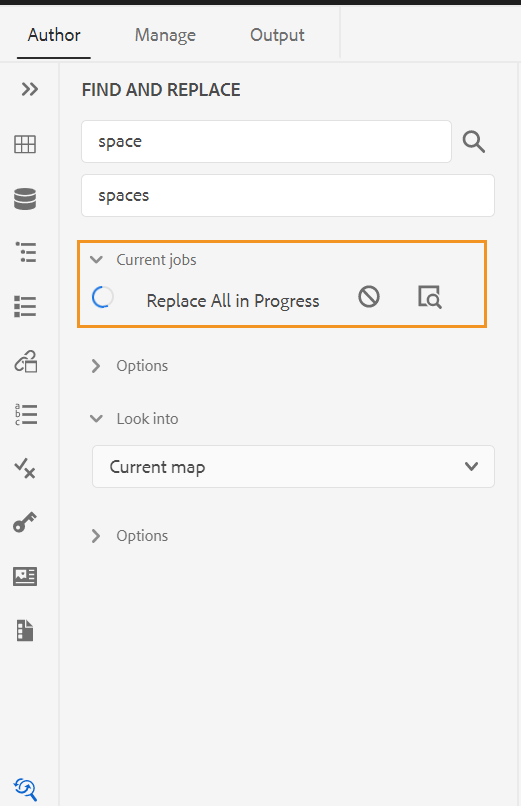{width="300"}

マップの&#x200B;**オプション** メニューの「**マップ内で検索**」オプションを使用して、マップ内のテキストを検索および置換することもできます。 このオプションは、リポジトリパネルまたはマップビューで開いたマップに対して表示されます。

{width="550"}

### PDF テンプレート

を使用すると、様々なPDF テンプレートを操作できます。 詳しくは、[PDF テンプレート &#x200B;](../native-pdf/pdf-template.md)を参照してください。

### レビュー

Experience Manager Guidesには、プロジェクト内のすべてのレビュータスクを表示する機能が用意されています。 **レビュー** パネルから参加しているすべてのレビュープロジェクトとアクティブなレビュータスクをレビュープロジェクト内で表示できます。  その後、レビュータスクを開いて、様々なレビュー担当者のコメントを表示できます。

レビューパネルにレビュータスクが表示されます。 デフォルトでは、タイトルでファイルを表示できます。 ファイルにカーソルを合わせると、ファイルタイトルとファイルパスがツールチップとして表示されます。

>[!NOTE]
>
> 管理者は、エディターでファイル名でファイルのリストを表示することもできます。 **ユーザー設定**&#x200B;の「**エディターファイル表示設定**」セクションの「**ファイル名**」オプションを選択します。

作成者は、エディターを使用してトピック内のコメントに対処できます。

プロジェクトに存在するアクティブなレビュータスクでレビューコメントを表示するには、次の手順を実行します。

1. 左側のパネルで「レビュー」を選択します。 **レビュー** パネルが開きます。  レビュープロジェクトと、自分が属しているレビュープロジェクト内のアクティブなレビュータスクがすべて表示されます。

   {width="300"}
1. レビュープロジェクトを選択し、リストからレビュータスクを選択して開きます。
1. 次の方法でプロジェクトをフィルタリングすることもできます。

   - プロジェクトのタイトルに、検索する検索語句またはテキストを入力します。 次に、Enter キーを押して検索を実行します。 例えば、タイトルに「スペース」という単語が含まれているすべてのプロジェクトを検索できます。

   - 「」を選択して、**フィルター** ダイアログボックスを開きます。 すべてのプロジェクトまたは特定のプロジェクトのみを選択できます。 選択したプロジェクトは、**レビュー** パネルに一覧表示されます。

     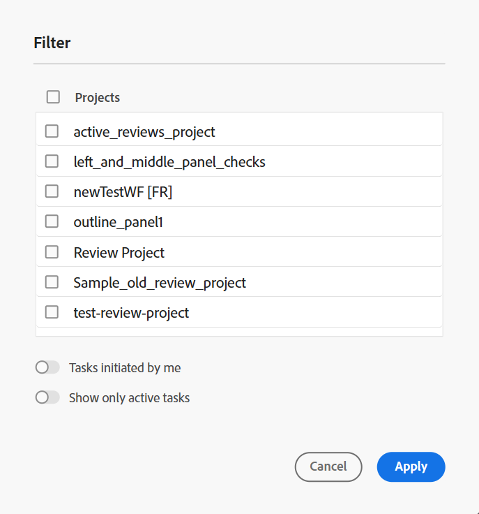{width="300"}

     自分が開始したタスクのみを表示するには、**自分が開始したタスク** オプションを有効にします。 このオプションの切り替え状態は、ページを更新した後も維持されます。 「**アクティブなタスクのみを表示**」オプションを有効にして、プロジェクトリストをフィルタリングして、現在アクティブなタスクを表示します。

1. デフォルトでは、レビュープロジェクトでは、コメントが関連付けられているトピックのフラットリストが表示されます。 左側のパネルから必要なフィルターを適用して、表示されるレビューコメントに基づいてトピックをフィルターします。

   - **すべてのトピックを表示**: プロジェクトに存在するすべてのトピックを一覧表示します。
   - **コメント付きのトピックを表示**：レビューコメントを含むトピックのみを一覧表示します。
1. トピックのタイトルまたはファイルパスに、検索する検索語句またはテキストを入力することもできます。 タイトルまたはファイルパスに用語を含むトピックが一覧表示されます。
1. 任意のトピックをダブルクリックして、オーサービューで開きます。 コメントは、**コメント** パネルで表示できます。

   

   >[!NOTE]
   > 
   > **レビュー** パネルと&#x200B;**コメント** パネルは、常に同期しています。 コメント パネルでは、レビューパネルに読み込まれたレビュータスクに基づいてコメントが読み込まれます。
   >レビューパネルの左側のパネルに、アクティブなレビュータスクと共に、閉じられたレビュータスクを表示できます。
   >さらに、閉じたレビュータスクの場合は、右側のコメントパネルでレビューコメントを表示できますが、「**コメントを読み込み**」と「**バージョンを元に戻す**」ボタンは無効になっています。
   >コメントへの対処方法について詳しくは、[&#x200B; レビューコメントのアドレス &#x200B;](review-address-review-comments.md#)を参照してください。


## コンテンツ編集エリア

コンテンツ編集エリアは、トピックまたはマップのコンテンツが表示される場所です。 この領域ですべてのコンテンツを編集します。 WYSIWYGで編集中のコンテンツが表示されます。

コンテンツ編集領域の左下に、現在のカーソル位置にエレメントのパンくずリストがあります。 右下隅に、使用可能なエディタービューが表示されます。


コンテンツ編集領域のトピックファイルで使用できるエディタービューについて詳しくは、[&#x200B; エディタービュー](./web-editor-views.md)を参照してください。

>[!NOTE]
>
> マップファイルで作業している場合、マップファイルの&#x200B;**レイアウト**&#x200B;表示など、コンテンツ編集領域に異なるオプションまたはビューが表示されます。 詳しくは、[&#x200B; マップエディター機能](./map-editor-advanced-map-editor.md)を参照してください。

## 右側のパネル

右側のパネルには、現在選択されている文書に関する情報が表示されます。

>[!NOTE]
>
> 右側のパネルはサイズ変更可能です。 パネルのサイズを変更するには、パネルの境界にカーソルを置き、カーソルを双方向矢印に変え、選択してドラッグしてパネルの幅のサイズを変更します。

右側のパネルでは、次の機能にアクセスできます。

- [コンテンツプロパティ](#content-properties)
- [ファイルのプロパティ](#file-properties)
- [レビュー](#review-1)
- [変更をトラック](#track-changes)
- [Schematron](#schematron)

### コンテンツプロパティ

右側のパネルで「**コンテンツのプロパティ**」アイコンを選択すると、**コンテンツのプロパティ**&#x200B;機能にアクセスできます。 **コンテンツプロパティ** パネルには、ドキュメント内で現在選択されている要素のタイプとその属性に関する情報が含まれています。

**タイプ**：現在のタグの完全な階層のタグを表示して、ドロップダウンから選択できます。

**属性**: **属性** ドロップダウンパネルは、レイアウトビュー、作成者ビュー、Source ビューで使用できます。 属性を簡単に追加、編集、削除できます。

1. 「**追加**」を選択します。

   {width="300"}

1. **属性** ドロップダウンパネルで、ドロップダウンリストから属性を選択し、属性の値を指定します。  次に、**追加**&#x200B;を選択します。

   複数の属性{width="300"}を持つ属性パネル

1. 属性を編集するには、属性にカーソルを合わせ、**編集** を選択します。

1. 属性を削除するには、属性にカーソルを合わせ、**削除** を選択します。


>[!NOTE]
>
> トピックに参照コンテンツが含まれている場合でも、プロパティパネルを使用してトピックに属性を追加できます。

管理者が属性のプロファイルを作成した場合は、これらの属性と設定値を取得します。 コンテンツプロパティパネルを使用して、これらの属性を選択し、トピック内の関連コンテンツに割り当てることができます。 この方法で条件付きコンテンツを作成し、条件付き出力を作成するために使用することもできます。 コンディショナルプリセットを使用した出力の生成について詳しくは、[&#x200B; コンディショナルプリセットの使用](generate-output-use-condition-presets.md#)を参照してください。

### ファイルのプロパティ

右側のパネルで「ファイルのプロパティ」アイコンを選択して、選択したファイルのプロパティを表示します。 ファイルプロパティ機能は、レイアウト、オーサー、Source、プレビューの4つのモードまたはビューで使用できます。

ファイルプロパティには、次の2つのセクションがあります。

**一般**

「一般」セクションでは、次の機能にアクセスできます。

{width="300"}

- **ファイル名**：選択したトピックのファイル名を表示します。 ファイル名は、選択したファイルのプロパティページにハイパーリンクされます。
- **ID**：選択したトピックのIDを表示します。
- **タグ**：トピックのメタデータタグです。 これらは、プロパティページの「タグ」フィールドから設定します。 ドロップダウンから入力または選択できます。  タグはドロップダウンの下に表示されます。 タグを削除するには、タグの横にある十字アイコンを選択します。
- **他のプロパティを編集**: ファイルのプロパティ ページから、他のプロパティを編集できます。
- **言語**: トピックの言語を表示します。 プロパティページの「言語」フィールドから設定します。
- **作成日**: トピックが作成された日時を表示します。
- **変更日**: トピックが変更された日時を表示します。
- **によってロックされました**: トピックをロックしたユーザーを表示します。
- **ドキュメントの状態**：現在開いているトピックのドキュメントの状態を選択して更新できます。 詳細については、[&#x200B; ドキュメントの状態](web-editor-document-states.md#)を参照してください。

>[!NOTE]
>
> ファイルプロパティの様々なフィールドの属性値をクリップボードにコピーできます。

**参照**

「参照」セクションでは、次の機能にアクセスできます。

{width="300"}

- **で使用**：現在のファイルが参照または使用されているドキュメントは、「参照で使用」リストに表示されます。
- **送信リンク：**&#x200B;送信リンクには、現在のドキュメントで参照されているドキュメントが一覧表示されます。

デフォルトでは、タイトルでファイルを表示できます。 ファイルにカーソルを合わせると、ファイルタイトルとファイルパスがツールチップとして表示されます。

>[!NOTE]
>
> 管理者は、エディターでファイル名でファイルのリストを表示することもできます。 **ユーザー設定**&#x200B;の「**エディターファイル表示設定**」セクションの「**ファイル名**」オプションを選択します。

>[!NOTE]
>
> すべての使用済み参照と出力参照は、文書にハイパーリンクされています。 リンクされたドキュメントを簡単に開いて編集できます。

ファイルを開くだけでなく、「参照」セクションの「**オプション**」メニューを使用して、多くのアクションを実行することもできます。 実行できるアクションには、編集、プレビュー、UUIDのコピー、パスのコピー、コレクションへの追加、プロパティなどがあります。

### レビュー

レビューアイコンを選択するとレビューパネルが開き、現在開いているドキュメントのレビュータスクを選択してコメントを表示できます。

{width="300"}

複数のレビュープロジェクトを作成した場合は、ドロップダウンから1つを選択して、レビューコメントにアクセスできます。

レビューパネルを使用すると、トピックに対するコメントの返信を表示および投稿できます。 コメントは1つずつ承認または却下できます。

>[!NOTE]
>
> コメントボックスと返信ボックスは、複数行の入力をサポートしており、ユーザーは必要に応じて拡張して、包括的なコメントを提供したり、コメントに対する詳細な返信を行ったりできます。 **Shift** + **Enter**&#x200B;を使用して、コメントまたは返信の書き込み中に次の行に移動できます。

詳細については、[&#x200B; アドレスのレビューのコメント &#x200B;](review-address-review-comments.md#)を参照してください。

### 変更をトラック

右側のパネルの「変更履歴」機能を使用すると、ドキュメントで行われたすべての更新の情報を表示できます。 ドキュメントに加えられた特定の更新を検索することもできます。

>[!NOTE]
>
> 変更履歴の追跡機能には、[&#x200B; タブバー](#tab-bar)の「変更履歴を有効/無効にする」機能を使用して追跡されたすべての更新が表示されます。

### Schematron

「Schematron」とは、XML ファイルのテストを定義するために使用されるルールベースの検証言語を指します。 エディターはSchematron ファイルをサポートしています。 スキーマトロンファイルを読み込み、エディターで編集することもできます。 Schematron ファイルを使用すると、特定のルールを定義し、DITA トピックまたはマップに対して検証できます。

Experience Manager GuidesでSchematron ファイルを操作する方法については、[Schematron ファイルのサポート &#x200B;](./support-schematron-file.md)を参照してください。


**親トピック**: [編集者の概要](web-editor.md)
