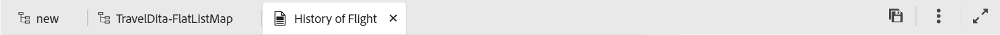
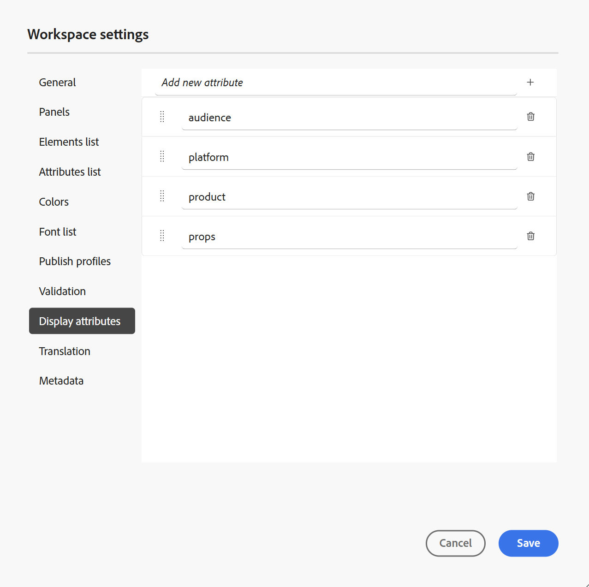
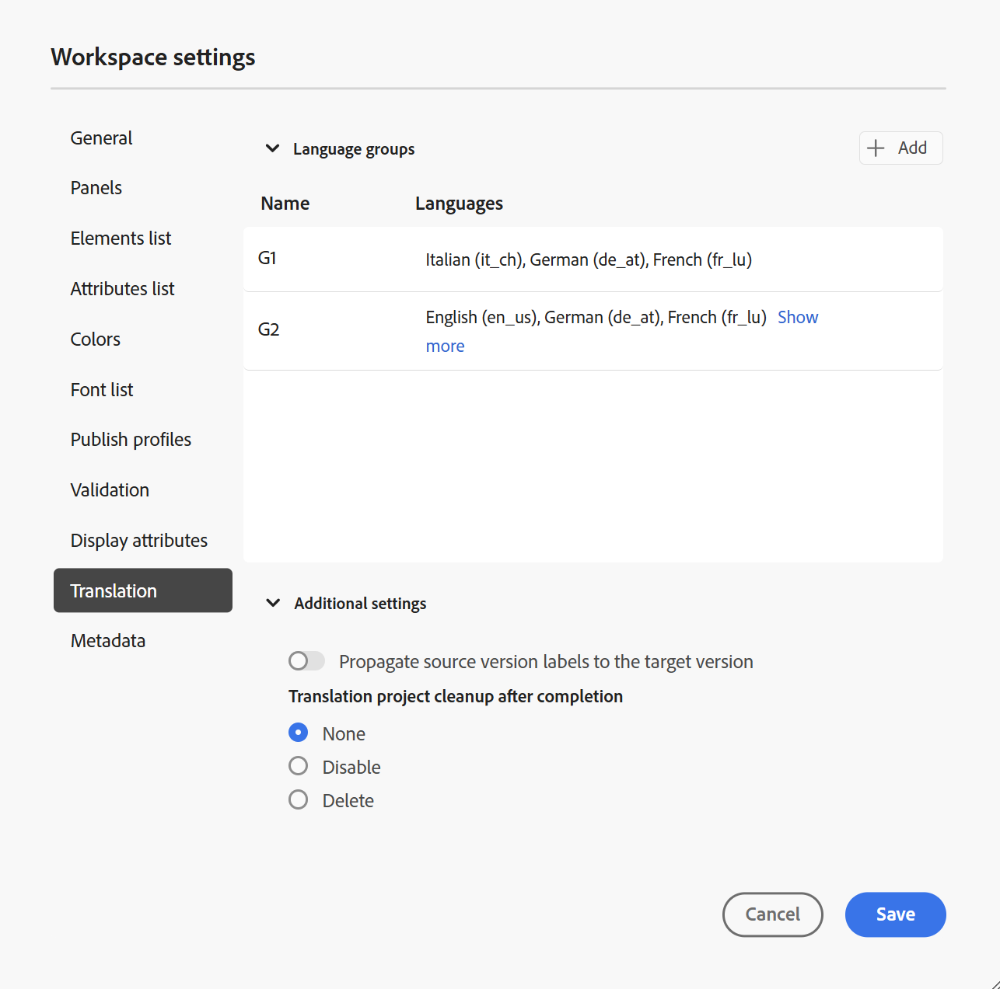
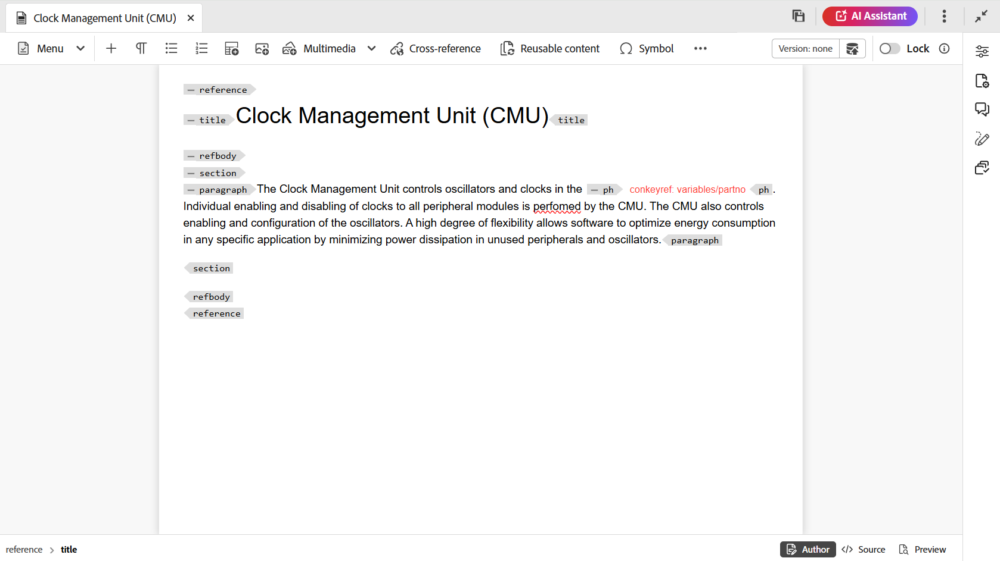
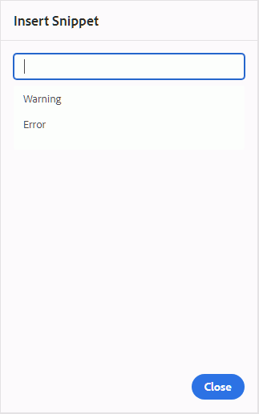
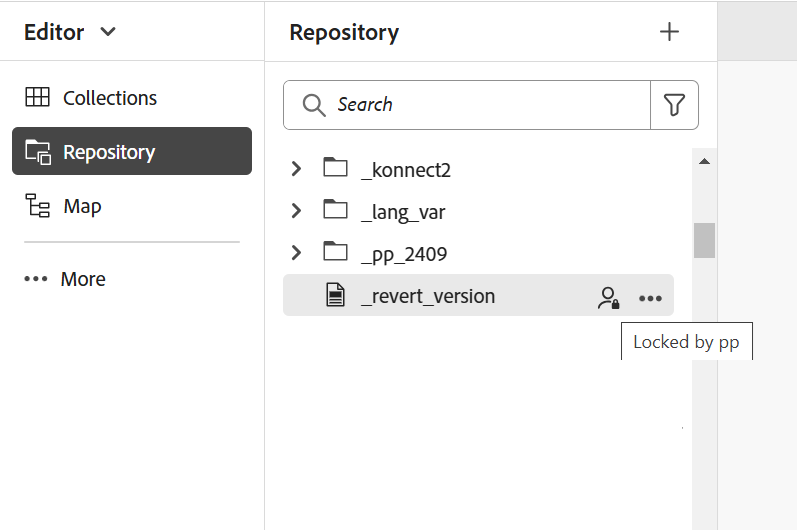
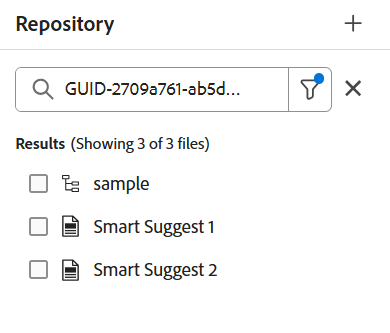
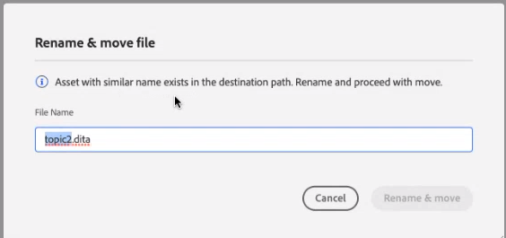
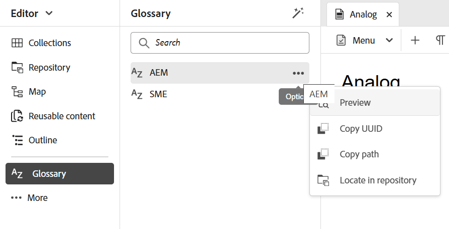
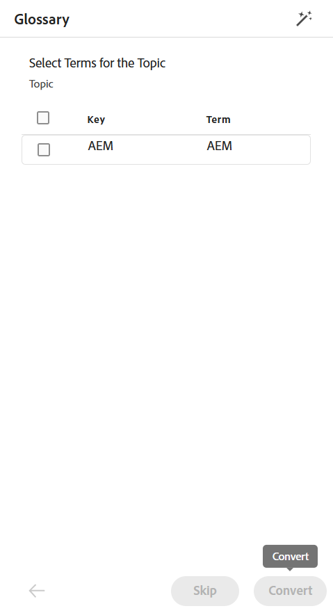

# エディターの機能の理解 {#id176NC500V5Z}

この節では、エディターで使用できる様々な機能について説明します。 エディターは、次のセクションまたは領域に分割できます。

- [ヘッダーバー](#header-bar)
- [タブバー](#tab-bar)
- [ツールバー](#toolbar)
- [左パネル](#left-panel)
- [コンテンツ編集領域](#content-editing-area)
- [右側のパネル](#right-panel)

次のサブセクションでは、エディターの様々なセクションについて詳しく説明します。

## ヘッダーバー

ヘッダーバーは、Adobe Experience Manager ロゴ（統合シェルをExperience Manager Guides UI として使用している場合は、統合シェル）を表示するエディターの上部バーです。 ロゴを選択すると、Experience Managerのナビゲーションページに移動します。


ツールバーの **展開** アイコンを使用して、ヘッダーバーを非表示にし、コンテンツ領域を最大化します。 標準ビューを復元するには、[**展開ビューを終了**] を選択します。


## タブバー

タブバーは、エディターのインターフェイスの上部にあり、次の機能にアクセスできます。



**タブ**

エディタで現在開いているトピックをファイル タブとして表示します。 複数のトピックを同時に開くことができます。それらのトピックは、タブバーのそれぞれのタブに表示されます。 デフォルトでは、タブにファイルのタイトルが表示されます。 ファイルの上にマウスポインターを置くと、ファイルのタイトルとファイルパスがツールチップとして表示されます。

>[!NOTE]
>
> 管理者は、タブでファイル名ごとにファイルのリストを表示することもできます。 **ユーザー環境設定** の **エディターファイル表示設定** セクションの [&#x200B; ファイル名 &#x200B;](./intro-home-page.md#user-preferences) オプションを選択します。

「ファイル」タブを選択すると、コンテキストメニューが開き、「新規バージョンとして保存」、「コピー」、「検索先」、「追加先」、「プロパティ」、「分割」、「PDFとしてダウンロード」、「閉じる」が表示されます。

**すべて保存**

開いているすべてのトピックへの変更を保存します。 エディターで複数のトピックを開いている場合、**すべて保存** を選択するか、**Ctrl**+**S** ショートカットキーを使用すると、すべてのドキュメントがワンクリックで保存されます。 各ドキュメントを個別に保存する必要はありません。

>[!NOTE]
>
> **すべて保存** 操作では、トピックの新しいバージョンは作成されません。 新しいバージョンを作成するには、「**新しいバージョンとして保存** オプションを使用します。

**AI アシスタント**

スマートなヘルプとオーサリング機能を通じて生産性を向上させるように設計された、強力な AI 駆動ツール。 **オーサリング** と **ヘルプ** の 2 つの堅牢な AI 機能がExperience Manager Guides インターフェイスに統合されているため、Experience Manager Guides ドキュメントからのコンテンツの作成や情報へのアクセスを、より迅速かつ効率的に行うことができます。

>[!NOTE]
>
>AI アシスタント機能は、現在、Adobe Experience Manager Guides as a Cloud Serviceで使用できます。

**ビューを展開**:「**展開** アイコンを使用してページビューを展開できます。 この表示では、Adobe Experience Managerのロゴを含むヘッダーバーは非表示です。 これにより、編集するコンテンツ領域が最大化されます。 標準ビューに戻るには、「**展開ビューを終了** アイコンを使用します。

**その他のアクション**: **Assets** および **設定** に移動できます。

「**Assets**」オプションを選択すると、設定に基づいて移動先に移動します。

- **クラウドサービス**: クラウドサービスを使用している場合、「**Assets**」オプションを選択すると、AEMのナビゲーションページに移動します。

- **オンプレミスソフトウェア**:Adobe Experience Manager Guides（4.2.1 以降）を使用している場合は、「**Assets**」オプションを選択すると、Assets UI の現在のファイルパスに移動します。


**設定** オプションは、管理者およびフォルダープロファイル管理者のみが使用でき、次の設定を指定できます。

>[!NOTE]
>
> デフォルトの設定を更新する場合は、変更を有効にするためにドキュメントを再度開く必要があります。

- **一般**：一般設定を使用すると、エディターで使用する辞書を設定できます。 このタブには、**スペルチェック**、**条件**、**オーサリング**、**引用文献** の 4 つのセクションがあります。

  {width="650" align="left"}

   - **スペルチェック**：次の 2 つのオプションがあります。**AEMスペルチェック** および **ブラウザースペルチェック**。 デフォルトでは、エディターはブラウザーのスペルチェック機能を使用し、スペルチェックはブラウザーの組み込み辞書を使用して実行されます。 AEMのスペルチェック機能に切り替えて、Adobe Experience Managerの辞書を使用することができます。また、この辞書をカスタマイズして、カスタムの単語リストを追加することもできます。 Adobe Experience Manager Guides辞書のカスタマイズについて詳しくは、AEM as a Cloud Serviceのインストールと設定の [AEMのデフォルト辞書のカスタマイズ &#x200B;](../cs-install-guide/customize-aem-custom-dictionary.md) 節を参照してください。

   - **条件**

      - **オーサービューで条件付きテキストをハイライト表示**：オーサービューで条件付きテキストをハイライト表示するには、これを選択します。 条件付きコンテンツは、条件用に定義されたカラーを使用してハイライト表示されます。

      - **条件属性を使用して検証**：属性に定義された値の検証を許可する場合に選択します。 これにより、誤った値を追加するのを防ぐことができます。

      - **件名スキーム パネルにタイトルと共にキーを表示**：件名スキームのタイトルと共にキーを表示するには、これを選択します。 このオプションを選択しない場合は、タイトルのみが表示されます。 例えば、ここでは「os」、「audience」、「other」のキーもタイトルと共に表示されます。

        {width="550" align="left"}

      - **条件パネルに件名スキームを表示**：条件パネルに件名スキームを表示するには、これを選択します。 選択を解除すると、定義された条件が条件パネルに表示されます。

   - **オーサリング**

      - **すべてを置換を有効にする**：このオプションを選択して、**検索と置換** パネルに **すべてを置換** アイコンを表示します。

   - **引用**
引用のスタイルを変更します。 プロジェクトで使用する引用スタイルをドロップダウンから選択します。 詳細については、[&#x200B; 引用スタイルの変更 &#x200B;](./web-editor-apply-citations.md#change-citation-style) を参照してください。

   - **AI アシスタント**
これを選択して、Experience Manager Guidesで [AI アシスタント &#x200B;](./ai-assistant.md) 機能を有効にします。 この機能を無効にするには、選択を解除します。

**パネル**：この設定は、エディターコンソールとマップコンソールの左右のパネルに表示されるパネルを制御します。 ボタンを切り替えて、目的のパネルの表示と非表示を切り替えることができます。

{width="650" align="left"}

また、パネル内に存在するフィーチャの表示順序を定義することもできます。 パネル内の使用可能なフィーチャの既定の順序を変更するには、点線のバーを選択して、フィーチャ タブを目的の位置にドラッグ アンド ドロップします。 機能は、要件に応じて、**その他** セクションからパネルのメインセクションに、またはその逆に移動することもできます。 並べ替え後、各左右のパネルで同じ順序で機能が表示されます。

{width="650" align="left"}


一度に最大 8 つのパネルを表示できます。 パネル設定に加えられた変更は、すぐに適用されます。


>[!NOTE]
>
> カスタムパネルが設定されている場合は、パネルのリストにも表示されます。 スイッチを切り替えて、カスタムパネルの表示と非表示を切り替えることができます。

- **要素リスト**：管理者は、作成者がファイルに挿入できる要素のリストを制御したり、要素の表示名を定義したりできます。 「エレメント」 リスト設定では、DITA 仕様に従ってエレメントの名前を指定し、DITA 定義のエレメント名の代わりに使用するラベルを指定できます。

  {width="650" align="left"}

上のスクリーンショットでは、`p` 要素には Paragraph というラベルが付けられ、`codeblock` には他の要素と共に Code Block というラベルが付けられています。 「**上の要素のみを使用**」オプションを選択すると、このリストの有効な要素\（現在の挿入ポイント\）のみが **要素を挿入** ダイアログボックスに表示されます。

次のスクリーンショットでは、以前のスクリーンショットで設定された 4 つの要素のうち、現在のコンテキストで 3 つの要素のみが表示されます。

{width="300" align="left"}

- **属性リスト**：要素リストと同様に、要素の属性リストに表示する属性とその表示名のリストを制御できます。 次のスクリーンショットでは、要素の属性リストに表示されるように設定されている属性は 3 つだけです。

  {width="650" align="left"}

  この設定では、要素に属性を追加しようとすると、リストで設定された属性のリストのみが表示されます。

  {width="300" align="left"}

- **カラー**: **条件** の事前設定済みの背景色のリストを表示します。 ユーザーは、条件をトピックに適用する際に背景色を選択できます。 また、管理者は、カスタムの背景色を作成してリストに追加することもできます。 新しいカラーを追加するには、「**カラー名**」フィールドに目的の名前を入力し、カスタムのカラーを選択して、「**+**」アイコンを選択します。 カスタムカラーは、カラーリストの最後に表示されます。

- **プロファイルの公開**:**ナレッジベース** 出力の公開に使用できるプロファイルが含まれています。 ターゲットのナレッジベース用に新しいプロファイルを作成できます。 例えば、Salesforceや ServiceNow などです。

   - **Salesforce プロファイルの作成**

     **前提条件**

      - Salesforce用に接続アプリケーションを作成します。 詳しくは、[API 統合のための OAuth 設定の有効化 &#x200B;](https://help.salesforce.com/s/articleView?id=sf.connected_app_create_api_integration.htm&type=5) を参照してください。

      - 接続アプリケーションを設定する際は、次の点を確認します。

         - コールバックを指定します。

           `URL: http://<server name>:<port>/bin/dxml/thirdparty/callback/salesforce`

         - 次の OAuth 範囲を選択します。
            - フルアクセス （フル）
            - 「API を使用してユーザーデータを管理」を選択します（api）

     アプリを設定すると、Salesforceは **Consumer Key** と **Consumer Secret** を提供します。 これらを使用して、Salesforce プロファイルを作成できます。


   - Salesforce プロファイルを作成するには、「{ サーバータイプ **」ドロップダウンから** 0}Salesforce **ナレッジベースを選択します。**&#x200B;プロファイル名を入力します。 **サイト URL** に、出力の公開に使用するコンシューマーサイトを入力し、Salesforce コンシューマーサイトから提供される **コンシューマーキー** と **コンシューマーシークレット** を追加します。 次に、新しく作成したプロファイルを **検証** および **保存** します。

     {width="550" align="left"}

     >[!NOTE]
     >
     >AEMでSalesforceのプロキシを設定するには、Experience Manager Guidesで Apache HTTP Components Proxy Configuration を使用します。 方法について説明します [AEM リンクチェッカーのプロキシを設定する &#x200B;](https://helpx.adobe.com/experience-manager/kb/How-to-configure-proxy-for-the-AEM-Link-Checker-AEM.html)。


   - **ServiceNow プロファイルの作成**

     **前提条件**

     アセットをアップロードするように ServiceNow サーバーを設定します。
      - **ServiceNow** サーバーに接続します。
      - **システムプロパティ**/**セキュリティ** に移動します。
      - 次のオプションのチェックを外します。

        **このプロパティは、アップロード（すべてのバージョンの Eureka 以降）の MIME タイプチェックを有効にするように設定する必要があります。 添付ファイルの MIME タイプ検証を有効（true）または無効（false）にします。 glide.attachment.extensions で設定されたファイル拡張子は、アップロード中に MIME タイプがチェックされます。**

      - 「**保存**」を選択します。

     アプリを設定したら、**ServiceNow** プロファイルを作成します。

   - プロファイルを作成するには、「**サーバータイプ**」ドロップダウンから ServiceNow ナレッジベースを選択します。 プロファイル **名前** を入力します。 **ServiceNow URL** に、出力の公開に使用するコンシューマーサイトを入力し、ServiceNow コンシューマーサイトから提供される **ユーザー名** と **パスワード** を追加します。 次に、新しく作成したプロファイルを **検証** および **保存** します。

     {width="550" align="left"}

  検証後、DITA Map の出力プリセットで公開プロファイルを選択し、それを使用して、選択した **Salesforce** または **ServiceNow** サーバーへの出力を生成できます。

  [&#x200B; ナレッジベース &#x200B;](../user-guide/generate-output-knowledge-base.md) 出力プリセットの詳細情報。


- **検証**：このタブには、エディターでスキーマトロン検証を設定するためのオプションが含まれています。 次の機能を有効にできます。

   - **ファイルを保存する前に検証チェックを実行**：保存操作の前に、選択したスキーマトロンファイルを使用してスキーマトロン検証を実行する場合は、これを選択します。 「+」アイコンを選択して、スキーマトロンファイルを追加できます。 選択したスキーマトロンファイルが一覧表示されます。

     >[!NOTE]
     >
     >選択したスキーマトロンファイルは、選択したフォルダープロファイルに対して保持されます。

     {width="550" align="left"}

     これにより、ユーザーは、選択されたスキーマトロンファイルで定義されたルールを破るファイルを保存できなくなります。 これを選択しない場合、ファイルは変更を保存する前に検証されません。

   - **検証パネルですべてのユーザーがスキーマトロンファイルを追加できるようにする**：エディターの検証パネルでユーザーが任意のスキーマトロンファイルを追加できるようにするには、これを選択します。 これにより、ユーザーは Schematron ファイルを追加し、トピックを Schematron ファイルに対して検証できます。 これが選択されていない場合、スキーマトロンファイルを追加するオプション **スキーマトロンファイルを追加** ボタンは、エディターの **検証パネル** のユーザーには使用できません。


- **属性の表示**：属性リストと同様に、要素の属性リストに表示する属性のリストを制御できます。 デフォルトでは、要素の属性リストに表示されるように、オーディエンス、プラットフォーム、製品、prop の 4 つの **表示属性** が設定されています。 上部の「**追加** アイコンを使用して、表示属性を追加することもできます。 「**削除** アイコンを使用して表示属性を削除することもできます。

  要素に定義されている属性は、レイアウトビューとアウトラインビューに表示されます。

  {width="550" align="left"}

- **翻訳**：このタブには、言語グループの作成、ソースラベルのターゲットバージョンへの伝播、翻訳プロジェクトのクリーンアップを行うオプションが含まれています。

  {width="550" align="left"}

   - **言語グループ**：管理者は、言語グループを作成し、それらをセットとして使用してコンテンツを翻訳できます。

     新しい言語グループを作成するには、次の手順を実行します。

      1. 「**追加**」を選択します。
      1. 言語グループ名を入力します。 各言語には、一意の名前を付ける必要があります。 名前フィールドが空の場合や、名前が一意でない場合は、エラーを表示できます。
      1. ドロップダウンから言語を選択します。 複数の言語を選択できます。

         言語の最初の数文字または言語コードを入力して、目的の言語をフィルタリングします。 例えば、名前またはコードの先頭に「en」が含まれるすべての言語をフィルタリングする場合は、「en」と入力します。

      1. 完了アイコンを選択して、選択した言語をグループに追加します。 言語が表示されます。 3 つ以上の言語を追加すると、「**さらに表示**」オプションが表示されます。 **さらに表示** を選択すると、グループに存在するすべての言語を表示できます。

         >[!TIP]
         >
         >**詳細を表示** を **表示を減らす** に切り替えて、いくつかの言語のみを表示します。

      1. グループ内の言語にポインタを合わせて、言語グループを編集  または削除  します。
      1. **設定** を保存します。

         >[!NOTE]
         >
         >ユーザーは、フォルダープロファイルに設定されている言語グループを表示できます。

   - **ソースバージョンラベルをターゲットバージョンに反映**：ソースファイルバージョンのラベルを翻訳済みファイルに渡すには、このオプションを選択します。 デフォルトでは無効になっています。
   - **完了後の翻訳プロジェクトのクリーンアップ**：翻訳後に翻訳プロジェクトが自動的に無効または削除されるように設定する場合は、このオプションを選択します。 デフォルトでは、**なし** が選択されているため、翻訳後もプロジェクトは存在します。

     翻訳プロジェクトは、後で使用する場合に無効にすることができます。 プロジェクトを削除すると、プロジェクト内のすべてのファイルとフォルダが完全に削除されます。


- **メタデータ**:「バージョン履歴 **ダイアログボックスに表示されるトピックのバージョンメタデータとその値を制御でき** す。  メタデータパスで、メタデータを選択するノードの場所を指定します。 また、メタデータのカスタム名をラベルとして定義することもできます。 デフォルトのプロパティは、タイトル、ドキュメントの状態、タグです。

  メタデータは、アセットの `/jcr:content` ノードの下の任意のプロパティから選択できるので、プロパティのパスをメタデータパスとして追加できます。


  メタデータパスが空白の場合は、エラーが表示されます。 ラベルを空白のままにすると、最後の要素がラベルとして選択されます。


  {width="550" align="left"}

  *「バージョン履歴&#x200B;**ダイアログボックスのメタデータ**&#x200B;設定*


  また、これらのメタデータタグの表示順序を定義することもできます。 これらのタグのデフォルトの順序を変更するには、点線のバーを選択して、目的の場所にタグをドラッグ&amp;ドロップします。
メタデータラベルは、エディターの **バージョン履歴** ダイアログボックスで同じ順序で表示されます。

## ツールバー

ツールバーは、エディタで編集するトピックまたはマップを開いたときに表示されます。 ツールバーで使用できる機能は次のとおりです。

- [メニュードロップダウン](#menu-dropdown)
- [コンテンツ挿入オプション](#content-insertion-options)
- [バージョン情報と「新しいバージョンとして保存」ボタン](#save-as-new-version)
- [ロック/ロック解除](#lockunlock)

>[!NOTE]
>
> 上記の機能は、トピック ファイルにのみ適用されます。 マップ ファイルで作業する場合、現在のマップ エディタ ビューに基づいて、ツールバーに異なるオプションが表示されます。 [&#x200B; マップエディター機能 &#x200B;](./map-editor-advanced-map-editor.md) ドキュメントのマップエディターツールバーオプションについて説明します。

### メニュードロップダウン

メニュードロップダウンから、編集アクション、検索と置換、バージョン履歴、バージョンラベル、結合、レビュータスクの作成、変更の追跡、タグ機能にアクセスできます。

これらの機能の詳細は次のとおりです。

**アクションの編集**

エディターでトピックを編集する場合は、様々な編集アクション（**カット** または ***Ctrl***+***X***、**コピー** または ***Ctrl***+***C***、**取り消し** または ***Ctrl***+***Z***、**やり直し** または Ctrl を+**&#x200B;**&#x200B;**&#x200B; &#x200B;**&#x200B;**&#x200B;** **&#x200B;**&#x200B;X など）にアクセスします。


**検索と置換**

**検索と置換** 機能は、オーサーモードとSourceビューモードで使用できます。 有効にすると、[ 検索と置換 ] テキスト バーがトピック編集領域の下部に表示されます。 ショートカットキー **Ctrl**+**F** を使用して、「検索と置換」バーを呼び出すことができます。

{align="left"}

設定アイコン\（\）を使用して、「大文字と小文字を区別しない **検索オプションと** 単語全体のみ **検索オプションを切り替えるこ** ができます。 大文字と小文字を区別しない検索を実行するには、「**大文字と小文字を区別しない** オプションをオン（またはオン）にします。 大文字と小文字を区別して検索を実行する場合は、「**大文字と小文字を区別しない**」オプションをオフ（または選択解除）にします。 単語全体を検索することもできます。

検索は即時に行われます。つまり、「**検索**」フィールドに検索語句または単語を入力すると、その語句が即座に検索され、トピック内で選択されます。 同様に、トピック内のテキストを置き換える場合は、検索語句とその置き換えを各フィールドに入力し、「**置換**」または **すべて置換** ボタンを選択します。

Source ビューでは、**検索と置換** 機能は、特定の要素や属性を検索する場合に非常に役立ちます。 例えば、`@product` 属性の値を置き換える場合は、Source ビューから簡単に実行できます。 オーサービューでは、属性または要素に基づいて検索することはできません。 ただし、**すべて置換** 機能を使用する場合は、XML コードが上書きされる可能性があるので、注意が必要です。

**バージョン履歴**

エディタの **バージョン履歴** 機能を使用すると、DITA ファイルの使用可能なバージョンをチェックして比較し、エディタ自体から任意のバージョンに戻すことができます。 現在のバージョン（作業用コピーの場合もあります）のコンテンツとメタデータを、同じファイルの以前のバージョンと比較できます。 また、比較したバージョンのラベルとコメントを表示することもできます。

>[!NOTE]
>
> バージョン履歴オプションは、トピックまたはマップの最初のバージョンに変更が加えられた場合にのみ表示されます。

バージョン履歴にアクセスしてトピックの特定のバージョンに戻すには、次の手順を実行します。

1. エディターでトピックを開きます。
1. **メニュー** ドロップダウンから **バージョン履歴** を選択します。

   **バージョン履歴** ダイアログボックスが表示されます。

   {width="550" align="left"}

   *トピックの異なるバージョンでの変更をプレビューします。*

1. 比較または元に戻すトピックのバージョンを **比較対象** ドロップダウンリストで選択します。

   >[!NOTE]
   >
   > バージョンにラベルが適用されている場合は、バージョン番号と共に\（括弧で囲まれて\）も表示されます。

1. 「**ラベルとコメントを表示**」オプションを有効にすると、現在のバージョンと比較されたバージョンに適用されたラベルとコメントが表示されます。
1. また、「バージョン履歴 **ダイアログボックスには次の情報も表示され** す。

   **プレビュー** タブ：新しく追加されたコンテンツは緑のフォントで、削除されたコンテンツは赤のフォントで表示されます。

   **メタデータ** タブ：新しく追加されたメタデータは緑のフォントで、削除されたメタデータは赤のフォントで表示されます。

   {width="550" align="left"} でのメタデータの違い

   *バージョン履歴で様々なバージョンのメタデータを比較します。*

   >[!NOTE]
   >
   > システム管理者は、**設定** の「メタデータ」タブから、表示するメタデータを変更できます。 詳しくは、**タブバー [&#x200B; の「その他のアクション** の節を参照してください &#x200B;](#tab-bar)。

   また、現在のバージョンと比較したバージョンのユーザーおよび時間の詳細を表示することもできます。

   ドロップダウンリストからバージョンを選択すると、「**選択したバージョンに戻る**」オプションが使用可能になります。 プレビューウィンドウには、トピックの現在のバージョンと選択したバージョンの違いが表示されます。

1. 「**選択したバージョンに戻す**」を選択して、トピックの選択したバージョンで作業コピーを元に戻します。

   バージョンを元に戻すダイアログボックスが表示されます。

   {width="550" align="left"}

1. \（*オプション*\）以前のバージョンに戻す理由を指定します。 トピックの現在アクティブな作業コピーの新しいバージョンを作成することもできます。

1. 「**確認**」を選択します。

   ファイルの作業コピーは、選択したバージョンに戻ります。 現在アクティブな作業コピーの新しいバージョンを作成する場合は、すべての作業変更を含む新しいバージョンのファイルも作成されます。

   以前のバージョンに戻すと、現在作業中のバージョンが最新バージョンでないことを示す視覚的なキューが表示されます。

   {align="left"}

**バージョンラベル**

ラベルは、特定のトピックが DDLC （ドキュメント開発ライフサイクル）に含まれるステージを識別するのに役立ちます。 例えば、トピックに取り組んでいる場合、ラベルを「承認済み」に設定できます。 トピックが公開され、顧客が使用できるようになったら、そのトピックに「リリース済み」ラベルを割り当てることができます。

Experience Manager Guidesでは、自由形式のテキスト形式でラベルを指定したり、事前定義済みの一連のラベルを使用したりできます。 カスタムラベルを使用すると、システム内の任意の作成者が選択したラベルを指定できます。 これにより柔軟性が生まれますが、システム内でラベルの一貫性が失われます。 この問題を解決するために、管理者は、事前定義済みのラベルのセットを設定できます。 定義済みラベルの設定について詳しくは、「Adobe Experience Manager Guides as a Cloud Serviceのインストールと設定」の *XML Web Editor の設定とカスタマイズ* を参照してください。

これらのラベルは、作成者がラベルを指定する必要がある場合に、ドロップダウンリスト形式で表示されます。 これにより、事前定義された一貫性のあるラベルのみがシステムで使用されるようになります。

トピックにラベルを付ける方法には、Assets UI の [&#x200B; バージョン履歴 &#x200B;](web-editor-use-label.md) パネル、[&#x200B; ベースライン &#x200B;](/help/product-guide/user-guide/generate-output-use-baseline-for-publishing.md) UI、エディターなどがあります。 エディターのバージョンラベル機能を使用すると、作成者はトピックにラベルをすばやく簡単に割り当てることができます。

エディターからトピックにラベルを追加するには、次の手順を実行します。

1. エディターでトピックを開きます。

1. メニューのドロップダウンから **バージョンラベル** を選択します。

   「バージョン・ラベル管理」ダイアログ・ボックスが表示されます。

   {width="650" align="left"}

   [ バージョン ラベル管理 ] ダイアログ ボックスは 2 つの部分に分かれています。左のパネルには、トピックで使用可能なバージョンの一覧とラベル ドロップダウン リスト \（またはラベルを入力するテキスト ボックス\）があり、右のパネルにはトピックのプレビューがあります。

1. ラベルを適用するバージョンを選択します。

   「バージョン」リストからトピックの別のバージョンを選択すると、現在のバージョンと選択したトピックのバージョンの間の変更内容がプレビューパネルに表示されます

   >[!NOTE]
   >
   > ラベルが既にバージョンに適用されている場合は、ドロップダウンリストのバージョン番号の横にある「バージョンを選択」リストの下に表示されます。 既存のラベルを削除するには、ラベルの横にある\（**x**\） アイコンを選択します。

1. 管理者がラベルのリストを定義した場合は、適用するラベルを選択できるラベルのドロップダウンリストが表示されます。 ドロップダウンリストから複数のラベルを選択できます。

   それ以外の場合は、トピックに追加するラベルを入力できるテキストボックスが表示されます。

   >[!NOTE]
   >
   > トピックの複数のバージョンに同じラベルを適用することはできません。 既存のラベルを関連付けようとすると、既存のバージョンから削除して、選択したバージョンのトピックに適用するオプションが表示されます。

1. **ラベルを追加** を選択します。

1. ラベルを適用の確認メッセージで、「**ラベルを移動（別のバージョンで使用されている場合）**」オプションを選択して、既存のバージョンから選択したバージョンにラベルを移動します。 このオプションを選択しない場合、トピックの別のバージョンに割り当てられているラベルがあっても、選択したトピックのバージョンには移動されません。 このようなラベルは、ラベル適用プロセスでは無視されます。

**結合**

マルチオーサー環境で作業すると、トピックまたはマップ内で他の作成者が行った変更を追跡するのが難しくなります。 結合機能を使用すると、変更の表示だけでなく、ドキュメントの最新バージョンに保持される変更をより詳細に制御できます。

- **トピック ファイルの結合**

  トピックの変更を結合するには、次の手順を実行します。

   1. エディターでトピックを開きます。

   1. **結合** を選択します。

      結合ダイアログが表示されます。

      {width="550" align="left"}

   1. *\（オプション\）* リポジトリ内の他の場所から新しいファイルを参照して選択することもできます。

   1. ファイルの現在のバージョンと比較するファイルのバージョンを選択します。

   1. オプションから、次のオプションを選択します。

      - **選択したバージョンからの変更を追跡**：このオプションは、追跡された変更の形式で、すべてのコンテンツの更新を表示します。 その後、ドキュメント内の変更を 1 つずつ承認または却下することも、まとめて承認または却下することもできます。

      - **選択したバージョンに戻す**：このオプションを使用すると、ドキュメントの現在のバージョンが選択したバージョンに戻ります。 このオプションでは、承認または却下されるコンテンツを制御することはできません。

   1. 「**完了**」を選択します。

   1. 「**選択したバージョンからの変更を追跡**」オプションを選択した場合、選択したバージョンからのすべての変更が、右側のパネルの変更履歴に表示されます。

      変更履歴パネルからすべてのコメントを許可または拒否することも、個々のコメントを許可または拒否することもできます。


- **マップ ファイルを合成**

  マップファイルの変更をマージするには、次の手順を実行します。

   1. エディターでマップを開きます。

   1. **結合** を選択します。

      結合ダイアログボックスが表示されます。

      {width="550" align="left"}

   1. *\（オプション\）* リポジトリ内の他の場所から新しいファイルを参照して選択することもできます。

   1. ファイルの現在のバージョンと比較するファイルのバージョンを選択します。

   1. オプションから、次のオプションを選択します。

      - **選択したバージョンからの変更を追跡**：このオプションは、すべてのコンテンツの更新を変更を追跡の形式で表示します。 その後、ドキュメント内の変更を 1 つずつ承認または却下することも、まとめて承認または却下することもできます。

      - **選択したバージョンに戻す**：このオプションを使用すると、ドキュメントの現在のバージョンが選択したバージョンに戻ります。 このオプションでは、承認または却下されるコンテンツを制御することはできません。

   1. 「**完了**」を選択します。

   1. 「**選択したバージョンからの変更を追跡**」オプションを選択した場合、選択したバージョンからのすべての変更が追跡された変更パネル\（右側\）に表示されます。

      [ 変更履歴 ] パネルからすべての変更を反映するか、マップ ファイル内の個々の変更を反映するか、反映しないかを選択できます。


**レビュータスクを作成**

エディタから直接、現在のトピックまたはマップ ファイルの [&#x200B; レビュータスクを作成 &#x200B;](./review-send-topics-for-review.md) できます。 レビュータスクを作成するファイルを開き、「メニュー」ドロップダウンから **レビュータスクを作成** を選択して、レビュー作成プロセスを開始します。

**変更のトラッキング**

「変更を追跡」モードを有効にすると、ドキュメントに対して行われたすべての更新を追跡できます。 トラックの変更を有効にすると、すべての挿入と削除がドキュメントに取り込まれます。 削除されたすべてのコンテンツは取り消し線でハイライト表示され、すべての挿入は緑色のテキストでハイライト表示されます。 また、トピック ページの端に変更バーも表示されます。 ここでも、削除されたコンテンツには赤いバーが表示され、追加されたコンテンツには緑のバーが表示されます。 同じ行に追加と削除がある場合は、緑と赤の両方のバーが表示されます。

次のスクリーンショットは、削除および挿入されたコンテンツと変更バーを示しています。

{width="650" align="left"}

ドキュメント内の変更をトラッキングする一般的なユースケースは、ピアレビューを行う場合です。 変更の追跡を有効にし、レビュー用にドキュメントを共有すると、レビュー担当者は変更の追跡をオンにして変更を加えることができます。 ドキュメントを受け取ったら、提案された更新を表示するメカニズムと、変更を承認または却下する便利な方法が必要です。

Experience Manager Guidesには、ドキュメント内で行われた更新に関する情報を含む、変更履歴の保存機能が用意されています。 トラッキングされる変更機能は、どのような更新が行われ、誰が変更を行い、何時に変更が行われたかに関する情報を提供します。 変更履歴の記録機能を使用すると、文書内の変更候補を簡単に反映または反映しないようにすることもできます。

この機能にアクセスするには、右側のパネルにある **変更を追跡** アイコンを選択します。

{width="300" align="left"}

変更履歴を選択すると、文書内の変更された内容が選択されます。 「変更を許可」アイコンを選択して変更を許可するか、「変更を拒否」を選択して変更を拒否できます。

1 回のクリックですべての変更を承認または拒否する場合は、「**すべての変更を承認**」または「**すべての変更を拒否**」を選択します。

>[!NOTE]
>
> プレビューモードでは、変更されたコンテンツのマークアップの有無に関わらず、ドキュメントを表示できます。 詳しくは、[&#x200B; プレビュー &#x200B;](web-editor-views.md#preview-mode-id19AAGL00163) モードを参照してください。

**タグ**

エディタの **タグ** 機能は、DITA エレメントの表示を制御するトグルボタンです。 有効にすると、コンテンツ内に構造タグが表示され、基になる DITA エレメントをより効果的に表示および管理できるようになります。 無効にすると、エディターはこれらのタグを非表示にし、よりクリーンで焦点を絞ったオーサリング環境を提供します。

次のスクリーンショットは、タグ表示が有効なドキュメントを示しています。

{width="650" align="left"}

タグ付きドキュメントでは、次の操作を実行できます。

- **要素を選択**：要素の開始タグまたは終了タグを選択して、そのコンテンツを選択します。

- **タグを展開または折りたたむ**：タグを展開または折りたたむには、そのタグの「+」または「–」記号を選択します。

- **コンテキストメニューの使用**：コンテキストメニューには、選択した要素の切り取り、コピー、貼り付けを行うオプションが表示されます。 選択した要素の前後に要素を挿入することもできます。 その他のオプションを使用すると、ID を生成したり、選択した要素のプロパティパネルを開いたりできます。

- **要素のドラッグ&amp;ドロップ**：要素のタグを選択して、ドキュメント上で簡単にドラッグ&amp;ドロップできます。 ドロップ位置が要素が許可されている有効な位置である場合、要素はドロップ位置に配置されます。


>[!NOTE]
>
> ユーザーがエディターでタグビューを有効にした場合、セッションをまたいだ場合でも有効のままになります。 つまり、後でタグビューにアクセスするためにタグビューを再度有効にする必要はありません。 新規ユーザーのセッションのタグビューのデフォルト値は、`ui\_config.json` ファイルの `tagsView` プロパティによって決まります。 詳しくは、「Adobe Experience Manager Guides as a Cloud Serviceのインストールと設定 [&#x200B; の「タグビューのデフォルト値の設定 &#x200B;](../cs-install-guide/configure-default-value-tags-view.md) 節を参照してください。

### コンテンツ挿入オプション

**要素** - 

現在または次の有効な場所に有効な要素を挿入します。 キーボードショートカット ***Alt***+***Enter*** を使用して、「要素」ダイアログボックスを開くこともできます。 例えば、段落を編集する場合、「**要素**」ダイアログボックスに、段落に挿入できる要素のリストが表示されます。 挿入する要素を選択します。 キーボードを使用して要素のリストをスクロールし、***Enter*** キーを押して必要な要素を挿入できます。

次の 2 種類の有効な要素を表示できます。

- **現在の位置にある有効な要素**：現在のカーソル位置に挿入できる要素がリストに表示されます。

- **現在の場所以外の有効な要素**：リストには、要素階層内の現在の要素の親の後に挿入できる要素が表示されます。

例えば、インライン `<b>` 要素内にいる場合は、現在の場所に `<u>`、`<xref>`、`<i>` などの要素を挿入できます。 これに対し、`<table>` や `<topic>` などの要素を現在の位置の外側に挿入できます。

検索ボックスに文字または文字列を入力して、で始まる要素を検索することもできます。

{width="300" align="left"}

*&#39;t&#39;で始まるすべての有効な要素を検索するには、&#39;t&#39;と入力します。*

`note` のようなブロック要素内で作業している場合は、「要素を挿入」アイコンを使用して、`note` 要素の後に新しい要素を挿入します。 次のスクリーンショットでは、注記要素が p \（paragraph\）要素内に挿入されています。

{align="left"}

注記要素で [Enter] を押すと、注記要素自体の中に新しい段落が作成されます。 注記外に新しい要素を挿入するには、要素パンくずリストの p 要素\（スクリーンショットでハイライト表示）を選択して、要素アイコンを選択するか、***Alt***+***Enter*** キーを押して、要素を挿入ダイアログボックスを開きます。 次に、目的の要素を選択し、[Enter] を押して、選択した要素を注記要素の後に挿入します。

点滅するブロックカーソルが表示されたときに、2 つの要素の間に要素を追加することもできます。


{width="300" align="left"}

たとえば、DITA トピックで作業していて、ブロックカーソルが短い説明と本文の間で点滅している場合は、`prolog` のエレメントを追加してから、著作権、作成者、その他の詳細を追加できます。

新しい要素を入力するもう 1 つの方法は、右クリック メニューを使用する方法です。 ドキュメント内の任意の場所で右クリックして、コンテキストメニューを呼び出します。 このメニューから **要素を挿入** を選択して **要素を挿入** ダイアログボックスを表示し、挿入する要素を選択します。

{width="300" align="left"}

**段落** - 

現在または次の有効な場所に段落要素を挿入します。

**箇条書き** - 

現在または次の有効な場所に箇条書きリストを作成します。 箇条書きリストで、このアイコンを選択すると、項目は通常の段落に変換されます。

**番号付きリスト** - 

現在または次の有効な位置に番号付きリストを作成します。 番号付きリストの場合、このアイコンを選択すると、項目は通常の段落に変換されます。

>[!NOTE]
>
>リスト項目のコンテキストメニューから「**リストを分割**」オプションを選択して、現在のリストを分割し、同じレベルで新しいリストを開始することもできます。

**表** - 

現在または次の有効な位置にテーブルを挿入します。 「表」アイコンを選択して、「単純表の挿入」ダイアログを開きます。

{width="550" align="left"}

>[!NOTE]
>
> MS Word または Excel からテーブルをコピーして、Experience Manager Guides トピックファイルに貼り付けることもできます。 コピーされたテーブルは、XML エディター設定で設定された設定に応じて、`<simpletable>` または `<tgroup>` のいずれかとして貼り付けられます。 詳しくは、「[&#x200B; 貼り付けたテーブルの表示を設定 &#x200B;](../cs-install-guide/conf-pasted-tables.md)」を参照してください。

テーブルに必要な行数と列数を指定できます。 最初の行をテーブルヘッダーのままにする場合は、「**最初の行をヘッダーとして設定**」オプションを選択します。 テーブルにタイトルを追加するには、タイトル フィールドにそのタイトルを入力します。

テーブルを挿入したら、コンテキストメニューを使用してテーブルを修正できます。

{width="550" align="left"}


テーブルのコンテキストメニューを使用して、次の操作を実行できます。

- セル、行、または列の挿入

- セルを右方向と下方向に結合する

- セルを水平または垂直に分割する

- セル、行、列の削除

- ID を生成


また、複数のセル、行全体、テーブルの列に対して属性を定義することもできます。 例えば、テーブルのセルを揃えるには、必要なセルをドラッグして選択します。 コンテンツのプロパティパネル（右側）で、プロパティ **タイプ** が **エントリ** に変わります。

1. 「**属性**」セクションで、「**+追加**」を選択します。
1. **属性** ドロップダウンリストから `@valign` 属性を選択します。
1. 値ドロップダウンリストから、選択したテーブルのセルに適用するテキストの整列を選択します。
1. 「**追加**」を選択します。

{align="left"}

**画像** - 

現在または次の有効な場所に画像を挿入します。 画像アイコンを選択して画像を挿入ダイアログボックスを開き、挿入する画像を検索して選択します。

>[!NOTE]
>
> また、画像をローカルシステムから記事にドラッグ&amp;ドロップして追加することもできます。 この場合、画像ファイルは **Assetsをアップロード** ワークフローを使用して追加されます。  詳しくは、「左パネル **セクションの** Assetsをアップロード [&#x200B; ワークフローを参照し &#x200B;](#left-panel) ください。


{width="650" align="left"}

[ イメージを挿入 ] ダイアログ ボックスで、イメージのイメージ/図形のタイトルと代替テキストを追加できます。

>
>
> 画像を挿入し、その代替テキストを指定すると、最新の DITA 標準に従って `<alt>` 要素内に追加されます。 代替テキストに `@alt` 属性を使用することは非推奨ですが、以前の DITA バージョンでもサポートされています。

「**ファイルを選択**」オプションを使用すると、ファイル名で必要な画像ファイルを検索できます。 検索結果は、パス \（検索場所\）、コレクション、ファイルタイプ、タグでフィルタリングすることもできます。 必要な画像ファイルが見つかったら、そのファイルを選択し、「**選択**」を選択してドキュメントに画像を挿入します。 `.png`、`.svg`、`.gif`、`.jpg`、`.eps`、`.ai`、`.psd` など、様々な形式の画像ファイルを挿入できます。

画像を挿入したら、コンテンツのプロパティパネルで高さ、幅、配置および属性を変更できます。 画像ファイルを選択し、右側のパネルのコンテンツのプロパティパネルで変更を加えます。

{align="left"}

Source フィールドには、挿入した画像ファイルの UUID が表示されます。 挿入された画像ファイルの完全なパスを見つけるには、Source フィールドにカーソルを合わせます。 パスがツールチップに表示されます。

画像のサイズを変更するには、画像ファイルの高さまたは幅の値を指定します。 画像の縦横比は自動的に維持されます。 必要に応じて、画像ファイルの縦横比を維持しないように選択することもできます。それには、ロックアイコン\（縦横比を維持アイコン\）を選択し、「高さ」と「幅」の値を指定します。

画像の配置設定をインラインまたはブレークとして指定することもできます。 「分割」プレースメントオプションを使用する場合は、画像を揃える場所（左、中央または右）を選択できます。

「**属性**」フィールドで必要なプロパティを選択することで、画像ファイルに他のプロパティを追加することもできます。

>[!NOTE]
>
>また、画像のクリック可能領域\（image map\）を定義することもできます。 詳しくは、「[&#x200B; 左パネル **」セクションの** 画像マップを挿入/編集 &#x200B;](web-editor-features.md#left-panel) 機能の説明を参照してください。

**画像ファイルまたはメディアファイルのコンテキストメニュー**

また、コンテキストメニューを使用して、画像ファイルやメディアファイルに対して一般的な操作を実行することもできます。 画像上の任意の場所で右クリックして、コンテキストメニューを呼び出します。

コンテキストメニューには、画像やメディアの切り取り、コピー、貼り付けを行うためのオプションが用意されています。 選択した要素の前後に要素を挿入できます。 要素の名前を変更したり、要素の展開を行ったりするオプションもあります。 選択した画像やメディアをリポジトリで見つけたり、Assets UI でファイルのプレビューを表示したりできます。

コンテキストメニューのその他のオプションでは、パスのコピー、画像マップの編集、要素の名前変更、スニペットの作成、選択した要素の ID の生成を行うことができます。

**画像マップを挿入/編集**

選択したイメージにイメージ マップを挿入します。 トピックや web ページにリンクする、クリック可能な領域を持つ画像は、画像マップと呼ばれます。

現在のトピックでイメージを選択し、[ イメージ マップを挿入/編集 ] アイコンを選択して、[ イメージ マップを挿入 ] ダイアログ ボックスを開きます。

{width="650" align="left"}

リンクとして使用する画像上の領域を定義するには、適切な形状の「長方形 」、「円 」または「多角形 」を選択します。 領域を定義すると、参照ダイアログが表示され、内部または外部のコンテンツへのリンクを指定する必要があります。

{width="650" align="left"}

領域が重なっている場合は、ツールバーの各アイコンをクリックして、図形を前に移動したり、後ろに移動したりできます。 領域を選択して削除アイコンをクリックして、領域を削除することもできます。 領域をダブルクリックすると、「参照」ダイアログが開き、リンク先を変更できます。 画像上で必要な領域をマークしたら、「完了 **を選択して変更を保存し** す。


**マルチメディア**

さまざまな種類のマルチメディア ファイルを挿入します。 マルチメディア ドロップダウンアイコンを選択し、挿入するファイルのタイプを選択します。 サポートされるマルチメディア形式は次の通りです。

- 音声ファイル
- ビデオファイル
- YouTube
- Vimeo

「オーディオまたはビデオファイル」オプションを選択すると、目的のファイルを参照して選択するためのリポジトリ表示が表示されます。 YouTubeまたは Vimeo を選択すると、マルチメディアを挿入ダイアログが表示されます。 ビデオファイルのリンクを「Web リンク」フィールドに貼り付け、「挿入」を選択して、ドキュメントの現在または次の有効な場所にビデオを追加します。

>[!NOTE]
>
> YouTube ビデオリンクを追加する際は、文字列 `watch?v=` を URL の `embed` に置き換える必要があります。 例えば、YouTube ビデオリンク `https://www.youtube.com/**watch?v**=WlIKQOrmZcs` を追加するには、`https://www.youtube.com/**embed/**WlIKQOrmZcs` として追加する必要があります。 この変更により、ビデオがAEM Site およびPDF出力に埋め込まれるようになります。

マルチメディアの挿入ダイアログからオーディオまたはビデオファイルを追加することもできます。 「オーディオ / ビデオファイル」オプションを選択し、参照アイコンを選択してリポジトリ表示を起動します。 リポジトリからオーディオまたはビデオファイルを選択し、「**選択**」を選択して、「オーディオ/ビデオファイル」フィールドにファイルのリンクを追加します。 ビデオファイルを選択した場合、ファイルのプレビューもプレビュー領域に表示されます。 ビデオファイルを再生してプレビューを確認できます。

{width="650" align="left"}

**相互参照**

タイプの参照の挿入 – コンテンツ参照、コンテンツキー参照、キー参照、ファイル参照、Web リンク、メールリンク。

**ファイルを選択** アイコン\（コンテンツ参照およびファイル参照の場合）または **ルート マップを選択** アイコン\（コンテンツ キー参照およびキー参照の場合））を選択して、リンク先のファイルまたはコンテンツを選択します。

{width="650" align="left"}

選択した参照のリンクがドキュメントに追加されます。 リンクのコンテキストメニューには、次のオプションが表示されます。

- **要素を挿入**：指定されたコンテキストで挿入できる有効な要素のリストを表示します。
- **UUID をコピー**：挿入した参照の UUID をコピーします。
- **パスをコピー**：挿入した参照の完全パスをコピーします。
- **ID を生成**：挿入された参照の一意の ID を生成します。

また、参照するファイルの UUID を使用して検索することもできます。 コンテンツとキーの参照リンクの場合は、リンク先のファイルの UUID を入力すると、そのファイルが自動的に検索され、[ プレビュー ] セクションに表示されます。 ファイルの UUID を指定する場合、.xml ファイルのファイル拡張子を明示的に指定する必要はありません。 .xml 拡張子が UUID に自動的に追加されます。

{width="650" align="left"}

管理者が *XMLEditorConfig* で UUIDs オプションを有効にしている場合は、参照されたコンテンツの UUID を **Link** プロパティに表示します。

{align="left"}

>[!NOTE]
>
> **UUID を有効にする** オプションが有効になっていない場合、参照されるコンテンツの相対パスが表示されます。

>[!IMPORTANT]
>
> 参照されるコンテンツの相対パスが **Link** プロパティに表示される場合でも、内部的にはリンクは参照されるコンテンツの UUID を使用して作成されます。

>[!TIP]
>
> コンテンツの参照に関するベストプラクティスについては、ベストプラクティスガイドの参照の節を参照してください。

**フィルター検索**

AEM リポジトリの選択されたパスにあるファイルからテキストを検索できます。 例えば、以下のスクリーンショットでは、「general」が検索されます。 また、拡張フィルターを使用して検索を絞り込むこともできます。 選択したパスに存在する DITA トピックや DITA マップなどのすべての DITA ファイルを検索できます。

選択したパス内の画像ファイル、マルチメディア、文書などの非 DITA ファイルを検索できます。 また、DITA エレメントの属性で特定の値を検索することもできます。 また、指定したユーザーがチェックアウトしているファイルを検索することもできます。

{width="650" align="left"}

>[!NOTE]
>
> また、システム管理者は、テキストフィルターを設定したり、他のフィルターの表示と非表示を切り替えたりすることもできます。 詳しくは、「Adobe Experience Manager Guides as a Cloud Serviceのインストールと設定」の「*テキストフィルターの設定* の節を参照してください。

検索したテキストを含む、フィルターされたファイルのリストが表示されます。 例えば、上のスクリーンショットでは、「一般」というテキストを含んだファイルが一覧表示されます。 ファイルのコンテンツをプレビューすることもできます。


**再利用可能なコンテンツ** - 

プロジェクト内の他のドキュメントに存在するコンテンツを再利用します。 コンテンツを挿入するには、ファイル内のコンテンツに直接リンクするか、キー参照を使用して、表示 [&#x200B; キー参照を解決 &#x200B;](map-editor-other-features.md#id176GD01H05Z) します。 再利用可能なコンテンツ アイコンを選択すると、[ コンテンツを再利用 ] ダイアログ ボックスが表示されます。

{width="650" align="left"}

「コンテンツを再利用」 ダイアログボックスで、ファイル参照用の DITA ファイルまたはキー参照を含む DITA マップファイルを選択します。 選択すると、トピックまたはキー参照がダイアログに表示されます。 挿入するトピックの ID/キーを選択し、「**完了**」を選択してトピック内にコンテンツを挿入できます。

コンテンツ参照を挿入する場合は、ファイルの UUID を入力することもできます。そのファイルの再利用可能なコンテンツが [ プレビュー ] セクションに一覧表示されます。

リンクを挿入する設定に応じて、挿入されたコンテンツの UUID を確認するか、プロパティパネルまたはSource コードビューで相対パスを確認できます。 リンクは常に、参照されるコンテンツの UUID を使用して作成されます。 Adobe Experience Manager Guides as a Cloud Serviceのインストールと設定の *UUID ベースのリンクを設定* を表示します。

>[!NOTE]
>
> 参照されているコンテンツの前後にコンテンツを追加するには、*Alt*+*左* 矢印または Alt+*右* 矢印キーを使用して、カーソルを目的の場所に移動します。

また、参照コンテンツを右クリックし、コンテキストメニューの「**参照をコンテンツで置換**」を選択して、参照コンテンツをトピック内に埋め込むこともできます。

**記号** - 

トピックに特殊文字を挿入します。 記号アイコンを選択して、[ 特殊文字の挿入 ] ダイアログ ボックスを開きます。

>[!NOTE]
>
> Experience Manager Guidesには、移動可能でサイズ変更可能なダイアログボックスが用意されています。 右下隅に 2 本の十字線があるダイアログは、サイズ変更できます。 特殊文字ダイアログのクロスラインは以下のとおりです。

{width="550" align="left"}

[ 特殊文字の挿入 ] ダイアログ ボックスでは、名前を使用して特殊文字を検索できます。 すべての特殊文字は、様々なカテゴリに分類されて格納されます。 「カテゴリを選択」ドロップダウンリストを使用して、カテゴリを選択します。 選択したカテゴリで使用可能な特殊文字が表示されます。 矢印キーを使用して特殊文字のリストを移動するか、挿入する目的の文字を選択できます。 選択した特殊文字の名前と 16 進数コードがリストの下に表示されます。 「**挿入**」を選択して、選択した文字をドキュメントに挿入します。

**キーワード** - 

DITA マップで定義されたキーワードを挿入します。 [ キーワード ] オプションを選択して、[ キー参照 ] ダイアログ ボックスを開きます。

{width="550" align="left"}

キーワードはアルファベット順に表示されます。「検索」（Search） ボックスに検索文字列を入力してキーワードを検索することもできます。 検索結果には、ID または値に文字列を含むキーワードが返されます。 このダイアログには、DITA マップで定義したキーワードが一覧表示されます。 挿入するキーワードを選択して、「**挿入**」を選択します。

挿入したキーワードの属性を変更するには、キーワードを右クリックして「属性」オプションを選択します。 キーワードの**属性ダイアログボックスが開きます。

{width="550" align="left"}

キーワードの属性を変更したり、キーワードに新しい属性を追加したりできます。

**スニペット** - 

現在の場所または次の有効な場所にスニペットを挿入します。 この機能を使用するには、システムでスニペットを定義しておく必要があります。 スニペットの追加について詳しくは、**左パネル** の節にある [&#x200B; スニペット &#x200B;](web-editor-features.md#left-panel) 機能の説明を参照してください。

「スニペット」オプションを選択すると、スニペットを挿入カタログが表示されます。 カタログはコンテキストに依存し、現在の場所で許可されている場合にのみスニペットが表示されます。

次の例は、ドキュメントの現在の場所に挿入できる警告とエラーという 2 つの事前設定済みスニペットを示しています。

{width="300" align="left"}

リストからスニペットを選択すると、ドキュメント内の現在の位置または次の有効な位置にスニペットが挿入されます。 次のスクリーンショットは、ドキュメントに挿入されたエラースニペットを示しています。

{width="400" align="left"}

**引用** - 

引用文献を作成してコンテンツに追加します。 詳細情報 [&#x200B; コンテンツへの引用の追加と管理 &#x200B;](./web-editor-apply-citations.md)

**クエリデータ** - 

データソースに接続し、そのデータを使用してコンテンツを作成します。 [データソースからデータを使用](./web-editor-content-snippet.md)する方法を参照してください。

### バージョン情報と新しいバージョンとして保存

**バージョン情報と新しいバージョンとして保存** 機能は、バージョントラッキングとコンテンツ保存を 1 つの機能に組み合わせたものです。

- バージョン情報には、トピックまたはマップの現在のバージョンが表示されます。 バージョン番号の横にアスタリスク（*）が表示され、変更が保存されていないことを示します。

  トピックまたはマップ ファイルに対して新しいバージョンが作成されるたびに、バージョン番号が変わります。 新しく作成したドキュメントで作業している場合、バージョン情報は **なし** と表示されます。

  {align="left"}


- **新規バージョンとして保存** は、トピックに加えた変更を保存し、トピックの新しいバージョンも作成するボタンです。

  {align="left"}


**新しいバージョンとして保存** を使用してトピックまたはマップを保存すると、次のダイアログ ボックスが表示されます。

{width="300" align="left"}

コメントとバージョンのラベルを入力して変更を識別し、「**保存**」を選択してファイルの新しいバージョンを作成します。

「**新しいバージョンとして保存**」オプションを選択すると、トピックの最初のバージョンが DAM に作成され、トピックの現在のアクティブなバージョンにもなります。 その後、トピックを古いバージョンに戻すと、そのバージョンが現在のアクティブなバージョンになります。

管理者が事前に設定されたバージョンラベルを持っている場合は、ドロップダウンリストにこれらのラベルが表示されます。 使用可能なラベルのリストからラベルを選択し、ドキュメントを保存できます。

{width="300" align="left"}

トピックの保存時に、トピックに加えた変更を指定するコメントを追加できます。 このコメントは、トピックのバージョン履歴に表示されます。

トピックがレビュー中の場合は、レビュー担当者に、新しいバージョンのトピックが使用可能であることを示す通知が表示されます。 ドキュメントの最新バージョンに簡単にアクセスでき、トピックの最新バージョンを引き続き確認できます。

トピックのタイトルの上にポインタを合わせると、ファイルのタイトル、ファイルのパス、バージョン番号が表示されます。

{align="left"}

>[!NOTE]
>
> トピックのバージョンが使用可能になったら、トピックにラベルを追加することもできます。 これらのラベルを使用して、ドキュメントの特定のバージョンを公開するためのベースラインを作成できます。 トピックでラベルを使用する方法の詳細については、[&#x200B; ラベルの使用 &#x200B;](web-editor-use-label.md#) を参照してください。

### ロック/ロック解除

現在のファイルをロックまたはロック解除します。 ファイルをロックすると、そのファイルへの排他的な書き込みアクセスが可能になります。 これにより、他のユーザーがファイルを編集できなくなります。 他のユーザーに編集アクセスを与える場合は、ファイルのロックを解除します。 ファイルのロックが解除されると、変更内容は現在のバージョンのファイルに保存されます。

{align="left"}

マップ ビューを開き、親マップを展開すると、1 回のクリックでマップ内のすべてのファイルをロックできます。 親マップ ファイルを展開して親ファイルを選択するだけで、マップ内のすべてのファイルが選択されます。 次に、[**ロック**] を選択して、マップ内のすべてのファイルをロックできます。

リポジトリパネルでは、ロックされたファイルはロックアイコンと共に表示されます。 このロックアイコンの上にマウスポインターを置くと、自分/ユーザー名でロック済みがツールヒントとして表示されます。

{width="350" align="left"}

ファイルが別のユーザーによってロックされている場合、リポジトリ内のロックアイコンの上にマウスポインターを置くと、そのファイルをロックしたユーザーの名前が表示されます。 この場合、ファイルは読み取り専用モードで開き、バージョン情報の横に **読み取り専用アクセス** が表示されます。

管理者は、他のユーザーによってロックされているファイルのロックを解除できる **ロック解除を強制** 機能にもアクセスできます。 他のユーザーによってロックされているファイルの編集権限にアクセスするには、この機能を使用します。

{width="350" align="left"}

## 左パネル

左側のパネルを使用すると、コレクション、リポジトリビュー、マップビューなどの機能にすばやくアクセスできます。 パネルを展開するには、インターフェイスの左下コーナーに配置されている **展開** アイコンを選択します。 展開したら、**折りたたむ** アイコンを使用してパネルを折りたたみます。 展開されたビューには、折りたたまれたビューにツールチップとして表示されるアイコンの名前が表示されます。

>[!NOTE]
>
> 左側のパネルはサイズ変更可能です。 パネルのサイズを変更するには、パネルの境界上にカーソルを置きます。カーソルが双方向矢印に変わり、選択してドラッグすると、パネルの幅のサイズが変更されます。

左側のパネルでは、次の機能にアクセスできます。

- [コレクション](#collections)
- [リポジトリ](#repository)
- [Map](#map)
- [再利用可能なコンテンツ](#reusable-content)
- [概要](#outline)

左側のパネルの機能の一部は、「**詳細**」セクションで利用できます。 「その他」アイコン  を選択して、以下の機能にアクセスします。

- [用語集](#glossary)
- [条件](#conditions)
- [件名スキーム](#subject-scheme)
- [スニペット](#snippets)
- [テンプレート](#templates)
- [引用](#citations)
- [言語変数](#language-variables)
- [変数](#variables)
- [検索と置換](#find-and-replace)
- [PDF テンプレート](#pdf-templates)
- [レビュー](#review)


Adobe Workfrontが設定されている場合、「**Workfront**」というラベルの付いた追加のオプションも左側のパネルに表示されます。

詳しくは、[Workfront統合 &#x200B;](./workfront-integration.md) を参照してください。

>[!NOTE]
>
> 左側のパネルで使用できる機能は管理者が管理するもので、左側のパネルに表示される個々の機能を有効または無効にすることができます。 有効な機能のみが左パネルに表示されます。 詳しくは、[&#x200B; タブバー &#x200B;](#tab-bar) の **パネル** セクションを参照してください。

左パネルの機能の詳細は次のとおりです。

### コレクション

一連のファイルまたはフォルダーで作業する場合は、それらをお気に入りのリストに追加すると、すばやくアクセスできます。 **コレクション** 追加したドキュメントのリストや、他のユーザーから公開されているアクセス可能なドキュメントのリストを表示します。

デフォルトでは、タイトル別にファイルを表示できます。 ファイルの上にマウスポインターを置くと、ファイルのタイトルとファイルパスがツールチップとして表示されます。

>[!NOTE]
>
> 管理者は、エディターでファイル名ごとにファイルのリストを表示することもできます。 **ユーザー環境設定** の **エディターファイル表示設定** セクションの **ファイル名オプションを選択します**。

新しいコレクションを作成するには、コレクションパネルの横にある+ アイコンを選択すると **新規コレクション** ダイアログボックスが表示されます。

{width="300" align="left"}

作成するコレクションのタイトルと説明を入力します。 「**公開**」を選択すると、このお気に入りが他のユーザーにも表示されます。

>[!NOTE]
>
> Experience Manager Guidesのホームページからコレクションを作成することもできます。 ホームページを開き、「概要」セクションの **コレクション** ウィジェットに移動して [&#x200B; 新しいコレクション **を選択します。**](./intro-home-page.md#overview)

コレクションにファイルを追加するには、次のいずれかの方法を使用します。

- リポジトリ表示で必要なファイルまたはフォルダーに移動し、*オプション* アイコンを選択してコンテキストメニューを開き、**追加先**/**コレクション** を選択します。 **コレクションに追加** ダイアログボックスで、ファイルやフォルダーを既存のお気に入りに追加するか、新しいお気に入りに作成するかを選択できます。

  {width="300" align="left"}

- エディターでファイルのタブを右クリックして、コンテキストメニューを開きます。 **追加先**/**コレクション** を選択して、ファイルをお気に入りリストに追加します。

  {align="left"}


>[!NOTE]
>
> - お気に入りリストから項目を削除するには、「お気に入り」コレクションの項目の横にあるオプションアイコンを選択し、「**コレクションから削除**」を選択します。
> - ファイルを開かずにプレビューするには、ファイルを選択し、オプションメニューから **プレビュー** を選択します。

**コレクションのオプションメニュー**

また、コレクションで使用可能なオプションメニューを使用して、多くのアクションを実行できます。

{width="650" align="left"}

- **名前を変更**：選択したコレクションの名前を変更します。
- **削除**：選択したコレクションを削除します。
- **更新**：リポジトリからファイルとフォルダーの新しいリストを取得します。
- **Assets UI で表示**:Assets UI で、ファイルまたはフォルダーのコンテンツを表示します。

>[!NOTE]
>
> 上部の「更新」アイコンを使用してリストを更新することもできます。


### リポジトリ

リポジトリーアイコンを選択すると、DAM で使用できるファイルとフォルダーのリストが表示されます。 デフォルトでは、タイトル別にファイルを表示できます。 ファイルの上にマウスポインターを置くと、ファイルのタイトルとファイル名がツールチップとして表示されます。

>[!NOTE]
>
> 管理者は、エディターでファイル名ごとにファイルのリストを表示することもできます。 **ユーザー環境設定** の **エディターファイル表示設定** セクションの **ファイル名オプションを選択します**。

一度に 75 個のファイルが読み込まれます。 「**さらに読み込む**」を選択するたびに、75 個のファイルが読み込まれ、すべてのファイルが一覧表示されるとボタンは表示されなくなります。 このバッチ読み込みは効率的で、フォルダー内に存在するすべてのファイルを読み込む場合に比べて、より迅速にファイルにアクセスできます。

DAM 内で必要なファイルに簡単に移動し、エディターで開くことができます。 ファイルを編集するために必要なアクセス権がある場合は、そのアクセス権を持ちます。

また、エディターでオーディオまたはビデオファイルを選択して再生することもできます。 ボリュームを変更するか、
ビデオのビュー。 ショートカットメニューには、ダウンロード、再生の変更を行うオプションもあります
速度または画像内の画像の表示。

マップを選択し、[Enter] を押すか、ダブルクリックして **マップ ビュー** で開きます。 詳しくは、「[&#x200B; 左パネル **」セクションの** マップビュー &#x200B;](#left-panel) 機能の説明を参照してください。 トピックを選択して Enter キーを押すか、ダブルクリックして [&#x200B; コンテンツ編集領域 &#x200B;](#content-editing-area) で開きます。 エディターから直接ファイルを移動して開くことができるので、時間が節約され、生産性が向上します。

**リポジトリ内のフィルター検索**

エディターでは、テキスト検索用の拡張フィルターが提供されます。 Adobe Experience Manager リポジトリの選択されたパスにあるファイル内のテキストを検索およびフィルタリングできます。 ファイル内のタイトル、ファイル名およびコンテンツを検索します。


{width="300" align="left"}

*フィルターを適用して、テキスト`personal spaceship.`* を含むファイルを検索します

**フィルター検索** \（\）アイコンを選択して、フィルターポップアップを開きます。

>[!NOTE]
>
> テキストを検索したりファイルをフィルタリングしたりすると、**フィルター検索** \（\） アイコンに青いドットが表示され、検索パネルに表示され、一部のフィルターが適用されたことが示されます。


ファイルをフィルタリングしたり、Adobe Experience Manager リポジトリで検索を絞り込んだりするには、次のオプションがあります。

- **DITA ファイル**：選択したパスに存在するすべての **DITA トピック** と **DITA マップ** を検索できます。 これらはデフォルトで選択されています。
- **非 DITA ファイル**：選択したパスで **Ditaval ファイル**、**画像ファイル**、**マルチメディア**、**文書**、**JSON** を検索できます。

   {width="300" align="left"}

  *クイックフィルターを使用して、DITA ファイルと非 DITA ファイルを検索します。*

**詳細フィルター**

**詳細フィルター** アイコンを選択して、「**詳細フィルター**」ダイアログボックスを表示します。

次のオプションは、「一般 **タブと** 詳細 **タブに表示さ** ます。

 {width="650" align="left"}


**一般**

- **次を使用して検索結果**:Adobe Experience Manager リポジトリの選択されたパスにあるファイル内のテキストを検索します。 テキストは、ファイルのタイトル、ファイル名およびコンテンツで検索されます。

これは、リポジトリーウィンドウの検索ボックスと同期しています。 例えば、リポジトリパネルの検索ボックスに「`general purpose`」と入力すると、「**詳細フィルター**」ダイアログボックスにも表示されます（その逆も同様です）。

- **検索場所**:Adobe Experience Manager リポジトリ内にあるファイルを検索するパスを選択します。

**詳細**

- **DITA エレメント**：指定した DITA エレメントの属性で特定の値を検索することもできます。
   - 「**要素を追加**」を選択して、要素、属性および値を追加します。
   - 選択したフィルターを適用します。

- 適用されているすべてのフィルターをクリアするには、「**すべてクリア**」を選択します。


- **フィルターを閉じる** アイコンを選択してフィルターを閉じ、リポジトリのツリー表示に戻ります。

  >[!NOTE]
  >
  >また、システム管理者は、テキストフィルターを設定したり、他のフィルターの表示と非表示を切り替えたりすることもできます。 詳しくは、「Adobe Experience Manager Guides as a Cloud Serviceのインストールと設定」の「*テキストフィルターの設定* の節を参照してください。
  >
  >検索したテキストを含む、フィルターされたファイルのリストが表示されます。 例えば、`personal spaceship` というテキストを含んだファイルは、前のスクリーンショットにリストされています。 フィルタリングされたリストから複数のファイルを選択して、編集用に開いたマップにドラッグ&amp;ドロップできます。

**オプションメニュー**

左側のパネルからファイルを開く以外にも、リポジトリ表示で使用できるオプションメニューを使用して多くの操作を実行できます。 フォルダ、トピック ファイル、またはメディア ファイルを選択するかどうかに応じて、異なるオプションが表示されます。

**フォルダーのオプション**

リポジトリ表示の *フォルダー* に使用できるオプションメニューを使用して、次のアクションを実行できます。

{width="550" align="left"}


- **新規**：新しい DITA トピック、DITA マップ、またはフォルダを作成します。

  新しいトピックを作成する手順：
   1. **新規**/**トピック** を選択します。
   2. **新規トピック** ダイアログボックスが表示されます。

      {width="300" align="left"}

   3. **新規トピック** ダイアログボックスで、次の詳細を入力します。
      - トピックのタイトル。
      - \（オプション\）* トピックのファイル名。 ファイル名は、トピックのタイトルに基づいて自動的に提示されます。 管理者が UUID 設定に基づく自動ファイル名を有効にしている場合、「名前」フィールドは表示されません。
      - トピックの基になるテンプレート。 例えば、標準の設定の場合は、「空白」、「概念」、「DITAVAL」、「参照」、「タスク」、「トピック」、「マークダウン」、「用語集」、「トラブルシューティング」の各テンプレートから選択できます。 フォルダーにフォルダープロファイルが設定されている場合は、フォルダープロファイルで設定されているトピックテンプレートのみが表示されます。

      - トピック ファイルを保存するパス。 デフォルトでは、リポジトリで現在選択されているフォルダーのパスが「パス」フィールドに表示されます。

   4. 「**作成**」を選択します。指定したパスにトピックが作成されます。 また、エディターでトピックが開いて編集できます。

  新規 DITA マップを作成する手順：

   1. **新規** > **DITA マップ** を選択します。
   2. **新規マップ** ダイアログボックスが表示されます。

      {width="300" align="left"}

   3. **新しいマップ** ダイアログボックスで、次の詳細を指定します。
      - マップのタイトル。
      - *\（オプション\）* マップのファイル名。 ファイル名は、マップのタイトルに基づいて自動的に提案されます。 管理者が UUID 設定に基づく自動ファイル名を有効にしている場合、「名前」フィールドは表示されません。
      - マップのベースとなるテンプレート。 たとえば、既製の設定の場合は、ブックマップまたは DITA マップのテンプレートから選択できます。
      - マップ ファイルを保存するパス。 デフォルトでは、リポジトリで現在選択されているフォルダーのパスが「パス」フィールドに表示されます。
   4. 「**作成**」を選択します。マップが作成され、「パス」フィールドで指定したフォルダー内に追加されます。 また、マップはマップ ビューで開きます。 マップ エディタでマップ ファイルを開き、トピックを追加できます。 マップ ファイルにトピックを追加する方法の詳細は、[&#x200B; マップを作成 &#x200B;](map-editor-create-map.md#) を参照してください。 または、「**マップコンソールで開く**」を選択して、マップをマップコンソールで開きます。

  新しいフォルダーを作成する手順：

   1. **新規**/**フォルダー** を選択します。
   2. **新規フォルダー** ダイアログボックスが表示されます。

      {width="300" align="left"}

   3. **新規フォルダー** ダイアログボックスで、次の詳細を入力します。
      - フォルダー名に自動変換される、フォルダーのタイトル。
      - フォルダーを保存するパス。 デフォルトでは、リポジトリで現在選択されているフォルダーのパスが「パス」フィールドに表示されます。
   4. 「**作成**」を選択します。フォルダーが作成され、「フォルダーを作成」オプションを実行したフォルダー内に追加されます。

- **Assetsをアップロード**：ローカルシステムからAdobe Experience Manager リポジトリ内の選択したフォルダーにファイルをアップロードします。 ローカルシステムから現在の作業トピックにファイルをドラッグ&amp;ドロップすることもできます。 これは、ローカルシステムからトピックに画像を挿入する場合に非常に便利です。

  {width="300" align="left"}

  ファイルをアップロードするフォルダーを選択すると、画像のプレビューも表示されます。 ファイル名を変更する場合は、「ファイル名」テキストボックスで変更できます。 **アップロード** を選択して、ファイルのアップロードプロセスを完了します。 画像ファイルをトピックにドラッグ&amp;ドロップした場合は、画像ファイルが記事に追加され、アップロードされます。

  管理者が *XMLEditorConfig* で UUIDs オプションを有効にしている場合、アップロードされた画像の UUID が **Source** プロパティに表示されます。

  {align="left"}

- **フォルダー内のファイルを検索**：検索語句を入力できるリポジトリ検索にフォーカスを移動します。 検索は、リポジトリで選択したフォルダーに対して実行されます。 フィルタを適用して、DITA ファイル、イメージファイル、またはその両方を返すこともできます。

  {width="300" align="left"}

  また、ファイルの UUID を使用して検索することもできます。 この場合、検索結果には DITA/XML ファイルのタイトルが表示され、ファイルが画像ファイルの場合は、ファイルの UUID が表示されます。 次の検索例では、画像ファイルの UUID が検索され、元の画像ファイルの UUID と、その画像が参照されているファイルのトピックタイトルが検索結果に表示されます。

  {width="300" align="left"}

- **折りたたみ**：リポジトリ内の選択したフォルダーを折りたたみます。

  >[!NOTE]
  >
  > フォルダーの横にある「**\>**」アイコンを使用して展開します。

- **コレクションに追加**：選択したフォルダーをお気に入りに追加します。 既存または新規のコレクションに追加するように選択できます。

- **更新**：リポジトリからファイルとフォルダーの新しいリストを取得します。
- **Assets UI で表示**:Assets UI でフォルダーのコンテンツを表示します。

**ファイルのオプション**

メディアファイルと DITA ファイルのどちらを選択したかによって、オプションメニューの異なるオプションにアクセスできます。 メディアと DITA ファイルの両方で使用できる一般的なオプションは次のとおりです。

- 編集
- FrameMakerで開く
- 複製
- ロック/ロック解除
- プレビュー
- 移動先
- 名前を変更
- 削除
- 生成
- PDFとしてダウンロード
- 追加
- コピー
- Assets UI で表示
- プロパティ


{width="550" align="left"}

オプションメニューの様々なオプションについては、以下で説明します。

- **編集**：ファイルを編集用に開きます。 .ditamap/.bookmap ファイルの場合は、[&#x200B; マップ エディタ &#x200B;](map-editor-advanced-map-editor.md#) で開いて編集できます。

- **複製**：選択したファイルの複製またはコピーを作成します。 また、重複したファイルの名前を変更するオプションは、重複したアセットのプロンプトにあります。 デフォルトでは、ファイルは接尾辞\（filename\_1.extension\など）で作成されます。 ファイルのタイトルはソースファイルと同じで、新しいファイルはバージョン 1.0 から始まります。すべての参照、タグ、メタデータがコピーされますが、ベースラインは複製ファイルにはコピーされません。
- **ロック**：選択したファイルを編集用にロックします。 ファイルがロックされている場合、ロックアイコンの上にマウスポインターを置くと、そのファイルがロックされている場合は **自分でロック** と表示され、他のユーザーがロックしている場合は **ユーザー名でロック [ と表示され]** す。

- **プレビュー**：ファイル（.dita、.xml、audio、video、または image）を開かずにすばやくプレビューします。 プレビューウィンドウのサイズを変更できます。 コンテンツに `<xref>` または `<conref>` が含まれている場合は、そのコンテンツを選択して新しいタブで開くことができます。 ウィンドウにファイルのタイトルが表示されます。 タイトルが存在しない場合は、ファイル名が表示されます。 **プレビュー** パネルを閉じるには、閉じるアイコンを選択するか、パネルの外側の任意の場所を選択します。

  {align="left"}

- **名前変更**：選択したファイルの名前を変更するには、このオプションを使用します。 **アセット名を変更** ダイアログで新しいファイルの名前を入力します。
   - 任意のタイプのファイル名を変更できます。
   - ファイルの拡張子は変更できません。
   - 2 つのファイルに同じ名前を付けることはできません。 そのため、ファイル名を既存の名前に変更することはできません。 エラーが表示されます。

- **移動先**：選択したファイルを別のフォルダーに移動する場合に使用します。
   - 宛先フォルダーの名前を入力するか、「**パスを選択**」を選択して、宛先フォルダーを選択します。
   - コンテンツフォルダー内の任意の宛先に、任意のタイプのファイルを移動できます。
   - 2 つのファイルに同じ名前を付けることはできません。 したがって、同じ名前のファイルが既に存在するフォルダーにファイルを移動することはできません。

  同じ名前で別のタイトルのファイルが存在するフォルダにファイルを移動しようとすると、[ ファイル名の変更と移動 ] ダイアログ ボックスが表示され、ファイルを移動する前に名前を変更する必要があります。 移動先のフォルダーにある移動されたファイルには、新しいファイル名が付けられます。

  {width="550" align="left"}

  >[!NOTE]
  >
  > また、ファイルを別の宛先フォルダーにドラッグ&amp;ドロップすることもできます。

  **除外シナリオ**

  Experience Manager Guidesでは、次の状況において、ファイルの名前変更または移動は許可されていません。

   - レビューワークフローまたは翻訳ワークフローの一部である場合、ファイルを移動または名前変更することはできません。

   - 他のユーザーがファイルをロックした場合、ファイルの名前を変更したりファイルを移動したりすることはできず、そのファイルの「名前を変更」または「移動先」オプションは表示されません。

  >[!NOTE]
  >
  > 管理者からフォルダーに対する権限を付与されている場合は、「名前を変更 **または** 移動先 **オプションのみが表示され** す。

  <details>
    <summary> クラウドサービス </summary>

  ファイル名を変更したりファイルを移動しても、すべてのファイルには一意の UUID が割り当てられるので、ファイル間の既存の参照は壊れません。
  </details>

- **削除**：選択したファイルを削除するには、このオプションを使用します。 ファイルを削除する前に確認プロンプトが表示されます。

   - ファイルを削除する前に確認プロンプトが表示されます。
   - ファイルが他のファイルから参照されていない場合、ファイルは削除され、成功メッセージが表示されます。
   - ファイルがロックされている場合は、ファイルを削除できず、エラーメッセージが表示されます。

     >[!NOTE]
     >
     > 管理者がロックされたファイルの削除を禁止している場合にのみ、エラーメッセージが表示されます。 詳しくは、「Adobe Experience Manager Guides as a Cloud Serviceのインストールと設定 *の「チェックアウトされたファイルの削除を防ぐ* 節を参照してください。

   - ファイルがコレクションに追加されている場合は、「**削除を強制**」ダイアログボックスが表示され、ファイルを強制的に削除できます。
   - ファイルが他のファイルから参照されている場合は、確認メッセージが表示された **削除を強制** ダイアログが表示され、ファイルを強制的に削除できます。

     {width="300" align="left"}

     >[!NOTE]
     >
     > 管理者がファイルの削除権限を付与している場合、**削除を強制** が有効になります。 それ以外の場合は、**削除を強制** が無効になり、参照ファイルを削除する権限がないことを示すメッセージが表示されます。 詳しくは、「Adobe Experience Manager Guides as a Cloud Serviceのインストールと設定 *の「参照ファイルの削除を防ぐ* 節を参照してください。

   - 参照されているトピックを削除し、編集する参照を含むファイルを開いた場合、参照されているファイルの壊れたリンクが表示されます。

  >[!NOTE]
  >
  > キーボードの Delete キーを使用して、選択したファイルを同様に削除することもできます。

- **コピー**：次のオプションから選択できます。

   - **コピー UUID**：選択したファイルの UUID をクリップボードにコピーします。

   - **パスをコピー**：選択したファイルの完全パスをクリップボードにコピーします。

- **追加先**：次のオプションから選択できます。
   - **コレクション**：選択したファイルをコレクションに追加します。 既存または新規のコレクションに追加するように選択できます。

   - **再利用可能なコンテンツ**：選択したファイルを左側のパネルの再利用可能なコンテンツリストに追加します。

- **プロパティ**：選択したファイルのプロパティページを開くには、これを使用します。 このプロパティページには、Assets UI からファイルを選択し、ツールバーの「プロパティ」アイコンを選択してアクセスすることもできます。

- **マップダッシュボードで開く**：選択したファイルが DITA マップの場合、このオプションを選択するとマップダッシュボードが開きます。

- **マップコンソールで開く**：選択したファイルが DITA マップの場合、このオプションを選択するとマップコンソールが開きます。

- **酸素で編集**：酸素コネクタプラグインで選択したファイルを編集するには、このオプションを選択します。 ファイルが編集用に開かれます。

  >[!NOTE]
  >
  >環境内でこの機能を有効にするには、カスタマーサクセスチームにお問い合わせください。 これは、標準のサポートの一部として有効になっていません。 詳細については、『インストールと設定ガイド』の [Oxygen で編集するオプションの設定 &#x200B;](../cs-install-guide/conf-edit-in-oxygen.md) の節を参照してください。


- **Assets UI で表示**:.dita/.xml ファイルのプレビューをAssets UI に表示する場合に使用します。 .ditamap/.bookmap ファイルの場合、マップ内のすべてのトピックファイルがページごとに統合された単一のビューで表示されます。

- **PDFとしてダウンロード**：このオプションを使用して、PDF出力を生成してダウンロードします。

- **生成**：マップまたはマップ内のトピックを Sites ページ、コンテンツフラグメントまたはエクスペリエンスフラグメントに公開するには、このオプションを使用します。

### Map

[ マップ ビュー ] アイコンを選択すると、マップ ビューが表示され、マップ ファイル内のトピックのリストが表示されます。 マップ ファイルを開いていない場合、マップ ビューは空白で表示されます。 任意のマップ ファイルをダブルクリックすると、このビューにマップ ファイルが開きます。 マップ内の任意のファイルをダブルクリックして、エディタで開くことができます。

デフォルトでは、タイトル別にファイルを表示できます。 ファイルの上にマウスポインターを置くと、ファイルのタイトルとファイルパスがツールチップとして表示されます。

>[!NOTE]
>
>管理者は、現在マップ ビューで開いている親マップのファイル名を表示することもできます。 **ユーザー環境設定** の **エディターファイル表示設定** セクションの **ファイル名オプションを選択します**。


マップ ビューでマップを開くと、現在のマップのタイトルがタブ バーの中央に表示されます。 タイトルが長すぎる場合は、省略記号が表示され、タイトルの上にマウスポインターを置いて、ツールヒントで完全なタイトルを表示することもできます。

トピックまたはマップ参照のキー属性を定義すると、左のパネルにタイトル、対応するアイコン、キーが表示されます。 キーは `keys=<key-name>` のように表示されます。

{width="300" align="left"}

マップファイルに対する編集権限がある場合は、そのファイルも編集できます。 DITA マップを使用してトピックを開いたり編集したりする方法の詳細については、「[DITA マップを使用してトピックを編集 &#x200B;](map-editor-advanced-map-editor.md#id17ACJ0F0FHS)」を参照してください。

マップ ビューのマップ ファイルには、次のオプションを使用できます。

- **マップコンソールで開く**：マップコンソールでマップファイルを開きます。
- **編集**：編集するマップ ファイルを開きます。
- **オプション**：選択したマップ ファイルのコンテキスト メニューを開きます。

マップファイルの「オプション」 メニューを使用して、次のアクションを実行できます。

{align="left"}

- **編集**：編集するマップ ファイルをマップ エディタで開きます。

- **すべてを選択**：マップ内のすべてのファイルを選択します。

- **選択をクリア**：マップ内の選択したファイルの選択を解除します。

- **ロック**：マップ内の選択したファイルをロックします。

- **ロック解除**: マップ ファイルのロックを解除し、編集できるようにします。 以前のバージョンへの変更は元に戻されません。

- **新しいバージョンとして保存してロックを解除**：新しいバージョンを作成し、マップ内の選択したファイルのロックを解除します。

- **プレビュー**：マップファイルのプレビューを開きます。 このビューでは、マップ内のすべてのトピック ファイルが、ページごとに統合された単一のビューで表示されます。

- **コピー**：次のオプションから選択できます。
   - **UUID をコピー**：マップファイルの UUID をクリップボードにコピーします。
   - **パスをコピー**：マップファイルの完全パスをクリップボードにコピーします。

- **リポジトリ内を検索**：リポジトリ\（または DAM\）内のマップファイルの場所を表示します。

- **追加先**：次のオプションから選択できます。
   - **コレクション**：マップファイルをコレクションに追加します。 既存または新規のコレクションに追加するように選択できます。

   - **再利用可能なコンテンツ**：左パネルの再利用可能なコンテンツリストにマップファイルを追加します。

- **プロパティ**：マップファイルのプロパティページを開くには、これを使用します。 このプロパティページには、Assets UI からファイルを選択し、ツールバーの「プロパティ」アイコンをクリックしてアクセスすることもできます。

- **マップダッシュボードを開く**：マップダッシュボードを開きます。

- **Assets UI で表示**:Assets UI でマップファイルのプレビューを表示する場合に使用します。 このビューでは、マップ内のすべてのトピック ファイルが、ページごとに統合された単一のビューで表示されます。
- **マップをダウンロード**：このオプションを選択して **マップをダウンロード** ダイアログボックスを開きます。

  **マップをダウンロード** ダイアログボックスでは、次のオプションを選択できます。

  **ベースラインを使用**:DITA マップ用に作成されたベースラインのリストを取得するには、このオプションを選択します。 特定のベースラインに基づいてマップ・ファイルとそのコンテンツをダウンロードする場合は、ドロップダウン・リストから「ベースライン」を選択します。 ベースラインの操作の詳細については、「[&#x200B; ベースラインの操作 &#x200B;](./generate-output-use-baseline-for-publishing.md)」を参照してください。

  **ファイル階層を統合**：参照されるすべてのトピックおよびメディアファイルを 1 つのフォルダーに保存するには、このオプションを選択します。

  オプションを選択せずにマップ ファイルをダウンロードすることもできます。 その場合、参照されるトピックおよびメディア ファイルの最後の永続バージョンがダウンロードされます。

  「**ダウンロード**」ボタンを選択すると、マップのエクスポートパッケージ要求はキューに入れられます。 パッケージが正常に作成されると、**成功** ダイアログボックスが表示されます。  **成功** ダイアログボックスから「**ダウンロード**」ボタンを選択できます。

  マップをダウンロードする準備ができている場合は、マップのダウンロード準備完了の通知が届きます。 ダウンロードに失敗した場合は、マップのダウンロードが失敗したという通知が届きます。

  ダウンロードリンクには、Adobe Experience Manager通知インボックスからアクセスできます。 生成されたマップ通知をインボックスで選択し、.zip 形式でマップをダウンロードします。

  >[!NOTE]
  >
  >  デフォルトでは、ダウンロードされたマップはAdobe Experience Managerの通知インボックスに 5 日間残ります。

- **マップ コンテキストを閉じる**: マップ ファイルを閉じます。

次のスクリーンショットは、マップ ビュー内のファイルのオプション メニューを示しています。

{align="left"}

オプションメニューを使用して、次のアクションを実行できます。

- **編集**：ファイルを編集用に開きます。 .ditamap/.bookmap ファイルの場合は、[&#x200B; マップ エディタ &#x200B;](map-editor-advanced-map-editor.md#) で開いて編集できます。

- **ロック**：選択したファイルをロックします。 ロックされたファイルの場合、このオプションは **ロック解除** に変わります。


  >[!NOTE]
  >
  > - ユーザーがファイルをロックした場合、ロックアイコンの上にマウスポインターを置くと、ファイルをロックしたユーザー\（name\）が表示されます。
  > - ファイルをチェックインすると、変更を保存するように求められます。 変更を保存しない場合は、ファイルがチェックインされるだけです。

- **プレビュー**：ファイル（.dita、.xml、audio、video、または image）を開かずにすばやくプレビューします。 プレビューウィンドウのサイズを変更できます。 コンテンツに `<xref>` または `<conref>` が含まれている場合は、そのコンテンツを選択して新しいタブで開くことができます。  ウィンドウにファイルのタイトルが表示されます。 タイトルが存在しない場合は、ファイル名が表示されます。 **プレビュー** ウィンドウを閉じるには、閉じるアイコンを選択するか、ウィンドウの外側の任意の場所を選択します。
- **コピー**：次のオプションから選択できます。
   - **コピー UUID**：選択したファイルの UUID をクリップボードにコピーします。
   - **パスをコピー**：選択したファイルの完全パスをクリップボードにコピーします。


- **リポジトリ内を検索**：リポジトリ\（または DAM\）内の選択したファイルの場所を表示します。
- **すべて展開**：マップ ファイル内のすべてのトピックを展開します。

- **すべて折りたたむ**：現在のマップ ファイルの一部であるすべてのトピックを折りたたみます。

- **追加先**：次のオプションから選択できます。
   - **コレクション**：選択したファイルをコレクションに追加します。 既存または新規のコレクションに追加するように選択できます。

   - **再利用可能なコンテンツ**：選択したファイルを左側のパネルの再利用可能なコンテンツリストに追加します。

- **プロパティ**：選択したファイルのプロパティページを開くには、これを使用します。 このプロパティページには、Assets UI からファイルを選択し、ツールバーの「プロパティ」アイコンをクリックしてアクセスすることもできます。

- **Assets UI で表示**:.dita/.xml ファイルのプレビューをAssets UI に表示する場合に使用します。 .ditamap/.bookmap ファイルの場合、マップ内のすべてのトピックファイルがページごとに統合された単一のビューで表示されます。

- **生成**:Sites ページ、コンテンツフラグメントまたはエクスペリエンスフラグメントで、選択したファイルの出力を生成します。

>[!NOTE]
>
> また、「参照」の **その他のオプション** メニューから、DITA マップで選択したトピックのプロパティを開いて編集することもできます。

### 再利用可能なコンテンツ

DITA の主な機能の 1 つは、コンテンツを再利用する機能です。 **再利用可能なコンテンツ** パネルには、再利用可能なコンテンツを通常挿入する DITA ファイルを格納できます。 追加後、DITA ファイルは、セッションをまたいで再利用可能なコンテンツパネルに残ります。 つまり、後でアクセスするために DITA ファイルを再度追加する必要はありません。

再利用可能なコンテンツをパネルから現在のトピックに簡単にドラッグ&amp;ドロップするだけで、簡単かつ迅速に挿入できます。 ドキュメントに挿入する前にコンテンツのプレビューを取得することもできます。

デフォルトでは、タイトル別にファイルを表示できます。 ファイルの上にマウスポインターを置くと、ファイルのタイトルとファイルパスがツールチップとして表示されます。

>[!NOTE]
>
> 管理者は、エディターでファイル名ごとにファイルのリストを表示することもできます。 **ユーザー環境設定** の **エディターファイル表示設定** セクションの **ファイル名オプションを選択します**。

再利用可能なコンテンツ パネルに DITA ファイルを追加するには、次のいずれかの方法を使用します。

- 「再利用可能なコンテンツ」の横にある「**+**」アイコンを選択して、「ファイルを参照」ダイアログボックスを開きます。 追加するファイルを選択し、「**追加**」を選択してプロセスを完了します。

- リポジトリ表示で、目的のファイルの **オプション** アイコンを選択し、コンテキストメニューから **追加先**/**再利用可能なコンテンツ** を選択します。

- エディターでファイルのタブを右クリックしてコンテキストメニューを開き、**追加先**/**再利用可能なコンテンツ** を選択します。


ファイルが追加されると、再利用可能なコンテンツ パネルでファイルのすべての再利用可能なコンテンツ要素を表示できます。 再利用可能なコンテンツは、ID と要素名と共に表示されます。

再利用可能なコンテンツ リストにファイルを追加すると、ファイルの UUID ではなくファイルのタイトルが表示されます。 ファイルの UUID を確認するには、ファイルのタイトルの上にマウスポインターを置くと、ツールチップにファイルの UUID が表示されます。

{width="400" align="left"}

>[!NOTE]
>
> 再利用可能なコンテンツリストに複数のファイルを追加できます。 次に、再利用可能なコンテンツパネルから目的のコンテンツをドキュメントに挿入できます。

**更新**：再利用可能なすべてのコンテンツを再チェックし、再利用可能なコンテンツの新しいリストを表示します。

再利用可能なコンテンツ パネルからコンテンツを挿入するには、次のいずれかの方法を使用します。

- 挿入する要素の上にマウスポインターを置き、「**オプション**」アイコンを選択して、ドロップダウンから **再利用可能なコンテンツを挿入** を選択します。

  {width="400" align="left"}

  >[!NOTE]
  >
  > ファイルを選択し、**オプション** メニューから **プレビュー** を選択して、ファイルを開かずにプレビューします。 トピック内に存在する参照をプレビューすることもできます。 参照 ID がウィンドウに表示されます。
  >
  > **プレビュー** オプションは、要素の **オプション** メニューでも使用できます。このメニューでは、要素を挿入する前に要素のクイックプレビューを確認できます。

- 再利用可能なコンテンツ項目をパネルからドキュメントの目的の場所にドラッグ&amp;ドロップします。

### 概要

「**アウトライン**」アイコンを選択すると、ドキュメントで使用されている要素の階層表示が得られます。

{width="300" align="left"}

アウトライン表示には、次の機能があります。

- ドキュメントで使用されているすべての要素のツリービュー。

- 要素に ID、属性およびテキストが含まれている場合は、要素とともに表示できます。

- オーサービューとSource ビューの両方でアウトラインビューにアクセスします。

- 「フィルター」ドロップダウンリストを使用して、すべての要素または壊れた参照のみを表示します。

- アウトラインビューで要素を選択すると、オーサービューまたはSourceビューでその要素のコンテンツが選択されます。 アウトライン表示は、オーサー表示およびSource表示と引き続き同期されます。 任意のビューで変更を行った場合は、その変更をアウトライン ビューで表示できます。 例えば、作成者ビューで段落を追加したり要素を更新したりすると、その段落はアウトラインビューに表示されます。

  {width="650" align="left"}

- 要素をドラッグ&amp;ドロップします。 別の要素をドロップすることで、要素を簡単に置き換えることができます。 要素を別の要素の上にドラッグ&amp;ドロップし、その要素の周りに破線の長方形ボックスを表示すると、要素が置き換えられることを示します。 要素がドロップされた要素を置き換えます。

  {align="left"}

  要素をドラッグ アンド ドロップすると、要素が現在の位置に配置できることを示す破線の長方形が表示されます。 ドラッグ&amp;ドロップが無効な場合は、操作が許可されていないことを示すエラーメッセージが表示されます。

  {align="left"}

- *アウトライン* ビューの **オプション** メニューを使用すると、切り取り、コピー、削除、ID の生成、現在の要素の前後の要素の挿入、要素の名前変更または置換、要素の折り返し、要素の展開、選択した要素からのスニペットの作成などの一般的な操作を実行できます。

>[!NOTE]
>
>ID 生成、現在の要素の前または後に要素を挿入、要素を展開について詳しくは、[&#x200B; エディターのその他の機能 &#x200B;](web-editor-other-features.md#) を参照してください。

**ビューの設定**

**設定を表示** オプションを使用すると、次の項目を表示するように選択できます。

- **ID を表示**：要素の ID を表示します。
- **属性を表示**：属性とその値を表示します。
- **テキストを表示**：テキストを表示します。 テキストが 20 文字を超える場合は、省略記号が表示されます。

ブロック要素に独自のテキストがある場合は、そのブロック要素とともに表示されます。 独自のテキストがない場合、最初の子要素のテキストがそのブロック要素と共に表示されます。

{width="550" align="left"}

管理者が属性用のプロファイルを作成している場合は、これらの属性と設定済みの値が取得されます。 管理者が設定した表示属性を、「設定 **の** 表示属性 **タブで割り当てることもでき** す。 要素に定義されている属性は、レイアウトビューとアウトラインビューに表示されます。


詳しくは、「[&#x200B; 左パネル *」セクションの* 設定 *機能の説明にある* 表示属性 &#x200B;](#left-panel) を参照してください。

**検索機能**

検索機能を使用して、名前、ID、テキスト、属性値で要素を検索できます。

検索では大文字と小文字が区別されず、文字列と完全に一致します。 検索結果は、ドキュメント内の要素の位置に基づいて並べ替えられます。

**アウトライン** ビューに表示されている場合は、要素内の文字列を検索できます。 例えば、要素のテキストに「Adobe」という文字列が含まれており、（「表示オプション」ドロップダウンで「**テキストを表示**」を選択した場合と同様に）、その要素がアウトラインビューパネルに表示されている場合、その要素はフィルタリングされます。 ただし、テキストがアウトラインビューパネルに表示されない場合（「表示オプション」ドロップダウンで **テキストを表示** を選択していない場合）、その要素はフィルタリングされません。 同様に、ID や属性を選択している場合、それらの文字列が見つかります。

### 用語集

Experience Manager Guidesでは、用語集型のドキュメントを簡単に作成して使用できます。 用語集トピック ファイルを作成し、それらを共通の用語集マップに含めることができます。 このマップをルート マップとして追加すると、用語集エントリが [ 用語集 ] パネルに表示されます。

{width="650" align="left"}

用語集から用語を挿入するには、エントリをパネルからトピックの目的の場所にドラッグ&amp;ドロップするだけです。 用語集の用語のオプションメニューを使用すると、エントリ用語の **プレビュー**、エントリ用語ファイルの **パスをコピー**、またはリポジトリ内のエントリ用語ファイルを探すことができます。

次の手順を実行してテキスト用語を検索し、用語集の略語に置き換えます。

1. テキストまたは用語を検索して変換する DITA トピックまたはマップを開きます。
1. 用語集パネルを選択して、ルートマップに存在する用語集の用語を表示します。 これらの用語をドラッグ&amp;ドロップして、開いているトピックに追加できます。
1. 用語集パネルの **ホットスポット** ツール\（\）を選択して、特定のテキスト用語を検索し、リンクされた用語集の略語に変換します。 また、逆に、用語集の略語を検索したり、テキスト用語に変換したりすることもできます。


ホットスポットツールの以下の設定を行うことができます。

{width="300" align="left"}


- **用語集キー**：選択したトピック内の検索に使用する用語集キーを DITA マップから選択します。 選択したキーが下に表示されます。 **削除** アイコンを選択して、選択したキーを削除できます。

- **トピック**：用語を検索するには、エディタで開いている **現在のトピック**、現在のマップのすべての **開いているトピック**、またはマップ エディタで編集している **現在のマップ** のいずれかを選択します。
- **ステータスでトピックをフィルター**：選択したドキュメントステータスを持つトピックのみを検索するように選択できます。 トピックのステータスは、ドラフト、編集、レビュー中、承認済み、レビュー済み、完了のいずれか、または組織が設定したいずれかの状態になります。
- **アクション**：用語集キーの検索 **各トピックに対して手動** または **すべてのトピックに対して自動** のいずれかを選択できます。 **各トピックに対して手動** を選択すると、すべてのトピックで各用語を変換する前に確認を求められます。 **すべてのトピックに対して自動的に** を選択すると、すべてのトピックのすべての用語が自動的に変換されます。
- **変換**：検索した **テキストから用語集への用語** または **用語集の用語をテキストに変換** できます。
- **オプション**：次のオプションから選択できます。
   - **大文字と小文字を区別した一致**：語句を検索して、大文字と小文字が同じ一致を見つけます。 例えば、「USB」は「usb」と一致しません。
   - **最初のインスタンスのみを変換**：検索した用語のインスタンスがトピック内に複数存在する場合、最初のインスタンスのみが変換されます。
   - **変換前にファイルをロック**：検索されたファイルは、用語が変換される前にロックされます。
   - **変換後に新しいバージョンを作成**：用語の変換が完了すると、トピックの新しいバージョンが作成されます。
- **&#x200B;**&#x200B;各トピックに対して手動で **オプションを選択すると、「次へ** ボタンが表示されます。 「**次へ**」を選択し、選択した設定に基づいて各トピックの用語を変換します。 各トピック内の用語の変換を求め、次のファイルに移動します。 用語を変換するか、スキップして次の用語に移動するかを選択できます。

  {width="300" align="left"}

- **すべてのトピックに対して自動的に** オプションを選択すると **変換** ボタンが表示されます。 **変換** を選択すると、ドキュメント内のすべての用語が、リンクされた用語集の略語に変換されます。

**更新されたトピック** と、変換された用語および **エラーのトピック** のリストが表示されます。 エラーのあるトピックの近くにある情報アイコンにマウスポインターを合わせると、エラーの詳細が表示されます。

>[!NOTE]
>
> トピックを更新して、変換された用語を表示します。

### 条件

条件パネルには、管理者がグローバルプロファイルまたはフォルダーレベルのプロファイルで定義した条件属性が表示されます。 コンテンツに条件を追加するには、目的の条件をコンテンツにドラッグ&amp;ドロップするだけです。 条件付きコンテンツは、条件に定義された色を使用してハイライト表示され、識別が容易になります。

また、要素に複数の条件をドラッグ&amp;ドロップして、要素に複数の条件を適用することもできます。 1 つの要素に複数の条件を適用すると、プロパティパネルに適用された条件がコンマで区切られて表示されます。

{align="left"}

ただし、コードビューでは、条件はスペース区切り文字を使用して区切られます。 コードビューで条件を追加または編集する場合は、複数の条件がスペースで区切られていることを確認してください。

>[!IMPORTANT]
>
> 次のスクリーンショットは、管理者権限を持つユーザーを示しています。 管理者権限を持つユーザーは、条件を追加、編集および削除できます。 それ以外の場合は、通常の作成者として、条件を適用するオプションのみが表示されます。

{align="left"}

条件を追加または定義するには、条件パネルの横にある「+」アイコンを選択すると、条件を定義ダイアログボックスが表示されます。

{width="400" align="left"}

属性リストから、定義する条件属性を選択し、条件の値を入力して、条件パネルに表示されるラベルを指定します。 条件のグループを定義します。 1 つのグループに複数の条件を追加できます。 また、条件の色を定義することもできます。 この色は、条件が適用されるコンテンツの背景色として設定されます。

条件をグループ化し、ネストされたフォルダー内で構造化できます。 グループを使用すると、複数のレベルで条件を作成し、コンテンツで使用しやすいように整理できます。

例えば、*Acrobat* や *AEM Guides* などの商品の条件グループを作成できます。 両方のグループに対して条件属性を選択できます。 各グループには、*User*、*Admin*、*Reviewer*、*Author* など、特定の値を含めることができます。

>[!NOTE]
>
> 入力して新しいグループを作成するか、特定の属性の既存のグループを選択します。

`/` を使用して、`AEM Guides/Cloud Service` のようなサブグループを定義できます。


{width="300" align="left"}


条件を編集するには、「オプション」メニューから「**編集**」を選択します。 「条件の編集」ダイアログ・ボックスが表示されます。

{width="400" align="left"}

新しい条件を定義する際に設定したのと同じ方法で詳細を指定します。

### 件名スキーム

サブジェクトスキーママップは、分類対象と制御値を定義するために使用される特殊な形式の DITA マップです。 必要に応じて、サブジェクト スキーム マップを作成し、ルート マップ ファイル内で参照できます。 Experience Manager Guidesを使用すると、件名スキームで件名定義のネストされたレベルの階層を定義できます。

件名スキーム マップでは、件名スキームを簡単に作成して使用できます。 このマップをルート マップとして追加すると、サブジェクト スキームが [ サブジェクト スキーム ] パネルに表示されます。 サブジェクト スキーム パネルには、利用可能なサブジェクト スキームがネストまたは階層的に表示されます。

Experience Manager Guidesは、ネストされたレベルのサブジェクト スキーム マップもサポートしており、ルート サブジェクト スキーム マップの下に複数のサブジェクト スキームを定義できます。

次の例は、Experience Manager Guidesで件名スキームを使用する方法を示しています。

1. 選択したツールでサブジェクト スキーム ファイルを作成します。 次の XML コードは、`platform` 属性の値をバインドする件名スキームを作成します。

```XML
<?xml version="1.0" encoding="UTF-8"?>
    <!DOCTYPE subjectScheme PUBLIC "-//OASIS//DTD DITA Subject Scheme Map//EN" "subjectScheme.dtd">
    <subjectScheme id="GUID-4f942f63-9a20-4355-999f-eab7c6273270">
        <title>rw</title>
        <!-- Define new OS values that are merged with those in the unixOS scheme -->
        <subjectdef keys="os">
            <subjectdef keys="linux">    </subjectdef>
            <subjectdef keys="mswin">    </subjectdef>
            <subjectdef keys="zos">    </subjectdef>
        </subjectdef>
        <!-- Define application values -->
        <subjectdef keys="app" navtitle="Applications">
            <subjectdef keys="apacheserv">    </subjectdef>
            <subjectdef keys="mysql">    </subjectdef>
        </subjectdef>
        <!-- Define an enumeration of the platform attribute, equal to       each value in the OS subject. This makes the following values       valid for the platform attribute: linux, mswin, zos -->
        <enumerationdef>
            <attributedef name="platform">    </attributedef>
            <subjectdef keyref="os">    </subjectdef>
        </enumerationdef>
        <!-- Define an enumeration of the otherprops attribute, equal to       each value in the application subjects.       This makes the following values valid for the otherprops attribute:       apacheserv, mysql -->
        <enumerationdef>
            <attributedef name="otherprops">    </attributedef>
            <subjectdef keyref="app">    </subjectdef>
        </enumerationdef>
    </subjectScheme>
```

{width="300" align="left"}

1. ファイルを.ditamap 拡張子で保存して、DAM の任意のフォルダーにアップロードします。

   >[!NOTE]
   >
   > 親 DITA マップにサブジェクトスキーマファイルへの参照を追加できます。

   {width="550" align="left"}

1. **ユーザー環境設定** で親マップをルートマップとして設定します。 このマップをルート マップとして追加すると、サブジェクト スキームが [ サブジェクト スキーム ] パネルに表示されます。

   {width="650" align="left"}


1. エディタで、サブジェクト スキーム定義を使用するファイルを開きます。
1. 目的の件名スキームをコンテンツにドラッグ&amp;ドロップするだけで、件名スキームをコンテンツに適用できます。 次に、定義されたカラーでコンテンツがハイライト表示されます。


**サブジェクト定義と列挙の階層定義の処理**

Experience Manager Guidesは、同じマップに存在する定義済みリストと件名定義を処理する以外に、2 つの異なるマップで定義済みリストと件名定義を定義する機能も提供します。 マップ内に 1 つ以上のサブジェクト定義を定義し、別のマップ内に定義済みリスト定義を定義してから、マップ参照を追加できます。 例えば、次の XML コードは、サブジェクト定義と列挙定義を 2 つの異なるマップに作成します。

件名の定義は、`subject_scheme_map_1.ditamap` で定義されます


```XML
<?xml version="1.0" encoding="UTF-8"?> 
    <!DOCTYPE subjectScheme PUBLIC "-//OASIS//DTD DITA Subject Scheme Map//EN" "../dtd/libs/fmdita/dita_resources/DITA-1.3/dtd/subjectScheme/dtd/subjectScheme.dtd"> 
    <subjectScheme id="subject-scheme.ditamap_f0bfda58-377b-446f-bf49-e31bc87792b3"> 

    <title>subject_scheme_map_1</title> 
    
    <subjectdef keys="os" navtitle="Operating system">
        <subjectdef keys="linux" navtitle="Linux">
        <subjectdef keys="redhat" navtitle="RedHat Linux">
        </subjectdef>
        <subjectdef keys="suse" navtitle="SuSE Linux">
        </subjectdef>
        </subjectdef>
        <subjectdef keys="windows" navtitle="Windows">
        </subjectdef>
        <subjectdef keys="zos" navtitle="z/OS">
        </subjectdef>
        </subjectdef>
        <subjectdef keys="deliveryTargetValues">
        <subjectdef keys="print">
        </subjectdef>
        <subjectdef keys="online">
        </subjectdef>
    </subjectdef>
    <subjectdef keys="mobile" navtitle="Mobile">
        <subjectdef keys="android" navtitle="Android">
        </subjectdef>
        <subjectdef keys="ios" navtitle="iOS">
    </subjectdef>
    </subjectdef>
    <subjectdef keys="cloud" navtitle="Cloud">
        <subjectdef keys="aws" navtitle="Amazon Web Services">
        </subjectdef>
        <subjectdef keys="azure" navtitle="Microsoft Azure">
        </subjectdef>
        <subjectdef keys="gcp" navtitle="Google Cloud Platform">
        </subjectdef>
    </subjectdef>
    </subjectScheme>
```

定義済みリストの定義は、    subject_scheme_map_2.ditamap.

```XML
<?xml version="1.0" encoding="UTF-8"?> 
        <!DOCTYPE subjectScheme PUBLIC "-//OASIS//DTD DITA Subject Scheme Map//EN" "../dtd/libs/fmdita/dita_resources/DITA-1.3/dtd/subjectScheme/dtd/subjectScheme.dtd"> 
        <subjectScheme id="subject-scheme.ditamap_17c433d9-0558-44d4-826e-3a3373a4c5ae"> 
        <title>subject_scheme_map_2</title> 
        <mapref format="ditamap" href="subject_scheme_map_1.ditamap" type="subjectScheme"> 
        </mapref> 
        <enumerationdef>
        <attributedef name="platform">
        </attributedef>
        <subjectdef keyref="mobile">
        </subjectdef>
        <subjectdef keyref="cloud">
        </subjectdef>
        </enumerationdef>
        </subjectScheme>
```

ここでは、サブジェクト定義は `subject_scheme_map_1.ditamap` で定義され、定義済みリスト定義は `subject_scheme_map_2.ditamap` で存在します。 `subject_scheme_map_1.ditamap` への参照も `subject_scheme_map_2.ditamap` に追加されます。

>[!NOTE]
>
> `subject_scheme_map_1.ditamap` と `subject_scheme_map_2.ditamap` は相互に参照されているので、サブジェクトの設定は解決されています。

件名 – 定義済みリストの参照は、次の優先順位で解決されます。

1. 同じマップ
1. 参照マップ


同じマップと参照先のマップで列挙が見つからない場合、参照は解決されません。

**値を特定の要素に制限**

また、トピック内の一部の要素に条件を制限することもできます。 `<elementdef>` タグを使用して要素を定義し、`<attributedef>` タグを使用して要素に適用できる条件を定義します。  `<elementdef>` タグを追加しない場合は、条件をすべての要素に適用できます。
例えば、次の列挙を使用して、`@platform` 属性を `<shortdesc>` 要素に制限します。  その他の条件は、すべての要素に対して表示されます。

```XML
<enumerationdef>
    <elementdef name="shortdesc">
    </elementdef>
    <attributedef name="platform">
    </attributedef>
    <subjectdef keyref="deliveryTargetValues">
    </subjectdef>
    <subjectdef keyref="os">
    </subjectdef>
  </enumerationdef>
```


**属性** ドロップダウン

また、「**オーサー** ビューの **コンテンツのプロパティ** パネルの **属性** ドロップダウンを使用して、件名スキームの値を変更することもできます。

値を変更するには、次の手順を実行します。

1. **属性** ドロップダウンから属性を選択します。
1. 「**編集**」を選択します。
1. **値** ドロップダウンから必要な値を選択します。
1. 「**更新**」を選択します。

また、ドロップダウンから複数の値を選択して、属性の値を適用することもできます。

**Source ビュー**

Source ビューの属性のドロップダウンから値を変更することもできます。 また、Source表示では、誤った値を追加するのを防ぐことができます。

{width="550" align="left"}

**条件パネルからの件名スキームの表示と適用**

また、条件パネルから件名スキームを表示して適用することもできます。

条件パネルから件名スキームを表示するには、システム管理者が設定の「一般」タブで **条件パネルに件名スキームを表示** オプションを選択する必要があります。 詳しくは、[&#x200B; タブバー &#x200B;](#tab-bar) の **設定** セクションを参照してください。

条件パネルには、サブジェクト設定内のサブジェクト定義のフラットな垂直構造が表示されます。

コンテンツに条件を追加するには、目的の条件をコンテンツにドラッグ&amp;ドロップします。 条件付きコンテンツは、条件用に定義されたカラーを使用してハイライト表示されます。

### スニペット

スニペットは、ドキュメントプロジェクトの様々なトピックで再利用できる小さなコンテンツフラグメントです。 スニペットパネルには、作成したコンテンツスニペットのコレクションが表示されます。 スニペットを挿入するには、スニペットをパネルからトピック内の目的の場所にドラッグ&amp;ドロップします。 スニペットパネルでは、スニペットを追加、編集、削除、プレビューおよび挿入できます。

>[!IMPORTANT]
>
> 次のスクリーンショットは、管理者権限を持つユーザーを示しています。 管理者権限を持つユーザーは、スニペットを追加、編集および削除できます。 それ以外の場合は、通常の作成者には、スニペットをプレビューして挿入するオプションのみが表示されます。

{align="left"}

スニペットを追加するには、次のいずれかの方法を使用します。

- スニペットの横にある「**+**」アイコンを選択して、「**新しいスニペット**」ダイアログボックスを開きます。

  {width="300" align="left"}

  新規スニペットダイアログボックスで、スニペットパネルに表示されるタイトル、説明、および作成するスニペットコンテンツの XML コードを指定します。 **作成** を選択して、スニペットを保存して作成します。

- コンテンツ編集領域で、スニペットとして使用する要素のパンくずリストを右クリックし、コンテキストメニューから「**スニペットを作成**」を選択します。 「新規スニペット」ダイアログが表示され、「**コンテンツ**」フィールドに選択した要素の XML コードが入力されます。 スニペットの **タイトル** と **説明** を入力し、「**作成**」を選択してスニペットを保存します。

- コンテンツ編集領域で、スニペットとして使用するコンテンツ上の任意の場所を右クリックし、コンテキスト メニューから **スニペットを作成** を選択します。 「新規スニペット」ダイアログボックスが開き、「**コンテンツ**」フィールドに選択した要素の XML コードが表示されます。 スニペットの **タイトル** と **説明** を入力し、「**作成**」を選択してスニペットを保存します。

  次のスクリーンショットは、コンテキストメニューを呼び出すことができるパンくずリストとコンテンツ領域をハイライト表示しています。

  {width="350" align="left"}


スニペットを挿入するには、次のいずれかの方法を使用します。

- スニペットパネルからスニペットを選択して、トピック内の目的の場所でドラッグ&amp;ドロップします。

- スニペットを挿入する位置に挿入ポイントを置き、必要なスニペットの「オプション」メニューから「スニペットを挿入」を選択します。


>[!NOTE]
>
> スニペットエントリのコンテキストメニューから、スニペットの「編集」、「削除」、「プレビューを取得」、「挿入」のいずれかを選択することもできます。

### テンプレート

テンプレートパネルは、管理者のみが使用できます。 このパネルを使用すると、管理者は、作成者が使用できるテンプレートを簡単に作成および管理できます。 デフォルトでは、テンプレートは *map* タイプと *topic* タイプのテンプレートに分類されます。

{width="300" align="left"}

デフォルトでは、タイトル別にファイルを表示できます。 テンプレートの上にマウスポインターを置くと、ファイルのタイトルとファイル名がツールチップとして表示されます。

>[!NOTE]
>
> 管理者は、エディターでファイルのリストを表示することもできます。 **ユーザー環境設定** の **エディターファイル表示設定** セクションの **ファイル名オプションを選択します**。

カスタムテンプレートの作成方法については、[&#x200B; カスタマイズされたテンプレートに基づいてマップを作成する &#x200B;](./create-maps-customized-templates.md) を参照してください。

### 引用

Experience Manager Guidesでは、引用文を追加および読み込んで、コンテンツに適用できます。 これらの引用は、書籍、Web サイト、ジャーナルの任意のソースから追加できます。

詳しくは、[&#x200B; コンテンツでの引用の追加と管理 &#x200B;](./web-editor-apply-citations.md) を参照してください。

### 言語変数

Experience Manager Guidesは、ネイティブのPDF出力で言語変数を使用する機能を提供します。 言語変数を使用して、PDF出力にローカライズされた文字列を定義したり、出力テンプレートに静的テキストをローカライズしたりできます。 CSS スタイルを使用して、CSS から取得する文字列をローカライズすることができます。

詳しくは、[&#x200B; 言語変数のサポート &#x200B;](../native-pdf/native-pdf-language-variables.md) を参照してください。

### 変数

Experience Manager Guidesでは、PDFのネイティブ公開用の変数を作成および管理できます。 詳しくは、[PDF出力の変数 &#x200B;](../native-pdf/native-pdf-variables.md) を参照してください。


### 検索と置換

検索と置換アイコンは、左側のパネルの下部にあります。 「検索と置換」パネルを使用すると、リポジトリー内のマップまたはフォルダー内のファイル全体でテキストを検索して置換できます。 マップのすべてのトピックと、マップ内のサブマップに存在するトピックを検索および置換できます。

{align="left"}

デフォルトでは、タイトル別にファイルを表示できます。 ファイルの上にマウスポインターを置くと、ファイルのタイトルとファイルパスがツールチップとして表示されます。

>[!NOTE]
>
> 管理者は、ファイル名のリストをエディターに表示することもできます。 **ユーザー環境設定** の **エディターファイル表示設定** セクションの **ファイル名オプションを選択します**。

グローバル検索と置換を実行するには、次の手順に従います。

1. グローバル **検索と置換** パネルを開きます。
1. **検索先** ドロップダウンを選択し、次のいずれかのオプションを選択して検索を実行します。

   - **現在のマップ**：現在開いているマップを検索します。

     >[!NOTE]
     >
     > このオプションは、編集用にマップを開いている場合に表示されます。

   - **パス**：選択したパスを検索します。
   - **マップを選択**：選択したマップを検索します。

1. **オプション** ドロップダウンを使用して、次のいずれかのオプションを選択できます。

   - **置換前にファイルをロック**：検索語句を置換する前にファイルを自動的にロックする場合は、このオプションを選択します。 この設定は、管理者が編集前にファイルをロックする設定を有効にした場合により関連性が高くなります。 バックエンド設定を有効にした場合、このオプションを選択する必要があります。 これにより、変更を加える前にすべてのファイルをロックするように求めるファイルロックダイアログが表示されなくなります。 このオプションを選択しない場合、ファイルを編集用に開く前にプロンプトが表示されます。
   - **単語全体のみ**：検索文字列全体を検索する場合は、このオプションを選択します。 例えば、検索文字列に「over」と入力すると、over や overview などの単語を含んだすべてのファイルが検索結果に返されます。 入力したとおりの語句を返すように検索を制限する場合は、このオプションを選択します。
   - **置換後に新しいバージョンを作成**：テキストを置き換えることを選択したトピックの新しいバージョンを作成する場合は、このオプションを選択します。 また、更新された各ファイルに追加されるバージョンコメントを指定することもできます。

     このオプションを選択しない場合、変更内容はトピックの現在のバージョンに保存され、新しいバージョンは作成されません。

   - **間接参照を含める**：間接参照の文字列を DITA マップ内でも検索する場合は、このオプションを選択します。 デフォルトでは、これは無効になっているので、直接参照に対してのみ検索が実行されます。

1. 検索する検索語句またはテキストを入力します。
1. 検索語を置き換えるテキストを入力します。
1. Enter キーを押すか、**検索** アイコン \（\）を選択して検索を実行します。
1. 検索結果リストからファイルを選択します。 コンテンツ編集領域にファイルが開き、検索された語句がコンテンツ内でハイライト表示されます。

1. トピック内で現在ハイライト表示されている検索語を置き換えるには、「**1 つのオカレンスを置換**\（\）」を選択します。テキストの次のオカレンスまたは前のオカレンスに移動するには、「次の一致 」または「前の一致 」を選択します。
1. **すべて置換**\（\）を選択すると、1 つのファイル内の検索された語句をすべて、1 回のクリックで置換語句に置き換えることができます。 選択したファイル内のすべてのオカレンスを置き換えると、通知が表示されます。

**すべて置換** アイコンを有効にするには、システム管理者が **設定** の **&#x200B;**&#x200B;一般 **タブにある「すべて置換を有効にする** オプションを選択する必要があります。

>[!NOTE]
>
> 検索結果リストのファイルの上にマウスポインターを置くと、その右側に「ファイル内のすべてを置換」アイコンが表示されます。 また、「ファイルを無視」アイコンをクリックして、検索結果からファイルを削除します。 無視したファイルはリストから削除され、検索された語句は置き換えられません。

システム全体で一度に実行できるのは「すべてを置換」操作 1 つのみです。操作が実行されるまで、「すべてを置換中」ステータスが表示されます。 また、の間にすべてを置換の操作を中止したり、ログレポートを表示したりできます。 操作を中止すると、その操作に関する通知がインボックスに届きます。 選択したファイル内のすべてのオカレンスを置き換えると、成功通知が表示されます。

{width="300" align="left"}

また、マップの **オプション** メニューから **マップ内を検索** オプションを使用して、マップ内のテキストを検索および置換することもできます。 このオプションは、リポジトリパネルまたはマップビューで開かれたマップに対して表示されます。

{width="550" align="left"}

### PDF テンプレート

を使用すると、様々なPDF テンプレートを操作できます。 詳しくは、[PDF テンプレート &#x200B;](../native-pdf/pdf-template.md) を参照してください。

### レビュー

Experience Manager Guidesには、プロジェクト内のすべてのレビュータスクを表示する機能があります。 **レビュー** パネルから、自分が属しているレビュープロジェクト内のすべてのレビュープロジェクトとアクティブなレビュータスクを表示できます。  その後、レビュータスクを開いて、様々なレビュー担当者のコメントを表示できます。

レビューパネルには、レビュータスクが表示されます。 デフォルトでは、タイトル別にファイルを表示できます。 ファイルの上にマウスポインターを置くと、ファイルのタイトルとファイルパスがツールチップとして表示されます。

>[!NOTE]
>
> 管理者は、エディターでファイル名ごとにファイルのリストを表示することもできます。 **ユーザー環境設定** の **エディターファイル表示設定** セクションの **ファイル名オプションを選択します**。

作成者は、エディターを使用してトピック内のコメントに対処できます。

プロジェクトに存在するアクティブなレビュータスクのレビューコメントを表示するには、次の手順を実行します。

1. 左パネルで「レビュー」を選択します。 **レビュー** パネルが開きます。  すべてのレビュープロジェクトと、自分が属しているレビュープロジェクト内のアクティブなレビュータスクが表示されます。

   {width="300" align="left"}
1. レビュープロジェクトを選択し、リストからレビュータスクを選択して開きます。
1. 次の方法でプロジェクトをフィルタリングすることもできます。

   - プロジェクトのタイトルで検索する検索語句またはテキストを入力します。 次に、Enter キーを押して検索を実行します。 例えば、タイトルに「space」という単語を含むすべてのプロジェクトを検索できます。

   - 「」を選択して **フィルター** ダイアログボックスを開きます。 すべてのプロジェクトを選択することも、特定のプロジェクトのみを選択することもできます。 選択したプロジェクトが **レビュー** パネルに表示されます。

     {width="300" align="left"}

     **自分が開始したタスク** オプションを有効にして、開始したタスクのみを表示します。 このオプションの切り替え状態は、ページを更新した後も維持されます。 **アクティブなタスクのみを表示** オプションを有効にして、プロジェクトリストをフィルタリングし、現在アクティブなタスクを表示します。

1. デフォルトでは、レビュープロジェクトには、コメントが関連付けられているトピックのフラットリストが表示されます。 左側のパネルから必要なフィルターを適用し、そこに含まれるレビューコメントに基づいてトピックをフィルタリングします。

   - **すべてのトピックを表示**：プロジェクトに存在するすべてのトピックを一覧表示します。
   - **コメント付きのトピックを表示**：レビューのコメントが含まれているトピックのみをリストします。
1. 検索する検索語句やテキストをトピックのタイトルまたはファイルパスに入力することもできます。 タイトルまたはファイルパスに語句を含むトピックが一覧表示されます。
1. 任意のトピックをダブルクリックして、オーサービューで開きます。 コメントは、**コメント** パネルに表示されます。

   {align="left"}

   >[!NOTE]
   > 
   > **レビュー** パネルと **コメント** パネルは常に同期されています。 コメントパネルでは、レビュー画面にロードされたレビュータスクに基づいてコメントがロードされます。
   >アクティブなレビュータスクと共に、レビューパネルの左側のパネルで、閉じられたレビュータスクを表示できます。
   >また、クローズドレビュータスクの場合、レビューのコメントを右側のコメントパネルで表示できますが、「コメントをインポート **」ボタンと** バージョンを元に戻す **ボタンは無効** なります。
   >コメントへの対処方法の詳細については、[&#x200B; コメントへの対処 &#x200B;](review-address-review-comments.md#) を参照してください。


## コンテンツ編集領域

コンテンツ編集領域には、トピックまたはマップのコンテンツが表示されます。 この領域のすべてのコンテンツ編集を行います。 これにより、編集中のコンテンツのWYSIWYG ビューが提供されます。

コンテンツ編集領域の左下には、現在のカーソルの場所に要素のパンくずリストがあります。 右下隅に、使用可能なエディタービューが表示されます。

{align="left"}

コンテンツ編集領域でトピック ファイルに使用可能なエディタ ビューの詳細を表示するには、[&#x200B; エディタ ビュー &#x200B;](./web-editor-views.md) を表示します。

>[!NOTE]
>
> マップファイルで作業している場合は、マップファイルの **レイアウト** ビューを含む様々なオプションまたはビューがコンテンツ編集領域に表示されます。 詳細については、[&#x200B; マップ エディタの機能 &#x200B;](./map-editor-advanced-map-editor.md) を参照してください。

## 右側のパネル

右側のパネルには、現在選択されているドキュメントに関する情報が含まれます。

>[!NOTE]
>
> 右側のパネルはサイズ変更可能です。 パネルのサイズを変更するには、パネルの境界上にカーソルを置きます。カーソルが双方向矢印に変わり、選択してドラッグすると、パネルの幅のサイズが変更されます。

右側のパネルでは、次の機能にアクセスできます。

- [コンテンツのプロパティ](#content-properties)
- [ファイルのプロパティ](#file-properties)
- [レビュー](#review-1)
- [変更の追跡](#track-changes)
- [スケマトロン](#schematron)

### コンテンツのプロパティ

**コンテンツのプロパティ** 機能にアクセスするには、右側のパネルで **コンテンツのプロパティ** アイコンを選択します。 **コンテンツのプロパティ** パネルには、ドキュメント内で現在選択されている要素のタイプとその属性に関する情報が含まれています。

**タイプ**：ドロップダウンから、現在のタグに関する階層全体のタグを表示して選択できます。

**属性**:**属性** ドロップダウンパネルは、レイアウト、オーサー、Sourceの各ビューで使用できます。 属性の追加、編集、削除を簡単に行うことができます。

1. 「**追加**」を選択します。

   {width="300" align="left"}

1. **属性** ドロップダウンパネルで、ドロップダウンリストから属性を選択し、属性の値を指定します。  次に、「**追加**」を選択します。

   {width="300" align="left"}

1. 属性を編集するには、その上にマウスポインターを置いて **編集**  を選択します。

1. 属性を削除するには、その上にマウスポインターを置いて、**削除** を選択します。


>[!NOTE]
>
> トピックに参照コンテンツが含まれている場合でも、プロパティパネルを使用してトピックに属性を追加できます。

管理者が属性用のプロファイルを作成している場合は、これらの属性と、設定された値が取得されます。 コンテンツのプロパティパネルを使用して、これらの属性を選択し、トピック内の関連するコンテンツに割り当てることができます。 この方法で、条件付きコンテンツを作成して、条件付き出力の作成に使用することもできます。 条件付きプリセットを使用した出力の生成について詳しくは、[&#x200B; 条件プリセットの使用 &#x200B;](generate-output-use-condition-presets.md#) を参照してください。

### ファイルのプロパティ

右側のパネルでファイルのプロパティ アイコンを選択し、選択したファイルのプロパティを表示します。 ファイルプロパティ機能は、レイアウト、オーサー、Source、プレビューの 4 つのモードまたはビューすべてで使用できます。

ファイルのプロパティには、次の 2 つのセクションがあります。

**一般**

「一般」セクションでは、次の機能にアクセスできます。

{width="300" align="left"}

- **ファイル名**：選択したトピックのファイル名が表示されます。 ファイル名は、選択したファイルのプロパティページにハイパーリンクされます。
- **ID**：選択したトピックの ID が表示されます。
- **タグ**：トピックのメタデータタグです。 これらは、プロパティ ページのタグ フィールドから設定します。 ドロップダウンから入力または選択できます。  タグがドロップダウンの下に表示されます。 タグを削除するには、タグの横にある十字アイコンを選択します。
- **その他のプロパティを編集**：ファイルのプロパティページから、その他のプロパティを編集できます。
- **言語**：トピックの言語を表示します。 プロパティページの「言語」フィールドから設定されます。
- **作成日**: トピックが作成された日時を表示します。
- **変更日**: トピックが変更された日時を表示します。
- **ロック者**：トピックをロックしたユーザーを表示します。
- **ドキュメントの状態**：現在開いているトピックのドキュメントの状態を選択および更新できます。 詳しくは、[&#x200B; ドキュメントの状態 &#x200B;](web-editor-document-states.md#) を参照してください。

>[!NOTE]
>
> ファイルプロパティのさまざまなフィールドの属性値をクリップボードにコピーできます。

**参照**

「参照」セクションでは、次の機能にアクセスできます。

{width="300" align="left"}

- **使用されている場所**：参照に使用されているは、現在のファイルが参照または使用されているドキュメントのリストです。
- **送信リンク：** 送信リンクには、現在のドキュメントで参照されているドキュメントが一覧表示されます。

デフォルトでは、タイトル別にファイルを表示できます。 ファイルの上にマウスポインターを置くと、ファイルのタイトルとファイルパスがツールチップとして表示されます。

>[!NOTE]
>
> 管理者は、エディターでファイル名ごとにファイルのリストを表示することもできます。 **ユーザー環境設定** の **エディターファイル表示設定** セクションの **ファイル名オプションを選択します**。

>[!NOTE]
>
> すべての Used in 参照および Outgoing 参照は、ドキュメントにハイパーリンクされます。 リンクされたドキュメントを簡単に開いて編集できます。

ファイルを開く以外にも、「参照」セクションの **オプション** メニューを使用して多くの操作を実行できます。 実行可能なアクションには、「編集」、「プレビュー」、「UUID をコピー」、「パスをコピー」、「コレクションに追加」、「プロパティ」などがあります。

### レビュー

レビューアイコンを選択すると、レビューパネルが開き、現在開いているドキュメントのレビュータスクを選択したり、コメントを表示したりできます。

{width="300" align="left"}

複数のレビュープロジェクトを作成した場合は、ドロップダウンから 1 つ選択して、レビューコメントにアクセスできます。

レビューパネルを使用すると、トピックに付けられたコメントを表示して返信を投稿できます。 コメントは 1 つずつ承認または却下できます。

>[!NOTE]
>
> コメントボックスと返信ボックスは複数行のエントリをサポートし、ユーザーは必要に応じてコメントを展開して、包括的なコメントとコメントに対する詳細な返信を提供できます。 コメントや返信を書いている間に次の行に移動するには、**Shift**+**Enter** を使用します。

詳細については、[&#x200B; アドレス確認のコメント &#x200B;](review-address-review-comments.md#) を参照してください。

### 変更の追跡

右側のパネルのトラッキングされた変更機能を使用すると、ドキュメント内で行われたすべての更新の情報を表示できます。 また、ドキュメントに加えられた特定の更新を検索することもできます。

>[!NOTE]
>
> 変更履歴の記録機能は、[&#x200B; タブ バー &#x200B;](#tab-bar) の [ 変更履歴の記録の有効化/無効化 ] 機能を使用して記録されたすべての更新を表示します。

### スケマトロン

「スキーマトロン」は、XML ファイルのテストを定義するために使用される、ルールベースの検証言語を参照します。 エディターはスキーマトロンファイルをサポートします。 Schematron ファイルを読み込んで、エディターで編集することもできます。 Schematron ファイルを使用すると、特定の規則を定義し、DITA トピックまたはマップに対して検証できます。

Experience Manager Guidesでスキーマトロンファイルを使用する方法については、[&#x200B; スキーマトロンファイルのサポート &#x200B;](./support-schematron-file.md) を参照してください。


**親トピック**: [&#x200B; エディターの概要 &#x200B;](web-editor.md)
