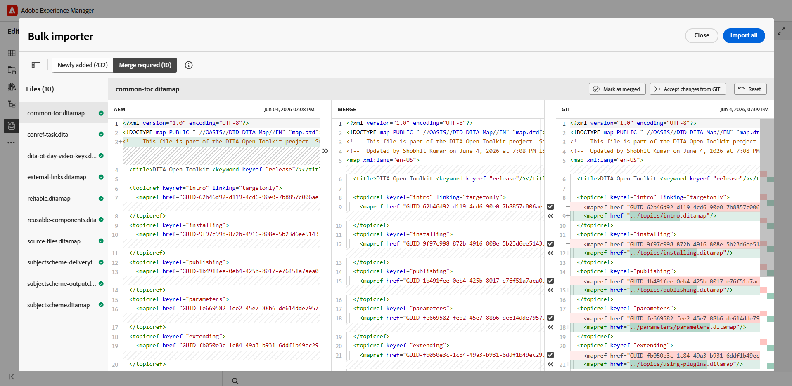
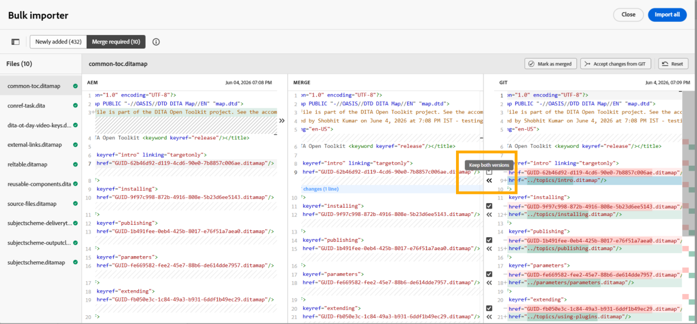

# Git コネクタを使用したコンテンツのインポート（Beta）

>[!IMPORTANT]
>
> Git コネクタは現在、Beta機能として使用でき、デフォルトでは無効になっています。 この機能を有効にするには、カスタマーサクセス チームにお問い合わせください。

Git Connectorを使用すると、接続されたGit リポジトリからExperience Manager Guidesにコンテンツを読み込むことができます。 コンテンツをインポートしたら、Experience Manager Guidesのオーサリング、レビュー、翻訳、公開機能を使用して、ドキュメントを作成および配信できます。

ソースリポジトリでコンテンツが変更された場合は、更新を取得し、競合をレビューし、最新の変更をExperience Manager Guidesと同期できます。

## 前提条件

この機能を使用する前に、次のことを確認してください。

- お使いの環境でGit コネクタ機能を有効にする必要があります。
- （*有効な場合*）管理者が環境でGit コネクタを設定しました。 詳しくは、[ ユーザーインターフェイス ](../install-conf-guide/conf-git-connector.md)からGit コネクタを作成および設定するを参照してください。
- 読み込むコンテンツを含むGit リポジトリへの&#x200B;*読み取り* アクセス権があります。
- 読み込むリポジトリブランチとソースフォルダーがわかっています。
- 読み込んだコンテンツが保存されるExperience Manager Guidesのターゲットフォルダーを知っています。

## 接続されているGit リポジトリからコンテンツを読み込む

管理者がGit コネクタを設定したら、エディターから使用して、Git リポジトリからコンテンツの読み込みを開始できます。  Git リポジトリからコンテンツを読み込むには、次の手順を実行します。

1. エディターで、左側のパネルを開きます。
1. **データソース**&#x200B;を選択します。

   接続されているデータソースが表示されます。

1. **Git コネクタ** タイルを選択します。

1. 「+」アイコンを選択し、「**一括インポーター**」を選択します。

   **バルクインポーター** ダイアログが表示されます。

   

1. **一括インポーター** ダイアログで、インポートの名前を指定し、設定したGit リポジトリからサブフォルダーを選択して、**保存と取得**&#x200B;を選択します。  インポート可能なファイルのリストがダイアログに表示されます。 続行する前に、リストを確認し、コンテンツを検証します。

   

1. ファイルを確認したら、「**すべてを読み込み**」を選択して、コンテンツをExperience Manager Guidesに読み込みます。

   >[!NOTE]
   >
   > **自動同期**&#x200B;を有効にして、Git リポジトリからExperience Manager Guidesにコンテンツを自動的に同期して読み込むことができます。 エラーが検出された場合、自動同期はトリガーされず、作成者は&#x200B;**すべてを読み込み**&#x200B;を選択して、コンテンツを手動で読み込む必要があります。 有効にすると、インポーターで自動同期を無効にすることはできません。

コンテンツをインポートすると、Git コネクタの設定時に、設定された&#x200B;**Target AEM ルート パス**&#x200B;の下に保存されます。

## Git インポートされたコンテンツの管理

コンテンツをExperience Manager Guidesに読み込んだら、使用可能なアクションを使用してコンテンツを管理し、ソースリポジトリの変更と同期させることができます。

{width="600"}

- **プレビュー**：読み込まれたコンテンツをプレビューします。 ソースリポジトリに更新が含まれている場合は、相違点を確認し、**Refetch** オプションを使用して最新の変更を読み込みます。
- **削除**：不要になったインポートされたコンテンツを削除します。
- **名前を変更**：読み込んだコンテンツの名前を変更して、識別を容易にします。
- **ログを表示**: インポート ログを表示して、インポート操作の詳細を確認します。
- **レポートを表示**: **一括読み込みレポート**&#x200B;を表示およびダウンロードします。これには、次のような詳細が含まれます。

   - インポートされたファイルの合計数
   - 成功したインポートの数
   - 失敗したインポートの数

  {width="600"}

  詳細なレポートをダウンロードできます。 一部のファイルの読み込みに失敗した場合は、**再試行で読み込みに失敗しました**&#x200B;を使用して、もう一度読み込みを試してください。

## コンテンツの競合のレビューと解決

Git リポジトリからコンテンツを再フェッチすると、リポジトリバージョンとExperience Manager Guidesで使用可能な対応するコンテンツの内容の違いが競合として表示されます。 データをExperience Manager Guidesに読み込む前に、このような競合を解決して結合する必要があります。

競合を解決して結合するには、次の手順を実行します。

1. 一括インポーターダイアログを開き、**Refetch**&#x200B;を選択します。
1. 競合が検出されると、**結合が必要な** タブが表示され、競合を含むファイルが一覧表示されます。 「**結合が必要**」タブを選択し、リストからファイルを選択して競合を確認および解決します。
1. 次のセクションの内容を確認します。

   {width="600"}

   - **AEM** セクションには、Experience Manager Guidesに存在する現在のバージョンのコンテンツが表示されます。
   - **Git** セクションには、リポジトリのコンテンツの最新バージョンが表示されます。
   - **結合** セクションに、結合されたコンテンツが表示されます。

1. エディターでハイライト表示された相違点を確認し、結合コントロールを使用して競合を解決します。

   - Git リポジトリの最新の変更を使用する場合は、**Git** セクションの競合のチェックボックスが選択されていることを確認し、対応する`<<<` コントロールを選択します。 選択したGit コンテンツは、**結合** セクション内の競合するコンテンツに置き換わります。

     {width="600"}

   - 両方のバージョンのコンテンツを保持する場合は、競合のチェックボックスをオフにし、`<<<` コントロールを使用して、既存のコンテンツを置き換えることなく、必要なコンテンツを&#x200B;**結合** セクションに追加します。

     {width="600"}

   - 同様に、「AEM」セクションの`>>>` コントロールを使用して、現在Experience Manager Guidesで使用可能なバージョンを維持できます。

     {width="600"}

1. 結合されたコンテンツを確認したら、次のいずれかの操作を実行します。

   - リポジトリのバージョンが競合するコンテンツを置き換える必要がある場合は、**Git**&#x200B;からの変更を受け入れる」を使用します。
   - 結合バージョンを確認および更新した後、**結合としてマーク**&#x200B;して、保持するコンテンツが含まれていることを確認します。
   - **リセット**&#x200B;を使用して、結合されたすべての更新を破棄し、コンテンツを元の状態に復元します。

競合を含むすべてのファイルが結合としてマークされた後、**すべてを読み込み** ボタンが有効になります。 **すべてを読み込み**&#x200B;を選択して、競合を解決するプロセスを完了します。

リポジトリーに、既存のコンテンツと競合しない新しいトピック、段落、行など、まったく新しいコンテンツが含まれている場合は、**クリーンアップデート**&#x200B;の下に表示されます。 これらの更新は競合の解決を必要とせず、直接インポートできます。

{width="600"}

