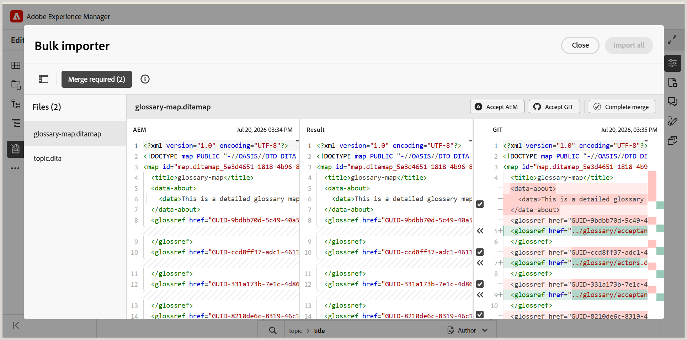

# Git コネクタを使用したコンテンツのインポート

>[!NOTE]
>
> この機能はデフォルトでは無効になっています。 自社の環境で有効にするには、カスタマーサクセス部門にお問い合わせください。

Git Connectorを使用すると、接続されたGit リポジトリから[&#x200B; コンテンツをExperience Manager Guides](#import-content-from-the-connected-git-repository)に読み込むことができます。 コンテンツをインポートしたら、Experience Manager Guidesのオーサリング、レビュー、翻訳、公開機能を使用して、ドキュメントを作成および配信できます。

ソースリポジトリでコンテンツが変更された場合は、更新を取得し、競合をレビューし、最新の変更をExperience Manager Guidesと同期できます。

## 主な機能

Git Connectorを利用すれば、手作業でファイルを転送することなく、Git リポジトリからExperience Manager Guidesにコンテンツを直接取り込むことができます。 設定が完了すると、作成者は次の機能にアクセスできます。

**コンテンツ取り込み**

- 任意のGit リポジトリ（パブリックまたはプライベート）のファイルをExperience Manager Guidesに同期します。
- リポジトリ全体ではなく1つのサブディレクトリを取り込むために、ソースフォルダーパスでフィルタリングします。
- `gitignore-aware` ルール エンジンを使用して、`.gitignore` パターンまたはカスタム ルールによって除外されたファイルを自動的にスキップします。
- 更新後も既存のDITA相互参照を維持できるように、再同期時にGUIDを保持します。

**増分（差分）同期**

- 最後に同期されたコミットを追跡し、リポジトリ全体を再インポートする代わりに、後続の同期時に追加、変更、または削除されたファイルのみを取得します。
- 読み込む前に、変更されたすべてのファイルとその変更タイプを一覧表示する差分レポートを作成します。
- リポジトリのサイズに関係なく、一貫した取得時間を維持。 ベンチマークデータについては、[&#x200B; パフォーマンスベンチマーク &#x200B;](#performance-benchmarks)を参照してください。

## Git コネクタの仕組み

次の図は、Git ConnectorがソースリポジトリからExperience Manager Guidesにコンテンツをどのように移動するかを示しています。

Git Connectorは、Git リポジトリからExperience Manager Guidesにコンテンツを4つの段階で移動します。

1. **クロールして同期**:web クローラーは、設定されたGit リポジトリとプロファイルに接続し、コンテンツをオンデマンドでコネクタに同期します。
1. **競合の取り込みと検出**：着信ファイルがスキャンされ、既にExperience Manager Guidesにあるものに対してハッシュ化されます。 競合する変更がないファイルは自動的に移動します。競合する変更があるファイルは、手動で解決する場合にフラグが付けられます。
1. **永続化**：解決されたコンテンツは、他のExperience Manager Guides コンテンツと共にAEMに処理および保存されます。
1. **Experience Manager Guides ワークフロー**：永続化が完了すると、他のExperience Manager Guides コンテンツと同様に、コンテンツをオーサリング、レビュー、翻訳、公開できるようになります。

## パフォーマンスのベンチマーク

次のベンチマークは、リポジトリの規模を拡大しながら、Experience Manager as a Cloud Serviceで完全（増分ではない） **バルクインポーター**&#x200B;の同期時間を示しています。

| スケール | 時間を取得 | 時間の読み込み | 合計時間 | バッチ | スループット |
|---|---|---|---|---|---|
| 1,000 ファイル | 1m 53s | 3m 30s | 5m 29s | 10×100 | 最大286 ファイル/分 |
| 5,000 ファイル | 1m 55s | 18m 21s | 20m 27s | 20×250 | 最大273 ファイル/分 |
| 10,000 ファイル | 1m 39s | 36百万22秒 | 37百万24秒 | 40×250 | 最大267 ファイル/分 |
| 5万ファイル | 1m 25s | 2時間43分 | 2時間58分 | 200×250 | 最大270 ファイル/分 |

## Git コネクタを使用したコンテンツのインポート

管理者がExperience Manager GuidesでGit コネクタを設定したら、EditorからGit リポジトリからコンテンツを読み込むために使用できます。

## 前提条件

この機能を使用する前に、次のことを確認してください。

- お使いの環境でGit コネクタ機能を有効にする必要があります。
- （*有効な場合*）管理者が環境でGit コネクタを設定しました。 詳しくは、[&#x200B; ユーザーインターフェイス &#x200B;](../install-conf-guide/conf-git-connector.md)からGit コネクタを作成および設定するを参照してください。
- 読み込むコンテンツを含むGit リポジトリへの&#x200B;*読み取り* アクセス権があります。
- 読み込むリポジトリブランチとソースフォルダーがわかっています。
- 読み込んだコンテンツが保存されるExperience Manager Guidesのターゲットフォルダーを知っています。

## 接続されているGit リポジトリからコンテンツを読み込む

Git リポジトリからコンテンツを読み込むには、次の手順を実行します。

1. エディターで、左側のパネルを開きます。
1. **データソース**&#x200B;を選択します。

   接続されているデータソースが表示されます。

1. **Git コネクタ** タイルを選択します。

1. 「+」アイコンを選択し、「**一括インポーター**」を選択します。

   **バルクインポーター** ダイアログが表示されます。

   

1. **一括インポーター** ダイアログで、インポートの名前を指定し、設定したGit リポジトリからサブフォルダーを選択して、**保存と取得**&#x200B;を選択します。  インポート可能なファイルのリストがダイアログに表示されます。 続行する前に、リストを確認し、コンテンツを検証します。

   

1. ファイルを確認したら、「**すべてを読み込み**」を選択して、コンテンツをExperience Manager Guidesに読み込みます。

   >[!NOTE]
   >
   > **自動同期**&#x200B;を有効にして、Git リポジトリからExperience Manager Guidesにコンテンツを自動的に同期して読み込むことができます。 エラーが検出された場合、自動同期はトリガーされず、作成者は&#x200B;**すべてを読み込み**&#x200B;を選択して、コンテンツを手動で読み込む必要があります。 有効にすると、インポーターで自動同期を無効にすることはできません。

コンテンツをインポートすると、Git コネクタの設定時に、設定された&#x200B;**Target AEM ルート パス**&#x200B;の下に保存されます。

## Git インポートされたコンテンツの管理

コンテンツをExperience Manager Guidesに読み込んだら、使用可能なアクションを使用してコンテンツを管理し、ソースリポジトリの変更と同期させることができます。

{width="600"}

- **プレビュー**：読み込まれたコンテンツをプレビューします。 ソースリポジトリに更新が含まれている場合は、相違点を確認し、**Refetch** オプションを使用して最新の変更を読み込みます。 差分を結合する必要がある場合は、[Git コネクタの競合を解決](#review-and-resolve-content-conflicts)を表示します。
- **削除**：不要になったインポーターを削除します。
- **名前を変更**：識別しやすいようにインポーターの名前を変更します。
- **ログを表示**: インポート ログを表示して、インポート操作の詳細を確認します。
- **レポートを表示**: **一括読み込みレポート**&#x200B;を表示およびダウンロードします。これには、次のような詳細が含まれます。

  - インポートされたファイルの合計数
  - 成功したインポートの数
  - 失敗したインポートの数

  {width="600"}

  詳細なレポートをダウンロードできます。 一部のファイルの読み込みに失敗した場合は、**再試行で読み込みに失敗しました**&#x200B;を使用して、もう一度読み込みを試してください。

## コンテンツの競合のレビューと解決

Git リポジトリからコンテンツを再フェッチすると、リポジトリバージョンとExperience Manager Guidesで使用可能な対応するコンテンツの内容の違いが競合として表示されます。 データをExperience Manager Guidesに読み込む前に、このような競合を解決して結合する必要があります。

競合を解決して結合するには、次の手順を実行します。

1. 一括インポーターダイアログを開き、**Refetch**&#x200B;を選択します。
1. 競合が検出されると、**結合が必要な** タブが表示され、競合を含むファイルが一覧表示されます。 「**結合が必要**」タブを選択し、リストからファイルを選択して競合を確認および解決します。
1. 競合があるファイルの場合、3方向の結合ビューが表示されます。

   

   左側のペイン （**AEM**）にはAEM リポジトリからの現在のコンテンツが表示され、右側のペイン （**GIT**）にはリモート Git リポジトリからの着信コンテンツが表示されます。 中央のペイン （**結果**）には、最初にAEM リポジトリの内容が入力され、結合エディターとして機能し、競合が解決されます。 最終的に結合された結果が生成され、この中央のペインに表示されます。

1. エディターでハイライト表示された相違点を確認し、結合コントロールを使用して競合を解決します。

   - Git リポジトリの最新の変更を使用する場合は、**GIT** セクションの競合のチェックボックスが選択されていることを確認し、対応する`<<<` コントロールを選択します。 選択したGit コンテンツは、**結果** セクション内の競合するコンテンツに置き換わります。

     

   - 両方のバージョンのコンテンツを保持する場合は、競合のチェックボックスをオフにし、`<<<` コントロールを使用して、既存のコンテンツを置き換えることなく、必要なコンテンツを&#x200B;**結果** セクションに追加します。

     

   - 同様に、「AEM」セクションの`>>>` コントロールを使用して、現在Experience Manager Guidesで使用可能なバージョンを維持できます。

1. 結合されたコンテンツを確認したら、次のいずれかの操作を実行します。

   - **Accept AEM**&#x200B;を使用して、**結果** セクションの内容を&#x200B;**AEM** セクションのバージョンに完全に置き換え、ローカルの変更を保持します。
   - **Accept GIT**&#x200B;を使用して、**結果** セクションのコンテンツを&#x200B;**GIT** セクションのバージョンに完全に置き換え、リポジトリの変更を維持します。

上記で使用したオプションに関係なく、**完全な結合**&#x200B;が必要です。 選択すると、現在のコンテンツの&#x200B;**Result**&#x200B;がファイルの解決済みバージョンとしてロックされ、ファイルが結合としてマークされます。

競合を含むすべてのファイルが結合としてマークされた後、**すべてを読み込み** ボタンが有効になります。 **すべてを読み込み**&#x200B;を選択して、競合を解決するプロセスを完了します。

Git リポジトリでファイルが変更されたが、Experience Manager Guidesで変更されていない場合は、結合は必要ありません。 このようなファイルは、**クリーン更新**&#x200B;に自動的に含まれ、直接インポートできます。

{width="600"}