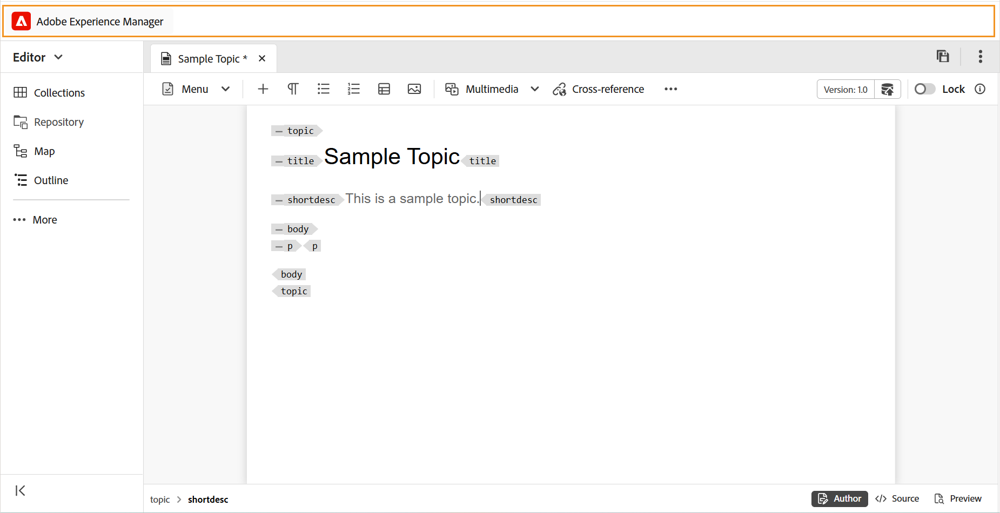

# エディターのヘッダーバー

ヘッダーバーは、Adobe Experience Manager ロゴ（統合シェルをExperience Manager Guides UI として使用している場合は、統合シェル）を表示するエディターの上部バーです。 ロゴを選択すると、Experience Managerのナビゲーションページに移動します。

{align="left"}

ツールバーの **展開** アイコンを使用して、ヘッダーバーを非表示にし、コンテンツ領域を最大化します。 標準ビューを復元するには、[**展開ビューを終了**] を選択します。

{width="350" align="left"}

**親トピック：**&#x200B;[&#x200B; エディターの概要 &#x200B;](web-editor.md)
