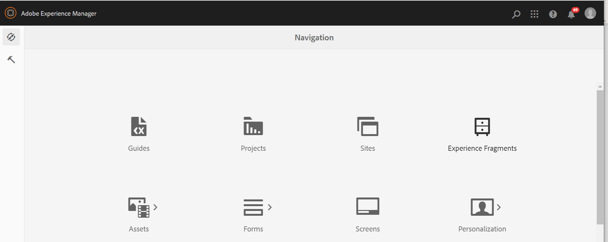
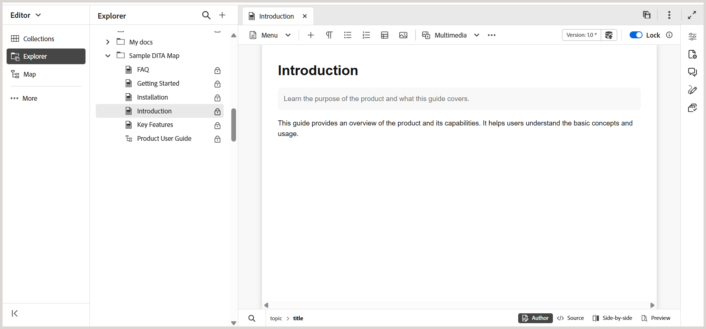
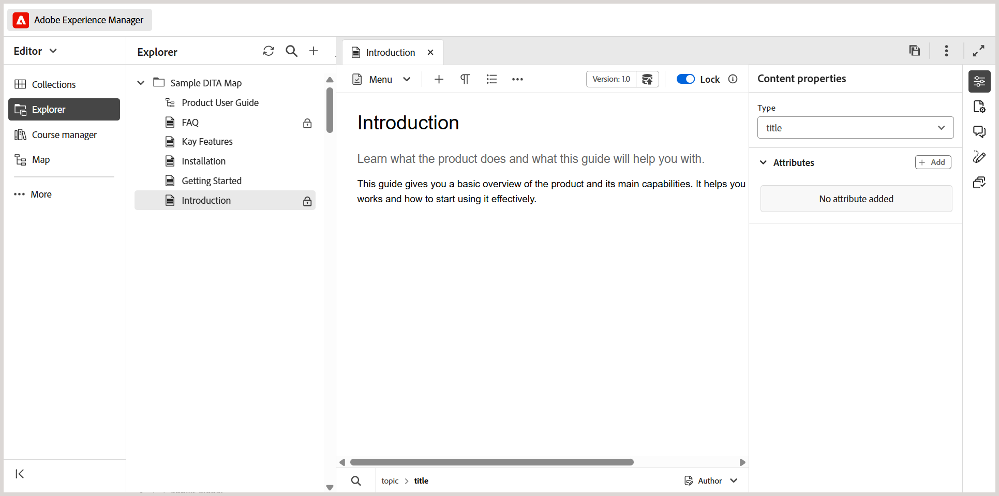

# エディターを起動 {#id2056B0140HS}

>[!INFO]
>
> このトピックは、新規エディターと古いエディターの両方に適用されます。 コア機能は一貫していますが、ユーザーインターフェイス、用語、インタラクションの違いは、該当する場合はタブとコールアウトを使用してコンテンツ内に示されます。

エディターは、次の場所から起動できます。

- [Adobe Experience Manager ナビゲーションページ](#adobe-experience-manager-navigation-page)
- [ADOBE EXPERIENCE MANAGER ASSETS UI](#adobe-experience-manager-assets-ui)
- [マップコンソール](#map-console)

以下の節では、さまざまな場所からエディターにアクセスして起動する方法の詳細について説明します。

## Adobe Experience Manager ナビゲーションページ

Experience Managerにログインすると、ナビゲーションページが表示されます。

**ガイド** リンクを選択すると、[Adobe Experience Manager Guides ホームページ ](./intro-home-page.md)に移動します。

エディターを起動するには、ナビゲーションバーに移動し、ドロップダウンから「**エディター**」を選択します。 ホームページはデフォルトで選択されています。

{width="350"}

ファイルを選択せずにエディターを起動すると、空のエディター画面が表示されます。 Experience Manager **リポジトリ**&#x200B;または&#x200B;**コレクション**&#x200B;から編集用のファイルを開くことができます。

または、[Adobe Experience Manager Guides ホームページ エクスペリエンス ](./intro-home-page.md)の&#x200B;**最近のファイル** ウィジェットと&#x200B;**コレクション** ウィジェットに存在する既存のファイルを開いて、エディターを起動することもできます。

Experience Manager ナビゲーションページに戻るには、上部ヘッダーの左上隅にあるAdobe Experience Manager ロゴを選択します。

## ADOBE EXPERIENCE MANAGER ASSETS UI

エディターを起動できる別の場所は、Experience Manager Assets UIです。 1つ以上のトピックを選択し、エディターで直接開くことができます。

エディターでトピックを開くには、次の手順に従います。

1. Assets UIで、編集するトピックに移動します。

   >[!NOTE]
   >
   > トピックのUUIDを表示することもできます。

   

   >[!IMPORTANT]
   >
   > 編集するトピックを含むフォルダーに対する読み取り権限と書き込み権限があることを確認します。

1. トピックの排他的ロックを取得するには、トピックを選択し、**チェックアウト**&#x200B;を選択します。

   >[!IMPORTANT]
   >
   > 管理者が「**ファイルをロックせずに編集を無効にする**」オプションを設定している場合は、編集する前にファイルをチェックアウトする必要があります。 ファイルをチェックアウトしない場合は、編集オプションを表示できません。

1. アセット選択モードを閉じて、編集するトピックを選択します。

   トピックのプレビューが表示されます。

   リスト表示、カード表示、プレビューモードからエディターを開くことができます。

   >[!IMPORTANT]
   >
   > 複数のトピックを開いて編集する場合は、アセット UIから目的のトピックを選択し、**編集**&#x200B;を選択します。 ブラウザーでポップアップブロッカーが有効になっていないことを確認します。有効になっていない場合は、選択したリストの最初のトピックのみが編集用に開かれます。

   

   トピックをプレビューせず、エディターで直接開く場合は、カード表示のクイックアクションメニューで&#x200B;**編集** アイコンを選択します。

   

トピックがエディターで開きます。

>[!BEGINTABS]

>[!TAB 新しいエディター]

このビューでは、コンテンツが新規エディターでどのようにレンダリングされるかを表示します

>[!TAB 古いエディター]

このビューでは、古いエディターでのコンテンツのレンダリング方法が表示されます

>[!ENDTABS]

Assets UIでマップファイルを開き、エディターを起動してマップファイルのトピックを編集することもできます。

エディターでマップを開くには、次の手順に従います。

1. Assets UIで、編集するトピックを含むマップファイルに移動して選択します。
1. DITA マップコンソールで、「**トピック**」タブに移動します。 マップファイル内のトピックのリストが表示されます。
1. 編集するトピックファイルを選択します。
1. 「**トピックを編集**」を選択します。

   

1. トピックがエディターで開きます。

   >[!IMPORTANT]
   >
   > 管理者が「**ファイルをロックせずに編集を無効にする**」オプションを設定している場合は、編集する前にファイルをチェックアウトする必要があります。 ファイルをチェックアウトしない場合、ドキュメントはエディターで読み取り専用モードで開きます。

## マップコンソール

マップコンソールからエディターを開くには、次の手順に従います。

1. ホームページを開き、マップコンソールを起動します。

   {width="350"}

   マップファイルを選択せずにマップコンソールを起動すると、空白のマップコンソール画面が表示されます。 Experience Manager **リポジトリ**&#x200B;または&#x200B;**コレクション**&#x200B;からマップファイルを開くこともできます。

   {width="500"}

1. **マップを選択**&#x200B;して、エディターで編集するトピックを含むマップファイルを開きます。
1. マップファイルが配置されているパスを選択します。 選択したマップファイルがマップコンソールに追加されます。
1. マップファイルに移動し、ドロップダウンから「**エディターで開く**」を選択します。

   

トピックを含むマップファイルは、エディターで編集用に開かれています。

>[!BEGINTABS]

>[!TAB 新しいエディター]

新しいエディターでのマップ編集モード：

>[!TAB 古いエディター]

旧エディターのマップ編集モード：

>[!ENDTABS]

**親トピック**: [編集者の概要](web-editor.md)
