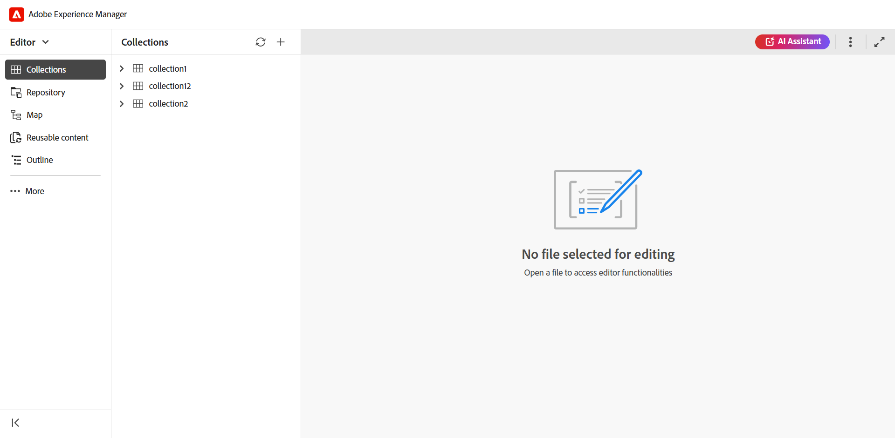
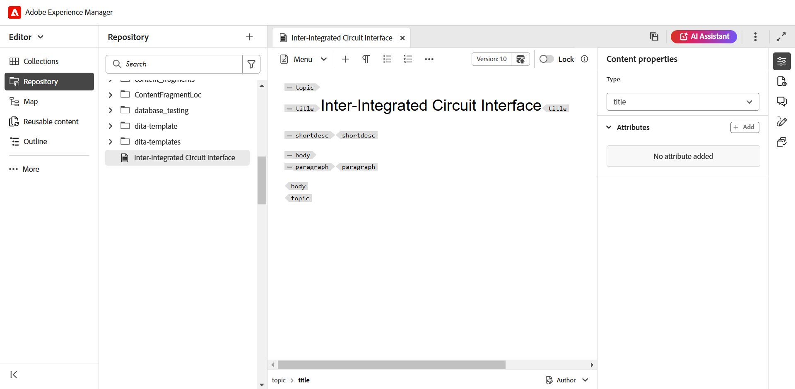
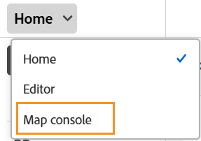

# エディターの起動 {#id2056B0140HS}

エディターは次の場所から起動できます。

- [Adobe Experience Managerのナビゲーションページ](#adobe-experience-manager-navigation-page)
- [ADOBE EXPERIENCE MANAGER ASSETS UI](#adobe-experience-manager-assets-ui)
- [マップコンソール](#map-console)

以下の節では、様々な場所からエディターにアクセスして起動する方法の詳細について説明します。

## Adobe Experience Managerのナビゲーションページ

Experience Managerにログインすると、ナビゲーション ページが表示されます。

{align="left"}

**ガイド** リンクを選択すると、[Adobe Experience Manager Guides ホームページ ](./intro-home-page.md) に移動します。

{align="left"}

エディターを起動するには、ナビゲーションバーに移動し、ドロップダウンから **エディター** を選択します。 デフォルトでは、「ホームページ」が選択されています。

{width="350" align="left"}

ファイルを選択せずにエディタを起動すると、空のエディタ画面が表示されます。 ファイルを開いて編集するには、Experience Manager **リポジトリ** または自分の **コレクション** から行います。

{align="left"}

または、[Adobe Experience Manager Guidesのホームページエクスペリエンス **の** 最近のファイル **ウィジェットおよび ](./intro-home-page.md) コレクション** ウィジェットに存在する既存のファイルを開いて、エディターを起動することもできます。

Experience Manager ナビゲーション ページに戻るには、上部のヘッダーの左上隅にあるAdobe Experience Manager ロゴを選択します。

## ADOBE EXPERIENCE MANAGER ASSETS UI

エディターを起動できるもう 1 つの場所は、Experience Manager Assets UI です。 1 つ以上のトピックを選択して、エディターで直接開くことができます。

エディターでトピックを開くには、次の手順に従います。

1. Assets UI で、編集するトピックに移動します。

   >[!NOTE]
   >
   > また、トピックの UUID を表示することもできます。

   {align="left"}

   >[!IMPORTANT]
   >
   > 編集するトピックを含むフォルダーに対する読み取りおよび書き込み権限があることを確認します。

1. トピックに対して排他的なロックを取得するには、トピックを選択して「**チェックアウト**」を選択します。

   >[!IMPORTANT]
   >
   > 管理者が「**ファイルをロックせずに編集を無効にする** オプションを設定した場合は、編集する前にファイルをチェックアウトする必要があります。 ファイルをチェックアウトしないと、編集オプションを表示できません。

1. アセット選択モードを閉じ、編集するトピックを選択します。

   トピックのプレビューが表示されます。

   リスト表示、カード表示、プレビューモードからエディターを開くことができます。

   >[!IMPORTANT]
   >
   > 複数のトピックを開いて編集する場合は、アセット UI から目的のトピックを選択し、「**編集**」を選択します。 ブラウザーでポップアップブロッカーが有効になっていないことを確認してください。有効になっていない場合は、選択したリストの最初のトピックのみが編集用に開かれます。

   {align="left"}

   トピックをプレビューせずに、エディターで直接開く場合は、カード表示からクイックアクションメニューの **編集** アイコンを選択します。

   {align="left"}

   エディターにトピックが表示されます。

   {align="left"}

また、Assets UI でマップファイルを開き、エディターを起動してマップファイルのトピックを編集することもできます。

エディターでマップを開くには、次の手順に従います。

1. Assets UI で、編集するトピックを含むマップファイルに移動して選択します。
1. DITA マップコンソールで、「**トピック**」タブに移動します。 マップ ファイル内のトピックのリストが表示されます。
1. 編集するトピック ファイルを選択します。
1. **トピックを編集** を選択します。

   {align="left"}

1. エディターにトピックが表示されます。

   >[!IMPORTANT]
   >
   > 管理者が「**ファイルをロックせずに編集を無効にする** オプションを設定した場合は、編集する前にファイルをチェックアウトする必要があります。 ファイルをチェックアウトしない場合、ドキュメントはエディターで読み取り専用モードで開きます。

## マップコンソール

マップ コンソールからエディターを開くには、次の手順に従います。

1. ホームページを開き、マップ コンソールを起動します。

   {width="350" align="left"}

   マップファイルを選択せずにマップコンソールを起動すると、空白のマップコンソール画面が表示されます。 また、Experience Manager **リポジトリ** または自分の **コレクション** からマップファイルを開くこともできます。

   {width="500" align="left"}

1. 「**マップを選択**」を選択して、編集するトピックを含むマップ・ファイルをエディタで開きます。
1. マップ ファイルがあるパスを選択します。 選択したマップ ファイルがマップ コンソールに追加されます。
1. マップファイルに移動し、ドロップダウンから **エディターで開く** を選択します。

   {align="left"}

   トピックを含むマップ ファイルがエディタで編集用に開きます。

   {align="left"}

**親トピック**: [ エディターの概要 ](web-editor.md)
