# エディターの左パネル

>[!INFO]
>
>このトピックは、新しいエディターと古いエディターの両方に適用されます。 コア機能は一貫していますが、ユーザーインターフェイス、用語、インタラクションの違いは、該当する場合はタブとコールアウトを使用してコンテンツ内に示されます。

左側のパネルでは、コレクション、リポジトリビュー、マップビューなどの機能にすばやくアクセスできます。 パネルを展開するには、インターフェイスの左下隅にある「**展開**」アイコンを選択します。 展開したら、**折りたたみ** アイコンを使用してパネルを折りたたみます。 展開ビューでは、折りたたまれたビューでツールヒントとして表示されるアイコンの名前が表示されます。

>[!NOTE]
>
>左側のパネルはサイズ変更可能です。 パネルのサイズを変更するには、パネルの境界にカーソルを置き、カーソルを双方向矢印に変え、選択してドラッグしてパネルの幅のサイズを変更します。

左側のパネルでは、次の機能にアクセスできます。

- [コレクション](#collections)
- [リポジトリ](#repository)
- [エクスプローラー](#explorer)
- [Map](#map)
- [コンテンツの再利用](#reusable-content)
- [アウトライン](#outline)

左側のパネルの一部の機能は、**詳細** セクションで利用できます。 詳細アイコン を選択して、以下の機能にアクセスします。

- [用語集](#glossary)
- [条件](#conditions)
- [件名](#subject-scheme)
- [スニペット](#snippets)
- [テンプレート](#templates)
- [引用](#citations)
- [言語変数](#language-variables)
- [変数](#variables)
- [検索と置換](#find-and-replace)
- [PDF テンプレート](#pdf-templates)
- [レビュー](#review)


Adobe Workfrontが設定されている場合、**Workfront**&#x200B;とラベル付けされた追加オプションも左側のパネルに表示されます。

詳しくは、[Workfrontとの連携](./workfront-integration.md)を参照してください。

>[!NOTE]
>
> 左側のパネルで使用できる機能は管理者が管理し、左側のパネルにある個々の機能を有効または無効にすることができます。 左側のパネルには、有効な機能のみが表示されます。 詳細については、[ タブバー](./web-editor-tab-bar.md)の&#x200B;**パネル** セクションを参照してください。

左パネルの機能の詳細な説明は次のとおりです。

## コレクション

一連のファイルやフォルダーを使用している場合は、お気に入りのリストに追加して、すばやくアクセスできます。 **コレクション**&#x200B;には、追加したドキュメントのリストと、他のユーザーから公開されているドキュメントのリストが表示されます。

デフォルトでは、タイトルでファイルを表示できます。 ファイルにカーソルを合わせると、ファイルタイトルとファイルパスがツールチップとして表示されます。

>[!NOTE]
>
> 管理者は、エディターでファイル名でファイルのリストを表示することもできます。 **ユーザー設定**&#x200B;の「**エディターファイル表示設定**」セクションの「**ファイル名**」オプションを選択します。

<details>
    <summary> 新しいコレクションの作成 </summary>


新しいコレクションを作成するには、コレクションパネルの横にある「+」アイコンを選択して、**新しいコレクション** ダイアログボックスを表示します。

{width="300"}

作成するコレクションのタイトルと説明を入力します。 「**パブリック**」を選択すると、このユーザーは他のユーザーにも表示されます。

>[!NOTE]
>
> Experience Manager Guidesのホームページからコレクションを作成することもできます。 ホームページを開き、[概要セクション ](./intro-home-page.md#overview)の&#x200B;**コレクション** ウィジェットに移動し、**新しいコレクション**&#x200B;を選択します。

</details>

<details>
    <summary> コレクションへのファイルの追加 </summary>


コレクションにファイルを追加するには、次のいずれかの方法を使用します。

- リポジトリビューで必要なファイルまたはフォルダーに移動し、*オプション* アイコンを選択してコンテキストメニューを開き、**に追加** > **コレクション**&#x200B;を選択します。 **コレクションに追加** ダイアログボックスで、ファイル/フォルダーを既存のお気に入りに追加するか、新しいお気に入りを作成するかを選択できます。

  {width="300"}

- エディターでファイルのタブを右クリックして、コンテキストメニューを開きます。 **お気に入りリストにファイルを追加するには、**&#x200B;に追加/**コレクション**&#x200B;を選択します。

  


>[!NOTE]
>
> - お気に入りリストから項目を削除するには、お気に入りコレクションの項目の横にあるオプションアイコンを選択し、**コレクションから削除**&#x200B;を選択します。
> - ファイルを開かずにプレビューするには、ファイルを選択し、オプションメニューから「**プレビュー**」を選択します。

</details>

コレクションの&#x200B;**オプションメニュー**

コレクションで使用できるオプションメニューを使用して、多くのアクションを実行することもできます。

{width="650"}

- **名前を変更**：選択したコレクションの名前を変更します。
- **削除**：選択したコレクションを削除します。
- **更新**: リポジトリからファイルとフォルダーの新しいリストを取得します。
- **Assets UI**&#x200B;で表示：Assets UIでファイルまたはフォルダーの内容を表示します。

>[!NOTE]
>
> 上部の&#x200B;**更新** アイコンを使用して、リストを更新できます。 リストを更新すると、コレクションが再読み込みされ、その結果、パネル内の展開されたコレクションが折りたたまれます。


## リポジトリ

>[!NOTE]
>
> Cloud Serviceの2025.11.0 リリースおよびオンプレミスの5.2.0 リリース以降、**Repository**&#x200B;は&#x200B;**Explorer**&#x200B;に置き換えられます。 バージョン 5.2より前のオンプレミスの場合は、エディターインターフェイスを通じて引き続きリポジトリを表示して使用します。

リポジトリアイコンを選択すると、DAMで使用可能なファイルとフォルダーのリストが表示されます。 デフォルトでは、タイトルでファイルを表示できます。 ファイルにカーソルを合わせると、ファイルのタイトルとファイル名がツールチップとして表示されます。

>[!NOTE]
>
> 管理者は、エディターでファイル名でファイルのリストを表示することもできます。 **ユーザー設定**&#x200B;の「**エディターファイル表示設定**」セクションで「**ファイル名**」オプションを選択します。

一度に75個のファイルが読み込まれます。 「**さらに読み込む**...」を選択するたびに75個のファイルが読み込まれ、すべてのファイルが一覧表示されたときにボタンが表示されなくなります。 このバッチ読み込みは効率的で、フォルダー内に存在するすべてのファイルを読み込むよりも、ファイルに迅速にアクセスできます。

DAM内で必要なファイルに簡単に移動し、エディターで開くことができます。 ファイルを編集するために必要なアクセス権がある場合は、編集できます。

エディターでオーディオまたはビデオファイルを選択して再生することもできます。 ボリュームを変更したり
ビデオのビュー。 ショートカットメニューには、ダウンロード、再生の変更のオプションもあります
表示速度を向上したり、ピクチャインピクチャを表示したりできます。

マップを選択し、Enter キーを押すかダブルクリックして、**マップビュー**&#x200B;で開きます。 詳しくは、左側のパネルの&#x200B;**マップビュー**&#x200B;機能の説明を参照してください。 トピックを選択し、Enter キーを押すかダブルクリックして、[ コンテンツ編集エリア ](./web-editor-content-editing-area.md)で開きます。 エディターから直接ファイルをナビゲートして開くことができるため、時間を節約し、生産性を向上できます。


## リポジトリ内のフィルター検索

エディターには、テキストを検索するための拡張フィルターが用意されています。 Adobe Experience Manager リポジトリの選択したパスに存在するファイル内のテキストを検索してフィルタリングできます。 ファイル内のタイトル、ファイル名、コンテンツを検索します。


{width="300"}

*フィルターを適用して、テキスト`personal spaceship.`*&#x200B;を含むファイルを検索します

**フィルター検索** \（\）アイコンを選択して、フィルターポップアップを開きます。

>[!NOTE]
>
> テキストを検索したり、ファイルをフィルタリングしたりすると、**フィルター検索** \（\）アイコンに青いドットが表示され、検索パネルに表示され、一部のフィルターが適用されていることを示します。


ファイルをフィルタリングし、Adobe Experience Manager リポジトリで検索を絞り込むには、次のオプションがあります。

- **DITA ファイル**：選択したパスに存在するすべての&#x200B;**DITA トピック**&#x200B;および&#x200B;**DITA マップ**&#x200B;を検索できます。 これらはデフォルトで選択されています。
- **DITA以外のファイル**：選択したパスで&#x200B;**Ditaval Files**、**画像ファイル**、**マルチメディア**、**ドキュメント**&#x200B;および&#x200B;**JSON**&#x200B;を検索できます。

   {width="300"}

  *クイックフィルターを使用して、DITA ファイルと非 DITA ファイルを検索します。*

>[!NOTE]
>
> **DITA トピック** フィルターを使用して、タイトル、トピックコンテンツ、プロパティなど、リポジトリ内のMarkdown ファイルに固有のコンテンツを検索することもできます。 この機能は現在、新しく作成されたMarkdown ファイルにのみ適用されます。

**高度なフィルタリング**

**詳細フィルター**  アイコンを選択して、**詳細フィルター** ダイアログボックスを表示します。

「**一般**」タブと「**詳細**」タブでは、次のオプションを表示できます。

 {width="650"}


**一般**

- **次を使用して結果を検索する**: Adobe Experience Manager リポジトリの選択したパスに存在するファイル内のテキストを検索します。 テキストは、ファイル内のタイトル、ファイル名、コンテンツで検索されます。

これは、リポジトリウィンドウの検索ボックスと同期しています。 例えば、リポジトリパネルの検索ボックスに「`general purpose`」と入力すると、**詳細フィルター** ダイアログボックスにも表示されます。その逆も同様です。

- **内の検索**: Adobe Experience Manager リポジトリ内にあるファイルを検索するパスを選択します。
- **DITA ファイル**：選択したパスに存在するすべての&#x200B;**DITA トピック**&#x200B;および&#x200B;**DITA マップ**&#x200B;を検索できます。 これらはデフォルトで選択されています。
- **DITA以外のファイル**：選択したパスで&#x200B;**Ditaval Files**、**画像ファイル**、**マルチメディア**、**ドキュメント**&#x200B;および&#x200B;**JSON**&#x200B;を検索できます。
- **ロック済み**: ユーザーのリストを表示します。 リストはページ分割され、非同期で読み込まれます。一度に限られたユーザーのセットが表示され、スクロールまたは移動するたびに多くのユーザーが取得されます。 これにより、特に多数のユーザーを使用する場合は、読み込み速度と全体的なパフォーマンスが向上します。
- **変更後** / **変更前**：変更日に基づいてコンテンツをフィルタリングします。 カレンダーから日付範囲を選択するか、次のいずれかの時間枠オプションを選択します。
   - 過去2時間で
   - 先週
   - 「先月」
   - 昨年
- **タグ**: タグに基づいてコンテンツをフィルタリングします。

**詳細**

- **DITA要素**：指定したDITA要素の属性で特定の値を検索することもできます。
   - 要素、属性、値を追加するには、**要素を追加**&#x200B;を選択します。
   - 選択したフィルターを適用します。

- 適用されたすべてのフィルターをクリアするには、**すべてをクリア**&#x200B;を選択します。


- **フィルターを閉じる**  アイコンを選択して、フィルターを閉じ、リポジトリのツリービューに戻ります。

  >[!NOTE]
  >
  >システム管理者は、テキストフィルターを設定したり、他のフィルターを表示または非表示にしたりすることもできます。 詳しくは、「Adobe Experience Manager Guides as a Cloud Serviceのインストールと設定」の「*テキストフィルターの設定*」セクションを参照してください。
  >
  >検索したテキストを含むフィルター処理されたファイルのリストが表示されます。 例えば、テキスト `personal spaceship`を含むファイルは、前のスクリーンショットに一覧表示されます。 フィルター処理されたリストから複数のファイルを選択して、編集用に開いたマップにドラッグ&amp;ドロップできます。

### オプションメニュー

左側のパネルからファイルを開くだけでなく、リポジトリビューで使用可能なオプションメニューを使用して、多くのアクションを実行することもできます。 フォルダー、トピックファイル、メディアファイルのどちらを選択したかによって、異なるオプションが表示されます。

**フォルダーのオプション**

リポジトリビューの&#x200B;*フォルダー*&#x200B;で使用できるオプションメニューを使用して、次のアクションを実行できます。

{width="550"}


- **新規**：新しいDITA トピック、DITA マップ、またはフォルダーを作成します。

<details>
    <summary> 新しいトピックを作成する手順 </summary>

新しいトピックを作成する手順：

1. **新規** > **トピック**&#x200B;を選択します。
1. **新しいトピック** ダイアログボックスが表示されます。

   {width="300"}

1. **新しいトピック** ダイアログボックスで、次の詳細を入力します。
   - トピックのタイトル。
   - \（Optional\）* トピックのファイル名。 ファイル名は、トピックタイトルに基づいて自動的に提案されます。 管理者がUUID設定に基づいて自動ファイル名を有効にしている場合、「名前」フィールドは表示されません。
   - トピックのベースとなるテンプレート。 例えば、標準の設定では、「空白」、「概念」、「DITAVAL」、「参照」、「タスク」、「トピック」、「マークダウン」、「用語集」、「トラブルシューティング」の各テンプレートから選択できます。 フォルダーにフォルダープロファイルが設定されている場合は、フォルダープロファイルで設定されているトピックテンプレートのみが表示されます。

   - トピックファイルを保存するパス。 デフォルトでは、リポジトリで現在選択されているフォルダーのパスが「パス」フィールドに表示されます。
1. 「**作成**」を選択します。 トピックは、指定したパスで作成されます。 また、トピックは編集のためにエディターで開かれます。

</details>

<details>
<summary> 新しいDITA マップを作成する手順 </summary>


新しいDITA マップの作成手順：

1. **新規** > **DITA マップ**&#x200B;を選択します。
2. **新しいマップ** ダイアログボックスが表示されます。

   {width="300"}

3. **新しいマップ** ダイアログボックスで、次の詳細を入力します。
   - マップのタイトル。
   - *\（Optional\）* マップのファイル名。 ファイル名は、マップタイトルに基づいて自動的に提案されます。 管理者がUUID設定に基づいて自動ファイル名を有効にしている場合、「名前」フィールドは表示されません。
   - マップのベースとなるテンプレート。 例えば、標準の設定では、ブックマップまたはDITA マップテンプレートから選択できます。
   - マップファイルを保存するパス。 デフォルトでは、リポジトリで現在選択されているフォルダーのパスが「パス」フィールドに表示されます。
4. 「**作成**」を選択します。 マップが作成され、「パス」フィールドで指定したフォルダー内に追加されます。 また、マップはマップビューで開きます。 マップエディターでマップファイルを開き、トピックを追加できます。 マップファイルへのトピックの追加について詳しくは、[ マップの作成](map-editor-create-map.md#)を参照してください。 または、**マップ コンソールで開く**&#x200B;を選択して、マップ コンソールでマップを開きます。
</details>

<details>
<summary> 新しいフォルダーを作成する手順 </summary>

新しいフォルダーを作成する手順：

1. **新規** / **フォルダー**&#x200B;を選択します。
2. **新規フォルダー** ダイアログボックスが表示されます。

   {width="300"}

3. **新規フォルダー** ダイアログボックスで、次の詳細を入力します。
   - フォルダーのタイトル。フォルダー名に自動的に変換されます。
   - フォルダーを保存するパス。 デフォルトでは、リポジトリで現在選択されているフォルダーのパスが「パス」フィールドに表示されます。
4. 「**作成**」を選択します。 フォルダーが作成され、「フォルダーを作成」オプションが実行されたフォルダー内に追加されます。

</details>

- **アセットのアップロード**：ローカルシステムからAdobe Experience Manager リポジトリの選択したフォルダーにファイルをアップロードします。 ローカルシステムから現在の作業トピックにファイルをドラッグ&amp;ドロップすることもできます。 これは、ローカルシステムの画像をトピックに挿入する場合に非常に便利です。

  {width="300"}

  ファイルをアップロードするフォルダーを選択すると、画像のプレビューも表示されます。 ファイル名を変更する場合は、「ファイル名」テキストボックスで変更できます。 「**アップロード**」を選択して、ファイルのアップロードプロセスを完了します。 トピックに画像ファイルをドラッグ&amp;ドロップした場合、画像ファイルが記事に追加され、アップロードされます。

  管理者が&#x200B;*XMLEditorConfig*&#x200B;でUUID オプションを有効にしている場合、**Source** プロパティにアップロードされた画像のUUIDが表示されます。

  

  アップロードが成功すると、次の確認ダイアログが表示されます。

  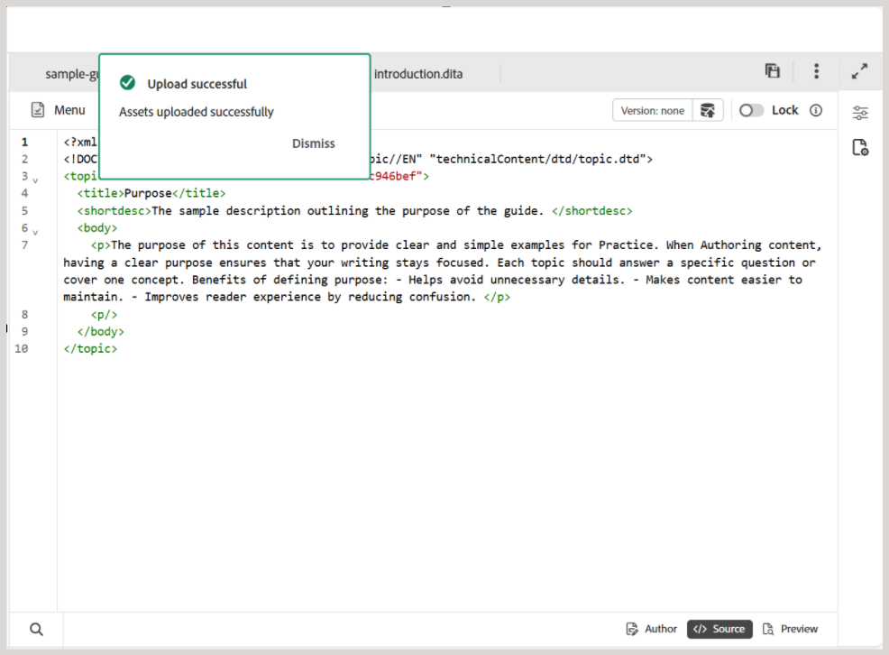

  <details>

  <summary>ファイル名の無効な文字の処理</summary>

  アップロードするアセットのファイル名に無効な文字（* / : [\] | # % { } ?）が含まれている場合、次のシナリオが発生する可能性があります。

   - **部分アップロード**: アップロード中の1つ以上のアセットに、ファイル名に無効な文字が含まれていることを示します。

     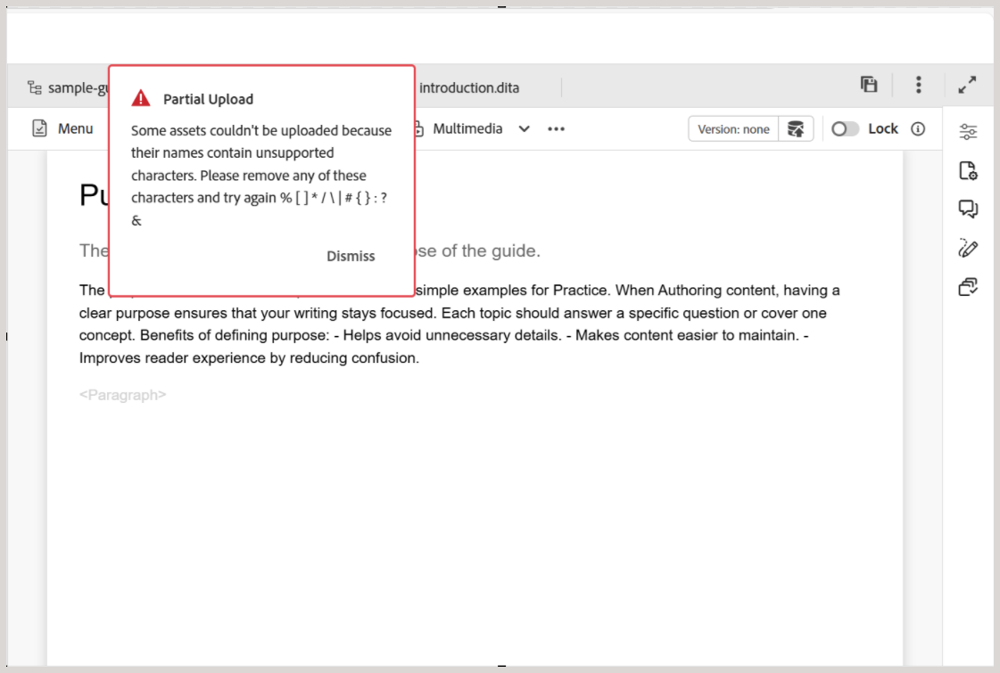

   - **アップロードに失敗しました**：アップロード中のすべてのアセットに、ファイル名に無効な文字が含まれていることを示します。

     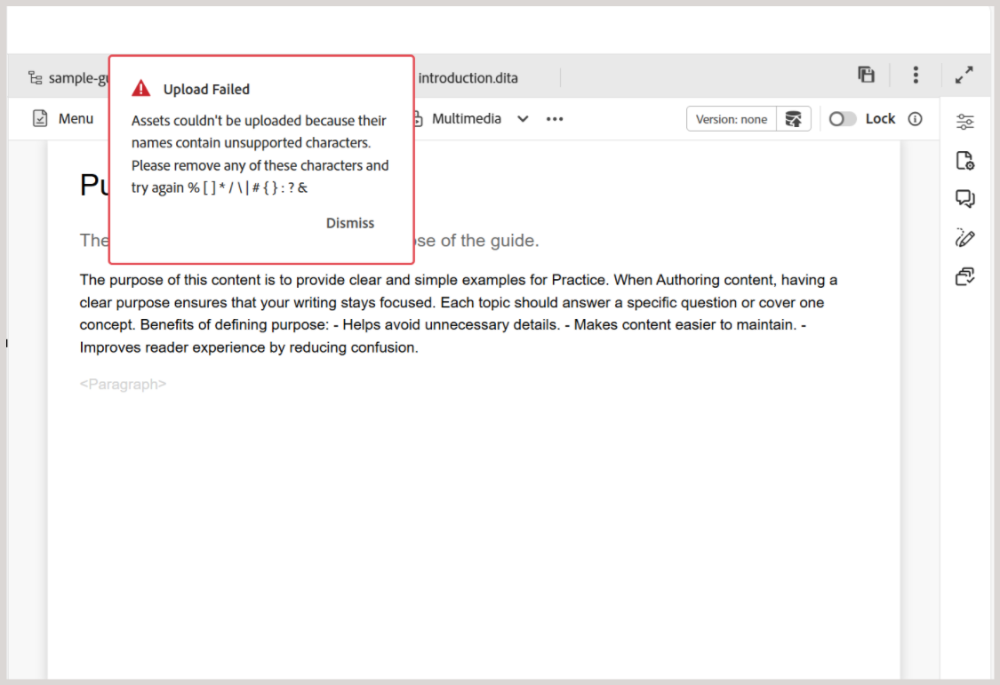

  これらの競合を解決するには、アセットのファイル名から無効な文字を削除してから、リポジトリに再アップロードします。

  </details>

- **更新**: リポジトリからファイルとフォルダーの新しいリストを取得します。
- **折りたたむ**: リポジトリ内の選択したフォルダーを折りたたみます。

  >[!NOTE]
  >
  > フォルダーの横にある&#x200B;**\>** アイコンを使用して展開します。

- **フォルダー内のファイルを検索**：検索語句を入力できるリポジトリー検索にフォーカスを移動します。 検索は、リポジトリ内の選択したフォルダーの下で実行されます。 フィルターを適用して、DITA ファイル、画像ファイル、またはその両方を返すこともできます。

  {width="300"}

  ファイルのUUIDを使用して検索することもできます。 その場合、検索結果にはDITA/XML ファイルのタイトルが表示され、ファイルが画像ファイルの場合は、ファイルのUUIDが表示されます。 次の検索例では、画像ファイルのUUIDが検索され、検索結果には、元の画像ファイルのUUIDと、その画像が参照されているファイルのトピックタイトルが表示されます。

  {width="300"}

- **コレクションに追加**：選択したフォルダーをお気に入りに追加します。 既存または新規のコレクションに追加できます。

- **アセットの再処理**: フォルダーのすべてのアセットの処理をトリガーします。
- **Assets UIで表示**: Assets UIでフォルダーの内容を表示します。

**ファイルのオプション**

メディアファイルとDITA ファイルのどちらを選択したかに応じて、オプションメニューの様々なオプションにアクセスできます。 メディアファイルとDITA ファイルの両方で使用できる一般的なオプションには、次のようなものがあります。

- 編集
- FrameMakerで開く
- 複製
- ロック/ロック解除
- プレビュー
- 移動先
- 名前を変更
- 削除
- 生成
- PDFとしてダウンロード
- 追加
- コピー
- アセットの再処理
- Assets UIでの表示
- プロパティ


リポジトリビューでのファイルの{width="550"}

オプションメニューの様々なオプションについて説明します。

- **編集**：編集するファイルを開きます。 .ditamap/.bookmap ファイルの場合は、[ マップエディター](map-editor-advanced-map-editor.md#)で開いて編集します。

- **Oxygenで編集**:Oxygen コネクタプラグインで選択したファイルを編集するには、このオプションを選択します。 ファイルが編集用に開かれます。

  >[!NOTE]
  >
  >この機能を環境で有効にするには、カスタマーサクセス チームにお問い合わせください。 これは、すぐに使えるサポートの一部として有効になっていません。 詳細については、『インストールおよび設定ガイド』の「[Oxygen](../cs-install-guide/conf-edit-in-oxygen.md)」セクションで編集するオプションを設定する」を参照してください。

- **マップダッシュボードで開く**：選択したファイルがDITA マップの場合、このオプションを選択するとマップダッシュボードが開きます。

- **マップコンソールで開く**：選択したファイルがDITA マップである場合、このオプションを選択するとマップコンソールが開きます。

- **ロック**：選択したファイルを編集するためにロックします。 ファイルがロックされている場合、ロックアイコンの上にマウスポインターを置くと、ロックした場合は&#x200B;**自分がロックしている**、別のユーザーがロックしている場合は&#x200B;**自分がロックしている[ ユーザー名]**&#x200B;と表示されます。

- **プレビュー**: ファイル （.dita、.xml、オーディオ、ビデオ、または画像）を開かずに簡単にプレビューできます。 プレビューペインのサイズを変更できます。 コンテンツに`<xref>`または`<conref>`が含まれている場合は、コンテンツを選択して新しいタブで開くことができます。 ファイルのタイトルがウィンドウに表示されます。 タイトルがない場合は、ファイル名が表示されます。 **プレビュー** パネルを閉じるには、閉じるアイコンを選択するか、パネルの外側の任意の場所を選択します。

  {  }


- **重複**：このオプションを使用して、選択したファイルの重複またはコピーを作成します。 また、アセットを複製プロンプトで複製ファイルの名前を変更するオプションもあります。 デフォルトでは、ファイルは接尾辞\（例えばfilename\_1.extension\）を付けて作成されます。 ファイルのタイトルはソースファイルと同じままであり、新しいファイルはバージョン 1.0で始まります。 ベースラインが重複ファイルにコピーされない間、すべての参照、タグ、メタデータがコピーされます。

- **移動先**：選択したファイルを別のフォルダーに移動するには、このオプションを使用します。
   - 宛先フォルダーの名前を入力するか、**パスを選択**&#x200B;して宛先フォルダーを選択します。
   - 任意のタイプのファイルをコンテンツフォルダー内の任意の宛先に移動できます。
   - 2つのファイルに同じ名前を付けることはできません。 そのため、同じ名前のファイルが既に存在するフォルダーにファイルを移動することはできません。

  同じ名前で別のタイトルのファイルが存在するフォルダーにファイルを移動しようとすると、「ファイル名を変更して移動」ダイアログが表示され、ファイルを移動する前にファイル名を変更する必要があります。 移動先フォルダー内の移動されたファイルには、新しいファイル名が付きます。

  {width="550"}

  >[!NOTE]
  >
  > ファイルを別の宛先フォルダーにドラッグ&amp;ドロップすることもできます。

  **除外シナリオ**

  Experience Manager Guidesでは、次の場合、ファイルの名前を変更したり、ファイルを移動したりすることはできません。

   - ファイルがレビューまたは翻訳ワークフローの一部である場合、ファイルの移動や名前の変更はできません。

   - 他のユーザーがファイルをロックしている場合、ファイルの名前を変更したり移動したりできない場合は、ファイルの「名前を変更」または「ファイルに移動」オプションは表示されません。

  >[!NOTE]
  >
  > 管理者がフォルダーに対する権限を与えた場合は、**名前の変更**&#x200B;または&#x200B;**移動先**&#x200B;のオプションのみが表示されます。

  <details>
    <summary> クラウドサービス </summary>

  ファイルの名前を変更したり移動したりしても、各ファイルには一意のUUIDがあるため、ファイルとの既存の参照が壊れることはありません。
  </details>

- **名前を変更**：このオプションを使用して、選択したファイルの名前を変更します。 「**アセット名を変更**」ダイアログに新しいファイルの名前を入力します。
   - 任意のタイプのファイル名を変更できます。
   - ファイルの拡張子は変更できません。
   - 2つのファイルに同じ名前を付けることはできません。 そのため、既に存在する名前にファイルの名前を変更することはできません。 エラーが表示されます。

- **削除**：このオプションを使用して、選択したファイルを削除します。 ファイルを削除する前に、確認プロンプトが表示されます。

   - ファイルを削除する前に、確認プロンプトが表示されます。
   - 他のファイルから参照されていないファイルは削除され、成功メッセージが表示されます。
   - ファイルがロックされている場合は削除できず、エラーメッセージが表示されます。

     >[!NOTE]
     >
     > 管理者がロックされたファイルの削除を禁止している場合は、エラーメッセージのみが表示されます。 詳しくは、「Adobe Experience Manager Guides as a Cloud Serviceのインストールと設定」の「*チェックアウト済みファイルの削除を防止する*」セクションを参照してください。

   - ファイルがコレクションに追加されると、**強制削除** ダイアログボックスが表示され、強制的に削除できます。
   - ファイルが他のファイルから参照されている場合、確認メッセージを含む&#x200B;**強制削除** ダイアログが表示され、ファイルを強制的に削除できます。

     {width="300"}

     >[!NOTE]
     >
     > 管理者がファイルの削除権限を付与している場合、**強制削除**&#x200B;が有効になっています。 そうでない場合、**強制的な削除**&#x200B;は無効になり、参照ファイルを削除する権限がないことを示すメッセージが表示されます。 詳しくは、「Adobe Experience Manager Guides as a Cloud Serviceのインストールと設定」の「*参照ファイルの削除を禁止する*」セクションを参照してください。

   - 参照トピックを削除し、編集用の参照を含むファイルを開いた場合、参照ファイルの壊れたリンクが表示されます。

  >[!NOTE]
  >
  > キーボードのDelete キーを使用して、選択したファイルを同様に削除することもできます。

- **生成**：このオプションを使用すると、マップ内のマップまたはトピックをサイトページ、コンテンツフラグメント、またはエクスペリエンスフラグメントに公開できます。

- **追加先**：次のオプションから選択できます：
   - **コレクション**：選択したファイルをコレクションに追加します。 既存または新規のコレクションに追加できます。

   - **再利用可能なコンテンツ**：選択したファイルを左側のパネルの「再利用可能なコンテンツ」リストに追加します。

- **コピー**：次のオプションから選択できます。

   - **UUIDをコピー**：選択したファイルのUUIDをクリップボードにコピーします。

   - **パスをコピー**：選択したファイルの完全パスをクリップボードにコピーします。

- **アセットの再処理**：選択したアセットの処理をトリガーします。

- **Assets UI**&#x200B;で表示：これを使用すると、Assets UI で.dita/.xml ファイルのプレビューを表示できます。 .ditamap/.bookmap ファイルの場合、マップ内のすべてのトピックファイルは、単一の統一されたページごとのビューに表示されます。

- **プロパティ**：これを使用して、選択したファイルのプロパティ ページを開きます。

  このページのメタデータプロパティを追加、削除、または変更すると（デフォルトまたはカスタムのいずれでも）、ドキュメントのバージョンで[作業用コピーのインジケーター](./web-editor-edit-topics.md#working-copy-indicator)がトリガーされます。

  Assets UIからプロパティページにアクセスするには、ファイルを選択し、ツールバーの「プロパティ」アイコンを選択します。

- **PDFとしてダウンロード**：このオプションを使用して、PDF出力を生成し、ダウンロードします。

## エクスプローラー

>[!NOTE]
>
> Cloud Serviceの2025.11.0 リリースおよびオンプレミスの5.2.0 リリース以降、**Repository**&#x200B;は&#x200B;**Explorer**&#x200B;に置き換えられます。 バージョン 5.2より前のオンプレミスの場合は、エディターインターフェイスを通じて引き続きリポジトリを表示して使用します。

Explorerには、以前リポジトリで利用できたほとんどの機能が用意されています。次の機能があります。

- ファイルとフォルダー間の移動
- ファイルとフォルダーのオプションメニュー

さらに、ユーザービリティと効率性を向上させるために設計された、検索とフィルタリングのエクスペリエンスが強化されています。

ファイルとフォルダーのコンテキストメニューについて詳しくは、[ オプションメニュー](#options-menu)を参照してください。

検索エクスペリエンスの詳細については、[検索パネル ](./search-panel-explorer.md)を参照してください。

## Map

マップビューアイコンを選択すると、マップファイル内のトピックのリストが表示される場所にマップビューが表示されます。 マップファイルを開いていない場合は、マップビューが空白で表示されます。 任意のマップファイルをダブルクリックすると、このビューでマップファイルが開きます。 マップ内の任意のファイルをダブルクリックして、エディターで開くことができます。

デフォルトでは、タイトルでファイルを表示できます。 ファイルにカーソルを合わせると、ファイルタイトルとファイルパスがツールチップとして表示されます。

>[!NOTE]
>
>管理者は、マップビューで現在開いている親マップのファイル名を表示することもできます。 **ユーザー設定**&#x200B;の「**エディターファイル表示設定**」セクションの「**ファイル名**」オプションを選択します。


マップビューでマップを開くと、現在のマップのタイトルがタブバーの中央に表示されます。 タイトルが長すぎる場合は、省略記号が表示され、タイトルにカーソルを合わせると、ツールヒントにタイトル全体が表示されます。

トピックまたはマップ参照のキー属性を定義すると、タイトル、対応するアイコン、および左側のパネルのキーを表示できます。 キーは`keys=<key-name>`として表示されます。

マップビュー](images/view-key-title-map-view.png){width="300"}のを参照してください。

マップビューでは、マップファイルに対して次のオプションを使用できます。

- **マップコンソールで開く**: マップコンソールでマップファイルを開きます。
- **編集**：編集するマップファイルを開きます。
- **オプション**：選択したマップファイルのコンテキストメニューを開きます。

マップファイルのオプションメニューを使用して、次のアクションを実行できます。

{  }

- **編集**: マップエディターで編集するマップファイルを開きます。

- **すべてを選択**: マップ内のすべてのファイルを選択します。

- **選択範囲をクリア**: マップ内の選択したファイルの選択を解除します。

- **ロック**：マップ内の選択したファイルに対するロックを取得します。

- **ロック解除**: マップファイルのロックを解除し、編集可能にします。 変更を以前のバージョンに戻すことはありません。

- **新しいバージョンとして保存してロックを解除**：新しいバージョンを作成し、マップ内の選択したファイルのロックを解除します。

- **プレビュー**: マップファイルのプレビューを開きます。 このビューでは、マップ内のすべてのトピックファイルが、単一の統一されたページ単位のビューで表示されます。

- **コピー**：次のオプションから選択できます。
   - **UUIDをコピー**: マップファイルのUUIDをクリップボードにコピーします。
   - **パスをコピー**: マップファイルの完全パスをクリップボードにコピーします。

- **エクスプローラーで検索**: エクスプローラー\（またはDAM\）内のマップファイルの場所を表示します。

- **追加先**：次のオプションから選択できます：
   - **コレクション**: マップファイルをコレクションに追加します。 既存または新規のコレクションに追加できます。

   - **再利用可能なコンテンツ**：左パネルの再利用可能なコンテンツリストにマップファイルを追加します。

- **プロパティ**：これを使用して、マップファイルのプロパティページを開きます。 このプロパティページには、Assets UIからファイルを選択し、ツールバーのプロパティアイコンを選択してアクセスすることもできます。

- **マップ ダッシュボードを開く**: マップ ダッシュボードを開きます。

- **Assets UI**&#x200B;で表示：これを使用すると、Assets UIでマップファイルのプレビューを表示できます。 このビューでは、マップ内のすべてのトピックファイルが、単一の統一されたページ単位のビューで表示されます。
- **マップをダウンロード**：このオプションを選択すると、**マップをダウンロード** ダイアログボックスが開きます。

  **マップをダウンロード** ダイアログボックスで、次のオプションを選択できます。

  **ベースラインを使用**: DITA マップ用に作成されたベースラインのリストを取得するには、このオプションを選択します。 特定のベースラインに基づいてマップファイルとその内容をダウンロードする場合は、ドロップダウンリストから「ベースライン」を選択します。 ベースラインの操作について詳しくは、[ ベースラインの操作](./generate-output-use-baseline-for-publishing.md)を参照してください。

  **ファイル階層を統合**：参照されているすべてのトピックとメディアファイルを1つのフォルダーに保存するには、このオプションを選択します。

  オプションを選択せずにマップファイルをダウンロードすることもできます。 この場合、参照されたトピックとメディアファイルの最後の永続バージョンがダウンロードされます。

  「**ダウンロード**」ボタンを選択すると、マップ書き出しパッケージリクエストがキューに入れられます。 パッケージが正常に作成されると、**成功** ダイアログボックスが表示されます。  「**成功**」ダイアログボックスから「**ダウンロード**」ボタンを選択できます。

  マップをダウンロードする準備ができたら、マップのダウンロード準備通知を受け取ります。 ダウンロードに失敗した場合、マップのダウンロードに失敗したという通知が表示されます。

  ダウンロードリンクには、Adobe Experience Managerの通知インボックスからアクセスできます。 インボックスで生成されたマップ通知を選択して、マップを.zip形式でダウンロードします。

  >[!NOTE]
  >
  >  デフォルトでは、ダウンロードされたマップはAdobe Experience Manager通知インボックスに5日間残ります。

- **マップコンテキストを閉じる**: マップファイルを閉じます。

次のスクリーンショットは、マップビューのファイルのオプションメニューを示しています。

{  }

オプションメニューを使用して、次のアクションを実行できます。

- **編集**：編集するファイルを開きます。 .ditamap/.bookmap ファイルの場合は、[ マップエディター](map-editor-advanced-map-editor.md#)で開いて編集します。

- **ロック**：選択したファイルをロックします。 ロックされたファイルの場合、このオプションは&#x200B;**ロック解除**&#x200B;に変更されます。


  >[!NOTE]
  >
  > - ファイルがユーザーによってロックされている場合、ロックアイコンの上にマウスポインターを置くと、ファイルをロックしたユーザー\（name\）が表示されます。
  > - ファイルをチェックインすると、変更内容の保存を求めるメッセージが表示されます。 変更を保存しない場合は、ファイル内でのみチェックされます。

- **プレビュー**: ファイル （.dita、.xml、オーディオ、ビデオ、または画像）を開かずに簡単にプレビューできます。 プレビューペインのサイズを変更できます。 コンテンツに`<xref>`または`<conref>`が含まれている場合は、コンテンツを選択して新しいタブで開くことができます。  ファイルのタイトルがウィンドウに表示されます。 タイトルがない場合は、ファイル名が表示されます。 **プレビュー** ペインを閉じるには、閉じるアイコンを選択するか、ペインの外側の任意の場所を選択します。
- **コピー**：次のオプションから選択できます。
   - **UUIDをコピー**：選択したファイルのUUIDをクリップボードにコピーします。
   - **パスをコピー**：選択したファイルの完全パスをクリップボードにコピーします。


- **エクスプローラーで検索**: エクスプローラー\（またはDAM\）で選択したファイルの場所を表示します。
- **すべてを展開**: マップファイル内のすべてのトピックを展開します。

- **すべてを折りたたむ**：現在のマップファイルの一部であるすべてのトピックを折りたたみます。

- **追加先**：次のオプションから選択できます：
   - **コレクション**：選択したファイルをコレクションに追加します。 既存または新規のコレクションに追加できます。

   - **再利用可能なコンテンツ**：選択したファイルを左側のパネルの「再利用可能なコンテンツ」リストに追加します。

- **プロパティ**：これを使用して、選択したファイルのプロパティ ページを開きます。 このプロパティページには、Assets UIからファイルを選択し、ツールバーのプロパティアイコンを選択してアクセスすることもできます。

- **Assets UI**&#x200B;で表示：これを使用すると、Assets UI で.dita/.xml ファイルのプレビューを表示できます。 .ditamap/.bookmap ファイルの場合、マップ内のすべてのトピックファイルは、単一の統一されたページごとのビューに表示されます。

- **生成**：選択したファイルの出力をサイトページ、コンテンツフラグメント、またはエクスペリエンスフラグメントで生成します。

>[!NOTE]
>
> DITA マップで選択したトピックのプロパティを開いて、参照の下の&#x200B;**詳細オプション** メニューから編集することもできます。

## コンテンツの再利用

DITAの主な機能の1つは、コンテンツを再利用できることです。 **再利用可能なコンテンツ** パネルには、再利用可能なコンテンツを挿入する一般的な場所からDITA ファイルを保存できます。 追加すると、DITA ファイルはセッション間で再利用可能なコンテンツパネルに残ります。 つまり、後でアクセスするためにDITA ファイルを再度追加する必要はありません。

再利用可能なコンテンツをパネルから現在のトピックにドラッグ&amp;ドロップするだけで、簡単かつ迅速に挿入できます。 ドキュメントに挿入する前に、コンテンツのプレビューを表示することもできます。

デフォルトでは、タイトルでファイルを表示できます。 ファイルにカーソルを合わせると、ファイルタイトルとファイルパスがツールチップとして表示されます。

>[!NOTE]
>
> 管理者は、エディターでファイル名でファイルのリストを表示することもできます。 **ユーザー設定**&#x200B;の「**エディターファイル表示設定**」セクションの「**ファイル名**」オプションを選択します。

再利用可能なコンテンツパネルにDITA ファイルを追加するには、次のいずれかの方法を使用します。

- 再利用可能なコンテンツの横にある&#x200B;**+** アイコンを選択して、**ファイルを選択** ダイアログを開きます。
- 追加するファイルを選択し、**選択**&#x200B;を選択します。 フィルター検索オプションを使用して、特定のファイルを検索することもできます。 詳細については、[ エディターのその他の機能](./web-editor-other-features.md)を参照してください。


  {width="650"}

  **削除** アイコンを使用して、一部のファイルをプレビューから選択解除することもできます。

  {width="650"}
- リポジトリビューで、目的のファイルの&#x200B;**オプション** アイコンを選択し、コンテキストメニューから&#x200B;**追加** > **再利用可能なコンテンツ**&#x200B;を選択します。

- エディターのファイルのタブを右クリックしてコンテキストメニューを開き、**追加先**/**再利用可能なコンテンツ**&#x200B;を選択します。

ファイルを追加したら、再利用可能コンテンツパネルで、ファイルからすべての再利用可能なコンテンツ要素を表示できます。 再利用可能なコンテンツが、IDと要素名で表示されます。

再利用可能なコンテンツリストにファイルを追加すると、ファイルのUUIDの代わりにファイルのタイトルが表示されます。 ファイルのUUIDを確認するには、ファイルのタイトルにマウスポインターを置くと、ファイルのUUIDがツールチップに表示されます。

{width="400"}

>[!NOTE]
>
> 再利用可能なコンテンツリストに複数のファイルを追加できます。 次に、再利用可能なコンテンツパネルから目的のコンテンツをドキュメントに挿入できます。

**更新**：再利用可能なすべてのコンテンツを再確認し、再利用可能なコンテンツの新しいリストを表示します。

再利用可能なコンテンツパネルからコンテンツを挿入するには、次のいずれかの方法を使用します。

- 挿入する要素の上にマウスポインターを置き、**オプション** アイコンを選択し、ドロップダウンから&#x200B;**再利用可能なコンテンツを挿入**&#x200B;を選択します。

  {width="400"}

  >[!NOTE]
  >
  > ファイルを選択し、**オプション** メニューから&#x200B;**プレビュー**&#x200B;を選択して、ファイルを開かずにプレビューします。 トピックに存在する参照をプレビューすることもできます。 参照IDがウィンドウに表示されます。
  >
  > **Preview** オプションは、エレメントの&#x200B;**Options** メニューでも使用できます。これにより、エレメントを挿入する前に、そのエレメントをすばやくプレビューできます。

- 再利用可能なコンテンツ項目を、ドキュメント内の目的の場所のパネルからドラッグ&amp;ドロップします。

## アウトライン

**アウトライン** アイコンを選択すると、ドキュメントで使用されている要素の階層的なビューが表示されます。

{width="300"}

アウトラインビューには、次の機能があります。

- ドキュメントで使用されているすべての要素のツリービュー。

- エレメントにID、属性およびテキストがある場合は、エレメントと共にそれらを表示できます。

- 作成者ビューとSource ビューの両方でアウトライン ビューにアクセスします。

- フィルタードロップダウンリストを使用して、すべての要素を表示するか、壊れた参照のみを表示します。

- アウトラインビューでエレメントを選択すると、オーサービューまたはSource ビューでエレメントの内容が選択されます。 アウトラインビューは、オーサービューとSource ビューと同期したままになります。 任意のビューで変更を加えた場合は、アウトライン表示で変更を確認できます。 例えば、作成者ビューで段落を追加したりエレメントを更新したりすると、アウトライン表示に表示されます。

  {width="650"}

- エレメントをドラッグ&amp;ドロップします。 エレメントに別のエレメントをドロップすることで、エレメントを簡単に置き換えることができます。 エレメントを別のエレメントの上にドラッグ&amp;ドロップし、そのエレメントの周囲に破線で囲まれた長方形のボックスを表示すると、そのエレメントが置き換えられることを示します。 要素がドロップされる要素が置き換えられます。

  {  }

  エレメントをドラッグ&amp;ドロップすると、破線の長方形は、エレメントを現在の位置に配置できることを示します。 ドラッグ&amp;ドロップが無効な場合、操作が許可されていないことを示すエラーメッセージが表示されます。

  {  }

- *アウトライン* ビューの&#x200B;**オプション** メニューでは、カット、コピー、削除、ID生成、現在の要素の前後に要素を挿入、要素の名前変更または置換、要素のラップ解除、選択した要素からのスニペットの作成などの汎用操作を実行できます。

>[!NOTE]
>
>IDの生成、現在の要素の前後に要素を挿入、要素のラップ解除について詳しくは、[ エディター内のその他の機能](web-editor-other-features.md#)を参照してください。

**設定の表示**

「**設定を表示**」オプションを使用すると、次の表示を選択できます。

- **Show ID**：要素のIDを表示します。
- **属性を表示**：属性とその値を表示します。
- **テキストを表示**: テキストを表示します。 テキストが20文字を超える場合、省略記号が表示されます。

ブロック要素に独自のテキストがある場合は、そのブロック要素と共に表示されます。 独自のテキストがない場合は、最初の子要素のテキストがブロック要素と共に表示されます。

{width="550"}

管理者が属性のプロファイルを作成している場合は、これらの属性と設定値を取得します。 **Workspace settings**&#x200B;の「**表示属性**」タブで、管理者が設定した表示属性を割り当てることもできます（バージョン 5.2 **より前の** オンプレミス設定の場合は&#x200B;**Settings**&#x200B;と表示されます）。 エレメントに対して定義された属性は、レイアウトおよびアウトライン表示に表示されます。


**検索機能**

検索機能を使用すると、名前、ID、テキストまたは属性値でエレメントを検索できます。

検索では大文字と小文字が区別されず、文字列と完全に一致します。 検索結果は、文書内の要素の位置に基づいてソートされます。

要素内の文字列が&#x200B;**アウトライン** ビューに表示されている場合は、その文字列を検索できます。 例えば、「Adobe」という文字列がエレメントのテキストに存在し、アウトライン表示パネルに表示されている場合（表示オプション ドロップダウンから「**テキストを表示**」を選択したように）、含まれるエレメントがフィルタリングされます。 ただし、アウトライン表示パネルにテキストが表示されない場合（表示オプション ドロップダウンから「**テキストを表示**」を選択していないため）、含まれる要素はフィルタリングされません。 同様に、IDまたは属性で文字列を選択した場合は、文字列が見つかります。

## 用語集

Experience Manager Guidesを使用すると、用語集タイプのドキュメントを簡単に作成して使用できます。 用語集トピックファイルを作成し、共通の用語集マップに含めることができます。 このマップがルートマップとして追加されると、用語集エントリが用語集パネルに表示されます。

{width="650"}

用語集から用語を挿入するには、パネルからトピック内の目的の場所にエントリをドラッグ&amp;ドロップするだけです。 用語集の「オプション」メニューを使用すると、入力用語の簡単な&#x200B;**プレビュー**、入力用語ファイルの&#x200B;**コピーパス**、またはリポジトリ内の入力用語ファイルを見つけることができます。

<details>
    <summary> 用語集の略語でテキストを検索および置換する手順 </summary>

次の手順を実行して、テキスト用語を検索し、用語集の略語に置き換えます。

1. テキストまたは用語を検索して変換するDITA トピックまたはマップを開きます。
1. 用語集パネルを選択して、ルートマップに存在する用語集の用語を表示します。 これらの用語をドラッグ&amp;ドロップして、開いているトピックに追加することができます。
1. 用語集パネルで&#x200B;**ホットスポット** ツール \（\）を選択して、特定のテキスト用語を検索し、リンクされた用語集の略語に変換します。 また、逆に、用語集の略語を検索してテキスト用語に変換する場合にも使用できます。

</details>


ホットスポットツールの次の設定を行うことができます。

{width="300"}


- **用語集キー**：選択したトピックの検索に使用するDITA マップから用語集キーを選択します。 選択したキーが下に表示されます。 選択したキーを削除するには、**削除** アイコンを選択します。

- **トピック**: エディターで開いた&#x200B;**現在のトピック**、現在のマップで開いたすべての&#x200B;**現在のトピック**、またはマップエディターで編集されている&#x200B;**現在のマップ**&#x200B;のいずれかを選択して、用語を検索します。
- **ステータス別にトピックをフィルタリング**：選択したドキュメントのステータスを持つトピックに検索を制限するように選択できます。 トピックは、ドラフト、編集、レビュー中、承認済み、レビュー済み、完了ステータス、または組織が設定した状態のいずれかになります。
- **アクション**：各トピックの用語集キー&#x200B;**手動**&#x200B;または&#x200B;**すべてのトピックを自動的**&#x200B;で検索できます。 各トピック **に対して**&#x200B;手動を選択すると、各トピックの各用語を変換する前に、確認を求めるメッセージが表示されます。 すべてのトピックに対して&#x200B;**自動的に**&#x200B;を選択すると、すべてのトピックのすべての用語が自動的に変換されます。
- **変換**：検索した&#x200B;**テキストを用語集**&#x200B;に、または&#x200B;**用語集をテキストに変換できます。**
- **オプション**：次のオプションから選択できます。
   - **大文字と小文字を区別する一致**：同じ大文字と小文字が区別される一致を検索します。 例えば、「USB」は「usb」と一致しません。
   - **最初のインスタンスのみを変換**：検索された用語の複数のインスタンスがトピックに存在する場合、最初のインスタンスのみが変換されます。
   - **変換前にファイルをロック**：検索したファイルは、条件が変換される前にロックされます。
   - **変換後に新しいバージョンを作成**：用語の変換が完了した後に、トピックの新しいバージョンが作成されます。
- 「**各トピックに対して手動で**」オプションを選択すると、**次へ** ボタンが表示されます。 選択した設定に基づいて各トピックの条件を変換するには、**次へ**&#x200B;を選択します。 各トピックの用語の変換を求め、次のファイルに移動します。 用語を変換するか、それをスキップして次の用語に移動するかを選択できます。

  {width="300"}

- すべてのトピック **オプションに「**&#x200B;自動的に」を選択すると、**変換** ボタンが表示されます。 「**変換**」を選択して、ドキュメント内のすべての用語をリンクされた用語集の略語に変換します。

変換された用語を含む&#x200B;**更新済み** トピックと、エラー&#x200B;**を含む** トピックのリストが表示されます。 エラーのあるトピックの近くにある情報アイコンにカーソルを合わせると、エラーの詳細が表示されます。

>[!NOTE]
>
> 変換された用語を表示するには、トピックを更新します。

## 条件

条件パネルには、管理者がグローバルレベルまたはフォルダーレベルのプロファイルで定義した条件付き属性が表示されます。 目的の条件をコンテンツにドラッグアンドドロップするだけで、コンテンツに条件を追加できます。 条件コンテンツは、簡単に識別できるように条件に定義された色を使用してハイライト表示されます。

エレメントに複数の条件をドラッグ&amp;ドロップして、エレメントに複数の条件を適用することもできます。 エレメントに複数の条件を適用すると、適用された条件がコンマで区切られてプロパティパネルに表示されます。

>[!BEGINTABS]

>[!TAB 新しいエディター]

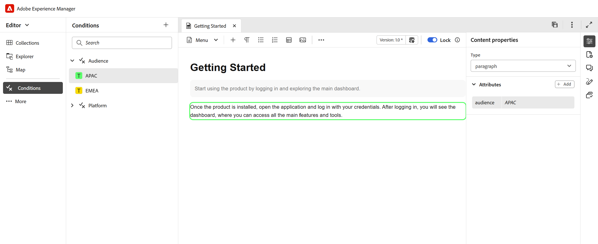{width="650"}

>[!TAB 古いエディター]

{width="650"}

>[!ENDTABS]

ただし、コードビューでは、条件はスペース区切り文字を使用して区切られます。 コードビューで条件を追加または編集する場合は、複数の条件がスペースで区切られていることを確認します。

>[!IMPORTANT]
>
> 次のスクリーンショットは、管理者権限を持つユーザーのものです。 管理者権限を持つユーザーは、条件を追加、編集、削除できます。 それ以外の場合は、通常の作成者として、条件を適用するオプションのみが表示されます。

>[!BEGINTABS]

>[!TAB 新しいエディター]

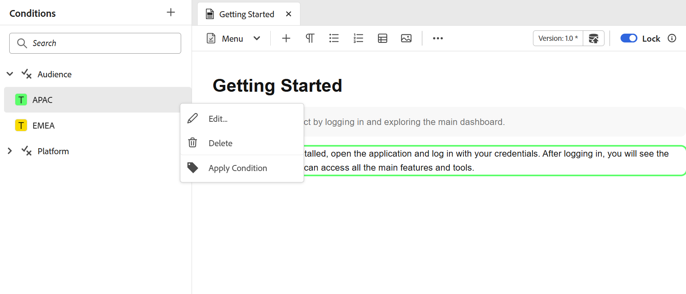{width="650"}

>[!TAB 古いエディター]

{width="650"}

>[!ENDTABS]


条件を追加または定義するには、条件パネルの横にある「+」アイコンを選択して、条件を定義ダイアログボックスを表示します。

{width="400"}

属性リストから、定義する条件付き属性を選択し、条件の値を入力してから、条件パネルに表示されるラベルを指定します。 条件のグループを定義します。 グループに複数の条件を追加できます。 条件のカラーを定義することもできます。 この色は、条件が適用されるコンテンツの背景色として設定されます。

条件をグループ化し、ネストされたフォルダーに構造化できます。 グループは、複数レベルで条件を作成し、コンテンツでの使用に適して整理するのに役立ちます。

例えば、*AEM Guides*&#x200B;や&#x200B;*Acrobat*&#x200B;などの商品の条件グループを作成できます。 両方のグループの条件付き属性を選択できます。 各グループでは、*User*、*Admin*、*Reviewer*、*Author*&#x200B;など、特定の値を指定できます。

>[!NOTE]
>
> を入力して新しいグループを作成するか、特定の属性に既存のグループを選択します。

`/`を使用して、`AEM Guides/Cloud Service`のようなサブグループを定義できます。


ネストされた階層で整理された{width="300"}


条件を編集するには、オプションメニューから&#x200B;**編集**&#x200B;を選択します。 条件を編集ダイアログボックスが表示されます。

{width="400"}

新しい条件を定義する際に設定するのと同じ方法で、詳細を指定します。

## 件名

件名スキームマップは、分類の対象と制御値を定義するために使用されるDITA マップの特殊な形式です。 必要に応じて、件名スキームマップを作成し、ルートマップファイル内で参照できます。 Experience Manager Guidesを使用すると、件名スキームの件名定義のネスト レベル階層を定義できます。

件名スキームマップでは、件名スキーマを簡単に作成して使用できます。 このマップをルートマップとして追加すると、件名スキームが件名スキームパネルに表示されます。 件名スキーム パネルには、使用可能な件名スキームがネストまたは階層的に表示されます。

Experience Manager Guidesでは、ネストされたレベルのサブジェクトスキームのマップもサポートしており、ルートのサブジェクトスキームのマップの下で複数のサブジェクトスキームを定義できます。

<details>
    <summary> Experience Manager Guidesでの件名スキームの使用方法 </summary>
次の例は、Experience Manager Guidesで件名スキームを使用する方法を示しています。

1. 選択したツールで件名スキーム ファイルを作成します。 次のXML コードは、`platform`属性の値をバインドする件名スキームを作成します。

   ```XML
   <?xml version="1.0" encoding="UTF-8"?>
   <!DOCTYPE subjectScheme PUBLIC "-//OASIS//DTD DITA Subject Scheme Map//EN" "subjectScheme.dtd">
   <subjectScheme id="GUID-4f942f63-9a20-4355-999f-eab7c6273270">
       <title>rw</title>
       <!-- Define new OS values that are merged with those in the unixOS scheme -->
       <subjectdef keys="os">
           <subjectdef keys="linux">    </subjectdef>
           <subjectdef keys="mswin">    </subjectdef>
           <subjectdef keys="zos">    </subjectdef>
       </subjectdef>
       <!-- Define application values -->
       <subjectdef keys="app" navtitle="Applications">
           <subjectdef keys="apacheserv">    </subjectdef>
           <subjectdef keys="mysql">    </subjectdef>
       </subjectdef>
       <!-- Define an enumeration of the platform attribute, equal to       each value in the OS subject. This makes the following values       valid for the platform attribute: linux, mswin, zos -->
       <enumerationdef>
           <attributedef name="platform">    </attributedef>
           <subjectdef keyref="os">    </subjectdef>
       </enumerationdef>
       <!-- Define an enumeration of the otherprops attribute, equal to       each value in the application subjects.       This makes the following values valid for the otherprops attribute:       apacheserv, mysql -->
       <enumerationdef>
           <attributedef name="otherprops">    </attributedef>
           <subjectdef keyref="app">    </subjectdef>
       </enumerationdef>
   </subjectScheme>
   ```

   {width="300"}

1. 拡張子が.ditamapのファイルを保存し、DAMの任意のフォルダーにアップロードします。

   >[!NOTE]
   >
   > 親DITA マップ内の件名スキームファイルへの参照を追加できます。

   {width="550"}

1. 親マップを&#x200B;**ユーザー設定**&#x200B;のルートマップとして設定します。 このマップをルートマップとして追加すると、件名スキームが件名スキーム パネルに表示されます。

   {width="650"}


1. エディターで、件名スキーム定義を使用するファイルを開きます。
1. 目的の件名スキームをコンテンツにドラッグ&amp;ドロップするだけで、件名スキームをコンテンツに適用できます。 その後、コンテンツは定義された色でハイライト表示されます。
</details>

<details>
    <summary> 件名の定義と列挙の階層定義の処理 </summary>

Experience Manager Guidesでは、同じマップに存在する列挙と件名を処理するだけでなく、2つの個別のマップで列挙と件名を定義する機能も提供しています。 マップ内で1つ以上の件名の定義を定義し、別のマップ内で列挙定義を定義してから、マップ参照を追加できます。 例えば、次のXML コードは、2つの個別のマップで件名の定義と列挙定義を作成します。

件名の定義は`subject_scheme_map_1.ditamap`で定義されています


```XML
  <?xml version="1.0" encoding="UTF-8"?> 
    <!DOCTYPE subjectScheme PUBLIC "-//OASIS//DTD DITA Subject Scheme Map//EN" "../dtd/libs/fmdita/dita_resources/DITA-1.3/dtd/subjectScheme/dtd/subjectScheme.dtd"> 
    <subjectScheme id="subject-scheme.ditamap_f0bfda58-377b-446f-bf49-e31bc87792b3"> 

    <title>subject_scheme_map_1</title> 
    
    <subjectdef keys="os" navtitle="Operating system">
        <subjectdef keys="linux" navtitle="Linux">
        <subjectdef keys="redhat" navtitle="RedHat Linux">
        </subjectdef>
        <subjectdef keys="suse" navtitle="SuSE Linux">
        </subjectdef>
        </subjectdef>
        <subjectdef keys="windows" navtitle="Windows">
        </subjectdef>
        <subjectdef keys="zos" navtitle="z/OS">
        </subjectdef>
        </subjectdef>
        <subjectdef keys="deliveryTargetValues">
        <subjectdef keys="print">
        </subjectdef>
        <subjectdef keys="online">
        </subjectdef>
    </subjectdef>
    <subjectdef keys="mobile" navtitle="Mobile">
        <subjectdef keys="android" navtitle="Android">
        </subjectdef>
        <subjectdef keys="ios" navtitle="iOS">
    </subjectdef>
    </subjectdef>
    <subjectdef keys="cloud" navtitle="Cloud">
        <subjectdef keys="aws" navtitle="Amazon Web Services">
        </subjectdef>
        <subjectdef keys="azure" navtitle="Microsoft Azure">
        </subjectdef>
        <subjectdef keys="gcp" navtitle="Google Cloud Platform">
        </subjectdef>
    </subjectdef>
    </subjectScheme>
```

列挙定義はsubject_scheme_map_2.ditamapに存在します。

```XML
    ?xml version="1.0" encoding="UTF-8"?> 
        <!DOCTYPE subjectScheme PUBLIC "-//OASIS//DTD DITA Subject Scheme Map//EN" "../dtd/libs/fmdita/dita_resources/DITA-1.3/dtd/subjectScheme/dtd/subjectScheme.dtd"> 
        <subjectScheme id="subject-scheme.ditamap_17c433d9-0558-44d4-826e-3a3373a4c5ae"> 
        <title>subject_scheme_map_2</title> 
        <mapref format="ditamap" href="subject_scheme_map_1.ditamap" type="subjectScheme"> 
        </mapref> 
        <enumerationdef>
        <attributedef name="platform">
        </attributedef>
        <subjectdef keyref="mobile">
        </subjectdef>
        <subjectdef keyref="cloud">
        </subjectdef>
        </enumerationdef>
        </subjectScheme>
```

ここでは、列挙定義が`subject_scheme_map_2.ditamap`に存在する間、`subject_scheme_map_1.ditamap`で件名の定義が定義されます。 `subject_scheme_map_1.ditamap`への参照も`subject_scheme_map_2.ditamap`に追加されています。

>[!NOTE]
>
> `subject_scheme_map_1.ditamap`と`subject_scheme_map_2.ditamap`が互いに参照されているため、件名スキームが解決されています。

サブジェクト列挙の参照は、次の優先順位で解決されます。

1. 同一マップ
1. 参照マップ


列挙が同じマップと参照マップに見つからない場合、参照は解決されません。

</details>

<details>
    <summary> 値を特定の要素に制限 </summary>


また、トピック内の一部の要素に条件を制限することもできます。`<elementdef>` タグを使用して要素を定義し、`<attributedef>` タグを使用して要素に適用できる条件を定義します。 `<elementdef>` タグを追加しない場合は、すべての要素に条件を適用できます。
例えば、次の列挙を使用して、`@platform`属性を`<shortdesc>`要素に制限します。 その他の条件は、すべての要素に対して表示されます。

```XML
<enumerationdef>
    <elementdef name="shortdesc">
    </elementdef>
    <attributedef name="platform">
    </attributedef>
    <subjectdef keyref="deliveryTargetValues">
    </subjectdef>
    <subjectdef keyref="os">
    </subjectdef>
  </enumerationdef>
```

</details>


**属性** ドロップダウン

**作成者** ビューの&#x200B;**コンテンツ属性** パネルの&#x200B;**属性** ドロップダウンを使用して、件名スキームの値を変更することもできます。

値を変更するには、次の手順を実行します。

1. **属性** ドロップダウンから属性を選択します。
1. 「**編集**」を選択します。
1. **値** ドロップダウンから必要な値を選択します。
1. 「**更新**」を選択します。

ドロップダウンから複数の値を選択して、属性に値を適用することもできます。

>[!BEGINTABS]

>[!TAB 新しいエディター]

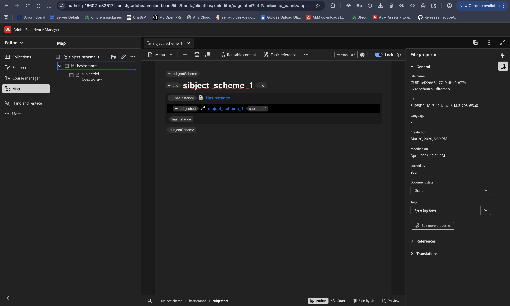{width="650"}

>[!TAB 古いエディター]

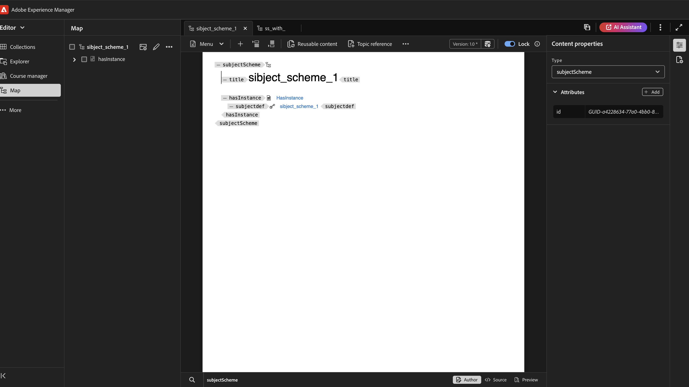{width="550"}

>[!ENDTABS]


**Source ビュー**

Source ビューの属性のドロップダウンから値を変更することもできます。 Source ビューでは、誤った値を追加することもできません。

{width="550"}

**条件パネルから件名スキームを表示して適用する**

また、条件パネルから件名スキームを表示して適用することもできます。

条件パネルから件名スキームを表示するには、システム管理者は、**Workspace設定**&#x200B;の「一般」タブで「**条件パネル**」オプションを選択する必要があります（バージョン 5.2 **より前の** オンプレミス設定の場合は&#x200B;**設定**」と表示されます）。 詳細については、[ タブ バー](./web-editor-tab-bar.md)を参照してください。

条件パネルには、件名スキーム内の件名定義のフラットな垂直構造が表示されます。

目的の条件をコンテンツにドラッグアンドドロップすることで、コンテンツに条件を追加できます。 条件コンテンツは、条件に定義された色を使用してハイライト表示されます。

## スニペット

スニペットは、ドキュメントプロジェクトの様々なトピックで再利用できる小さなコンテンツフラグメントです。 スニペットパネルには、作成したコンテンツスニペットのコレクションが表示されます。 スニペットを挿入するには、スニペットをパネルからトピック内の目的の場所にドラッグ&amp;ドロップします。 スニペットパネルでは、スニペットを追加、編集、削除、プレビュー、挿入できます。

>[!IMPORTANT]
>
> 次のスクリーンショットは、管理者権限を持つユーザーのものです。 管理者権限を持つユーザーは、スニペットを追加、編集、削除できます。 それ以外の場合は、通常の作成者として、スニペットをプレビューして挿入するオプションのみが表示されます。


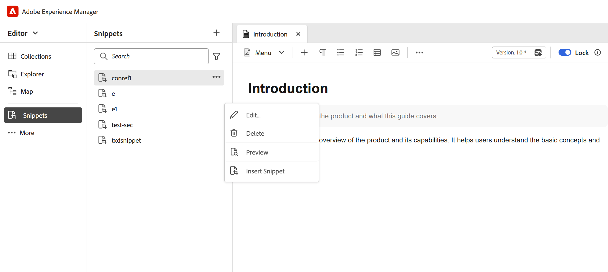{width="650"}

**スニペットの作成**

スニペットを追加するには、次のいずれかの方法を使用します。

1. スニペットの横にある&#x200B;**+** アイコンを選択して、**新しいスニペット** ダイアログボックスを開きます。

   {width="300"}

   新規スニペットダイアログで、スニペットパネルに表示されるタイトル、説明を入力し、コンテンツのフォーマット（DITAまたはHTML）を選択し、作成するスニペットコンテンツのコードを入力します。 スニペットを保存して作成するには、**作成**&#x200B;を選択します。

2. コンテンツ編集領域で、スニペットとして使用するエレメントのパンくずリストを右クリックし、コンテキストメニューから「**スニペットを作成**」を選択します。 新規スニペット ダイアログが表示され、選択した要素のXML コードが&#x200B;**コンテンツ** フィールドに入力されます。 スニペットの&#x200B;**タイトル**&#x200B;と&#x200B;**説明**&#x200B;を入力し、**作成**&#x200B;を選択してスニペットを保存します。

3. コンテンツ編集領域で、スニペットとして使用するコンテンツの任意の場所を右クリックし、コンテキストメニューから「**スニペットを作成**」を選択します。 新規スニペット ダイアログボックスが表示され、選択した要素のXML コードが&#x200B;**コンテンツ** フィールドに入力されます。 スニペットの&#x200B;**タイトル**&#x200B;と&#x200B;**説明**&#x200B;を入力し、**作成**&#x200B;を選択してスニペットを保存します。

   次のスクリーンショットは、コンテキストメニューを呼び出すことができるパンくずリストとコンテンツ領域を強調表示しています。

   {width="350"}

**スニペットを挿入**

スニペットを挿入するには、次のいずれかの方法を使用します。

- スニペット パネルからスニペットを選択し、トピック内の目的の場所にドラッグ&amp;ドロップします。 スニペットパネルの上部にあるフィルターオプションを使用して、ビューを絞り込むこともできます。

   - **すべてのスニペットを表示**: DITAとHTMLの両方を含む、利用可能なすべてのスニペットを一覧表示します。
   - **該当するスニペットのみを表示**：現在のトピックまたはコンテキストに関連するスニペットのみを表示するように、リストをフィルタリングします。 例えば、DITA トピックを扱う場合、コンテキストの正確性を確保するために、HTML スニペットはリストから除外されます。

- スニペットを挿入する位置に挿入ポイントを置き、必要なスニペットのオプションメニューから「スニペットを挿入」を選択します。


>[!NOTE]
>
> スニペットエントリのコンテキストメニューから、「編集」、「削除」、「プレビューを取得」、「スニペットを挿入」のいずれかを選択することもできます。

## テンプレート

テンプレートパネルは、管理者のみが使用できます。 管理者は、このパネルを使用して、作成者が使用できるテンプレートを簡単に作成および管理できます。 デフォルトでは、テンプレートは&#x200B;*map*&#x200B;および&#x200B;*topic* タイプのテンプレートに分類されます。

{width="300"}

デフォルトでは、タイトルでファイルを表示できます。 テンプレートにカーソルを合わせると、ファイルのタイトルとファイル名がツールチップとして表示されます。

>[!NOTE]
>
> 管理者は、エディターでファイルのリストを表示することもできます。 **ユーザー設定**&#x200B;の「**エディターファイル表示設定**」セクションの「**ファイル名**」オプションを選択します。

カスタムテンプレートの作成方法については、[ カスタマイズされたテンプレートに基づくマップの作成](./create-maps-customized-templates.md)を参照してください。


## 引用

>[!NOTE]
>
> 引用は古いエディターでのみサポートされており、現在は新しいエディターでは使用できません。 この記事の情報は、古いエディターを使用している場合にのみ適用されます。

Experience Manager Guidesでは、引用を追加および読み込み、コンテンツに適用できます。 ブック、web サイト、ジャーナルの任意のソースからこれらの引用を追加できます。

詳細については、[ コンテンツ内の引用を追加および管理する](./web-editor-apply-citations.md)を参照してください。

## 言語変数

Experience Manager Guidesでは、ネイティブ PDF出力で言語変数を使用する機能が提供されています。 言語変数を使用して、PDF出力でローカライズされた文字列を定義したり、出力テンプレートの静的テキストをローカライズしたりできます。 CSS スタイルを使用すると、CSSから取得した文字列をローカライズできます。

詳しくは、[言語変数のサポート ](../native-pdf/native-pdf-language-variables.md)を参照してください。

## 変数

Experience Manager Guidesでは、ネイティブ PDF公開用の変数を作成および管理できます。 詳しくは、PDF出力](../native-pdf/native-pdf-variables.md)の[変数を参照してください。


## 検索と置換

検索と置換アイコンは、左側のパネルの下部にあります。 検索と置換パネルを使用すると、マップまたはリポジトリ内のフォルダー内のファイル間でテキストを検索して置換できます。 サブマップやMarkdown ファイルのトピックを含め、マップ内のすべてのトピックに対して検索と置換の操作を実行できます。

デフォルトでは、タイトルでファイルを表示できます。 ファイルにカーソルを合わせると、ファイルタイトルとファイルパスがツールチップとして表示されます。

>[!NOTE]
>
> 管理者は、エディターでファイル名のリストを表示することもできます。 **ユーザー設定**&#x200B;の「**エディターファイル表示設定**」セクションの「**ファイル名**」オプションを選択します。

「検索と置換」機能は、必要に応じて、次の2つのモードで使用できます。

- **Source モード：**&#x200B;検索では、表示されているコンテンツだけでなく、検索文字列の基になるソース コンテンツ（エレメント、タグ、属性値を含むXML構造）も検索されます。 このモードでは、コンテンツ全体で包括的な検索が可能です。 この機能を使用するには、検索と置換パネルで利用可能な「**ソースモードを使用**」オプションを有効にする必要があります。

  >[!NOTE]
  >
  > **ソースモードを使用**&#x200B;機能は、2026.01.0 リリースのExperience Manager Guides as a Cloud Serviceおよび5.2 リリースのオンプレミス設定で使用できます。 この機能を使用するには、まず、使用している設定に応じてコンテンツをインデックス化する必要があります。
  > - **クラウドサービス**&#x200B;の場合：カスタムインデックスのデプロイメントを実行する必要があります。 詳しくは、[ カスタムインデックスのデプロイ ](/help/product-guide/cs-install-guide/custom-indexing.md)を参照してください。 完了したら、カスタマーサクセス部門に連絡して、この機能を有効にしてください。
  > - オンプレミス **の場合**：機能を使用するには、既存のコンテンツのインデックスを再作成する必要があります。 詳しくは、[ コンテンツのインデックス再作成](/help/product-guide/install-guide/custom-indexing-prem.md)を参照してください。 完了したら、カスタマーサクセス部門に連絡して、この機能を有効にしてください。

  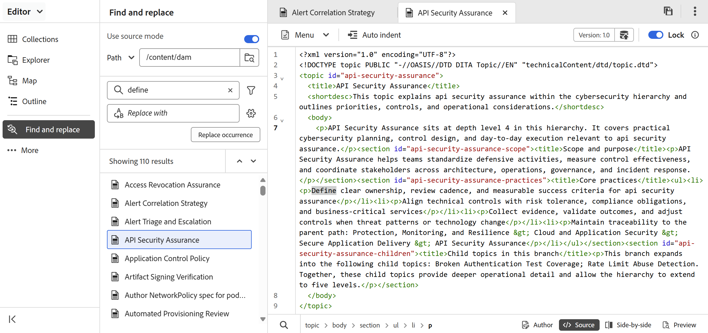

<br>

<details>
    <summary> グローバル検索を実行し、Source モードで置き換える</summary>

グローバル検索を実行してSource モードに置き換えるには、次の手順を実行します。

1. グローバルな&#x200B;**検索と置換** パネルを開きます。
1. 「**ソースモードを使用**」オプションを有効にします。
1. 「**パス**」ドロップダウンを選択し、次のいずれかのオプションを選択して検索を実行します。

   - **パス**：選択したパスを検索するには
   - **Map**: リポジトリまたはコレクションから特定のマップを検索するには
   - **現在のマップ**：現在開いているマップを検索するには

   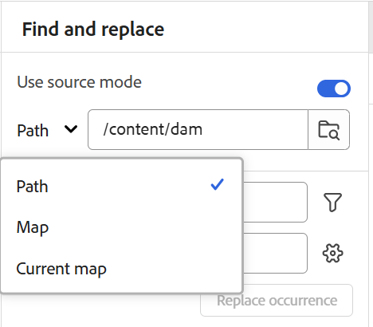{width="350"}


1. **検索** フィールドに検索文字列を入力します。 結果を絞り込むには、検索フィールドの横にある&#x200B;**フィルター** アイコンを選択し、次の目的のフィルターを選択します。

   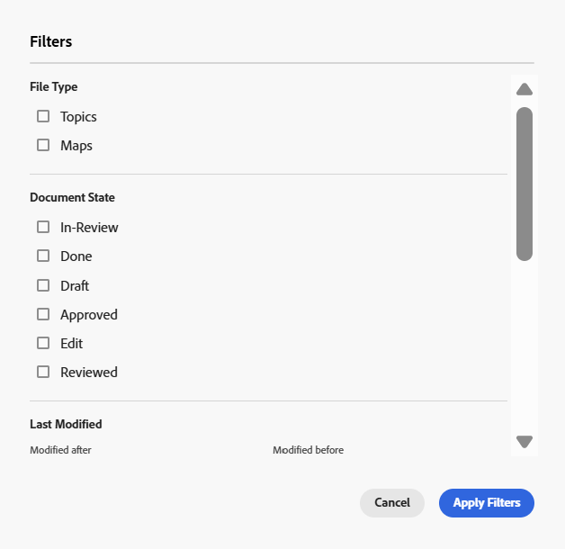{width="350"}

   - **ファイルの種類**: テキストを検索するファイルの種類、**トピック**&#x200B;および&#x200B;**マップ**&#x200B;を選択します
   - **ドキュメントの状態**：使用可能なオプションからドキュメントの状態を選択できます。 表示されるドキュメント状態オプションは、フォルダープロファイルから派生しています。 これらのプロファイル全体のすべての可能なドキュメント状態を組み合わせたセットを表します。 デフォルトの状態には、「レビュー中」、「完了」、「ドラフト」、「承認済み」、「編集」、「レビュー済み」などがあります。
   - **最終変更日**：変更日に基づいてコンテンツをフィルタリングします。 カレンダーから日付範囲を選択するか、次のいずれかの時間枠オプションを選択します。

      - 過去2時間で
      - 先週
      - 「先月」
      - 昨年
   - **その他**：次の項目を設定できます。
      - **タグ**: タグに基づいてコンテンツをフィルタリングします。
      - **大文字と小文字を区別する検索**：指定した大文字と小文字が一致することを確認して検索を有効にします。
      - **他のユーザーによってロックされているファイルを一覧表示**：現在、他のユーザーによってロックされているファイルを表示し、ロックが解除されるまで編集を禁止します。

1. Enter キーを押すか、**検索** アイコンを選択して検索を実行します。

   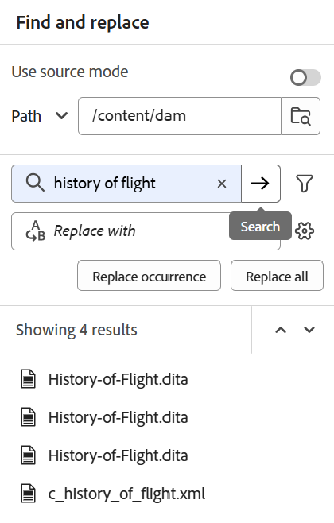{width="350"}

1. 検索結果リストからファイルを選択します。 検索された用語がコンテンツでハイライト表示された状態で、ファイルがSource ビューで開きます。

1. 「**次で置き換え」フィールドに、置き換え用の用語を入力します。** 置換の適用方法をカスタマイズするには、フィールドの横にある&#x200B;**設定** アイコンをクリックし、使用可能なオプションから選択します。

   - **ロック解除されたファイルの置換**：ロック解除されたファイルでの置換を許可するには、このオプションを選択します。

   - **置換後に新しいバージョンを作成**：テキストを置換するトピックの新しいバージョンを作成する場合は、このオプションを選択します。 また、更新されたファイルごとに追加されるバージョンコメントを指定することもできます。 このオプションを選択しない場合、変更はトピックの現在のバージョンに保存され、新しいバージョンは作成されません。

   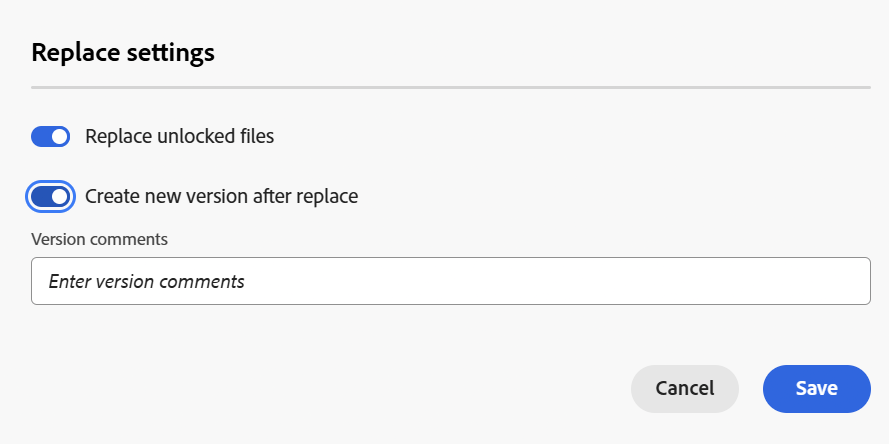{width="350"}


1. トピック内で現在強調表示されている検索文字列を置き換えるには、**出現を置換**&#x200B;を選択するか、テキストの次または前の出現に移動するには、上下の矢印を選択します。

   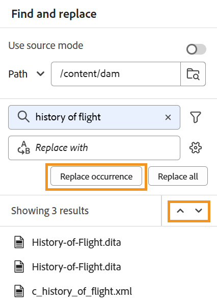{width="350"}

1. 「**すべてを置換**」を選択すると、検索されたすべてのファイルで検索された文字列のすべての出現箇所を、指定された置換文字列に置き換えることができます。 すべてのオカレンスが置き換えられると、通知が表示されます。

   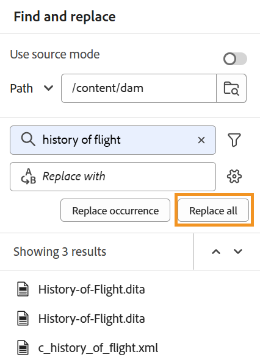{width="350"}

   >[!NOTE]
   >
   >**すべてを置換** ボタンを有効にするには、フォルダープロファイル管理者またはシステム管理者が、**Workspace settings**&#x200B;の&#x200B;**General** タブで「**すべてを置換を有効にする**」オプションを選択する必要があります（バージョン 5.2 **以前の** オンプレミス設定の&#x200B;**Settings**）。

1. 検索結果リストのファイルにカーソルを合わせると、その右側にある「**ファイル内のすべてを置換**」アイコンを表示できます。これにより、1つのファイル内のすべての用語を置換できます。

   >[!NOTE]
   >
   > また、**削除** アイコンを使用して、検索結果からファイルを削除することもできます。 削除したファイルはリストから削除され、検索した用語は置き換えられません。

   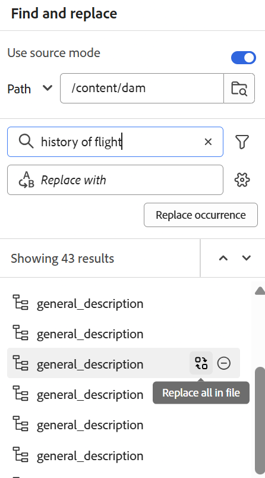{width="350"}

1. 「すべての置換」操作が完了すると、ダウンロード可能なCSV レポートが生成され、実行されたすべての置換アクションのスナップショットが提供されます。 このレポートをダウンロードすると、正常に置換された回数や、各エラーの詳細、およびそれに対応する理由など、置換操作に関する詳細な情報を確認できます。 ファイルが別のユーザーによってロックされている、操作中にファイルに加えられた変更による検証エラー、その他の同様の問題など、特定の理由で操作が失敗する場合があります。

   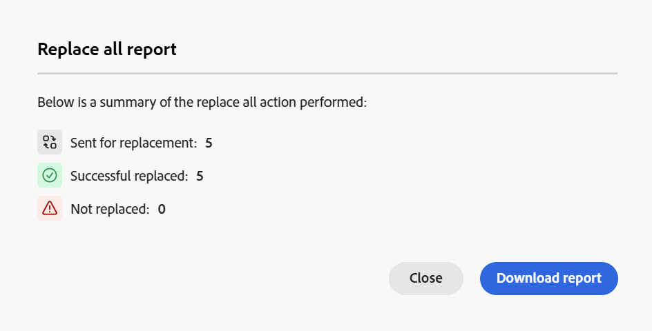{width="350"}

システム全体で一度に1回の置換操作のみを実行できます。操作が実行されるまでは、「処理中のすべての置換操作」ステータスが表示されます。 また、間にあるすべての置換の操作を中止することもできます。 操作を中止すると、その操作に関する通知がインボックスに届きます。

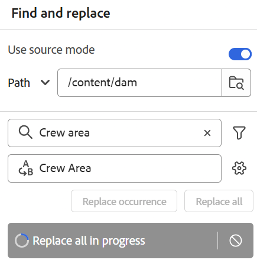{width="350"}

</details>

<br>

- **Source モードを使用しない：**&#x200B;検索は、作成者ビューに表示されるテキストに限定され、XML要素や属性などのソースコンテンツをスキップする表示コンテンツのみに焦点が当てられます。 このモードは、コンテンツのみの検索をすばやく実行するのに最適です。

  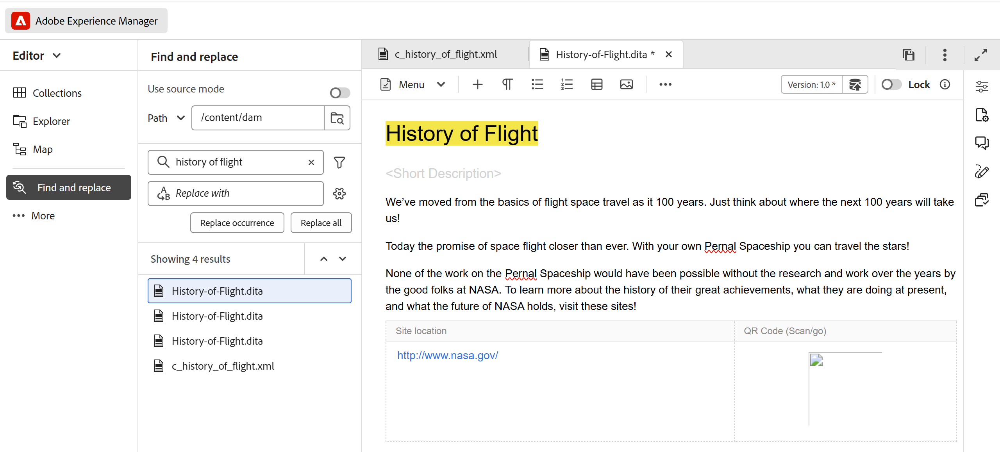

<br>
<details>
    <summary> Source モードを使用せずにグローバル検索と置換を実行</summary>


Source モードを使用せずにグローバル検索と置換を実行するには、次の手順を実行します。

1. グローバルな&#x200B;**検索と置換** パネルを開きます。
1. 「**パス**」ドロップダウンを選択し、次のいずれかのオプションを選択して検索を実行します。

   - **パス**：選択したパスを検索するには
   - **Map**: リポジトリまたはコレクションから特定のマップを検索するには
   - **現在のマップ**：現在開いているマップを検索するには

   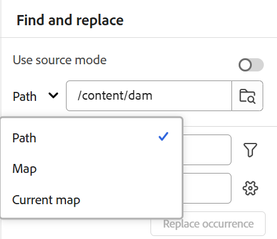{width="350"}

1. **検索** フィールドに検索文字列を入力します。 結果を絞り込むには、検索フィールドの横にある&#x200B;**フィルター** アイコンを選択し、次の目的のフィルターを選択します。


   - **単語全体のみ**：検索文字列全体を検索する場合は、このオプションを選択します。 例えば、検索文字列にオーバーを入力した場合、検索結果には「オーバー」や「概要」などの単語を含むすべてのファイルが返されます。 入力された正確な語句を返すように検索を制限する場合は、このオプションを選択します。

   - **間接参照を含める**: DITA マップ内でも間接参照の文字列を検索する場合は、このオプションを選択します。 デフォルトでは、これは無効になっているので、検索は直接参照に対してのみ実行されます。

   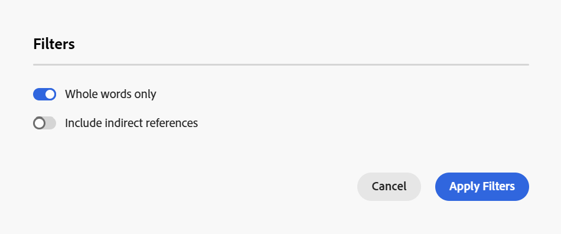{width="350"}

1. Enter キーを押すか、**検索** アイコンを選択して検索を実行します。

   {width="350"}

1. 検索結果リストからファイルを選択します。 ファイルがコンテンツ編集領域の作成者ビューで開き、検索された用語がコンテンツでハイライト表示されます。

1. 「**次で置き換え」フィールドに、置き換え用の用語を入力します。** 置換の適用方法をカスタマイズするには、フィールドの横にある&#x200B;**設定** アイコンをクリックし、使用可能なオプションから選択します。

   - **置換前にファイルをロック**：検索文字列を置き換える前にファイルを自動的にロックする場合は、このオプションを選択します。 この設定は、管理者が編集前にファイルをロックする設定を有効にしている場合に適しています。 バックエンド設定が有効になっている場合は、このオプションを選択する必要があります。 これにより、ファイルのロックダイアログで、変更を加える前にすべてのファイルをロックするように求められなくなります。 このオプションを選択しない場合は、ファイルを編集するために開く前にプロンプトが表示されます。

   - **置換後に新しいバージョンを作成**：テキストを置換するトピックの新しいバージョンを作成する場合は、このオプションを選択します。 また、更新されたファイルごとに追加されるバージョンコメントを指定することもできます。 このオプションを選択しない場合、変更はトピックの現在のバージョンに保存され、新しいバージョンは作成されません。

   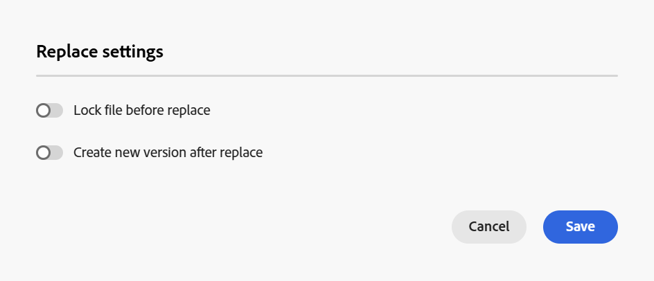{width="350"}


1. トピック内で現在強調表示されている検索文字列を置き換えるには、**出現を置換**&#x200B;を選択するか、テキストの次または前の出現に移動するには、上下の矢印を選択します

   {width="350"}

1. 「**すべてを置換**」を選択すると、1回の移動で、1つのファイル内で検索された用語のすべての出現箇所が、置換用語に置き換わります。 選択したファイルのすべての出現を置き換えると、通知が表示されます。

   >[!NOTE]
   >
   > 次に&#x200B;**すべてを置換** アイコンを有効にするには、フォルダープロファイル管理者またはシステム管理者が、**Workspace設定**&#x200B;の&#x200B;**一般** タブで「**すべてを置換を有効にする**」オプションを選択する必要があります（バージョン 5.2 **より前の** オンプレミス設定の場合は&#x200B;**Settings**&#x200B;と表示）。 置換操作中にエラーが発生した場合、XML解析の問題やDITA関連のエラーが原因で、これらのファイルはスキップされます。

   {width="350"}

1. 検索結果リストのファイルにカーソルを合わせると、その右側にある「**ファイル内のすべてを置換**」アイコンを表示できます。これにより、1つのファイル内のすべての用語を置換できます。

   >[!NOTE]
   >
   > また、**削除** アイコンを使用して、検索結果からファイルを削除することもできます。 削除したファイルはリストから削除され、検索した用語は置き換えられません。

   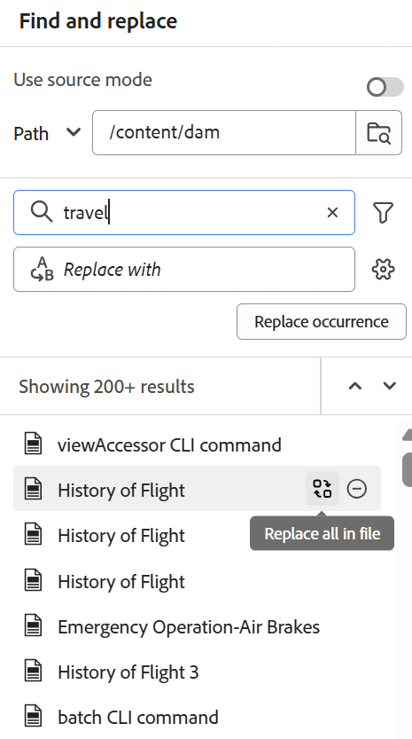{width="350"}

システム全体で一度に1回の置換操作のみを実行できます。操作が実行されるまでは、「処理中のすべての置換操作」ステータスが表示されます。 間にあるすべての置換の操作を中止したり、ログレポートを表示したりすることもできます。 操作を中止すると、その操作に関する通知がインボックスに届きます。 選択したファイルのすべてのオカレンスを置き換えると、成功通知が表示されます。

{width="350"}

マップの&#x200B;**オプション** メニューの「**マップ内で検索**」オプションを使用して、マップ内のテキストを検索および置換することもできます。 このオプションは、リポジトリパネルまたはマップビューで開いたマップに対して表示されます。

{width="650"}

</details>

## PDF テンプレート

を使用すると、様々なPDF テンプレートを操作できます。 詳しくは、[PDF テンプレート ](../native-pdf/pdf-template.md)を参照してください。

## レビュー

Experience Manager Guidesには、プロジェクト内のすべてのレビュータスクを表示する機能が用意されています。 **レビュー** パネルから参加しているすべてのレビュープロジェクトとアクティブなレビュータスクをレビュープロジェクト内で表示できます。  その後、レビュータスクを開いて、様々なレビュー担当者のコメントを表示できます。

レビューパネルにレビュータスクが表示されます。 デフォルトでは、タイトルでファイルを表示できます。 ファイルにカーソルを合わせると、ファイルタイトルとファイルパスがツールチップとして表示されます。

>[!NOTE]
>
> 管理者は、エディターでファイル名でファイルのリストを表示することもできます。 **ユーザー設定**&#x200B;の「**エディターファイル表示設定**」セクションの「**ファイル名**」オプションを選択します。

作成者は、エディターを使用してトピック内のコメントに対処できます。

<details>
    <summary> コメントを確認する手順 </summary>


プロジェクトに存在するアクティブなレビュータスクでレビューコメントを表示するには、次の手順を実行します。

1. 左側のパネルで「レビュー」を選択します。 **レビュー** パネルが開きます。  レビュープロジェクトと、自分が属しているレビュープロジェクト内のアクティブなレビュータスクがすべて表示されます。

   {width="300"}
1. レビュープロジェクトを選択し、リストからレビュータスクを選択して開きます。
1. **プロジェクトダッシュボードを開く** アイコンを選択して、**プロジェクトコンソール**&#x200B;でプロジェクトを開くことができます。

   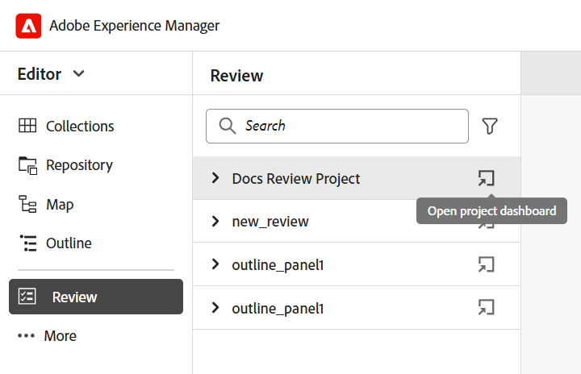{width="300"}

1. 次の方法でプロジェクトをフィルタリングすることもできます。

   - プロジェクトのタイトルに、検索する検索語句またはテキストを入力します。 次に、Enter キーを押して検索を実行します。 例えば、タイトルに「スペース」という単語が含まれているすべてのプロジェクトを検索できます。

   - 「」を選択して、**フィルター** ダイアログボックスを開きます。 すべてのプロジェクトまたは特定のプロジェクトのみを選択できます。 選択したプロジェクトは、**レビュー** パネルに一覧表示されます。

     {width="300"}

     **フィルター** ダイアログには、トグルを使用して有効または無効にできる次のオプションも含まれています。

      - **自分が開始したタスク**：有効にすると、開始したタスクのみが表示されます。
      - **アクティブなタスクのみを表示**：有効にすると、プロジェクトリストがフィルター処理され、現在アクティブなタスクのみが表示されます。

     デフォルトでは、両方のオプションは無効になっています。 また、ページを更新した後でも、選択した切り替え状態は維持されます。

1. デフォルトでは、レビュープロジェクトでは、コメントが関連付けられているトピックのフラットリストが表示されます。 左側のパネルから必要なフィルターを適用して、表示されるレビューコメントに基づいてトピックをフィルターします。

   - **すべてのトピックを表示**: プロジェクトに存在するすべてのトピックを一覧表示します。
   - **コメント付きのトピックを表示**：レビューコメントを含むトピックのみを一覧表示します。
1. トピックのタイトルまたはファイルパスに、検索する検索語句またはテキストを入力することもできます。 タイトルまたはファイルパスに用語を含むトピックが一覧表示されます。
1. 任意のトピックをダブルクリックして、オーサービューで開きます。 コメントは、**コメント** パネルで表示できます。

   {  }

   >[!NOTE]
   > 
   > **レビュー** パネルと&#x200B;**コメント** パネルは、常に同期しています。コメント パネルでは、レビューパネルに読み込まれたレビュータスクに基づいてコメントが読み込まれます。
   >レビューパネルの左側のパネルに、アクティブなレビュータスクと共に、閉じられたレビュータスクを表示できます。
   >さらに、閉じたレビュータスクの場合は、右側のコメントパネルでレビューコメントを表示できますが、「**コメントを読み込み**」と「**バージョンを元に戻す**」ボタンは無効になっています。
   >コメントへの対処方法について詳しくは、[ レビューコメントのアドレス ](review-address-review-comments.md#)を参照してください。

</details>

**親トピック：**[ エディターの概要](web-editor.md)
