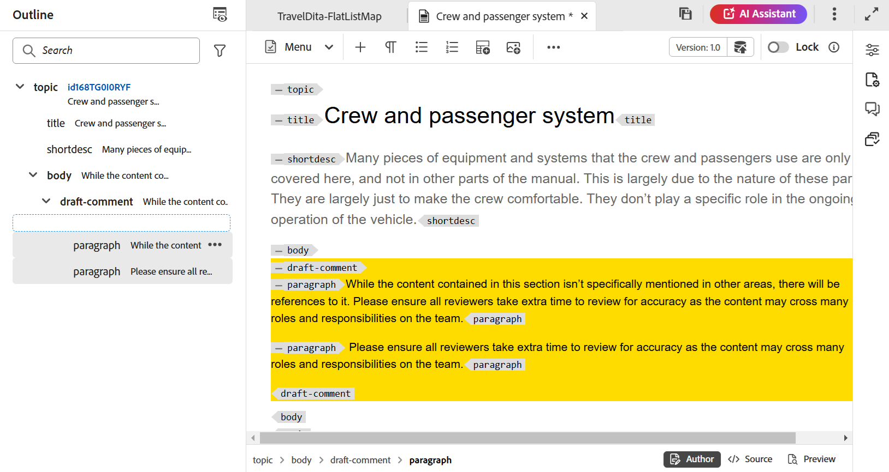
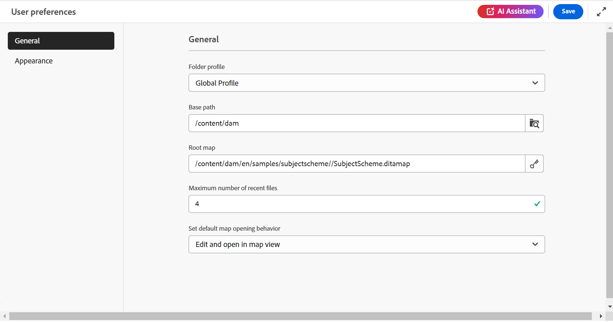

# エディターの左パネル

左側のパネルを使用すると、コレクション、リポジトリビュー、マップビューなどの機能にすばやくアクセスできます。 パネルを展開するには、インターフェイスの左下コーナーに配置されている **展開** アイコンを選択します。 展開したら、**折りたたむ** アイコンを使用してパネルを折りたたみます。 展開されたビューには、折りたたまれたビューにツールチップとして表示されるアイコンの名前が表示されます。

>[!NOTE]
>
> 左側のパネルはサイズ変更可能です。 パネルのサイズを変更するには、パネルの境界上にカーソルを置きます。カーソルが双方向矢印に変わり、選択してドラッグすると、パネルの幅のサイズが変更されます。

左側のパネルでは、次の機能にアクセスできます。

- [コレクション](#collections)
- [リポジトリ](#repository)
- [Map](#map)
- [再利用可能なコンテンツ](#reusable-content)
- [概要](#outline)

左側のパネルの機能の一部は、「**詳細**」セクションで利用できます。 「その他」アイコン  を選択して、以下の機能にアクセスします。

- [用語集](#glossary)
- [条件](#conditions)
- [件名スキーム](#subject-scheme)
- [スニペット](#snippets)
- [テンプレート](#templates)
- [引用](#citations)
- [言語変数](#language-variables)
- [変数](#variables)
- [検索と置換](#find-and-replace)
- [PDF テンプレート](#pdf-templates)
- [レビュー](#review)


Adobe Workfrontが設定されている場合、「**Workfront**」というラベルの付いた追加のオプションも左側のパネルに表示されます。

詳しくは、[Workfront統合 ](./workfront-integration.md) を参照してください。

>[!NOTE]
>
> 左側のパネルで使用できる機能は管理者が管理するもので、左側のパネルに表示される個々の機能を有効または無効にすることができます。 有効な機能のみが左パネルに表示されます。 詳しくは、[ タブバー ](./web-editor-tab-bar.md) の **パネル** セクションを参照してください。

左パネルの機能の詳細は次のとおりです。

## コレクション

一連のファイルまたはフォルダーで作業する場合は、それらをお気に入りのリストに追加すると、すばやくアクセスできます。 **コレクション** 追加したドキュメントのリストや、他のユーザーから公開されているアクセス可能なドキュメントのリストを表示します。

デフォルトでは、タイトル別にファイルを表示できます。 ファイルの上にマウスポインターを置くと、ファイルのタイトルとファイルパスがツールチップとして表示されます。

>[!NOTE]
>
> 管理者は、エディターでファイル名ごとにファイルのリストを表示することもできます。 **ユーザー環境設定** の **エディターファイル表示設定** セクションの **ファイル名オプションを選択します**。

<details>
    <summary> 新しいコレクションの作成 </summary>


新しいコレクションを作成するには、コレクションパネルの横にある+ アイコンを選択すると **新規コレクション** ダイアログボックスが表示されます。

{width="300" align="left"}

作成するコレクションのタイトルと説明を入力します。 「**公開**」を選択すると、このお気に入りが他のユーザーにも表示されます。

>[!NOTE]
>
> Experience Manager Guidesのホームページからコレクションを作成することもできます。 ホームページを開き、「概要」セクションの **コレクション** ウィジェットに移動して [ 新しいコレクション **を選択します。**](./intro-home-page.md#overview)

</details>

<details>
    <summary> コレクションへのファイルの追加 </summary>


コレクションにファイルを追加するには、次のいずれかの方法を使用します。

- リポジトリ表示で必要なファイルまたはフォルダーに移動し、*オプション* アイコンを選択してコンテキストメニューを開き、**追加先**/**コレクション** を選択します。 **コレクションに追加** ダイアログボックスで、ファイルやフォルダーを既存のお気に入りに追加するか、新しいお気に入りに作成するかを選択できます。

  {width="300" align="left"}

- エディターでファイルのタブを右クリックして、コンテキストメニューを開きます。 **追加先**/**コレクション** を選択して、ファイルをお気に入りリストに追加します。

  {align="left"}


>[!NOTE]
>
> - お気に入りリストから項目を削除するには、「お気に入り」コレクションの項目の横にあるオプションアイコンを選択し、「**コレクションから削除**」を選択します。
> - ファイルを開かずにプレビューするには、ファイルを選択し、オプションメニューから **プレビュー** を選択します。

</details>

**コレクションのオプションメニュー**

また、コレクションで使用可能なオプションメニューを使用して、多くのアクションを実行できます。

{width="650" align="left"}

- **名前を変更**：選択したコレクションの名前を変更します。
- **削除**：選択したコレクションを削除します。
- **更新**：リポジトリからファイルとフォルダーの新しいリストを取得します。
- **Assets UI で表示**:Assets UI で、ファイルまたはフォルダーのコンテンツを表示します。

>[!NOTE]
>
> 上部の「更新」アイコンを使用してリストを更新することもできます。


## リポジトリ

リポジトリーアイコンを選択すると、DAM で使用できるファイルとフォルダーのリストが表示されます。 デフォルトでは、タイトル別にファイルを表示できます。 ファイルの上にマウスポインターを置くと、ファイルのタイトルとファイル名がツールチップとして表示されます。

>[!NOTE]
>
> 管理者は、エディターでファイル名ごとにファイルのリストを表示することもできます。 **ユーザー環境設定** の **エディターファイル表示設定** セクションの **ファイル名オプションを選択します**。

一度に 75 個のファイルが読み込まれます。 「**さらに読み込む**」を選択するたびに、75 個のファイルが読み込まれ、すべてのファイルが一覧表示されるとボタンは表示されなくなります。 このバッチ読み込みは効率的で、フォルダー内に存在するすべてのファイルを読み込む場合に比べて、より迅速にファイルにアクセスできます。

DAM 内で必要なファイルに簡単に移動し、エディターで開くことができます。 ファイルを編集するために必要なアクセス権がある場合は、そのアクセス権を持ちます。

また、エディターでオーディオまたはビデオファイルを選択して再生することもできます。 ボリュームを変更するか、
ビデオのビュー。 ショートカットメニューには、ダウンロード、再生の変更を行うオプションもあります
速度または画像内の画像の表示。

マップを選択し、[Enter] を押すか、ダブルクリックして **マップ ビュー** で開きます。 詳しくは、左側のパネルにある **マップビュー** 機能の説明を参照してください。 トピックを選択して Enter キーを押すか、ダブルクリックして [ コンテンツ編集領域 ](./web-editor-content-editing-area.md) で開きます。 エディターから直接ファイルを移動して開くことができるので、時間が節約され、生産性が向上します。

**リポジトリ内のフィルター検索**

エディターでは、テキスト検索用の拡張フィルターが提供されます。 Adobe Experience Manager リポジトリの選択されたパスにあるファイル内のテキストを検索およびフィルタリングできます。 ファイル内のタイトル、ファイル名およびコンテンツを検索します。


{width="300" align="left"}

*フィルターを適用して、テキスト`personal spaceship.`* を含むファイルを検索します

**フィルター検索** \（\）アイコンを選択して、フィルターポップアップを開きます。

>[!NOTE]
>
> テキストを検索したりファイルをフィルタリングしたりすると、**フィルター検索** \（\） アイコンに青いドットが表示され、検索パネルに表示され、一部のフィルターが適用されたことが示されます。


ファイルをフィルタリングしたり、Adobe Experience Manager リポジトリで検索を絞り込んだりするには、次のオプションがあります。

- **DITA ファイル**：選択したパスに存在するすべての **DITA トピック** と **DITA マップ** を検索できます。 これらはデフォルトで選択されています。
- **非 DITA ファイル**：選択したパスで **Ditaval ファイル**、**画像ファイル**、**マルチメディア**、**文書**、**JSON** を検索できます。

   {width="300" align="left"}

  *クイックフィルターを使用して、DITA ファイルと非 DITA ファイルを検索します。*

**詳細フィルター**

**詳細フィルター** アイコンを選択して、「**詳細フィルター**」ダイアログボックスを表示します。

次のオプションは、「一般 **タブと** 詳細 **タブに表示さ** ます。

 {width="650" align="left"}


**一般**

- **次を使用して検索結果**:Adobe Experience Manager リポジトリの選択されたパスにあるファイル内のテキストを検索します。 テキストは、ファイルのタイトル、ファイル名およびコンテンツで検索されます。

これは、リポジトリーウィンドウの検索ボックスと同期しています。 例えば、リポジトリパネルの検索ボックスに「`general purpose`」と入力すると、「**詳細フィルター**」ダイアログボックスにも表示されます（その逆も同様です）。

- **検索場所**:Adobe Experience Manager リポジトリ内にあるファイルを検索するパスを選択します。

**詳細**

- **DITA エレメント**：指定した DITA エレメントの属性で特定の値を検索することもできます。
   - 「**要素を追加**」を選択して、要素、属性および値を追加します。
   - 選択したフィルターを適用します。

- 適用されているすべてのフィルターをクリアするには、「**すべてクリア**」を選択します。


- **フィルターを閉じる** アイコンを選択してフィルターを閉じ、リポジトリのツリー表示に戻ります。

  >[!NOTE]
  >
  >また、システム管理者は、テキストフィルターを設定したり、他のフィルターの表示と非表示を切り替えたりすることもできます。 詳しくは、「Adobe Experience Manager Guides as a Cloud Serviceのインストールと設定」の「*テキストフィルターの設定* の節を参照してください。
  >
  >検索したテキストを含む、フィルターされたファイルのリストが表示されます。 例えば、`personal spaceship` というテキストを含んだファイルは、前のスクリーンショットにリストされています。 フィルタリングされたリストから複数のファイルを選択して、編集用に開いたマップにドラッグ&amp;ドロップできます。

**オプションメニュー**

左側のパネルからファイルを開く以外にも、リポジトリ表示で使用できるオプションメニューを使用して多くの操作を実行できます。 フォルダ、トピック ファイル、またはメディア ファイルを選択するかどうかに応じて、異なるオプションが表示されます。

**フォルダーのオプション**

リポジトリ表示の *フォルダー* に使用できるオプションメニューを使用して、次のアクションを実行できます。

{width="550" align="left"}


- **新規**：新しい DITA トピック、DITA マップ、またはフォルダを作成します。

<details>
    <summary> 新しいトピックを作成する手順 </summary>

新しいトピックを作成する手順:
1. 「 **新規** > **トピック**」を選択します。
2. **新規トピック**&#x200B;ダイアログボックスが表示されます。

   {width="300" align="left"}

3. **新規 のトピック**&#x200B;ダイアログボックスで、次の詳細を指定します。
   - トピックのタイトル。
   - \（オプション\）* トピックのファイル名。 ファイル名は、トピックのタイトルに基づいて自動的に提示されます。 管理者が UUID 設定に基づく自動ファイル名を有効にしている場合、「名前」フィールドは表示されません。
   - トピックの基になるテンプレート。 例えば、標準の設定の場合は、「空白」、「概念」、「DITAVAL」、「参照」、「タスク」、「トピック」、「マークダウン」、「用語集」、「トラブルシューティング」の各テンプレートから選択できます。 フォルダーにフォルダープロファイルが設定されている場合は、フォルダープロファイルで設定されているトピックテンプレートのみが表示されます。

   - トピック ファイルを保存するパス。 デフォルトでは、リポジトリで現在選択されているフォルダーのパスが「パス」フィールドに表示されます。
4. 「**作成**」を選択します。指定したパスにトピックが作成されます。 また、エディターでトピックが開いて編集できます。

</details>

<details>
<summary> 新しい DITA マップを作成する手順 </summary>


新規 DITA マップを作成する手順：

1. **新規** > **DITA マップ** を選択します。
2. **新規マップ** ダイアログボックスが表示されます。

   {width="300" align="left"}

3. **新しいマップ** ダイアログボックスで、次の詳細を指定します。
   - マップのタイトル。
   - *\（オプション\）* マップのファイル名。 ファイル名は、マップのタイトルに基づいて自動的に提案されます。 管理者が UUID 設定に基づく自動ファイル名を有効にしている場合、「名前」フィールドは表示されません。
   - マップのベースとなるテンプレート。 たとえば、既製の設定の場合は、ブックマップまたは DITA マップのテンプレートから選択できます。
   - マップ ファイルを保存するパス。 デフォルトでは、リポジトリで現在選択されているフォルダーのパスが「パス」フィールドに表示されます。
4. 「**作成**」を選択します。マップが作成され、「パス」フィールドで指定したフォルダー内に追加されます。 また、マップはマップ ビューで開きます。 マップ エディタでマップ ファイルを開き、トピックを追加できます。 マップ ファイルにトピックを追加する方法の詳細は、[ マップを作成 ](map-editor-create-map.md#) を参照してください。 または、「**マップコンソールで開く**」を選択して、マップをマップコンソールで開きます。
</details>

<details>
<summary> 新しいフォルダーの作成手順 </summary>

新しいフォルダーを作成する手順：

1. **新規**/**フォルダー** を選択します。
2. **新規フォルダー** ダイアログボックスが表示されます。

   {width="300" align="left"}

3. **新規フォルダー** ダイアログボックスで、次の詳細を入力します。
   - フォルダー名に自動変換される、フォルダーのタイトル。
   - フォルダーを保存するパス。 デフォルトでは、リポジトリで現在選択されているフォルダーのパスが「パス」フィールドに表示されます。
4. 「**作成**」を選択します。フォルダーが作成され、「フォルダーを作成」オプションを実行したフォルダー内に追加されます。

</details>

- **Assetsをアップロード**：ローカルシステムからAdobe Experience Manager リポジトリ内の選択したフォルダーにファイルをアップロードします。 ローカルシステムから現在の作業トピックにファイルをドラッグ&amp;ドロップすることもできます。 これは、ローカルシステムからトピックに画像を挿入する場合に非常に便利です。

  {width="300" align="left"}

  ファイルをアップロードするフォルダーを選択すると、画像のプレビューも表示されます。 ファイル名を変更する場合は、「ファイル名」テキストボックスで変更できます。 **アップロード** を選択して、ファイルのアップロードプロセスを完了します。 画像ファイルをトピックにドラッグ&amp;ドロップした場合は、画像ファイルが記事に追加され、アップロードされます。

  管理者が *XMLEditorConfig* で UUIDs オプションを有効にしている場合、アップロードされた画像の UUID が **Source** プロパティに表示されます。

  {align="left"}

- **フォルダー内のファイルを検索**：検索語句を入力できるリポジトリ検索にフォーカスを移動します。 検索は、リポジトリで選択したフォルダーに対して実行されます。 フィルタを適用して、DITA ファイル、イメージファイル、またはその両方を返すこともできます。

  {width="300" align="left"}

  また、ファイルの UUID を使用して検索することもできます。 この場合、検索結果には DITA/XML ファイルのタイトルが表示され、ファイルが画像ファイルの場合は、ファイルの UUID が表示されます。 次の検索例では、画像ファイルの UUID が検索され、元の画像ファイルの UUID と、その画像が参照されているファイルのトピックタイトルが検索結果に表示されます。

  {width="300" align="left"}

- **折りたたみ**：リポジトリ内の選択したフォルダーを折りたたみます。

  >[!NOTE]
  >
  > フォルダーの横にある「**\>**」アイコンを使用して展開します。

- **コレクションに追加**：選択したフォルダーをお気に入りに追加します。 既存または新規のコレクションに追加するように選択できます。

- **更新**：リポジトリからファイルとフォルダーの新しいリストを取得します。
- **Assets UI で表示**:Assets UI でフォルダーのコンテンツを表示します。

**ファイルのオプション**

メディアファイルと DITA ファイルのどちらを選択したかによって、オプションメニューの異なるオプションにアクセスできます。 メディアと DITA ファイルの両方で使用できる一般的なオプションは次のとおりです。

- 編集
- FrameMaker での開く
- 複製
- ロック/ロック解除
- プレビュー
- 移動先
- 名前を変更
- 削除
- 生成
- PDF として無償体験版で試してみる
- 追加
- コピー
- Assets UI で表示
- プロパティ


{width="550" align="left"}

オプションメニューの様々なオプションについては、以下で説明します。

- **編集**：ファイルを編集用に開きます。 .ditamap/.bookmap ファイルの場合は、[ マップ エディタ ](map-editor-advanced-map-editor.md#) で開いて編集できます。

- **複製**：選択したファイルの複製またはコピーを作成します。 また、重複したファイルの名前を変更するオプションは、重複したアセットのプロンプトにあります。 デフォルトでは、ファイルは接尾辞\（filename\_1.extension\など）で作成されます。 ファイルのタイトルはソースファイルと同じで、新しいファイルはバージョン 1.0 から始まります。すべての参照、タグ、メタデータがコピーされますが、ベースラインは複製ファイルにはコピーされません。
- **ロック**：選択したファイルを編集用にロックします。 ファイルがロックされている場合、ロックアイコンの上にマウスポインターを置くと、そのファイルがロックされている場合は **自分でロック** と表示され、他のユーザーがロックしている場合は **ユーザー名でロック [ と表示され]** す。

- **プレビュー**：ファイル（.dita、.xml、audio、video、または image）を開かずにすばやくプレビューします。 プレビューウィンドウのサイズを変更できます。 コンテンツに `<xref>` または `<conref>` が含まれている場合は、そのコンテンツを選択して新しいタブで開くことができます。 ウィンドウにファイルのタイトルが表示されます。 タイトルが存在しない場合は、ファイル名が表示されます。 **プレビュー** パネルを閉じるには、閉じるアイコンを選択するか、パネルの外側の任意の場所を選択します。

  {align="left"}

- **名前変更**：選択したファイルの名前を変更するには、このオプションを使用します。 **アセット名を変更** ダイアログで新しいファイルの名前を入力します。
   - 任意のタイプのファイル名を変更できます。
   - ファイルの拡張子は変更できません。
   - 2 つのファイルに同じ名前を付けることはできません。 そのため、ファイル名を既存の名前に変更することはできません。 エラーが表示されます。

- **移動先**：選択したファイルを別のフォルダーに移動する場合に使用します。
   - 宛先フォルダーの名前を入力するか、「**パスを選択**」を選択して、宛先フォルダーを選択します。
   - コンテンツフォルダー内の任意の宛先に、任意のタイプのファイルを移動できます。
   - 2 つのファイルに同じ名前を付けることはできません。 したがって、同じ名前のファイルが既に存在するフォルダーにファイルを移動することはできません。

  同じ名前で別のタイトルのファイルが存在するフォルダにファイルを移動しようとすると、[ ファイル名の変更と移動 ] ダイアログ ボックスが表示され、ファイルを移動する前に名前を変更する必要があります。 移動先のフォルダーにある移動されたファイルには、新しいファイル名が付けられます。

  {width="550" align="left"}

  >[!NOTE]
  >
  > また、ファイルを別の宛先フォルダーにドラッグ&amp;ドロップすることもできます。

  **除外シナリオ**

  Experience Manager Guidesでは、次の状況において、ファイルの名前変更または移動は許可されていません。

   - レビューワークフローまたは翻訳ワークフローの一部である場合、ファイルを移動または名前変更することはできません。

   - 他のユーザーがファイルをロックした場合、ファイルの名前を変更したり移動したりすることはできず、ファイルの [名前変更] または [移動] オプション表示されません。

  >[!NOTE]
  >
  > 管理者からフォルダーに対するアクセス許可が付与されている場合は、[ **名前変更** ] または &lbrack; **移動 to** オプションのみが表示されます。

  <details>
    <summary> クラウドサービス </summary>

  ファイル名を変更したりファイルを移動しても、すべてのファイルには一意の UUID が割り当てられるので、ファイル間の既存の参照は壊れません。
  </details>

- **削除**：選択したファイルを削除するには、このオプションを使用します。 ファイルを削除する前に確認プロンプトが表示されます。

   - ファイルを削除する前に確認プロンプトが表示されます。
   - ファイルが他のファイルから参照されていない場合、ファイルは削除され、成功メッセージが表示されます。
   - ファイルがロックされている場合は削除できず、エラーメッセージが表示されます。

     >[!NOTE]
     >
     > 管理者がロックされたファイルの削除を禁止している場合は、エラーメッセージが表示されます。 詳細については、「Adobe Experience Manager ガイドをCloud Serviceとしてインストールおよび設定する」の *チェックアウトされたファイルの削除を禁止* 表示セクションを参照してください。

   - ファイルがコレクションに追加されている場合は、「**削除を強制**」ダイアログボックスが表示され、ファイルを強制的に削除できます。
   - ファイルが他のファイルから参照されている場合は、確認メッセージが表示された **削除を強制** ダイアログが表示され、ファイルを強制的に削除できます。

     {width="300" align="left"}

     >[!NOTE]
     >
     > 管理者がファイルの削除権限を付与している場合、**削除を強制** が有効になります。 それ以外の場合は、**削除を強制** が無効になり、参照ファイルを削除する権限がないことを示すメッセージが表示されます。 詳しくは、「Adobe Experience Manager Guides as a Cloud Serviceのインストールと設定 *の「参照ファイルの削除を防ぐ* 節を参照してください。

   - 参照されているトピックを削除し、編集する参照を含むファイルを開いた場合、参照されているファイルの壊れたリンクが表示されます。

  >[!NOTE]
  >
  > キーボードの Delete キーを使用して、選択したファイルを同様に削除することもできます。

- **コピー**：次のオプションから選択できます。

   - **コピー UUID**：選択したファイルの UUID をクリップボードにコピーします。

   - **パスをコピー**：選択したファイルの完全パスをクリップボードにコピーします。

- **追加先**：次のオプションから選択できます。
   - **コレクション**:選択したファイルをコレクションに追加します。 既存または新規のコレクションに追加するように選択できます。

   - **再利用可能なコンテンツ**：選択したファイルを左側のパネルの再利用可能なコンテンツリストに追加します。

- **プロパティ**：選択したファイルのプロパティページを開くには、これを使用します。 このプロパティページには、Assets UI からファイルを選択し、ツールバーの「プロパティ」アイコンを選択してアクセスすることもできます。

- **マップダッシュボードで開く**：選択したファイルが DITA マップの場合、このオプションを選択するとマップダッシュボードが開きます。

- **マップコンソールで開く**：選択したファイルが DITA マップの場合、このオプションを選択するとマップコンソールが開きます。

- **酸素編集**: 酸素コネクタプラグインで選択したファイルを編集するには、このオプションを選択します。 ファイルが編集用に開かれます。

  >[!NOTE]
  >
  >環境でこの機能を有効にするには、顧客サクセスチームにお問い合わせください。 これは、すぐに使用できるサポートの一部としては有効になっていません。 詳細については、インストールおよび設定ガイドの [酸素で編集するオプションを設定する](../cs-install-guide/conf-edit-in-oxygen.md) セクション表示してください。


- **Assets UI** の表示: Assets UI内の .dita/.xml ファイルのプレビューを表示するには、このを使用します。 .ditamap/.bookmap ファイルの場合、マップ内のすべてのトピック ファイルが 1 つのページ ページビュー に表示されます。

- **PDFとしてダウンロード**：このオプションを使用して、PDF出力を生成してダウンロードします。

- **生成**：マップまたはマップ内のトピックを Sites ページ、コンテンツフラグメントまたはエクスペリエンスフラグメントに公開するには、このオプションを使用します。

## Map

[ マップ ビュー ] アイコンを選択すると、マップ ビューが表示され、マップ ファイル内のトピックのリストが表示されます。 マップ ファイルを開いていない場合、マップ ビューは空白で表示されます。 任意のマップ ファイルをダブルクリックすると、このビューにマップ ファイルが開きます。 マップ内の任意のファイルをダブルクリックして、エディタで開くことができます。

デフォルトでは、タイトル別にファイルを表示できます。 ファイルの上にマウスポインターを置くと、ファイルのタイトルとファイルパスがツールチップとして表示されます。

>[!NOTE]
>
>管理者は、現在マップ ビューで開いている親マップのファイル名を表示することもできます。 **ユーザー環境設定** の **エディターファイル表示設定** セクションの **ファイル名オプションを選択します**。


マップ ビューでマップを開くと、現在のマップのタイトルがタブ バーの中央に表示されます。 タイトルが長すぎる場合は、省略記号が表示され、タイトルの上にマウスポインターを置いて、ツールヒントで完全なタイトルを表示することもできます。

トピックまたはマップ参照のキー属性を定義すると、左のパネルにタイトル、対応するアイコン、キーが表示されます。 キーは `keys=<key-name>` のように表示されます。

{width="300" align="left"}

マップファイルに対する編集権限がある場合は、そのファイルも編集できます。 DITA マップを使用してトピックを開いたり編集したりする方法の詳細については、「[DITA マップを使用してトピックを編集 ](map-editor-advanced-map-editor.md#id17ACJ0F0FHS)」を参照してください。

マップ ビューのマップ ファイルには、次のオプションを使用できます。

- **マップコンソールで開く**：マップコンソールでマップファイルを開きます。
- **編集**：編集するマップ ファイルを開きます。
- **オプション**：選択したマップ ファイルのコンテキスト メニューを開きます。

マップファイルの「オプション」 メニューを使用して、次のアクションを実行できます。

{align="left"}

- **編集**：編集するマップ ファイルをマップ エディタで開きます。

- **すべてを選択**：マップ内のすべてのファイルを選択します。

- **選択をクリア**：マップ内の選択したファイルの選択を解除します。

- **ロック**：マップ内の選択したファイルをロックします。

- **ロック解除**: マップ ファイルのロックを解除し、編集できるようにします。 以前のバージョンへの変更は元に戻されません。

- **新しいバージョンとして保存してロックを解除**：新しいバージョンを作成し、マップ内の選択したファイルのロックを解除します。

- **プレビュー**：マップファイルのプレビューを開きます。 このビューでは、マップ内のすべてのトピック ファイルが、ページごとに統合された単一のビューで表示されます。

- **コピー**：次のオプションから選択できます。
   - **UUID をコピー**：マップファイルの UUID をクリップボードにコピーします。
   - **コピー パス**: マップ ファイルの完全パスコピークリップボード。

- **リポジトリ内を検索**：リポジトリ\（または DAM\）内のマップファイルの場所を表示します。

- **追加先**：次のオプションから選択できます。
   - **コレクション**：マップファイルをコレクションに追加します。 既存または新規のコレクションに追加するように選択できます。

   - **再利用可能なコンテンツ**：左パネルの再利用可能なコンテンツリストにマップファイルを追加します。

- **プロパティ**：マップファイルのプロパティページを開くには、これを使用します。 このプロパティページには、Assets UI からファイルを選択し、ツールバーの「プロパティ」アイコンをクリックしてアクセスすることもできます。

- **マップダッシュボードを開く**：マップダッシュボードを開きます。

- **Assets UI** の表示: Assets UI内のマップ ファイルのプレビューを表示するには、これを使用します。 この表示では、マップ内のすべてのトピック ファイルが 1 つの統合されたページごとにページビューに表示されます。
- **マップをダウンロード**：このオプションを選択して **マップをダウンロード** ダイアログボックスを開きます。

  **マップをダウンロード** ダイアログボックスでは、次のオプションを選択できます。

  **ベースラインを使用**:DITA マップ用に作成されたベースラインのリストを取得するには、このオプションを選択します。 特定のベースラインに基づいてマップ・ファイルとそのコンテンツをダウンロードする場合は、ドロップダウン・リストから「ベースライン」を選択します。 ベースラインの操作の詳細については、「[ ベースラインの操作 ](./generate-output-use-baseline-for-publishing.md)」を参照してください。

  **ファイル階層を統合**：参照されるすべてのトピックおよびメディアファイルを 1 つのフォルダーに保存するには、このオプションを選択します。

  オプションを選択せずにマップ ファイルをダウンロードすることもできます。 その場合、参照されるトピックおよびメディア ファイルの最後の永続バージョンがダウンロードされます。

  「**ダウンロード**」ボタンを選択すると、マップのエクスポートパッケージ要求はキューに入れられます。 パッケージが正常に作成されると、**成功** ダイアログボックスが表示されます。  **成功** ダイアログボックスから「**ダウンロード**」ボタンを選択できます。

  マップをダウンロードする準備ができている場合は、マップのダウンロード準備完了の通知が届きます。 ダウンロードに失敗した場合は、マップのダウンロードが失敗したという通知が届きます。

  ダウンロードリンクには、Adobe Experience Manager通知インボックスからアクセスできます。 生成されたマップ通知をインボックスで選択して、マップを.zip形式でダウンロードするします。

  >[!NOTE]
  >
  >  デフォルトでは、ダウンロードされたマップはAdobe Experience Managerの通知インボックスに 5 日間残ります。

- **マップ コンテキストを閉じる**: マップ ファイルを閉じます。

次のスクリーンショットは、マップ ビュー内のファイルのオプション メニューを示しています。

{align="left"}

オプションメニューを使用して、次のアクションを実行できます。

- **編集**：ファイルを編集用に開きます。 .ditamap/.bookmap ファイルの場合は、[ マップ エディタ ](map-editor-advanced-map-editor.md#) で開いて編集できます。

- **ロック**:選択したファイルをロックします。 ロックされたファイルの場合、このオプションは **ロック解除** に変わります。


  >[!NOTE]
  >
  > - ファイルがユーザーによってロックされている場合、ロックアイコンの上にマウスポインタを置くと、ファイルをロックしたユーザー\(name\)が表示されます。
  > - ファイルをチェックインすると、変更を保存するよう求められます。 変更を保存しない場合は、ファイルのチェックインのみが行われます。

- **プレビュー**:ファイル(.dita、.xml、オーディオ、ビデオ、または画像)を開かずにすばやくプレビューできます。 プレビューウィンドウのサイズを変更できます。 コンテンツに `<xref>` または `<conref>` が含まれている場合は、そのコンテンツを選択して新しいタブで開くことができます。  ウィンドウにファイルのタイトルが表示されます。 タイトルが存在しない場合は、ファイル名が表示されます。 **プレビュー** ウィンドウを閉じるには、閉じるアイコンを選択するか、ウィンドウの外側の任意の場所を選択します。
- **コピー**：次のオプションから選択できます。
   - **コピー UUID**：選択したファイルの UUID をクリップボードにコピーします。
   - **パスをコピー**：選択したファイルの完全パスをクリップボードにコピーします。


- **リポジトリ内を検索**：リポジトリ\（または DAM\）内の選択したファイルの場所を表示します。
- **すべて展開**：マップ ファイル内のすべてのトピックを展開します。

- **すべて折りたたむ**：現在のマップ ファイルの一部であるすべてのトピックを折りたたみます。

- **追加先**：次のオプションから選択できます。
   - **コレクション**：選択したファイルをコレクションに追加します。 既存または新規のコレクションに追加するように選択できます。

   - **再利用可能なコンテンツ**：選択したファイルを左側のパネルの再利用可能なコンテンツリストに追加します。

- **プロパティ**：選択したファイルのプロパティページを開くには、これを使用します。 このプロパティページには、Assets UI からファイルを選択し、ツールバーの「プロパティ」アイコンをクリックしてアクセスすることもできます。

- **Assets UI で表示**:.dita/.xml ファイルのプレビューをAssets UI に表示する場合に使用します。 .ditamap/.bookmap ファイルの場合、マップ内のすべてのトピックファイルがページごとに統合された単一のビューで表示されます。

- **生成**:Sites ページ、コンテンツフラグメントまたはエクスペリエンスフラグメントで、選択したファイルの出力を生成します。

>[!NOTE]
>
> また、「参照」の **その他のオプション** メニューから、DITA マップで選択したトピックのプロパティを開いて編集することもできます。

## 再利用可能なコンテンツ

DITA の主な機能の 1 つは、コンテンツを再利用する機能です。 **再利用可能なコンテンツ** パネルには、再利用可能なコンテンツを通常挿入する DITA ファイルを格納できます。 追加後、DITA ファイルは、セッションをまたいで再利用可能なコンテンツパネルに残ります。 つまり、後でアクセスするために DITA ファイルを再度追加する必要はありません。

再利用可能なコンテンツをパネルから現在のトピックに簡単にドラッグ&amp;ドロップするだけで、簡単かつ迅速に挿入できます。 ドキュメントに挿入する前にコンテンツのプレビューを取得することもできます。

デフォルトでは、タイトル別にファイルを表示できます。 ファイルの上にマウスポインターを置くと、ファイルのタイトルとファイルパスがツールチップとして表示されます。

>[!NOTE]
>
> 管理者は、エディターでファイル名ごとにファイルのリストを表示することもできます。 **ユーザー環境設定** の **エディターファイル表示設定** セクションの **ファイル名オプションを選択します**。

再利用可能なコンテンツ パネルに DITA ファイルを追加するには、次のいずれかの方法を使用します。

- 「再利用可能なコンテンツ」の横にある「**+**」アイコンを選択して、「ファイルを参照」ダイアログボックスを開きます。 追加するファイルを選択し、「**追加**」を選択してプロセスを完了します。

- リポジトリ表示で、目的のファイルの **オプション** アイコンを選択し、コンテキストメニューから **追加先**/**再利用可能なコンテンツ** を選択します。

- 編集者内のファイルのタブを右クリックしてコンテキストメニューを開き、[ **追加** > **再利用可能な内容**]を選択します。


ファイルを追加すると、再利用可能な内容パネルで、ファイルから再利用可能なすべての内容要素を表示できます。 再利用可能なコンテンツは、ID と要素名と共に表示されます。

再利用可能なコンテンツ リストにファイルを追加すると、ファイルの UUID ではなくファイルのタイトルが表示されます。 ファイルの UUID を確認するには、ファイルのタイトルの上にマウスポインターを置くと、ツールチップにファイルの UUID が表示されます。

{width="400" align="left"}

>[!NOTE]
>
> 再利用可能なコンテンツリストに複数のファイルを追加できます。 次に、再利用可能なコンテンツパネルから目的のコンテンツをドキュメントに挿入できます。

**更新**：再利用可能なすべてのコンテンツを再チェックし、再利用可能なコンテンツの新しいリストを表示します。

再利用可能なコンテンツ パネルからコンテンツを挿入するには、次のいずれかの方法を使用します。

- 挿入する要素の上にマウスポインターを置き、「**オプション**」アイコンを選択して、ドロップダウンから **再利用可能なコンテンツを挿入** を選択します。

  {width="400" align="left"}

  >[!NOTE]
  >
  > ファイルを選択し、**オプション**&#x200B;メニューから「**プレビュー**&#x200B;を選択して、ファイルを開かずにプレビューします。トピック内に存在する参照プレビューこともできます。 参照 ID がウィンドウに表示されます。
  >
  > **プレビュー** オプションは、要素の **オプション** メニューでも使用できます。このメニューでは、要素を挿入する前に要素のクイックプレビューを確認できます。

- 再利用可能なコンテンツ項目をパネルからドキュメントの目的の場所にドラッグ&amp;ドロップします。

## 概要

「**アウトライン**」アイコンを選択すると、ドキュメントで使用されている要素の階層表示が得られます。

{width="300" align="left"}

アウトライン表示には、次の機能があります。

- ドキュメントで使用されているすべての要素のツリービュー。

- 要素に ID、属性およびテキストが含まれている場合は、要素とともに表示できます。

- オーサービューとSource ビューの両方でアウトラインビューにアクセスします。

- 「フィルター」ドロップダウンリストを使用して、すべての要素または壊れた参照のみを表示します。

- アウトラインビューで要素を選択すると、オーサービューまたはSourceビューでその要素のコンテンツが選択されます。 アウトライン表示は、オーサー表示およびSource表示と引き続き同期されます。 表示で変更を行った場合は、アウトライン 表示で表示できます。 例えば、著者表示で段落を追加したり要素を更新したりすると、アウトライン表示に表示されます。

  {width="650" align="left"}

- 要素をドラッグ&amp;ドロップします。 別の要素をドロップすることで、要素を簡単に置き換えることができます。 要素を別の要素の上にドラッグ&amp;ドロップし、その要素の周りに破線の長方形ボックスを表示すると、要素が置き換えられることを示します。 要素がドロップされた要素を置き換えます。

  {align="left"}

  要素をドラッグ アンド ドロップすると、要素が現在の位置に配置できることを示す破線の長方形が表示されます。 ドラッグ&amp;ドロップが無効な場合は、操作が許可されていないことを示すエラーメッセージが表示されます。

  {align="left"}

- *アウトライン* ビューの **オプション** メニューを使用すると、切り取り、コピー、削除、ID の生成、現在の要素の前後の要素の挿入、要素の名前変更または置換、要素の折り返し、要素の展開、選択した要素からのスニペットの作成などの一般的な操作を実行できます。

>[!NOTE]
>
>[ID の生成]、[現在の要素の前後挿入要素]、[要素のラップ解除]、&lbrack;エディターでの [その他機能のアンラップ表示](web-editor-other-features.md#)」の詳細については、こちらをご覧ください。

**設定表示**

「 **表示 設定** オプションを使用すると、次の表示を選択できます。

- **ID を表示**：要素の ID を表示します。
- **属性を表示**：属性とその値を表示します。
- **テキストを表示**：テキストを表示します。 テキストが 20 文字を超える場合は、省略記号が表示されます。

ブロック要素に独自のテキストがある場合は、そのブロック要素とともに表示されます。 独自のテキストがない場合、最初の子要素のテキストがそのブロック要素と共に表示されます。

{width="550" align="left"}

管理者が属性用のプロファイルを作成している場合は、これらの属性と設定済みの値が取得されます。 管理者が設定した表示属性を、「設定 **の** 表示属性 **タブで割り当てることもでき** す。 要素に定義されている属性は、レイアウトビューとアウトラインビューに表示されます。


詳しくは、左側のパネルの *設定* 機能の説明内にある *表示属性* を参照してください。

**検索機能**

検索機能を使用して、名前、ID、テキスト、属性値で要素を検索できます。

検索では大文字と小文字が区別されず、文字列と完全に一致します。 検索結果は、ドキュメント内の要素の位置に基づいて並べ替えられます。

**アウトライン** ビューに表示されている場合は、要素内の文字列を検索できます。 例えば、要素のテキストに「Adobe」という文字列が含まれており、（「表示オプション」ドロップダウンで「**テキストを表示**」を選択した場合と同様に）、その要素がアウトラインビューパネルに表示されている場合、その要素はフィルタリングされます。 ただし、テキストがアウトラインビューパネルに表示されない場合（「表示オプション」ドロップダウンで **テキストを表示** を選択していない場合）、その要素はフィルタリングされません。 同様に、ID や属性を選択している場合、それらの文字列が見つかります。

## 用語集

Experience Manager Guidesでは、用語集型のドキュメントを簡単に作成して使用できます。 用語集トピック ファイルを作成し、それらを共通の用語集マップに含めることができます。 このマップをルート マップとして追加すると、用語集エントリが [ 用語集 ] パネルに表示されます。

{width="650" align="left"}

用語集から用語を挿入するには、エントリをパネルからトピックの目的の場所にドラッグ&amp;ドロップするだけです。 用語集の用語のオプションメニューを使用すると、エントリ用語の **プレビュー**、エントリ用語ファイルの **パスをコピー**、またはリポジトリ内のエントリ用語ファイルを探すことができます。

<details>
    <summary> 用語集の略語でテキストを検索および置換する手順 </summary>

次の手順を実行してテキスト用語を検索し、用語集の略語に置き換えます。

1. テキストまたは用語を検索して変換する DITA トピックまたはマップを開きます。
1. 用語集パネルを選択して、ルートマップに存在する用語集の用語を表示します。 これらの用語をドラッグ&amp;ドロップして、開いているトピックに追加できます。
1. 用語集パネルの **ホットスポット** ツール\（\）を選択して、特定のテキスト用語を検索し、リンクされた用語集の略語に変換します。 また、逆に、用語集の略語を検索したり、テキスト用語に変換したりすることもできます。

</details>


ホットスポットツールの以下の設定を行うことができます。

{width="300" align="left"}


- **用語集キー**：選択したトピック内の検索に使用する用語集キーを DITA マップから選択します。 選択したキーが下に表示されます。 **削除** アイコンを選択して、選択したキーを削除できます。

- **トピック**：用語を検索するには、エディタで開いている **現在のトピック**、現在のマップのすべての **開いているトピック**、またはマップ エディタで編集している **現在のマップ** のいずれかを選択します。
- **ステータスでトピックをフィルター**：選択したドキュメントステータスを持つトピックのみを検索するように選択できます。 トピックのステータスは、ドラフト、編集、レビュー中、承認済み、レビュー済み、完了のいずれか、または組織が設定したいずれかの状態になります。
- **アクション**: 用語集キー検索 **トピックごとに手動** または **すべてのトピックに対して自動的に**&#x200B;を選択できます。 **トピックごとに手動**&#x200B;を選択すると、すべてのトピックの各用語を変換する前に確認するように求められます。**すべてのトピックに対して自動**&#x200B;を選択すると、すべてのトピックのすべての用語が自動的に変換されます。
- **変換**：検索した **テキストから用語集への用語** または **用語集の用語をテキストに変換** できます。
- **オプション**：次のオプションから選択できます。
   - **大文字と小文字を区別した一致**：語句を検索して、大文字と小文字が同じ一致を見つけます。 例えば、「USB」は「usb」と一致しません。
   - **最初のインスタンスのみを変換**：検索した用語のインスタンスがトピック内に複数存在する場合、最初のインスタンスのみが変換されます。
   - **変換前にファイルをロック**：検索されたファイルは、用語が変換される前にロックされます。
   - **コンバージョン** の後に新しいバージョン作成: 用語のコンバージョンが完了した後に、トピックの新しいバージョンが作成されます。
- **次へ**&#x200B;**トピックごとに手動**&#x200B;オプションを選択した場合は、ボタンが表示されます。選択した設定に基づいて各トピックの用語変換するするには、「 **次へ** 」を選択します。 各トピックの用語のコンバージョンの入力を求め、次のファイルに移動します。 用語を変換するか、スキップして次の用語に移動するかを選択できます。

  {width="300" align="left"}

- **すべてのトピックに対して自動的に** オプションを選択すると **変換** ボタンが表示されます。 **変換** を選択すると、ドキュメント内のすべての用語が、リンクされた用語集の略語に変換されます。

**更新されたトピック** と、変換された用語および **エラーのトピック** のリストが表示されます。 エラーのあるトピックの近くにある情報アイコンにマウスポインターを合わせると、エラーの詳細が表示されます。

>[!NOTE]
>
> トピックを更新して、変換された用語を表示します。

## 条件

条件パネルには、管理者がグローバルプロファイルまたはフォルダーレベルのプロファイルで定義した条件属性が表示されます。 コンテンツに条件を追加するには、目的の条件をコンテンツにドラッグ&amp;ドロップするだけです。 条件付きコンテンツは、条件に定義された色を使用してハイライト表示され、識別が容易になります。

また、要素に複数の条件をドラッグ&amp;ドロップして、要素に複数の条件を適用することもできます。 1 つの要素に複数の条件を適用すると、プロパティパネルに適用された条件がコンマで区切られて表示されます。

{align="left"}

ただし、コードビューでは、条件はスペース区切り文字を使用して区切られます。 コードビューで条件を追加または編集する場合は、複数の条件がスペースで区切られていることを確認してください。

>[!IMPORTANT]
>
> 次のスクリーンショットは、管理者権限を持つユーザーを示しています。 管理者権限を持つユーザーは、条件を追加、編集および削除できます。 それ以外の場合は、通常の作成者として、条件を適用するオプションのみが表示されます。

{align="left"}

条件を追加または定義するには、条件パネルの横にある「+」アイコンを選択すると、条件を定義ダイアログボックスが表示されます。

{width="400" align="left"}

属性リストから、定義する条件属性を選択し、条件の値を入力して、条件パネルに表示されるラベルを指定します。 条件のグループを定義します。 1 つのグループに複数の条件を追加できます。 また、条件の色を定義することもできます。 この色は、条件が適用されるコンテンツの背景色として設定されます。

条件をグループ化し、ネストされたフォルダー内で構造化できます。 グループを使用すると、複数のレベルで条件を作成し、コンテンツで使用しやすいように整理できます。

例えば、*Acrobat* や *AEM Guides* などの商品の条件グループを作成できます。 両方のグループに対して条件属性を選択できます。 各グループには、*User*、*Admin*、*Reviewer*、*Author* など、特定の値を含めることができます。

>[!NOTE]
>
> 入力して新しいグループを作成するか、特定の属性の既存のグループを選択します。

`/` を使用して、`AEM Guides/Cloud Service` のようなサブグループを定義できます。


{width="300" align="left"}


条件を編集するには、「オプション」メニューから「**編集**」を選択します。 「条件の編集」ダイアログ・ボックスが表示されます。

{width="400" align="left"}

新しい条件を定義する際に設定したのと同じ方法で詳細を指定します。

## 件名スキーム

サブジェクトスキーママップは、分類対象と制御値を定義するために使用される特殊な形式の DITA マップです。 必要に応じて、サブジェクト スキーム マップを作成し、ルート マップ ファイル内で参照できます。 Experience Manager Guidesを使用すると、件名スキームで件名定義のネストされたレベルの階層を定義できます。

件名スキーム マップでは、件名スキームを簡単に作成して使用できます。 このマップをルート マップとして追加すると、サブジェクト スキームが [ サブジェクト スキーム ] パネルに表示されます。 サブジェクト スキーム パネルには、利用可能なサブジェクト スキームがネストまたは階層的に表示されます。

Experience Manager Guidesは、ネストされたレベルのサブジェクト スキーム マップもサポートしており、ルート サブジェクト スキーム マップの下に複数のサブジェクト スキームを定義できます。

<details>
    <summary> Experience Manager Guidesでの件名スキームの使用方法 </summary>
次の例は、Experience Manager Guidesで件名スキームを使用する方法を示しています。

1. 選択したツールでサブジェクト スキーム ファイルを作成します。 次の XML コードは、`platform` 属性の値をバインドする件名スキームを作成します。

   ```XML
   <?xml version="1.0" encoding="UTF-8"?>
   <!DOCTYPE subjectScheme PUBLIC "-//OASIS//DTD DITA Subject Scheme Map//EN" "subjectScheme.dtd">
   <subjectScheme id="GUID-4f942f63-9a20-4355-999f-eab7c6273270">
       <title>rw</title>
       <!-- Define new OS values that are merged with those in the unixOS scheme -->
       <subjectdef keys="os">
           <subjectdef keys="linux">    </subjectdef>
           <subjectdef keys="mswin">    </subjectdef>
           <subjectdef keys="zos">    </subjectdef>
       </subjectdef>
       <!-- Define application values -->
       <subjectdef keys="app" navtitle="Applications">
           <subjectdef keys="apacheserv">    </subjectdef>
           <subjectdef keys="mysql">    </subjectdef>
       </subjectdef>
       <!-- Define an enumeration of the platform attribute, equal to       each value in the OS subject. This makes the following values       valid for the platform attribute: linux, mswin, zos -->
       <enumerationdef>
           <attributedef name="platform">    </attributedef>
           <subjectdef keyref="os">    </subjectdef>
       </enumerationdef>
       <!-- Define an enumeration of the otherprops attribute, equal to       each value in the application subjects.       This makes the following values valid for the otherprops attribute:       apacheserv, mysql -->
       <enumerationdef>
           <attributedef name="otherprops">    </attributedef>
           <subjectdef keyref="app">    </subjectdef>
       </enumerationdef>
   </subjectScheme>
   ```

   {width="300" align="left"}

1. ファイルを.ditamap 拡張子で保存して、DAM の任意のフォルダーにアップロードします。

   >[!NOTE]
   >
   > 親 DITA マップにサブジェクトスキーマファイルへの参照を追加できます。

   {width="550" align="left"}

1. **ユーザー環境設定** で親マップをルートマップとして設定します。 このマップをルート マップとして追加すると、サブジェクト スキームが [ サブジェクト スキーム ] パネルに表示されます。

   {width="650" align="left"}


1. エディタで、サブジェクト スキーム定義を使用するファイルを開きます。
1. 目的の件名スキームをコンテンツにドラッグ&amp;ドロップするだけで、件名スキームをコンテンツに適用できます。 次に、定義されたカラーでコンテンツがハイライト表示されます。
</details>

<details>
    <summary> サブジェクト定義および列挙の階層定義の処理 </summary>

Experience Manager Guidesは、同じマップに存在する定義済みリストと件名定義を処理する以外に、2 つの異なるマップで定義済みリストと件名定義を定義する機能も提供します。 マップ内に 1 つ以上のサブジェクト定義を定義し、別のマップ内に定義済みリスト定義を定義してから、マップ参照を追加できます。 例えば、次の XML コードは、サブジェクト定義と列挙定義を 2 つの異なるマップに作成します。

件名の定義は、`subject_scheme_map_1.ditamap` で定義されます


```XML
  <?xml version="1.0" encoding="UTF-8"?> 
    <!DOCTYPE subjectScheme PUBLIC "-//OASIS//DTD DITA Subject Scheme Map//EN" "../dtd/libs/fmdita/dita_resources/DITA-1.3/dtd/subjectScheme/dtd/subjectScheme.dtd"> 
    <subjectScheme id="subject-scheme.ditamap_f0bfda58-377b-446f-bf49-e31bc87792b3"> 

    <title>subject_scheme_map_1</title> 
    
    <subjectdef keys="os" navtitle="Operating system">
        <subjectdef keys="linux" navtitle="Linux">
        <subjectdef keys="redhat" navtitle="RedHat Linux">
        </subjectdef>
        <subjectdef keys="suse" navtitle="SuSE Linux">
        </subjectdef>
        </subjectdef>
        <subjectdef keys="windows" navtitle="Windows">
        </subjectdef>
        <subjectdef keys="zos" navtitle="z/OS">
        </subjectdef>
        </subjectdef>
        <subjectdef keys="deliveryTargetValues">
        <subjectdef keys="print">
        </subjectdef>
        <subjectdef keys="online">
        </subjectdef>
    </subjectdef>
    <subjectdef keys="mobile" navtitle="Mobile">
        <subjectdef keys="android" navtitle="Android">
        </subjectdef>
        <subjectdef keys="ios" navtitle="iOS">
    </subjectdef>
    </subjectdef>
    <subjectdef keys="cloud" navtitle="Cloud">
        <subjectdef keys="aws" navtitle="Amazon Web Services">
        </subjectdef>
        <subjectdef keys="azure" navtitle="Microsoft Azure">
        </subjectdef>
        <subjectdef keys="gcp" navtitle="Google Cloud Platform">
        </subjectdef>
    </subjectdef>
    </subjectScheme>
```

定義済みリストの定義は、    subject_scheme_map_2.ditamap.

```XML
    ?xml version="1.0" encoding="UTF-8"?> 
        <!DOCTYPE subjectScheme PUBLIC "-//OASIS//DTD DITA Subject Scheme Map//EN" "../dtd/libs/fmdita/dita_resources/DITA-1.3/dtd/subjectScheme/dtd/subjectScheme.dtd"> 
        <subjectScheme id="subject-scheme.ditamap_17c433d9-0558-44d4-826e-3a3373a4c5ae"> 
        <title>subject_scheme_map_2</title> 
        <mapref format="ditamap" href="subject_scheme_map_1.ditamap" type="subjectScheme"> 
        </mapref> 
        <enumerationdef>
        <attributedef name="platform">
        </attributedef>
        <subjectdef keyref="mobile">
        </subjectdef>
        <subjectdef keyref="cloud">
        </subjectdef>
        </enumerationdef>
        </subjectScheme>
```

ここでは、サブジェクト定義は `subject_scheme_map_1.ditamap` で定義され、定義済みリスト定義は `subject_scheme_map_2.ditamap` で存在します。 `subject_scheme_map_1.ditamap` への参照も `subject_scheme_map_2.ditamap` に追加されます。

>[!NOTE]
>
> `subject_scheme_map_1.ditamap` と `subject_scheme_map_2.ditamap` は相互に参照されているので、サブジェクトの設定は解決されています。

件名 – 定義済みリストの参照は、次の優先順位で解決されます。

1. 同じ地図
1. 参照マップ


参照先マップと同じマップと参照先マップに定義済みリストが見つからない場合、参照は解決されません。

</details>

<details>
    <summary> 値を特定の要素に制限する </summary>


また、トピック内の一部の要素に条件を制限することもできます。 `<elementdef>` タグを使用して要素を定義し、`<attributedef>` タグを使用して要素に適用できる条件を定義します。  `<elementdef>` タグを追加しない場合は、条件をすべての要素に適用できます。
例えば、次の列挙を使用して、`@platform` 属性を `<shortdesc>` 要素に制限します。  その他の条件は、すべての要素に対して表示されます。

```XML
<enumerationdef>
    <elementdef name="shortdesc">
    </elementdef>
    <attributedef name="platform">
    </attributedef>
    <subjectdef keyref="deliveryTargetValues">
    </subjectdef>
    <subjectdef keyref="os">
    </subjectdef>
  </enumerationdef>
```

</details>


**属性** ドロップダウン

**著者** 表示の **コンテンツ プロパティ** パネルの [**属性**] ドロップダウンを使用して、サブジェクト スキームの値を変更することもできます。

値を変更するには、次の手順を実行します。

1. **属性** ドロップダウンから属性を選択します。
1. 「**編集**」を選択します。
1. **値** ドロップダウンから必要な値を選択します。
1. 「**更新**」を選択します。

また、ドロップダウンから複数の値を選択して、属性の値を適用することもできます。

**Source ビュー**

Source ビューの属性のドロップダウンから値を変更することもできます。 また、Source表示では、誤った値を追加するのを防ぐことができます。

{width="550" align="left"}

**条件パネルからの件名スキームの表示と適用**

また、条件パネルから件名スキームを表示して適用することもできます。

条件パネルから件名スキームを表示するには、システム管理者が設定の「一般」タブで **条件パネルに件名スキームを表示** オプションを選択する必要があります。 詳しくは、[ タブバー ](./web-editor-tab-bar.md) の **設定** セクションを参照してください。

条件パネルには、サブジェクト設定内のサブジェクト定義のフラットな垂直構造が表示されます。

コンテンツに条件を追加するには、目的の条件をコンテンツにドラッグ&amp;ドロップします。 条件付きコンテンツは、条件用に定義されたカラーを使用してハイライト表示されます。

## スニペット

スニペットは、ドキュメントプロジェクトの様々なトピックで再利用できる小さなコンテンツフラグメントです。 スニペットパネルには、作成したコンテンツスニペットのコレクションが表示されます。 スニペットを挿入するには、スニペットをパネルからトピック内の目的の場所にドラッグ&amp;ドロップします。 スニペットパネルでは、スニペットを追加、編集、削除、プレビューおよび挿入できます。

>[!IMPORTANT]
>
> 次のスクリーンショットは、管理者権限を持つユーザーを示しています。 管理者権限を持つユーザーは、スニペットを追加、編集および削除できます。 それ以外の場合は、通常の作成者には、スニペットをプレビューして挿入するオプションのみが表示されます。

{align="left"}

スニペットを追加するには、次のいずれかの方法を使用します。

- スニペットの横にある「**+**」アイコンを選択して、「**新しいスニペット**」ダイアログボックスを開きます。

  {width="300" align="left"}

  新規スニペットダイアログボックスで、スニペットパネルに表示されるタイトル、説明、および作成するスニペットコンテンツの XML コードを指定します。 **作成** を選択して、スニペットを保存して作成します。

- コンテンツ編集領域で、スニペットとして使用する要素のパンくずリストを右クリックし、コンテキストメニューから「**スニペットを作成**」を選択します。 「新規スニペット」ダイアログが表示され、「**コンテンツ**」フィールドに選択した要素の XML コードが入力されます。 スニペットの **タイトル** と **説明** を入力し、「**作成**」を選択してスニペットを保存します。

- コンテンツ編集領域で、スニペットとして使用するコンテンツ上の任意の場所を右クリックし、コンテキスト メニューから **スニペットを作成** を選択します。 「新規スニペット」ダイアログボックスが開き、「**コンテンツ**」フィールドに選択した要素の XML コードが表示されます。 スニペットの **タイトル** と **説明** を入力し、「**作成**」を選択してスニペットを保存します。

  次のスクリーンショットは、コンテキストメニューを呼び出すことができるパンくずリストとコンテンツ領域をハイライト表示しています。

  {width="350" align="left"}


スニペットを挿入するには、次のいずれかの方法を使用します。

- スニペットパネルからスニペットを選択して、トピック内の目的の場所でドラッグ&amp;ドロップします。

- スニペットを挿入する位置に挿入ポイントを置き、必要なスニペットの「オプション」メニューから「スニペットを挿入」を選択します。


>[!NOTE]
>
> スニペットエントリのコンテキストメニューから、スニペットの「編集」、「削除」、「プレビューを取得」、「挿入」のいずれかを選択することもできます。

## テンプレート

テンプレートパネルは、管理者のみが使用できます。 このパネルを使用すると、管理者は、作成者が使用できるテンプレートを簡単に作成および管理できます。 デフォルトでは、テンプレートは *map* タイプと *topic* タイプのテンプレートに分類されます。

{width="300" align="left"}

デフォルトでは、タイトル別にファイルを表示できます。 テンプレートの上にマウスポインターを置くと、ファイルのタイトルとファイル名がツールチップとして表示されます。

>[!NOTE]
>
> 管理者は、エディターでファイルのリストを表示することもできます。 **ユーザー環境設定** の **エディターファイル表示設定** セクションの **ファイル名オプションを選択します**。

カスタムテンプレートの作成方法については、[ カスタマイズされたテンプレートに基づいてマップを作成する ](./create-maps-customized-templates.md) を参照してください。

## 引用

Experience Manager Guidesでは、引用文を追加および読み込んで、コンテンツに適用できます。 これらの引用は、書籍、Web サイト、ジャーナルの任意のソースから追加できます。

詳しくは、[ コンテンツでの引用の追加と管理 ](./web-editor-apply-citations.md) を参照してください。

## 言語変数

Experience Manager Guidesは、ネイティブのPDF出力で言語変数を使用する機能を提供します。 言語変数を使用して、PDF出力にローカライズされた文字列を定義したり、出力テンプレートに静的テキストをローカライズしたりできます。 CSS スタイルを使用して、CSS から取得する文字列をローカライズすることができます。

詳しくは、[ 言語変数のサポート ](../native-pdf/native-pdf-language-variables.md) を参照してください。

## 変数

Experience Manager Guidesでは、PDFのネイティブ公開用の変数を作成および管理できます。 詳しくは、[PDF出力の変数 ](../native-pdf/native-pdf-variables.md) を参照してください。


## 検索と置換

検索と置換アイコンは、左側のパネルの下部にあります。 「検索と置換」パネルを使用すると、リポジトリー内のマップまたはフォルダー内のファイル全体でテキストを検索して置換できます。 マップのすべてのトピックと、マップ内のサブマップに存在するトピックを検索および置換できます。

{align="left"}

デフォルトでは、タイトル別にファイルを表示できます。 ファイルの上にマウスポインターを置くと、ファイルのタイトルとファイルパスがツールチップとして表示されます。

>[!NOTE]
>
> 管理者は、ファイル名のリストをエディターに表示することもできます。 **ユーザー環境設定** の **エディターファイル表示設定** セクションの **ファイル名オプションを選択します**。

<details>
    <summary> グローバル検索の実行と置換 </summary>


グローバル検索と置換を実行するには、次の手順に従います。

1. グローバル **検索と置換** パネルを開きます。
1. **検索先** ドロップダウンを選択し、次のいずれかのオプションを選択して検索を実行します。

   - **現在のマップ**：現在開いているマップを検索します。

     >[!NOTE]
     >
     > このオプションは、編集用にマップを開いている場合に表示されます。

   - **パス**：選択したパスを検索します。
   - **マップを選択**：選択したマップを検索します。

1. **オプション** ドロップダウンを使用して、次のいずれかのオプションを選択できます。

   - **置換前にファイルをロック**：検索語句を置換する前にファイルを自動的にロックする場合は、このオプションを選択します。 この設定は、管理者が編集前にファイルをロックする設定を有効にした場合により関連性が高くなります。 バックエンド設定を有効にした場合、このオプションを選択する必要があります。 これにより、変更を加える前にすべてのファイルをロックするように求めるファイルロックダイアログが表示されなくなります。 このオプションを選択しない場合、ファイルを編集用に開く前にプロンプトが表示されます。
   - **単語全体のみ**：検索文字列全体を検索する場合は、このオプションを選択します。 例えば、検索文字列に「over」と入力すると、over や overview などの単語を含んだすべてのファイルが検索結果に返されます。 入力したとおりの語句を返すように検索を制限する場合は、このオプションを選択します。
   - **置換後に新しいバージョンを作成**：テキストを置き換えることを選択したトピックの新しいバージョンを作成する場合は、このオプションを選択します。 また、更新された各ファイルに追加されるバージョンコメントを指定することもできます。

     このオプションを選択しない場合、変更内容はトピックの現在のバージョンに保存され、新しいバージョンは作成されません。

   - **間接参照を含める**：間接参照の文字列を DITA マップ内でも検索する場合は、このオプションを選択します。 デフォルトでは、これは無効になっているので、直接参照に対してのみ検索が実行されます。

1. 検索する検索語句またはテキストを入力します。
1. 検索語を置き換えるテキストを入力します。
1. Enter キーを押すか、**検索** アイコン \（\）を選択して検索を実行します。
1. 検索結果リストからファイルを選択します。 コンテンツ編集領域にファイルが開き、検索された語句がコンテンツ内でハイライト表示されます。

1. トピック内で現在ハイライト表示されている検索語を置き換えるには、「**1 つのオカレンスを置換**\（\）」を選択します。テキストの次のオカレンスまたは前のオカレンスに移動するには、「次の一致 」または「前の一致 」を選択します。
1. **すべて置換**\（\）を選択すると、1 つのファイル内の検索された語句をすべて、1 回のクリックで置換語句に置き換えることができます。 選択したファイル内のすべてのオカレンスを置き換えると、通知が表示されます。

**すべて置換** アイコンを有効にするには、システム管理者が **設定** の **&#x200B;**&#x200B;一般 **タブにある「すべて置換を有効にする** オプションを選択する必要があります。

    >[!NOTE]
    >
    > 検索結果リストのファイルの上にマウスポインターを置くと、その右側に「ファイル内のすべてを置換」アイコンが表示されます。 また、「ファイルを無視」アイコンをクリックして、検索結果からファイルを削除します。 無視したファイルはリストから削除され、検索された語句は置き換えられません。

システム全体で一度に実行できるのは「すべてを置換」操作 1 つのみです。操作が実行されるまで、「すべてを置換中」ステータスが表示されます。 また、の間にすべてを置換の操作を中止したり、ログレポートを表示したりできます。 操作を中止すると、その操作に関する通知がインボックスに届きます。 選択したファイル内のすべてのオカレンスを置き換えると、成功通知が表示されます。

{width="300" align="left"}

また、マップの **オプション** メニューから **マップ内を検索** オプションを使用して、マップ内のテキストを検索および置換することもできます。 このオプションは、リポジトリパネルまたはマップビューで開かれたマップに対して表示されます。

{width="550" align="left"}

</details>

## PDF テンプレート

を使用すると、様々なPDF テンプレートを操作できます。 詳しくは、[PDF テンプレート ](../native-pdf/pdf-template.md) を参照してください。

## レビュー

Experience Manager Guidesには、プロジェクト内のすべてのレビュータスクを表示する機能があります。 **レビュー** パネルから、自分が属しているレビュープロジェクト内のすべてのレビュープロジェクトとアクティブなレビュータスクを表示できます。  その後、レビュータスクを開いて、様々なレビュー担当者のコメントを表示できます。

レビューパネルには、レビュータスクが表示されます。 デフォルトでは、タイトル別にファイルを表示できます。 ファイルの上にマウスポインターを置くと、ファイルのタイトルとファイルパスがツールチップとして表示されます。

>[!NOTE]
>
> 管理者は、エディターでファイル名ごとにファイルのリストを表示することもできます。 **ユーザー環境設定** の **エディターファイル表示設定** セクションの **ファイル名オプションを選択します**。

作成者は、エディターを使用してトピック内のコメントに対処できます。

<details>
    <summary> コメントをレビューする手順 </summary>


プロジェクトに存在するアクティブなレビュータスクのレビューコメントを表示するには、次の手順を実行します。

1. 左パネルで「レビュー」を選択します。 **レビュー** パネルが開きます。  すべてのレビュープロジェクトと、自分が属しているレビュープロジェクト内のアクティブなレビュータスクが表示されます。

   {width="300" align="left"}
1. レビュープロジェクトを選択し、リストからレビュータスクを選択して開きます。
1. 次の方法でプロジェクトをフィルタリングすることもできます。

   - プロジェクトのタイトルで検索する検索語句またはテキストを入力します。 次に、Enter キーを押して検索を実行します。 例えば、タイトルに「space」という単語を含むすべてのプロジェクトを検索できます。

   - 「」を選択して **フィルター** ダイアログボックスを開きます。 すべてのプロジェクトを選択することも、特定のプロジェクトのみを選択することもできます。 選択したプロジェクトが **レビュー** パネルに表示されます。

     {width="300" align="left"}

     **自分が開始したタスク** オプションを有効にして、開始したタスクのみを表示します。 このオプションの切り替え状態は、ページを更新した後も維持されます。 **アクティブなタスクのみを表示** オプションを有効にして、プロジェクトリストをフィルタリングし、現在アクティブなタスクを表示します。

1. デフォルトでは、レビュープロジェクトには、コメントが関連付けられているトピックのフラットリストが表示されます。 左側のパネルから必要なフィルターを適用し、そこに含まれるレビューコメントに基づいてトピックをフィルタリングします。

   - **すべてのトピックを表示**：プロジェクトに存在するすべてのトピックを一覧表示します。
   - **コメント付きのトピックを表示**：レビューのコメントが含まれているトピックのみをリストします。
1. 検索する検索語句やテキストをトピックのタイトルまたはファイルパスに入力することもできます。 タイトルまたはファイルパスに語句を含むトピックが一覧表示されます。
1. 任意のトピックをダブルクリックして、オーサービューで開きます。 コメントは、**コメント** パネルに表示されます。

   {align="left"}

   >[!NOTE]
   > 
   > **レビュー** パネルと **コメント** パネルは常に同期されています。 コメントパネルでは、レビュー画面にロードされたレビュータスクに基づいてコメントがロードされます。
   >アクティブなレビュータスクと共に、レビューパネルの左側のパネルで、閉じられたレビュータスクを表示できます。
   >また、クローズドレビュータスクの場合、レビューのコメントを右側のコメントパネルで表示できますが、「コメントをインポート **」ボタンと** バージョンを元に戻す **ボタンは無効** なります。
   >コメントへの対処方法の詳細については、[ コメントへの対処 ](review-address-review-comments.md#) を参照してください。

</details>

**親トピック：**&#x200B;[ エディターの概要 ](web-editor.md)
