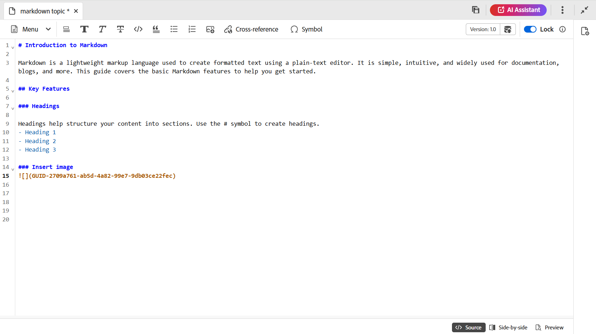
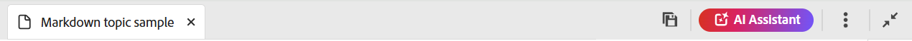
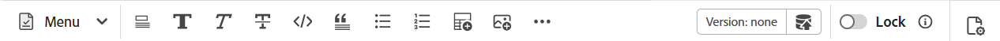
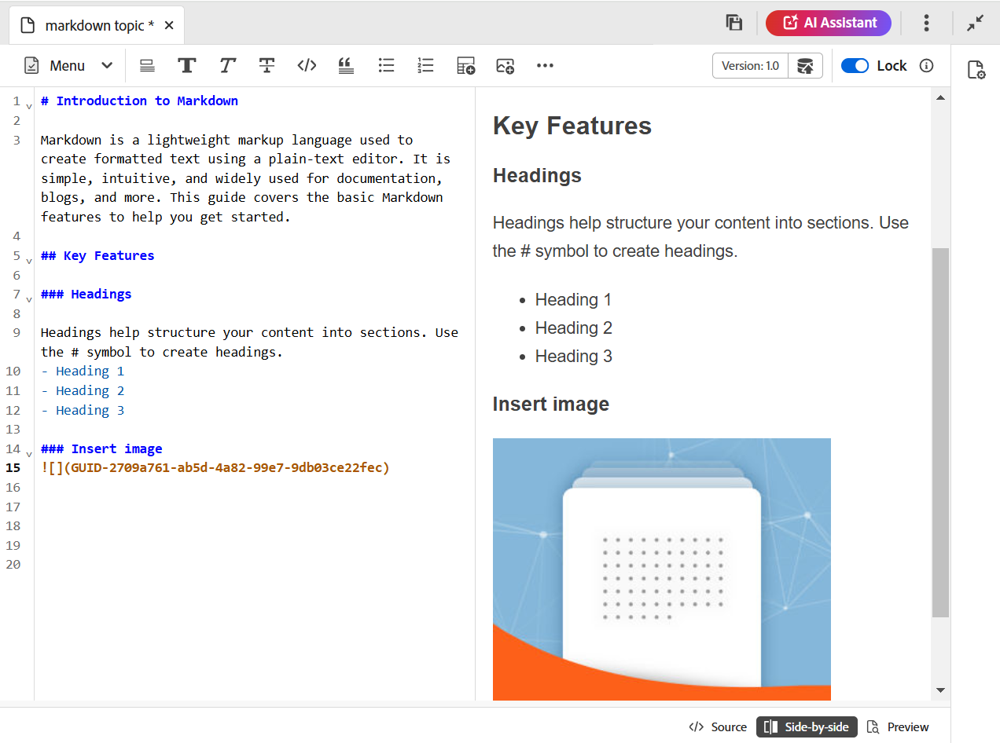

# エディターからMarkdown ドキュメントを作成する {#id223MIE0B079}

Markdownは、プレーンテキストドキュメントに書式要素を追加するのに役立つ、軽量なマークアップ言語です。 Adobe Experience Manager Guidesには、エディターからMarkdown \（.md\）トピックを作成、作成、プレビューする機能が用意されています。 既存のMarkdown ドキュメントをアップロードして、エディターで編集することもできます。

## Markdown トピックの作成

エディターからMarkdown トピックを作成するには、次の手順を実行します。

1. リポジトリーパネルで「」を選択し、ドロップダウンから「**トピック**」を選択します。
1. **新しいトピック** ダイアログボックスで、次の詳細を入力します。

   {width="300"}

   * **タイトル**：トピックのタイトルを指定します。
   * **名前**: トピック タイトルに基づいてファイル名が自動的に提案されます。 管理者がUUID設定に基づいて自動ファイル名を有効にしている場合、「名前」フィールドは表示されません。
   * **テンプレート**: ドロップダウンリストから&#x200B;**Markdown**&#x200B;を選択します。 テンプレート **トピック**&#x200B;はデフォルトで選択されています。
   * **パス**: トピックファイルを保存するパスを参照します。 デフォルトでは、リポジトリで現在選択されているフォルダーのパスが「パス」フィールドに表示されます。

   >[!NOTE]
   >
   > アップグレードの場合は、使用中の現在のフォルダープロファイルにMarkdown テンプレートを追加する必要があります。 エディター[&#128279;](./web-editor-features.md#templates)から新しいマークダウン テンプレートを作成するか、既存のテンプレートをマークダウン オーサリングに使用できます。 Experience Manager Guidesでオーサリングテンプレートを追加する方法について詳しくは、[&#x200B; グローバルレベルまたはフォルダーレベルのプロファイルの設定](../cs-install-guide/conf-folder-level.md)を参照してください。

1. 「**作成**」を選択します。

   選択したパスにMarkdown トピックが作成され、編集用に開かれます。

   {width="650"}

>[!NOTE]
>
> リポジトリパネル内で、フォルダーのマークダウントピックを作成することもできます。 マークダウン トピックを作成するフォルダーを選択し、**新規**&#x200B;を選択してから、オプション メニューから&#x200B;**トピック**&#x200B;を選択します。 **トピックを作成** ダイアログボックスでトピックの詳細を指定して、マークダウン トピックを作成できるようになりました。

## Markdown トピックのエディター機能について

この節では、Markdown トピックのオーサリング用エディターで使用できるさまざまな機能について説明します。 オーサリングインターフェイスは、次のセクションまたは領域に分かれています。

* [ツールバー](#toolbar)
* [コンテンツ編集エリア](#content-editing-area)
* [Source、並べ替え、プレビューモード](#source-side-by-side-and-preview-modes)
* [右側のパネル](#right-panel)

<!--
### Tab bar 

The tab bar features the file tabs of the topics or maps that are currently opened in the Editor along with other file-level options. 

Features available in the tab bar are explained as follows:

 {width="550"}

* **Topic tab**: Displays the currently opened topics in a tab. By default, you can view the file titles in the tab. As you hover over a file, you can view the file title and the file path as a tooltip.

    >[!NOTE]
    >
    > As an administrator, you can also choose to view the list of files by filenames in the tabs. View [User preferences](./intro-home-page.md#user-preferences) for details.
* **Save all**: Saves the changes you have made in all opened topics. If you have multiple topics opened in the Editor, selecting **Save all** or pressing `Crtl+S` shortcut keys saves all documents in one click. You do not have to individually save each document.
* **AI Assistant**: [AI-powered Smart Help](./ai-based-smart-help.md) feature that helps you find relevant content from the Adobe Experience Manager Guides Documentation.
* **More actions**: Allows you to navigate to the **Assets UI**. As an administrator, you also get an option to navigate to the **Settings** page. Learn how to work with [settings](./web-editor-features.md#main-toolbar) or editor settings. 
* **Expand view**: Allows you to expand the page view using the **Expand** icon. In this view, the header bar is hidden, maximizing the content space. To return to the standard view, use the **Exit the expanded view** icon.

-->

### ツールバー

ツールバーはタブバーのすぐ下にあります。 ツールバーで使用できる機能は、次のように説明されます。

| 機能 | 説明 |
|----------------|----------------|
| アクションの編集 | **カット** 、**取り消し** 、**やり直し** 、**コピー** 、**削除** 、**検索と置換** など、様々なドキュメント編集機能にアクセスできます。 使用可能なオプションには、**メニュー** ドロップダウンからアクセスできます。 |
| テキストの書式設定オプション | **見出し** 、**太字** 、**斜体** 、**取り消し線** 、**コード** 、**引用ブロック** など、様々なテキスト書式設定オプションにアクセスできます。 |
| コンテンツ挿入オプション | **番号付きリスト** 、**番号付きリスト** 、**表** 、**画像** 、**相互参照** および&#x200B;**シンボル** を文書に挿入するオプションを提供します。   **メモ**：画像やその他のファイルをMarkdown エディターにドラッグ&amp;ドロップすることもできます。 ファイルは相互参照リンクとして追加され、画像は標準の画像要素として表示されます。 |
| バージョン履歴 | マークダウンファイルのバージョンを作成し、変更履歴を表示できます。 異なるバージョンを比較し、必要に応じて以前のバージョンに戻すことができます。 バージョン履歴オプションは、**メニュー** ドロップダウンにあります。 |
| 新しいバージョンとして保存 | トピックで行われた変更を保存し、トピックの新しいバージョンを作成します。 新しく作成したトピックに取り組んでいる場合、バージョン情報は「なし」と表示されます。 |
| ロック/ロック解除 | 現在のファイルをロックまたはロック解除します。 ファイルをロックすると、ファイルへの排他的な書き込みアクセス権が付与されます。 これにより、他のユーザーによるファイルの編集が制限されます。 他のユーザーに編集アクセス権を付与する場合は、ファイルのロックを解除します。 管理者は、他のユーザーがロックしたファイルのロックを解除できる&#x200B;**強制ロック解除**&#x200B;機能にもアクセスできます。 |

>[!NOTE]
>
> **バージョン履歴**&#x200B;機能と、編集操作、テキスト書式設定、コンテンツ挿入に記載されている機能は、マークダウン トピックの&#x200B;**Source**&#x200B;と&#x200B;**並べて**&#x200B;表示の両方からアクセスできます。

### コンテンツ編集エリア

コンテンツ編集領域には、トピックのMarkdown ソースが表示され、すべてのコンテンツを編集できます。 横に並べて表示すると、この領域は左側のMarkdown ソースビューと右側のプレビューの2つのセクションに分割されます。 複数のトピックを同時に開くことができ、それぞれのタブに表示されます。

### Source、並べ替え、プレビューモード

Markdown オーサリングの場合、エディターは、コンテンツの作成と書式設定を支援する3つの異なる表示モードをサポートしています。

* ソース
* 並べて表示
* プレビュー

**ソース**

これはエディターのマークダウンコードビューです。 通常のマークダウンエディターと同様に、マークダウンのトピックを編集できます。 Source ビューには、文書のリビジョンの保存、見出しの挿入、表の挿入、画像の挿入などのオプションがあります。

このビューは、レンダリングされた出力を表示せずに生のマークダウンの書き込みと編集のみに焦点を当てる場合に使用します。

**並べて**

このモードでは、エディターを2つのパネルに分割します。

* 編集中のマークダウントピックを表示するSource パネル。
* Markdown トピックのレンダリング出力をリアルタイムで表示するプレビューパネル。

{width="550"}

このビューは、マークダウンのトピックを編集する際に、レンダリングされた出力をリアルタイムで表示する場合に使用します。

**プレビュー**

プレビューモードでマークダウントピックを開くと、ユーザーがブラウザーでトピックを表示したときに、そのトピックがどのように表示されるかを示します。 このビューでは、すべての編集機能がツールバーから削除されます。 ただし、ツールバーの&#x200B;**新しいバージョンとして保存**、**ロック/ロック解除**&#x200B;機能、右側のパネルの&#x200B;**ファイルプロパティ**&#x200B;機能には、引き続きアクセスできます。

### 右側のパネル

右側のパネルでは、**ファイルプロパティパネルにアクセスできます。

ファイルのプロパティには、次の2つのセクションがあります。

**一般**

「一般」セクションでは、次の機能にアクセスできます。

* **ファイル名**：選択したトピックのファイル名を表示します。
* **ID**：選択したトピックのIDを表示します。
* **言語**: トピックの言語を表示します。 プロパティページの「言語」フィールドから設定します。
* **作成日**: トピックが作成された日時を表示します。
* **変更日**: トピックが変更された日時を表示します。
* **によってロックされています**: トピックをチェックアウトしたユーザーを表示します。
* **ドキュメントの状態**：現在開いているトピックのドキュメントの状態を選択して更新できます。 詳細については、[&#x200B; ドキュメントの状態](./web-editor-document-states.md)を参照してください。
* **タグ**：トピックのメタデータタグです。 これらは、プロパティページの「タグ」フィールドから設定します。 ドロップダウンから入力または選択できます。 タグはドロップダウンの下に表示されます。 タグを削除するには、タグの横にある十字アイコンを選択します。
* **他のプロパティを編集**: ファイルのプロパティ ページから、他のプロパティを編集できます。

**参照**

「参照」セクションでは、次の機能にアクセスできます。

* **で使用**：現在のファイルが参照または使用されているドキュメントは、「参照で使用」リストに表示されます。
* **送信リンク**：送信リンクには、現在のドキュメントで参照されているドキュメントが一覧表示されます。

>[!NOTE]
>
> すべての使用済みリンクと送信リンクの参照は、文書にハイパーリンクされています。 リンクされたドキュメントを簡単に開いて編集できます。

## 機能の制限

以下のExperience Manager Guides機能は、現在、Markdown オーサリングには適用されません。

1. レビュー
2. 結合
3. AI アシスタント
4. 変更をトラック

**親トピック：**&#x200B;[&#x200B; エディターの概要](web-editor.md)
