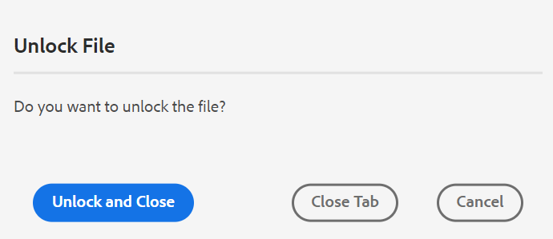
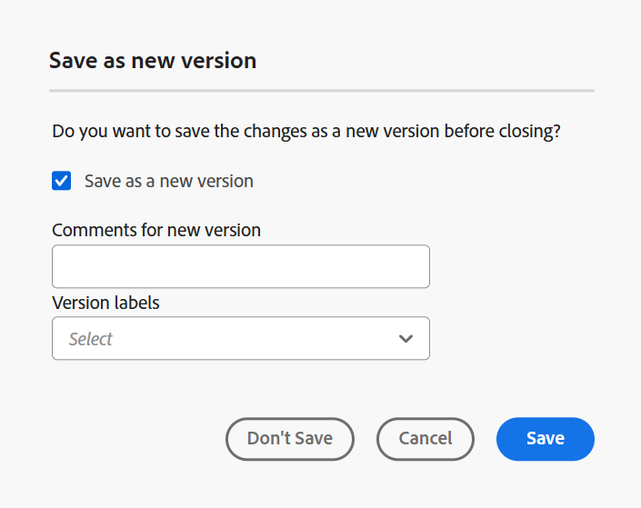
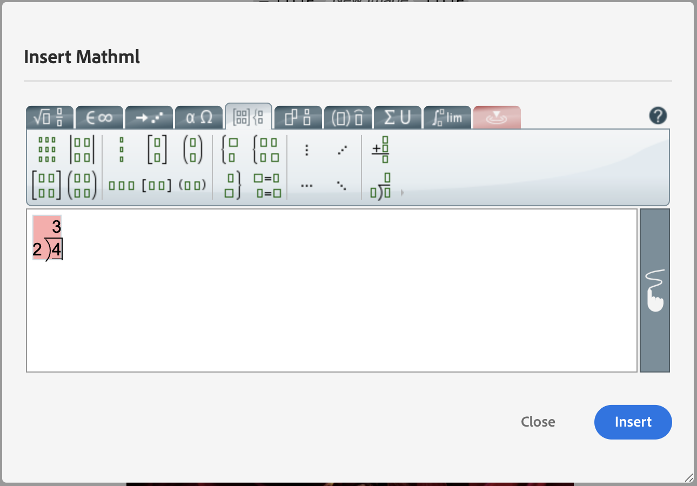

# Web エディターのその他の機能 {#id2056B0B0YPF}

Web エディターには、次のような便利な機能があります。

**ファイルのタブのコンテキストメニュー機能**

Web エディターでファイルを開くと、コンテキストメニューから様々なアクションを実行できます。 メディアファイル、単一 DITA ファイル、または複数のファイルを開くかどうかによって、異なるオプションが表示される場合があります。

**メディアファイル**

開かれたメディアファイルのタブのコンテキストメニューには、次の関数があります。

{width="300" align="left"}

**単一 DITA ファイル**

開いているファイルのタブのコンテキストメニューには、次の関数が表示されます。

:   {width="300" align="left"}

**複数のファイル**

複数のファイルを開くと、コンテキストメニューに次の追加オプションが表示されます。

{width="550" align="left"}

コンテキストメニューの様々なオプションについては、以下で説明します。

***保存***：次のいずれかのオプションを選択できます。

- **保存**：新しいバージョンを作成せずにファイルを保存するには、次を選択します **保存**. 新しいトピックを作成するたびに、トピックのバージョンレスの作業コピーが DAM に作成されます。 ドキュメントを保存すると、DAM 内のドキュメントの作業コピーが更新されます。 このバージョンで単純な保存を行っても、トピックの新しいバージョンは作成されません。 トピックがレビュー中の場合、トピックを保存しても、レビュー担当者は変更されたトピックのコンテンツにアクセスできません。

- **すべて保存**：複数のドキュメントを web エディターで開いている場合は、以下を行うオプションも表示されます **すべて保存** ドキュメントを開きました。

***新しいバージョンとして保存***

ファイルの新しいバージョンを作成するには、次を選択します **新しいバージョンとして保存**. について詳しくは、 **保存** および **新しいバージョンとして保存**&#x200B;を参照してください [Web エディターの機能の理解](web-editor-features.md#).

***コピー***：次のいずれかのオプションを選択できます。

- **UUID をコピー**：現在アクティブなファイルの UUID をクリップボードにコピーするには、次を選択します **コピー\> UUID をコピー**.
- **パスをコピー**：現在アクティブなファイルの完全パスをクリップボードにコピーするには、次を選択します **コピー\> パスをコピー**.

***次の場所を見つけます。***：次のいずれかのオプションを選択できます。

- **マップ**：大きな DITA マップを開き、マップ内のファイルの正確な場所を見つける場合は、を選択します。 **\> マップ内を検索**. 「マップ内で検索」オプションを選択すると、ファイル\（オプションの呼び出し元\）がマップ階層内で見つかり、ハイライト表示されます。 この機能を使用するには、マップ ファイルを Web エディタで開く必要があります。 マップ ビューが非表示の場合、この機能を呼び出すとマップ ビューが表示され、マップ階層でファイルがハイライト表示されます。

- **リポジトリ**：マップ内の検索と同様、 **\> リポジトリ内を見つけます。** リポジトリ \（または DAM\）内のファイルの場所を表示します。 リポジトリビューが開き、選択したファイルがリポジトリでハイライト表示されます。 ファイルがフォルダー内にある場合は、そのフォルダーが展開され、選択したファイルのリポジトリ内の場所が表示されます。

***追加先***：次のいずれかのオプションを選択できます。

- **お気に入り**：選択したファイルをお気に入りのコレクションに追加するには、次を選択します **\> お気に入りに追加**. 詳しくは、 **お気に入り** での機能の説明 [左パネル](web-editor-features.md#id2051EA0M0HS) セクション。

- **再利用可能なコンテンツ**：選択したファイルを再利用可能なコンテンツリストにコピーするには、を選択します **\> 再利用可能なコンテンツに追加**. 詳しくは、 **再利用可能なコンテンツ** での機能の説明 [左パネル](web-editor-features.md#id2051EA0M0HS) セクション。

***プロパティ***

選択したファイルのAEMのプロパティページを表示するには、以下を選択します。 **プロパティ**.

***分割***：次のいずれかのオプションを選択できます。

**上、下、左または右**

デフォルトでは、Web エディターでは一度に 1 つのトピックを表示できます。 同時に 2 つ以上のトピックを表示したい場合があります。 エディターの画面を分割すると、複数のトピックを同時に表示できます。 例えば、A と B という 2 つのトピックをエディターで開いているとします。 トピック B を右クリックし、 **\> を分割する** エディターウィンドウを 2 つの部分に分割します。 上半分にトピック B、下半分にトピック A が表示されます。 同様に、を選択して画面を水平に分割することもできます。 **分割\> 左** または **分割\> 右**. 次の Web エディタのスクリーンショットは、水平方向および垂直方向に分割されたトピックを示しています。 分割ごとに、異なるビューを設定できます。 例えば、次のスクリーンショットでは、画面 1 がソースビューモード、画面 2 に 2 つのドキュメントがオーサーモード、画面 3 がプレビューモードになっています。 ファイル タブをドラッグして、配置する画面にドロップすることで、ある画面から別の画面にドキュメントを移動できます。 同様に、ファイルタブをドラッグして、好みに応じて移動することで、ファイルタブを並べ替えることもできます。

{width="800" align="left"}

***クイック生成***

選択したファイルの出力を生成します。 出力は、出力プリセットの一部であるファイルに対してのみ生成できます。 詳しくは、 [Web エディターからの記事ベースの公開](web-editor-article-publishing.md#id218CK0U019I).

***閉じる***：次のいずれかのオプションを選択できます。

**閉じる**, **他を閉じる**、または **すべて閉じる**

コンテキストメニューを呼び出したファイルを閉じる場合は、 **閉じる\> 閉じる**. 使用方法 **閉じる\> その他を閉じる** 現在アクティブなファイルを除く、開いている他のすべてのファイルを閉じるには 開いているすべてのファイルを閉じるには、 **閉じる\> すべて閉じる** コンテキストメニューの「」オプションを選択するか、Web エディターを閉じることもできます。 セッションに未保存のファイルがある場合は、それらのファイルを保存するように求められます。

**ファイルを閉じてシナリオを保存する**

Web エディタで開いたファイルを閉じようとすると、 **閉じる** ファイルのタブまたは **閉じる** 「オプション」メニューの「AEM Guides」では、編集内容を保存し、ロックされているファイルのロックを解除するように求められます。

プロンプトは、管理者が選択した次の設定に基づいています。

- **閉じるときにチェックインを要求：** エディタを閉じるときに、ファイル \（チェックアウトした\）をチェックインするオプションが表示されます。
- **閉じるときに新しいバージョンを要求**：エディターを閉じると、ファイル\（編集済み\）を新しいバージョンとして保存するオプションが表示されます。

ファイルを保存する方法は、次の 3 つのシナリオによって異なります。ここでは、次のシナリオを使用します。

- コンテンツには変更を加えていません。
- コンテンツを編集して変更を保存しました。
- コンテンツを編集しましたが、変更は保存されませんでした。

ファイルがロック/ロック解除されているかどうか、および保存された変更と保存されていない変更があるかどうかによって、次のオプションが表示される場合があります。

- **ロック解除して閉じる**：ファイルのロックが解除され、ファイルが閉じられます。

  {width="400" align="left"}

- **新しいバージョンとして保存**：これにより、コンテンツに加えた変更が保存され、ファイルの新しいバージョンが作成されます。 新しく保存したバージョンのラベルとコメントを追加することもできます。 新しいバージョンの保存の詳細については、を参照してください。 [新しいバージョンとして保存](web-editor-features.md#save-as-new-version-id209ME400GXA).

- **ファイルのロックを解除**：ファイルのロックを解除すると、ファイルのロックが解除され、変更内容が現在のバージョンのファイルに保存されます。

  >[!NOTE]
  >
  > このオプションの選択を解除してファイルをロック解除すると、変更を保存せずにファイルを閉じるオプションも表示されます。

  例えば、いずれかのプロンプトが次のスクリーンショットに表示されます。

  {width="400" align="left"}

**壊れた参照の視覚的なキュー**

- トピックに壊れた相互参照またはコンテンツ参照が含まれている場合は、赤いテキストで表示されます。

**スマートコピー&amp;ペースト**

- トピック内やトピック間でコンテンツを簡単にコピー&amp;ペーストできます。 ソース要素の構造は、宛先で維持されます。 また、コピーされたコンテンツにコンテンツ参照が含まれている場合は、その参照もコピーされます。

**最後に参照した場所を記憶する**

- Web エディターには、スマートファイル参照ダイアログが用意されています。 エディターは、参照またはコンテンツの挿入時に、最後に使用した場所を記憶します。 ファイルの参照ダイアログ \（「参照を挿入」または「コンテンツを挿入/再利用」（Insert Reuse Content）\）を初めて呼び出すと、現在のドキュメントが保存されている場所に移動します。 同じセッションで、別の参照を挿入しようとすると、ファイルの参照ダイアログが、最後に参照を挿入した場所に自動的に移動します。

>[!NOTE]
>
> 画像、オーディオまたはビデオファイルの場合、ファイルを参照するダイアログでは、最後に使用した場所ではなくファイルの場所がデフォルトで使用されます。

**記事ベースの公開のサポート**

- Web エディタから、1 つ以上のトピックまたは DITA マップ全体の出力を生成できます。 DITA マップの出力プリセットを作成し、1 つ以上のトピックの出力を簡単に生成できるようにする必要があります。 マップ内のいくつかのトピックを更新した場合は、Web エディタからそれらのトピックの出力のみを生成することもできます。 詳しくは、 [Web エディターからの記事ベースの公開](web-editor-article-publishing.md#id218CK0U019I).

**Markdown ドキュメントのサポート**

- Web エディタでは、DITA 文書とともに Markdown 文書\（.md\）を使用できます。 Web エディタで Markdown 文書を簡単に作成およびプレビューでき、DITA マップエディタを使用してマップファイルに追加することもできます。 詳しくは、 [Web エディターからの Markdown ドキュメントの作成](web-editor-markdown-topic.md#).

**DITA 用語集の用語トピックのサポート**

- Web エディタは、を追加して挿入できる DITA 用語集の用語をサポートしています `term` または `abbreviated-form` 要素。

**数式 ML の挿入**

- Experience Managerガイドには、と統合して MathML 数式を挿入する機能が標準でサポートされています [MathType Web](https://docs.wiris.com/en/mathtype/mathtype_web/intro) アプリケーション。 MathML 式を挿入するには、 **要素を挿入** アイコンで mathml と入力します。 リストから数字要素を選択すると、 **MathML の挿入** ダイアログが表示されます。

{width="550" align="left"}

MathML 数式ツールを使用して、数式を作成し、 **挿入** をクリックしてドキュメントに追加します。 次のように、数式が明るいグレーの背景で挿入されます。

{width="400" align="left"}

既存の計算式を右クリックして選択することで、いつでも計算式を更新できます **MathML の編集** コンテキストメニューから。

- **MathML エディタでの数式の検証**

  Experience Manager ガイドは、MathML の数式を含むトピックを保存するときに数式を検証します。
MathML エディタを使用して数式を挿入すると、構文に問題がある場合、Experience Manager ガイドで数式が赤で強調表示されます。 挿入する前に訂正できます。 変更せずに次を選択する場合： **挿入**&#x200B;を選択すると、警告が表示されます。

  {width="400" align="left"}

  構文エラーを含む MathML 数式を挿入した場合、トピックを保存しようとすると検証エラーが発生します。

**脚注の挿入**

- を使用して、コンテンツに脚注を挿入します。 `fn` 要素。 オーサリングモードでは、脚注の値がコンテンツとインラインで表示されます。 ただし、プレビューモードに切り替えたり、ドキュメントを公開したりすると、脚注がトピックの最後に表示されます。

**要素の名前変更または置換**

- Web エディターでは、トピックの上部に要素のパンくずリストが表示されます。 要素を別の要素と入れ替える場合は、パンくずリストのコンテキストメニューから行うことができます。 例えば、 `p` 要素 `note` または、コンテキストの他の有効な要素。

{width="400" align="left"}

パンくずリストで、置き換える要素の名前を右クリックし、コンテキストメニューの「要素名の変更」を選択します。 [ 要素名を変更 ] ダイアログには、現在の位置で許可されている有効な要素がすべて表示されます。 要素名を変更ダイアログから、使用する要素を選択します。 元の要素が新しい要素に置き換えられます。

パンくずリストのコンテキストメニューに加えて、他の場所から「要素名を変更」ダイアログにアクセスすることもできます。

- パンくずリストの要素名をクリックして要素のコンテンツを選択し、選択したコンテンツを右クリックしてコンテキストメニューを表示します。

- タグビューを有効にし、任意の要素の開始タグをクリックしてから、選択したコンテンツを右クリックしてコンテキストメニューを表示します。

- 「要素名の変更」ダイアログにアクセスするには、「アウトライン」パネルで要素のオプションメニューを呼び出します。

**要素をラップ**

- 要素を折り返すと、選択したテキストに要素タグを追加できます。 DITA 標準に従って、テキストを任意の子要素にラップできます。 例えば、の下にテキストがあるとします。 `note` で囲まれた後で、テキストを `p` 要素。

  この **ラップ要素** オプションは、トピックのパンくずリストのコンテキストメニューで使用できます。 要素をラッピングするには、要素を右クリックしてコンテキストメニューを開きます。 から要素を選択 **ラップ要素** ダイアログ。 新しい要素にテキストが表示されます。

  また、コンテンツ内のテキストまたは要素を選択してから、 **ラップ要素**  コンテキストメニューの「」オプション。

**要素の展開**

- 要素を展開すると、選択したテキストから要素タグを削除し、その親要素と結合できます。 例えば、 `p` 要素内の `note` 要素。を展開できます `p` 内でテキストを直接結合する要素 `note` 要素。 この **要素を展開** オプションは、トピックのパンくずリストのコンテキストメニューで使用できます。 要素を展開するには、要素を右クリックしてコンテキストメニューを開き、最後に「」を選択します。 **要素を展開** をクリックして要素を削除し、要素のテキストをその親要素と結合します。

**DITA エレメントの空白処理**

- XML では、空白にはスペース、タブ、改行、空白行が含まれます。 Experience Managerガイドは、結果として生じる複数の空白を 1 つのスペースに変換します。 これにより、web エディターの WYSIWYG 表示を保持できます。

  >[!NOTE]
  >
  >DITA 規則に従って空白を保持する必要があるエレメントでは、結果として複数の空白が保持されます。 例： `<pre>` および `<codeblock>` 要素。

**改行とインデントの保持**

- 改行とスペースを含む DITA エレメントは、オーサーモード、ソースモード、プレビューモード、および最終的な公開出力で、定義に従ってサポートおよびレンダリングされます。 次のスクリーンショットは、内のコンテンツを示しています `msgblock` 改行とスペース \（indentation\）が保持されている要素：

{width="500" align="left"}

**Web エディターでの非改行スペースの処理**

- ドキュメントに改行なしのスペースを挿入するには、 **特殊文字の挿入**   アイコンまたは **代替** + **スペース** ショートカットキー。  これらの改行なしスペースは、Web エディタでトピックを編集する際にインジケータとして表示されます。 非改行スペースの表示をオフにするには、 **オーサーモードで改行なしスペースインジケーターを表示** からのオプション **外観** タブ **ユーザー環境設定** ..

- 外部ソースから改行されないスペースを含むコンテンツをにコピー&amp;ペーストする場合 **作成者** 表示すると、改行されていないスペースはスペースに変換されます。
ただし、改行なしのスペースを含むコンテンツをからコピーして貼り付ける場合は、 **作成者** 表示、保存されています。

**自動生成要素 ID**

- DITA トピック内のエレメントの ID を自動的に生成できます。 これらの ID は、DITA トピック内で一意です。 例えば、段落要素の ID を生成した場合、ID は p\_1、p2、p\_3 などになります。 複数の要素を選択し、選択した要素ごとに ID を生成できます。

次の手順を実行して、1 つ以上の要素の ID を自動的に生成します。

1. Web エディターでトピックを開きます。
1. ID を割り当てるコンテンツを選択します。
1. 右クリックして選択 **コンテキストメニューから ID を生成。**

   または、パンくずリストを右クリックして次を選択します。 **ID を生成**.

**親トピック：**[ Web エディターの操作](web-editor.md)
