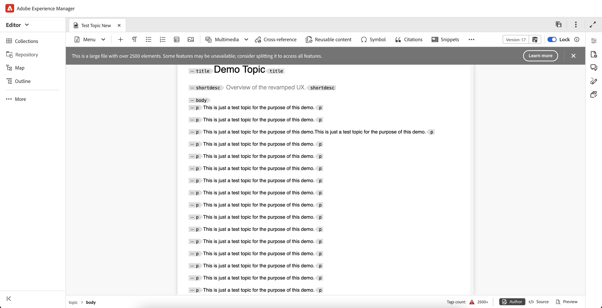

# エディターのその他の機能 {#id2056B0B0YPF}

エディターには、次のような便利な機能があります。

## ファイルのタブのコンテキストメニュー機能

エディターでファイルを開くと、コンテキストメニューから様々なアクションを実行できます。 メディアファイル、単一 DITA ファイル、または複数のファイルのどちらを開くかによって、異なるオプションが表示される場合があります。

**メディアファイル**

開かれたメディアファイルのタブのコンテキストメニューには、次の関数があります。

{width="300" align="left"}

**単一 DITA ファイル**

開いているファイルのタブのコンテキストメニューには、次の関数が表示されます。

{width="400" align="left"}

**複数のファイル**

複数のファイルを開くと、コンテキストメニューに次の追加オプションが表示されます。

{width="550" align="left"}

コンテキストメニューの様々なオプションについては、以下で説明します。

***保存***：次のオプションから選択できます。

- **保存**：新しいバージョンを作成せずにファイルを保存するには、「**保存**」を選択します。 新しいトピックを作成するたびに、トピックのバージョンレスの作業コピーが DAM に作成されます。 ドキュメントを保存すると、DAM 内のドキュメントの作業コピーが更新されます。 このバージョンで単純な保存を行っても、トピックの新しいバージョンは作成されません。 トピックがレビュー中の場合、トピックを保存しても、レビュー担当者は変更されたトピックのコンテンツにアクセスできません。

- **すべて保存**：エディターで複数のドキュメントが開いている場合は、開いているドキュメントを **すべて保存** するオプションも表示されます。

***新しいバージョンとして保存***

ファイルの新しいバージョンを作成するには、[**新しいバージョンとして保存**] を選択します。 **保存** および **新規バージョンとして保存** について詳しくは、[ エディターのツールバー ](web-editor-toolbar.md) を参照してください。

***コピー***：次のオプションから選択できます。

- **UUID をコピー**：現在アクティブなファイルの UUID をクリップボードにコピーするには、「**コピー\> UUID をコピー**」を選択します。
- **パスをコピー**：現在アクティブなファイルの完全パスをクリップボードにコピーするには、「**コピー\> パスをコピー**」を選択します。

***検索場所***：次のオプションから選択できます。

- **Map**：大きな DITA マップを開き、マップ内のファイルの正確な位置を見つける場合は、「**Locate In \> Map**」を選択します。 「マップ内で検索」オプションを選択すると、ファイル\（オプションの呼び出し元\）がマップ階層内で見つかり、ハイライト表示されます。 この機能を使用するには、エディタでマップ ファイルを開く必要があります。 マップ ビューが非表示の場合、この機能を呼び出すとマップ ビューが表示され、マップ階層でファイルがハイライト表示されます。

- **エクスプローラー**: 「マップ内を検索」と同様に、「**エクスプローラー内を検索**」にはエクスプローラー\（または DAM\）内のファイルの場所が表示されます。 エクスプローラービューが開き、選択したファイルがエクスプローラーでハイライト表示されます。 ファイルがフォルダー内にある場合は、そのフォルダーが展開され、選択したファイルのエクスプローラー内の場所が表示されます。

  >[!NOTE]
  >
  >2025.11.0 リリースから、**リポジトリ** の名前は **エクスプローラー** に変更されます。 オンプレミス設定の場合、Experience Manager Guidesの 5.1 リリースまで、リポジトリとして引き続き使用できます。

***追加先***：次のオプションから選択できます。

- **コレクション**：選択したファイルをコレクションに追加するには、「**コレクションに追加\>**」を選択します。 詳しくは、「左パネル **セクションの** コレクション [ 機能の説明を参照し ](web-editor-left-panel.md) ください。

- **再利用可能なコンテンツ**：選択したファイルを再利用可能なコンテンツリストにコピーするには、**追加\> 再利用可能なコンテンツ** を選択します。 詳しくは、「左パネル **セクションの「** 再利用可能なコンテンツ [ 機能の説明を参照し ](web-editor-left-panel.md) ください。

***プロパティ***

選択したファイルのAEMのプロパティページを表示するには、「**プロパティ**」を選択します。

***分割***：次のオプションから選択できます。

**上、下、左、右**

デフォルトでは、エディターでは一度に 1 つのトピックを表示できます。 同時に 2 つ以上のトピックを表示したい場合があります。 エディターの画面を分割すると、複数のトピックを同時に表示できます。 例えば、A と B という 2 つのトピックをエディターで開いているとします。 トピック B を右クリックして **分割\> 上へ** を選択すると、エディターウィンドウが 2 つの部分に分割されます。 上半分にトピック B、下半分にトピック A が表示されます。 同様に、「**分割\> 左」または「** 分割\> 右 **」を選択して** 画面を水平に分割することもできます。 ファイル タブをドラッグして、配置する画面にドロップすることで、ある画面から別の画面にドキュメントを移動できます。 同様に、ファイルタブをドラッグして、好みに応じて移動することで、ファイルタブを並べ替えることもできます。

<!--------------------------------------------

***Quick Generate***

Generate the output for the selected file. Output can be generated only for files that are a part of an output preset. For more details, view [Article-based publishing from the Web Editor](web-editor-article-publishing.md#id218CK0U019I).

--->

***閉じる***：次のオプションから選択できます。

**閉じる**、**他を閉じる**、または **すべて閉じる**

コンテキストメニューを呼び出したファイルを閉じるには、「**閉じる\> 閉じる**」を選択します。 現在アクティブなファイルを除いて、開いている他のすべてのファイルを閉じるには、[**閉じる\> その他を閉じる**] を使用します。 開いているすべてのファイルを閉じるには、コンテキストメニューから「**閉じる\> すべて閉じる**」オプションを選択するか、エディターを閉じるように選択することもできます。 セッションに未保存のファイルがある場合は、それらのファイルを保存するように求められます。

**ファイルを閉じてシナリオを保存する**

エディターで開いたファイルを、ファイルのタブにある **閉じる** ボタンまたはオプションメニューの **閉じる** オプションを使用して閉じようとすると、Experience Manager Guidesで編集内容を保存し、ロックされているファイルのロックを解除するように求めるプロンプトが表示されます。

プロンプトは、管理者が選択した次の設定に基づいています。

- **閉じるときにロック解除を要求：** エディターを閉じるときに、ファイル \（ロックした\）をロック解除するオプションが表示されます。
- **閉じるときに新しいバージョンを要求**：エディターを閉じるときに、ファイル \（編集済み\）を新しいバージョンとして保存するオプションが表示されます。

ファイルを保存する方法は、次の 3 つのシナリオによって異なります。ここでは、次のシナリオを使用します。

- コンテンツには変更を加えていません。
- コンテンツを編集して変更を保存しました。
- コンテンツを編集しましたが、変更は保存されませんでした。

ファイルがロック/ロック解除されているかどうか、および変更を保存したか保存していないかによって、次のオプションが表示されます。

- **ロック解除と閉じる**：ファイルのロックが解除され、ファイルが閉じられます。
- **新しいバージョンとして保存**：コンテンツに加えた変更が保存され、ファイルの新しいバージョンが作成されます。 新しく保存したバージョンのラベルとコメントを追加することもできます。 新しいバージョンの保存の詳細については、「[ 新しいバージョンとして保存 ](web-editor-toolbar.md#version-information-and-save-as-new-version)」を参照してください。

- **ファイルのロックを解除**：ファイルのロックを解除すると、ファイルのロックが解除され、変更内容が現在のバージョンのファイルに保存されます。

  >[!NOTE]
  >
  > このオプションの選択を解除してファイルをロック解除すると、変更を保存せずにファイルを閉じるオプションも表示されます。

  例えば、いずれかのプロンプトが次のスクリーンショットに表示されます。

  {width="400" align="left"}

**壊れた参照の視覚的な手がかり**

トピックに壊れた相互参照またはコンテンツ参照が含まれている場合は、赤いテキストで表示されます。

**スマートコピーと貼り付け**

トピック内やトピック間でコンテンツを簡単にコピー&amp;ペーストできます。 ソース要素の構造は、宛先で維持されます。 また、コピーされたコンテンツにコンテンツ参照が含まれている場合は、その参照もコピーされます。

**最後に参照した場所を記憶する**

エディターには、スマートファイル参照ダイアログが表示されます。 エディターは、参照またはコンテンツの挿入時に、最後に使用した場所を記憶します。 ファイルの参照ダイアログ \（「参照を挿入」または「コンテンツを挿入/再利用」（Insert Reuse Content）\）を初めて呼び出すと、現在のドキュメントが保存されている場所に移動します。 同じセッションで、別の参照を挿入しようとすると、ファイルの参照ダイアログが、最後に参照を挿入した場所に自動的に移動します。

>[!NOTE]
>
> 画像、オーディオまたはビデオファイルの場合、ファイルを参照するダイアログでは、最後に使用した場所ではなくファイルの場所がデフォルトで使用されます。

## Experience Manager Guidesでファイルとフォルダーを参照する

Experience Manager Guidesには、コンテンツリポジトリ内のファイルやフォルダーを効率的に参照して選択するのに役立つ直感的なダイアログ **ファイルを選択** と **パスを選択** が用意されています。

>[!NOTE]
>
> 2601 リリースのExperience Manager Guides as a Cloud Serviceでは、ファイルパスブラウザーとフォルダーパスブラウザーの UI が刷新されました。 新しいインターフェイスは、デフォルトで有効になっています。 これらの更新を行わずに既存の UI を引き続き使用する場合は、カスタマーサクセスチームに連絡して、この新しい機能強化を無効にしてもらってください。

### Experience Manager Guides内のファイルの参照

ファイルパスブラウザーを使用すると、コンテンツリポジトリ内の特定のファイルをすばやく見つけて選択できます。 この機能は、マップへのトピックの追加、画像または相互参照のリンク、再利用可能なコンテンツの作成などのタスクで使用できます。

{width="350" align="left"}

ファイルブラウザーを起動すると、「**ファイルを選択** ダイアログが開きます。 このダイアログには、「リポジトリ **と** コレクション **という 2 つのタブが含まれ** います。 デフォルトでは、「リポジトリ」タブが選択されています。

{width="650" align="left"}

**「リポジトリ」タブで使用できるファイル参照用の機能**

**ファイルおよびフォルダーの表形式表示**

「リポジトリー」タブには、コンテンツリポジトリー内のファイルとフォルダーが表形式で表示されるので、正しいファイルパスを見つけやすくなります。 上部のパンくずリストと左側のフォルダーナビゲーションパネルを使用して、フォルダー間を移動することもできます。

{width="650" align="left"}

**1 つまたは複数のファイルを選択**

ファイルを使用するには、ファイルを選択し、「**選択**」をクリックします。

{width="650" align="left"}

場合によっては、このパスブラウザーダイアログから複数のファイルを選択することもできます。 例えば、再利用可能なコンテンツを探すためにファイルを参照する場合、複数のファイルを選択して、再利用可能なコンテンツの一部にすることができます。

{width="650" align="left"}

現在、再利用可能なコンテンツ、トピック参照、スキーマトロン、出力プリセット（DITAVAL を使用）、Workfrontに対して、複数のファイルの選択が可能です。

>[!NOTE]
>
> パスブラウザーダイアログからファイルを選択すると、一部のフォルダーが無効に表示される場合があります。 この動作により、有効な選択を確実に行うために、特定のファイルタイプへのアクセスが制限されます。 たとえば、再利用可能なコンテンツを作成するときは、トピック ファイルとマップ ファイルのみを使用する必要があります。 画像などの無効なファイルタイプを使用しないようにするには、対応するファイルが表示されないか、パスブラウザーで選択できないままになります。

**選択したファイルをプレビュー**

次に示すように、「**プレビュー**」ボタンを使用して、選択したファイルをプレビューできます。

{width="650" align="left"}

選択したファイルのプレビューが右側に表示されます。

{width="650" align="left"}

複数選択の場合、選択したすべてのファイルのプレビューがプレビューパネルに表示されるので、確認しやすくなります。

{width="650" align="left"}

また、「**削除** アイコンを使用して、プレビューから一部のファイルの選択を解除することもできます。

{width="650" align="left"}

**エクスペリエンスの検索とフィルタリング**

リポジトリ内のファイルを参照する場合、選択したパス内の名前、タイトル、またはコンテンツでファイルを検索できます。 検索には、任意の 1 つ、2 つ、またはすべて 3 つの条件を使用できます。 どの条件も選択していない場合、結果には 3 つの条件すべてに共通するものが含まれます。

{width="650" align="left"}

**フィルター検索** \（\）アイコンを選択して、右側のフィルターパネルを開きます。

{align="left"}

ファイルをフィルタリングしたり検索を絞り込んだりするには、次のオプションがあります。

- **検索場所**: リポジトリ内に存在するファイルを検索するパスを選択します。

- **ファイルタイプ**：特定のファイルタイプに基づいて検索をフィルタリングします。 使用できるオプションは、**トピック**、**マップ**、**DITAVAL**、**画像**、**マルチメディア**、**ドキュメント**、**その他** です。

  >[!NOTE]
  >
  > 場合によっては、**ファイルタイプ** フィルターは、タスクに基づいて特定のファイルタイプに事前に適用されており、変更できません。 たとえば、画像を参照する場合、フィルタは画像ファイルのみを表示するように設定され、再利用可能なコンテンツを作成する場合は、トピック ファイルとマップ ファイルのみを表示するように設定されます。 ドキュメントの状態、タグ、最終更新日などの他のフィルターを調整して、検索結果を絞り込むこともできます。

- **ドキュメントの状態**：ファイルの現在のドキュメントの状態に基づいて検索をフィルタリングできます。 使用可能なフィルター値は、フ `repositoryFilters` ルダーの「`ui_config.json file`」フィールドで定義され、現在使用中のフォルダープロファイルに関連付けられます。

  つまり、

   - グローバルプロファイルを使用している場合、グローバルプロファイルで設定したフィルター値が適用されます。
   - 特定のフォルダープロファイルを選択すると、そのプロファイルで定義されているフィルター値が取得されます。

  ドキュメントの状態に使用できるデフォルトのフィルター値は、ドラフト、編集、レビュー中、承認済み、レビュー済み、完了です。 ドキュメント状態のフィルター値のカスタマイズについて詳しくは、[ ドキュメント状態フィルターの設定 ](../cs-install-guide/config-doc-state-filters.md) を参照してください。

- **ロック者**：ユーザーのリストを表示します。 リストはページ分割され、非同期で読み込まれ、一度に限られたユーザーセットが表示され、スクロールしたり移動したりすると、さらに多くのユーザーが取得されます。 これにより、特に多数のユーザーを扱う場合に、読み込み速度と全体的なパフォーマンスが向上します。

- **最終変更日**：変更日に基づいてコンテンツをフィルタリングします。 カレンダーから日付範囲を選択するか、次のいずれかの時間枠オプションを選択します。
   - 過去 1 週間
   - 過去 1 か月
   - 過去 1 年間

- **タグ**：タグに基づいてコンテンツをフィルタリングします。

- **DITA エレメント**：様々な DITA エレメントに基づいてコンテンツをフィルタします。

必要なフィルターをすべて適用した後、フィルターパネルの右下隅にある「**適用**」を選択します。

**「コレクション」タブで使用できるファイル参照用の機能**

「**コレクション**」タブには、コレクションで使用できるファイルのキュレートされたビューが表示され、クイックアクセスや再利用が可能になります。 完全なフォルダー階層を表示する「リポジトリ」タブとは異なり、コレクションを使用すると、複数のフォルダーを移動することなく、頻繁に使用するトピック、マップおよび画像を選択できます。

「コレクション」タブで、次の操作を実行できます。

- 上部のパンくずリストと右側のフォルダーナビゲーションパネルを使用して、コレクション間を簡単に移動します。

  
- 特定のコレクションパス内に存在するファイルを選択し、右側のパネルでプレビューします。

  

### リポジトリ内のブラウザーフォルダー

**フォルダーを選択** ダイアログを使用したフォルダーの参照では、新しいトピックの作成や公開済みコンテンツの出力場所の指定など、タスクに対するリポジトリ内の正しいフォルダーパスの選択に重点を置いています。 フォルダーの明確なツリー構造ビューを提供するので、ナビゲーションが直感的になり、コンテンツが適切な場所に配置されます。

{width="300" align="left"}

## 記事ベースの公開のサポート

エディタから、1 つ以上のトピックまたは DITA マップ全体の出力を生成できます。 DITA マップの出力プリセットを作成し、1 つ以上のトピックの出力を簡単に生成できるようにする必要があります。 マップ内のいくつかのトピックを更新した場合は、それらのトピックの出力のみをエディタから生成することもできます。 詳しくは、[ 記事ベースの公開 ](web-editor-article-publishing.md#id218CK0U019I) を参照してください。

## Markdown ドキュメントのサポート

エディタでは、DITA 文書とともに Markdown 文書\（.md\）を使用できます。 エディタで Markdown 文書を簡単に作成およびプレビューでき、DITA マップエディタを使用してマップファイルに追加することもできます。 詳しくは、[ エディターからの Markdown ドキュメントの作成 ](web-editor-markdown-topic.md#) を参照してください。

## DITA 用語集の用語トピックのサポート

エディタは、`term` 要素または `abbreviated-form` 要素を追加して挿入できる DITA 用語集の用語をサポートしています。

## MathMLの数式の操作

### MathMLの数式を挿入

Experience Manager Guidesでは、[MathType Web](https://docs.wiris.com/en/mathtype/mathtype_web/intro) アプリケーションとの統合により、MathMLの数式を標準で挿入できます。 MathMLの式を挿入するには、「**要素**」アイコンを選択して mathml と入力します。 リストから mathtml 要素を選択すると、「**MathMLを挿入**」ダイアログが表示されます。

{width="550" align="left"}

MathMLの数式ツールを使用して数式を作成し、「**挿入**」を選択して文書に追加します。 数式は、明るい灰色の背景で挿入されます。

既存の数式を右クリックして右クリック メニューから [**MathMLを編集**] を選択すると、いつでも数式を更新できます。

### MathML エディターでの数式の検証

Experience Manager Guidesでは、MathMLの数式を含むトピックを保存すると、数式が検証されます。
MathMLエディターを使用して数式を挿入すると、構文に問題がある場合、Experience Manager Guidesで数式が赤で強調表示されます。 挿入する前に訂正できます。 変更を加えずに **挿入** を選択すると、警告が表示されます。

{width="400" align="left"}

構文エラーを含むMathMLの数式を挿入した場合、トピックを保存しようとすると入力規則エラーが発生します。

## 脚注の挿入

`fn` 要素を使用して、コンテンツに脚注を挿入します。 オーサリングモードでは、脚注の値がコンテンツとインラインで表示されます。 ただし、プレビューモードに切り替えたり、ドキュメントを公開したりすると、脚注がトピックの最後に表示されます。

## 要素の名前変更または置換

エディターでは、トピックの左下に要素のパンくずリストが表示されます。 要素を別の要素と入れ替える場合は、パンくずリストのコンテキストメニューから行うことができます。 例えば、コンテキストで `p` 要素を `note` やその他の有効な要素に置き換えることができます。

{width="400" align="left"}

パンくずリストで、置き換える要素の名前を右クリックし、コンテキストメニューの「要素名の変更」を選択します。 [ 要素名を変更 ] ダイアログには、現在の位置で許可されている有効な要素がすべて表示されます。 要素名を変更ダイアログから、使用する要素を選択します。 元の要素が新しい要素に置き換えられます。

パンくずリストのコンテキストメニューに加えて、他の場所から「要素名を変更」ダイアログにアクセスすることもできます。

- パンくずリストの要素名を選択して要素のコンテンツを選択し、選択したコンテンツを右クリックしてコンテキストメニューを表示します。

- タグビューを有効にし、任意の要素の開始タグを選択してから、選択したコンテンツを右クリックしてコンテキストメニューを表示します。

- 「要素名の変更」ダイアログにアクセスするには、「アウトライン」パネルで要素のオプションメニューを呼び出します。

## 要素の折り返しと展開

### 要素をラップ

- 要素を折り返すと、選択したテキストに要素タグを追加できます。 DITA 標準に従って、テキストを任意の子要素にラップできます。 例えば、`note` 要素の下にテキストがある場合、テキストを `p` 要素に折り返すことができます。

- **要素を折り返し** オプションは、トピックのパンくずリストのコンテキストメニューで使用できます。 要素をラッピングするには、要素を右クリックしてコンテキストメニューを開きます。 **ラップ要素** ダイアログから要素を選択します。 新しい要素にテキストが表示されます。

- コンテンツ内のテキストまたは要素を選択して、コンテキストメニューの「**折り返し要素**」オプションを選択することもできます。

### 要素の展開

要素を展開すると、選択したテキストから要素タグを削除し、その親要素と結合できます。 例えば、`p` 要素内に `note` 要素がある場合、`p` 要素を展開すると、`note` 要素内でテキストを直接結合できます。 **要素を展開** オプションは、トピックのパンくずリストのコンテキストメニューで使用できます。 要素を展開するには、要素を右クリックしてコンテキストメニューを開き、最後に「**要素を展開**」を選択して要素を削除し、要素のテキストをその親要素と結合します。

## DITA エレメントの空白処理

XML では、空白にはスペース、タブ、改行、空白行が含まれます。 Experience Manager Guidesは、結果として生成される複数の空白を 1 つのスペースに変換します。 これにより、エディターのWYSIWYG ビューを保持できます。

>[!NOTE]
>
> DITA 規則に従って空白を保持する必要があるエレメントでは、結果として複数の空白が保持されます。 例えば、`<pre>` 要素と `<codeblock>` 要素です。

## 改行とインデントの保持

改行とスペースを含む DITA エレメントは、オーサーモード、Sourceモード、プレビューモード、および最終的な公開出力で、定義に従ってサポートおよびレンダリングされます。 次のスクリーンショットは、改行とスペース\（インデント\）が保持された `msgblock` 要素内のコンテンツを示しています。

{align="left"}

## エディターでの非改行スペースの処理

- **Symobol**  アイコンまたは **Alt** + **Space** ショートカットキーを使用して、ドキュメントに改行なしのスペースを挿入できます。  これらの改行なしスペースは、エディタでトピックを編集する際にインジケータとして表示されます。 **ユーザー環境設定** の **外観** タブにある「オーサーモードで改行しないスペースインジケーターを表示 [ オプションを使用して、改行しないスペースの表示をオフにすることができます ](./intro-home-page.md#user-preferences)。

- 外部ソースから **オーサー** ビューに改行なしのスペースを含むコンテンツをコピーして貼り付けると、改行なしのスペースはスペースに変換されます。
ただし、**オーサー** ビューから改行なしのスペースを含むコンテンツをコピー&amp;ペーストしても、コンテンツは保持されます。

## 自動生成要素 ID

DITA トピック内のエレメントの ID を自動的に生成できます。 これらの ID は、DITA トピック内で一意です。 例えば、段落要素の ID を生成した場合、ID は p\_1、p2、p\_3 などになります。 複数の要素を選択し、選択した要素ごとに ID を生成できます。

次の手順を実行して、1 つ以上の要素の ID を自動的に生成します。

1. エディターでトピックを開きます。
1. ID を割り当てるコンテンツを選択します。
1. 右クリックし、コンテキストメニューの「**ID を生成**」を選択します。

または、パンくずリストを右クリックして「**ID を生成**」を選択することもできます。

## オーサービュー内のマップまたはトピック内の要素の重複 ID の特定

特定のトピックまたはマップに重複した ID を持つ要素が含まれている場合、「**重複した ID**」ボタンが、エディタービューに隣接するコンテンツ編集領域の右下隅に表示されます。

{width="350" align="left"}

「**重複した ID**」を選択すると、すべての重複した ID を一覧表示するポップオーバーが開きます。 ポップオーバーから表示された ID を選択して、対応する要素に移動し、一意の ID で更新できます。

>[!NOTE]
>
> 「**重複した ID**」ボタンは、**オーサー** ビューでのみ使用でき、ネストされた様々なトピックで類似の要素 ID を使用できます。

## エディターでの大きなファイルの処理

大きなファイルの処理を改善するための主な機能は次のとおりです。

- パフォーマンスを向上させるために、取り消し、やり直し、アウトラインパネル、ダーティマーカーなどの特定の機能は無効になっています。 最適なエクスペリエンスを得るには、トピックを小さなトピックに分割することをお勧めします。

- 大きなファイルの場合は、アラートメッセージが上部に表示されます（以下のスニペットを参照）。 このアラートは、uiconfig.json ファイルの **largeFileTagCount** パラメーターで指定された値に基づいて、要素数をハイライト表示します。 デフォルトでは、**largeFileTagCount** は 2500 に設定されています。

{width="600" align="left"}

- さらに、タグ数はインターフェイスの下部のバーに表示されます。 このタグカウントの値の上にマウスポインターを置くと、ツールヒントが表示されます。 「**詳細情報**」タブを選択すると、大きなファイルの処理に関する詳細が表示されます。

{width="600" align="left"}

- アラートメッセージは DITA ファイルでのみ使用でき、すべてのビュー（オーサー、Source、レイアウト）で表示されます。

**親トピック：**[ エディターの概要 ](web-editor.md)
