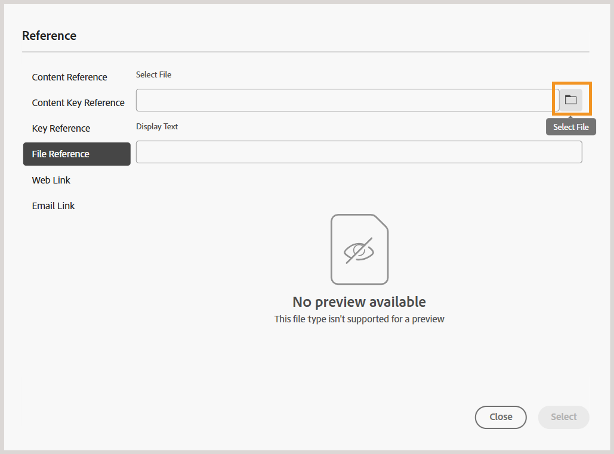
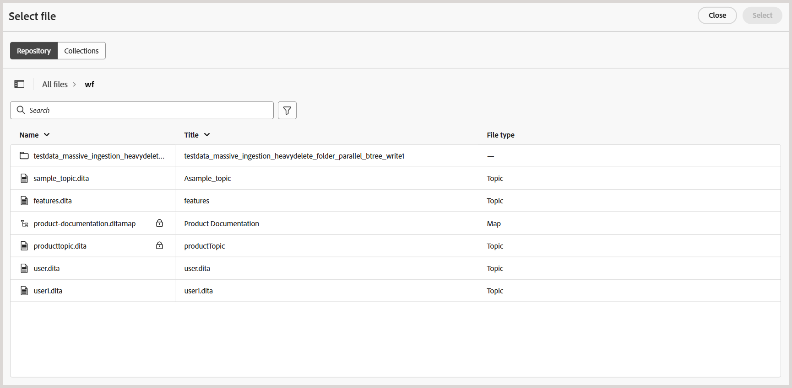
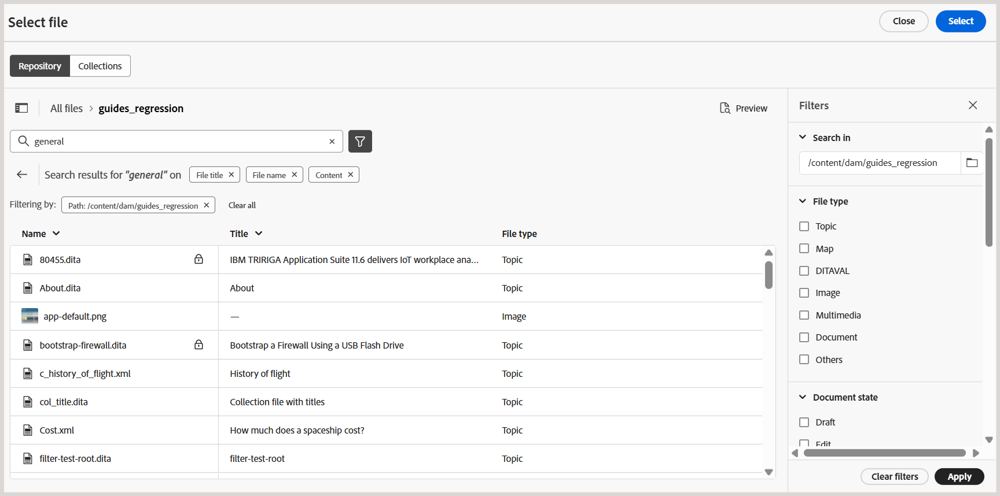
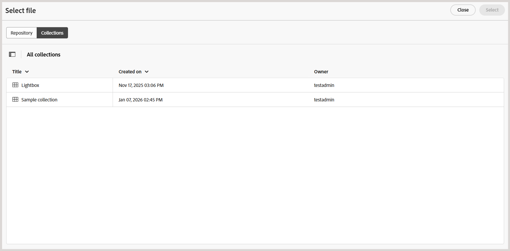
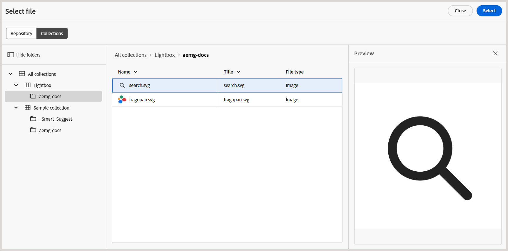
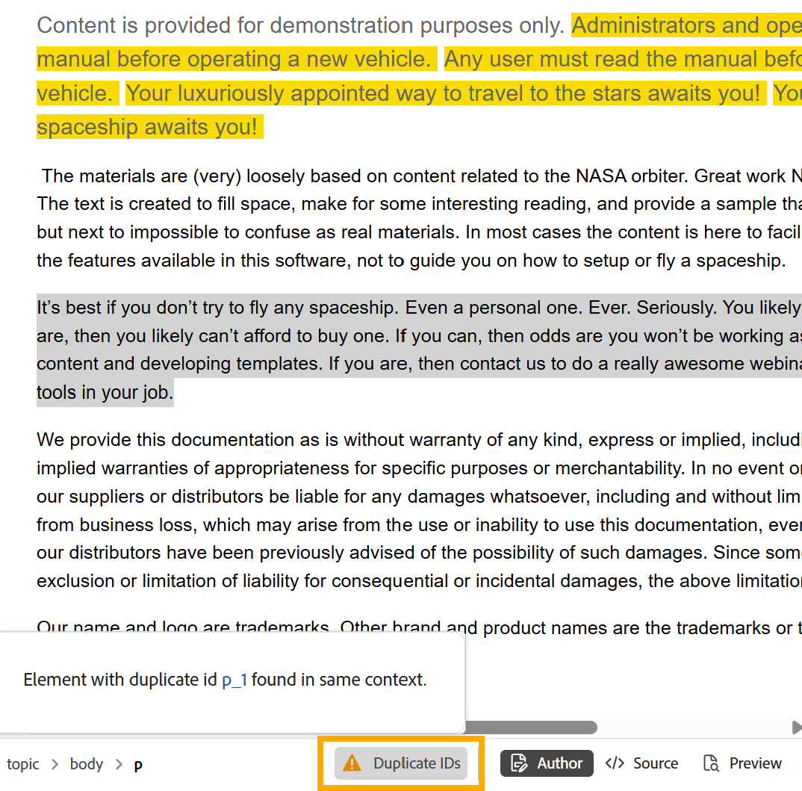
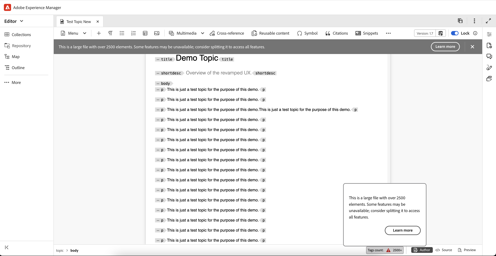

# エディターの追加機能 {#id2056B0B0YPF}

エディターには、次の便利な機能があります。

## ファイルのタブのコンテキストメニュー機能

エディターでファイルを開くと、コンテキストメニューからさまざまなアクションを実行できます。 メディアファイル、単一のDITA ファイル、または複数のファイルを開くかどうかに応じて、異なるオプションを表示できます。

**メディアファイル**

開いているメディアファイルのタブのコンテキストメニューには、次の機能があります。

{width="300" align="left"}

**単一のDITA ファイル**

開いているファイルのタブのコンテキストメニューには、次の機能があります。

{width="400" align="left"}

**複数のファイル**

複数のファイルを開いている場合、コンテキストメニューに次のオプションが表示されます。

{width="550" align="left"}

コンテキストメニューの様々なオプションについて説明します。

***保存***：次のオプションから選択できます。

- **保存**：新しいバージョンを作成せずにファイルを保存するには、**保存**&#x200B;を選択します。 新しいトピックを作成するたびに、そのトピックのバージョン不要の作業コピーがDAMで作成されます。 ドキュメントを保存すると、DAMでドキュメントの作業コピーが更新されます。 このバージョンを簡単に保存しても、トピックの新しいバージョンは作成されません。 トピックがレビュー中の場合、トピックを保存しても、レビュー担当者は変更されたトピックコンテンツにアクセスできません。

- **すべてを保存**: エディターで開いている複数のドキュメントがある場合は、**すべてのドキュメントを保存**&#x200B;するオプションも表示されます。

***新しいバージョンとして保存***

ファイルの新しいバージョンを作成するには、**新しいバージョンとして保存**&#x200B;を選択します。 **保存**&#x200B;および&#x200B;**新しいバージョンとして保存**&#x200B;の詳細については、エディター[の](web-editor-toolbar.md) ツールバーを参照してください。

***コピー***：次のオプションから選択できます。

- **UUIDをコピー**：現在アクティブなファイルのUUIDをクリップボードにコピーするには、**コピー\> UUIDをコピー**&#x200B;を選択します。
- **パスをコピー**：現在アクティブなファイルの完全なパスをクリップボードにコピーするには、**コピー\> パスをコピー**&#x200B;を選択します。

***場所***：次のオプションから選択できます。

- **マップ**：大きなDITA マップを開き、マップ内のファイルの正確な場所を見つけたい場合は、「**マップ内を検索\>**」を選択します。 「マップ内で検索」オプションを選択すると、ファイル \（オプションの呼び出し元\）がマップ階層に配置され、ハイライト表示されます。 この機能を使用するには、エディターでマップファイルを開く必要があります。 マップビューが非表示の場合、この機能を呼び出すとマップビューが表示され、ファイルがマップ階層でハイライト表示されます。

- **エクスプローラー**: マップ内の検索と同様に、**検索\> エクスプローラー**&#x200B;には、エクスプローラー\（またはDAM\）内のファイルの場所が表示されます。 エクスプローラービューが開き、選択したファイルがエクスプローラーでハイライト表示されます。 ファイルがフォルダー内にある場合、そのフォルダーが展開され、選択したファイルの場所がエクスプローラーに表示されます。

  >[!NOTE]
  >
  >2025.11.0 リリースから、**リポジトリ**&#x200B;の名前が&#x200B;**エクスプローラー**&#x200B;に変更されました。 オンプレミス設定の場合は、Experience Manager Guidesの5.1 リリースまで引き続きリポジトリとして使用できます。

***追加先***：次のオプションから選択できます：

- **コレクション**：選択したファイルをコレクションに追加するには、**コレクションに追加**&#x200B;を選択します。 詳細については、**左パネル** セクションの[&#x200B; コレクション &#x200B;](web-editor-left-panel.md)機能の説明を参照してください。

- **再利用可能なコンテンツ**：選択したファイルを再利用可能なコンテンツリストにコピーするには、「**再利用可能なコンテンツに追加**」を選択します。 詳細については、**左パネル** セクションの[再利用可能なコンテンツ &#x200B;](web-editor-left-panel.md)機能の説明を参照してください。

***プロパティ***

選択したファイルのAEM プロパティ ページを表示するには、**プロパティ**&#x200B;を選択します。

***分割***：次のオプションから選択できます。

**上、下、左、右**

デフォルトでは、エディターでは一度に1つのトピックを表示できます。 2つ以上のトピックを同時に表示したい場合があります。 エディターの画面を分割すると、複数のトピックを同時に表示できます。 例えば、AとBの2つのトピックがエディターで開かれている場合です。 トピック Bを右クリックし、**分割\>上**&#x200B;を選択すると、エディターウィンドウが2つの部分に分割されます。 上半分にトピック B、下半分にトピック Aが表示されます。 同様に、**分割\>左**&#x200B;または&#x200B;**分割\>右**&#x200B;を選択して、画面を水平に分割することもできます。 「ファイル」タブをドラッグして、配置する画面にドロップすることで、ある画面から別の画面にドキュメントを移動できます。 同様に、ファイルのタブを好みに応じてドラッグ&amp;移動して、並べ替えることもできます。

<!--

***Quick Generate***

Generate the output for the selected file. Output can be generated only for files that are a part of an output preset. For more details, view [Article-based publishing from the Web Editor](web-editor-article-publishing.md#id218CK0U019I).

-->

***閉じる***：次のオプションから選択できます。

**閉じる**、**他のユーザーを閉じる**、または&#x200B;**すべてを閉じる**

コンテキストメニューを呼び出したファイルを閉じる場合は、「**閉じる\>閉じる**」を選択します。 現在アクティブなファイルを除く他のすべての開いているファイルを閉じるには、**閉じる\>他のファイルを閉じる**&#x200B;を使用します。 開いているすべてのファイルを閉じるには、コンテキストメニューから&#x200B;**閉じる\>すべてを閉じる** オプションを選択するか、エディターを閉じることもできます。 セッションに保存されていないファイルがある場合は、それらのファイルを保存するように求められます。

**ファイルを閉じてシナリオを保存**

ファイルのタブの「**閉じる**」ボタンまたはオプションメニューの「**閉じる**」オプションを使用してエディターで開いているファイルを閉じようとすると、Experience Manager Guidesは編集内容を保存してロックされたファイルのロックを解除するよう求めるメッセージを表示します。

プロンプトは、管理者が選択した次の設定に基づいています。

- **クローズ時にロック解除を要求：** エディターを閉じると、\（ロックした\）ファイルのロックを解除するオプションが表示されます。
- **クローズ時に新しいバージョンを要求**: エディターを閉じると、（編集した\）ファイルを新しいバージョンとして保存するオプションが表示されます。

ファイル保存のエクスペリエンスは、次の3つのシナリオによって異なります。

- コンテンツには何も変更を加えていません。
- コンテンツを編集し、変更を保存しました。
- コンテンツを編集しましたが、変更は保存されませんでした。

ファイルがロックまたはロック解除されているかどうか、および変更内容が保存または保存されていないかどうかに応じて、次のオプションを表示できます。

- **ロックを解除して閉じる**: ファイルのロックが解除され、ファイルが閉じられます。
- **新しいバージョンとして保存**：これにより、コンテンツで行った変更が保存され、ファイルの新しいバージョンが作成されます。 新しく保存したバージョンのラベルやコメントを追加することもできます。 新しいバージョンの保存について詳しくは、[新しいバージョンとして保存](web-editor-toolbar.md#version-information-and-save-as-new-version)を参照してください。

- **ファイルのロックを解除**: ファイルのロックを解除すると、ファイルのロックが解除され、変更は現在のバージョンのファイルに保存されます。

  >[!NOTE]
  >
  > ファイルのロックを解除するオプションの選択を解除すると、変更を保存せずにファイルを閉じるオプションも表示されます。

  例えば、次のスクリーンショットにプロンプトの1つが表示されます。

  {width="400" align="left"}

**壊れた参照の視覚的なキュー**

トピックに壊れた相互参照またはコンテンツ参照が含まれている場合は、赤いテキストで表示されます。

**スマートなコピー&amp;ペースト**

トピック内およびトピック間でコンテンツを簡単にコピーして貼り付けることができます。 ソース要素の構造は宛先に保持されます。 また、コピーされたコンテンツにコンテンツ参照が含まれている場合は、それらのコンテンツもコピーされます。

**最後に閲覧した場所を記憶**

エディターには、スマートファイル参照ダイアログが表示されます。 エディターは、参照またはコンテンツの挿入時に最後に使用された場所を記憶します。 ファイル参照ダイアログを初めて呼び出す際に（参照を挿入またはコンテンツを挿入\）、現在の文書が保存されている場所に移動します。 同じセッションで、別の参照を挿入しようとすると、ファイル参照ダイアログは、最後の参照を挿入した場所に自動的に移動します。

>[!NOTE]
>
> 画像、オーディオまたはビデオファイルの場合、ファイル参照ダイアログは、最後に使用した場所ではなく、ファイルの場所にデフォルトで設定されます。

## Experience Manager Guidesでのファイルとフォルダーの参照

Experience Manager Guidesには、コンテンツリポジトリ内のファイルまたはフォルダーを効率的に参照および選択するための直観的なダイアログ（**ファイルを選択**&#x200B;および&#x200B;**パスを選択**）が用意されています。

>[!NOTE]
>
> Experience Manager Guides as a Cloud Service 2601 リリースのUIを刷新し、ファイルとフォルダーのパスブラウザーを導入しました。 新しいインターフェイスはデフォルトで有効になっています。 これらの更新なしで既存のUIを引き続き使用する場合は、カスタマーサクセス部門に連絡して、この新しい機能強化を無効にするように依頼してください。

### Experience Manager Guidesでのファイルの参照

ファイルパスブラウザーを使用すると、コンテンツリポジトリ内の特定のファイルをすばやく見つけて選択できます。 この機能は、マップへのトピックの追加、画像または相互参照のリンク、再利用可能なコンテンツの作成などのタスクで使用できます。

{width="350" align="left"}

ファイルブラウザーを起動すると、**ファイルを選択** ダイアログが開きます。 このダイアログには、**リポジトリ**&#x200B;と&#x200B;**コレクション**&#x200B;の2つのタブが含まれています。 デフォルトでは、「リポジトリ」タブが選択されています。

{width="650" align="left"}

**ファイルを参照するためのリポジトリタブで利用できる機能**

**ファイルとフォルダーの表形式表示**

「リポジトリ」タブでは、コンテンツリポジトリのファイルとフォルダーの表形式のビューが提供され、正しいファイルパスを簡単に見つけることができます。 上部のパンくずリストと左側のフォルダーナビゲーションパネルを使用して、フォルダー間を移動することもできます。

{width="650" align="left"}

**単一および複数のファイル選択**

ファイルを使用するには、ファイルを選択し、**選択**&#x200B;を選択します。

{width="650" align="left"}

場合によっては、このパスブラウザーダイアログから複数のファイルを選択することもできます。 例えば、再利用可能なコンテンツのファイルを参照する場合、複数のファイルを選択して、再利用可能なコンテンツの一部にすることができます。

{width="650" align="left"}

現在、再利用可能なコンテンツ、トピック参照、Schematron、出力プリセット（DITAVALを使用）、Workfrontでは、複数のファイル選択が可能です。

>[!NOTE]
>
> パスブラウザーダイアログからファイルを選択すると、一部のフォルダーが無効に表示されることがあります。 この動作により、特定のファイルタイプへのアクセスが制限され、有効な選択が確実に行われます。 例えば、再利用可能なコンテンツを作成する場合は、トピックファイルとマップファイルのみを使用する必要があります。 画像などの無効なファイルタイプを使用しないようにするには、対応するファイルが表示されないか、パスブラウザーで選択できなくなります。

**選択したファイルをプレビュー**

次に示すように、「**プレビュー**」ボタンを使用して、選択したファイルをプレビューできます。

{width="650" align="left"}

選択したファイルのプレビューが右側に表示されます。

{width="650" align="left"}

複数の選択の場合、選択したすべてのファイルのプレビューがプレビューパネルに表示され、簡単に確認できます。

{width="650" align="left"}

**削除** アイコンを使用して、一部のファイルをプレビューから選択解除することもできます。

{width="650" align="left"}

**エクスペリエンスの検索とフィルター**

リポジトリ内のファイルを参照する場合、選択したパス内の名前、タイトル、コンテンツでファイルを検索できます。 検索には、1つ、2つ、または3つすべての条件を使用できます。 いずれかの基準が選択されていない場合、3つの基準すべてに共通の結果が含まれます。

{width="650" align="left"}

**フィルター検索** \（\）アイコンを選択して、右側のフィルターパネルを開きます。

{align="left"}

ファイルをフィルタリングし、検索を絞り込むには、次のオプションがあります。

- **で検索**: リポジトリ内に存在するファイルを検索するパスを選択します。

- **ファイルの種類**：特定のファイルの種類に基づいて検索をフィルタリングします。 利用できるオプションは、**トピック**、**マップ**、**DITAVAL**、**画像**、**マルチメディア**、**ドキュメント**&#x200B;および&#x200B;**その他**&#x200B;です。

  >[!NOTE]
  >
  > 場合によっては、**ファイルタイプ** フィルターは、タスクに基づいて特定のファイルタイプに事前に適用され、変更できません。 例えば、画像を参照する場合は、フィルターは画像ファイルのみを表示するように設定され、再利用可能なコンテンツを作成する場合は、トピックファイルとマップファイルのみを表示するように設定されます。 ドキュメントの状態、タグ、最終更新日などの他のフィルターを調整して、検索結果を絞り込むことができます。

- **ドキュメントの状態**: ファイルの現在のドキュメントの状態に基づいて検索をフィルタリングできます。 使用可能なフィルター値は、`repositoryFilters`の`ui_config.json file` フィールドで定義され、現在使用しているフォルダープロファイルに関連付けられています。

  つまり、

   - グローバルプロファイルを使用している場合は、グローバルプロファイルで設定されたフィルター値が適用されます。
   - 特定のフォルダープロファイルを選択すると、そのプロファイルで定義されたフィルター値が取得されます。

  ドキュメントの状態で使用できるデフォルトのフィルター値は、ドラフト、編集、レビュー中、承認済み、レビュー済みおよび完了です。 ドキュメント状態のフィルター値のカスタマイズについて詳しくは、[&#x200B; ドキュメント状態フィルターの設定](../cs-install-guide/config-doc-state-filters.md)を参照してください。

- **ロック済み**: ユーザーのリストを表示します。 リストはページ分割され、非同期で読み込まれます。一度に限られたユーザーのセットが表示され、スクロールまたは移動するたびに多くのユーザーが取得されます。 これにより、特に多数のユーザーを使用する場合は、読み込み速度と全体的なパフォーマンスが向上します。

- **最終変更日**：変更日に基づいてコンテンツをフィルタリングします。 カレンダーから日付範囲を選択するか、次のいずれかの時間枠オプションを選択します。
   - 先週
   - 「先月」
   - 昨年

- **タグ**: タグに基づいてコンテンツをフィルタリングします。

- **DITA要素**：様々なDITA要素に基づいてコンテンツをフィルタリングします。

必要なフィルターをすべて適用したら、フィルターパネルの右下隅にある「**適用**」を選択します。

**ファイルを参照するための「コレクション」タブで利用できる機能**

「**コレクション**」タブには、コレクションで利用可能なファイルの厳選されたビューが表示され、すばやくアクセスして再利用できます。 フォルダー全体の階層を表示する「リポジトリー」タブとは異なり、コレクションでは、複数のフォルダーを移動することなく、頻繁に使用されるトピック、マップ、画像を選択できます。

「コレクション」タブでは、次の操作を行うことができます。

- 上部のパンくずリストと右側のフォルダーナビゲーションパネルを使用して、コレクション内を簡単に移動できます。

  
- 特定のコレクションパス内にあるファイルを選択し、右側のパネルでプレビューします。

  

### リポジトリ内のブラウザーフォルダー

**フォルダーを選択** ダイアログを使用してフォルダーを参照すると、新しいトピックの作成や公開コンテンツの出力場所の指定などのタスクに対して、リポジトリー内の正しいフォルダーパスを選択することに重点が置かれます。 明確なツリー構造のフォルダー像を構築できるため、ナビゲーションが直観的になり、コンテンツが適切な場所に配置されます。

{width="300" align="left"}

## 記事ベースの公開のサポート

エディターから、1つ以上のトピックまたはDITA マップ全体の出力を生成できます。 DITA マップの出力プリセットを作成する必要があります。その後、1つ以上のトピックの出力を簡単に生成できます。 マップ内のいくつかのトピックを更新した場合は、エディターからそれらのトピックに対してのみ出力を生成することもできます。 詳しくは、[記事ベースの公開](web-editor-article-publishing.md#id218CK0U019I)を参照してください。

## Markdown ドキュメントのサポート

エディターでは、DITA ドキュメントと共にMarkdown ドキュメント \（.md\）を使用できます。 エディターでMarkdown ドキュメントを簡単に作成およびプレビューし、DITA マップエディターを使用してマップファイルに追加できます。 詳細については、エディター[の](web-editor-markdown-topic.md#)作成者Markdown ドキュメントを参照してください。

## DITA用語集の用語トピックのサポート

エディターは、`term`または`abbreviated-form`要素を追加して挿入できるDITA用語集の用語をサポートしています。

## MathML数式の操作

### MathML数式の挿入

Experience Manager Guidesは、[MathType Web](https://docs.wiris.com/en/mathtype/mathtype_web/intro) アプリケーションと統合してMathML数式を挿入するための標準サポートを提供します。 MathML数式を挿入するには、**Element** アイコンを選択し、mathmlと入力します。 リストからmathml要素を選択すると、**MathMLを挿入** ダイアログが表示されます。

{width="550" align="left"}

MathML数式ツールを使用して数式を作成し、**挿入**&#x200B;を選択して文書に追加します。 方程式が薄いグレーの背景で挿入されます。

既存の数式を右クリックし、コンテキストメニューから「**MathMLを編集**」を選択して、いつでも数式を更新できます。

### MathML エディターでの数式の検証

Experience Manager Guidesでは、MathML数式を含むトピックを保存すると、数式が検証されます。
MathML エディターを使用して数式を挿入すると、構文に問題がある場合は、Experience Manager Guidesで数式が赤で強調表示されます。 挿入する前に修正することができます。 変更を加えずに&#x200B;**挿入**&#x200B;を選択すると、警告が表示されます。

{width="400" align="left"}

構文エラーを含むMathML数式を挿入すると、トピックを保存しようとすると検証エラーが発生します。

## 脚注を挿入

`fn`要素を使用して、コンテンツに脚注を挿入します。 オーサリングモードでは、脚注値がコンテンツとインラインで表示されます。 ただし、プレビューモードを切り替えたり、ドキュメントを公開したりすると、脚注がトピックの最後に表示されます。

## エレメントの名前変更または置換

エディターには、トピックの左下にエレメントのパンくずリストが表示されます。 エレメントを別のエレメントに置き換える場合は、パンくずリストのコンテキストメニューから行うことができます。 例えば、コンテキストで`p`要素を`note`またはその他の有効な要素とスワップできます。

{width="400" align="left"}

パンくずリストで、置換するエレメント名を右クリックし、コンテキストメニューから「エレメント名を変更」を選択します。 エレメント名を変更ダイアログには、現在の場所で許可されているすべての有効なエレメントが表示されます。 エレメント名を変更ダイアログで、使用するエレメントを選択します。 元のエレメントは、新しいエレメントに置き換えられます。

パンくずリストのコンテキストメニューに加えて、「エレメント名を変更」ダイアログには、他の場所からもアクセスできます。

- パンくずリストでエレメント名を選択してエレメントの内容を選択し、選択したコンテンツを右クリックしてコンテキストメニューを表示します。

- タグビューを有効にし、任意の要素の開始タグを選択し、選択したコンテンツを右クリックしてコンテキストメニューを表示します。

- アウトライン パネルのエレメントのオプションメニューを呼び出して、エレメント名を変更ダイアログにアクセスできます。

## エレメントのラップとラップ解除

### エレメントをラップ

- エレメントを折り返すと、選択したテキストにエレメントタグを追加できます。 DITA標準に従って、テキストを任意の子要素にラップできます。 例えば、`note`要素の下にテキストがある場合、そのテキストを`p`要素にラップできます。

- 「**エレメントをラップ**」オプションは、トピックのパンくずリストのコンテキストメニューで使用できます。 エレメントをラップするには、エレメントを右クリックしてコンテキストメニューを開きます。 「**エレメントを折り返し**」ダイアログからエレメントを選択します。 テキストが新しいエレメントに表示されます。

- コンテンツ内のテキストまたはエレメントを選択し、コンテキストメニューから「**エレメントを折り返し**」オプションを選択することもできます。

### エレメントのラップ解除

エレメントをラップ解除すると、選択したテキストからエレメントタグを削除し、親エレメントと結合できます。 例えば、`p`要素内に`note`要素がある場合、`p`要素のラップを解除して、`note`要素内で直接テキストを結合できます。 「**エレメントのラップ解除**」オプションは、トピックのパンくずリストのコンテキストメニューで使用できます。 エレメントのラップを解除するには、エレメントを右クリックしてコンテキストメニューを開き、最後に&#x200B;**エレメントのラップを解除**&#x200B;を選択してエレメントを削除し、エレメントのテキストを親エレメントと結合します。

## DITA要素の空白の処理

XMLでは、空白には、スペース、タブ、改行、空白行が含まれます。 Experience Manager Guidesは、複数の結果的な空白を1つのスペースに変換します。 これにより、エディターのWYSIWYG ビューを保持できます。

>[!NOTE]
>
> DITA ルールに従ってホワイトスペースを保持する必要がある一部の要素では、複数の結果として生じるホワイトスペースが保持されます。 例えば、`<pre>`要素と`<codeblock>`要素です。

## 改行とインデントの保持

改行とスペースを含むDITA エレメントは、オーサーモード、Source モード、プレビューモードおよび最終的に公開された出力の定義に従ってサポートされ、レンダリングされます。 次のスクリーンショットは、改行とスペース \（インデント\）が保持された`msgblock`要素内のコンテンツを示しています。

{align="left"}

## エディターでの区切り以外のスペースの処理

- **Symobol**  アイコンまたは&#x200B;**Alt** + **Space** ショートカットキーを使用して、文書内に改行しないスペースを挿入できます。  エディターでトピックを編集する際に、これらの区切り以外のスペースがインジケーターとして表示されます。 作成者モードで&#x200B;**区切り以外のスペースを表示** オプションを使用して、区切り以外のスペースの表示をオフにできます（**ユーザー設定**&#x200B;の[&#x200B; アピアランス &#x200B;](./intro-home-page.md#user-preferences) タブ）。

- 外部ソースから改行しないスペースを含むコンテンツを&#x200B;**作成者** ビューにコピー&amp;ペーストすると、改行しないスペースはスペースに変換されます。
ただし、**作成者** ビューから改行しないスペースを含むコンテンツをコピーして貼り付けると、そのコンテンツは保持されます。

## エレメント IDの自動生成

DITA トピック内のエレメントのIDを自動的に生成できます。 これらのIDは、DITA トピック内で一意です。 例えば、段落要素のIDを生成する場合、IDはp\_1、p2、p\_3になります。 複数の要素を選択し、選択した各要素に対してIDを生成できます。

1つまたは複数の要素のIDを自動的に生成するには、次の手順を実行します。

1. エディターでトピックを開きます。
1. IDを割り当てるコンテンツを選択します。
1. 右クリックし、コンテキストメニューから「**IDを生成**」を選択します。

または、パンくずリストで右クリックし、**IDを生成**&#x200B;を選択することもできます。

## 作成者ビュー内のマップまたはトピック内のエレメントの重複IDの識別

特定のトピックまたはマップに重複するIDを持つ要素が含まれている場合、エディタービューの横にあるコンテンツ編集領域の右下隅に「**重複ID**」ボタンが表示されます。

{width="350" align="left"}

**重複ID**&#x200B;を選択すると、すべての重複IDの一覧がポップオーバーで表示されます。 ポップオーバーから表示されるIDを選択して、対応する要素に移動し、一意のIDで更新できます。

>[!NOTE]
>
> **重複ID** ボタンは&#x200B;**作成者** ビューでのみ使用でき、類似の要素IDはネストされた様々なトピックで許可されます。

## エディターでの大きなファイルの処理

大きなファイルの処理を改善するための主な機能は次のとおりです。

- パフォーマンスを向上させるために、取り消し、やり直し、アウトラインパネル、汚れたマーカーなどの特定の機能が無効になっています。 最適なエクスペリエンスを得るために、トピックを小さなトピックに分割することをお勧めします。

- 下のスニペットに示すように、大きなファイルの上部にアラートメッセージが表示されます。 このアラートは、uiconfig.json ファイルの&#x200B;**largeFileTagCount** パラメーターで指定された値に基づいて、要素の数を強調表示します。 デフォルトでは、**largeFileTagCount**&#x200B;は2500に設定されています。

{width="600" align="left"}

- さらに、タグ数はインターフェイスの下部バーに表示されます。 このタグ数の値にカーソルを合わせると、ツールヒントが表示されます。 「**詳細情報**」タブを選択すると、大きなファイルの処理に関する詳細が表示されます。

{width="600" align="left"}

- アラートメッセージはDITA ファイルでのみ使用でき、オーサー、Source、レイアウトのすべてのビューに表示されます。

**親トピック：**&#x200B;[&#x200B; エディターの概要](web-editor.md)
