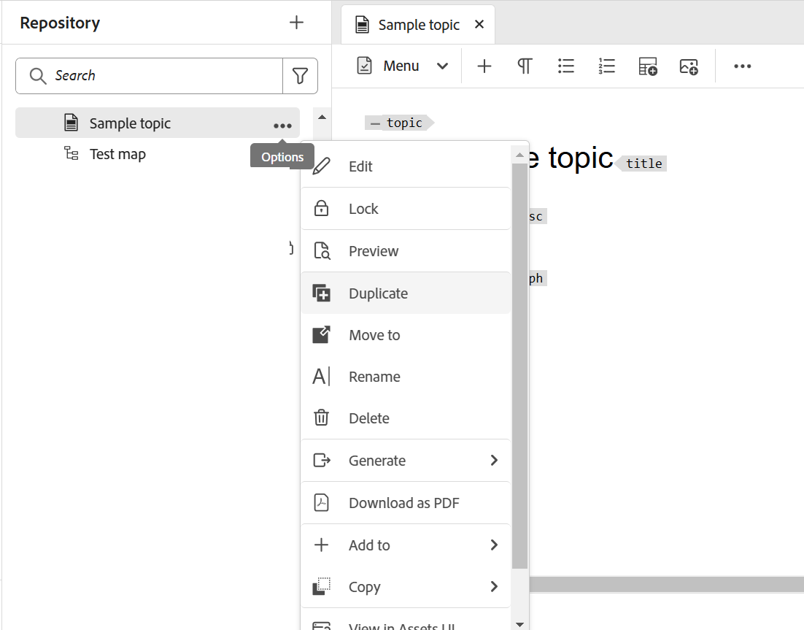
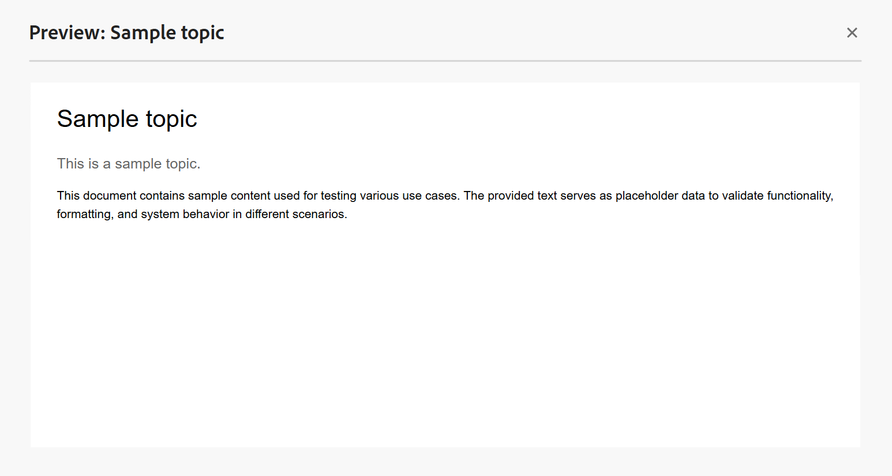
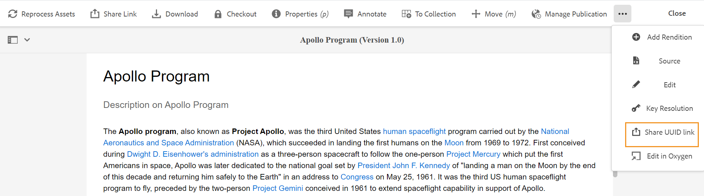
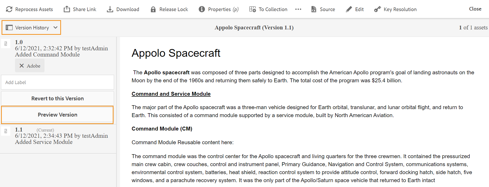
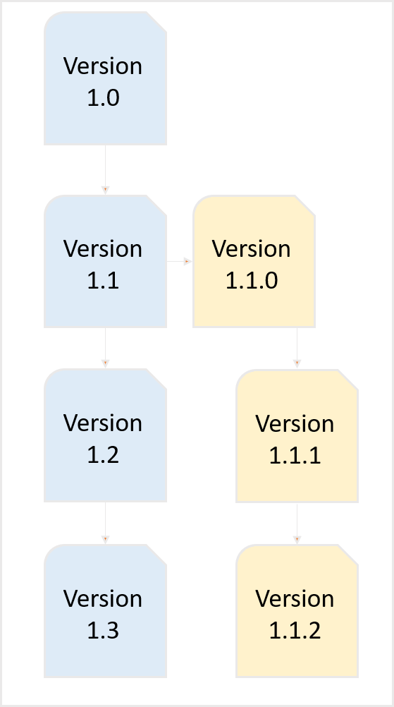
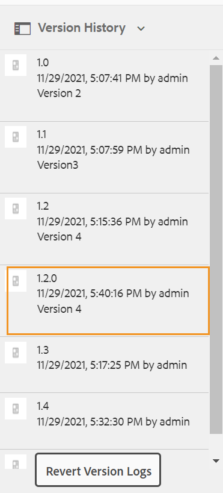

# トピックのプレビュー {#id1696II000QR}

トピックが作成されると、Adobe Experience Manager Guidesはそのトピックのプレビューを生成します。 プレビューモードには、ドキュメントの操作に使用できる様々な機能が用意されています。

Experience Manager Guidesでトピックをプレビューするには、次の2つの方法があります。

- [エディターから](#preview-topics-from-the-editor)
- [Assets UIから](#preview-topics-from-the-assets-ui)

## エディターからのトピックのプレビュー

エディターからトピックをプレビューするには、次の手順を実行します。

1. リポジトリパネルで、表示するトピックに移動します。
1. プレビューするトピックにカーソルを合わせ、オプションメニューから「**プレビュー**」を選択します。

   {width="600"}

   トピックのプレビューが表示されます。

   

**プレビューモードからのトピックのプレビュー**

エディターでトピックを開き、コンテンツ編集領域の右下隅にある&#x200B;**プレビュー** モードに切り替えると、現在開いているトピックのプレビューを表示できます。

詳しくは、[&#x200B; エディタービュー](./web-editor-views.md#preview)を参照してください。

## Assets UIからのトピックのプレビュー

トピックをプレビューするには、次の手順を実行します。

1. Assets UIで、表示するトピックに移動します。
1. 表示するトピックを選択します。

   トピックのプレビューがAssets UIに表示されます。

   >[!NOTE]
   >
   > ツールバーの右上隅に、アクティブなトピックまたはDITA マップのバージョンを表示できます。

   >[!IMPORTANT]
   >
   > プレビューツールバーの次の機能の位置は、Adobe Experience Manager サーバーの設定によって異なる場合があります。 一部の機能はメインツールバーで利用でき、その他の機能は詳細メニューで利用できます。

## Assets UI for Previewで使用できる機能

Assets UIのプレビュー機能を使用する場合、ツールバーで次の操作を実行できます。

**プロパティ**

選択したトピックのプロパティを表示します。 Adobe Experience Managerのバージョンにもとづいて、メタデータ、スケジュール \（de\）アクティベーション、参照、ドキュメントの状態などのプロパティを表示できます。

>[!NOTE]
>
> トピックのタイトルプロパティは、DITA トピックまたはマップの`title` タグから自動入力されます。 プロパティウィンドウを使用してタイトルを変更すると、その変更は失われます。 タイトルプロパティを更新する場合は、エディターを使用して更新する必要があります。

「プロパティ」ページには、マップやトピックの使用場所、ドキュメント内の参照など、参照に関する有用な情報が含まれます。 プロパティ ページには、文書の2種類の参照が一覧表示されます（**で使用される**&#x200B;と&#x200B;**送信される参照**）。

**使用済み**&#x200B;の参照には、現在のファイルが参照または使用されているドキュメントが一覧表示されます。 **送信の参照**&#x200B;には、現在の文書で参照されている文書が一覧表示されます。

「**使用**&#x200B;で参照」セクションの\（+\）アイコンを使用すると、さらに上に移動して、そのトピックが使用されている場所や参照されている場所を見つけることができます。

ドキュメントの横にある アイコンを選択すると、そのドキュメントをさらに参照しているマップファイルまたはトピックファイルが表示されます。

**条件付きフィルター\（A/B\）**

トピックに条件付きコンテンツがある場合は、ツールバーにA/B アイコンが表示されます。 このアイコンを選択すると、トピックで使用可能な条件に従ってコンテンツをフィルタリングできるポップアップが開きます。

>[!NOTE]
>
> コンディショナルコンテンツは、エディターの明るい背景色を使用してハイライト表示されます。

{width="300"}

**編集**

- エディターで編集するトピックを開きます。 管理者がファイル **オプションをロックせずに**&#x200B;編集を無効にするオプションを有効にしている場合、**編集** オプションは使用できません。 このオプションを有効にすると、トピックファイルをロックした後にのみ&#x200B;**編集** オプションが表示されます。

**キー解決**

- トピックにキースペースファイルを使用する場合は、キー解決アイコンを選択します。 次に、キーの解像度ポップアップからキースペースを選択できます。

**ソース**

- ファイルのXML ソースコードを開きます。 プレビューモードでファイルを開き、Source アイコンを選択すると、マップ、トピック、DITAVAL ファイルの基になるXML コードを表示できます。 XML Source ポップアップにXML ソースコードが表示されます。 ファイルから特定のコードを選択するか、`Ctrl`+`a`を押してコンテンツ全体を選択します。

  >[!NOTE]
  >
  > DITA マップファイルのソースコードビューを取得するには、Assets UIでファイルを選択し、「Source」を選択します。

  

**UUID リンクを共有**

- Experience Manager Guidesでは、DITA マップ、トピック、画像ファイルのUUID ベースのリンクを次の場所から共有できます。

   - ASSETS UI
   - DITA マップのコンソール
   - トピックまたは画像のプレビュー

上記の領域のツールバーに、新しいオプション **UUID リンクを共有**&#x200B;が表示されます。 次のスクリーンショットは、トピックのプレビューモードで&#x200B;**UUID リンクを共有** オプションを示しています。

アセット UIでは、ファイルを選択すると、このオプションが表示されます。 プレビューモードでは、このオプションはデフォルトでメインツールバーで使用できます。 DITA マップコンソールでは、このオプションは「出力プリセット」セクションに表示されます。

URLをコピーしたら、他のユーザーと同じものを共有して、ファイルに直接アクセスできるようにします。 このリンクは、ファイルがリポジトリ内の別の場所に移動された場合でも有効です。 リンクが失敗するのは、ファイルがリポジトリから削除されたときだけです。

DITA マップコンソールまたはファイルのプレビューモードからリンクを共有する場合、ユーザーはファイルの同じビューに移動します。 ただし、Assets UIからマップファイルのリンクを共有すると、ユーザーはマップのコンソールに移動します。 同様に、トピックファイルまたは画像ファイルの場合、ファイルのプレビューが表示されます。

>[!IMPORTANT]
>
> リンクは、他のトピックの参照リンクとして使用することはできません。リポジトリ内のファイルへの直接アクセスのみが許可されます。 また、ファイルがリポジトリで使用可能である限り、リンクは引き続き有効です。 ファイルがリポジトリ内の別の場所に移動しても、リンクは有効なままです。 リンクは、ファイルがリポジトリから削除されたときにのみ失敗します。

**チェックアウト/チェックイン**

- チェックアウト機能とチェックイン機能を切り替えます。 ファイルがチェックアウトされると、現在のユーザーはファイルに対する排他的な書き込み権限を取得します。 チェックアウトしたファイルは、エディターで開いて編集できます。 必要な変更を行ったら、チェックインアイコンを選択してDAMにファイルを保存します。

トピックをチェックアウトすると、ファイルのステータスがカード表示とリストビューにチェックアウト済みとして表示されます。

カード表示でファイルをチェックアウトしました。

{width="300"}

リスト表示でファイルをチェックアウトしました。

{width="550"}

チェックアウトされた列が表示されない場合は、**リスト表示**&#x200B;の下の&#x200B;**設定を表示**&#x200B;を選択し、**列を設定** ダイアログで&#x200B;**チェックアウト** ステータスを選択します。

>[!TIP]
>
> ファイルのチェックアウトとチェックインの操作に関するベストプラクティスについては、ベストプラクティスガイドの「コンテンツのバージョン管理」セクションを参照してください。

**Web ベースのバージョンの違い**

- トピックに変更が加えられた場合は、そのトピックのさまざまなバージョンで行われた変更を簡単に確認できます。 トピックの様々なバージョンの変更点を調べるには：

  >[!IMPORTANT]
  >
  > 次の手順で説明する方法は、DITA ファイルにのみ適用されます。 DITA以外のファイルの場合は、タイムラインビューを使用してバージョンを作成するか、既存のバージョンのファイルを復元します。

   1. トピックをプレビューモードで開きます。

   1. 左側のパネルで、**バージョン履歴**&#x200B;を選択し、バージョンを選択します。

      

   1. リストされたバージョンから、基本バージョンとして使用するバージョンを選択し、**バージョンのプレビュー**&#x200B;を選択します。 選択したバージョンのプレビューがバージョンプレビューウィンドウに表示されます。

   1. 「**差分を表示**」リストから、基本バージョンと比較するバージョンを選択します。

      

      変更されたコンテンツは、トピックプレビューでハイライト表示されます。 緑で強調表示されたコンテンツは、新しく追加されたコンテンツを示し、赤で表示されたコンテンツは削除されたコンテンツです。

      

## 分岐、元に戻し、その後のバージョン管理

- 一般的なオーサリング環境では、特定のリリースに対応するために、トピックの新しいブランチを作成する必要があります。 他のバージョン管理システムと同様に、Experience Manager Guidesでは、既存のバージョンのトピックからブランチを作成したり、古いバージョンのトピックに戻したりできます。 Experience Manager Guidesのバージョン管理機能を使用すると、次の作業を実行できます。

   - トピックの既存のバージョンからブランチを作成する
   - 新しいブランチで後続のバージョンを作成する
   - トピックの特定のバージョンに戻す

  次の図は、典型的な分岐とその後のバージョン管理システムを示しています。

  {width="550" align="center"}

  新しいトピックの場合、最初のバージョンには1.0という番号が付けられます。 その後、トピックのすべての新しいバージョンは、1.1、1.2などの増分番号で保存されます。 トピックのブランチを作成すると、ブランチの作成元のバージョン番号を取得し、バージョンの最後に。0を追加して新しいブランチが作成されます。 図に示すように、トピックのバージョン 1.1から新しいブランチが作成されます。 新しいブランチは1.1.0としてバージョン管理されています。 その後、このブランチにトピックの新しいバージョンを保存するたびに、1.1.1、1.1.2などの増分バージョン番号が取得されます。

  分岐と同様に、作業中または現在のバージョンを、リポジトリに存在する任意のバージョンに戻すこともできます。 バージョンに戻すには、トピックの目的のバージョンを選択し、**バージョン履歴** パネルで&#x200B;**このバージョンに戻す**&#x200B;を選択します。

  次の手順を実行して、ブランチを作成し、バージョンに戻し、トピックの後続のバージョンを維持します。

  >[!IMPORTANT]
  >
  > 次の手順で説明する方法は、DITA ファイルにのみ適用されます。 DITA以外のファイルの場合は、タイムラインビューを使用してバージョンを作成するか、既存のバージョンのファイルを復元します。

   1. Assets UIでトピックにアクセスします。

      >[!NOTE]
      >
      > トピックをプレビューモードで開いて、手順3に進むこともできます。

   1. ブランチを作成するトピックを選択します。

   1. 左側のパネルで、**バージョン履歴**&#x200B;を選択します。

      >[!NOTE]
      >
      > 選択したトピックで使用可能なバージョンのリストが表示されます。 各バージョンには、タイムスタンプ、ユーザー名、バージョンコメント、および[&#x200B; ラベル &#x200B;](web-editor-use-label.md#)情報が含まれます。

   1. ブランチを作成するバージョンを選択します。 次のスクリーンショットでは、ブランチを作成するためにバージョン 1.2が選択されています。

      {width="300"}

      >[!NOTE]
      >
      > トピックの現在のバージョンには、バージョン番号の横に記載されている&#x200B;*\（Current\）*&#x200B;が含まれています。

   1. 「**このバージョンに戻す**」を選択します。

      新しいブランチの作成を確認するメッセージが表示されます。

   1. *\（Optional\）* メッセージプロンプトで、**現在の作業コピーを新しいバージョンとして保存**&#x200B;を選択するオプションが表示されます。 このオプションの選択に基づいて、次の2つのアクションが可能です。

      - このオプションを選択すると、バージョン 1.1からブランチが作成されます。 また、トピックの新しいバージョンもトピックの現在の作業コピーから作成され、次のバージョン - 1.4として保存されます。

        {width="300"}

        バージョン 1.2は、トピックの現在の作業コピーになります。 この後に保存されたバージョンは、1.1の新しいブランチの下に作成されます。 例えば、このブランチの新しいトピックの後続のバージョンは1.2.0として保存されます。

        {width="300"}

      - このオプションを選択しない場合、トピックの現在の作業コピーから新しいバージョンは作成されません。 トピックのバージョン 1.2から新しいブランチが作成されます。 トピックの後続のバージョンは、1.2 ブランチの下に1.2.0、1.2.1などに保存されます。

        {width="300"}

   1. 「**OK**」を選択します。

  選択したバージョンのトピックから新しいブランチが作成されます。 上記のプロセスは、トピックの特定のバージョンに戻す場合にも適用できます。 特定のバージョンに戻すとは、選択したバージョンから新しいブランチを作成し、そのバージョンをトピックの現在の作業コピーにすることです。 バージョン復元履歴レポートで、復元済みのファイルの履歴を表示することもできます。 このレポートについて詳しくは、[&#x200B; ファイルのバージョン履歴の復元レポート &#x200B;](reports-reverted-file-version-history.md#)を参照してください。

**親トピック：**&#x200B;[&#x200B; トピックの作成とプレビュー](create-preview-topics.md)
