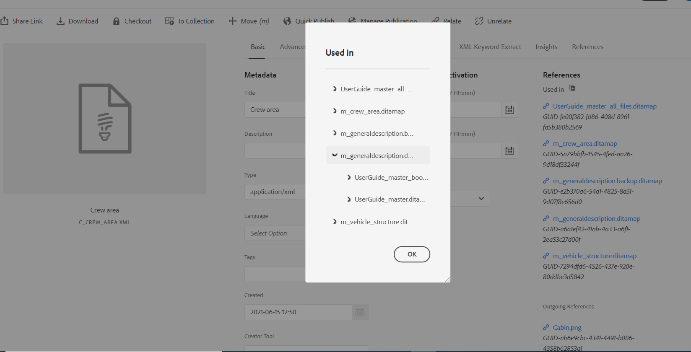
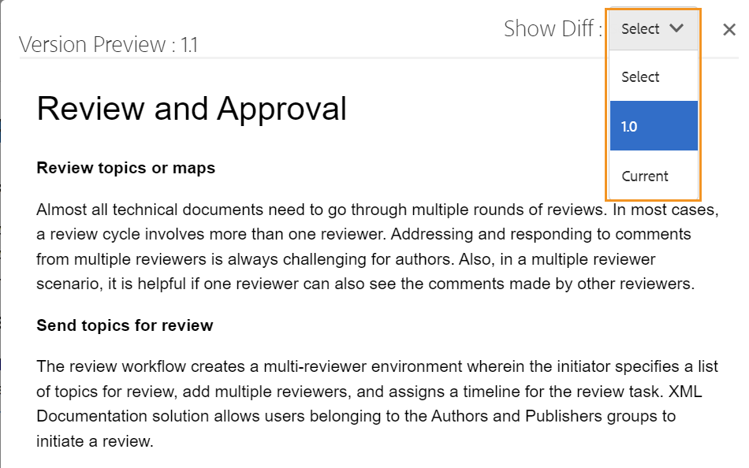

# トピックのプレビュー {#id1696II000QR}

トピックを作成すると、Adobe Experience Manager Guidesがそのトピックのプレビューを生成します。 プレビューモードには、ドキュメントを操作するために使用できる様々な機能が用意されています。

Experience Manager Guidesでは、次の 2 つの方法でトピックをプレビューできます。

- [エディターから](#preview-topics-from-the-editor)
- [Assets UI から](#preview-topics-from-the-assets-ui)

## エディターでのトピックのプレビュー

エディターでトピックをプレビューするには、次の手順を実行します。

1. リポジトリーパネルで、表示するトピックに移動します。
1. プレビューするトピックの上にマウスポインターを置き、オプションメニューから **プレビュー** を選択します。

   {width="600" align="left"}

   トピックのプレビューが表示されます。

   {align="left"}

**プレビューモードでトピックをプレビューする**

エディターでトピックを開き、コンテンツ編集領域の右下隅にある **プレビュー** モードに切り替えると、現在開いているトピックのプレビューを表示できます。

詳しくは、[&#x200B; エディタービュー &#x200B;](./web-editor-views.md#preview) を参照してください。

## Assets UI からのトピックのプレビュー

トピックをプレビューするには、次の手順を実行します。

1. Assets UI で、表示するトピックに移動します。
1. 表示するトピックを選択します。

   トピックのプレビューがAssets UI に表示されます。

   >[!NOTE]
   >
   > ツールバーの右上隅に、アクティブなトピックまたは DITA マップのバージョンが表示されます。

   >[!IMPORTANT]
   >
   > プレビューツールバーでの次の機能の位置は、Adobe Experience Manager サーバーの設定によって異なる場合があります。 一部の機能はメインツールバーで使用できますが、その他の機能は「その他」メニューで使用できます。

## Assets UI でプレビュー用に使用できる機能

Assets UI からプレビュー機能を使用する場合、ツールバーで次の操作を使用できます。

{align="left"}

**プロパティ**

選択したトピックのプロパティを表示します。 Adobe Experience Managerのバージョンに応じて、メタデータ、\（de\）アクティベーションのスケジュール、参照、ドキュメントの状態などのプロパティを表示できます。

>[!NOTE]
>
> トピックの title プロパティは、DITA トピックまたはマップの `title` タグから自動入力されます。 プロパティウィンドウを使用してタイトルを変更すると、その変更は失われます。 title プロパティを更新する場合は、エディターを使用して更新する必要があります。

プロパティ ページには、マップやトピックが使用されている場所や、ドキュメントに含まれる参照など、参照に関する有用な情報が含まれています。 プロパティ ページには、ドキュメントに対する 2 種類の参照 **Used In 参照** と **Outgoing References** が一覧表示されます。

**使用されている場所** 参照には、現在のファイルが参照または使用されているドキュメントが一覧表示されます。 **外部参照** には、現在のドキュメントで参照されているドキュメントが一覧表示されます。

**使用されている場所** 参照セクションの\（+\） アイコンを使用すると、そのトピックが使用されている、または参照されている場所を探すために上に移動できます。

{align="left"}

ドキュメントの横にある  アイコンを選択すると、そのドキュメントがさらに参照されているマップ ファイルまたはトピック ファイルが表示されます。

**条件付きフィルター\（A/B\）**

トピックに条件付きコンテンツがある場合は、ツールバーに A/B アイコンが表示されます。 このアイコンを選択すると、トピックで使用可能な条件に従ってコンテンツをフィルタリングできるポップアップが開きます。

>[!NOTE]
>
> エディターで、条件付きコンテンツが明るい背景色でハイライト表示される。

{width="300" align="left"}

**編集**

- 編集するトピックをエディターで開きます。 管理者が **ファイルをロックせずに編集を無効にする** オプションを有効にしている場合、「編集 **オプションは使用でき** せん。 オプションを有効にすると、トピック ファイルをロックした後にのみ **編集** オプションが表示されます。

**主な解決策**

- トピックにキースペースファイルを使用する場合は、「キー解像度」アイコンを選択します。 その後、キー解像度ポップアップからキースペースを選択します。

**ソース**

- XML ソースコードを開きます。 マップ、トピック、または DITAVAL ファイルの基になる XML コードを表示するには、プレビューモードでファイルを開き、「Source」アイコンをクリックします。 「XML Source」ポップアップに、XML ソースコードが表示されます。 ファイルから特定のコードを選択するか、`Ctrl`+`a` キーを押してコンテンツ全体を選択できます。

  >[!NOTE]
  >
  > DITA マップファイルのソースコードビューを取得するには、Assets UI でファイルを選択し、「Source」を選択します。

  {align="left"}

**UUID リンクを共有**

- Experience Manager Guidesでは、以下の場所から DITA マップ、トピック、およびイメージファイルの UUID ベースのリンクを共有できます。

   - ASSETS UI
   - DITA マップのコンソール
   - トピックまたは画像のプレビュー

新しいオプション **UUID リンクを共有** が、上記の領域のツールバーに表示されます。 次のスクリーンショットは、トピックのプレビューモードの **UUID リンクを共有** オプションを示しています。

{align="left"}

Asset UI では、このオプションはファイルを選択すると表示されます。 プレビューモードの間、このオプションはデフォルトでメインツールバーで使用できます。 DITA マップコンソールでは、このオプションは「出力プリセット」セクションに表示されます。

URL をコピーしたら、同じ項目を他のユーザーと共有して、他のユーザーがファイルに直接アクセスできるようにします。 このリンクは、ファイルがリポジトリ内の他の場所に移動された場合でも有効です。 リンクが失敗するのは、ファイルがリポジトリから削除されたときだけです。

DITA マップコンソールまたはファイルのプレビューモードからリンクを共有すると、ユーザーは同じファイルのビューに移動します。 ただし、Assets UI からマップファイルのリンクを共有すると、マップのコンソールに移動します。 同様に、トピックまたは画像ファイルの場合、ファイルのプレビューが表示されます。

>[!IMPORTANT]
>
> このリンクは、他のトピックの参照リンクとして使用することはできません。リポジトリ内のファイルに直接アクセスできるだけです。 また、ファイルがリポジトリで使用可能な限り、リンクは有効です。 ファイルがリポジトリ内の他の場所に移動されても、リンクは有効なままです。 ファイルがリポジトリから削除された場合にのみ、リンクが失敗します。

**チェックアウト/チェックイン**

- チェックアウト機能とチェックイン機能を切り替えます。 ファイルがチェックアウトされると、現在のユーザーはそのファイルに対して排他的な書き込み権限を取得します。 チェックアウトされたファイルは、エディターで開いて編集できます。 必要な変更を加えたら、「チェックイン」アイコンを選択してファイルを DAM に保存します。

トピックをチェックアウトすると、ファイルのステータスがカード表示およびリスト表示でチェックアウト済みとして表示されます。

チェックアウトしたファイルをカード表示で表示：

{width="300" align="left"}

チェックアウトされたファイル （リスト表示）:

{width="550" align="left"}

「チェックアウト」列が表示されない場合は、「**リスト表示**」の **表示設定** を選択し、「**列を設定** ダイアログで **チェックアウト** ステータスを選択します。

{align="left"}

>[!TIP]
>
> ファイルのチェックアウトとチェックインに関するベストプラクティスについては、ベストプラクティスガイドのコンテンツのバージョン管理の節を参照してください。

**Web ベースバージョンの違い**

- トピックに変更が加えられている場合は、そのトピックの異なるバージョンで行われた変更を簡単に見つけることができます。 トピックの様々なバージョンの変更を検索するには、次の手順に従います。

  >[!IMPORTANT]
  >
  > 以下の手順で説明する方法は、DITA ファイルにのみ適用できます。 DITA 以外のファイルの場合は、タイムラインビューを使用してバージョンを作成するか、ファイルの既存のバージョンを復元します。

   1. トピックをプレビューモードで開きます。

   1. 左側のパネルで「**バージョン履歴**」を選択し、バージョンを選択します。

      {align="left"}

   1. リストに表示されたバージョンから、ベースバージョンとして使用するバージョンを選択し、「**バージョンをプレビュー**」を選択します。 選択したバージョンのプレビューがバージョンのプレビューウィンドウに表示されます。

   1. **差分を表示** リストから、ベースバージョンの比較に使用するバージョンを選択します。

      {align="left"}

      トピックのプレビューで、変更されたコンテンツがハイライト表示されます。 緑色でハイライト表示されたコンテンツは新しく追加されたコンテンツを示し、赤色のコンテンツは削除されたコンテンツを示します。

      {align="left"}

## ブランチ、元に戻す、後続のバージョン管理

- 通常のオーサリング環境では、特定のリリースに対応するトピックの新しいブランチを作成する必要があります。 他のバージョン管理システムと同様に、Experience Manager Guidesでは、トピックの既存のバージョンからブランチを作成したり、トピックの古いバージョンに戻したりすることができます。 Experience Manager Guidesに用意されているバージョン管理機能を使用して、次のタスクを実行できます。

   - トピックの既存のバージョンから分岐を作成する
   - 新しいブランチでの後続のバージョンの作成
   - 特定のバージョンのトピックに戻す

  次の図に、一般的なブランチと後続のバージョン管理システムを示します。

  {width="550" align="center"}

  新しいトピックの場合、最初のバージョンには 1.0 という番号が付けられます。その後、トピックの新しいバージョンはすべて、1.1、1.2 などの増分番号で保存されます。 トピックのブランチを作成すると、ブランチの作成元のバージョン番号を取得して新しいブランチが作成され、バージョンの最後に。0 が追加されます。 図に示すように、トピックのバージョン 1.1 から新しいブランチが作成されます。 新しいブランチのバージョンは 1.1.0 になります。その後は、このブランチで新しいバージョンのトピックを保存するたびに、1.1.1、1.1.2 などの増分バージョン番号が取得されます。

  ブランチと同様に、作業用バージョンまたは現在のバージョンを、リポジトリに存在する任意のバージョンに戻すこともできます。 バージョンに戻すには、トピックの目的のバージョンを選択し、**バージョン履歴** パネルの **このバージョンに戻る** を選択します。

  ブランチを作成し、特定のバージョンに戻して、後続のバージョンのトピックを維持するには、以下の手順を実行します。

  >[!IMPORTANT]
  >
  > 以下の手順で説明する方法は、DITA ファイルにのみ適用できます。 DITA 以外のファイルの場合は、タイムラインビューを使用してバージョンを作成するか、ファイルの既存のバージョンを復元します。

   1. Assets UI のトピックにアクセスします。

      >[!NOTE]
      >
      > トピックをプレビューモードで開いて、手順 3 に進むこともできます。

   1. 分岐を作成するトピックを選択します。

   1. 左側のパネルで「**バージョン履歴**」を選択します。

      >[!NOTE]
      >
      > 選択したトピックで使用可能なバージョンのリストが表示されます。 各バージョンには、タイムスタンプ、ユーザー名、バージョンコメント、[&#x200B; ラベル &#x200B;](web-editor-use-label.md#) 情報が含まれます。

   1. ブランチを作成するバージョンを選択します。 次のスクリーンショットでは、ブランチを作成するためにバージョン 1.2 が選択されています。

      {width="300" align="left"}

      >[!NOTE]
      >
      > トピックの現在のバージョンには、バージョン番号の横に *\（Current\）* が記載されています。

   1. 「**このバージョンに戻る**」を選択します。

      新しいブランチの作成を確認するメッセージが表示されます。

   1. *\（オプション\）* メッセージプロンプトには、「**現在の作業コピーを新しいバージョンとして保存**」を選択するオプションがあります。 このオプションの選択に基づいて、次の 2 つのアクションが可能です。

      - このオプションを選択すると、バージョン 1.1 からブランチが作成されます。また、トピックの新しいバージョンもトピックの現在の作業コピーから作成され、次のバージョンとして保存されます – 1.4。

        {width="300" align="left"}

        バージョン 1.2 は、トピックの現在の作業用コピーになります。 この後に保存されたすべてのバージョンは、1.1 の新しいブランチの下に作成されます。例えば、このブランチの新しいトピックの後続バージョンは 1.2.0 として保存されます。

        {width="300" align="left"}

      - このオプションを選択しない場合、トピックの現在の作業コピーから新しいバージョンは作成されません。 トピックのバージョン 1.2 から新しいブランチが作成されます。 トピックの後続のバージョンは、1.2 ブランチに 1.2.0、1.2.1 などとして保存されます。

        {width="300" align="left"}

   1. 「**OK**」を選択します。

  選択したトピックのバージョンから新しいブランチが作成されます。 上記のプロセスは、トピックの特定のバージョンに戻す場合にも適用できます。 特定のバージョンへの復帰とは、技術的には、選択したバージョンから新しいブランチを作成し、そのバージョンをトピックの現在の作業コピーにすることを意味します。 元に戻したファイルの履歴は、バージョンへの戻しの履歴レポートでも確認できます。 このレポートの詳細については、[&#x200B; 元に戻したファイルのバージョン履歴レポート &#x200B;](reports-reverted-file-version-history.md#) を参照してください。

**親トピック：**&#x200B;[&#x200B; トピックの作成とプレビュー &#x200B;](create-preview-topics.md)
