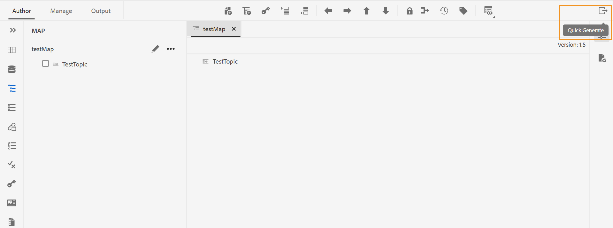

# クイック生成パネルを使用して出力を生成および表示する {#id22AKE050F5L}

>[!NOTE]
>
> 以前はAdobe Experience Manager Guidesで使用されていたクイック生成パネルは、バージョン 4.0および2502以降、非推奨（廃止予定）になりました。 クイック生成パネルにアクセスして出力を生成および表示することはできません

AEM Guidesには、Web エディター内に統合された&#x200B;**クイック生成** パネルが用意されています。 このパネルでは、DITA マップ用に作成された出力プリセットの出力を同時に生成できます。 1つ以上のプリセットまたはDITA マップ用に作成されたすべてのプリセットの出力を生成できます。 **クイック生成** パネルを使用して、後でプリセット用に生成された出力を表示することもできます。

>[!NOTE]
>
> マップビューパネルで開いたDITA マップに対して、**クイック生成** パネルが表示されます。

次の手順を実行して、**クイック生成** パネルから出力を生成します。

1. マップビューでDITA マップを開きます。 クイック生成アイコンが表示されます。 **作成者**&#x200B;と&#x200B;**管理** タブに表示されます。
1. **クイック生成** アイコン \（\）をクリックして、**クイック生成** パネルを開きます。 **クイック生成** パネルで、DITA マップ用に作成されたすべての出力プリセットのリストを表示できます。
1. 出力を生成する1つ以上のプリセットを選択します。
1. 「**生成**」をクリックして、選択したプリセットの出力を生成します。 出力の生成に成功メッセージが表示されます。 生成が失敗した場合は、エラーメッセージが表示されます。 エラーログを表示して、生成プロセスで発生したエラーの詳細を確認することもできます。
1. 特定のプリセットの&#x200B;**出力を表示** \（\）アイコンをクリックして、プリセット用に生成された出力を表示します。

**親トピック：**&#x200B;[&#x200B; Web エディターの操作](web-editor.md)
