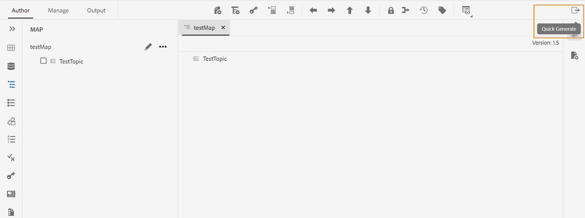

# 「クイック生成」パネルを使用して出力を生成および表示する {#id22AKE050F5L}

AEM Guidesには、web エディター内に統合された **クイック生成** パネルが用意されています。 このパネルを使用すると、DITA マップ用に作成された出力プリセットの出力を同時に生成できます。 1 つ以上のプリセットの出力を生成することも、DITA マップ用に作成されたすべてのプリセットの出力を生成することもできます。 **クイック生成** パネルを使用して、プリセット用に生成された出力を後で表示することもできます。

>[!NOTE]
>
> マップビューパネルで開いた DITA マップに **クイック生成** パネルが表示されます。

{width="800" align="left"}

次の手順を実行して、**クイック生成** パネルから出力を生成します。

1. DITA マップをマップビューで開きます。 「クイック生成」アイコンが表示されます。 **作成者** タブと **管理** タブに表示されます。
1. **クイック生成** アイコン \（\）をクリックして **クイック生成** パネルを開きます。 **クイック生成** パネルに、DITA マップ用に作成されたすべての出力プリセットのリストが表示されます。
1. 出力を生成する 1 つ以上のプリセットを選択します。
1. 「**生成**」をクリックして、選択したプリセットの出力を生成します。 出力の生成時に成功メッセージが表示されます。 生成が失敗した場合は、エラーメッセージが表示されます。 また、エラーログを表示して、生成プロセスで発生したエラーの詳細を確認することもできます。
1. 特定のプリセットの **出力を表示** \（\） アイコンをクリックして、そのプリセットに対して生成された出力を表示します。

**親トピック：**[ Web エディタの操作 ](web-editor.md)
