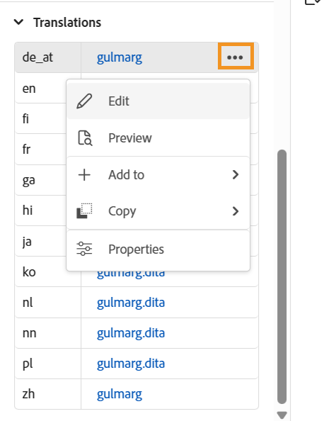
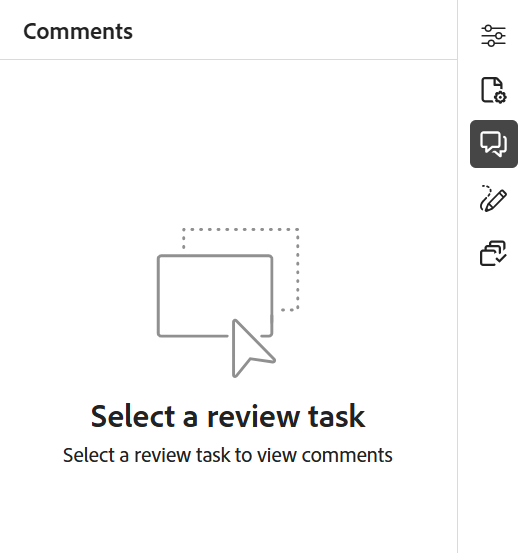

# エディターの右パネル

右側のパネルには、現在選択されている文書に関する情報が表示されます。

>[!NOTE]
>
> 右側のパネルはサイズ変更可能です。 パネルのサイズを変更するには、パネルの境界にカーソルを置き、カーソルを双方向矢印に変え、選択してドラッグしてパネルの幅のサイズを変更します。

右側のパネルでは、次の機能にアクセスできます。

- [コンテンツプロパティ](#content-properties)
- [ファイルのプロパティ](#file-properties)
- [レビュー](#review)
- [変更をトラック](#track-changes)
- [Schematron](#schematron)

## コンテンツプロパティ

右側のパネルで「**コンテンツのプロパティ**」アイコンを選択すると、**コンテンツのプロパティ**&#x200B;機能にアクセスできます。 **コンテンツプロパティ** パネルには、ドキュメント内で現在選択されている要素のタイプとその属性に関する情報が含まれています。

**タイプ**：現在のタグの完全な階層のタグを表示して、ドロップダウンから選択できます。

**属性**: **属性** ドロップダウンパネルは、レイアウトビュー、作成者ビュー、Source ビューで使用できます。 属性を簡単に追加、編集、削除できます。

    
 属性を追加する手順 

1. 「**追加**」を選択します。

   {width="300"}

1. **属性** ドロップダウンパネルで、ドロップダウンリストから属性を選択し、属性の値を指定します。  次に、**追加**&#x200B;を選択します。

   複数の属性{width="300"}を持つ属性パネル

1. 属性を編集するには、属性にカーソルを合わせ、**編集** を選択します。

1. 属性を削除するには、属性にカーソルを合わせ、**削除** を選択します。

>[!NOTE]
>
> トピックに参照コンテンツが含まれている場合でも、プロパティパネルを使用してトピックに属性を追加できます。

管理者が属性のプロファイルを作成した場合は、これらの属性と設定値を取得します。 コンテンツプロパティパネルを使用して、これらの属性を選択し、トピック内の関連コンテンツに割り当てることができます。 この方法で条件付きコンテンツを作成し、条件付き出力を作成するために使用することもできます。 コンディショナルプリセットを使用した出力の生成について詳しくは、[&#x200B; コンディショナルプリセットの使用](generate-output-use-condition-presets.md#)を参照してください。

## ファイルのプロパティ

右側のパネルで「ファイルのプロパティ」アイコンを選択して、選択したファイルのプロパティを表示します。 ファイルプロパティ機能は、レイアウト、オーサー、Source、プレビューの4つのモードまたはビューで使用できます。

ファイルプロパティには、次の2つのセクションがあります。

**一般**

「一般」セクションでは、次の機能にアクセスできます。

{width="300"}

- **ファイル名**：選択したトピックのファイル名を表示します。 ファイル名は、選択したファイルのプロパティページにハイパーリンクされます。
- **ID**：選択したトピックのIDを表示します。
- **文字数**：対応するDITA トピックの合計文字数を表示します。 スペースで区切られた単語は、個々の単語としてカウントされます。 トピックに変更を保存するたびにカウントが更新されます。 相互参照の場合、表示テキストのみがカウントに含まれ、キーは除外されます。

  >[!NOTE]
  >
  > **文字数**&#x200B;機能は、Experience Manager Guides as a Cloud Serviceの2026.01.0 リリースで導入されました。 このリリースにアップグレードした後に作成した新しいDITA トピックには、計算された文字数が自動的に右側のパネルに表示されます。 既存のトピックの場合、[&#x200B; アセットの再処理](./asset-processor.md)が必要です。

- **タグ**：トピックのメタデータタグです。 これらは、プロパティページの「タグ」フィールドから設定します。 ドロップダウンから入力または選択できます。  タグはドロップダウンの下に表示されます。 タグを削除するには、タグの横にある十字アイコンを選択します。
- **他のプロパティを編集**: （**読み取り専用** モードではないファイルの）他のプロパティを編集するには、ファイルのプロパティ ページを使用します。

  >[!NOTE]
  >
  > メタデータプロパティの追加、削除、または変更（デフォルトまたはカスタムのいずれでも）は、ドキュメントバージョンの[作業用コピーインジケーター](./web-editor-edit-topics.md#working-copy-indicator)をトリガーします。

- **言語**: トピックの言語を表示します。 プロパティページの「言語」フィールドから設定します。
- **作成日**: トピックが作成された日時を表示します。
- **変更日**: トピックが変更された日時を表示します。
- **によってロックされました**: トピックをロックしたユーザーを表示します。
- **ドキュメントの状態**：現在開いているトピックのドキュメントの状態を選択して更新できます。 詳細については、[&#x200B; ドキュメントの状態](web-editor-document-states.md#)を参照してください。

>[!NOTE]
>
> ファイルプロパティの様々なフィールドの属性値をクリップボードにコピーできます。

**参照**

「参照」セクションでは、次の機能にアクセスできます。

{width="300"}

- **で使用**：現在のファイルが参照または使用されているドキュメントは、「参照で使用」リストに表示されます。
- **送信リンク：**&#x200B;送信リンクには、現在のドキュメントで参照されているドキュメントが一覧表示されます。

デフォルトでは、タイトルでファイルを表示できます。 ファイルにカーソルを合わせると、ファイルタイトルとファイルパスがツールチップとして表示されます。

>[!NOTE]
>
> 管理者は、エディターでファイル名でファイルのリストを表示することもできます。 **ユーザー設定**&#x200B;の「**エディターファイル表示設定**」セクションの「**ファイル名**」オプションを選択します。

>[!NOTE]
>
> すべての使用済み参照と出力参照は、文書にハイパーリンクされています。 リンクされたドキュメントを簡単に開いて編集できます。

ファイルを開くだけでなく、「参照」セクションの「**オプション**」メニューを使用して、多くのアクションを実行することもできます。 実行できるアクションには、編集、プレビュー、UUIDのコピー、パスのコピー、コレクションへの追加、プロパティなどがあります。

**翻訳**

このセクションでは、エディターで現在開いているアセットの使用可能なすべての言語コピーをアルファベット順に一覧表示します。 情報は表形式のビューで表示され、対応する&#x200B;*ファイルタイトル* （または&#x200B;*ファイルタイトル*&#x200B;が使用できない場合は&#x200B;*ファイル名*）と共に各言語コードが表示されます。

>[!INFO]
>
> 言語コピーは、アセットが翻訳用に送信されたときに作成されます。 英語（`en`）はソース言語として機能し、翻訳されたコピーはそれぞれのターゲット言語フォルダーに生成されます（例：ドイツ語では`de`、フランス語では`fr`）。 アセットが`en` フォルダーにのみ存在する場合、翻訳が開始され、ターゲット言語に対して完了するまで、追加の言語コピーは表示されません。 アセットがどの言語フォルダーにも存在しない場合、**使用できる翻訳はありません**&#x200B;が表示されます。 詳細については、[&#x200B; コンテンツ翻訳のベストプラクティス &#x200B;](./translation-first-time.md)を参照してください。

{width="300"}

言語コピーごとに、ファイルにカーソルを合わせてリポジトリ内のパスを見つけるか、ファイルを選択してエディターで開くことができます。 ファイルを開くだけでなく、「翻訳」セクションの「**オプション**」メニューを使用して、多くのアクションを実行することもできます。 実行できるアクションには、編集、プレビュー、UUIDのコピー、パスのコピー、コレクションへの追加、プロパティなどがあります。

{width="300"}

## レビュー

レビューアイコンを選択するとレビューパネルが開き、現在開いているドキュメントのレビュータスクを選択してコメントを表示できます。

{width="300"}

複数のレビュープロジェクトを作成した場合は、ドロップダウンから1つを選択して、レビューコメントにアクセスできます。

レビューパネルを使用すると、トピックに対するコメントの返信を表示および投稿できます。 コメントは1つずつ承認または却下できます。

>[!NOTE]
>
> コメントボックスと返信ボックスは、複数行の入力をサポートしており、ユーザーは必要に応じて拡張して、包括的なコメントを提供したり、コメントに対する詳細な返信を行ったりできます。 **Shift** + **Enter**&#x200B;を使用して、コメントまたは返信の書き込み中に次の行に移動できます。

詳細については、[&#x200B; アドレスのレビューのコメント &#x200B;](review-address-review-comments.md#)を参照してください。

## 変更をトラック

右側のパネルの「変更履歴」機能を使用すると、ドキュメントで行われたすべての更新の情報を表示できます。 ドキュメントに加えられた特定の更新を検索することもできます。

>[!NOTE]
>
> 変更履歴の追跡機能には、[&#x200B; タブバー](./web-editor-tab-bar.md)の「変更履歴を有効/無効にする」機能を使用して追跡されたすべての更新が表示されます。

## Schematron

「Schematron」とは、XML ファイルのテストを定義するために使用されるルールベースの検証言語を指します。 エディターはSchematron ファイルをサポートしています。 スキーマトロンファイルを読み込み、エディターで編集することもできます。 Schematron ファイルを使用すると、特定のルールを定義し、DITA トピックまたはマップに対して検証できます。

Experience Manager GuidesでSchematron ファイルを操作する方法については、[Schematron ファイルのサポート &#x200B;](./support-schematron-file.md)を参照してください。

**親トピック：**&#x200B;[&#x200B; エディターの概要](web-editor.md)
