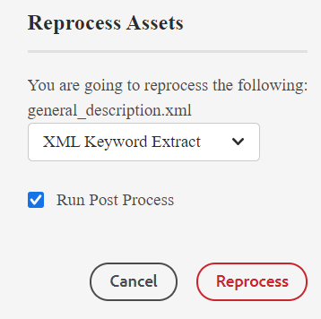
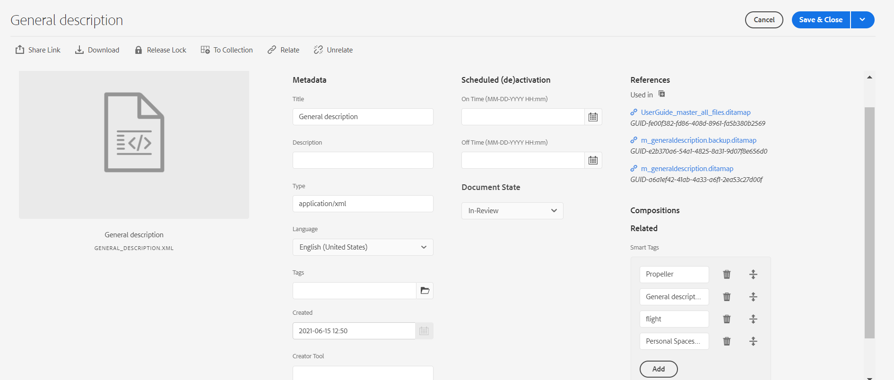

# スマートタグ {#id216KH0ID0Y8}

>[!IMPORTANT]
>
> スマートタグ機能は、すぐに使用できるわけではなく、システム管理者に相談する必要があるカスタム実装が必要です。

Adobe Experience Manager Guidesには、スマートタグを追加する機能が搭載されています。 XML キーワード抽出ツールを使用して、スマートタグを抽出できます。 このツールは、AIを活用してコンテンツを理解し、関連性の高いキーワードを提供します。 スマートタグを使用して、検索エンジン最適化\（SEO\）を改善し、ユーザーが関連コンテンツを見つけやすくすることができます。

スマートタグを作成するには、次の手順を実行します。

1. Assets UIで、スマートタグを作成するトピックに移動します。
1. トピックをプレビューモードで開き、メインツールバーから「**Assetsを再処理**」アイコンを選択します。
1. 「XML キーワード抽出」を選択して、関連するキーワードを抽出します。

   {width="300"}

1. 「後処理を実行」オプションを選択します。 ツールが正常に開始されると、メッセージが表示されます。
1. タグは自動的に抽出され、選択したトピックの「プロパティ」ページに表示されます。

   

   >[!NOTE]
   >
   > XML キーワード抽出ツールを使用してキーワードを抽出するだけでなく、プロパティページでスマートタグを追加、削除、またはカスタマイズすることもできます。

*カスタマーサクセス チームに連絡して、この機能を環境で有効にしてもらってください。 これは、すぐに使用できるサポートの一部として有効になっていません。*

**親トピック：**&#x200B;[&#x200B; メタデータの管理](manage-metadata.md)
