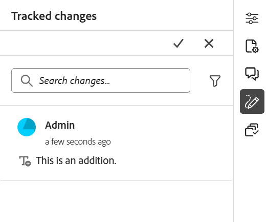
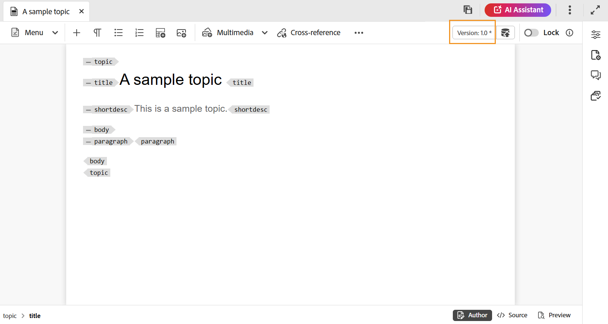
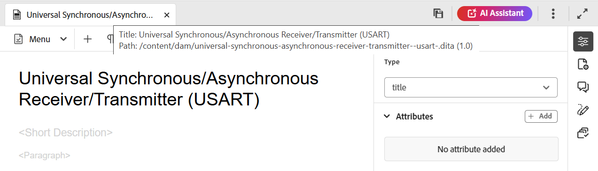

# エディターのツールバー

ツールバーは、エディタで編集するトピックまたはマップを開いたときに表示されます。 ツールバーで使用できる機能は次のとおりです。

- [メニュードロップダウン](#menu-dropdown)
- [コンテンツ挿入オプション](#content-insertion-options)
- [バージョン情報と「新しいバージョンとして保存」ボタン](#version-information-and-save-as-new-version)
- [ロック/ロック解除](#lockunlock)

>[!NOTE]
>
> 上記の機能は、トピック ファイルにのみ適用されます。 マップ ファイルで作業する場合、現在のマップ エディタ ビューに基づいて、ツールバーに異なるオプションが表示されます。 [ マップエディター機能 ](./map-editor-advanced-map-editor.md) ドキュメントのマップエディターツールバーオプションについて説明します。

## メニュードロップダウン

メニュードロップダウンから、編集アクション、検索と置換、バージョン履歴、バージョンラベル、結合、レビュータスクを作成、表示メニュー（変更履歴の追跡、タグ、改行なしスペースを含む）にアクセスできます。

{width="350" align="left"}

これらの機能の詳細は次のとおりです。

**アクションの編集**

エディターでトピックを編集する場合は、様々な編集アクション（**カット** または ***Ctrl***+***X***、**コピー** または ***Ctrl***+***C***、**取り消し** または ***Ctrl***+***Z***、**やり直し** または Ctrl を+****** ****** **** X など）にアクセスします。

**検索と置換**

**検索と置換** 機能は、オーサーモードとSourceビューモードで使用できます。 有効にすると、[ 検索と置換 ] テキスト バーがトピック編集領域の下部に表示されます。 ショートカットキー **Ctrl**+**F** を使用して、「検索と置換」バーを呼び出すことができます。

{align="left"}

設定アイコン\（\）を使用して、「大文字と小文字を区別しない **検索オプションと** 単語全体のみ **検索オプションを切り替えるこ** ができます。 大文字と小文字を区別しない検索を実行するには、\（または select\）オプション **大文字と小文字を区別しない** をオンにします。 大文字と小文字を区別して検索を実行する場合は、\（または選択解除\） **大文字と小文字を区別しない** オプションをオフにします。 単語全体を検索することもできます。

検索は即時に行われます。つまり、「**検索**」フィールドに検索語句または単語を入力すると、その語句が即座に検索され、トピック内で選択されます。 同様に、トピック内のテキストを置き換える場合は、検索語句とその置き換えを各フィールドに入力し、「**置換**」または **すべて置換** ボタンを選択します。

Source ビューでは、**検索と置換** 機能は、特定の要素や属性を検索する場合に非常に役立ちます。 例えば、`@product` 属性の値を置き換える場合は、Source ビューから簡単に実行できます。 オーサービューでは、属性または要素に基づいて検索することはできません。 ただし、**すべて置換** 機能を使用する場合は、XML コードが上書きされる可能性があるので、注意が必要です。

**バージョン履歴**

エディタの **バージョン履歴** 機能を使用すると、DITA ファイルの使用可能なバージョンをチェックして比較し、エディタ自体から任意のバージョンに戻すことができます。 現在のバージョン（作業用コピーの場合もあります）のコンテンツとメタデータを、同じファイルの以前のバージョンと比較できます。 また、比較したバージョンのラベルとコメントを表示することもできます。

>[!NOTE]
>
> バージョン履歴オプションは、トピックまたはマップの最初のバージョンに変更が加えられた場合にのみ表示されます。

    
 バージョン履歴にアクセスする手順 

1. エディターでトピックを開きます。
1. **メニュー** ドロップダウンから **バージョン履歴** を選択します。

   **バージョン履歴** ダイアログボックスが表示されます。

   {width="550" align="left"}

   *トピックの異なるバージョンでの変更をプレビューします。*

1. 比較または元に戻すトピックのバージョンを **比較対象** ドロップダウンリストで選択します。

   >[!NOTE]
   >
   > バージョンにラベルが適用されている場合は、バージョン番号と共に\（括弧で囲まれて\）も表示されます。

1. 「**ラベルとコメントを表示**」オプションを有効にすると、現在のバージョンと比較されたバージョンに適用されたラベルとコメントが表示されます。
1. また、「バージョン履歴 **ダイアログボックスには次の情報も表示され** す。

   **プレビュー** タブ：新しく追加されたコンテンツは緑のフォントで、削除されたコンテンツは赤のフォントで表示されます。

   **メタデータ** タブ：新しく追加されたメタデータは緑のフォントで、削除されたメタデータは赤のフォントで表示されます。

   {width="550" align="left"} でのメタデータの違い

   *バージョン履歴で様々なバージョンのメタデータを比較します。*

   >[!NOTE]
   >
   > システム管理者は、**設定** の「メタデータ」タブから、表示するメタデータを変更できます。 詳しくは、**タブバー** の「その他のアクション [ の節を参照してください ](./web-editor-tab-bar.md)。

   また、現在のバージョンと比較したバージョンのユーザーおよび時間の詳細を表示することもできます。

   ドロップダウンリストからバージョンを選択すると、「**選択したバージョンに戻る**」オプションが使用可能になります。 プレビューウィンドウには、トピックの現在のバージョンと選択したバージョンの違いが表示されます。

1. 「**選択したバージョンに戻す**」を選択して、トピックの選択したバージョンで作業コピーを元に戻します。

   バージョンを元に戻すダイアログボックスが表示されます。

   {width="550" align="left"}

1. \（*オプション*\）以前のバージョンに戻す理由を指定します。 トピックの現在アクティブな作業コピーの新しいバージョンを作成することもできます。

1. 「**確認**」を選択します。

   ファイルの作業コピーは、選択したバージョンに戻ります。 現在アクティブな作業コピーの新しいバージョンを作成する場合は、すべての作業変更を含む新しいバージョンのファイルも作成されます。

   以前のバージョンに戻すと、現在作業中のバージョンが最新バージョンでないことを示す視覚的なキューが表示されます。

   {align="left"}

**バージョンラベル**

ラベルは、DDLC \（ドキュメント開発ライフサイクル\）に特定のトピックがあるステージを識別するのに役立ちます。 例えば、トピックに取り組んでいる場合、ラベルを「承認済み」に設定できます。 トピックが公開され、顧客が使用できるようになったら、そのトピックに「リリース済み」ラベルを割り当てることができます。

Experience Manager Guidesでは、自由形式のテキスト形式でラベルを指定したり、事前定義済みの一連のラベルを使用したりできます。 カスタムラベルを使用すると、システム内の任意の作成者が選択したラベルを指定できます。 これにより柔軟性が生まれますが、システム内でラベルの一貫性が失われます。 この問題を解決するために、管理者は、事前定義済みのラベルのセットを設定できます。 定義済みラベルの設定について詳しくは、「Adobe Experience Manager Guides as a Cloud Serviceのインストールと設定」の *XML Web Editor の設定とカスタマイズ* を参照してください。

これらのラベルは、作成者がラベルを指定する必要がある場合に、ドロップダウンリスト形式で表示されます。 これにより、事前定義された一貫性のあるラベルのみがシステムで使用されるようになります。

トピックにラベルを付ける方法には、Assets UI の [ バージョン履歴 ](web-editor-use-label.md) パネル、[ ベースライン ](/help/product-guide/user-guide/generate-output-use-baseline-for-publishing.md) UI、エディターなどがあります。 エディターのバージョンラベル機能を使用すると、作成者はトピックにラベルをすばやく簡単に割り当てることができます。

    
 エディターからトピックにラベルを追加する手順 

1. エディターでトピックを開きます。

1. メニューのドロップダウンから **バージョンラベル** を選択します。

   「バージョン・ラベル管理」ダイアログ・ボックスが表示されます。

   {width="350" align="left"}

   [ バージョン ラベル管理 ] ダイアログ ボックスは 2 つの部分に分かれています。左のパネルには、トピックで使用可能なバージョンの一覧とラベル ドロップダウン リスト \（またはラベルを入力するテキスト ボックス\）があり、右のパネルにはトピックのプレビューがあります。

1. ラベルを適用するバージョンを選択します。

   「バージョン」リストからトピックの別のバージョンを選択すると、現在のバージョンと選択したトピックのバージョンの間の変更内容がプレビューパネルに表示されます

   >[!NOTE]
   >
   > ラベルが既にバージョンに適用されている場合は、ドロップダウンリストのバージョン番号の横にある「バージョンを選択」リストの下に表示されます。 既存のラベルを削除するには、ラベルの横にある\（**x**\） アイコンを選択します。

1. 管理者がラベルのリストを定義した場合は、適用するラベルを選択できるラベルのドロップダウンリストが表示されます。 ドロップダウンリストから複数のラベルを選択できます。

   それ以外の場合は、トピックに追加するラベルを入力できるテキストボックスが表示されます。

   >[!NOTE]
   >
   > トピックの複数のバージョンに同じラベルを適用することはできません。 既存のラベルを関連付けようとすると、既存のバージョンから削除して、選択したバージョンのトピックに適用するオプションが表示されます。

1. **ラベルを追加** を選択します。

1. ラベルを適用の確認メッセージで、「**ラベルを移動（別のバージョンで使用されている場合）**」オプションを選択して、既存のバージョンから選択したバージョンにラベルを移動します。 このオプションを選択しない場合、トピックの別のバージョンに割り当てられているラベルがあっても、選択したトピックのバージョンには移動されません。 このようなラベルは、ラベル適用プロセスでは無視されます。

**結合**

マルチオーサー環境で作業すると、トピックまたはマップ内で他の作成者が行った変更を追跡するのが難しくなります。 結合機能を使用すると、変更の表示だけでなく、ドキュメントの最新バージョンに保持される変更をより詳細に制御できます。

    
 トピックファイルの結合 

トピックの変更を結合するには、次の手順を実行します。

1. エディターでトピックを開きます。

1. **結合** を選択します。

   結合ダイアログが表示されます。

   {width="550" align="left"}

1. *\（オプション\）* リポジトリ内の他の場所から新しいファイルを参照して選択することもできます。

1. ファイルの現在のバージョンと比較するファイルのバージョンを選択します。

1. オプションから、次のオプションを選択します。

   - **選択したバージョンからの変更を追跡**：このオプションは、追跡された変更の形式で、すべてのコンテンツの更新を表示します。 その後、ドキュメント内の変更を 1 つずつ承認または却下することも、まとめて承認または却下することもできます。

   - **選択したバージョンに戻す**：このオプションを使用すると、ドキュメントの現在のバージョンが選択したバージョンに戻ります。 このオプションでは、承認または却下されるコンテンツを制御することはできません。

1. 「**完了**」を選択します。

1. 「**選択したバージョンからの変更を追跡**」オプションを選択した場合、選択したバージョンからのすべての変更が、右側のパネルの変更履歴に表示されます。

   変更履歴パネルからすべてのコメントを許可または拒否することも、個々のコメントを許可または拒否することもできます。

    
 マップ ファイルを結合する 

マップファイルの変更をマージするには、次の手順を実行します。

1. エディターでマップを開きます。

1. **結合** を選択します。

   結合ダイアログボックスが表示されます。

   {width="550" align="left"}

1. *\（オプション\）* リポジトリ内の他の場所から新しいファイルを参照して選択することもできます。

1. ファイルの現在のバージョンと比較するファイルのバージョンを選択します。

1. オプションから、次のオプションを選択します。

   - **選択したバージョンからの変更を追跡**：このオプションは、すべてのコンテンツの更新を変更を追跡の形式で表示します。 その後、ドキュメント内の変更を 1 つずつ承認または却下することも、まとめて承認または却下することもできます。

   - **選択したバージョンに戻す**：このオプションを使用すると、ドキュメントの現在のバージョンが選択したバージョンに戻ります。 このオプションでは、承認または却下されるコンテンツを制御することはできません。

1. 「**完了**」を選択します。

1. 「**選択したバージョンからの変更を追跡**」オプションを選択した場合、選択したバージョンからのすべての変更が追跡された変更パネル\（右側\）に表示されます。

   [ 変更履歴 ] パネルからすべての変更を反映するか、マップ ファイル内の個々の変更を反映するか、反映しないかを選択できます。

**レビュータスクを作成**

エディタから直接、現在のトピックまたはマップ ファイルの [ レビュータスクを作成 ](./review-send-topics-for-review.md) できます。 レビュータスクを作成するファイルを開き、「メニュー」ドロップダウンから **レビュータスクを作成** を選択して、レビュー作成プロセスを開始します。

**表示メニュー**

表示メニューは、次の機能で構成されます。

- **変更の追跡：** 「変更の追跡」モードを有効にすると、ドキュメントに対して行われたすべての更新を追跡できます。 トラックの変更を有効にすると、すべての挿入と削除がドキュメントに取り込まれます。 削除されたすべてのコンテンツは取り消し線でハイライト表示され、すべての挿入は緑色のテキストでハイライト表示されます。 また、トピック ページの端に変更バーも表示されます。 ここでも、削除されたコンテンツには赤いバーが表示され、追加されたコンテンツには緑のバーが表示されます。 同じ行に追加と削除がある場合は、緑と赤の両方のバーが表示されます。
次のスクリーンショットは、削除および挿入されたコンテンツと変更バーを示しています。
  {width="650" align="left"}

  ドキュメント内の変更をトラッキングする一般的なユースケースは、ピアレビューを行う場合です。 変更の追跡を有効にし、レビュー用にドキュメントを共有すると、レビュー担当者は変更の追跡をオンにして変更を加えることができます。 ドキュメントを受け取ったら、提案された更新を表示するメカニズムと、変更を承認または却下する便利な方法が必要です。

  Experience Manager Guidesには、ドキュメント内で行われた更新に関する情報を含む、変更履歴の保存機能が用意されています。 トラッキングされる変更機能は、どのような更新が行われ、誰が変更を行い、何時に変更が行われたかに関する情報を提供します。 変更履歴の記録機能を使用すると、文書内の変更候補を簡単に反映または反映しないようにすることもできます。

  この機能にアクセスするには、右側のパネルにある **変更を追跡** アイコンを選択します。

  {width="300" align="left"}

  変更履歴を選択すると、文書内の変更された内容が選択されます。 「変更を許可」アイコンを選択して変更を許可するか、「変更を拒否」を選択して変更を拒否できます。

  1 回のクリックですべての変更を承認または拒否する場合は、「**すべての変更を承認**」または「**すべての変更を拒否**」を選択します。

  >[!NOTE]
  >
  > プレビューモードでは、変更されたコンテンツのマークアップの有無に関わらず、ドキュメントを表示できます。 詳しくは、[ プレビュー ](web-editor-views.md#preview-mode) モードを参照してください。

- **タグ：** エディターの **タグ** 機能は、DITA エレメントの表示を制御するトグルボタンです。 有効にすると、コンテンツ内に構造タグが表示され、基になる DITA エレメントをより効果的に表示および管理できるようになります。 無効にすると、エディターはこれらのタグを非表示にし、よりクリーンで焦点を絞ったオーサリング環境を提供します。

  次のスクリーンショットは、タグ表示が有効なドキュメントを示しています。

  {width="650" align="left"}

  タグ付きドキュメントでは、次の操作を実行できます。

   - **要素を選択**：要素の開始タグまたは終了タグを選択して、そのコンテンツを選択します。

   - **タグを展開または折りたたむ**：タグを展開または折りたたむには、そのタグの「+」または「–」記号を選択します。

   - **コンテキストメニューの使用**：コンテキストメニューには、選択した要素の切り取り、コピー、貼り付けを行うオプションが表示されます。 選択した要素の前後に要素を挿入することもできます。 その他のオプションを使用すると、ID を生成したり、選択した要素のプロパティパネルを開いたりできます。

   - **要素のドラッグ&amp;ドロップ**：要素のタグを選択して、ドキュメント上で簡単にドラッグ&amp;ドロップできます。 ドロップ位置が要素が許可されている有効な位置である場合、要素はドロップ位置に配置されます。

  >[!NOTE]
  >
  > ユーザーがエディターでタグビューを有効にした場合、セッションをまたいだ場合でも有効のままになります。 つまり、後でタグビューにアクセスするためにタグビューを再度有効にする必要はありません。 新規ユーザーのセッションのタグビューのデフォルト値は、`tagsView` ファイルの `ui\_config.json` プロパティによって決まります。 詳しくは、「Adobe Experience Manager Guides as a Cloud Serviceのインストールと設定 [ の「タグビューのデフォルト値の設定 ](../cs-install-guide/configure-default-value-tags-view.md) 節を参照してください。

- **非区切りスペース：** エディターで編集する際に非区切りスペースのインジケーターを表示するには、このオプションを有効にします。 これは、DITA トピックと DITA マップの **オーサー** ビューにのみ表示されます。

## コンテンツ挿入オプション

**要素** - 

現在または次の有効な場所に有効な要素を挿入します。 キーボードショートカット ***Alt***+***Enter*** を使用して、「要素」ダイアログボックスを開くこともできます。 例えば、段落を編集する場合、「**要素**」ダイアログボックスに、段落に挿入できる要素のリストが表示されます。 挿入する要素を選択します。 キーボードを使用して要素のリストをスクロールし、***Enter*** キーを押して必要な要素を挿入できます。

次の 2 種類の有効な要素を表示できます。

- **現在の位置にある有効な要素**：現在のカーソル位置に挿入できる要素がリストに表示されます。

- **現在の場所以外の有効な要素**：リストには、要素階層内の現在の要素の親の後に挿入できる要素が表示されます。

例えば、インライン `<b>` 要素内にいる場合は、現在の場所に `<u>`、`<xref>`、`<i>` などの要素を挿入できます。 これに対し、`<table>` や `<topic>` などの要素を現在の位置の外側に挿入できます。

検索ボックスに文字または文字列を入力して、で始まる要素を検索することもできます。

{width="300" align="left"}

*&#39;t&#39;で始まるすべての有効な要素を検索するには、&#39;t&#39;と入力します。*

`note` のようなブロック要素内で作業している場合は、「要素を挿入」アイコンを使用して、`note` 要素の後に新しい要素を挿入します。 次のスクリーンショットでは、注記要素が p \（paragraph\）要素内に挿入されています。

{align="left"}

注記要素で [Enter] を押すと、注記要素自体の中に新しい段落が作成されます。 注記外に新しい要素を挿入するには、要素パンくずリストの p 要素\（スクリーンショットでハイライト表示）を選択して、要素アイコンを選択するか、***Alt***+***Enter*** キーを押して、要素を挿入ダイアログボックスを開きます。 次に、目的の要素を選択し、[Enter] を押して、選択した要素を注記要素の後に挿入します。

点滅するブロックカーソルが表示されたときに、2 つの要素の間に要素を追加することもできます。

{width="300" align="left"}

たとえば、DITA トピックで作業していて、ブロックカーソルが短い説明と本文の間で点滅している場合は、`prolog` のエレメントを追加してから、著作権、作成者、その他の詳細を追加できます。

新しい要素を入力するもう 1 つの方法は、右クリック メニューを使用する方法です。 ドキュメント内の任意の場所で右クリックして、コンテキストメニューを呼び出します。 このメニューから **要素を挿入** を選択して **要素を挿入** ダイアログボックスを表示し、挿入する要素を選択します。

{width="300" align="left"}

**段落** - 

現在または次の有効な場所に段落要素を挿入します。

**箇条書き** - 

現在または次の有効な場所に箇条書きリストを作成します。 箇条書きリストで、このアイコンを選択すると、項目は通常の段落に変換されます。

**番号付きリスト** - 

現在または次の有効な位置に番号付きリストを作成します。 番号付きリストの場合、このアイコンを選択すると、項目は通常の段落に変換されます。

>[!NOTE]
>
>リスト項目のコンテキストメニューから「**リストを分割**」オプションを選択して、現在のリストを分割し、同じレベルで新しいリストを開始することもできます。

**表** - 

現在または次の有効な位置にテーブルを挿入します。 「表」アイコンを選択して、「単純表の挿入」ダイアログを開きます。

{width="550" align="left"}

>[!NOTE]
>
> MS Word または Excel からテーブルをコピーして、Experience Manager Guides トピックファイルに貼り付けることもできます。 コピーされたテーブルは、XML エディター設定で設定された設定に応じて、`<simpletable>` または `<tgroup>` のいずれかとして貼り付けられます。 詳しくは、「[ 貼り付けたテーブルの表示を設定 ](../cs-install-guide/conf-pasted-tables.md)」を参照してください。

テーブルに必要な行数と列数を指定できます。 最初の行をテーブルヘッダーのままにする場合は、「**最初の行をヘッダーとして設定**」オプションを選択します。 テーブルにタイトルを追加するには、タイトル フィールドにそのタイトルを入力します。

テーブルを挿入したら、コンテキストメニューを使用してテーブルを修正できます。

{width="550" align="left"}

テーブルのコンテキストメニューを使用して、次の操作を実行できます。

- セル、行、または列の挿入

- セルを右方向と下方向に結合する

- セルを水平または垂直に分割する

- セル、行、列の削除

- ID を生成

    
 テーブルの複数のセル、行全体または列の属性を定義する 

また、複数のセル、行全体、テーブルの列に対して属性を定義することもできます。 例えば、テーブルのセルを揃えるには、必要なセルをドラッグして選択します。 コンテンツのプロパティパネル（右側）で、プロパティ **タイプ** が **エントリ** に変わります。

1. 「**属性**」セクションで、「**+追加**」を選択します。
1. `@valign` 属性 **ドロップダウンリストから** 属性を選択します。
1. 値ドロップダウンリストから、選択したテーブルのセルに適用するテキストの整列を選択します。
1. 「**追加**」を選択します。

{align="left"}

**画像** - 

現在または次の有効な場所に画像を挿入します。 画像アイコンを選択して画像を挿入ダイアログを開き、挿入する画像を検索して選択します。

>[!NOTE]
>
> また、画像をローカルシステムから記事にドラッグ&amp;ドロップして追加することもできます。 この場合、画像ファイルは **Assetsをアップロード** ワークフローを使用して追加されます。  詳しくは、「左パネル **セクションの** Assetsをアップロード [ ワークフローを参照し ](./web-editor-left-panel.md) ください。

{width="300" align="left"}

**ファイルを選択** ダイアログで、必要な画像ファイルを **リポジトリ** または **コレクション** から参照できます。

>[!NOTE]
>
> ファイルおよびフォルダーパスブラウザーは、2601 リリースのExperience Manager Guides as a Cloud Serviceで UI を刷新して導入されました。 新しいインターフェイスは、デフォルトで有効になっています。 これらの更新を行わずに既存の UI を引き続き使用する場合は、カスタマーサクセスチームに連絡して、この新しい機能強化を無効にしてもらってください。

上部のパンくずリストと左側のフォルダーナビゲーションパネルを使用して、フォルダー間を簡単に移動します。

必要な画像ファイルは、ファイル名、ファイルタイトル、コンテンツで検索できます。 検索結果は、パス \（検索場所\）、ドキュメントの状態、ロック済み、最終変更日、タグでフィルタリングすることもできます。 ファイルタイプフィルターは **画像** に事前に適用されており、他のファイルタイプでは無効のままにして、有効なファイル選択を許可します。 このパスブラウザーでのフィルターの使用について詳しくは、[ エディターのその他の機能 ](./web-editor-other-features.md) を参照してください。

必要な画像ファイルが見つかったら、そのファイルを選択し、「**選択**」を選択してドキュメントに画像を挿入します。 `.png`、`.svg`、`.gif`、`.jpg`、`.eps`、`.ai`、`.psd` など、様々な形式の画像ファイルを挿入できます。

[ イメージを挿入 ] ダイアログで、イメージのイメージ/図形のタイトルと代替テキストを追加することもできます。

>[!NOTE]
>
> 画像を挿入し、その代替テキストを指定すると、最新の DITA 標準に従って `<alt>` 要素内に追加されます。 代替テキストに `@alt` 属性を使用することは非推奨ですが、以前の DITA バージョンでもサポートされています。

画像を挿入したら、コンテンツのプロパティパネルで高さ、幅、配置および属性を変更できます。 画像ファイルを選択し、右側のパネルのコンテンツのプロパティパネルで変更を加えます。

{align="left"}

Source フィールドには、挿入した画像ファイルの UUID が表示されます。 挿入された画像ファイルの完全なパスを見つけるには、Source フィールドにカーソルを合わせます。 パスがツールチップに表示されます。

画像のサイズを変更するには、画像ファイルの高さまたは幅の値を指定します。 画像の縦横比は自動的に維持されます。 必要に応じて、画像ファイルの縦横比を維持しないように選択することもできます。それには、ロックアイコン\（縦横比を維持アイコン\）を選択し、「高さ」と「幅」の値を指定します。

画像の配置設定をインラインまたはブレークとして指定することもできます。 「分割」プレースメントオプションを使用する場合は、画像を揃える場所（左、中央または右）を選択できます。

「**属性**」フィールドで必要なプロパティを選択することで、画像ファイルに他のプロパティを追加することもできます。

>[!NOTE]
>
>また、画像のクリック可能領域\（image map\）を定義することもできます。 詳しくは、「**左パネル**」セクションの [ 画像マップを挿入/編集 ](web-editor-left-panel.md) 機能の説明を参照してください。

**画像ファイルまたはメディアファイルのコンテキストメニュー**

また、コンテキストメニューを使用して、画像ファイルやメディアファイルに対して一般的な操作を実行することもできます。 画像上の任意の場所で右クリックして、コンテキストメニューを呼び出します。

コンテキストメニューには、画像やメディアの切り取り、コピー、貼り付けを行うためのオプションが用意されています。 選択した要素の前後に要素を挿入できます。 要素の名前を変更したり、要素の展開を行ったりするオプションもあります。 選択した画像やメディアをリポジトリで見つけたり、Assets UI でファイルのプレビューを表示したりできます。

コンテキストメニューのその他のオプションでは、パスのコピー、画像マップの編集、要素の名前変更、スニペットの作成、選択した要素の ID の生成を行うことができます。

**画像マップを挿入/編集**

選択したイメージにイメージ マップを挿入します。 トピックや web ページにリンクする、クリック可能な領域を持つ画像は、画像マップと呼ばれます。

現在のトピックでイメージを選択し、[ イメージ マップを挿入/編集 ] アイコンを選択して、[ イメージ マップを挿入 ] ダイアログ ボックスを開きます。

{width="650" align="left"}

リンクとして使用する画像上の領域を定義するには、適切な形状の「長方形 」、「円 」または「多角形 」を選択します。 領域を定義すると、参照ダイアログが表示され、内部または外部のコンテンツへのリンクを指定する必要があります。

{width="350" align="left"}

領域が重なっている場合は、ツールバーの各アイコンをクリックして、図形を前に移動したり、後ろに移動したりできます。 領域を選択して削除アイコンをクリックして、領域を削除することもできます。 領域をダブルクリックすると、「参照」ダイアログが開き、リンク先を変更できます。 画像上で必要な領域をマークしたら、「完了 **を選択して変更を保存し** す。

**マルチメディア**

さまざまな種類のマルチメディア ファイルを挿入します。 マルチメディア ドロップダウンアイコンを選択し、挿入するファイルのタイプを選択します。 サポートされるマルチメディア形式は次の通りです。

- 音声ファイル
- ビデオファイル
- YouTube
- Vimeo

「オーディオまたはビデオファイル」オプションを選択すると、**ファイルを選択** ダイアログが表示され、リポジトリまたはコレクションから目的のファイルを参照して選択できます。

{width="650" align="left"}

YouTubeまたは Vimeo を選択すると、**マルチメディアを挿入** ダイアログが表示されます。 ビデオファイルのリンクを「Web リンク」フィールドに貼り付け、「挿入」を選択して、ドキュメントの現在または次の有効な場所にビデオを追加します。

{width="350" align="left"}

>[!NOTE]
>
> YouTube ビデオリンクを追加する際は、文字列 `watch?v=` を URL の `embed` に置き換える必要があります。 例えば、YouTube ビデオリンク `https://www.youtube.com/**watch?v**=WlIKQOrmZcs` を追加するには、`https://www.youtube.com/**embed/**WlIKQOrmZcs` として追加する必要があります。 この変更により、ビデオがAEM Site およびPDF出力に埋め込まれるようになります。

**マルチメディアの挿入** ダイアログからオーディオまたはビデオファイルを追加することもできます。 「オーディオ / ビデオファイル」オプションを選択し、参照アイコンを選択してリポジトリ表示を起動します。 リポジトリからオーディオまたはビデオファイルを選択し、「**選択**」を選択して、「オーディオ/ビデオファイル」フィールドにファイルのリンクを追加します。 ビデオファイルを選択した場合、ファイルのプレビューもプレビュー領域に表示されます。 ビデオファイルを再生してプレビューを確認できます。

{width="650" align="left"}

**相互参照**

タイプの参照の挿入 – コンテンツ参照、コンテンツキー参照、キー参照、ファイル参照、Web リンク、メールリンク。

**ファイルを選択** アイコン\（コンテンツ参照およびファイル参照の場合）または **ルート マップを選択** アイコン\（コンテンツ キー参照およびキー参照の場合））を選択して、リンク先のファイルまたはコンテンツを選択します。

{width="650" align="left"}

選択した参照のリンクがドキュメントに追加されます。 リンクのコンテキストメニューには、次のオプションが表示されます。

- **要素を挿入**：指定されたコンテキストで挿入できる有効な要素のリストを表示します。
- **UUID をコピー**：挿入した参照の UUID をコピーします。
- **パスをコピー**：挿入した参照の完全パスをコピーします。
- **ID を生成**：挿入された参照の一意の ID を生成します。

また、参照するファイルの UUID を使用して検索することもできます。 コンテンツとキーの参照リンクの場合は、リンク先のファイルの UUID を入力すると、そのファイルが自動的に検索され、[ プレビュー ] セクションに表示されます。 ファイルの UUID を指定する場合、.xml ファイルのファイル拡張子を明示的に指定する必要はありません。 .xml 拡張子が UUID に自動的に追加されます。

{width="650" align="left"}

管理者が *XMLEditorConfig* で UUIDs オプションを有効にしている場合は、参照されたコンテンツの UUID を **Link** プロパティに表示します。

>[!IMPORTANT]
>
> 標準の DITA 動作と同様に、scope=`external` 属性は内部リンクには適用できません。外部リソースへの参照のみを目的としているからです。 この属性を内部リンクに適用すると、ワークフローが中断される場合があります。 Experience Manager Guidesで管理されるコンテンツの場合は、デフォルトの scope=`local` またはキーベースの参照を代わりに使用します。

{align="left"}

>[!NOTE]
>
> **UUID を有効にする** オプションが有効になっていない場合、参照されるコンテンツの相対パスが表示されます。

>[!IMPORTANT]
>
> 参照されるコンテンツの相対パスが **Link** プロパティに表示される場合でも、内部的にはリンクは参照されるコンテンツの UUID を使用して作成されます。

>[!TIP]
>
> コンテンツの参照に関するベストプラクティスについては、ベストプラクティスガイドの参照の節を参照してください。

**リポジトリビューでの検索のフィルタリング**

**ファイルを選択** ダイアログで、**リポジトリ** の選択されたパスにあるファイル内のテキストを検索できます。 例えば、以下のスクリーンショットでは *braking* を検索しています。

>[!NOTE]
>
> ファイルブラウザーとパスブラウザーは、2601 リリースのExperience Manager Guides as a Cloud Serviceで UI を刷新して導入されました。 新しいインターフェイスは、デフォルトで有効になっています。 これらの更新を行わずに既存の UI を引き続き使用する場合は、カスタマーサクセスチームに連絡して、この新しい機能強化を無効にしてもらってください。

{width="650" align="left"}

上部のパンくずリストと左側のフォルダーナビゲーションパネルを使用して、フォルダー間を簡単に移動できます。

必要なファイルは、ファイル名、ファイルタイトル、コンテンツで検索できます。 また、右側のパネルの拡張フィルターを使用して検索を絞り込むこともできます。 詳しくは、[ エディターのその他の機能 ](./web-editor-other-features.md) を参照してください。

検索したテキストを含む、フィルターされたファイルのリストが表示されます。 ファイルのコンテンツをプレビューすることもできます。

>[!NOTE]
>
> また、システム管理者は、テキストフィルターを設定したり、他のフィルターの表示と非表示を切り替えたりすることもできます。 詳しくは、「Adobe Experience Manager Guides as a Cloud Serviceのインストールと設定」の「*テキストフィルターの設定* の節を参照してください。

**再利用可能なコンテンツ** - 

プロジェクト内の他のドキュメントに存在するコンテンツを再利用します。 コンテンツを挿入するには、ファイル内のコンテンツに直接リンクするか、キー参照を使用して、表示 [ キー参照を解決 ](map-editor-other-features.md#id176GD01H05Z) します。 再利用可能なコンテンツ アイコンを選択すると、[ コンテンツを再利用 ] ダイアログ ボックスが表示されます。

{width="650" align="left"}

「コンテンツを再利用」 ダイアログボックスで、ファイル参照用の DITA ファイルまたはキー参照を含む DITA マップファイルを選択します。 選択すると、トピックまたはキー参照がダイアログに表示されます。 挿入するトピックの ID/キーを選択し、「**完了**」を選択してトピック内にコンテンツを挿入できます。

コンテンツ参照を挿入する場合は、ファイルの UUID を入力することもできます。そのファイルの再利用可能なコンテンツが [ プレビュー ] セクションに一覧表示されます。

リンクを挿入する設定に応じて、挿入されたコンテンツの UUID を確認するか、プロパティパネルまたはSource コードビューで相対パスを確認できます。 リンクは常に、参照されるコンテンツの UUID を使用して作成されます。 Adobe Experience Manager Guides as a Cloud Serviceのインストールと設定の *UUID ベースのリンクを設定* を表示します。

>[!NOTE]
>
> 参照されているコンテンツの前後にコンテンツを追加するには、*Alt*+*左* 矢印または Alt+*右* 矢印キーを使用して、カーソルを目的の場所に移動します。

また、参照コンテンツを右クリックし、コンテキストメニューの「**参照をコンテンツで置換**」を選択して、参照コンテンツをトピック内に埋め込むこともできます。

**記号** - 

トピックに特殊文字を挿入します。 記号アイコンを選択して、[ 特殊文字の挿入 ] ダイアログ ボックスを開きます。

>[!NOTE]
>
> Experience Manager Guidesには、移動可能でサイズ変更可能なダイアログボックスが用意されています。 右下隅に 2 本の十字線があるダイアログは、サイズ変更できます。 特殊文字ダイアログのクロスラインは以下のとおりです。

{width="350" align="left"}

[ 特殊文字の挿入 ] ダイアログ ボックスでは、名前を使用して特殊文字を検索できます。 すべての特殊文字は、様々なカテゴリに分類されて格納されます。 「カテゴリを選択」ドロップダウンリストを使用して、カテゴリを選択します。 選択したカテゴリで使用可能な特殊文字が表示されます。 矢印キーを使用して特殊文字のリストを移動するか、挿入する目的の文字を選択できます。 選択した特殊文字の名前と 16 進数コードがリストの下に表示されます。 「**挿入**」を選択して、選択した文字をドキュメントに挿入します。

**キーワード** - 

DITA マップで定義されたキーワードを挿入します。 [ キーワード ] オプションを選択して、[ キー参照 ] ダイアログ ボックスを開きます。

{width="550" align="left"}

キーワードはアルファベット順に表示されます。「検索」（Search） ボックスに検索文字列を入力してキーワードを検索することもできます。 検索結果には、ID または値に文字列を含むキーワードが返されます。 このダイアログには、DITA マップで定義したキーワードが一覧表示されます。 挿入するキーワードを選択して、「**挿入**」を選択します。

挿入したキーワードの属性を変更するには、キーワードを右クリックして「属性」オプションを選択します。 **キーワードの属性** ダイアログボックスが開きます。

{width="550" align="left"}

キーワードの属性を変更したり、キーワードに新しい属性を追加したりできます。

**スニペット** - 

現在の場所または次の有効な場所にスニペットを挿入します。 この機能を使用するには、システムでスニペットを定義しておく必要があります。 スニペットの追加について詳しくは、**左パネル** の節にある [ スニペット ](./web-editor-left-panel.md) 機能の説明を参照してください。

「スニペット」オプションを選択すると、スニペットを挿入カタログが表示されます。 カタログはコンテキストに依存し、現在の場所で許可されている場合にのみスニペットが表示されます。

次の例は、ドキュメントの現在の場所に挿入できる警告とエラーという 2 つの事前設定済みスニペットを示しています。

{width="300" align="left"}

リストからスニペットを選択すると、ドキュメント内の現在の位置または次の有効な位置にスニペットが挿入されます。 次のスクリーンショットは、ドキュメントに挿入されたエラースニペットを示しています。

{width="400" align="left"}

**引用** - 

引用文献を作成してコンテンツに追加します。 詳細情報 [ コンテンツへの引用の追加と管理 ](./web-editor-apply-citations.md)

**クエリデータ** - 

データソースに接続し、そのデータを使用してコンテンツを作成します。 [データソースからデータを使用](./web-editor-content-snippet.md)する方法を参照してください。

## バージョン情報と新しいバージョンとして保存

**バージョン情報と新しいバージョンとして保存** 機能は、バージョントラッキングとコンテンツ保存を 1 つの機能に組み合わせたものです。

- バージョン情報には、トピックまたはマップの現在のバージョンが表示されます。 バージョン番号の横にアスタリスク（*）が表示され、変更が保存されていないことを示します。

  トピックまたはマップ ファイルに対して新しいバージョンが作成されるたびに、バージョン番号が変わります。 新しく作成したドキュメントで作業している場合、バージョン情報は **なし** と表示されます。

  {align="left"}

- **新規バージョンとして保存** は、トピックに加えた変更を保存し、トピックの新しいバージョンも作成するボタンです。

  {align="left"}

**新しいバージョンとして保存** を使用してトピックまたはマップを保存すると、次のダイアログ ボックスが表示されます。

{width="300" align="left"}

コメントとバージョンのラベルを入力して変更を識別し、「**保存**」を選択してファイルの新しいバージョンを作成します。

「**新しいバージョンとして保存**」オプションを選択すると、トピックの最初のバージョンが DAM に作成され、トピックの現在のアクティブなバージョンにもなります。 その後、トピックを古いバージョンに戻すと、そのバージョンが現在のアクティブなバージョンになります。

管理者が事前に設定されたバージョンラベルを持っている場合は、ドロップダウンリストにこれらのラベルが表示されます。 使用可能なラベルのリストからラベルを選択し、ドキュメントを保存できます。

{width="300" align="left"}

トピックの保存時に、トピックに加えた変更を指定するコメントを追加できます。 このコメントは、トピックのバージョン履歴に表示されます。

トピックがレビュー中の場合は、レビュー担当者に、新しいバージョンのトピックが使用可能であることを示す通知が表示されます。 ドキュメントの最新バージョンに簡単にアクセスでき、トピックの最新バージョンを引き続き確認できます。

トピックのタイトルの上にポインタを合わせると、ファイルのタイトル、ファイルのパス、バージョン番号が表示されます。

{align="left"}

>[!NOTE]
>
> トピックのバージョンが使用可能になったら、トピックにラベルを追加することもできます。 これらのラベルを使用して、ドキュメントの特定のバージョンを公開するためのベースラインを作成できます。 トピックでラベルを使用する方法の詳細については、[ ラベルの使用 ](web-editor-use-label.md#) を参照してください。

## ロック/ロック解除

現在のファイルをロックまたはロック解除します。 ファイルをロックすると、そのファイルへの排他的な書き込みアクセスが可能になります。 これにより、他のユーザーがファイルを編集できなくなります。 他のユーザーに編集アクセスを与える場合は、ファイルのロックを解除します。 ファイルのロックが解除されると、変更内容は現在のバージョンのファイルに保存されます。

{align="left"}

マップ ビューを開き、親マップを展開すると、1 回のクリックでマップ内のすべてのファイルをロックできます。 親マップ ファイルを展開して親ファイルを選択するだけで、マップ内のすべてのファイルが選択されます。 次に、[**ロック**] を選択して、マップ内のすべてのファイルをロックできます。

リポジトリパネルでは、ロックされたファイルはロックアイコンと共に表示されます。 このロックアイコンの上にマウスポインターを置くと、自分/ユーザー名でロック済みがツールヒントとして表示されます。

{width="350" align="left"}

ファイルが別のユーザーによってロックされている場合、リポジトリ内のロックアイコンの上にマウスポインターを置くと、そのファイルをロックしたユーザーの名前が表示されます。 この場合、ファイルは読み取り専用モードで開き、バージョン情報の横に **読み取り専用アクセス** が表示されます。

管理者は、他のユーザーによってロックされているファイルのロックを解除できる **ロック解除を強制** 機能にもアクセスできます。 他のユーザーによってロックされているファイルの編集権限にアクセスするには、この機能を使用します。

{width="350" align="left"}
**親トピック：**[ エディターの概要 ](web-editor.md)
