# エディターのツールバー

ツールバーは、エディターで編集用のトピックまたはマップを開いたときに表示されます。 ツールバーで使用できる機能は次のとおりです。

- [メニュードロップダウン](#menu-dropdown)
- [コンテンツ挿入オプション](#content-insertion-options)
- [バージョン情報と「新しいバージョンとして保存」ボタン](#version-information-and-save-as-new-version)
- [ロック/ロック解除](#lockunlock)

>[!NOTE]
>
> 上記の機能は、トピックファイルにのみ適用されます。 マップファイルを操作する場合、現在のマップエディタービューに基づいて、ツールバーに異なるオプションが表示されます。 [&#x200B; マップエディター機能](./map-editor-advanced-map-editor.md) ドキュメントのマップエディターツールバーオプションについて説明します。

## メニュードロップダウン

メニュードロップダウンでは、編集アクション、検索と置換、バージョン履歴、バージョンラベル、結合、レビュータスクの作成、表示メニュー（変更履歴、タグ、区切り以外のスペースを含む）にアクセスできます。

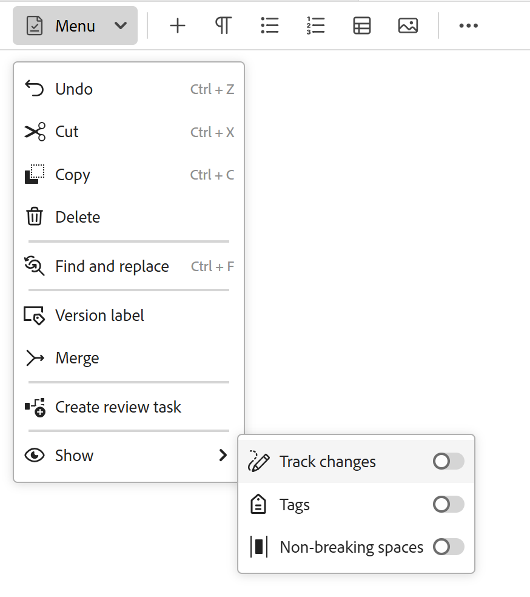{width="350"}

これらの機能の詳細な説明は次のとおりです。

**アクションの編集**

エディターでトピックを編集する際に、**カット**&#x200B;または&#x200B;***Ctrl***+***X***、**コピー**&#x200B;または&#x200B;***Ctrl***+***C***、**取り消し**&#x200B;または&#x200B;***Ctrl***+***Z***、**やり直し**&#x200B;または&#x200B;***Ctrl***&#x200B;および&#x200B;**メニュードロップダウンにある**&#x200B;を削除します。**&#x200B;**&#x200B;**

**検索と置換**

**検索と置換**&#x200B;機能は、作成者モードとSource ビューモードで使用できます。 有効にすると、トピック編集領域の下部に「検索と置換」テキストバーが表示されます。 ショートカットキー&#x200B;**CTRL**+**F**&#x200B;を使用して、検索と置換バーを呼び出すことができます。

設定アイコン \（\）を使用すると、**大文字と小文字を区別**&#x200B;および&#x200B;**単語全体のみ**&#x200B;検索オプションを切り替えることができます。 大文字と小文字を区別しない検索を実行するには、「**大文字と小文字を区別しない**」オプションを\（または選択\）します。 大文字と小文字を区別して検索する場合は、「**大文字と小文字を区別しない**」オプションを「\（または選択解除\）」オフにします。 また、単語全体を検索することもできます。

検索は瞬時に行われます。つまり、**検索** フィールドに検索語句または単語を入力すると、その語句は直ちに検索され、トピック内で選択されます。 同様に、トピック内のテキストを置き換えるには、検索キーワードとそれぞれのフィールドに置き換えを入力し、「**置換**」または「**すべて置換**」ボタンを選択します。

Source ビューでは、**検索と置換**&#x200B;機能は、特定の要素または属性を検索するのに非常に便利です。 例えば、`@product`属性の値を置き換える場合は、Source ビューから簡単に行えます。 作成者ビューでは、属性または要素に基づいて検索することはできません。 ただし、XML コードが上書きされる可能性があるため、**すべて置換**&#x200B;機能の使用中は注意が必要です。

**バージョン履歴**

エディターの&#x200B;**バージョン履歴**&#x200B;機能を使用すると、利用可能なDITA ファイルのバージョンを確認し、それらを比較して、エディター自体から任意のバージョンに戻すことができます。 現在のバージョンのコンテンツとメタデータ（作業コピーにもできます）を、同じファイルの以前のバージョンと比較できます。 比較したバージョンのラベルとコメントを表示することもできます。

>[!NOTE]
>
> バージョン履歴オプションは、トピックまたはマップの最初のバージョンに変更が加えられた場合にのみ表示されます。

    
 バージョン履歴にアクセスする手順 

1. エディターでトピックを開きます。
1. 「**メニュー**」ドロップダウンから「**バージョン履歴**」を選択します。

   **バージョン履歴** ダイアログボックスが表示されます。

   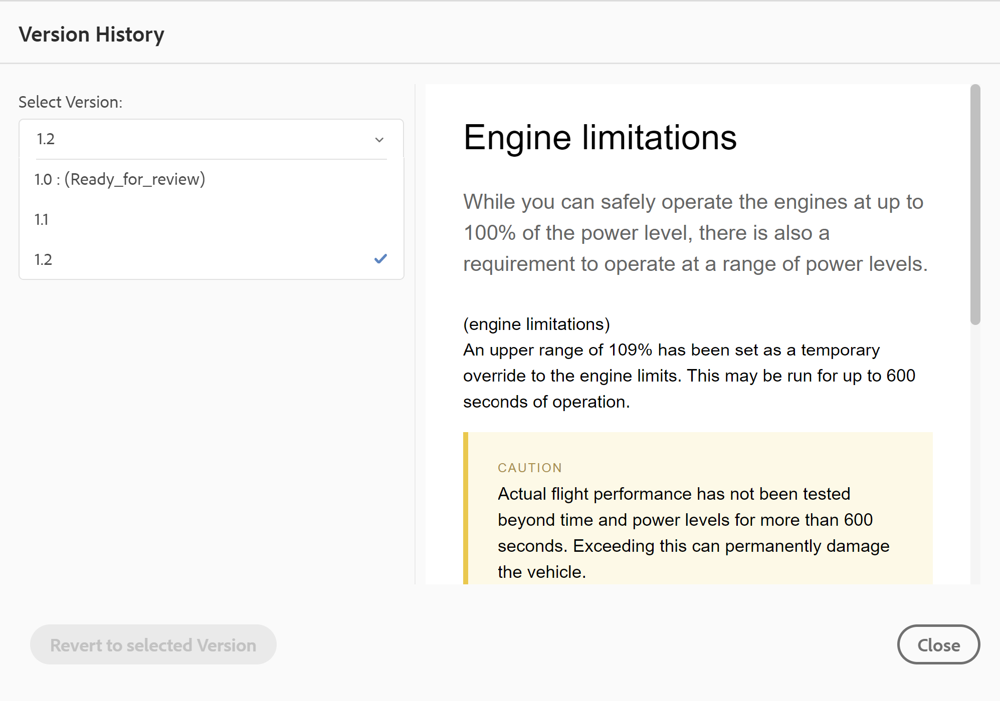{width="550"}

   *トピックの様々なバージョンの変更をプレビューします。*

1. **比較または元に戻すトピックのバージョンを**&#x200B;と比較ドロップダウンリストで選択します。

   >[!NOTE]
   >
   > バージョンにラベルが適用されている場合は、バージョン番号と共に\（括弧で囲んだ\）も表示されます。

1. 「**ラベルとコメントを表示**」オプションを有効にして、現在のバージョンと比較されたバージョンに適用されたラベルとコメントを表示します。
1. **バージョン履歴** ダイアログボックスでは、次の情報も表示できます。

   **プレビュー** タブ：新しく追加されたコンテンツは緑色のフォントで、削除されたコンテンツは赤色のフォントです。

   **メタデータ** タブ：新しく追加されたメタデータは緑色のフォントで、削除されたメタデータは赤色のフォントです。

   バージョン 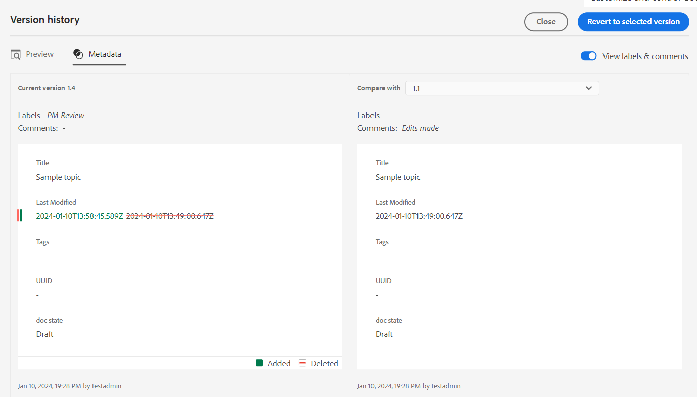{width="550"}の メタデータの違い

   *バージョン履歴の異なるバージョンのメタデータを比較します。*

   >[!NOTE]
   >
   > システム管理者は、**設定**&#x200B;の「メタデータ」タブから表示するメタデータを変更できます。 詳しくは、[&#x200B; タブバー](./web-editor-tab-bar.md)の&#x200B;**その他のアクション** セクションを参照してください。

   また、現在のバージョンと比較されたバージョンのユーザーと時間の詳細を表示することもできます。

   ドロップダウンリストからバージョンを選択すると、「**選択したバージョンに戻す**」オプションが使用可能になります。 プレビューウィンドウには、現在のバージョンと選択したバージョンのトピックの違いが表示されます。

1. 「**選択したバージョンに戻す**」を選択して、選択したバージョンのトピックで作業コピーを元に戻します。

   バージョンを元に戻すダイアログボックスが表示されます。

   {width="550"}

1. \（*オプション*\）以前のバージョンに戻す理由を指定します。 トピックの現在アクティブな作業コピーの新しいバージョンを作成することもできます。

1. 「**確認**」を選択します。

   ファイルの作業コピーが選択したバージョンに戻されます。 現在アクティブな作業コピーの新しいバージョンを作成する場合は、すべての作業の変更を含む新しいバージョンのファイルも作成されます。

   以前のバージョンに戻すと、現在作業中のバージョンが最新バージョンでないことを示す視覚的なキューが表示されます。

   { }

**バージョンラベル**

ラベルは、特定のトピックがDDLC \（ドキュメント開発ライフサイクル\）内にあるステージを特定するのに役立ちます。 例えば、トピックに取り組んでいる場合、ラベルを「承認済み」に設定できます。 トピックが公開され、顧客が利用できるようになったら、そのトピックに「リリース済み」ラベルを割り当てることができます。

Experience Manager Guidesでは、自由形式のテキストフォーマットでラベルを指定したり、定義済みのラベルのセットを使用したりできます。 カスタムラベルを使用すると、システム内の任意の作成者が、選択に従ってラベルを指定できます。 これにより柔軟性が得られますが、システム内に一貫性のないラベルが導入されます。 この問題を解決するために、管理者は定義済みのラベルのセットを設定できます。 定義済みラベルの設定について詳しくは、「Adobe Experience Manager Guides as a Cloud Serviceのインストールと設定」の「*XML Web Editorの設定とカスタマイズ」を参照してください。*

これらのラベルは、作成者がラベルを指定する必要がある場所に、ドロップダウンリストの形式で表示されます。 これにより、システムで事前定義された一貫性のあるラベルのみが使用されます。

Assets UIの[&#x200B; バージョン履歴](web-editor-use-label.md) パネル、[&#x200B; ベースライン &#x200B;](/help/product-guide/user-guide/generate-output-use-baseline-for-publishing.md) UIおよびエディターなど、トピックにラベルを適用する方法は様々です。 エディターのバージョンラベル機能を使用すると、トピックにラベルを素早く簡単に割り当てることができます。

    
 エディターからトピックにラベルを追加する手順 

1. エディターでトピックを開きます。

1. メニュードロップダウンから「**バージョンラベル**」を選択します。

   バージョンラベル管理ダイアログボックスが表示されます。

   {width="350"}

   バージョンラベル管理ダイアログボックスは2つの部分に分かれています。左側のパネルには、トピックで使用可能なバージョンのリストと、ラベルドロップダウンリスト \（またはラベルを入力するためのテキストボックス\）と、トピックのプレビューが表示された右側のパネルがあります。

1. ラベルを適用するバージョンを選択します。

   バージョンリストから別のバージョンのトピックを選択すると、プレビューパネルに、現在のバージョンと選択したバージョンのトピックの間の変更点が表示されます

   >[!NOTE]
   >
   > ラベルが既にバージョンに適用されている場合は、ドロップダウンリストのバージョン番号の横と「バージョンを選択」リストの下に表示されます。 ラベルの横にある\（**x**\） アイコンを選択して、既存のラベルを削除できます。

1. 管理者がラベルのリストを定義している場合、適用するラベルを選択できるラベルのドロップダウンリストが表示されます。 ドロップダウンリストから複数のラベルを選択できます。

   または、テキストボックスが表示され、トピックに追加するラベルを入力できます。

   >[!NOTE]
   >
   > トピックの複数のバージョンに同じラベルを適用することはできません。 既存のラベルを関連付けようとした場合は、既存のバージョンからラベルを削除し、選択したバージョンのトピックに適用するオプションが表示されます。

1. 「**ラベルを追加**」を選択します。

1. ラベルの適用の確認メッセージで、「**ラベルを移動（別のバージョンで使用する場合）**」オプションを選択して、ラベルを既存のバージョンから選択したバージョンに移動します。 このオプションを選択せず、トピックの別のバージョンに割り当てられているラベルがある場合は、選択したトピックのバージョンに移動されません。 このようなラベルは、ラベル適用プロセスでは無視されます。

**結合**

マルチオーサー環境で作業する場合、トピックやマップ内で他のオーサーが行った変更を追跡するのは困難になります。 結合機能を使用すると、変更を表示するだけでなく、最新バージョンの文書に保持されている変更を制御できます。

    
 トピックファイルを結合 

トピックの変更を結合するには、次の手順を実行します。

1. エディターでトピックを開きます。

1. 「**結合**」を選択します。

   結合ダイアログが表示されます。

   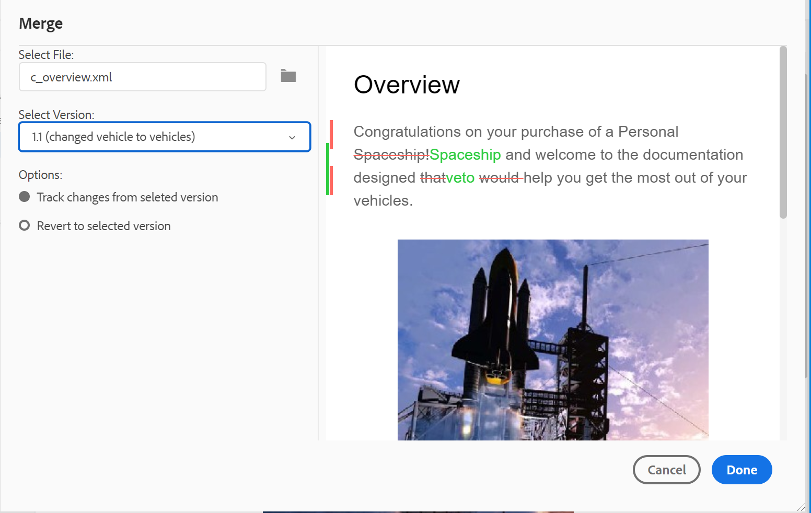{width="550"}

1. *\（Optional\）* リポジトリ内の別の場所から新しいファイルを参照して選択することもできます。

1. ファイルの現在のバージョンを比較するファイルのバージョンを選択します。

1. 「オプション」で、次を選択します。

   - **選択したバージョンからの変更履歴**：このオプションには、すべてのコンテンツ更新が変更履歴の形式で表示されます。 その後、文書内の変更を1回または1回で承認または却下できます。

   - **選択したバージョンに戻す**：このオプションは、ドキュメントの現在のバージョンを選択したバージョンに戻します。 このオプションでは、どのようなコンテンツが受け入れられるか、または拒否されるかを制御することはできません。

1. 「**完了**」を選択します。

1. 選択したバージョンから&#x200B;**変更履歴** オプションを選択した場合、選択したバージョンからのすべての変更が、右側のパネルの「変更履歴」機能に表示されます。

   変更履歴パネルからすべてのコメントを承認または却下するか、個別のコメントを承認または却下するかを選択できます。

    
 マップファイルを結合 

マップファイル内の変更を結合するには、次の手順を実行します。

1. エディターでマップを開きます。

1. 「**結合**」を選択します。

   結合ダイアログボックスが表示されます。

   {width="550"}

1. *\（Optional\）* リポジトリ内の別の場所から新しいファイルを参照して選択することもできます。

1. ファイルの現在のバージョンを比較するファイルのバージョンを選択します。

1. 「オプション」で、次を選択します。

   - **選択したバージョンからの変更を追跡**：このオプションには、すべてのコンテンツの更新が変更履歴の形式で表示されます。 その後、文書内の変更を1回または1回で承認または却下できます。

   - **選択したバージョンに戻す**：このオプションは、ドキュメントの現在のバージョンを選択したバージョンに戻します。 このオプションでは、どのようなコンテンツが受け入れられるか、または拒否されるかを制御することはできません。

1. 「**完了**」を選択します。

1. 選択したバージョン **から変更を追跡オプションを選択した場合、選択したバージョンからのすべての変更が、変更履歴パネル \（右側\）に表示されます。**

   変更履歴パネルからのすべての変更を承認または却下するか、マップファイル内の個別の変更を承認または却下するかを選択できます。

**レビュータスクの作成**

現在のトピックまたはマップファイルの[&#x200B; レビュータスク &#x200B;](./review-send-topics-for-review.md)をエディターから直接作成できます。 レビュータスクを作成するファイルを開き、メニューのドロップダウンから「**レビュータスクを作成**」を選択して、レビュー作成プロセスを開始します。

**メニューを表示**

表示メニューには、次の機能が含まれます。

- **変更履歴：**&#x200B;変更履歴モードを有効にすると、ドキュメントに加えられたすべての更新を追跡できます。 変更履歴を有効にすると、すべての挿入と削除がドキュメントに取り込まれます。 削除されたすべてのコンテンツは取り消し線を使用して強調表示され、すべての挿入は緑色のテキストで強調表示されます。 さらに、トピックページの端にある改訂バーも表示されます。 繰り返しますが、削除されたコンテンツには赤いバーが表示され、追加されたコンテンツには緑のバーが表示されます。 同じ行に追加と削除がある場合は、緑と赤のバーの両方が表示されます。
次のスクリーンショットは、削除および挿入されたコンテンツと改訂バーを強調表示しています。
  {width="650"}

  ドキュメント内の変更を追跡する一般的な使用例は、ピアレビューを行う場合です。 変更履歴を有効にしてレビュー用にドキュメントを共有すると、変更履歴をオンにしてレビュアーが変更を加えます。 ドキュメントを受け取ったら、変更を承認または却下する便利な方法とともに、提案された更新を表示するメカニズムが必要です。

  Experience Manager Guidesには、ドキュメントで行われた更新に関する情報を含む変更履歴の機能が用意されています。 変更履歴は、どの更新が行われ、誰がその更新を行い、いつ更新されたかについての情報を提供します。 「変更履歴」機能を使用すると、ドキュメント内の提案された更新を簡単に承認または拒否できます。

  機能にアクセスするには、右側のパネルで「**変更を追跡**」アイコンを選択します。

  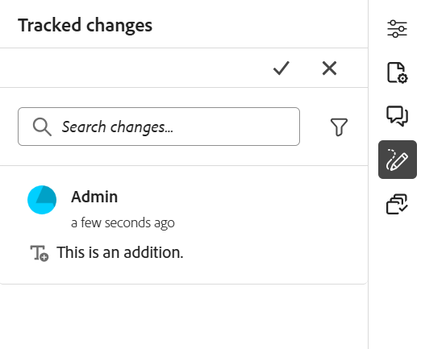{width="300"}

  変更履歴を選択すると、文書内の変更されたコンテンツが選択されます。 変更を受け入れるには、「変更を受け入れる」アイコンを選択するか、「変更を却下」を選択して変更を却下します。

  ワンクリックですべての変更を承認または拒否する場合は、「**すべての変更を承認**」または「**すべての変更を拒否**」を選択します。

  >[!NOTE]
  >
  > プレビューモードでは、変更されたコンテンツのマークアップの有無にかかわらず、ドキュメントを表示できます。 詳細については、[&#x200B; プレビュー](web-editor-views.md#preview-mode) モードを参照してください。

- **タグ：** エディターの&#x200B;**タグ**&#x200B;機能は、DITA要素の表示を制御するトグルボタンです。 有効にすると、コンテンツ内に構造タグが表示され、基礎となるDITA要素をより効果的に表示および管理できます。 無効にすると、エディターはこれらのタグを非表示にし、よりクリーンで集中的なオーサリング環境を提供します。

  次のスクリーンショットは、タグビューが有効になっているドキュメントを示しています。

  {width="650"}

  タグ付きのドキュメントでは、次の操作を実行できます。

   - **要素を選択**：要素の開始タグまたは終了タグを選択して、そのコンテンツを選択します。

   - **タグを展開または折りたたむ**: タグを展開または折りたたむには、「+」または「 – 」記号を選択します。

   - **コンテキストメニューを使用**：コンテキストメニューには、選択した要素をカット、コピー、またはペーストするオプションが表示されます。 選択したエレメントの前または後にエレメントを挿入することもできます。 その他のオプションを使用すると、IDを生成したり、選択した要素のプロパティパネルを開いたりできます。

   - **エレメントのドラッグ&amp;ドロップ**：エレメントのタグを選択し、ドキュメントに簡単にドラッグ&amp;ドロップできます。 ドロップ場所がエレメントが許可される有効な場所である場合、エレメントはドロップ場所に配置されます。

  >[!NOTE]
  >
  > ユーザーがエディターからタグビューを有効にした場合、セッション全体でも有効のままになります。 これは、後でタグビューにアクセスするために、もう一度タグビューを有効にする必要がないことを意味します。 新しいユーザーのセッションのタグビューのデフォルト値は、`ui\_config.json` ファイルの`tagsView` プロパティによって決まります。 詳しくは、「Adobe Experience Manager Guides as a Cloud Serviceのインストールと設定」の「[&#x200B; タグビューのデフォルト値の設定](../cs-install-guide/configure-default-value-tags-view.md)」セクションを参照してください。

- **改行なしスペース：**&#x200B;このオプションを有効にすると、エディターで編集する際に、改行なしスペースのインジケーターが表示されます。 DITA トピックおよびDITA マップの&#x200B;**作成者** ビューでのみ表示されます。

## コンテンツ挿入オプション

**要素** - 

現在または次の有効な場所に有効な要素を挿入します。 キーボードショートカット ***Alt***+***Enter***&#x200B;を使用して、エレメントダイアログボックスを開くこともできます。 例えば、段落を編集している場合、**要素** ダイアログボックスに、段落に挿入できる要素のリストが表示されます。 挿入するエレメントを選択します。 キーボードを使用してエレメントのリストをスクロールし、***Enter***&#x200B;を押して必要なエレメントを挿入できます。

有効なエレメントは、次の2種類があります。

- **現在の場所の有効な要素**：現在のカーソルの場所に挿入できる要素がリストに表示されます。

- **現在の場所の外部にある有効な要素**：このリストには、エレメント階層内の現在の要素に対する親のいずれかの後に挿入できる要素が表示されます。

例えば、インライン `<b>`要素内にいる場合は、現在の場所に`<u>`、`<xref>`、`<i>`などの要素を挿入できます。 対照的に、`<table>`や`<topic>`などの要素を現在の場所の外に挿入することもできます。

検索ボックスに文字または文字列を入力して、その文字で始まる要素を検索することもできます。

{width="300"}

*tと入力して、&#39;t&#39;で始まるすべての有効な要素を検索します。*

`note`などのブロック要素の内部で作業している場合は、要素を挿入アイコンを使用して、`note`要素の後に新しい要素を挿入します。 次のスクリーンショットでは、p \（paragraph\）要素の中にメモ要素が挿入されています。

{ }

ノート要素でEnter キーを押すと、ノート要素自体に新しい段落が作成されます。 ノートの外側に新しいエレメントを挿入するには、エレメントのパンくずリストでp エレメント \（スクリーンショットで強調表示\）を選択し、エレメントアイコンを選択するか、***Alt***+***Enter***&#x200B;を押してエレメントを挿入ダイアログボックスを開きます。 次に、目的のエレメントを選択し、Enter キーを押して、選択したエレメントをノートエレメントの後に挿入します。

点滅するブロックカーソルが表示されたときに、2つのエレメント間にエレメントを追加することもできます。

{width="300"}

例えば、DITA トピックを扱っていて、ブロックカーソルが短い説明と本文の間で点滅している場合、`prolog`要素を追加してから、著作権、作成者、その他の詳細を追加できます。

新しいエレメントを入力するもうひとつの方法は、コンテキストメニューを使用することです。 文書内の任意の場所を右クリックして、コンテキストメニューを呼び出します。 このメニューから「**エレメントを挿入**」を選択して、**エレメントを挿入** ダイアログボックスを表示し、挿入するエレメントを選択します。

{width="300"}

**段落** - 

現在または次の有効な場所に段落エレメントを挿入します。

**箇条書きリスト** - 

現在または次の有効な場所に箇条書きリストを作成します。 箇条書きリストを使用してこのアイコンを選択すると、その項目は通常の段落に変換されます。

**番号付きリスト** - 

現在または次の有効な場所に番号付きリストを作成します。 番号付きリストを使用してこのアイコンを選択すると、その項目は通常の段落に変換されます。

>[!NOTE]
>
>リスト項目のコンテキストメニューから「**リストを分割**」オプションを選択して、現在のリストを分割し、同じレベルで新しいリストを開始することもできます。

**表** - 

現在または次の有効な場所にテーブルを挿入します。 表アイコンを選択して、単純な表を挿入ダイアログボックスを開きます。

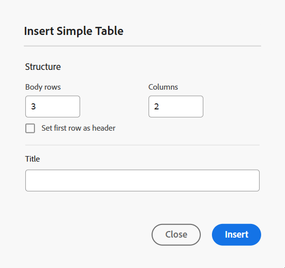{width="550"}

>[!NOTE]
>
> Microsoft WordまたはExcelから表をコピーして、Experience Manager Guides トピックファイルに貼り付けることもできます。 コピーしたテーブルは、XML エディター設定で設定された設定に応じて`<simpletable>`または`<tgroup>`として貼り付けられます。 詳細については、[貼り付けられたテーブルの表示を設定](../cs-install-guide/conf-pasted-tables.md)を参照してください。

テーブルに必要な行と列の数を指定できます。 最初の行をテーブルヘッダーとして保持する場合は、「**最初の行をヘッダーとして設定**」オプションを選択します。 表にタイトルを追加するには、「タイトル」フィールドにタイトルを入力します。

表を挿入したら、コンテキストメニューを使用して表を変更できます。

{width="550"}

テーブルのコンテキストメニューを使用すると、次のことが可能になります。

- セル、行または列の挿入

- セルを右方向と下方向に結合

- セルを水平方向または垂直方向に分割

- セル、行または列の削除

- IDの生成

    
 表の複数のセル、行全体または列の属性を定義します 

また、複数のセル、行全体、またはテーブルの列に対して属性を定義することもできます。 例えば、表のセルを整列させるには、目的のセルをドラッグして選択します。 コンテンツのプロパティパネル（右側）で、プロパティ **Type**&#x200B;が&#x200B;**entry**&#x200B;に変わります。

1. **属性** セクションで、**+追加**&#x200B;を選択します。
1. **属性** ドロップダウンリストから`@valign`属性を選択します。
1. 値ドロップダウンリストから、選択した表セルに適用するテキストの整列を選択します。
1. **追加を選択してください。**

{ }

**画像** - 

現在または次の有効な場所に画像を挿入します。 画像アイコンを選択して画像を挿入ダイアログを開き、挿入する画像を検索して選択します。

>[!NOTE]
>
> ローカルシステムから記事に画像をドラッグ&amp;ドロップして、画像を追加することもできます。 この場合、画像ファイルは&#x200B;**Assetsをアップロード** ワークフローを使用して追加されます。  詳しくは、[左パネル &#x200B;](./web-editor-left-panel.md) セクションの「**Assets**&#x200B;をアップロード」ワークフローを参照してください。

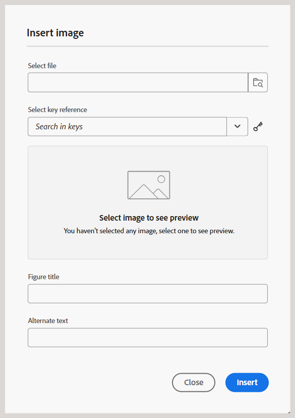{width="300"}

**ファイルを選択** ダイアログで、**リポジトリ**&#x200B;または&#x200B;**コレクション**&#x200B;から必要な画像ファイルを参照できます。

>[!NOTE]
>
> ファイルとフォルダーのパスブラウザーは、Experience Manager Guides as a Cloud Service 2601 リリースで刷新されたUIで導入されました。 新しいインターフェイスはデフォルトで有効になっています。 これらの更新なしで既存のUIを引き続き使用する場合は、カスタマーサクセス部門に連絡して、この新しい機能強化を無効にするように依頼してください。

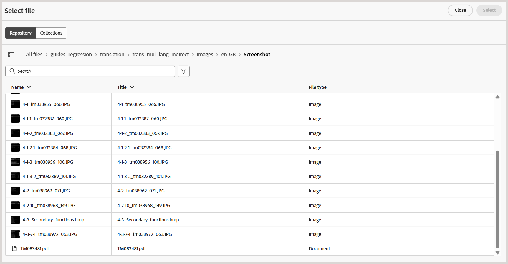

上部のパンくずリストと左側のフォルダーナビゲーションパネルを使用すると、フォルダー内を簡単に移動できます。

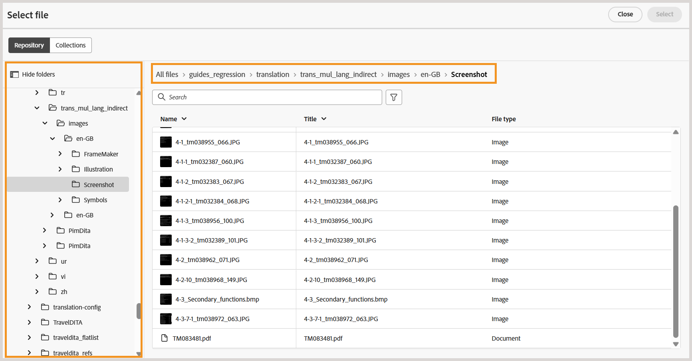

必要な画像ファイルは、ファイル名、ファイルタイトル、コンテンツで検索できます。 検索結果は、パス\（検索する\）、ドキュメントの状態、ロック済み、最終変更済み、およびタグでフィルタリングすることもできます。 ファイル形式フィルターは&#x200B;**Images**&#x200B;に事前に適用されており、有効なファイル選択を許可するために、他のファイル形式では無効のままです。 このパスブラウザーでのフィルターの使用について詳しくは、[&#x200B; エディターのその他の機能](./web-editor-other-features.md)を参照してください。

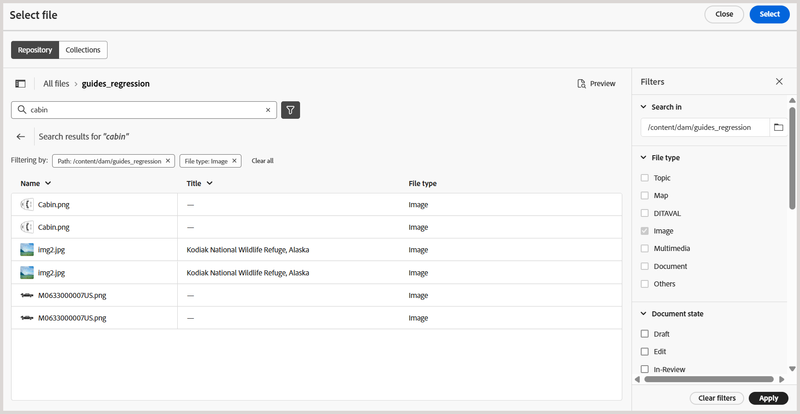

必要な画像ファイルが見つかったら、ファイルを選択し、**選択**&#x200B;を選択して文書に画像を挿入します。 `.png`、`.svg`、`.gif`、`.jpg`、`.eps`、`.ai`、`.psd`など、様々な形式の画像ファイルを挿入できます。

画像の挿入ダイアログで、画像/図のタイトルと代替テキストを画像に追加することもできます。

>[!NOTE]
>
> 画像を挿入し、その代替テキストを指定すると、最新のDITA規格に従って`<alt>`要素内に追加されます。 代替テキストに`@alt`属性を使用することは推奨されませんが、以前のDITA バージョンでは引き続きサポートされています。

画像を挿入したら、コンテンツプロパティパネルから高さ、幅、配置、属性を変更できます。 画像ファイルを選択し、右側のパネルのコンテンツプロパティパネルで変更を行います。

{ }

Source フィールドには、挿入された画像ファイルのUUIDが表示されます。 Source フィールドの上にマウスポインターを置くと、挿入された画像ファイルのパス全体を確認できます。 パスがツールチップに表示されます。

画像ファイルに「高さ」または「幅」の値を指定することで、画像のサイズを変更できます。 画像の縦横比は自動的に維持されます。 必要に応じて、ロックアイコン\（縦横比を維持\）を選択し、「高さ」と「幅」の値を指定して、画像ファイルの縦横比を維持しないように選択することもできます。

画像の配置設定をインラインまたはブレークとして指定することもできます。 「配置を分割」オプションを使用する場合は、画像を整列させる場所（左、中央、または右）を選択できます。

**属性** フィールドで必要なプロパティを選択して、画像ファイルの他のプロパティを追加することもできます。

>[!NOTE]
>
>画像内のクリック可能な領域\（画像マップ\）を定義することもできます。 詳しくは、[左パネル &#x200B;](web-editor-left-panel.md) セクションの&#x200B;**画像マップの挿入/編集**&#x200B;機能の説明を参照してください。

**画像またはメディアファイルのコンテキストメニュー**

また、コンテキストメニューを使用して、画像やメディアファイルに対して一般的な操作を実行することもできます。 画像上の任意の場所を右クリックして、コンテキストメニューを呼び出します。

コンテキストメニューには、画像またはメディアをカット、コピー、またはペーストするオプションが用意されています。 選択したエレメントの前または後にエレメントを挿入できます。 また、エレメントの名前を変更したり、ラップを解除したりするオプションもあります。 選択した画像またはメディアをリポジトリ内で見つけるか、Assets UIでファイルのプレビューを表示できます。

コンテキストメニューの他のオプションでは、パスのコピー、画像マップの編集、エレメントの名前の変更、スニペットの作成、選択したエレメントのIDの生成を行うことができます。

**画像マップの挿入/編集**

選択した画像上に画像マップを挿入します。 トピックやweb ページにリンクするクリック可能な領域を持つ画像は、画像マップと呼ばれます。

現在のトピックで画像を選択し、挿入/画像マップを編集アイコンを選択して、画像マップを挿入ダイアログボックスを開きます。

{width="650"}

リンクとして使用する画像の上の領域を定義するには、目的のシェイプ長方形、円、または多角形を選択します。 領域を定義すると、参照ダイアログが表示され、内部コンテンツまたは外部コンテンツへのリンクを指定する必要があります。

{width="350"}

領域が重なっている場合は、ツールバーのそれぞれのアイコンをクリックして、シェイプを前面に移動したり、背面に移動したりできます。 領域を選択して「削除」アイコンをクリックすると、領域を削除することもできます。 領域をダブルクリックすると、参照ダイアログが開き、宛先リンクを変更できます。 画像上の必要な領域をマークしたら、**完了**&#x200B;を選択して変更を保存します。

**マルチメディア**

様々なタイプのマルチメディアファイルを挿入します。 マルチメディアドロップダウンアイコンを選択し、挿入するファイルのタイプを選択します。 サポートされているマルチメディア形式は次のとおりです。

- オーディオファイル
- ビデオファイル
- YouTube
- ヴィメオ

オーディオまたはビデオファイル オプションを選択すると、**ファイルを選択** ダイアログが表示され、リポジトリまたはコレクションから目的のファイルを参照して選択できます。

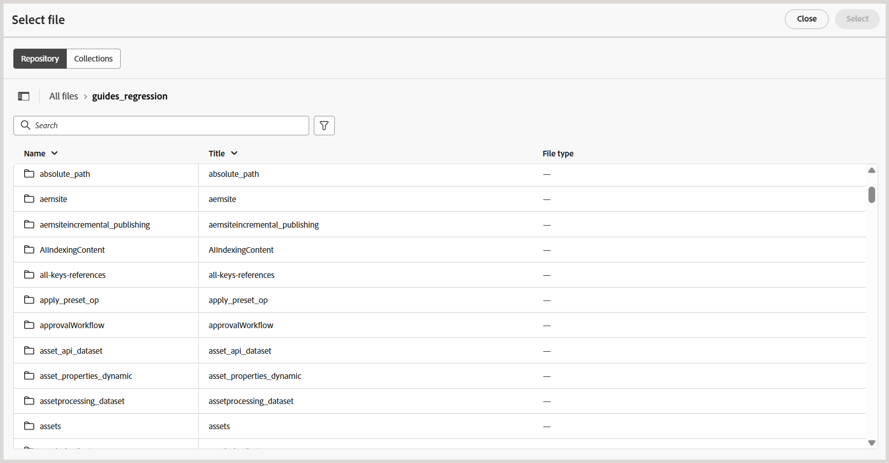{width="650"}

YouTubeまたはVimeoを選択すると、**マルチメディアを挿入** ダイアログが表示されます。 「Web リンク」フィールドにビデオファイルのリンクを貼り付け、「挿入」を選択して、ドキュメントの現在または次の有効な場所にビデオを追加します。

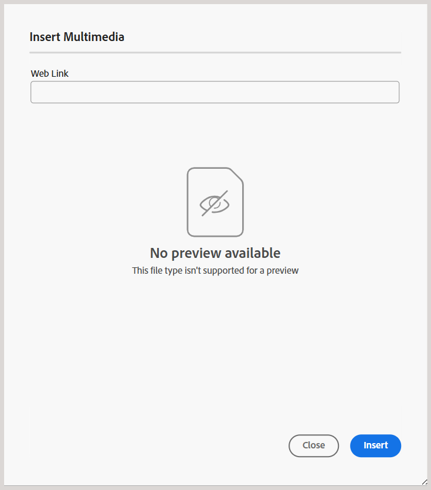{width="350"}

>[!NOTE]
>
> YouTube ビデオリンクの追加中に、URLの文字列`watch?v=`を`embed`に置き換える必要があります。 例えば、次のYouTube ビデオリンクを追加するには、次のように追加する必要があります：`https://www.youtube.com/**embed/**WlIKQOrmZcs`。 `https://www.youtube.com/**watch?v**=WlIKQOrmZcs`この変更により、ビデオがAEM サイトとPDF出力に確実に埋め込まれます。

また、**マルチメディアを挿入** ダイアログからオーディオまたはビデオファイルを追加することもできます。 「オーディオ/ビデオファイル」オプションを選択し、参照アイコンを選択してリポジトリビューを起動します。 リポジトリからオーディオまたはビデオファイルを選択し、**選択**&#x200B;を選択して、オーディオ/ビデオファイル フィールドにファイルのリンクを追加します。 ビデオファイルを選択した場合、ファイルのプレビューもプレビュー領域に表示されます。 プレビューを表示するには、ビデオファイルを再生します。

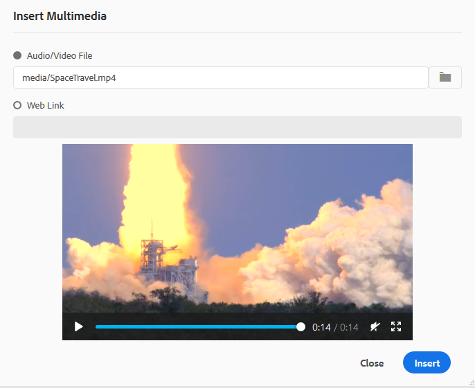{width="650"}

**相互参照**

タイプの参照（コンテンツ参照、コンテンツキー参照、キー参照、ファイル参照、Web リンク、メールリンク）を挿入します。

**ファイルを選択** アイコン \（コンテンツ参照とファイル参照\）または&#x200B;**ルートマップ** アイコン \（コンテンツキー参照とキー参照\）を選択し、リンク先のファイルまたはコンテンツを選択します。

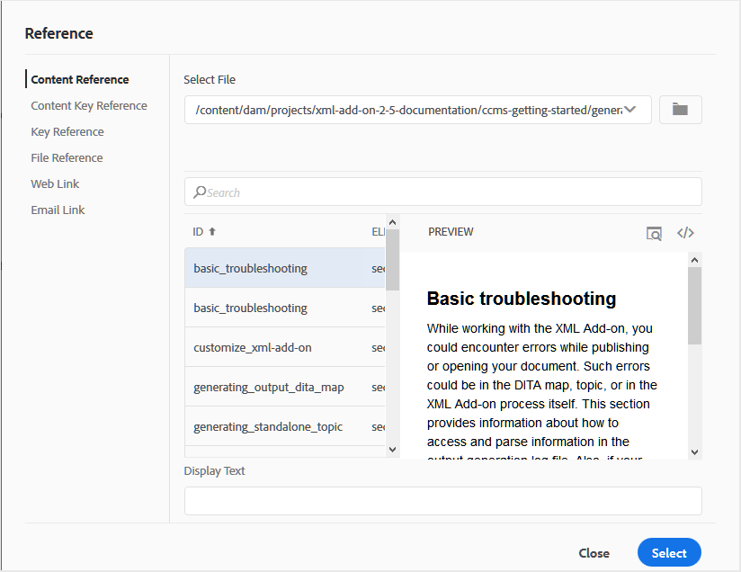{width="650"}

選択した参照のリンクが文書に追加されます。 リンクのコンテキストメニューでは、次のオプションを使用できます。

- **エレメントを挿入**：指定されたコンテキストで挿入できる有効なエレメントのリストを表示します。
- **UUIDをコピー**：挿入された参照のUUIDをコピーします。
- **パスをコピー**：挿入された参照の完全なパスをコピーします。
- **Generate ID**：挿入された参照の一意のIDを生成します。

参照するファイルのUUIDを使用して検索することもできます。 コンテンツとキー参照リンクの場合は、リンク先のファイルのUUIDを入力すると、ファイルが自動的に検索され、「プレビュー」セクションに表示されます。 ファイルのUUIDを指定する場合、.xml ファイルのファイル拡張子を明示的に指定する必要はありません。 .xml拡張子は、UUIDに自動的に追加されます。

{width="650"}

管理者が&#x200B;*XMLEditorConfig*&#x200B;でUUID オプションを有効にしている場合、**Link** プロパティで参照コンテンツのUUIDを表示します。

>[!IMPORTANT]
>
> 標準のDITA動作では、外部リソースへの参照のみを目的としているため、scope=`external`属性を内部リンクに適用しないでください。 この属性を内部リンクに適用すると、ワークフローが中断される可能性があります。 Experience Manager Guidesで管理されているコンテンツの場合は、代わりにデフォルトのscope=`local`またはキーベースの参照を使用します。

{ }

>[!NOTE]
>
> **UUIDs**&#x200B;を有効にするオプションが有効になっていない場合は、参照されているコンテンツの相対パスが表示されます。

>[!IMPORTANT]
>
> 参照されたコンテンツの相対パスが&#x200B;**Link** プロパティに表示されますが、内部的には、参照されたコンテンツのUUIDを使用してリンクが作成されます。

>[!TIP]
>
> コンテンツの参照に関するベストプラクティスについては、ベストプラクティスガイドの「参照」セクションを参照してください。

**リポジトリビューでのフィルター検索**

**ファイルを選択** ダイアログで、**リポジトリ**&#x200B;の選択したパスにあるファイル内のテキストを検索できます。 例えば、以下のスクリーンショットで&#x200B;*ブレーキ*&#x200B;が検索されます。

>[!NOTE]
>
> Experience Manager Guides as a Cloud Service 2601 リリースのUIを刷新して、ファイルとパス ブラウザーを導入しました。 新しいインターフェイスはデフォルトで有効になっています。 これらの更新なしで既存のUIを引き続き使用する場合は、カスタマーサクセス部門に連絡して、この新しい機能強化を無効にするように依頼してください。

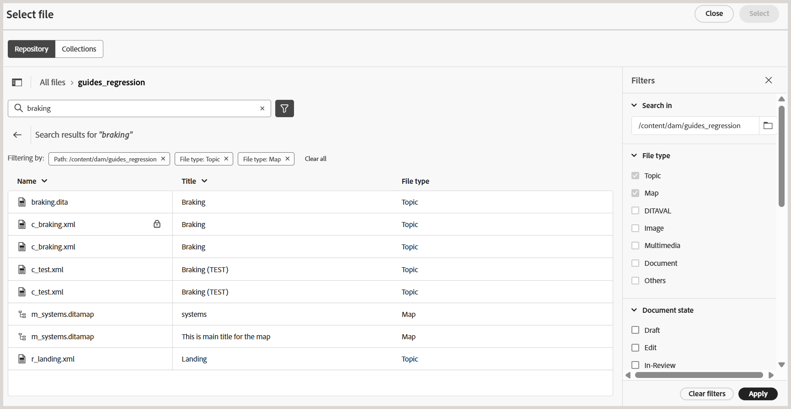{width="650"}

上部のパンくずリストと左側のフォルダーナビゲーションパネルを使用すると、フォルダー内を簡単に移動できます。

必要なファイルをファイル名、ファイル名、コンテンツで検索できます。 右側のパネルの強化されたフィルターを使用して、検索を絞り込むこともできます。 詳細については、[&#x200B; エディターのその他の機能](./web-editor-other-features.md)を参照してください。

検索したテキストを含むフィルター処理されたファイルのリストが表示されます。 ファイルの内容をプレビューすることもできます。

>[!NOTE]
>
> システム管理者は、テキストフィルターを設定したり、他のフィルターを表示または非表示にしたりすることもできます。 詳しくは、「Adobe Experience Manager Guides as a Cloud Serviceのインストールと設定」の「*テキストフィルターの設定*」セクションを参照してください。

**再利用可能なコンテンツ** - 

プロジェクト内の他のドキュメント内に存在するコンテンツを再利用します。 コンテンツを挿入するには、ファイル内のコンテンツに直接リンクするか、キー参照を使用して、[&#x200B; キー参照を解決](map-editor-other-features.md#id176GD01H05Z)します。 コンテンツを再利用アイコンを選択すると、コンテンツを再利用ダイアログボックスが表示されます。

{width="650"}

コンテンツを再利用ダイアログボックスで、ファイル参照用のDITA ファイルまたはキー参照を含むDITA マップファイルを選択します。 選択すると、トピックまたはキー参照がダイアログに表示されます。 挿入するトピックのID/キーを選択し、**完了**&#x200B;を選択してトピック内にコンテンツを挿入できます。

コンテンツ参照を挿入する場合は、ファイルのUUIDを入力することもできます。そのファイルの再利用可能なコンテンツは、「プレビュー」セクションに一覧表示されます。

リンクを挿入する設定に基づいて、挿入されたコンテンツのUUIDまたはプロパティパネルまたはSource コードビューの相対パスを表示できます。 リンクは常に、参照されたコンテンツのUUIDを使用して作成されます。 *UUID ベースのリンクの設定*&#x200B;を「Adobe Experience Manager Guides as a Cloud Serviceのインストールと設定」で表示します。

>[!NOTE]
>
> 参照されたコンテンツの前後にコンテンツを追加するには、*Alt*+*Left*&#x200B;矢印キーまたはAlt+*Right*&#x200B;矢印キーを使用して、カーソルを目的の場所に移動します。

また、参照されたコンテンツを右クリックし、コンテキストメニューから「**参照をコンテンツに置き換え**」を選択することで、トピック内に参照されたコンテンツを埋め込むこともできます。

**シンボル** - 

トピックに特殊文字を挿入します。 シンボルアイコンを選択して、特殊文字を挿入ダイアログボックスを開きます。

>[!NOTE]
>
> Experience Manager Guidesには、移動可能でサイズ変更可能なダイアログボックスが用意されています。 右下隅に2本の十字線があるダイアログのサイズを変更できます。 特殊文字ダイアログのクロスラインを以下に示します。

{width="350"}

特殊文字を挿入ダイアログボックスでは、特殊文字の名前を使用して特殊文字を検索できます。 すべての特殊文字は、様々なカテゴリに格納されます。 「カテゴリを選択」ドロップダウンリストを使用して、カテゴリを選択します。 選択したカテゴリ内で使用可能な特殊文字が表示されます。 矢印キーを使用して特殊文字のリストを移動したり、挿入する目的の文字を選択したりできます。 選択した特殊文字の名前と16進コードがリストの下に表示されます。 **挿入**&#x200B;を選択して、選択した文字を文書に挿入します。

**キーワード** - 

DITA マップで定義されたキーワードを挿入します。 キーワードオプションを選択して、キー参照ダイアログボックスを開きます。

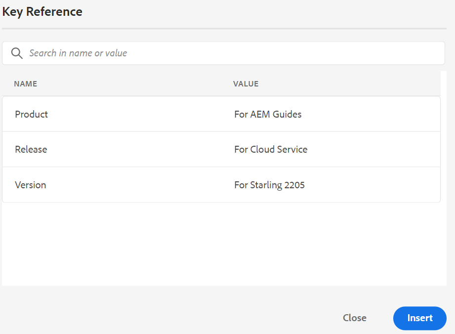{width="550"}

キーワードはアルファベット順にリストされ、検索ボックスに検索文字列を入力してキーワード\（s\）を検索することもできます。 検索結果は、IDまたは値の文字列を含むキーワードを返します。 DITA マップで定義されたキーワードがこのダイアログに表示されます。 挿入するキーワードを選択し、**挿入**&#x200B;を選択します。

また、キーワードを右クリックして「属性」オプションを選択すると、挿入したキーワードの属性を変更できます。 「**キーワードの属性**」ダイアログボックスが開きます。

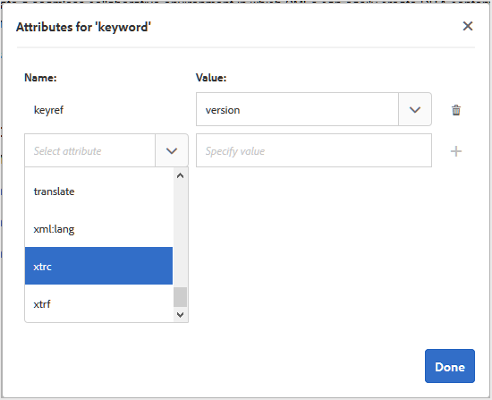{width="550"}

キーワードの属性を変更したり、キーワードに新しい属性を追加したりできます。

**スニペット** - 

現在または次に有効な場所にスニペットを挿入します。 この機能が機能するには、システムでスニペットを定義する必要があります。 スニペットの追加について詳しくは、[左パネル &#x200B;](./web-editor-left-panel.md) セクションの&#x200B;**スニペット**&#x200B;機能の説明を参照してください。

「スニペット」オプションを選択すると、「スニペットを挿入」カタログが表示されます。 カタログはコンテキストに依存するため、現在の場所で許可されている場合にのみスニペットが表示されることを示します。

次の例は、文書内の現在の場所に挿入できる2つの事前設定済みのスニペットである「警告」と「エラー」を示しています。

{width="300"}

リストからスニペットを選択すると、ドキュメント内の現在または次の有効な場所に挿入されます。 次のスクリーンショットは、ドキュメントに挿入されたエラースニペットを示しています。

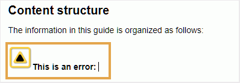{width="400"}

**引用** - 

引用を作成し、コンテンツに追加します。 コンテンツ [&#128279;](./web-editor-apply-citations.md)の引用を追加および管理する方法について説明します。

**データのクエリ** - 

データソースに接続し、データを利用してコンテンツを作成します。 [データソースからデータを使用](./web-editor-content-snippet.md)する方法を参照してください。

## バージョン情報と新しいバージョンとして保存

**バージョン情報と新しいバージョンとして保存**&#x200B;機能は、バージョンの追跡とコンテンツの保存を単一の機能に統合します。

- バージョン情報には、トピックまたはマップの現在のバージョンが表示されます。 バージョン番号の横にアスタリスク（*）が表示され、保存されていない変更が示されます。

  バージョン番号は、トピックファイルまたはマップファイル用に作成された新しいバージョンごとに変更されます。 新しく作成したドキュメントを操作している場合、バージョン情報は&#x200B;**none**&#x200B;と表示されます。

  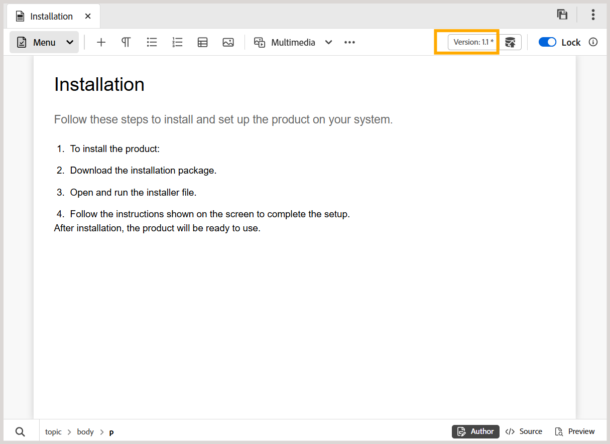{ }

- **新しいバージョンとして保存**&#x200B;は、トピックで行った変更を保存し、トピックの新しいバージョンも作成するボタンです。

  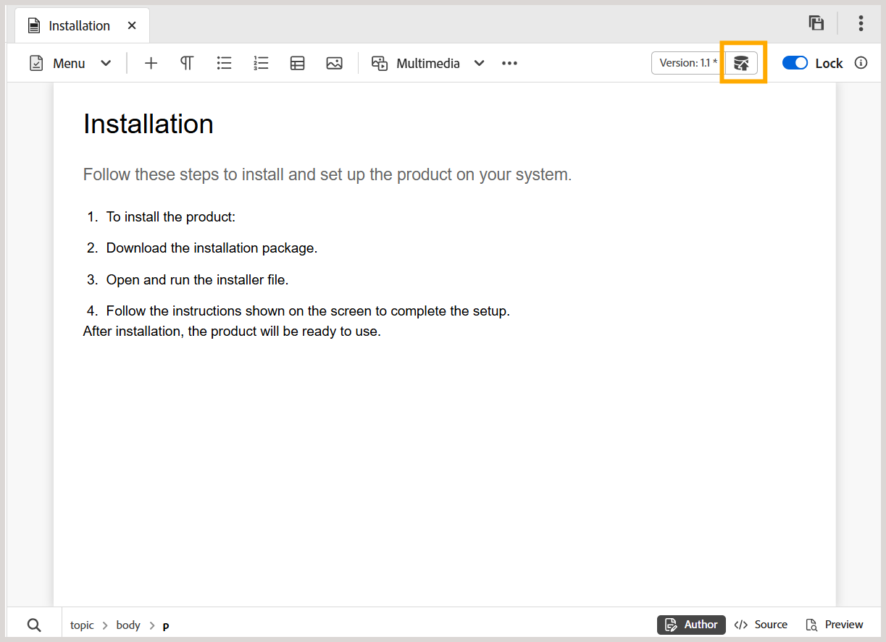{ }

**新しいバージョンとして保存**&#x200B;を使用してトピックまたはマップを保存することを選択すると、次のダイアログボックスが表示されます。

{width="300"}

コメントとバージョンラベルを入力して変更を特定し、**保存**&#x200B;を選択して、ファイルの新しいバージョンを作成します。

「**新しいバージョンとして保存**」オプションを選択すると、トピックの最初のバージョンがDAMで作成され、これはトピックの現在アクティブなバージョンにもなります。 後で、古いバージョンのトピックに戻すと、それが現在アクティブなバージョンのトピックになります。

管理者がバージョンのラベルを事前に設定している場合は、そのラベルをドロップダウンリストで表示します。 使用可能なラベルのリストからラベルを選択し、ドキュメントを保存できます。

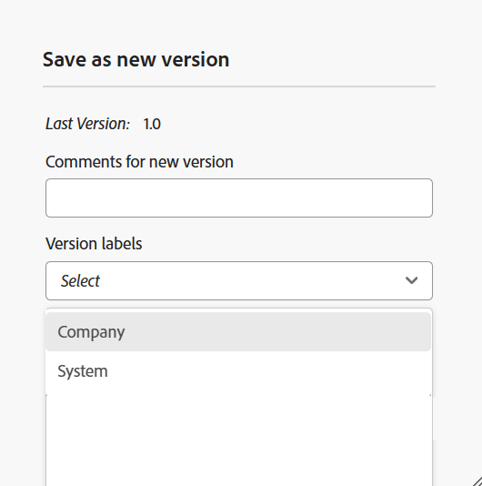{width="300"}

トピックの保存時に、トピックで行った変更を指定してコメントを追加できます。 このコメントは、トピックのバージョン履歴に表示されます。

トピックがレビュー中の場合、レビュー担当者には、新しいバージョンのトピックが利用可能であることを知らせる通知が届きます。 ドキュメントの最新リビジョンに簡単にアクセスして、トピックの最新バージョンを引き続き確認できます。

トピックのタイトルにポインターを合わせると、ファイルタイトル、ファイルパス、バージョン番号が表示されます。

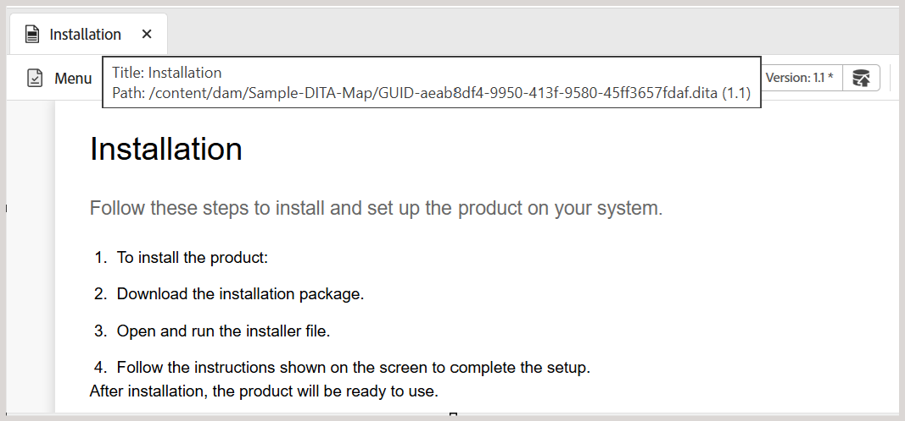{ }

>[!NOTE]
>
> トピックのバージョンが利用可能になると、トピックにラベルを追加することもできます。 これらのラベルを使用して、ドキュメントの特定のバージョンを公開するためのベースラインを作成できます。 トピックでのラベルの使用について詳しくは、[&#x200B; ラベルの使用](web-editor-use-label.md#)を参照してください。

## ロック/ロック解除

現在のファイルをロックまたはロック解除します。 ファイルをロックすると、ファイルへの排他的な書き込みアクセス権が付与されます。 これにより、他のユーザーによるファイルの編集が制限されます。 他のユーザーに編集アクセス権を付与する場合は、ファイルのロックを解除します。 ファイルのロックが解除されると、変更内容は現在のバージョンのファイルに保存されます。

{ }

マップビューで親マップを展開している場合は、1回クリックするだけでマップ内のすべてのファイルをロックできます。 親マップファイルを展開して親ファイルを選択するだけで、マップ内のすべてのファイルが選択されます。 次に、**ロック** を選択して、マップ内のすべてのファイルのロックを取得できます。

リポジトリーパネルには、ロックされたファイルがロックアイコンで表示されます。 このロックアイコンの上にマウスポインターを置くと、「自分でロック済み/ユーザー名」がツールチップとして表示されます。

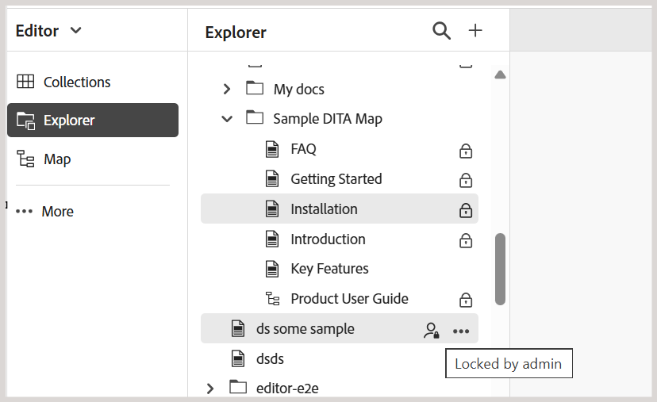{width="350"}

ファイルが別のユーザーによってロックされている場合、リポジトリのロックアイコンにカーソルを合わせると、そのファイルをロックしたユーザーの名前が表示されます。 この場合、ファイルは読み取り専用モードで開き、バージョン情報の横に&#x200B;**読み取り専用アクセス**&#x200B;が表示されます。

管理者は、他のユーザーがロックしたファイルのロックを解除できる&#x200B;**強制ロック解除**&#x200B;機能にもアクセスできます。 この機能を使用すると、他のユーザーがロックしているファイルの編集権限にアクセスできます。

{width="350"}
**親トピック：**&#x200B;[&#x200B;編集者の概要](web-editor.md)
