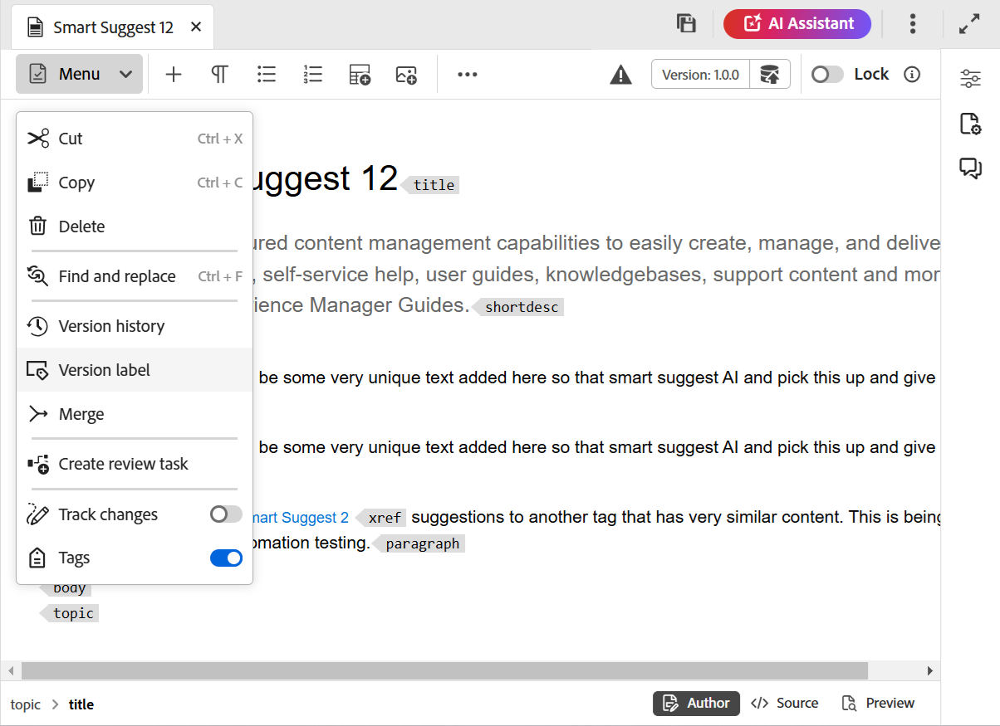

# ラベルを使用 {#id164JBG0M0T1}

Adobe Experience Manager Guidesでは、ファイルの様々なバージョンにラベルを追加できます。 これらのラベルを使用して、公開用のベースラインに含めるバージョンを指定できます。 ラベルを使用してベースラインを作成する方法について詳しくは、[ ベースラインを使用した作業](generate-output-use-baseline-for-publishing.md#)を参照してください。

例えば、*リリース 2.0*&#x200B;の&#x200B;*リリース 1.0*&#x200B;のトピックの&#x200B;*バージョン 1.0*&#x200B;と同じトピックの&#x200B;*バージョン 1.1*&#x200B;を使用する場合、*バージョン 1.1*&#x200B;の&#x200B;*バージョン 1.0*&#x200B;と&#x200B;*リリース 2.0*&#x200B;のラベルに&#x200B;*リリース 1.0*&#x200B;のラベルを追加できます。

ラベルを追加したら、ベースラインを作成し、そのベースラインを使用して公開するトピックのバージョンを指定できます。 ベースラインに含めるバージョンまたは除外するバージョンを表示するには、「バージョン履歴」オプションを使用できます。

## エディターからのラベルの追加

エディターからトピックにラベルを追加するには、次の手順を実行します。

1. リポジトリーパネルで、トピックに移動し、エディターで開きます。
1. 「**メニュー**」ドロップダウンから「**バージョンラベル**」を選択します。

   {width="400"}

   「**バージョンラベル管理**」ダイアログが表示されます。

1. **バージョンラベル管理** ダイアログで、ラベルを追加するバージョンを選択します。
1. 選択したバージョンのラベルを選択し、**ラベルを追加**&#x200B;を選択します。

   {width="650"}

   >[!NOTE]
   >
   > トピックの異なるバージョンに同じラベルを追加することはできません。 ただし、同じバージョンのトピックに複数のラベルを追加することができます。
1. 確認プロンプトでラベルを適用することを確認します。

   ラベルは、選択したトピックのバージョン履歴に表示されます。

   {width="650"}

   >[!NOTE]
   >
   > ベースラインを使用して、複数のトピックにラベルを追加できます。 ベースラインを使用したラベルの追加について詳しくは、[ ベースラインへのラベルの追加](generate-output-use-baseline-for-publishing.md#id184KD0T305Z)を参照してください。

トピックからバージョンラベルを削除するには、バージョンラベル管理ダイアログで追加された各ラベルに対して指定された&#x200B;**削除** アイコンを使用します。

## Assets UIからのラベルの操作

トピックにラベルを追加し、必要に応じてAssets UIからラベルを削除することもできます。

Assets UIからトピックにラベルを追加するには、次の手順を実行します。

1. Assets UIで、トピックを選択して開きます。
1. 左側のレールセレクターアイコンを選択し、**バージョン履歴**&#x200B;を選択します。
1. バージョン履歴ドロップダウンで、ラベルを追加するバージョンを選択します。
1. 選択したバージョンのラベルを入力し、Enter キーを押します。 例：*2.6 リリース*&#x200B;です。

   >[!NOTE]
   >
   > トピックの異なるバージョンに同じラベルを追加することはできません。 ただし、同じバージョンのトピックに複数のラベルを追加することができます。

   ラベルは、選択したトピックのバージョン履歴に表示されます。 次のスクリーンショットは、ハイライト表示されたバージョンのトピックに追加されたラベル *x.x リリース*&#x200B;と&#x200B;*ユーザーガイド*&#x200B;を示しています。

   {width="300"}

>[!NOTE]
>
> ベースラインを使用して、複数のトピックにラベルを追加できます。 ベースラインを使用したラベルの追加について詳しくは、[ ベースラインへのラベルの追加](generate-output-use-baseline-for-publishing.md#id184KD0T305Z)を参照してください。

トピックからバージョンラベルを削除するには、バージョン履歴パネルの各ラベルに対して指定された&#x200B;**削除** ボタンを使用します。

{width="300"}

**親トピック：**[ エディターの概要](web-editor.md)
