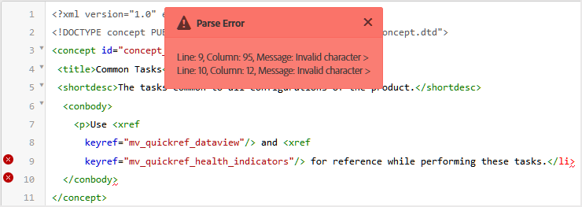
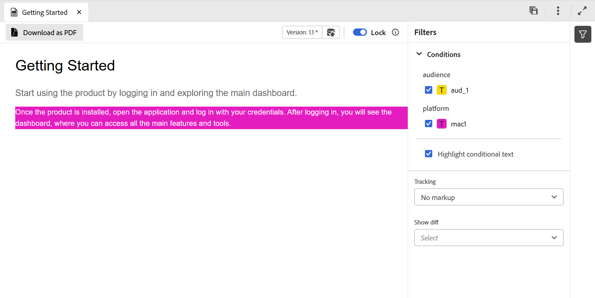
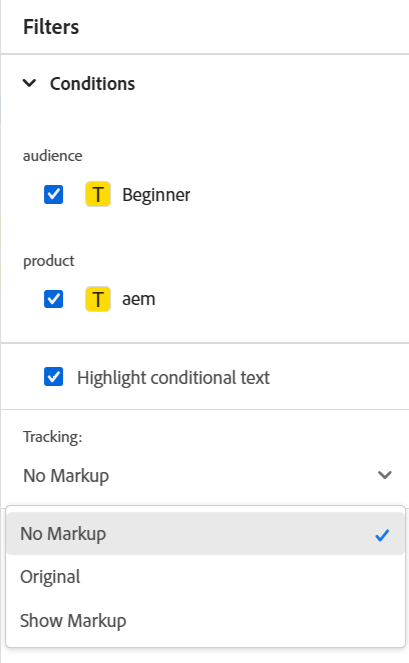
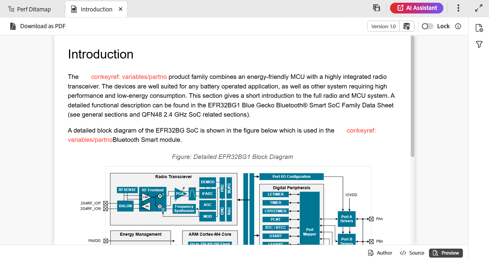

# トピックのエディタービュー {#id204GK0D0V5Z}

>[!INFO]
>
>このトピックは、新しいエディターと古いエディターの両方に適用されます。 コア機能は一貫していますが、ユーザーインターフェイス、用語、インタラクションの違いは、該当する場合はタブとコールアウトを使用してコンテンツ内に示されます。

Adobe Experience Managerのエディターインターフェイスでは、次の4つの異なるモードまたはビューでのトピックの表示がサポートされています。

* [作成者](#author)
* [ソース](#source)
* [プレビュー](#preview)
* [並べて表示](#side-by-side)

## 作成者

これは、エディターの一般的な&#x200B;**見たもの** \（WYSISYG\）ビューです。 通常のリッチテキストエディターと同様に、トピックを編集できます。 作成者ビューでは、ドキュメントのリビジョンの保存、コンテンツの検索と置換、エレメントの挿入、ハイパーリンクの挿入、コンテンツ参照の挿入などのオプションがあります。

>[!NOTE]
>
> コンテンツ参照を使用すると、参照されたコンテンツも作成者ビューに青色で表示されます。 参照されたコンテンツは編集できません。

## ソース

Source ビューには、トピックを構成する基になるXMLが表示されます。 XMLを直接操作する場合は、Source ビューを使用する必要があります。 このビューで通常のテキスト編集を行うだけでなく、スマートカタログを使用してエレメントや属性を追加したり、テキスト、エレメント、属性を検索して置換したりすることもできます。

* スマートカタログを呼び出すには、新しいエレメントを挿入するエレメントタグの最後にカーソルを置き、「&lt;」と入力します。 エディターには、その場所に挿入できるすべての有効なXML要素のリストが表示されます。 矢印キーを使用して、挿入するエレメントを選択し、Enter キーを押します。 閉じ括弧「\>」を入力すると、エレメントの閉じタグが自動的に追加されます。

  {width="400"}

* Source ビューから簡単に要素を変更することもできます。 例えば、`p`要素の開始タグを`note`に変更すると、終了タグ `p`が自動的に`/note`に変更されます。 エレメントを誤ったエレメントに置き換えた場合、検証エラーがすぐに表示されます。

* エレメントに属性を追加する場合は、エレメントタグ内にカーソルを置き、スペースバーを押します。 そのエレメントの有効な属性のリストがスマートカタログに表示されます。 矢印キーを使用して目的のエレメントを選択し、Enter キーを押してエレメントを挿入します。 属性の値を指定するには、等号\（=\）を入力すると、エディターは自動的に開始引用符と終了引用符&quot;&quot;を入力し、属性の値を指定できます。

  {width="350"}

* Source ビューには、「自動インデント」オプションがあり、XML コードを表示可能で簡単に読み取れる形式に再整理できます。 また、テキストを選択して作成者からSourceに切り替えたり、Sourceから作成者に切り替えたりすると、選択したテキストも他のビューでハイライト表示されます。
* Source ビューのもう1つの強力な機能は、ドキュメント内のXML検証です。 無効なXMLを含む文書を開くと、その文書は無効なXMLに関する情報とともにSource ビューで開かれます。 例えば、次のスクリーンショットでは、誤ったXMLに関する正確な情報が「解析エラー」ポップアップに表示されます。

  {width="650"}

  上のスクリーンショットでは、クロスハイライトを使用して、誤ったXMLを含む行を示しています。

* 「検索と置換」機能を使用すると、Source ビュー内の任意のテキスト、エレメントまたは属性を検索できます。
詳細については、[&#x200B; タブバー](web-editor-tab-bar.md) セクションの&#x200B;**検索と置換**&#x200B;機能の説明を参照してください。

* Source ビューには、ドキュメントをすばやく操作するための多数のショートカットが用意されています。 次の表に、サポートされているアクションとそのショートカットキーを示します。

  | 実現するには | このショートカットを使用 |
  |----------|-----------------|
  | 複数のカーソルを追加 | **Ctrl**+左クリック |
  | 連続しない複数のテキスト選択 | **Ctrl**+左クリックでテキストをドラッグして選択 |
  | 行間および行間のテキストを選択 | **Alt**+左クリックでテキストをドラッグして選択 |
  | 複数選択を取り消すか、フルスクリーンモードを終了します | **Esc** |
  | オートコンプリートを表示 | **Ctrl**+**スペース** |
  | 現在のタグの開始タグまたは終了タグに移動します | **Ctrl**+**J** |
  | 現在のタグとそのコンテンツを展開または折りたたむ | **Ctrl**+**Q** |
  | 現在の要素とその内容を選択 | **Ctrl**+**L** |
  | 現在の要素のアウトデント | **Shift**+**Tab** |
  | 現在の要素とその内容を削除 | **Shift**+**Ctrl**+**K** |
  | カーソルを1単語ずつ左に移動 | **Alt**+**左向き矢印** |
  | カーソルを1単語ずつ右に移動 | **Alt**+**右向き矢印** |
  | カーソルの位置を変更せずに1行上にスクロールします | **Ctrl**+**上向き矢印** |
  | カーソルの位置を変更せずに1行下にスクロールします | **Ctrl**+**下向き矢印** |
  | 全画面表示の切り替え | **F11** |
  | 現在のエレメントの後に新しい行を挿入 | **Ctrl**+**Enter** |
  | 現在のエレメントの前に新しい行を挿入 | **Shift**+**Ctrl**+**Enter** |
  | 現在の単語の次の出現箇所を検索して選択します | **Ctrl**+**D** |
  | 現在の要素とそのコンテンツを1つ上に移動 | **Shift**+**Ctrl**+**上向き矢印** |
  | 現在の要素とそのコンテンツを1つ下に移動 | **Shift**+**Ctrl**+**下向き矢印** |
  | 現在のエレメントをコメントタグで折り返します | **Ctrl**+**/** |
  | 現在の要素とその内容を複製する | **Shift**+**Ctrl**+**D** |
  | カーソルに続くテキストを削除します。 カーソルが開始エレメントの前にある場合、エレメント全体が削除されます。 | **Ctrl**+**K**+**K** |
  | 現在の行のカーソルの左側にあるテキストを削除します。 カーソルがエレメントの終了タグの後にある場合、エレメント全体が削除されます。 | **Ctrl**+**K**+**Backspace** |
  | 現在のテキストを大文字に変換 | **Ctrl**+**K**+**U** |
  | 現在のテキストを小文字に変換 | **Ctrl**+**K**+**L** |
  | 現在のエレメントをエディターの中央までスクロールします | **Ctrl**+**K**+**C** |
  | 現在の位置の上にカーソルを追加 | **Ctrl**+**Alt**+**上向き矢印** |
  | 現在の位置の下にカーソルを追加 | **Ctrl**+**Alt**+**下向き矢印** |
  | 現在の単語\（前方方向\）を再帰的に検索 | **Ctrl**+**F3** |
  | 現在の単語\（後方方向\）を再帰的に検索 | **Shift**+**Ctrl**+**F3** |

## 並べて表示

>[!NOTE]
>
>この機能は、新規エディターでのみ使用できます。

並べて表示すると、作成者ビューとSource ビューを同じ画面で同時に表示して作業できます。 WYSIWYG オーサービューと基になるXML Source ビューは隣接して表示され、ビューを切り替えずに並行してコンテンツを編集したり、構造化を編集したりできます。 両方のビューはリアルタイムで同期されたままになり、オーサービューのカーソルの位置と選択範囲がSource ビューの対応する場所に反映されるので、構造化コンテンツのオーサリング時の精度と制御が向上します。

{width="650"}

## プレビュー

プレビューモードでトピックを開くと、ユーザーがブラウザーでトピックを表示したときに、そのトピックがどのように表示されるかを示します。 DITA マップの場合、マップのプレビューが表示され、マップ内のすべてのトピックの単一の複合文書が表示されます。

プレビューモードでは、次の機能を使用できます。

* [条件付きフィルターに基づくコンテンツの表示](#id2114BI00VXA)
* [変更履歴のマークアップの表示](#id2114BJ00CE8)
* [トピックをPDFとして書き出す](#id2114BL00B5U)

### 条件付きフィルターに基づくコンテンツの表示 {#id2114BI00VXA}

トピックまたはマップで条件を使用した場合、それらの条件はフィルターパネルに表示されます。 デフォルトでは、すべての条件が選択され、コンテンツ全体が表示されます。 条件の選択を解除すると、その条件を持つコンテンツがビューから削除されます。 また、コンディショナライズされたコンテンツをハイライト表示することもできます。

次の画像は、2つの条件（`Audience`と`Platfor`）を使用するトピックを示しています。 コンディショナライズされたコンテンツが黄色の背景で強調表示されます。

>[!BEGINTABS]

>[!TAB 新しいエディター]

{width="650"}

>[!TAB 古いエディター]

{width="650"}

>[!ENDTABS]

### 変更履歴のマークアップの表示 {#id2114BJ00CE8}

ドキュメントに変更履歴のマークアップ \（または視覚的なキュー\）が含まれている場合は、そのマークアップの有無にかかわらずドキュメントをプレビューすることもできます。 ドキュメントのプレビュー中、右側のパネルにはフィルターとトラッキングオプションが表示されます。

{width="400"}

3つの&#x200B;**トラッキング** オプションから選択できます。

* **マークアップなし**：このビューでは、すべての挿入と削除が受け入れられ、ドキュメントのシンプルなビューが表示されます。 このビューでは、変更履歴のマークアップは表示されません。
* **元の**：このビューでは、すべての挿入が拒否され、すべての削除が元に戻され、プレビューが表示されます。 簡単に言えば、変更をトラック モードを有効にする前に、ドキュメントの元のフォームを取得できます。
* **マークアップを表示**：このビューでは、挿入されたコンテンツと削除されたコンテンツのすべてのマークアップが表示されます。

  次の画像は、マークアップを含むマップファイルのプレビューを示しています。

  {width="300"}

### トピックをPDFとして書き出す {#id2114BL00B5U}

PDFは、ドキュメント開発サイクルのあらゆる段階で使用される、最も一般的な出力フォーマットのひとつです。 Experience Manager Guidesでは、個々のトピックまたはマップファイル全体のPDFを柔軟に生成できます。 「PDFとして書き出し」機能を使用すると、作成者、発行者、または管理者は、個々のトピックのPDF出力を簡単に生成できます。 フォルダーレベルのプロファイルに保存されたDITA-OT設定を使用して、PDFを生成します。

この機能は、次の機能をサポートしています。

* トピックの現在アクティブな作業コピーのPDFを生成します。
* DITA-OT変換名とコマンドライン引数を受け入れて、PDFを生成します。
* 生成された出力をローカルシステムに保存します。
* 出力を生成する前に、トピックで使用されるキーとコンテンツの参照を解決します。

トピックをPDFとして書き出すには、次の手順に従います。

1. トピックをプレビューモードで開きます。 トピックがマップファイルの一部であることを確認します。

1. 上部の「**PDFとしてダウンロード**」オプションを選択します。

    アイコン。

   >[!NOTE]
   >
   > ブラウザー設定でポップアップウィンドウが有効になっていることを確認します。有効になっていない場合、PDFがダウンロードされません。

   PDFが生成され、新しいタブで開かれるか、ローカルシステムにPDFを保存するためのダイアログが表示されます。

**親トピック：**&#x200B;[&#x200B; エディターの概要](web-editor.md)
