# Workfront の統合

Adobe Workfrontは、チームや組織が作業を効率的に計画、追跡、管理するのに役立つ、クラウドベースの作業管理ソリューションです。 Experience Manager GuidesとAdobe Workfrontの連携により、Experience Manager Guidesの主要なCCMSに加えて、堅牢なプロジェクト管理機能を利用して、タスクを効率的に計画、割り当て、追跡できます。

Experience Manager Guidesから直接、Adobe Workfrontのタスクを作成、管理できます。 例えば、作成者はExperience Manager Guides インターフェイス内でレビュータスク（1つ以上のDITA トピックまたはマップが追加された状態）を直接作成し、レビューアーに割り当てることができます。 レビュアーは、Experience Manager Guides レビューUIで割り当てられたタスクに作業し、コメントを付けて作成者に返すことができます。 同様に、公開と翻訳のタスクを作成し、それを作業する必要があるユーザーに割り当てることができます。

また、この統合により、作業キューを監視し、整理され、すべてのタスク（割り当てられたタスク）を把握できるようになります。

**主な機能**

Experience Manager GuidesとAdobe Workfrontの連携により、次のことが可能になります。

* 統合されていない複数のツールに依存することなく、個々のタスクやプロジェクトの進捗状況を計画、割り当て、追跡できます。
* コンテンツのオーサリング、レビュー、公開、翻訳など、あらゆるExperience Manager Guidesワークフローをより効率的に管理できます。
* 新しいタスクが割り当てられるたびに、Adobe Workfrontからメール通知を受け取ります。 詳細については、[通知の概要](https://experienceleague.adobe.com/en/docs/workfront/using/basics/use-notifications/wf-notifications)を参照してください。
* Adobe Workfrontの直観的なダッシュボードでプロジェクトの状況を監視し、プロジェクトの成果に関するリアルタイムのインサイトを獲得できます。

  Experience Manager Guidesでプロジェクトマネージャーに対して有効になっているAdobe Workfrontの堅牢なプロジェクト管理機能については、[&#x200B; プロジェクトの概要を計画](https://experienceleague.adobe.com/en/docs/workfront/using/manage-work/projects/plan-a-project/plan-project)するをご覧ください。

## 今すぐ始める

管理者が設定して有効にすると、Adobe Workfront タスクに[Experience Manager Guides ホームページ &#x200B;](./intro-home-page.md)から直接アクセスできるようになります。

Adobe Workfront タスクにアクセスするには、次の手順を実行します。

1. Experience Manager Guidesにログインし、**ホームページ**&#x200B;を開きます。
2. 左側のパネルで、**Workfront**&#x200B;を選択します。

   **Workfront タスク** ページが表示されます。

   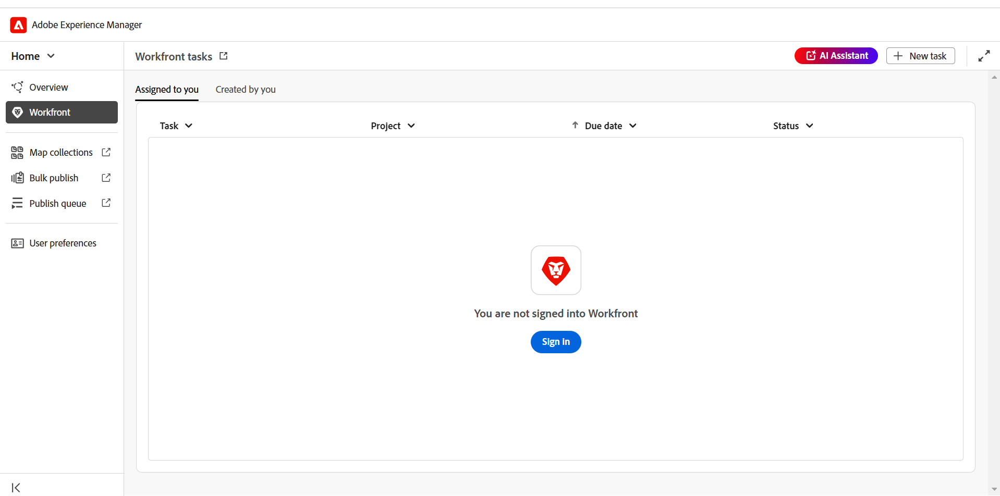
3. 「**ログイン**」を選択します。

   Adobe Workfront Sign In ページにリダイレクトされます。
4. Experience Manager Guidesで使用されているのと同じ電子メールアドレスでログインし、**アクセスを許可**&#x200B;を選択して、アプリケーションがAdobe Workfront アカウントにアクセスできるようにします。

   Experience Manager Guidesの&#x200B;**Workfront タスク** ページに自動的にリダイレクトされます。

   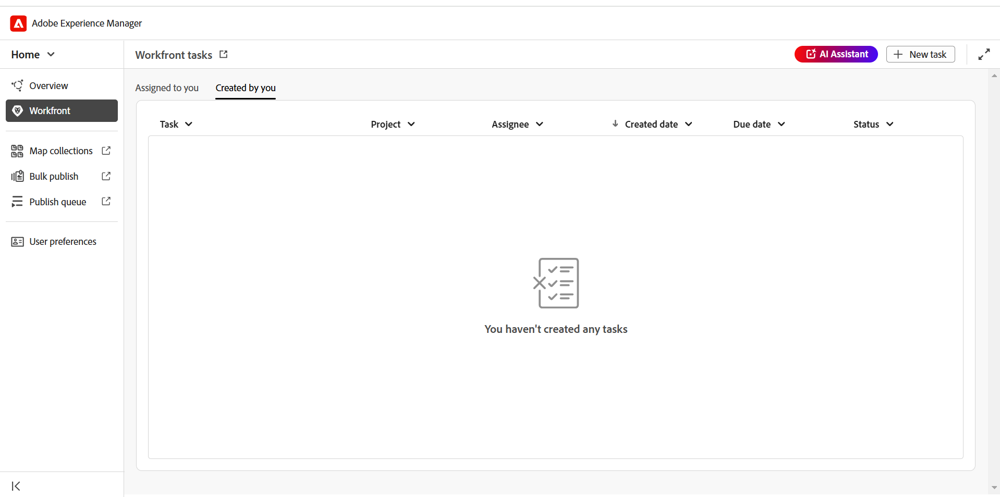

## Workfront タスクページで使用できる機能

Workfrontのタスクページでは、次の機能を利用できます。

* [新しいタスク &#x200B;](#create-workfront-tasks): Experience Manager Guides インターフェイスから直接Adobe Workfront タスクを作成できます。
* [自分に割り当て済み](#managing-tasks-assigned-to-you)：自分に割り当てられ、まだアクティブなすべてのタスクが一覧表示されます。
* [作成者](#managing-tasks-created-by-you)：作成したタスクとアクティブなタスクをすべて一覧表示します。

Workfront タスクページには、リンクアウトアイコン も含まれています。このアイコンを選択すると、Adobe Workfront プロジェクトページに移動します。 ここでは、Adobe Workfront アカウントにマッピングされた権限に基づいて、タスクの詳細の表示、コメントの表示、コメントの追加、その他の機能へのアクセスを行うことができます。

詳細については、[Workfrontのプロジェクト、タスク、イシューの日付の概要](https://experienceleague.adobe.com/en/docs/workfront/using/basics/navigate/definitions-pti-dates)を参照してください。

### Workfront タスクの作成

Adobe Workfront タスクページにある「**新しいタスク**」ボタンを使用して、Experience Manager Guides インターフェイスからWorkfront タスクを直接作成できます。

新しいAdobe Workfront タスクを作成するには、次の手順を実行します。

1. Workfront タスクページで、**新規タスク**&#x200B;を選択します。

   「**タスクを作成**」ダイアログボックスが表示されます。

   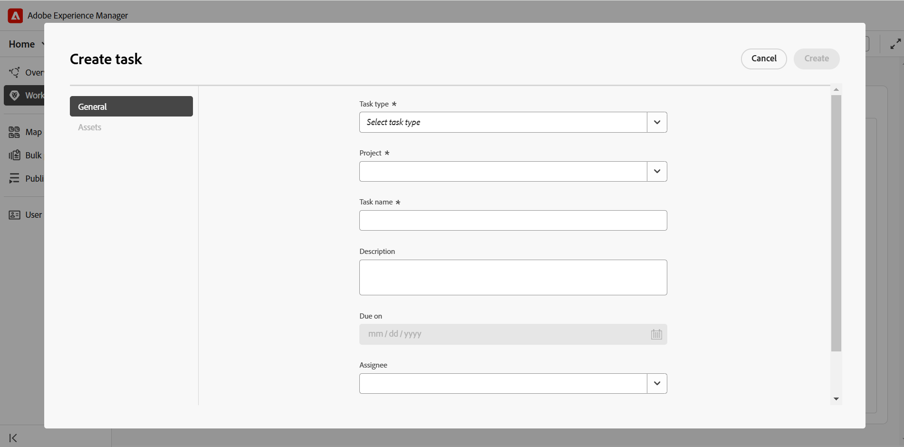
2. 「**一般**」タブで、次のタスクの詳細を入力します。

   * **タスクの種類**：作成するタスクの種類を選択します。 利用できるオプションは、**オーサリング**、**レビュー**、**公開**、および&#x200B;**翻訳**&#x200B;です。
   * **プロジェクト**: タスクを作成するプロジェクトを選択します。
   * **タスク名**: タスクのわかりやすい名前を入力します。
   * **説明**: タスクの簡単な説明を入力します。
   * **期日：**: タスクの完了期日を設定します。
   * **担当者**: タスクの担当者を選択します。
3. 「**Assets**」タブで「**追加**」を選択して、このタスクにアセットを追加します。

   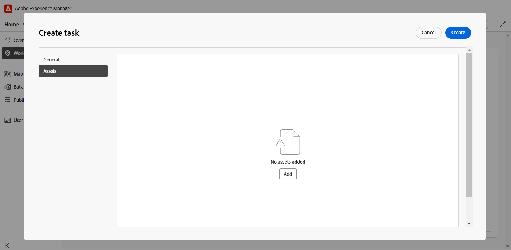

   「**パスを選択**」ダイアログが表示されます。 必要なアセットへのパスを選択します。 パスブラウザーで有効なパスを選択して、複数のアセットを追加できます。 選択したパスは保持され、ダイアログを再度開いたときに簡単に確認または変更できます。

   * オーサリング、公開、翻訳タスクの場合、**ファイルを選択** ダイアログで、必要なファイルの場所を選択するように求められます。 選択したファイル（オーサリング用のトピックおよび公開と翻訳用のマップ）は、**作成** ボタンを選択するとすぐにタスクに追加されます。

     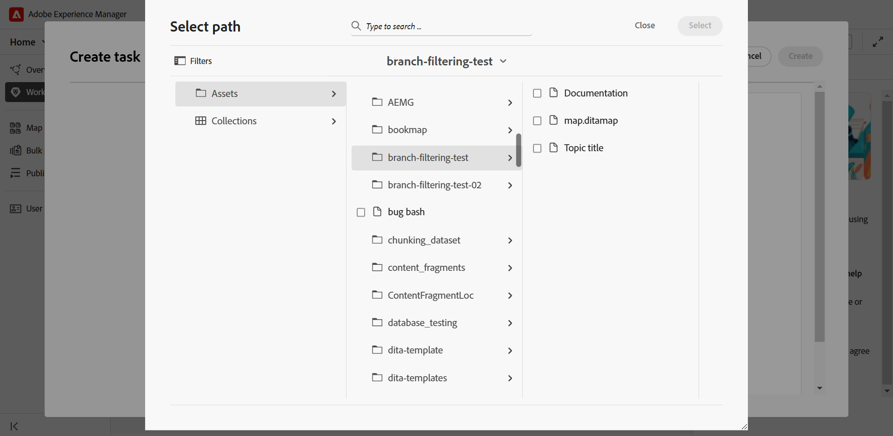

   * レビュータスクの場合、最初にアセットタイプ（マップまたはトピック）を選択するように求められ、選択したファイルは次のように表示されます。

     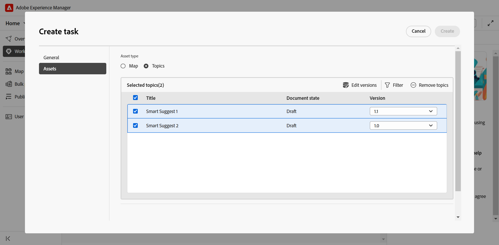

     *レビュータスクへのトピックの追加*

     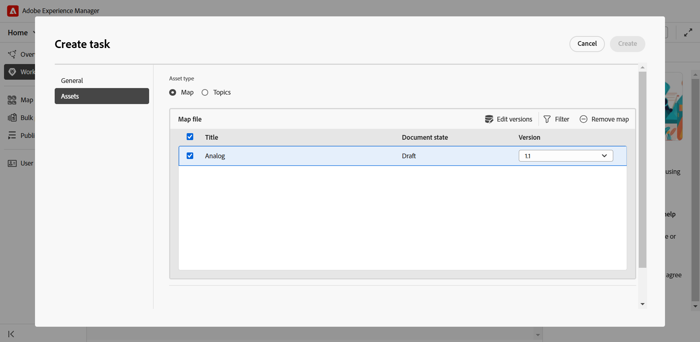

     *レビュータスクにマップを追加する*

     レビュー用に送信する前に選択範囲を変更するには、次のアクションを使用できます。

      * リストから一部のトピックの選択を解除します。
      * ドキュメントの状態に基づいてトピックリストをフィルタリングします。
      * 選択したトピックのバージョンを、必要に応じて&#x200B;**最新バージョン**、**日付に基づくバージョン**&#x200B;および&#x200B;**ベースライン** （マップでのみ使用可能）に編集または設定します。

     詳細については、[&#x200B; レビュー用にトピックを送信](./review-send-topics-for-review.md)を参照してください。

   >[!NOTE]
   >
   > タスクにアセットを追加することで、担当者はトピック、マップ、その他の必要なファイルにすばやくアクセスできます。 オーサリング、公開、翻訳タスクの場合、アセットの追加はオプションですが、ワークフローの効率化に役立ちます。 ただし、レビュータスクの場合、アセットの追加は必須です。

4. 「**作成**」を選択します。

新しいタスクが作成され、「**自分で作成したタスク」タブに一覧表示されます。**

>[!NOTE]
>
> プロジェクトマネージャーは、Adobe Workfront ダッシュボードでこの新しく作成されたタスクを、その他の主要タスクの詳細と共に表示できます。 詳細については、[&#x200B; ダッシュボードについて](https://experienceleague.adobe.com/en/docs/workfront/using/reporting/dashboards/understand-dashboards/understand-dashboards)を参照してください。

### 自分が作成したタスクの管理

作成し、現在もアクティブであるすべてのタスクは、Workfront タスクページの&#x200B;**作成者** タブに表示され、プロジェクト名、担当者、タスク作成日、タスク完了日、タスクステータスなどの主要なタスクの詳細が表示されます。

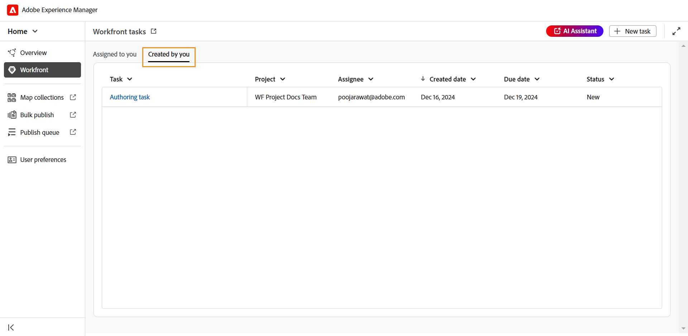

「自分で作成」タブにあるタスクにカーソルを合わせると、次のオプションを使用できます。

**開く** - 

タスクを開くことができます。 タスクのタイプに応じて、エディター、マップコンソール、レビューUIで開きます。

**編集** - 

タスクの作成中に追加されたタスクの詳細を編集できます。 タスクタイプとプロジェクトを除くすべてのフィールドを編集できます。 自分が作成したタスクのみを編集できます。 割り当てられたタスクは編集できません。

また、オーサリング、公開または翻訳タスクの編集時にアセットを追加または削除することもできます。 ただし、レビュータスクの場合は、レビュー用に送信されたアセットのバージョンのみを変更できます。

**タスクの詳細** - 

タスク作成時に入力された詳細、タスクのステータス、追加されたアセットなど、タスク情報を表示します。

### 割り当てられたタスクの管理

自分に割り当てられ、まだアクティブなすべてのタスクは、Workfront タスクページの「**自分に割り当てられた**」タブに表示され、プロジェクト名、担当者、期日、タスクのステータスなどの主要なタスクの詳細が表示されます。

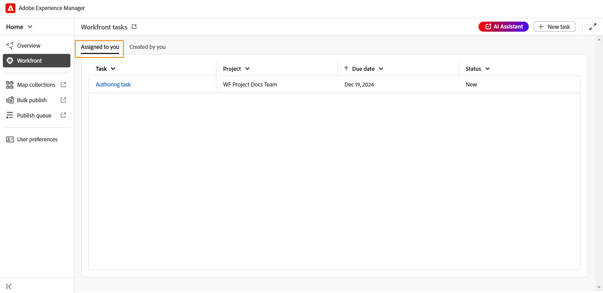

「割り当て済み」タブにあるタスクにカーソルを合わせると、次のオプションを使用できます。

**開く** - 

タスクを開くことができます。 タスクのタイプに応じて、エディター、マップコンソール、レビューUIで開きます。

**タスクの詳細** - 

タスク作成時に入力された詳細、タスクのステータス、追加されたアセットなど、タスク情報を表示します。

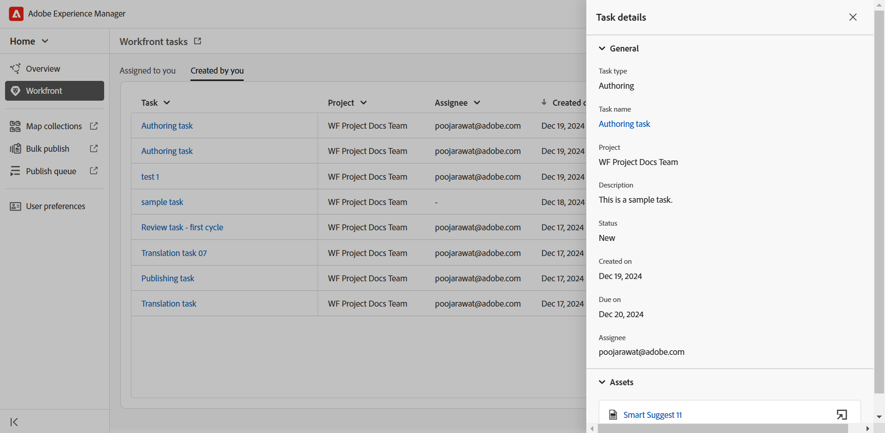

#### 概要セクションからの割り当てられたタスクへのアクセス

また、[概要セクション &#x200B;](./intro-home-page.md#overview)から、割り当てられたAdobe Workfront タスクにアクセスすることもできます。 「概要」セクションには、集中力を維持して整理するのに役立つ様々なウィジェットが表示されます。

**お客様のタスク**&#x200B;は、タスクの名前、関連するプロジェクト、期日、現在のステータスなど、主要なタスクの詳細と共に、Adobe Workfront タスク（自分に割り当てられ、まだアクティブなタスク）のリストが表示されるウィジェットの1つです。

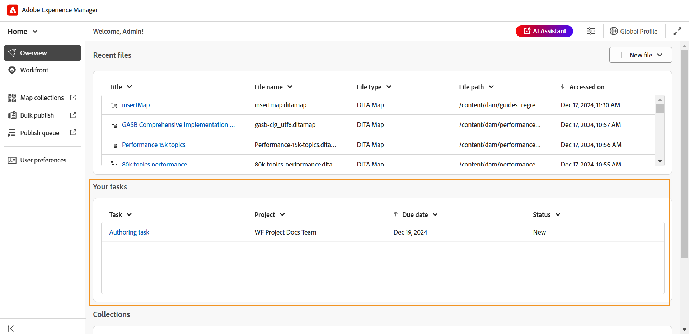

「自分に割り当て済み」タブと同様に、「タスク」ウィジェットには、タスクにカーソルを合わせると&#x200B;**開く**、**タスクの詳細**&#x200B;を表示するオプションもあります。

ウィジェットには、カスタマイズされたビュー用に列を並べ替えたり、サイズを変更したりするオプションも用意されています。 列に並べ替えを適用するには、列ヘッダーを選択すると、オプションがリストに表示されます。 列の幅を調整するには、ヘッダーの列区切り線にカーソルを合わせ、ドラッグしてサイズを変更します。

>[!NOTE]
>
> Experience Manager Guides インターフェイスから離れると、新しく割り当てられたタスクに関するメール通知がAdobe Workfrontから送信されます。 これらのタスクをチェックアウトするには、Experience Manager Guides インスタンスにログインし、割り当てられたタスクにアクセスします。

## Adobe Workfrontで割り当てられたタスクの操作

Adobe Workfront タスクには、Experience Manager Guidesで作成して割り当てたり、割り当てたりできる4つのタイプがあります。

1. [オーサリングタスク](#authoring-tasks)
2. [タスクのレビュー](#review-tasks)
3. [翻訳タスク](#translation-tasks)
4. [タスクの公開](#publishing-tasks)

次の節では、割り当てられたAdobe Workfront タスクの作業の詳細なプロセスについて説明します。

### オーサリングタスク

オーサリングタスクで作業するには、次の手順を実行します。

1. タスクには、[概要](#accessing-assigned-tasks-from-overview-section) セクションまたは[割り当て済み](#managing-tasks-assigned-to-you) タブからアクセスします。

   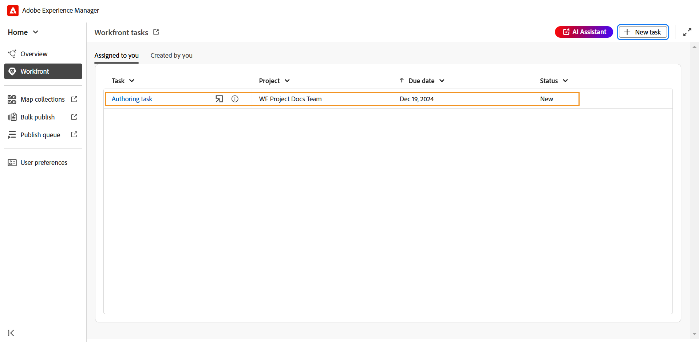

   「自分に割り当て済み」タブの&#x200B;*オーサリングタスク*

   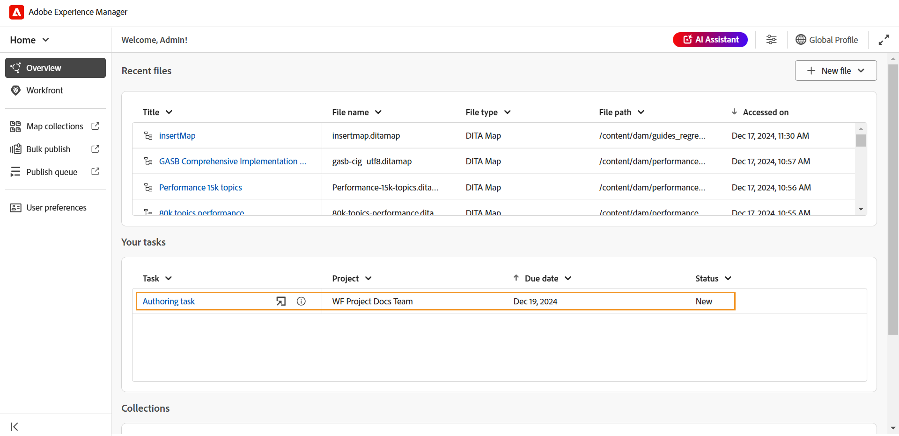

   *自分のタスクウィジェットでタスクをオーサリング*
2. 操作するタスクにカーソルを合わせて、を選択して開きます。 タスクを選択するだけで、タスクを開くこともできます。

   すべてのオーサリングタスクがエディターで開きます。
3. 「**詳細**」タブのタスクの詳細を確認し、**アセット** ファイルを選択して開きます。

   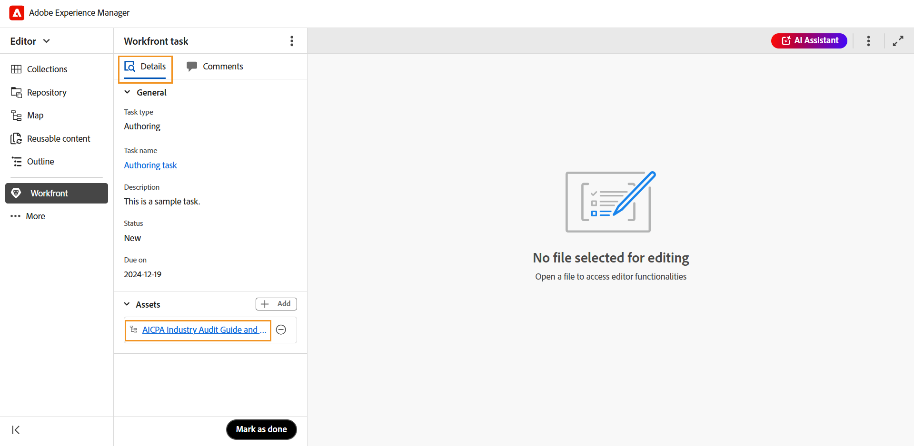

4. 必要な編集を行い、**完了としてマーク**&#x200B;を選択します。
5. 「**コメント**」タブに切り替えて、このタスクにコメントを追加します。 タスクレベルで追加されたこれらのコメントは、Adobe Workfront プロジェクトダッシュボードにも反映されます。

   >[!NOTE]
   >
   > タスクが「完了」とマークされると、割り当てられたタスクリストと、自分が作成したタスク開始者の&#x200B;**タスクリストの両方からタスクが削除されます。**

### タスクのレビュー

自分に割り当てられたAdobe Workfront レビュータスクは、レビューアーとしてレビューできます。

割り当てられたレビュータスクに取り組むには、次の手順を実行します。

1. タスクには、[概要](#accessing-assigned-tasks-from-overview-section) セクションまたは[割り当て済み](#managing-tasks-assigned-to-you) タブからアクセスします。

   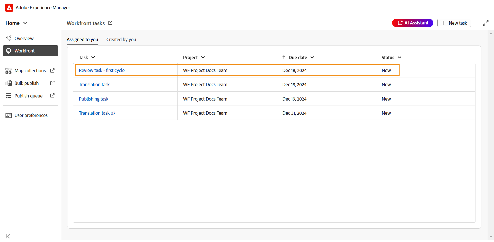

   *割り当て済みタブでタスクを確認*

   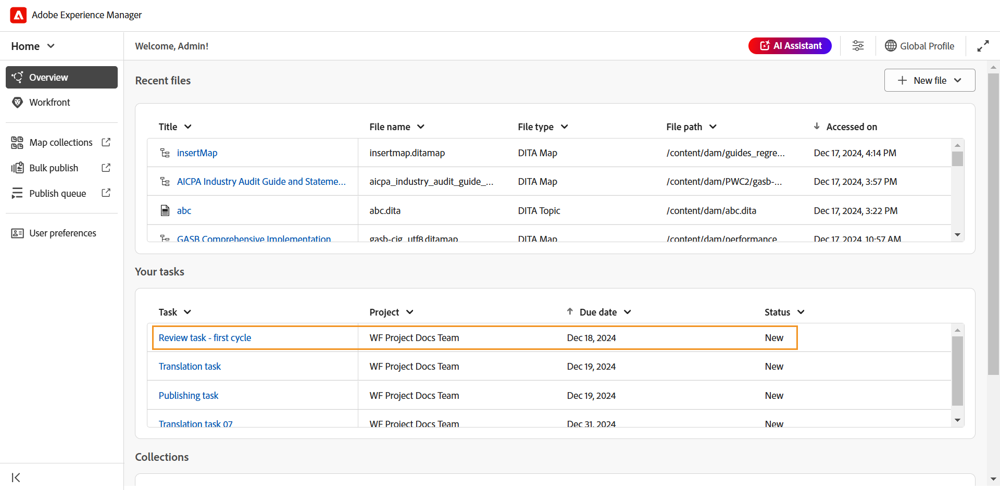

   *自分のタスクウィジェットでタスクをオーサリング*
2. 操作するタスクにカーソルを合わせて、を選択して開きます。 タスクを選択するだけで、タスクを開くこともできます。

   レビューアーの場合、**レビューUI**&#x200B;でレビュータスクが開きます。

   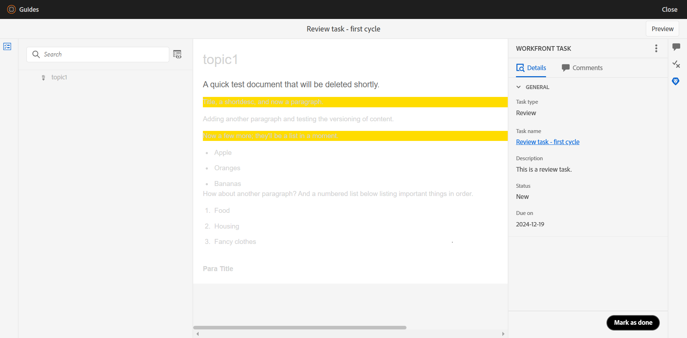

3. 必要なレビューを実行します。 トピックのレビュー方法について詳しくは、[&#x200B; トピックのレビュー](./review-topics.md)を参照してください。
4. レビューが完了したら、**完了としてマーク**&#x200B;を選択します。
5. 「**コメント**」タブに切り替えて、このタスクにコメントを追加します。 タスクレベルで追加されたこれらのコメントは、Adobe Workfront プロジェクトダッシュボードにも反映されます。

レビュアーがタスクを「完了」とマークしても、タスクの完了は示されません。 すべてのレビュータスクは、タスクを作成したユーザー（理想的にはレビューを依頼した作成者）に割り当てられます。

>[!NOTE]
>
> タスクが複数のレビュー担当者に割り当てられている場合、すべてのレビュー担当者が「完了」とマークした後にのみ、タスクがタスク作成者に再割り当てされます。

レビュー用に作成者/作成者に再割り当てされたレビュータスクは、[概要](#accessing-assigned-tasks-from-overview-section) セクションまたは[自分に割り当て](#managing-tasks-assigned-to-you) タブからアクセスできます。

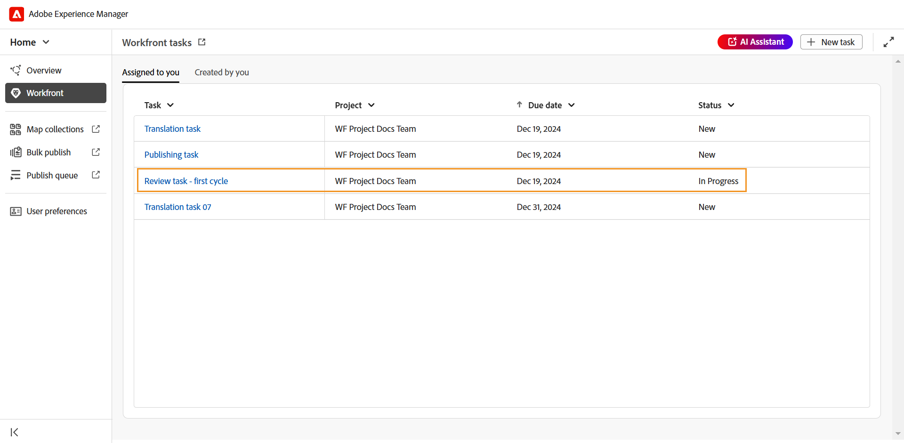

*作成者に割り当てられたレビュータスク*

このようなタスクの場合、担当者のタスク状態は&#x200B;**オーサリング**&#x200B;に変わりますが、タスクタイプは&#x200B;**レビュー**&#x200B;のままです。 この状態の変更は、すべてのレビュー担当者がレビューを完了したときに行われます。

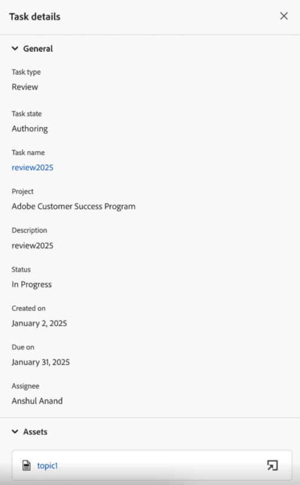

タスクまたは開くアイコン を選択すると、エディターでタスクが開き、作成者は[&#x200B; レビューコメント &#x200B;](../user-guide/review-address-review-comments.md)に対処し、トピックのバージョンを更新してタスクを編集し、必要に応じてタスクをレビュー担当者に再度割り当てることができます。

作成者は、タスクを編集して別の作成者に割り当て、コメントを組み込むタスクを委任することもできます。 これを行うには、**編集**&#x200B;を選択し、タスクの状態を&#x200B;**オーサリング**&#x200B;に変更してから、**担当者の変更**&#x200B;を選択します。 リストから担当者を選択できるようになりました。

このプロセスは連続的なサイクルを形成し、タスクが完全に完了するまで、作成者とレビュアーの間でタスクがやり取りされます。 提案されたすべての変更が組み込まれたら、作成者は&#x200B;**完了としてマーク**&#x200B;を選択してタスクを完了できます。

### 翻訳タスク

割り当てられたAdobe Workfront翻訳タスクに対して、様々な翻訳アクションを実行できます。

翻訳タスクを実行するには、次の手順を実行します。

1. タスクには、[概要](#accessing-assigned-tasks-from-overview-section) セクションまたは[割り当て済み](#managing-tasks-assigned-to-you) タブからアクセスします。

   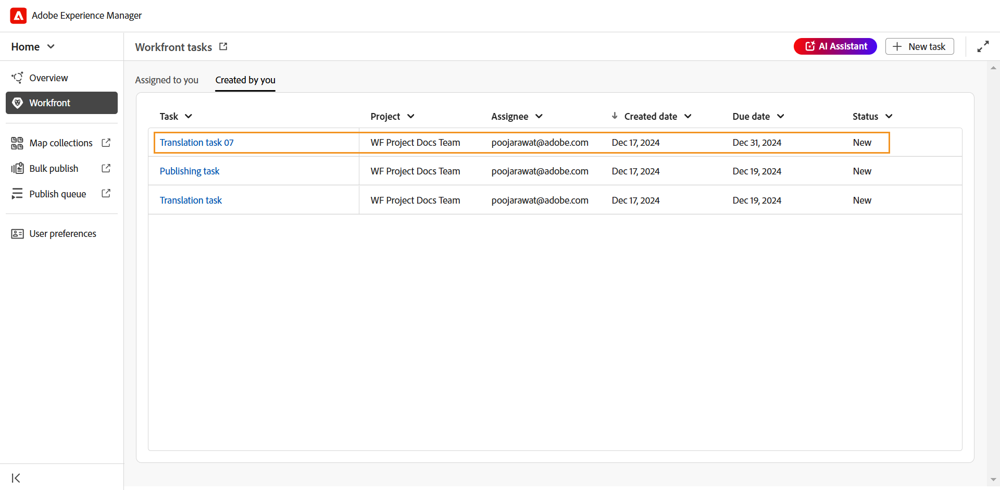

   *割り当て済みタブの翻訳タスク*

   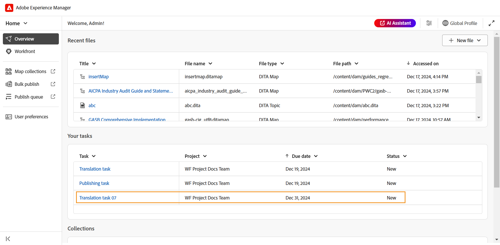

   *あなたのタスクウィジェットの翻訳タスク*

2. 作業するタスクにカーソルを合わせてを選択し、**マップコンソール**&#x200B;で開きます。 タスクを選択するだけで、タスクを開くこともできます。
3. タスクの詳細と、翻訳用に追加されたファイルを確認します。

   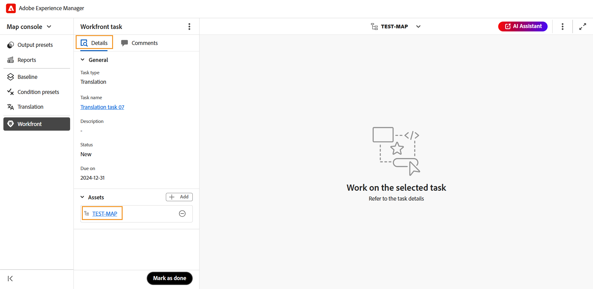
4. 様々な翻訳オプションの「**翻訳**」タブに移動します。 Experience Manager Guidesでコンテンツ [&#128279;](../user-guide/translation.md)を翻訳する方法について説明します。
5. 必要な翻訳を実行し、**翻訳用に送信**&#x200B;を選択します。
   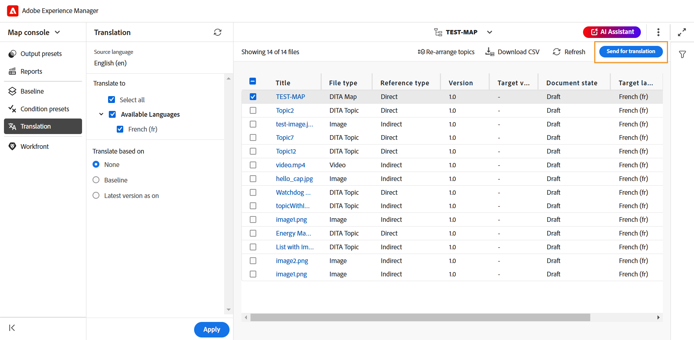
6. 「**Workfront**」セクションに移動し、「**完了としてマーク**」を選択して、タスクが完了したことを示します。
7. 「**コメント**」タブに切り替えて、このタスクにコメントを追加します。 タスクレベルで追加されたこれらのコメントは、Adobe Workfront プロジェクトダッシュボードに反映されます。

   >[!NOTE]
   >
   > タスクが「完了」とマークされると、割り当てられたタスクリストと、自分が作成したタスク開始者の&#x200B;**タスクリストの両方からタスクが削除されます。**

### タスクの公開

発行者は、詳細を表示し、割り当てられた公開タスクを公開できます。

公開タスクに取り組むには、次の手順を実行します。

1. タスクには、[概要](#accessing-assigned-tasks-from-overview-section) セクションまたは[割り当て済み](#managing-tasks-assigned-to-you) タブからアクセスします。

   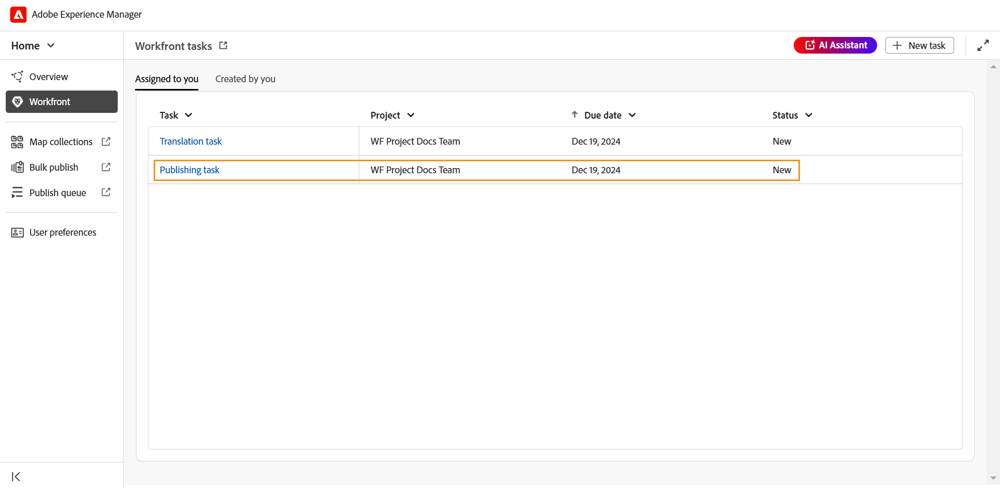

   *割り当て済みタブでのタスクの公開*

   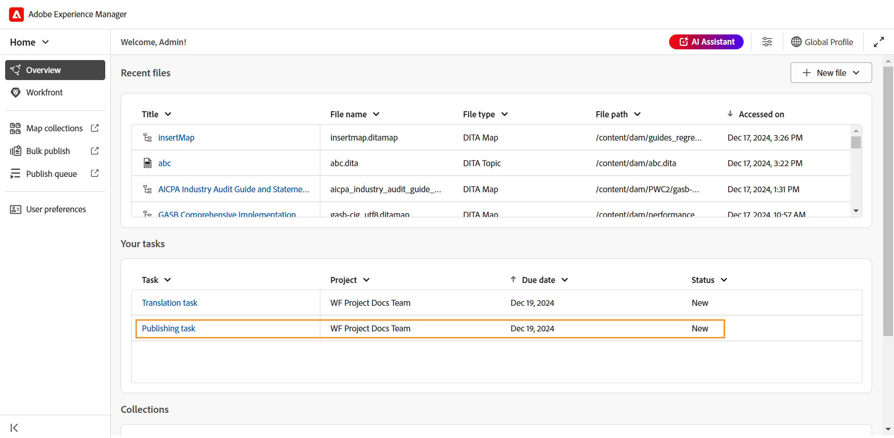

   *自分のタスクウィジェットでタスクを公開*
2. 作業するタスクにカーソルを合わせてを選択し、**マップコンソール**&#x200B;で開きます。 タスクを選択するだけで、タスクを開くこともできます。
3. タスクの詳細と、公開用に追加されたファイルを確認します。

   
4. **出力プリセット**&#x200B;に移動し、タスクの公開に必要な公開アクションを実行します。 詳細については、[出力プリセットについて](../user-guide/generate-output-understand-presets.md)を参照してください。
5. 公開が完了したら、**Workfront** セクションに移動し、**完了としてマーク**&#x200B;を選択して、タスクが完了したことを示します。
6. 「**コメント**」タブに切り替えて、このタスクにコメントを追加します。 タスクレベルで追加されたこれらのコメントは、Workfrontのプロジェクトダッシュボードに反映されます。

   >[!NOTE]
   >
   > タスクが「完了」とマークされると、割り当てられたタスクリストと、自分が作成したタスク開始者の&#x200B;**タスクリストの両方からタスクが削除されます。**
