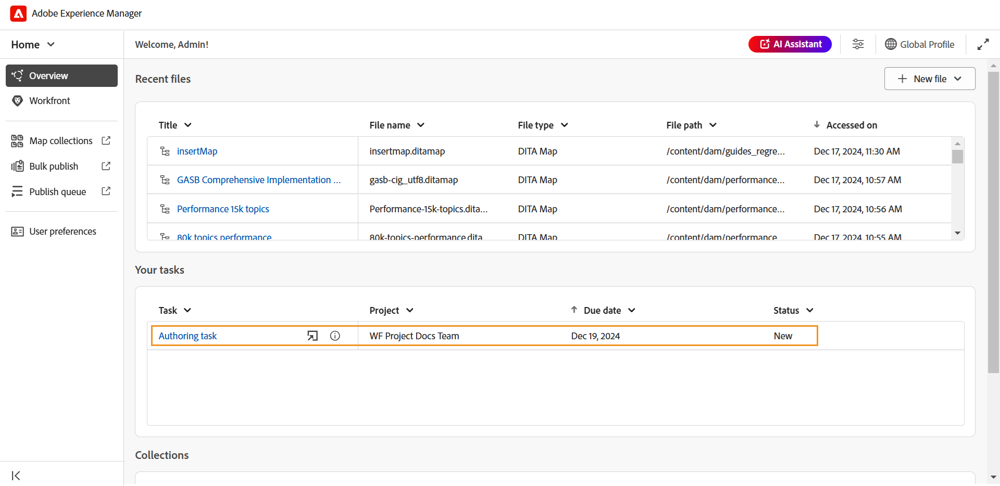
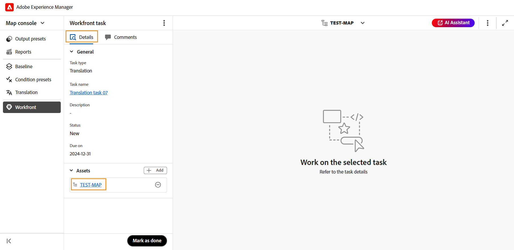

# Workfront の統合

Adobe Workfrontは、チームや組織が作業を効率的に計画、追跡、管理するのに役立つ、クラウドベースの作業管理ソリューションです。 Experience Manager GuidesとAdobe Workfrontの統合により、Experience Manager Guidesのコア CCMS 機能に加えて堅牢なプロジェクト管理機能にアクセスできるため、タスクの計画、割り当て、追跡を効率的に行うことができます。

この統合を使用すると、Experience Manager Guidesから直接Adobe Workfront タスクを作成および管理できます。 例えば、作成者はレビュータスクを（1 つ以上の DITA トピックまたはマップが追加された状態で）Experience Manager Guides インタフェース内で直接作成し、それをレビュー担当者に割り当てることができます。 レビュー担当者は、Experience Manager Guides レビュー UI で割り当てられたタスクを作業し、コメントを付けて作成者に返すことができます。 同様に、公開タスクと翻訳タスクを作成し、そのタスクを作業する必要があるユーザーに割り当てることができます。

また、統合では、作業キューを監視して、整理された状態を維持し、すべてのタスク（割り当てられたタスク）を常に把握することもできます。

**主な機能**

Experience Manager GuidesとAdobe Workfrontの統合により、以下が可能になります。

* 複数の統合されていないツールに依存せずに、個々のタスクやプロジェクトの進捗を計画、割り当て、追跡します。
* コンテンツのオーサリング、レビュー、公開、翻訳など、すべてのExperience Manager Guides ワークフローをより効率的に管理します。
* 新しいタスクが割り当てられるとAdobe Workfrontからメール通知が届きます。 詳しくは、[ 通知の概要 ](https://experienceleague.adobe.com/ja/docs/workfront/using/basics/use-notifications/wf-notifications) を参照してください。
* Adobe Workfrontの直感的なダッシュボードを使用してプロジェクトの正常性を監視し、プロジェクトのパフォーマンスに関するリアルタイムのインサイトを提供します。

  Experience Manager Guidesのプロジェクト管理者が使用できるAdobe Workfrontの堅牢なプロジェクト管理機能については、[ プロジェクトの概要を計画 ](https://experienceleague.adobe.com/ja/docs/workfront/using/manage-work/projects/plan-a-project/plan-project) を参照してください。

## 今すぐ始める

管理者が設定と有効化を行うと、[Adobe Workfrontのホームページ ](./intro-home-page.md) からExperience Manager Guides タスクに直接アクセスできます。

次の手順を実行して、Adobe Workfront タスクにアクセスします。

1. Experience Manager Guidesにログインし、**ホームページ** を開きます。
2. 左側のパネルで「**Workfront**」を選択します。

   **Workfront タスク** ページが表示されます。

   {align="left"}
3. **ログイン** を選択します。

   Adobe Workfrontのログインページにリダイレクトされます。
4. Experience Manager Guidesと同じメールアドレスを使用してログインし、「**アクセスを許可**」を選択して、アプリケーションがAdobe Workfront アカウントにアクセスできるようにします。

   Experience Manager Guidesの **Workfront タスク** ページに自動的にリダイレクトされます。

   {align="left"}

## Workfront タスクページで使用できる機能

Workfrontのタスクページでは、次の機能を使用できます。

* [ 新規タスク ](#create-workfront-tasks):Experience Manager Guides インターフェイスからAdobe Workfront タスクを直接作成できます。
* [ 自分に割り当て済み ](#managing-tasks-assigned-to-you)：自分に割り当てられていても、まだアクティブなすべてのタスクをリストします。
* [ 作成者 ](#managing-tasks-created-by-you)：作成済みで、まだアクティブなすべてのタスクがリストされます。

Workfront タスクページには、リンクアウトアイコン  も含まれています。このアイコンを選択すると、Adobe Workfront プロジェクトページに移動します。 ここでは、Adobe Workfront アカウントにマッピングされている権限に基づいて、タスクの詳細の表示、コメントの表示、コメントの追加およびその他の機能へのアクセスを行うことができます。

詳しくは、[Workfrontでのプロジェクト、タスク、問題の日付の概要 ](https://experienceleague.adobe.com/ja/docs/workfront/using/basics/navigate/definitions-pti-dates) を参照してください。

### Workfront タスクの作成

Adobe Workfront タスクページの **新規タスク** ボタンを使用して、Experience Manager Guides インターフェイスから直接Workfront タスクを作成できます。

新しいAdobe Workfront タスクを作成するには、次の手順を実行します。

1. Workfront タスクページで、「**新規タスク**」を選択します。

   **タスクを作成** ダイアログボックスが表示されます。

   {align="left"}
2. 「**一般**」タブで、次のタスクの詳細を入力します。

   * **タスクタイプ**：作成するタスクタイプを選択します。 使用できるオプションは、**オーサリング**、**レビュー**、**公開**、**翻訳** です。
   * **プロジェクト**：タスクを作成するプロジェクトを選択します。
   * **タスク名**：タスクのわかりやすい名前を入力します。
   * **説明**：タスクの簡単な説明を入力します。
   * **期限**: タスクの完了期日を設定します。
   * **担当者**：タスクの担当者を選択します。
3. 「**Assets**」タブで、「**追加** を選択して、このタスクにアセットを追加します。

   {align="left"}

   **パスを選択** ダイアログが表示されます。 必要なアセットへのパスを選択します。 パスブラウザーで有効なパスを選択することで、複数のアセットを追加できます。 選択したパスは保持されるので、ダイアログを再度開いたときに、パスを簡単に確認または変更できます。

   * オーサリング、パブリッシュ、および翻訳のタスクの場合は、「パスの選択 **ダイアログボックスで必要なファイルの場所を選択する** う求められます。 **作成** ボタンを選択するとすぐに、選択したファイル（オーサリング用のトピックと、公開および翻訳用のマップ）がタスクに追加されます。

     {align="left"}

   * レビュータスクの場合、最初にアセットタイプ（マップまたはトピック）を選択するように求められ、次に、選択したファイルが次のように表示されます。

     {align="left"}

     *レビュータスクへのトピックの追加*

     {align="left"}

     *レビュータスクへのマップの追加*

     レビュー用に送信する前に選択を変更するには、次のアクションを使用します。

      * リストから一部のトピックを選択解除します。
      * ドキュメントの状態に基づいてトピックリストをフィルタリングします。
      * 必要に応じて、選択したトピックのバージョンを編集または **最新バージョン**、**日付に基づいたバージョン**、および **ベースライン** （マップでのみ使用可能）に設定します。

     詳しくは、[ レビュー用にトピックを送信 ](./review-send-topics-for-review.md) を参照してください。

   >[!NOTE]
   >
   > アセットをタスクに追加すると、担当者は作業に必要なトピック、マップ、その他のファイルにすばやくアクセスできます。 オーサリング、公開、翻訳のタスクでは、アセットの追加は任意ですが、ワークフローの効率化に役立ちます。 ただし、レビュータスクの場合、アセットの追加は必須です。

4. 「**作成**」を選択します。

新しいタスクが作成され、「自分で作成 **タブに一覧表示され** す。

>[!NOTE]
>
> プロジェクト管理者は、この新しく作成されたタスクを、他の主要なタスクの詳細と共にAdobe Workfront ダッシュボードで確認できます。 詳しくは、[ ダッシュボードについて ](https://experienceleague.adobe.com/ja/docs/workfront/using/reporting/dashboards/understand-dashboards/understand-dashboards) を参照してください。

### 作成したタスクの管理

自分が作成し、まだアクティブなすべてのタスクは、Workfront タスクページの **作成済み** タブに表示され、プロジェクト名、担当者、タスク作成日、タスク完了日、タスクのステータスなどの主要なタスクの詳細が表示されます。

{align="left"}

次のオプションは、「作成者」タブに表示されているタスクにポインタを合わせると使用できます。

**開く** - 

タスクを開くことができます。 タスクのタイプに応じて、エディター、マップコンソールまたはレビュー UI で開きます。

**編集** - 

タスクの作成時に追加されたタスクの詳細を編集できます。 タスクタイプとプロジェクトを除くすべてのフィールドが編集可能です。 編集できるのは、自分が作成したタスクのみです。 割り当てられたタスクは編集できません。

また、オーサリング、公開、翻訳の各タスクの編集時に、アセットを追加または削除することもできます。 ただし、レビュータスクの場合、変更できるのはレビュー用に送信されたアセットのバージョンのみです。

**タスクの詳細** - 

タスクの作成時に入力した詳細、タスクのステータス、追加されたアセットなどのタスク情報を表示します。

### 自分に割り当てられたタスクの管理

自分に割り当てられていて、まだアクティブなすべてのタスクは、Workfront タスクページの **自分に割り当て済み** タブに表示され、プロジェクト名、担当者、期限、タスクステータスなどの主要なタスクの詳細が表示されます。

{align="left"}

「割り当て先」タブに表示されているタスクにマウスポインターを置くと、次のオプションを使用できます。

**開く** - 

タスクを開くことができます。 タスクのタイプに応じて、エディター、マップコンソールまたはレビュー UI で開きます。

**タスクの詳細** - 

タスクの作成時に入力した詳細、タスクのステータス、追加されたアセットなどのタスク情報を表示します。

{align="left"}

#### 「概要」セクションから割り当てられたタスクへのアクセス

また、「概要」セクションから、割り当てられたAdobe Workfront タスクにアクセスするこ [ もでき ](./intro-home-page.md#overview) す。 「概要」セクションを選択すると、フォーカスと整理を維持するのに役立つ様々なウィジェットが表示されます。

**タスク** は、自分に割り当てられ、まだアクティブなAdobe Workfront タスクのリストが、タスクの名前、関連プロジェクト、期限、現在のステータスなどの主要なタスクの詳細と共に表示されるウィジェットの 1 つです。

{align="left"}

「自分に割り当て済み」タブと同様に、タスク ウィジェットにも、タスクの上にカーソルを置くと **開く** および **タスクの詳細** を表示するオプションがあります。

このウィジェットには、カスタマイズされたビューの列の並べ替えとサイズ変更を行うオプションも用意されています。 列に並べ替えを適用するには、列ヘッダーを選択すると、オプションがリストに表示されます。 列の幅を調整するには、ヘッダーの列分割線の上にマウスポインターを置いてから、ドラッグしてサイズを変更します。

>[!NOTE]
>
> Experience Manager Guides インターフェイスから離れると、新しく割り当てられたタスクに関するメール通知がAdobe Workfrontから届きます。 これらのタスクをチェックアウトするには、Experience Manager Guides インスタンスにログインし、割り当てられたタスクにアクセスします。

## Adobe Workfrontに割り当てられたタスクの操作

Adobe Workfront タスクには 4 つのタイプがあり、Experience Manager Guidesで作成してから割り当てたり、割り当てを行ったりすることができます。

1. [タスクのオーサリング](#authoring-tasks)
2. [タスクを確認](#review-tasks)
3. [翻訳タスク](#translation-tasks)
4. [タスクの公開](#publishing-tasks)

以下の節では、割り当てられたAdobe Workfront タスクを操作するプロセスについて詳しく説明します。

### タスクのオーサリング

オーサリングタスクを行うには、以下の手順を実行します。

1. 「[ 概要 ](#accessing-assigned-tasks-from-overview-section)」セクションまたは [ 自分に割り当て済み ](#managing-tasks-assigned-to-you) タブからタスクにアクセスします。

   {align="left"}

   *「割り当て先」タブのオーサリングタスク*

   {align="left"}

   *タスクウィジェットのオーサリングタスク*
2. 作業対象のタスクの上にマウスポインターを置いて、次を選択します    をクリックして開きます。 タスクを選択するだけでタスクを開くこともできます。

   すべてのオーサリングタスクがエディターで開きます。
3. **詳細** タブでタスクの詳細を確認し、**アセット** ファイルを選択して開きます。

   {align="left"}

4. 必要な編集を行い、「完了としてマーク **を選択し** す。
5. 「**コメント**」タブに切り替えて、このタスクにコメントを追加します。 タスクレベルで追加されたこれらのコメントは、Adobe Workfront プロジェクトダッシュボードにも反映されます。

   >[!NOTE]
   >
   > タスクが完了とマークされると、割り当てられたタスクリストとタスク開始者の **自分が作成** タスクリストの両方から削除されます。

### タスクを確認

レビュー担当者は、自分に割り当てられているAdobe Workfront レビュータスクを確認できます。

自分に割り当てられたレビュータスクを処理するには、次の手順を実行します。

1. 「[ 概要 ](#accessing-assigned-tasks-from-overview-section)」セクションまたは [ 自分に割り当て済み ](#managing-tasks-assigned-to-you) タブからタスクにアクセスします。

   {align="left"}

   *「割り当て先」タブのレビュータスク*

   {align="left"}

   *タスクウィジェットのオーサリングタスク*
2. 作業対象のタスクの上にマウスポインターを置いて、次を選択します    をクリックして開きます。 タスクを選択するだけでタスクを開くこともできます。

   レビュー担当者の場合、**レビュー UI** でレビュータスクが開きます。

   {align="left"}

3. 必要なレビューを実行します。 トピックのレビュー方法について詳しくは、[ トピックのレビュー ](./review-topics.md) を参照してください。
4. レビューが完了したら、「**完了としてマーク**」を選択します。
5. 「**コメント**」タブに切り替えて、このタスクにコメントを追加します。 タスクレベルで追加されたこれらのコメントは、Adobe Workfront プロジェクトダッシュボードにも反映されます。

レビュー担当者がタスクを完了としてマークしても、タスクの完了は示されません。 すべてのレビュータスクは、タスクを作成したユーザー（レビューをリクエストした作成者が理想的）に割り当て直されます。

>[!NOTE]
>
> タスクが複数のレビュー担当者に割り当てられた場合、すべてのレビュー担当者が完了としてマークするまで、タスクはタスク作成者に再割り当てされません。

作成者/作成者に再割り当てされたレビュータスクは、レビュー組み込みのために [ 概要 ](#accessing-assigned-tasks-from-overview-section) セクションまたは [ 自分に割り当て ](#managing-tasks-assigned-to-you) タブからアクセスできます。

{align="left"}

*作成者に割り当てられたレビュータスク*

このようなタスクの場合、担当者のタスクの状態は **オーサリング** に変わりますが、タスクタイプは **レビュー** のままです。 この状態の変更は、すべてのレビュー担当者がレビューを完了したときに発生します。

{align="left"}

タスクまたは「開く」アイコンを選択す  と、エディターでタスクが開き、作成者は [ レビューコメントに対処 ](../user-guide/review-address-review-comments.md) し、トピックのバージョンを更新してタスクを編集してから、必要に応じてレビュー担当者にタスクを再割り当てすることができます。

作成者はタスクを編集して別の作成者に割り当て、コメントを組み込むタスクを委任することもできます。 これを行うには、「**編集**」を選択し、タスクの状態を **オーサリング** に変更して、「**担当者を変更**」を選択します。 リストから担当者を選択できるようになりました。

このプロセスは継続的なサイクルを形成し、タスクが完全に完了するまで、オーサーとレビュアーの間でタスクが前後に移動します。 提案されたすべての変更が組み込まれたら、作成者は「完了としてマーク **を選択してタスクを完了でき** す。

### 翻訳タスク

自分に割り当てられているAdobe Workfront翻訳タスクに対して、様々な翻訳アクションを実行できます。

翻訳タスクを実行するには、次の手順を実行します。

1. 「[ 概要 ](#accessing-assigned-tasks-from-overview-section)」セクションまたは [ 自分に割り当て済み ](#managing-tasks-assigned-to-you) タブからタスクにアクセスします。

   {align="left"}

   *「割り当て先」タブの翻訳タスク*

   {align="left"}

   *タスク ウィジェットの翻訳タスク*

2. 作業対象のタスクの上にマウスポインターを置いて、次を選択します    をクリックして **Map コンソール** で開きます。 タスクを選択するだけでタスクを開くこともできます。
3. タスクの詳細と、翻訳用に追加されたファイルを確認します。

   {align="left"}
4. 様々な翻訳オプションの「**翻訳**」タブに移動します。 Experience Manager Guidesで [ コンテンツの翻訳 ](../user-guide/translation.md) を行う方法を説明します。
5. 必要な翻訳を実行し、「**翻訳用に送信**」を選択します。
   {align="left"}
6. 「**Workfront**」セクションに移動し、「**完了としてマーク**」を選択して、タスクが完了したことを示します。
7. 「**コメント**」タブに切り替えて、このタスクにコメントを追加します。 これらのコメントはタスクレベルで追加され、Adobe Workfront プロジェクトダッシュボードに反映されます。

   >[!NOTE]
   >
   > タスクが完了とマークされると、割り当てられたタスクリストとタスク開始者の **自分が作成** タスクリストの両方から削除されます。

### タスクの公開

公開者は、自分に割り当てられた公開タスクの詳細を表示して公開できます。

公開タスクを実行するには、次の手順を実行します。

1. 「[ 概要 ](#accessing-assigned-tasks-from-overview-section)」セクションまたは [ 自分に割り当て済み ](#managing-tasks-assigned-to-you) タブからタスクにアクセスします。

   {align="left"}

   *「割り当て先」タブの公開タスク*

   {align="left"}

   *タスクウィジェットでのタスクの公開*
2. 作業対象のタスクの上にマウスポインターを置いて、次を選択します    をクリックして **Map コンソール** で開きます。 タスクを選択するだけでタスクを開くこともできます。
3. タスクの詳細と、公開用に追加されたファイルを確認します。

   {align="left"}
4. **出力プリセット** に移動して、タスクの公開に必要な公開アクションを実行します。 詳しくは、[ 出力プリセットについて ](../user-guide/generate-output-understand-presets.md/) を参照してください。
5. 公開が完了したら、「**Workfront**」セクションに移動し、「**完了としてマーク**」を選択して、タスクが完了したことを示します。
6. 「**コメント**」タブに切り替えて、このタスクにコメントを追加します。 これらのコメントはタスクレベルで追加され、Workfrontのプロジェクトダッシュボードに反映されます。

   >[!NOTE]
   >
   > タスクが完了とマークされると、割り当てられたタスクリストとタスク開始者の **自分が作成** タスクリストの両方から削除されます。
