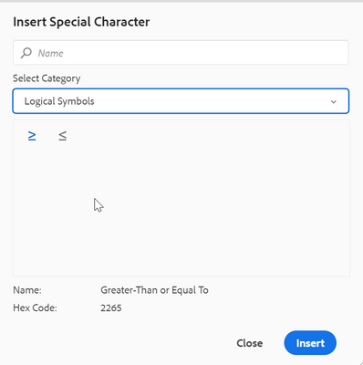

# Web エディターのツールバーでオンプレミス用の特殊文字を追加する方法

Web エディターのツールバーには、作成者が既に特殊文字を挿入できるショートカットオプションがあります。
以下のスクリーンショットにも同じことが見られます。


これらの文字のリストはここで設定可能です。 さらに文字を追加する必要がある場合は、次の手順に従います。

+ AEMにログインし、CRXDE Lite モードを開きます。

+ symbols.json ファイルを次の場所に作成します：&#39;/apps/fmdita/xmleditor/&#39; （デフォルトの場所を/libs/fmdita/clientlibs/clientlibs/xmleditor/symbols.jsonからコピーできます）

+ symbols.json ファイルの特殊文字定義を次のように追加します。

```
{
      "label": "Logical Symbols",
      "items": [
        {
          "name": "≥",
          "title": "Greater-Than or Equal To"
        },
        {
          "name": "≤",
          "title": "Smaller-Than or Equal To"
        }
      ]
}
```

symbols.json ファイルの構造を以下に示します。

+ &quot;label&quot;: &quot;Logical Symbols&quot;：特殊文字のカテゴリを指定します。 スニペットでは、「論理シンボル」という名前のカテゴリが定義されます。

+ &quot;items&quot;: カテゴリ内の特殊文字のコレクションを定義します。

+ &quot;name&quot;: &quot;≥&quot;, &quot;title&quot;: &quot;Greater-Than or Equal To&quot;：これは特殊文字の定義です。 「名前」ラベルで始まります。これは変更しないでください。 名前の後に特殊文字が続きます。 「タイトル」は、特殊文字のツールチップとして表示される特殊文字の名前またはタイトルです。

カテゴリ内で複数の特殊文字の定義を定義できます。

これにより、特殊文字ダイアログに別のカテゴリが追加されます。




>[!MORELIKETHIS]
>
>+ [&#x200B; インストールおよび設定ガイド &#x200B;](https://helpx.adobe.com/content/dam/help/en/xml-documentation-solution/3-6/XML-Documentation-for-Adobe-Experience-Manager_Installation-Configuration-Guide_EN.pdf)
