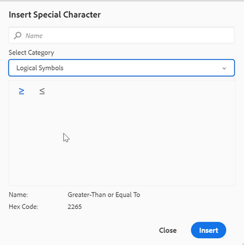

# Web エディターツールバーに特殊文字を追加する方法

Web エディターツールバーには、作成者が既に特殊文字を挿入できるショートカットオプションがあります。
同じことが以下のスクリーンショットに示されています。


これらの文字リストは、ここで設定できます。 これに文字を追加する必要がある場合は、次の手順に従います。

+ AEMにログインし、CRXDE Liteモードを開きます。

+ symbols.json ファイルを「/apps/fmdita/xmleditor/」の場所に作成します（デフォルトは「/libs/fmdita/clientlibs/clientlibs/xmleditor/symbols.json」の場所からコピーできます）。

+ symbols.json ファイルに次のように特殊文字の定義を追加します。

```
{
      "label": "Logical Symbols",
      "items": [
        {
          "name": "≥",
          "title": "Greater-Than or Equal To"
        },
        {
          "name": "≤",
          "title": "Smaller-Than or Equal To"
        }
      ]
}
```

symbols.json ファイルの構造を以下に説明します。

+ 「ラベル」:「論理シンボル」：特殊文字のカテゴリを指定します。 スニペットでは、「論理シンボル」という名前のカテゴリが定義されています。

+ 「items」：カテゴリ内の特殊文字のコレクションを定義します。

+ 「name」: 「≥」、「title」: 「Greater-Than or Equal To」：これは特殊文字の定義です。 「名前」ラベルで始まりますが、これは変更できません。 名前の後に特殊文字が続きます。 「タイトル」は、その特殊文字のツールチップとして表示される特殊文字の名前またはタイトルです。

1 つのカテゴリ内で複数の特殊文字の定義を定義できます。

これにより、特殊文字ダイアログに別のカテゴリが追加されます。




>[!MORELIKETHIS]
>
>+ [ インストールおよび設定ガイド ](https://helpx.adobe.com/content/dam/help/en/xml-documentation-solution/3-6/XML-Documentation-for-Adobe-Experience-Manager_Installation-Configuration-Guide_EN.pdf)
