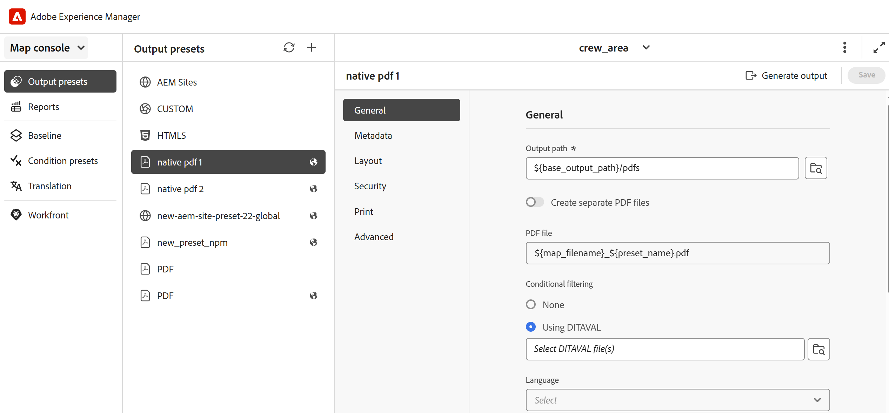
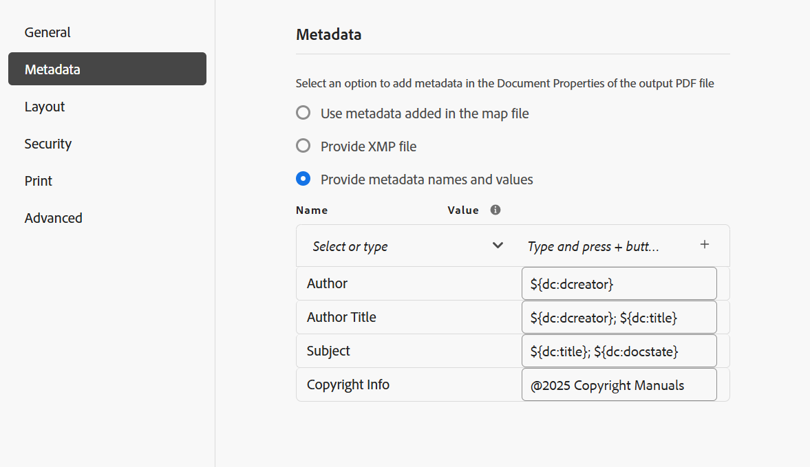

# ネイティブ PDF出力プリセット

コンテンツをオーサリングする際には、コンテンツが表示、編集、印刷用に最適化されていることを確認することが不可欠になります。 コンテンツのスタイル設定に W3C CSS3 などの標準や、サイズ、余白、向き、改ページ、ヘッダー、フッター、ページ番号などのページ定義プロパティの CSS ページメディア標準を使用すると、PDF ドキュメントのビューとレイアウトを設定して、一貫性と操作性を確保できます。 PDFのネイティブ公開機能は、これらの標準規格を使用してPDFを生成します。

PDFのネイティブパブリッシングでは、定義済みのテンプレートを使用して、コンテンツのレイアウトと構造の一貫性を確保したり、スタイルシートを適用して出力のルックアンドフィールを変更したり、PDFを最適化したり、プリンターマークを設定したり、スクリーンリーダーをサポートしたり、PDFの適合性を設定したり、フォントを埋め込んだりできます。

PDFのネイティブ公開を使用したPDFの生成には、次の 2 つの側面があります。

* テンプレートを使用して、コンテンツにスタイルを適用したり、ページレイアウトを設定したり、様々な設定を行ってPDFを微調整したりします。 作成者は、提供されるサンプルテンプレートを使用または変更することを選択したり、カスタムテンプレートを作成したり、公開者や開発者が使用する詳細設定オプションを設定したりできます。

* PDF出力プリセットを作成または設定して、PDFの設定をコントロールします。 PDF出力プリセットを作成したら、PDFを生成できます。

## 出力プリセットの作成

次の手順を実行して、マップ コンソールからPDF プリセットを作成します。

1. [Map コンソールで DITA マップファイルを開きます ](../user-guide/open-files-map-console.md)。

   また、「概要」セクションの **最近のファイル** ウィジェットからマップファイルにアクセスす [ こともでき ](../user-guide/intro-home-page.md#overview) す。 選択したマップ ファイルは、マップ コンソールで開きます。
1. 「**出力プリセット**」タブで、「+」アイコンを選択して出力プリセットを作成します。
1. **新規出力プリセット** ダイアログボックスの「タイプ」ドロップダウンから **0}PDF} を選択します。**
1. 「**名前**」フィールドに、このプリセットの名前を入力します。
1. **次を使用してPDFを生成** フィールドで **ネイティブPDF** を選択します。
1. 「**現在のフォルダープロファイルに追加**」オプションを選択して、現在のフォルダープロファイル内に出力プリセットを作成します。  は、フォルダープロファイルレベルのプリセットを示します。

   詳しくは、[ グローバルプロファイルおよびフォルダープロファイル出力プリセットの管理 ](../user-guide/web-editor-manage-output-presets.md) を参照してください。

1. 「**追加**」を選択します。

   PDFのプリセットが作成されます。

## ネイティブのPDF プリセット設定

プリセットを作成したら、ネイティブのPDF プリセット設定を指定します。 DITA-OT のプリセット設定オプションは、「**一般**」、「**メタデータ**」、「**レイアウト**」、「**セキュリティ**」、「**印刷**」、「**詳細** の各タブに分類されています。

**一般**

出力パスやPDF ファイル名などの基本的な出力設定を指定するために使用します。

| 設定 | 説明 |
| --- | --- |
| **出力パス** | PDF出力が保存されるAEM リポジトリ内のパス。 出力パスがプロジェクトフォルダー内に配置されていないことを確認します。 出力パスは、管理者が設定する変数 `${base_output_path}` を使用して設定されます。 出力パスを設定するには、使用しているサービスに応じて、[ クラウドサービスのベース出力場所を設定する ](../native-pdf/configure-base-location-cs.md) または [ オンプレミスのサービスのベース出力場所を設定する ](../native-pdf/configure-base-output-location.md) を表示します。   次の標準変数を使用して、出力パスを定義することもできます。 このオプションは、変数を 1 つまたは組み合わせて定義できます。  `${map_filename}`: DITA マップファイル名を使用して宛先パスを作成します。  `${map_title}`: DITA マップのタイトルを使用して宛先パスを作成します。  `${preset_name}`：出力プリセット名を使用して宛先パスを作成します。  `${language_code}`：マップファイルがある言語コードを使用して、宛先パスを作成します。  `${map_parentpath}`：マップファイルの完全パスを使用して、宛先パスを作成します。   `${path_after_langfolder}`：言語フォルダーの後のマップファイルのパスを使用して、宛先パスを作成します。 |
| **PDF ファイル** | PDFを保存するファイル名を指定します。 デフォルトでは、PDF ファイル名には、DITA マップ名とプリセット名が追加されます。 例えば、ditamap は「TestMap」で、プリセット名は「preset1」です。その場合、PDF のデフォルト名は「TestMap_preset1.pdf」になります。   次の標準変数を使用して、PDF ファイルを定義することもできます。 このオプションは、変数を 1 つまたは組み合わせて定義できます。 `${map_filename}` `${map_title}` `${preset_name}`   `${language_code}`。 |
| **次を使用して条件を適用** | 条件付きコンテンツの場合は、次のオプションから選択し、これらの条件に基づいてPDF出力を生成します。 <ul> <li> **適用なし** マップとソースコンテンツに条件を適用しない場合は、このオプションを選択します。 <li> **DITAVAL ファイル** 条件付きコンテンツを生成する DITAVAL ファイルを選択します。 参照ダイアログを使用するか、ファイルパスを手動で入力することにより、複数の DITAVAL ファイルを選択できます。 選択したファイルを削除するには、名前の横にある十字アイコンをクリックします。 無効なファイルが選択されると、「**無効な DITAVAL ファイルが選択されました**」というエラーメッセージが表示されます。    各 DITAVAL ファイルには、フィルタ条件やフラグ付けスタイルなど、様々なプロパティを含めることができます。 フラグを使用すると、開始フラグと終了フラグを使用してコンテンツを視覚的にマークできます。開始フラグには、画像や、太字や斜体などのテキスト書式を含めることができます。 条件が重なったりスタイルが競合している場合は、スタイルの競合の設定を使用して背景色を定義できます。 詳細については、[DITAVAL エディタの使用 ](../user-guide/ditaval-editor.md) を参照してください  。<li> **条件プリセット** ドロップダウンから条件プリセットを選択し、出力の公開中に条件を適用します。 このオプションは、DITA マップファイルに条件を追加した場合に表示されます。 条件付き設定は、DITA マップコンソールの「条件プリセット」タブで使用できます。 条件プリセットについて詳しくは、「[ 条件プリセットの使用 ](https://help.adobe.com/en_US/xml-documentation-for-adobe-experience-manager/index.html#t=DXML-master-map%2Fgenerate-output-use-condition-presets.html)」を参照してください。  </ul> |
| **ベースラインの使用** | 選択した DITA マップにベースラインを作成した場合、このオプションを選択して、公開するバージョンを指定します。 詳細については、「[ ベースラインの使用 ](https://help.adobe.com/en_US/xml-documentation-for-adobe-experience-manager/index.html#t=DXML-master-map%2Fgenerate-output-use-baseline-for-publishing.html) を参照してください。 |
| **公開済みバージョン間で変更バーを使用してPDFを作成する** | 次のオプションを使用して、2 つのバージョン間のコンテンツの違いを示すPDFを変更バーで作成します。    <ul><li> **前バージョンのベースライン** 現在のバージョンまたは別のベースラインと比較するベースライン・バージョンを選択します。 変更バーがPDFに表示され、変更されたコンテンツが示されます。 変更バーは、新しいコンテンツや改訂されたコンテンツを視覚的に識別する縦線です。 変更バーは、挿入、変更または削除されたコンテンツの左側に表示されます。  **注意**: 「ベースラインの使用 **** を選択し、発行するベースラインを選択した場合、比較は選択した 2 つのベースライン・バージョン間で行われます。 例えば、「ベースラインの使用」で「ベースライン・バージョン 1.3」を選択し、「前バージョンのベースライン **** **で「バージョン 1.1」を選択すると、ベースライン・バージョン 1.1 とベースライン・バージョン 1.3** の間で比較が行われます。 <li> **追加テキストを表示** 挿入したテキストを緑色と下線で表示する場合に選択します。 このオプションはデフォルトで選択されています。  <li> **削除されたテキストを表示** 選択すると、削除されたテキストが赤で表示され、取り消し線が付きます。 このオプションはデフォルトで選択されています。 **注意** スタイルシートを使用して、変更バー、挿入された内容、削除された内容のスタイル設定をカスタマイズすることもできます。 </ul> |
| **言語** | 出力を翻訳する言語を選択します。  **注**:「チャプターで表示」や「ページで表示」などの相互参照テキストは、言語変数によって制御されます。 変数は、`xml:lang` 属性を使用してトピックで定義された言語を使用します。 言語が指定されていない場合は、プリセットされた言語が使用されます。 両方が見つからない場合は、デフォルトで英語（en_US）になります。 |

| **生成後のワークフロー** |選択すると、AEMで設定されたすべてのワークフローを含むドロップダウンリストが表示されます。 PDF生成ワークフローの完了後に実行するワークフローを選択できます。|

**メタデータ**

メタデータは、コンテンツの説明または定義です。 メタデータは、コンテンツ管理に役立ち、インターネット上のファイルを検索するのに役立ちます。

「メタデータ」タブを使用して、作成者の名前、文書のタイトル、キーワード、著作権情報およびPDF出力用のその他のデータフィールドなどのメタデータフィールドを設定します。 PDF出力にカスタムメタデータを追加することもできます。

このメタデータは、出力PDFの **ドキュメントのプロパティ** 内にある **説明** タブのメタデータにマッピングされます。

出力プリセットから、**PDF** / **ネイティブPDF** / **メタデータ** を選択して、メタデータオプションを追加しカスタマイズします。
* **topicmeta に追加されたメタデータを使用**

  このオプションはデフォルトで選択されています。DITA マップの topicmeta 要素に追加したメタデータを使用して、PDF出力のメタデータフィールドに入力できます。

* **XMP ファイルを指定**

  また、[XMP](https://www.adobe.com/products/xmp.html) （Extensible Metadata Platform）ファイルを読み込んで、メタデータフィールドに直接入力することもできます。 サンプル XMP ファイルは、こちらからダウンロードできます。

[ダウンロード](assets/SampleXMP.xmp)

  または、Adobe Acrobatを使用してXMP ファイルを生成することもできます。
   1. Acrobatで **ファイル**/**プロパティ** を選択します。
   1. **説明** で「**追加のメタデータ**」を選択します。
   1. 左パネルの「**詳細**」を選択します。
   1. 「**保存**」を選択します。

  XMP ファイルがデバイスに保存されます。

* **メタデータの名前と値を指定**

   1. ドロップダウンから選択して名前を追加するか、「名前」フィールドに直接入力してカスタムメタデータを追加します。
   1. メタデータの値を入力し、「+」アイコンを選択します。
メタデータが、PDFのメタデータのリストに追加されます。

また、変数を使用してメタデータ値を定義することもできます。  DITA マップまたはブックマップファイル用に定義したメタデータを変数として使用できます。 メタデータは、DITA マップまたはブックマップファイルの `/jcr:content/metadata` ノードにあります。
変数を使用すると、その値がメタデータプロパティから選択されます。

変数を使用するには、`${<variable>}` 形式で定義する必要があります。

例えば、/`jcr:content/metadata` ノードで定義されているメタデータプロパティの 1 つは次のとおりです。
`dc:title`。 `${dc:title}` を指定できます。タイトルの値は最終的な出力で使用されます。

メタデータの定義には、変数を 1 つまたは組み合わせて使用できます。 例えば、`${dc:title} ${dc:docstate}` のようになります。変数と文字列の組み合わせを使用することもできます。  例えば、`View ${dc:title} in ${dc:language}` のように指定します。

言語変数を使用して、メタデータプロパティのローカライズ値を定義します。 選択した言語に応じて、ローカライズされた値がPDF出力で自動的に選択されます。 例えば、メタデータ値として「Author」を英語で、「Autorin」をドイツ語で印刷できます。

形式：`${lng:<variable name>}`。 例えば、`${lng:author-label}` の場合、`author-label` は言語変数です。

カーソルを合わせる 詳細を表示するには、オプションの近くを  リックします。

**レイアウト**

を使用して、ページレイアウトを設定し、PDF出力のページビューオプション（ページ表示やズームレベルなど）を指定します。

| 設定 | 説明 |
| --- | --- |
| **PDF テンプレート** | PDF テンプレートは、ページレイアウトやコンテンツのスタイル設定を定義し、様々な設定をPDF出力に適用するための明確な構造を提供します。 PDFテンプレートのドロップダウンオプションからを選択して、目的のテンプレートを選択します。   「テンプレートを参照 **を選択することもでき** す。 テンプレートを選択で  ます。 **PDF テンプレートを選択** ダイアログでは、サムネールをプレビューし、選択したテンプレートのタイトルと説明を表示することもできます。 |
| **ページ表示** | PDFを開いたときの表示方法を示す、ページビューのページ表示を使用します。 ページ表示ドロップダウンオプションからを選択して、優先する表示を選択します。 <ul><li> **デフォルト** ユーザーのマシン上のPDF ビューアのデフォルト設定に従って表示されます。   <li> **単一ページビュー** 一度に 1 ページずつ表示します。     <li> **1 ページのスクロール** 連続した縦列に 1 ページを表示します。   <li> **2 ページビュー** 2 ページを左右に並べて表示します。.  <li> **2 ページスクロール** 連続したスクロールで 2 ページを左右に並べて表示します。 </ul> |
| **ズーム** | 「」を選択すると、PDFを開いたときの表示方法を示すページビューのサイズを変更できます。  <ul><li> **デフォルト** ユーザーのマシン上のPDF ビューアのデフォルト設定に従って表示されます      <li> **100%** ページを実際のサイズで表示します。       <li> **ページに合わせる** ページの幅と高さが文書ウィンドウ内に収まるようにします。   .  <li> **ページ幅に合わせる** ページの幅を文書ウィンドウの幅に合わせます。   <li> **ページの高さに合わせる** ページの高さを文書ウィンドウの高さに合わせます。 </ul> |

**セキュリティ**

ファイルを開いて読み取るための制限を追加することで、PDFを保護します。 未認証のアクセスを避けるには、以下のオプションを使用します。

| 設定 | 説明 |
| --- | --- |
| **ドキュメントを開くためのパスワードを設定する** | 「」を選択して、PDF ファイルを表示するセキュアなパスワードを追加します。 「**ユーザーパスワード**」フィールドにパスワードを指定します。 PDFを開くには、このフィールドにパスワードを入力する必要があります。 |
| **ドキュメント制限の設定** | を選択して、ユーザーによるPDFとのやり取りを制限します。 以下の制限設定を機能させるには、「**所有者のパスワード**」フィールドにパスワードを指定します。  <ul><li> **印刷** PDFを印刷する場合に選択します。  <li> **ドラフト画質での印刷** PDFをより低い解像度で印刷する場合に選択します。   <li> **コンテンツのコピー** PDFのコンテンツをコピーする場合に選択します。     <li> **注釈** PDFにメモやコメントを追加できるようにするには、このオプションを選択します。  <li> **コンテンツの変更** 選択すると、ユーザーがPDFのコンテンツを変更できるようになります。  <li> **アクセシビリティのためのコンテンツコピー** スクリーンリーダーがPDFのコンテンツを読み取り、移動できるようにするには、これを選択します。   **文書の組み立て** ユーザーがPDFでページを挿入できるようにするには、このオプションを選択します。  **注意**：制限事項を変更するには、Adobe Acrobatのファイル/プロパティで所有者のパスワードを入力する必要があります。 |

**印刷**

>[!NOTE]
>
> Experience Manager Guides 5.0/2025.02.0 リリース以降、「印刷」セクションは **ネイティブのPDF出力プリセット** の一部になりました。 保存済みの印刷設定を含む既存のテンプレートの場合、印刷データはそのままですが、UI には表示されなくなったり、出力時に適用されなくなります。 引き続きこれらの設定を使用するには、ネイティブのPDF出力プリセット内で再設定する必要があります。

印刷工程の設定を指定して、トンボの割り当て、カラーモデルの選択、PDF出力の印刷に関連するプロパティの指定を行います。

* **トンボ**：印刷するドキュメントを準備すると、印刷時に適切な配置、トリミング、カラー選択ができるように、トンボがページ境界に追加されます。 印刷マークを選択すると、印刷中に切り取られるマークに合わせてページ境界が拡張されます。 PDF出力に次のトンボを表示することもできます。
   * **トリムマーク**：このオプションを選択すると、トリミング領域の各コーナーに、印刷後に用紙をトリミングする必要がある場所を示すマークが表示されます。
   * **裁ち落としマーク**：選択すると、ブリードボックスの各コーナーにマークが配置され、拡大画像のトリミング領域を示します。
   * **登録マーク**：カラードキュメントで様々な色分解を揃えるために、切り抜き領域の外側にマークを配置する場合に選択します。
   * **カラーバー**：印刷時に色の一貫性を維持し、インク濃度を調整するために、トリミング領域の外側に色のストリップを追加する場合に選択します。

  **線幅**、**線の色**、**裁ち落としボックス幅** の各オプションを使用して、選択したトンボのサイズを設定します。

* **メディアボックスサイズ**：これは、プリンターマークが占める拡張領域を含む全体のページサイズです。 ドロップダウンオプションを使用して、PDF出力のページサイズを選択するか、独自のカスタムサイズを作成します。

* **カラースペース**:PDF ドキュメントを印刷するためのカラースペースをRGBまたは CMYK から選択できます。 RGBを選択すると、生成されたPDFをデジタルで表示し、CMYK を物理印刷用に表示できます。 ドキュメントで定義されたカラーは、選択したカラースペースに変換されます。

* **ICC プロファイル**：ここでは、ICC プロファイルを指定することで、デバイス間のカラー精度を管理できます。 これにより、印刷出力で一貫したカラーレンダリングが保証されます。

この設定を構成するには、ICC プロファイル ファイルのパスをサーバー上で指定し、識別しやすい ICC プロファイル名を指定してください。 または、ICC プロファイルがオンラインに保存されている場合は、ファイルパスの代わりにその URL を指定できます。

>[!NOTE]
>
> CMYK カラースペースを使用する場合、PDF/A を作成するには ICC カラープロファイルが必要です。

<!--For more information on applying these print settings, see *Printing preferences*.-->

**詳細**

次のオプションを使用して、PDF の結合、圧縮の使用、準拠する規格の選択などを行うための詳細設定を指定します。

| 設定 | 説明 |
| --- | --- |
| **アクセシブル（タグ付き）PDFの作成** | タグ付きのPDFを生成する場合は、このオプションを選択します。 タグ付けされたPDFを使用すると、スクリーンリーダーでコンテンツ、ハイパーリンク、ブックマークなどを読み取ったり、移動したりすることが容易になります。 例えば、テーブルにタグが付けられている場合、スクリーンリーダーは、行やテキストだけでなく、テーブルを読み取っていることを認識します。 |
| **目次に含まれる PDF の結合** | このオプションを選択すると、既存の PDF がリソースファイルとして DITA マップに追加され、出力にマージされます。 PDF はマップで表される場所に挿入され、ページはそれに応じて増分されます。 |
| **使用中のフォントを埋め込む** | エンドユーザーのコンピューターにインストールされていない可能性のあるフォントを使用する場合は、このオプションを選択します。 このオプションを選択すると、使用されているフォントがPDFに埋め込まれ、フォントがコンピューターにインストールされていない場合でもPDFを意図したとおりに表示できるようになります。  **注意**：フォントは、フォントベンダーによって埋め込みが許可されている設定が含まれている場合にのみ埋め込むことができます。 フォントを埋め込む前に、必要な設定またはライセンスがあることを確認してください。 |
| **自動ハイフネーションを使用する** | 自動ハイフネーションを有効にすると、文法的に正しい位置にある単語がハイフンで区切られます。 |
| **JavaScriptを有効にする** | PDFを生成する前にコンテンツを動的に変換するために使用するJavaScript コードがある場合は、このオプションを有効にします。 |
| **マルチメディアファイルの埋め込み** | オーディオ、ビデオおよびインタラクティブコンテンツをPDFに含める場合は、このオプションを選択します。 |
| **PDFのサイズを最適化するには、完全圧縮を使用します**。 | 大きなPDFを圧縮または縮小する場合は、このオプションを選択します。 PDFを圧縮すると、ファイルの画質が低下する場合があることに注意してください。 |
| **画像圧縮を使用したPDFのサイズの最適化** | PDFで使用する画像のサイズを圧縮/縮小する場合は、このオプションを選択します。 画像を圧縮すると、画質が低下する場合があることに注意してください。 |
| **カスタム解像度（1 インチあたりのピクセル数）を使用** | これは、1 インチあたりのピクセル数のページ表示解像度です。 このオプションを選択すると表示されるフィールドに優先値を入力します。 デフォルト値は 96 ピクセル/インチです。 インチ単位でより多くのコンテンツを収めるには大きい値を設定し、インチ単位でコンテンツを収めるには小さい値を設定する場合は逆を設定します。 |
| **透かしを表示** | このオプションを選択すると、出力に透かしが重ねて表示されます。 テキスト ボックスに新しいテキスト文字列を任意の文字の大文字と小文字を区別して入力できます。    静的テキストまたは言語変数を使用して、透かしのローカライズ版を公開します。  選択した言語に応じて、ローカライズされた値がPDF出力で自動的に選択されます。 例えば、「Publisher」を透かしとして英語で、「Auture」をフランス語で印刷することができます。    形式：`${lng:<variable name>}`。 例えば、`$ {lng:publisher-label}` の場合、`publisher-label` は言語変数です。   にポインタを合わせる 詳細を表示するには、オプションの近くを  リックします。 |
| **MathML式を有効にする** | コンテンツに存在するMathMLの数式をレンダリングする場合は、このオプションを選択します。 それ以外の場合、数式はデフォルトで無視されます。 |
| **インタラクティブ PDF フォームの作成** | 生成されたPDF出力に、強化されたユーザー入力用のインタラクティブでカスタマイズ可能なPDF フォームフィールドを含める場合は、このオプションを選択します。 |
| **トラック変更を含める** | 生成されたPDFにトラッキングされた変更内容を含めて、確認や比較を簡単にする場合は、このオプションを選択します。 |
| **一時ファイルを保持** | PDFのネイティブ出力の生成時に作成された暫定HTML ファイルを保持する場合は、このオプションを選択します。 後で出力の生成後に一時ファイルをダウンロードできます。 ダウンロードしたファイルには、オーサー URL`system_config.xml` ローカル URL、パブリッシュ URL に関する情報を提供するファイルも含まれます。 これらの URL は、AEM外部化設定で設定され、`system_config.xml` ファイルに反映されます。 |
| **PDF準拠** | これは、PDFを保存して準拠を確認する標準です。 ドロップダウンから選択して、使用可能なPDF標準のリストから選択します。 サポートされている標準の詳細については、「[PDF標準について ](https://helpx.adobe.com/acrobat/using/pdf-conversion-settings.html#about_pdf_x_pdf_e_and_pdf_a_standards) を参照してください。 |
| **ファイルのプロパティ** | Native PDF公開に渡すメタデータを選択します。 ドロップダウンリストには、カスタムプロパティとデフォルトプロパティの両方が表示されます。 例えば、`dc:description`、`dc:language`、`dc:title`、`docstate` はデフォルトのプロパティですが、カスタムプロパティとして `author` を指定できます。 選択したメタデータプロパティは、Native PDFを使用して生成されたPDF ファイルに渡されます。   これらのプロパティは、`metadataList` に用意されている `/libs/fmdita/config/metadataList` ファイルから選択されます。   このファイルは `/apps/fmdita/config/metadataList` でオーバーレイできます。 |

<!--------------

### Additional notes for PDF output

**Download temporary files after generating the Native PDF output**

If you select the **Download temporary files** option in the Advanced settings, you can also download the interim HTML files created while generating the Native PDF output. Once you've generated the output, you can download the temporary files using the **Download temporary files** icon on the top bar. This feature helps you view your interim HTML styles and layouts and helps you correct or change your CSS styles according to your requirements.

>[!NOTE]
>
> The **Download temporary files**   icon appears only if you have generated the last PDF output using the preset wherein you have selected the option in the **Advanced** tab. 

**Use language variables**

AEM Guides also provides the support for language variables. Select **Language Variables**   in the left panel to define a localized version of the out-of-the-box labels like Note, Caution, and Warning or static text in the PDF output. For more details, view [Support for language variables](../native-pdf/native-pdf-language-variables.md).

**Support for Markdown documents**

Experience Manager Guides also provides support for your Markdown documents.  Markdown files are easy to author and also provide a variety of formatting options. Learn how to [author Markdown documents from the Editor](../user-guide/web-editor-markdown-topic.md). 

You can add the Markdown topics to your DITA map and generate the PDF output using the Native PDF output presets.  Learn how to configure or [create a PDF output preset](#create-a-pdf-output-preset-create-output-preset). 

--------------->